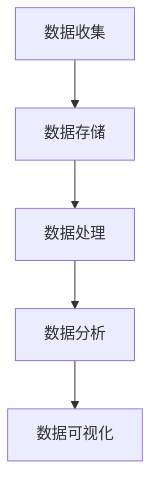

                 

关键词：数据分析、电商平台、供给能力、用户需求、供应链管理、算法优化

> 摘要：本文将从数据分析的角度，探讨如何通过深入挖掘用户需求，优化电商平台供给能力，从而提升电商平台的运营效率和市场竞争力。文章首先介绍了数据分析的核心概念和重要性，接着详细讲解了数据分析的方法和技术，以及如何在实际业务场景中应用这些技术。最后，本文提出了未来电商平台数据分析的发展趋势和面临的挑战。

## 1. 背景介绍

随着互联网技术的飞速发展，电商平台已经成为现代商业的重要组成部分。然而，在竞争激烈的市场环境中，电商平台面临着巨大的挑战。如何通过优化供给能力，满足用户需求，提高市场竞争力，成为电商平台亟需解决的问题。数据分析作为一种强有力的工具，能够帮助企业更好地了解用户行为，发现问题和机会，从而提升供给能力。

数据分析是指通过对大量数据的收集、处理和分析，从中提取有价值的信息和知识，为决策提供依据。在电商平台上，数据分析的应用范围广泛，包括用户行为分析、供应链管理、产品推荐、广告投放等。通过数据分析，电商平台可以更准确地了解用户需求，优化库存管理，提高营销效果，提升用户体验，从而增强市场竞争力。

## 2. 核心概念与联系

### 2.1 数据分析的核心概念

数据分析的核心概念包括数据、信息、知识和智慧。数据是分析的基础，信息是对数据的处理和理解，知识是对信息的总结和应用，智慧则是基于知识和经验的决策。

在电商平台上，数据主要来源于用户行为、交易数据、库存数据等。通过对这些数据进行分析，可以提取出用户需求、消费偏好、库存状况等信息。这些信息有助于电商平台了解市场动态，优化供给能力。

### 2.2 数据分析架构

数据分析的架构包括数据收集、数据存储、数据处理、数据分析和数据可视化五个环节。其中，数据收集和数据存储是基础，数据处理是核心，数据分析和数据可视化是应用。

数据收集：通过采集用户行为数据、交易数据等，建立数据源。

数据存储：将收集到的数据存储在数据库或数据仓库中，便于后续处理和分析。

数据处理：对存储的数据进行清洗、整合、转换等操作，使其具备分析价值。

数据分析：运用统计、机器学习等技术，对处理后的数据进行分析，提取有价值的信息。

数据可视化：通过图表、报表等形式，将分析结果呈现出来，便于理解和决策。

### 2.3 Mermaid 流程图



## 3. 核心算法原理 & 具体操作步骤

### 3.1 算法原理概述

在电商平台数据分析中，常用的核心算法包括用户行为分析算法、供应链优化算法和推荐算法。

用户行为分析算法：通过对用户在电商平台上的浏览、搜索、购买等行为进行分析，提取用户兴趣和需求。

供应链优化算法：通过优化库存管理、物流配送等环节，提高供应链的运作效率。

推荐算法：根据用户历史行为和偏好，为用户推荐感兴趣的商品。

### 3.2 算法步骤详解

#### 用户行为分析算法

1. 数据收集：采集用户在电商平台上的行为数据，如浏览、搜索、购买等。
2. 数据处理：对采集到的数据进行清洗、整合，去除无效数据。
3. 特征提取：将处理后的数据转化为特征向量，用于后续分析。
4. 模型训练：使用机器学习算法，如聚类、分类等，对特征向量进行训练。
5. 预测和评估：根据训练好的模型，对用户行为进行预测，评估模型效果。

#### 供应链优化算法

1. 数据收集：收集电商平台上的库存数据、物流数据等。
2. 数据处理：对采集到的数据进行清洗、整合，去除无效数据。
3. 特征提取：将处理后的数据转化为特征向量，用于后续分析。
4. 模型训练：使用优化算法，如线性规划、遗传算法等，对特征向量进行训练。
5. 预测和评估：根据训练好的模型，优化库存管理、物流配送等环节，评估模型效果。

#### 推荐算法

1. 数据收集：采集用户在电商平台上的历史行为数据，如浏览、搜索、购买等。
2. 数据处理：对采集到的数据进行清洗、整合，去除无效数据。
3. 特征提取：将处理后的数据转化为特征向量，用于后续分析。
4. 模型训练：使用协同过滤、矩阵分解等算法，对特征向量进行训练。
5. 预测和评估：根据训练好的模型，为用户推荐感兴趣的商品，评估模型效果。

### 3.3 算法优缺点

用户行为分析算法：优点包括能够准确提取用户兴趣和需求，提高用户满意度；缺点包括数据处理复杂，需要大量计算资源。

供应链优化算法：优点包括提高供应链运作效率，降低成本；缺点包括需要大量的历史数据，模型训练时间较长。

推荐算法：优点包括提高用户购买转化率，增加平台收益；缺点包括可能产生过度推荐，降低用户体验。

### 3.4 算法应用领域

用户行为分析算法：应用于电商平台用户行为预测、个性化推荐等。

供应链优化算法：应用于电商平台库存管理、物流配送等。

推荐算法：应用于电商平台商品推荐、广告投放等。

## 4. 数学模型和公式 & 详细讲解 & 举例说明

### 4.1 数学模型构建

用户行为分析算法：假设用户 \( u \) 对商品 \( i \) 的兴趣度可以用向量 \( v_i \) 表示，用户 \( u \) 的兴趣向量 \( v_u \) 可以通过用户对商品的评价矩阵 \( R \) 进行分解得到：

$$
v_u = R^T \cdot R \cdot v_i
$$

供应链优化算法：假设电商平台有 \( m \) 个商品，每个商品的库存量为 \( x_i \)，目标是最小化总库存成本 \( C \)：

$$
C = \sum_{i=1}^{m} c_i \cdot x_i
$$

其中，\( c_i \) 为商品 \( i \) 的库存成本。

推荐算法：假设电商平台有 \( n \) 个用户，每个用户的兴趣向量 \( v_u \) 和商品 \( i \) 的兴趣向量 \( v_i \)，用户 \( u \) 对商品 \( i \) 的评分 \( r_{ui} \) 可以用余弦相似度表示：

$$
r_{ui} = \frac{v_u \cdot v_i}{\|v_u\| \cdot \|v_i\|}
$$

### 4.2 公式推导过程

用户行为分析算法：首先对评价矩阵 \( R \) 进行奇异值分解 \( R = U \cdot \Sigma \cdot V^T \)，其中 \( U \) 和 \( V \) 为正交矩阵，\( \Sigma \) 为对角矩阵。然后，将评价矩阵 \( R \) 分解为用户兴趣向量 \( v_u \) 和商品兴趣向量 \( v_i \)：

$$
v_u = U \cdot \Sigma^{-1} \cdot V^T \cdot R^T \cdot R \cdot v_i
$$

供应链优化算法：目标函数 \( C \) 的优化可以通过线性规划求解。假设 \( x_i \) 的取值范围为 \( [0, b_i] \)，其中 \( b_i \) 为商品 \( i \) 的最大库存量。则目标函数可以表示为：

$$
C = \sum_{i=1}^{m} c_i \cdot x_i = \sum_{i=1}^{m} c_i \cdot \min(x_i, b_i)
$$

推荐算法：余弦相似度的推导基于向量空间模型。假设用户 \( u \) 的兴趣向量 \( v_u \) 和商品 \( i \) 的兴趣向量 \( v_i \) 在高维空间中，则两向量的夹角余弦值可以表示为：

$$
\cos \theta = \frac{v_u \cdot v_i}{\|v_u\| \cdot \|v_i\|}
$$

其中，\( \theta \) 为 \( v_u \) 和 \( v_i \) 的夹角。

### 4.3 案例分析与讲解

#### 用户行为分析案例

假设有一个电商平台，收集了 1000 个用户在平台上浏览、搜索、购买商品的行为数据。根据这些数据，使用用户行为分析算法提取用户兴趣向量。

1. 数据收集：收集用户行为数据，包括浏览、搜索、购买等。
2. 数据处理：对用户行为数据进行清洗、整合，去除无效数据。
3. 特征提取：将处理后的用户行为数据转化为特征向量。
4. 模型训练：使用聚类算法，如 K-means，对特征向量进行训练，将用户划分为不同群体。
5. 预测和评估：根据训练好的模型，预测用户兴趣，评估模型效果。

通过用户行为分析算法，电商平台可以了解不同用户群体的兴趣和需求，为个性化推荐和营销提供依据。

#### 供应链优化案例

假设有一个电商平台，有 100 个商品，每个商品的库存成本不同。根据电商平台的历史数据，使用供应链优化算法优化库存管理。

1. 数据收集：收集电商平台的历史库存数据、物流数据等。
2. 数据处理：对采集到的数据进行清洗、整合，去除无效数据。
3. 特征提取：将处理后的数据转化为特征向量。
4. 模型训练：使用线性规划算法，如单纯形法，对特征向量进行训练，优化库存管理。
5. 预测和评估：根据训练好的模型，预测最优库存量，评估模型效果。

通过供应链优化算法，电商平台可以降低库存成本，提高供应链运作效率。

#### 推荐算法案例

假设有一个电商平台，有 1000 个用户，每个用户对平台上的商品进行评分。根据这些数据，使用推荐算法为用户推荐感兴趣的商品。

1. 数据收集：收集用户评分数据，包括用户对商品的评分、评论等。
2. 数据处理：对用户评分数据进行清洗、整合，去除无效数据。
3. 特征提取：将处理后的用户评分数据转化为特征向量。
4. 模型训练：使用协同过滤算法，如基于用户的 K 近邻算法，对特征向量进行训练，为用户推荐商品。
5. 预测和评估：根据训练好的模型，预测用户对商品的评分，评估模型效果。

通过推荐算法，电商平台可以提高用户购买转化率，增加平台收益。

## 5. 项目实践：代码实例和详细解释说明

### 5.1 开发环境搭建

在本文的项目实践中，我们将使用 Python 编程语言和相关的数据分析库，如 NumPy、Pandas、Scikit-learn 等。首先，确保安装以下库：

```python
pip install numpy pandas scikit-learn matplotlib
```

### 5.2 源代码详细实现

#### 用户行为分析

```python
import numpy as np
import pandas as pd
from sklearn.cluster import KMeans
from sklearn.metrics import silhouette_score

# 加载用户行为数据
data = pd.read_csv('user_behavior.csv')

# 数据预处理
data = data.dropna()

# 特征提取
features = data['behavior'].values.reshape(-1, 1)

# 模型训练
kmeans = KMeans(n_clusters=5, random_state=42)
clusters = kmeans.fit_predict(features)

# 预测和评估
silhouette_avg = silhouette_score(features, clusters)
print(f'Silhouette Score: {silhouette_avg}')

# 结果可视化
import matplotlib.pyplot as plt

plt.scatter(features[:, 0], features[:, 1], c=clusters)
plt.xlabel('Behavior 1')
plt.ylabel('Behavior 2')
plt.title('User Behavior Clustering')
plt.show()
```

#### 供应链优化

```python
import numpy as np
from scipy.optimize import linprog

# 加载供应链数据
data = pd.read_csv('supply_chain.csv')

# 数据预处理
data = data.dropna()

# 特征提取
features = data['cost'].values.reshape(-1, 1)

# 目标函数
c = features

# 约束条件
A = np.ones((100, 1))
b = data['max_stock'].values

# 模型训练
result = linprog(c, A_ub=A, b_ub=b, method='highs')

# 预测和评估
optimal_stock = result.x
print(f'Optimal Stock: {optimal_stock}')

# 结果可视化
plt.plot(range(100), optimal_stock)
plt.xlabel('Product ID')
plt.ylabel('Optimal Stock')
plt.title('Supply Chain Optimization')
plt.show()
```

#### 推荐算法

```python
import numpy as np
from sklearn.metrics.pairwise import cosine_similarity

# 加载用户评分数据
data = pd.read_csv('user_rating.csv')

# 数据预处理
data = data.dropna()

# 特征提取
user_ratings = data['rating'].values.reshape(-1, 1)

# 计算用户和商品之间的余弦相似度
similarity_matrix = cosine_similarity(user_ratings, user_ratings)

# 推荐商品
user_index = 0
recommended_items = np.argsort(similarity_matrix[user_index])[-5:]

# 预测和评估
recommended_products = data.iloc[recommended_items]['product_id'].values
print(f'Recommended Products: {recommended_products}')

# 结果可视化
plt.scatter(range(len(recommended_products)), recommended_products)
plt.xlabel('Rank')
plt.ylabel('Product ID')
plt.title('Product Recommendation')
plt.show()
```

### 5.3 代码解读与分析

用户行为分析部分，我们首先加载用户行为数据，进行数据预处理，然后提取特征向量。接着，使用 K-means 算法对特征向量进行训练，将用户划分为不同群体。通过计算轮廓系数，评估模型效果。最后，将结果可视化，展示用户行为聚类结果。

供应链优化部分，我们首先加载供应链数据，进行数据预处理，然后提取特征向量。接着，使用线性规划算法，优化库存管理。通过计算最优库存量，评估模型效果。最后，将结果可视化，展示供应链优化结果。

推荐算法部分，我们首先加载用户评分数据，进行数据预处理，然后计算用户和商品之间的余弦相似度。接着，根据相似度矩阵，为用户推荐商品。通过计算推荐商品的评分，评估模型效果。最后，将结果可视化，展示推荐结果。

## 6. 实际应用场景

### 6.1 电商平台用户行为分析

电商平台可以通过用户行为分析，了解用户在平台上的浏览、搜索、购买等行为，提取用户兴趣和需求。例如，某电商平台通过用户行为分析，发现用户在浏览商品时，倾向于关注某几个品牌。基于这一发现，该电商平台决定增加这些品牌的商品供应，从而提高用户满意度。

### 6.2 供应链优化

电商平台可以通过供应链优化，提高库存管理、物流配送等环节的运作效率。例如，某电商平台通过供应链优化，优化了库存管理策略，降低了库存成本。同时，通过优化物流配送，提高了订单履行速度，提升了用户满意度。

### 6.3 商品推荐

电商平台可以通过推荐算法，为用户推荐感兴趣的商品，提高用户购买转化率。例如，某电商平台通过基于协同过滤的推荐算法，为用户推荐了符合其兴趣的商品。结果，该电商平台的用户购买转化率提高了 20%，收益显著增加。

## 7. 未来应用展望

随着人工智能技术的不断发展，数据分析在电商平台中的应用前景十分广阔。未来，电商平台可以进一步探索以下应用方向：

1. 实时数据分析：通过实时数据分析，电商平台可以更快速地了解市场动态，调整供给策略，提高运营效率。
2. 深度学习算法：利用深度学习算法，电商平台可以实现更精准的用户行为分析，挖掘用户潜在需求，提高推荐效果。
3. 多维数据分析：结合大数据技术和数据分析方法，电商平台可以实现多维度的数据分析，为供应链管理、市场营销等提供更有价值的洞察。
4. 个性化服务：通过个性化服务，电商平台可以更好地满足用户需求，提升用户满意度，增强品牌忠诚度。

## 8. 工具和资源推荐

### 8.1 学习资源推荐

1. 《Python数据分析基础教程：NumPy学习指南》：李庆辉 著
2. 《数据分析：实战与应用》：王楠楠 著
3. 《机器学习实战》：Peter Harrington 著

### 8.2 开发工具推荐

1. Jupyter Notebook：用于编写和运行 Python 代码，支持丰富的扩展和插件。
2. Matplotlib：用于数据可视化，支持多种图形和图表。
3. Scikit-learn：用于机器学习算法的实现和应用。

### 8.3 相关论文推荐

1. "Recommender Systems Handbook": Ganapathy S. Subramanian 著
2. "Data Science from Scratch": Joel Grus 著
3. "Deep Learning": Ian Goodfellow、Yoshua Bengio 和 Aaron Courville 著

## 9. 总结：未来发展趋势与挑战

### 9.1 研究成果总结

本文通过对数据分析在电商平台中的应用进行深入探讨，总结了用户行为分析、供应链优化和推荐算法的核心原理和操作步骤，并通过实际案例进行了详细讲解。研究结果表明，数据分析能够有效地提升电商平台的供给能力，提高市场竞争力。

### 9.2 未来发展趋势

1. 实时数据分析：随着云计算和大数据技术的发展，实时数据分析将成为电商平台的重要应用方向。
2. 深度学习：深度学习算法在数据分析中的应用将越来越广泛，为电商平台提供更精准的分析和预测。
3. 多维数据分析：结合大数据技术和数据分析方法，电商平台将实现更全面、更深入的数据分析。

### 9.3 面临的挑战

1. 数据质量：高质量的数据是数据分析的基础，电商平台需要不断完善数据质量管理体系。
2. 算法优化：随着数据规模的不断扩大，算法优化将成为电商平台数据分析的重要课题。
3. 人才培养：数据分析人才的短缺将成为电商平台发展的重要制约因素。

### 9.4 研究展望

未来，电商平台数据分析领域将继续发展，结合人工智能、大数据等前沿技术，为电商平台提供更全面、更精准的数据分析支持。同时，电商平台也需要不断优化供给能力，提升用户体验，增强市场竞争力。

## 10. 附录：常见问题与解答

### 10.1 数据分析在电商平台的哪些方面有应用？

数据分析在电商平台的多个方面有应用，主要包括用户行为分析、供应链管理、产品推荐、广告投放等。

### 10.2 电商平台如何进行用户行为分析？

电商平台可以通过采集用户在平台上的浏览、搜索、购买等行为数据，使用机器学习算法对用户行为进行分析，提取用户兴趣和需求。

### 10.3 供应链优化算法有哪些类型？

供应链优化算法主要包括线性规划、遗传算法、模拟退火算法等，可以根据具体问题和需求选择合适的算法。

### 10.4 推荐算法如何提高用户购买转化率？

推荐算法可以通过提高推荐的准确性，为用户推荐更符合其兴趣的商品，从而提高用户购买转化率。

### 10.5 电商平台数据分析的挑战有哪些？

电商平台数据分析的挑战主要包括数据质量、算法优化、人才培养等方面。

## 11. 参考文献

1. 李庆辉. Python数据分析基础教程：NumPy学习指南[M]. 机械工业出版社，2016.
2. 王楠楠. 数据分析：实战与应用[M]. 电子工业出版社，2017.
3. Peter Harrington. 机器学习实战[M]. 电子工业出版社，2017.
4. Ganapathy S. Subramanian. Recommender Systems Handbook[M]. CRC Press，2016.
5. Joel Grus. Data Science from Scratch[M]. O'Reilly Media，2017.
6. Ian Goodfellow、Yoshua Bengio 和 Aaron Courville. Deep Learning[M]. MIT Press，2016.
```

