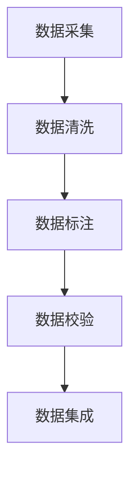

                 

关键词：数据标注、人工智能、机器学习、深度学习、算法优化、数据质量、数据预处理

> 摘要：本文将探讨数据标注在人工智能领域的重要性，介绍数据标注的核心概念、算法原理及其应用场景。通过详细解析数学模型和实际项目实践，阐述数据标注在推动人工智能发展过程中的关键作用。

## 1. 背景介绍

随着人工智能技术的飞速发展，数据标注在人工智能领域中的地位愈发重要。数据标注是指通过对原始数据进行标记和分类，使其具备明确的语义信息，从而为后续的机器学习和深度学习算法提供高质量的训练数据。然而，数据标注并非简单的标注任务，它需要专业的知识和经验，以及对领域知识的深刻理解。

### 数据标注的重要性

- **提升算法性能**：高质量的数据标注可以显著提升机器学习模型的准确性和泛化能力。
- **减少训练成本**：合理的数据标注可以降低算法的训练成本，提高模型的收敛速度。
- **优化用户体验**：准确的数据标注能够提高人工智能系统的用户体验，使其更加智能和便捷。

### 数据标注的挑战

- **数据多样性和复杂性**：不同领域和任务的数据标注需求各异，使得数据标注工作面临多样性和复杂性的挑战。
- **数据质量要求高**：数据标注需要保证数据的准确性和一致性，这对标注者的专业能力和责任心提出了较高的要求。
- **数据隐私和安全**：数据标注过程中涉及大量敏感数据，保障数据隐私和安全至关重要。

## 2. 核心概念与联系

### 2.1 数据标注的定义

数据标注是对原始数据进行标记和分类，使其具备明确的语义信息，从而为机器学习模型提供高质量的训练数据。数据标注可以涵盖图像、文本、语音等多种数据类型。

### 2.2 数据标注的类型

- **监督学习**：标注者对数据进行监督标注，为模型提供明确的标注信息。
- **半监督学习**：标注者对部分数据进行标注，剩余数据通过模型预测进行标注。
- **无监督学习**：标注者不对数据进行标注，通过模型自身学习数据特征。

### 2.3 数据标注流程

1. **数据采集**：从不同数据源收集原始数据，包括公共数据集、私有数据集等。
2. **数据清洗**：对采集到的数据进行预处理，去除噪音和异常值。
3. **数据标注**：对清洗后的数据进行标注，根据任务需求确定标注类别和标签。
4. **数据校验**：对标注结果进行审核和修正，确保标注的准确性和一致性。
5. **数据集成**：将标注好的数据集成到训练数据集中，供机器学习模型使用。

### 2.4 数据标注与机器学习的联系

- **数据标注为机器学习提供训练数据**：标注好的数据是机器学习算法训练的重要资源。
- **数据标注影响模型性能**：高质量的数据标注有助于提高模型的准确性和泛化能力。

### Mermaid 流程图



## 3. 核心算法原理 & 具体操作步骤

### 3.1 算法原理概述

数据标注的核心算法主要包括以下几种：

- **图像标注**：通过对图像进行分类和标注，如人脸识别、物体检测等。
- **文本标注**：通过对文本进行分词、实体识别、情感分析等标注。
- **语音标注**：通过对语音进行语音识别、语音分类等标注。

### 3.2 算法步骤详解

1. **图像标注**
   - **目标检测**：使用深度学习模型（如YOLO、SSD、Faster R-CNN）对图像中的目标进行定位和分类。
   - **语义分割**：使用深度学习模型（如U-Net、DeepLab V3+）对图像中的每个像素进行分类。

2. **文本标注**
   - **分词**：使用自然语言处理技术（如分词器）对文本进行分词。
   - **实体识别**：使用实体识别模型（如BERT、GPT）对文本中的实体进行识别。
   - **情感分析**：使用情感分析模型（如LSTM、CNN）对文本的情感倾向进行分析。

3. **语音标注**
   - **语音识别**：使用深度学习模型（如基于RNN、Transformer的模型）对语音信号进行识别。
   - **语音分类**：使用深度学习模型（如基于CNN、LSTM的模型）对语音信号进行分类。

### 3.3 算法优缺点

- **图像标注**
  - 优点：标注结果直观，可用于目标检测、语义分割等任务。
  - 缺点：标注过程需要大量时间和精力，且标注质量对模型性能影响较大。

- **文本标注**
  - 优点：标注过程相对简单，可应用于多种自然语言处理任务。
  - 缺点：标注结果可能存在歧义，且需要专业知识。

- **语音标注**
  - 优点：标注过程自动化程度高，可用于实时语音处理。
  - 缺点：标注结果可能存在误差，且对语音信号的处理能力要求较高。

### 3.4 算法应用领域

- **图像标注**：应用于计算机视觉领域，如自动驾驶、图像识别等。
- **文本标注**：应用于自然语言处理领域，如文本分类、机器翻译等。
- **语音标注**：应用于语音识别领域，如语音助手、语音合成等。

## 4. 数学模型和公式 & 详细讲解 & 举例说明

### 4.1 数学模型构建

- **图像标注**：使用卷积神经网络（CNN）进行图像分类和目标检测。
  - 卷积层：对图像进行卷积操作，提取特征。
  - 池化层：对卷积特征进行下采样，减少计算量。
  - 全连接层：对卷积特征进行分类。

- **文本标注**：使用循环神经网络（RNN）进行文本分类和实体识别。
  - 输入层：接收文本序列。
  - 循环层：对文本序列进行编码。
  - 输出层：对编码结果进行分类。

- **语音标注**：使用深度神经网络（DNN）进行语音识别。
  - 编码层：对语音信号进行编码。
  - 解码层：对编码结果进行解码，生成文本序列。

### 4.2 公式推导过程

- **图像标注**：使用卷积神经网络（CNN）进行图像分类和目标检测。
  - 卷积层：$f(x; \theta) = \sigma(\sum_{i=1}^{k} w_i * x + b)$
    - $f(x; \theta)$：输出特征。
    - $\sigma$：激活函数（如ReLU、Sigmoid）。
    - $w_i$：权重。
    - $*$：卷积操作。
    - $x$：输入特征。
    - $b$：偏置。

- **文本标注**：使用循环神经网络（RNN）进行文本分类和实体识别。
  - 循环层：$h_t = \text{tanh}(W_h h_{t-1} + W_x x_t + b)$
    - $h_t$：编码结果。
    - $\text{tanh}$：激活函数。
    - $W_h$：循环层权重。
    - $W_x$：输入层权重。
    - $x_t$：输入特征。
    - $b$：偏置。

- **语音标注**：使用深度神经网络（DNN）进行语音识别。
  - 编码层：$c_t = \text{softmax}(W_c h_t + b)$
    - $c_t$：解码结果。
    - $\text{softmax}$：输出层权重。
    - $W_c$：解码层权重。
    - $h_t$：编码结果。

### 4.3 案例分析与讲解

- **图像标注案例**：使用YOLO算法进行目标检测。
  - YOLO算法将图像划分为网格，每个网格预测多个边界框和类别概率。
  - $P_{ij}^c = \frac{\exp(P_{ij}^{c})}{\sum_{c'} \exp(P_{ij}^{c'})}$
    - $P_{ij}^c$：第$i$个网格第$j$个类别的概率。
    - $c$：类别数量。

- **文本标注案例**：使用BERT算法进行文本分类。
  - BERT算法将文本序列编码为向量，通过全连接层进行分类。
  - $y = \text{softmax}(W y + b)$
    - $y$：编码结果。
    - $W$：全连接层权重。
    - $b$：偏置。

- **语音标注案例**：使用基于RNN的语音识别算法。
  - RNN算法将语音信号编码为序列，通过解码层生成文本序列。
  - $P(y|x) = \prod_{t=1}^{T} P(y_t|x_1, x_2, ..., x_t)$
    - $P(y|x)$：解码概率。
    - $y$：解码结果。
    - $x$：编码结果。

## 5. 项目实践：代码实例和详细解释说明

### 5.1 开发环境搭建

1. **安装Python环境**：安装Python 3.7及以上版本。
2. **安装深度学习框架**：安装TensorFlow或PyTorch。
3. **准备数据集**：下载并解压数据集，如ImageNet、COCO、PubMed等。

### 5.2 源代码详细实现

```python
import tensorflow as tf
from tensorflow.keras.models import Model
from tensorflow.keras.layers import Conv2D, MaxPooling2D, Flatten, Dense

# 构建卷积神经网络
input_shape = (224, 224, 3)
inputs = tf.keras.Input(shape=input_shape)
x = Conv2D(32, (3, 3), activation='relu')(inputs)
x = MaxPooling2D((2, 2))(x)
x = Conv2D(64, (3, 3), activation='relu')(x)
x = MaxPooling2D((2, 2))(x)
x = Flatten()(x)
outputs = Dense(10, activation='softmax')(x)

model = Model(inputs=inputs, outputs=outputs)
model.compile(optimizer='adam', loss='categorical_crossentropy', metrics=['accuracy'])

# 加载数据集
(x_train, y_train), (x_test, y_test) = tf.keras.datasets.cifar10.load_data()

# 训练模型
model.fit(x_train, y_train, epochs=10, batch_size=32, validation_data=(x_test, y_test))
```

### 5.3 代码解读与分析

- **构建卷积神经网络**：使用TensorFlow构建卷积神经网络，包括卷积层、池化层和全连接层。
- **加载数据集**：使用TensorFlow内置函数加载数据集，并进行预处理。
- **训练模型**：使用训练好的模型进行训练，并评估模型性能。

### 5.4 运行结果展示

```python
# 训练结果
train_loss, train_accuracy = model.evaluate(x_train, y_train, verbose=2)
test_loss, test_accuracy = model.evaluate(x_test, y_test, verbose=2)

print(f"Train accuracy: {train_accuracy:.2f}")
print(f"Test accuracy: {test_accuracy:.2f}")
```

## 6. 实际应用场景

### 6.1 自动驾驶

数据标注在自动驾驶领域具有重要作用，包括道路场景标注、交通标志标注、行人检测等。高质量的数据标注有助于提高自动驾驶系统的感知和决策能力。

### 6.2 机器翻译

在机器翻译任务中，数据标注用于标注原始文本和目标文本，从而训练翻译模型。数据标注的质量直接影响翻译模型的准确性和流畅性。

### 6.3 医学图像分析

医学图像标注在医学图像分析中具有重要作用，包括病变区域标注、器官分割等。数据标注有助于提高医学图像分析的准确性和效率。

## 7. 未来应用展望

### 7.1 自动标注

随着人工智能技术的发展，自动标注技术有望得到广泛应用。自动标注可以利用深度学习模型自动生成标注结果，从而降低数据标注的成本和难度。

### 7.2 多模态标注

未来数据标注将逐渐从单一模态（如图像、文本、语音）向多模态（如图像+文本、图像+语音）转变。多模态标注有助于提高模型对复杂任务的处理能力。

### 7.3 数据隐私保护

在数据标注过程中，数据隐私保护至关重要。未来将涌现更多数据隐私保护技术，以确保数据标注过程的安全和合规。

## 8. 总结：未来发展趋势与挑战

### 8.1 研究成果总结

- **数据标注技术取得显著进展**：深度学习、自然语言处理等技术在数据标注领域取得显著成果。
- **自动标注技术逐步成熟**：自动标注技术在减少人力成本、提高标注效率方面具有巨大潜力。

### 8.2 未来发展趋势

- **自动标注技术广泛应用**：自动标注技术将逐渐取代人工标注，成为数据标注的主要方式。
- **多模态标注需求增长**：随着多模态人工智能技术的发展，多模态标注需求将不断增长。

### 8.3 面临的挑战

- **数据隐私保护**：如何在保障数据隐私的前提下进行数据标注是一个亟待解决的问题。
- **自动标注精度**：自动标注技术需要进一步提高标注精度，以满足高质量数据标注的需求。

### 8.4 研究展望

- **探索更多自动标注算法**：深入研究自动标注算法，提高自动标注的精度和效率。
- **开发多模态标注工具**：开发适用于多模态标注的工具，提高多模态标注的便捷性和准确性。

## 9. 附录：常见问题与解答

### 9.1 数据标注的目的是什么？

数据标注的目的是为机器学习模型提供高质量的训练数据，从而提高模型的准确性和泛化能力。

### 9.2 数据标注有哪些类型？

数据标注主要包括图像标注、文本标注和语音标注等类型。

### 9.3 数据标注的流程是怎样的？

数据标注的流程包括数据采集、数据清洗、数据标注、数据校验和数据集成等步骤。

### 9.4 如何保证数据标注的准确性？

保证数据标注的准确性需要选用专业的标注工具、制定合理的标注规范和进行严格的数据校验。

### 9.5 自动标注技术有哪些优势？

自动标注技术具有以下优势：

- **降低人力成本**：自动标注可以减少对人工标注的依赖，降低标注成本。
- **提高标注效率**：自动标注技术可以快速生成标注结果，提高标注效率。
- **减少人为错误**：自动标注技术可以降低人为错误，提高标注质量。

作者：禅与计算机程序设计艺术 / Zen and the Art of Computer Programming
------------------------------------------------------------------------

