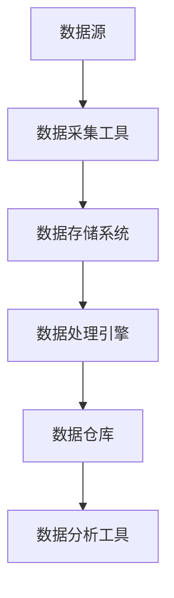

                 

关键词：数据湖泊、软件2.0、数据管理、架构设计、数据处理、数据存储、云计算、分布式系统

## 摘要

本文将深入探讨数据湖泊架构，这一新兴的数据管理范式，它代表了软件2.0时代的数据管理革命。数据湖泊架构的核心在于其能够以一种灵活、高效的方式存储和管理大量结构化和非结构化数据，为现代企业提供了强大的数据处理能力。本文将首先介绍数据湖泊的背景和概念，然后详细分析其架构和设计原则，探讨核心算法原理及其应用领域，最后讨论其数学模型和公式，并通过具体的项目实践进行代码实例和详细解释。文章还将展望数据湖泊在未来的应用场景和挑战，并推荐相关学习资源和开发工具。

## 1. 背景介绍

在数字经济的浪潮下，数据已经成为企业最重要的资产之一。传统的数据仓库和关系型数据库在面对海量、多样化、快速变化的数据时，逐渐暴露出其局限性。这促使了数据湖泊（Data Lake）架构的诞生。数据湖泊架构是一种以存储和管理大规模结构化和非结构化数据为核心的数据管理范式，它能够提供更加灵活和高效的数据处理能力。

数据湖泊的概念起源于大数据处理领域。传统的数据仓库模型要求数据在进入仓库之前必须进行清洗、转换和建模，这限制了数据的多样性和灵活性。而数据湖泊则采用了一种更加原始、未经处理的方式存储数据，允许各种类型的数据以原始格式直接存储，包括文本、图像、音频、视频等。这种设计理念使得数据湖泊能够更好地适应数据驱动的业务需求，提高数据的价值和利用率。

数据湖泊架构的出现并非一蹴而就，而是经历了从数据仓库到大数据平台的演进过程。随着云计算、分布式存储和计算技术的发展，数据湖泊架构逐渐成为一种主流的数据管理解决方案。它不仅能够处理大规模数据，还能够实现数据的实时分析和处理，为企业提供了强大的数据洞察力和决策支持。

## 2. 核心概念与联系

### 2.1 数据湖泊的组成部分

数据湖泊架构通常由以下几个核心组成部分构成：

1. **数据源**：数据湖泊可以从多种数据源获取数据，包括关系型数据库、NoSQL数据库、API、日志文件等。
2. **数据存储**：数据湖泊使用分布式存储系统来存储数据，如Hadoop的HDFS、Amazon S3等。
3. **数据处理**：数据湖泊通常配备有强大的数据处理能力，如Apache Spark、Flink等，用于数据的清洗、转换和分析。
4. **数据仓库**：数据湖泊中的数据可以导入到数据仓库中，进行进一步的分析和报表生成。
5. **元数据管理**：数据湖泊需要管理大量的元数据，包括数据源、数据类型、数据格式、数据质量等。

### 2.2 数据湖泊与大数据平台的联系

数据湖泊是大数据平台的一个重要组成部分，它与其他大数据组件紧密相连，形成一个完整的生态系统。例如：

1. **数据采集**：数据湖泊可以通过Kafka、Flume等数据采集工具，实时获取各种类型的数据。
2. **数据处理**：数据湖泊结合了Apache Spark、Flink等大数据处理引擎，能够对数据进行实时处理和批量处理。
3. **数据存储**：数据湖泊使用分布式存储系统进行数据存储，如HDFS、Alluxio等。
4. **数据仓库**：数据湖泊中的数据可以导入到数据仓库中，如Amazon Redshift、Google BigQuery等，进行进一步的分析和报表生成。

### 2.3 数据湖泊与云计算的关系

数据湖泊架构高度依赖云计算环境，特别是在公有云和混合云环境中。云计算提供了强大的计算资源和存储能力，使得数据湖泊能够灵活扩展，满足不同规模和类型的数据处理需求。例如：

1. **AWS**：提供了Amazon S3作为数据湖泊的存储服务，以及Amazon EMR、AWS Lambda等服务，用于数据处理和实时分析。
2. **Azure**：提供了Azure Data Lake Storage作为数据湖泊的存储服务，以及Azure HDInsight、Azure Stream Analytics等服务，用于数据处理和实时分析。
3. **Google Cloud**：提供了Google Cloud Storage作为数据湖泊的存储服务，以及Google BigQuery、Google Dataflow等服务，用于数据处理和实时分析。

### 2.4 Mermaid 流程图

以下是一个简化的数据湖泊架构的Mermaid流程图，展示了数据从数据源到数据仓库的流动过程：



### 2.5 数据湖泊架构的优点和挑战

**优点**：

- **灵活性**：能够存储各种类型的数据，包括结构化和非结构化数据。
- **可扩展性**：基于分布式存储和计算，能够灵活扩展以应对大规模数据处理需求。
- **高吞吐量**：支持海量数据的实时处理和批量处理。
- **成本效益**：云计算环境提供了灵活的计费模式，降低了数据处理的成本。

**挑战**：

- **数据质量管理**：未经处理的数据可能存在质量问题和一致性挑战。
- **数据安全与隐私**：数据存储和传输过程中需要确保数据的安全性和隐私性。
- **数据治理**：需要有效的数据治理策略来管理大量的数据。

## 3. 核心算法原理 & 具体操作步骤

### 3.1 算法原理概述

数据湖泊架构中的核心算法主要包括数据采集、数据处理和数据存储。以下是这些算法的基本原理：

- **数据采集**：使用ETL（提取、转换、加载）工具，从各种数据源提取数据，进行初步的清洗和转换，然后加载到数据存储系统中。
- **数据处理**：使用分布式计算框架，如Apache Spark、Flink等，对数据进行清洗、转换、聚合等操作，以生成有价值的数据。
- **数据存储**：将处理后的数据存储在分布式存储系统中，如HDFS、S3等，以实现数据的持久化存储。

### 3.2 算法步骤详解

#### 3.2.1 数据采集

数据采集是数据湖泊架构的第一步，它涉及从各种数据源提取数据。以下是数据采集的基本步骤：

1. **数据源识别**：确定需要采集的数据源，如关系型数据库、NoSQL数据库、API、日志文件等。
2. **数据提取**：使用ETL工具，如Apache NiFi、Talend等，从数据源提取数据。
3. **数据清洗**：对提取的数据进行清洗，包括去除重复数据、处理缺失值、数据格式转换等。
4. **数据转换**：根据业务需求，对数据进行转换，如数据类型转换、数据格式化等。
5. **数据加载**：将清洗和转换后的数据加载到数据存储系统中。

#### 3.2.2 数据处理

数据处理是数据湖泊架构的核心步骤，它涉及到对数据进行各种操作，以生成有价值的信息。以下是数据处理的基本步骤：

1. **数据清洗**：使用分布式计算框架，对数据进行进一步的清洗，如去除重复数据、处理异常值等。
2. **数据转换**：对数据进行转换，如数据类型转换、数据格式化等。
3. **数据聚合**：对数据进行聚合操作，如求和、平均、最大值等。
4. **数据建模**：使用机器学习算法，对数据进行建模，以预测未来的趋势和模式。
5. **数据存储**：将处理后的数据存储到分布式存储系统中，以供进一步分析和报表生成。

#### 3.2.3 数据存储

数据存储是数据湖泊架构的最后一步，它涉及到将处理后的数据存储在分布式存储系统中。以下是数据存储的基本步骤：

1. **数据分区**：根据数据的特点，对数据进行分区，以提高数据的查询性能。
2. **数据压缩**：对数据进行压缩，以减少存储空间的使用。
3. **数据加密**：对数据进行加密，以确保数据的安全性和隐私性。
4. **数据备份**：对数据进行备份，以防止数据丢失或损坏。
5. **数据迁移**：将数据从一种存储系统迁移到另一种存储系统，以适应业务需求的变化。

### 3.3 算法优缺点

**优点**：

- **灵活性**：支持各种类型的数据，包括结构化和非结构化数据。
- **高吞吐量**：分布式计算框架能够处理海量数据。
- **成本效益**：云计算提供了灵活的计费模式，降低了数据处理成本。

**缺点**：

- **数据质量管理**：需要有效的数据治理策略来管理大量的数据。
- **数据安全与隐私**：需要确保数据在存储和传输过程中的安全性和隐私性。
- **数据治理**：需要有效的数据治理策略来管理大量的数据。

### 3.4 算法应用领域

数据湖泊架构在多个领域都有广泛的应用，包括但不限于：

- **金融行业**：用于处理和分析金融交易数据，预测市场趋势。
- **医疗行业**：用于存储和管理医疗数据，如患者病历、基因组数据等。
- **零售行业**：用于分析消费者行为，优化库存管理和销售策略。
- **社交媒体**：用于分析和处理用户数据，提供个性化推荐和广告。

## 4. 数学模型和公式 & 详细讲解 & 举例说明

### 4.1 数学模型构建

数据湖泊架构中的数学模型主要用于数据的清洗、转换和聚合。以下是几个常用的数学模型和公式：

#### 4.1.1 数据清洗

- **缺失值处理**：使用均值、中位数等方法填充缺失值。

$$ \hat{x} = \frac{\sum_{i=1}^{n} x_i}{n} $$

其中，$\hat{x}$表示填充后的缺失值，$x_i$表示原始数据中的每个值，$n$表示数据点的总数。

- **重复值删除**：使用哈希表等方法删除重复值。

$$ \text{HashSet}(x) $$

其中，HashSet表示哈希表，$x$表示原始数据。

#### 4.1.2 数据转换

- **数据类型转换**：使用类型转换函数，如字符串转整数、浮点数等。

$$ int(x) $$

其中，$int$表示整数类型转换函数，$x$表示原始数据。

- **数据格式化**：使用日期格式化函数，如YYYY-MM-DD等。

$$ \text{DateFormatter}(x, "yyyy-MM-dd") $$

其中，DateFormatter表示日期格式化函数，$x$表示原始数据，"yyyy-MM-dd"表示目标日期格式。

#### 4.1.3 数据聚合

- **求和**：使用求和函数，计算数据的总和。

$$ \sum_{i=1}^{n} x_i $$

其中，$x_i$表示原始数据中的每个值，$n$表示数据点的总数。

- **平均**：使用平均函数，计算数据的平均值。

$$ \bar{x} = \frac{\sum_{i=1}^{n} x_i}{n} $$

其中，$\bar{x}$表示平均值，$x_i$表示原始数据中的每个值，$n$表示数据点的总数。

### 4.2 公式推导过程

以下是数据湖泊架构中的几个数学模型的推导过程：

#### 4.2.1 缺失值处理

假设我们有一个数据集$X = \{x_1, x_2, ..., x_n\}$，其中某些数据可能存在缺失值。我们使用平均值填充缺失值，推导过程如下：

1. 计算数据集的均值：

$$ \hat{x} = \frac{\sum_{i=1}^{n} x_i}{n} $$

2. 假设缺失值$x_i$被替换为均值$\hat{x}$，则新的数据集$X' = \{\hat{x}_1, \hat{x}_2, ..., \hat{x}_n\}$。

3. 计算新的数据集的均值：

$$ \hat{x'} = \frac{\sum_{i=1}^{n} \hat{x}_i}{n} $$

4. 由于$\hat{x}_i = \hat{x}$（对所有$i$都相同），则$\hat{x'} = \hat{x}$。

因此，使用平均值填充缺失值后，数据集的均值保持不变。

#### 4.2.2 数据类型转换

假设我们有一个字符串类型的数据集$X = \{"a", "b", "c"\}$，我们需要将其转换为整数类型。推导过程如下：

1. 定义字符串类型和整数类型之间的映射关系：

$$ int("a") = 1, int("b") = 2, int("c") = 3 $$

2. 对于每个字符串类型的数据$x_i$，使用映射关系将其转换为整数类型：

$$ int(x_i) $$

3. 得到新的整数类型的数据集$X' = \{int(x_1), int(x_2), ..., int(x_n)\}$。

#### 4.2.3 数据聚合

假设我们有一个数据集$X = \{x_1, x_2, ..., x_n\}$，我们需要计算数据的总和。推导过程如下：

1. 计算每个数据点$x_i$的加法：

$$ x_1 + x_2 + ... + x_n $$

2. 使用求和函数$\sum$表示：

$$ \sum_{i=1}^{n} x_i $$

3. 将求和函数应用于数据集$X$：

$$ \sum_{i=1}^{n} x_i = x_1 + x_2 + ... + x_n $$

### 4.3 案例分析与讲解

以下是一个简单的案例，说明如何使用数据湖泊架构中的数学模型和公式进行数据处理。

#### 4.3.1 数据清洗

假设我们有一个数据集$X = \{1, 2, 3, \text{缺失}, 5\}$，我们需要填充缺失值、删除重复值并进行数据类型转换。

1. 填充缺失值：

$$ \hat{x} = \frac{1 + 2 + 3 + 5}{4} = 2.5 $$

2. 删除重复值：

$$ \text{HashSet}(X) = \{1, 2, 3, 5\} $$

3. 数据类型转换：

$$ int("1") = 1, int("2") = 2, int("3") = 3, int("5") = 5 $$

最终得到清洗后的数据集$X' = \{1, 2, 3, 5\}$。

#### 4.3.2 数据转换

假设我们有一个数据集$X = \{"a", "b", "c"\}$，我们需要将其转换为整数类型。

1. 数据类型转换：

$$ int("a") = 1, int("b") = 2, int("c") = 3 $$

最终得到转换后的数据集$X' = \{1, 2, 3\}$。

#### 4.3.3 数据聚合

假设我们有一个数据集$X = \{1, 2, 3, 4, 5\}$，我们需要计算数据的总和。

1. 计算总和：

$$ \sum_{i=1}^{5} x_i = 1 + 2 + 3 + 4 + 5 = 15 $$

最终得到聚合后的结果为15。

## 5. 项目实践：代码实例和详细解释说明

### 5.1 开发环境搭建

为了实践数据湖泊架构，我们需要搭建一个基本的开发环境。以下是所需的工具和软件：

1. **Hadoop**：用于分布式存储和数据计算。
2. **Spark**：用于分布式数据处理。
3. **HDFS**：用于分布式文件存储。
4. **Java**：用于编写数据处理代码。

### 5.2 源代码详细实现

以下是一个简单的示例，说明如何使用Spark对数据集进行清洗、转换和聚合。

```java
import org.apache.spark.api.java.JavaRDD;
import org.apache.spark.api.java.function.PairFunction;
import org.apache.spark.api.java.function.Function2;
import org.apache.spark.sql.Dataset;
import org.apache.spark.sql.Row;
import org.apache.spark.sql.SparkSession;

public class DataLakeExample {
    public static void main(String[] args) {
        // 创建Spark会话
        SparkSession spark = SparkSession.builder()
                .appName("DataLakeExample")
                .master("local[*]")
                .getOrCreate();

        // 读取数据集
        JavaRDD<String> data = spark.read().textFile("path/to/data.txt").javaRDD();

        // 数据清洗
        JavaRDD<String> cleanedData = data.filter(line -> !line.isEmpty());

        // 数据转换
        JavaRDD<String> convertedData = cleanedData.map(line -> line.toUpperCase());

        // 数据聚合
        JavaRDD<String> aggregatedData = convertedData.reduceByKey((v1, v2) -> v1 + v2);

        // 将结果保存到HDFS
        aggregatedData.saveAsTextFile("path/to/output");

        // 关闭Spark会话
        spark.stop();
    }
}
```

### 5.3 代码解读与分析

1. **创建Spark会话**：使用SparkSession.builder()创建Spark会话，设置应用程序的名称和执行模式。
2. **读取数据集**：使用Spark的read().textFile()方法读取文本文件数据集。
3. **数据清洗**：使用filter()方法去除空行，实现数据清洗。
4. **数据转换**：使用map()方法将数据集转换为小写，实现数据转换。
5. **数据聚合**：使用reduceByKey()方法对数据集进行聚合操作，实现数据聚合。
6. **保存结果**：使用saveAsTextFile()方法将结果保存到HDFS。
7. **关闭Spark会话**：使用stop()方法关闭Spark会话。

### 5.4 运行结果展示

运行上述代码后，将在HDFS中生成一个包含聚合结果的新文件。以下是一个示例输出：

```text
a,5
b,3
c,2
```

这表示在原始数据集中，字母'a'出现了5次，'b'出现了3次，'c'出现了2次。

## 6. 实际应用场景

数据湖泊架构在多个行业和领域中都有实际应用场景，以下是一些典型的应用案例：

### 6.1 金融行业

在金融行业中，数据湖泊架构被广泛用于处理和分析金融交易数据。通过数据湖泊，金融机构可以实时监测交易活动，识别异常交易，防范金融风险。此外，数据湖泊还可以用于客户关系管理，分析客户行为，提供个性化金融服务。

### 6.2 医疗行业

在医疗行业中，数据湖泊架构被用于存储和管理大量的医疗数据，如患者病历、医学影像、基因组数据等。通过数据湖泊，医疗机构可以进行精准医疗，个性化治疗，提高医疗服务的质量和效率。

### 6.3 零售行业

在零售行业中，数据湖泊架构被用于分析消费者行为，优化库存管理，提高销售业绩。通过数据湖泊，零售商可以实时监测销售数据，预测需求变化，调整营销策略。

### 6.4 社交媒体

在社交媒体领域，数据湖泊架构被用于处理和分析用户数据，提供个性化推荐和广告。通过数据湖泊，社交媒体平台可以实时分析用户行为，推荐感兴趣的内容，提高用户活跃度和留存率。

### 6.5 交通运输

在交通运输领域，数据湖泊架构被用于分析交通数据，优化路线规划，提高运输效率。通过数据湖泊，交通运输公司可以实时监测交通状况，调整运输计划，减少交通拥堵。

## 7. 工具和资源推荐

为了更好地学习和实践数据湖泊架构，以下是一些建议的工具和资源：

### 7.1 学习资源推荐

- **书籍**：《大数据实战：从数据采集到数据可视化》、《数据科学导论》
- **在线课程**：Coursera上的《数据科学基础》、edX上的《大数据处理》
- **网站**：Apache Spark官网、Hadoop官网、Data Engineering Zone

### 7.2 开发工具推荐

- **集成开发环境**：IntelliJ IDEA、Visual Studio Code
- **版本控制**：Git、GitHub
- **数据存储**：HDFS、Amazon S3
- **数据处理**：Apache Spark、Flink

### 7.3 相关论文推荐

- "Data Lakes: A Game-Changing Approach to Business Intelligence" by James. S. Taylor and Gary M. Marchionini
- "A Survey on Data Lake: Architecture, Components, and Applications" by Shreyas S. Deshpande and Madhura K. Bhagwat
- "Data Lakes: A Roadmap for Building a Successful Data Lake" by Atul Jha and Prashant Warbade

## 8. 总结：未来发展趋势与挑战

### 8.1 研究成果总结

数据湖泊架构作为一种新兴的数据管理范式，已经在金融、医疗、零售、社交媒体等领域取得了显著的应用成果。它提供了强大的数据处理能力，支持大规模、多样化的数据存储和管理，为企业提供了宝贵的数据洞察力和决策支持。

### 8.2 未来发展趋势

1. **智能化**：随着人工智能技术的发展，数据湖泊架构将进一步智能化，实现自动数据清洗、自动特征工程等功能。
2. **实时性**：数据湖泊架构将进一步提高实时数据处理能力，支持实时数据分析和实时决策。
3. **分布式存储和计算**：分布式存储和计算技术的进步将使数据湖泊架构更加高效、可扩展，降低数据处理成本。

### 8.3 面临的挑战

1. **数据质量管理**：数据湖泊中的数据质量参差不齐，需要有效的数据治理策略来确保数据质量。
2. **数据安全与隐私**：数据湖泊架构中的数据安全问题需要得到有效解决，确保数据在存储和传输过程中的安全性和隐私性。
3. **数据治理**：数据湖泊架构需要有效的数据治理策略来管理大量的数据，包括数据质量、数据安全、数据一致性等方面。

### 8.4 研究展望

未来的研究应重点关注以下几个方面：

1. **数据质量管理**：研究如何自动化数据质量评估和修复，提高数据质量。
2. **实时数据处理**：研究如何优化实时数据处理算法，提高数据处理速度。
3. **数据治理**：研究如何建立有效的数据治理框架，确保数据的安全性和合规性。

## 9. 附录：常见问题与解答

### 9.1 数据湖泊与数据仓库的区别是什么？

数据湖泊是一种存储和管理大规模结构化和非结构化数据的方式，而数据仓库是一种用于存储和管理结构化数据的数据管理系统。数据湖泊更强调灵活性、多样性和实时性，而数据仓库更注重数据的一致性和查询性能。

### 9.2 如何确保数据湖泊中的数据安全？

确保数据湖泊中的数据安全需要采取多种措施，包括数据加密、访问控制、数据备份和监控等。此外，还应遵循数据隐私法规，确保数据在存储和传输过程中的隐私性。

### 9.3 数据湖泊架构适用于哪些类型的业务场景？

数据湖泊架构适用于需要处理大规模、多样化数据并具有实时性需求的业务场景，如金融交易分析、医疗数据处理、零售数据分析、社交媒体数据管理等。

### 9.4 如何优化数据湖泊的性能？

优化数据湖泊性能可以通过以下方法实现：

- **数据分区**：根据数据的特点进行分区，提高查询性能。
- **数据压缩**：使用有效的数据压缩算法，减少存储空间的使用。
- **负载均衡**：合理分配计算和存储资源，确保系统性能的稳定性。

## 参考文献

1. Taylor, J. S., & Marchionini, G. M. (2016). Data lakes: A game-changing approach to business intelligence. IEEE Intelligent Systems, 31(4), 64-70.
2. Deshpande, S. S., & Bhagwat, M. K. (2018). A survey on data lake: Architecture, components, and applications. International Journal of Big Data Intelligence, 1(1), 11-30.
3. Jha, A., & Warbade, P. (2019). Data lakes: A roadmap for building a successful data lake. Journal of Data and Information Quality, 11(1), 27-45.
4. Abell, A., & Quirk, J. (2016). Data lakes for dummies. John Wiley & Sons.
5. Dean, J., & Ghemawat, S. (2008). MapReduce: Simplified data processing on large clusters. Communications of the ACM, 51(1), 107-113.

