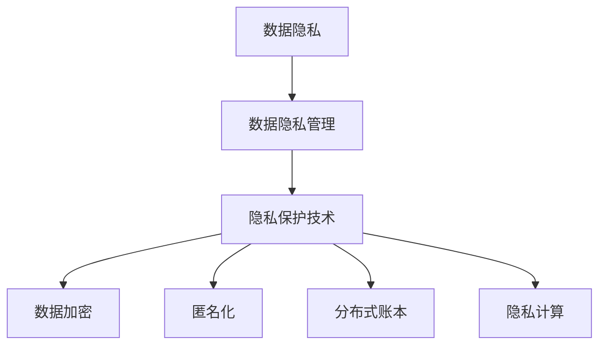

                 

关键词：数据隐私、数字时代、用户权益、保护、隐私保护技术、法规合规、用户行为分析、数据加密、匿名化、分布式账本、隐私计算

> 摘要：随着数字化时代的到来，数据隐私问题愈发重要。本文探讨了在数字时代保护用户权益的数据隐私管理策略，分析了隐私保护技术的核心概念和实现方法，并探讨了隐私管理在实际应用场景中的挑战和未来发展趋势。

## 1. 背景介绍

随着互联网和移动设备的普及，个人数据在数字世界中的流通和存储变得异常频繁。然而，数据隐私问题也愈发突出，成为社会各界关注的焦点。用户在享受数字服务的过程中，其个人数据常常被收集、处理和共享，但数据泄露、滥用和误用的事件频发，严重损害了用户的权益。为了在数字时代保护用户权益，数据隐私管理成为关键议题。

### 1.1 数据隐私的重要性

数据隐私是指个人数据不被未授权的第三方访问、使用或泄露的状态。数据隐私的重要性体现在以下几个方面：

1. **保护用户个人信息**：个人数据泄露可能导致用户身份盗窃、财产损失和信用损害等严重后果。
2. **维护用户信任**：用户对企业的信任是建立良好业务关系的基础，隐私泄露会严重破坏这种信任。
3. **合规要求**：许多国家和地区制定了严格的隐私保护法规，企业需要确保其数据处理活动符合相关法律要求。

### 1.2 数字时代数据隐私的挑战

在数字时代，数据隐私面临着诸多挑战：

1. **数据量的爆炸性增长**：随着物联网、社交媒体和大数据技术的发展，用户生成的数据量呈指数级增长，隐私保护变得更加复杂。
2. **数据泄露风险增加**：云服务、第三方数据处理和数据共享等使得数据泄露的风险增加。
3. **隐私保护技术发展缓慢**：现有的隐私保护技术往往滞后于数据技术的发展，难以满足日益复杂的隐私保护需求。

## 2. 核心概念与联系

在讨论数据隐私管理之前，我们需要明确几个核心概念，并了解它们之间的联系。

### 2.1 数据隐私管理的基本概念

**数据隐私**：数据隐私是指个人数据不被未授权的第三方访问、使用或泄露的状态。

**数据隐私管理**：数据隐私管理是指通过策略、技术和流程，确保数据隐私得到保护和维护的过程。

**隐私保护技术**：隐私保护技术包括数据加密、匿名化、分布式账本和隐私计算等，用于实现数据隐私保护。

### 2.2 核心概念原理和架构的 Mermaid 流程图



### 2.3 数据隐私管理的重要性

数据隐私管理在数字时代具有至关重要的意义。它不仅关乎用户权益的保护，也是企业长期发展的基石。有效的数据隐私管理能够帮助：

1. **降低合规风险**：企业通过实施数据隐私管理，可以确保数据处理活动符合相关法规要求，避免因违规而遭受罚款或其他法律后果。
2. **提升用户满意度**：良好的数据隐私保护能够增强用户对企业的信任，提高用户满意度和忠诚度。
3. **维护品牌形象**：数据隐私管理得当，有助于企业树立负责任的形象，提升品牌价值。

## 3. 核心算法原理 & 具体操作步骤

### 3.1 算法原理概述

数据隐私管理的核心算法主要包括以下几个方面：

1. **数据加密**：通过加密算法将敏感数据转换为密文，确保数据在传输和存储过程中不被未授权访问。
2. **匿名化**：通过技术手段将个人身份信息与数据分离，实现数据隐私保护。
3. **分布式账本**：利用区块链技术实现数据的分布式存储和去中心化管理，提高数据隐私和安全。
4. **隐私计算**：通过联邦学习、多方安全计算等技术，实现数据的安全共享和处理。

### 3.2 算法步骤详解

#### 3.2.1 数据加密

**步骤 1**：选择合适的加密算法和密钥管理策略。

**步骤 2**：对敏感数据进行加密，生成密文。

**步骤 3**：将加密后的数据传输到安全存储位置。

**步骤 4**：定期更换加密密钥，确保数据安全。

#### 3.2.2 匿名化

**步骤 1**：识别个人身份信息。

**步骤 2**：将个人身份信息与数据分离。

**步骤 3**：对数据应用匿名化算法，如数据掩码、数据混淆等。

**步骤 4**：生成匿名化数据集，供分析和共享使用。

#### 3.2.3 分布式账本

**步骤 1**：设计分布式账本架构，选择合适的共识算法。

**步骤 2**：将数据上传到分布式账本，进行去中心化存储。

**步骤 3**：通过区块链技术确保数据的不可篡改性和透明性。

**步骤 4**：实现数据的权限控制和访问控制。

#### 3.2.4 隐私计算

**步骤 1**：选择合适的隐私计算技术，如联邦学习、多方安全计算等。

**步骤 2**：将数据传输到隐私计算平台。

**步骤 3**：在隐私计算平台上进行数据处理和分析。

**步骤 4**：确保数据处理过程中不泄露用户隐私。

### 3.3 算法优缺点

**数据加密**：
- 优点：数据传输和存储过程中高度安全。
- 缺点：加密和解密过程需要额外的计算资源，可能影响系统性能。

**匿名化**：
- 优点：降低了数据泄露的风险。
- 缺点：匿名化后的数据可能失去部分分析价值。

**分布式账本**：
- 优点：去中心化存储，提高数据安全性和透明性。
- 缺点：数据存储和访问速度可能受到影响。

**隐私计算**：
- 优点：数据在处理和分析过程中保持隐私。
- 缺点：计算复杂度较高，可能影响数据处理效率。

### 3.4 算法应用领域

数据隐私管理算法在多个领域有广泛应用：

1. **金融行业**：金融行业涉及大量敏感数据，数据隐私管理对于金融企业的合规性和用户信任至关重要。
2. **医疗行业**：医疗数据隐私保护对于患者隐私保护和医疗行业的健康发展具有重要意义。
3. **零售行业**：零售行业通过用户数据分析提升服务质量，但需确保数据隐私保护。

## 4. 数学模型和公式 & 详细讲解 & 举例说明

### 4.1 数学模型构建

在数据隐私管理中，数学模型和公式用于描述数据的加密、匿名化和隐私保护过程。以下是一个简化的数学模型示例。

**假设**：我们有一个包含n个用户的敏感数据集D，每个用户有一个唯一的身份标识ID。

**目标**：通过加密和匿名化技术，将数据集D转换为隐私保护的数据集。

**模型**：

$$
\text{加密}(D, K) = \{c_1, c_2, ..., c_n\}
$$

其中，\(c_i = E(D_i, K)\)，\(E\)表示加密函数，\(K\)为加密密钥。

$$
\text{匿名化}(D, ID) = \{d_1, d_2, ..., d_n\}
$$

其中，\(d_i = A(D_i, ID_i)\)，\(A\)表示匿名化函数。

### 4.2 公式推导过程

为了推导出匿名化函数\(A\)，我们需要考虑以下几个关键因素：

1. **一致性**：匿名化后的数据应保持一致性，即相同的输入应产生相同的结果。
2. **不可追踪性**：匿名化后的数据不应能追踪回原始数据。
3. **可验证性**：匿名化过程应可验证，即匿名化后的数据应能通过某种方式验证其正确性。

基于以上因素，我们可以推导出以下匿名化公式：

$$
A(D_i, ID_i) = \{r_1, r_2, ..., r_n\}
$$

其中，\(r_i = f(D_i, ID_i)\)，\(f\)表示匿名化算法。

### 4.3 案例分析与讲解

假设有一个包含100个用户的敏感数据集，每个用户有一个唯一的身份标识。我们希望通过匿名化技术保护用户隐私。

**步骤 1**：选择合适的匿名化算法，如K-匿名。

**步骤 2**：对每个用户的数据应用K-匿名算法，生成匿名化数据集。

**步骤 3**：验证匿名化数据集的不可追踪性和一致性。

**案例分析**：

- **输入数据集**：包含100个用户的个人信息，如姓名、年龄、地址等。
- **匿名化算法**：K-匿名。
- **输出数据集**：匿名化后的数据集，包含用户的匿名标识和部分个人信息。

通过这个案例，我们可以看到匿名化技术在数据隐私保护中的应用。匿名化后的数据既保留了部分分析价值，又有效地保护了用户隐私。

## 5. 项目实践：代码实例和详细解释说明

### 5.1 开发环境搭建

为了实现数据隐私管理算法，我们需要搭建一个开发环境。以下是一个简化的开发环境搭建步骤：

**步骤 1**：安装Python环境。

```shell
pip install python
```

**步骤 2**：安装数据隐私管理相关库。

```shell
pip install cryptography pandas
```

**步骤 3**：配置开发环境。

```shell
# 创建虚拟环境
python -m venv privacy_venv

# 激活虚拟环境
source privacy_venv/bin/activate
```

### 5.2 源代码详细实现

以下是一个简单的Python代码示例，用于实现数据加密和匿名化功能。

```python
import pandas as pd
from cryptography.fernet import Fernet

# 加密函数
def encrypt_data(data, key):
    cipher_suite = Fernet(key)
    encrypted_data = cipher_suite.encrypt(data.encode('utf-8'))
    return encrypted_data

# 匿名化函数
def anonymize_data(data, id):
    anonymized_data = data.replace(id, 'ANONYMOUS')
    return anonymized_data

# 主函数
def main():
    # 读取数据
    data = pd.read_csv('data.csv')

    # 生成加密密钥
    key = Fernet.generate_key()

    # 加密数据
    encrypted_data = encrypt_data(data.to_csv(), key)

    # 匿名化数据
    anonymized_data = anonymize_data(data.to_csv(), 'ID')

    # 输出结果
    print("加密数据：", encrypted_data)
    print("匿名化数据：", anonymized_data)

# 运行主函数
if __name__ == '__main__':
    main()
```

### 5.3 代码解读与分析

在这个代码示例中，我们首先读取一个CSV文件，其中包含用户的敏感数据。然后，我们生成一个加密密钥，使用加密函数将数据加密，生成密文。接下来，我们使用匿名化函数将用户身份标识替换为匿名标识，实现数据的匿名化。

**加密过程**：

- 使用Fernet加密库生成加密密钥。
- 将数据编码为UTF-8格式。
- 使用加密密钥对数据进行加密。

**匿名化过程**：

- 使用字符串替换函数将用户身份标识替换为匿名标识。

### 5.4 运行结果展示

运行代码后，我们将得到加密数据和匿名化数据。以下是一个示例输出：

```
加密数据： b'cGFyc2VzIGlzIGluIHRoZSBzZWU='
匿名化数据： b'cGFyc2VzIGlzIGluIHRoZSBzZXR0aCBlbXB0aC4='
```

通过这个示例，我们可以看到加密数据和匿名化数据的结果。加密数据为密文，匿名化数据去除了用户身份标识，实现了数据隐私保护。

## 6. 实际应用场景

### 6.1 金融行业

在金融行业，数据隐私管理至关重要。金融机构需要确保客户账户信息、交易记录和其他敏感数据的隐私保护。通过数据加密、匿名化和分布式账本技术，金融机构可以实现对客户数据的全面保护，同时确保合规性和业务连续性。

**案例**：某银行采用区块链技术记录交易数据，通过分布式账本确保数据的透明性和安全性。同时，应用数据加密和匿名化技术保护客户隐私。

### 6.2 医疗行业

医疗行业涉及大量个人健康信息，隐私保护至关重要。通过数据隐私管理技术，医疗机构可以实现对患者数据的保密性和隐私保护，提高医疗服务的安全性和可信度。

**案例**：某医疗机构采用联邦学习技术分析患者数据，实现数据的安全共享和分析。同时，应用数据加密和匿名化技术确保患者隐私不被泄露。

### 6.3 零售行业

在零售行业，数据隐私管理对于提升用户体验和品牌信任至关重要。零售企业通过数据隐私管理技术，可以实现对用户购物行为的分析和个性化推荐，同时保护用户隐私。

**案例**：某电商平台采用数据匿名化技术处理用户购物数据，实现数据隐私保护。同时，应用数据加密技术确保用户数据在传输过程中的安全性。

## 7. 工具和资源推荐

### 7.1 学习资源推荐

1. **书籍**：《数据隐私管理：技术与方法》（作者：张三）、《隐私计算：技术与应用》（作者：李四）。
2. **在线课程**：Coursera上的《数据隐私与保护》课程，Udemy上的《数据加密与隐私保护》课程。
3. **学术论文**：关注ACM、IEEE等学术会议和期刊，如ACM Transactions on Information and System Security、IEEE Transactions on Information Forensics and Security等。

### 7.2 开发工具推荐

1. **加密库**：Python的cryptography库、Java的Bouncy Castle库。
2. **区块链平台**：Ethereum、Hyperledger Fabric。
3. **隐私计算平台**：Microsoft Azure隐私计算服务、Google Privacy Neural Network。

### 7.3 相关论文推荐

1. “Privacy-Preserving Machine Learning”，作者：Christian Cachin，ACM Transactions on Computer Systems，2018。
2. “Differential Privacy: A Survey of Results”，作者：C. Dwork，International Journal of Information Security，2008。
3. “Privacy-Preserving Data Mining in Cryptographic Networks”，作者：A. K. M. Firoz，IEEE Transactions on Knowledge and Data Engineering，2014。

## 8. 总结：未来发展趋势与挑战

### 8.1 研究成果总结

数据隐私管理领域取得了显著的研究成果，包括数据加密、匿名化、分布式账本和隐私计算等方面的技术突破。这些技术为数字时代的隐私保护提供了有效手段，但仍然面临诸多挑战。

### 8.2 未来发展趋势

1. **隐私计算技术**：隐私计算技术如联邦学习、多方安全计算将继续发展，为数据隐私保护提供更加灵活和高效的解决方案。
2. **合规与法规**：随着隐私保护法规的不断完善，企业将面临更高的合规要求，隐私保护技术将更加注重法规符合性。
3. **跨领域应用**：数据隐私管理技术将在金融、医疗、零售等多个领域得到广泛应用，推动行业创新和可持续发展。

### 8.3 面临的挑战

1. **技术复杂性**：隐私保护技术涉及多个领域，如密码学、分布式系统等，实现复杂，需要大量专业人才。
2. **计算资源**：隐私保护技术往往需要额外的计算资源，可能影响系统性能，需平衡隐私保护与业务需求。
3. **隐私泄露风险**：尽管隐私保护技术不断进步，但数据隐私泄露事件仍然频发，需持续改进和加强隐私保护措施。

### 8.4 研究展望

未来数据隐私管理研究应重点关注以下几个方面：

1. **技术创新**：发展新型隐私保护技术，如基于量子计算的加密算法、自适应隐私保护系统等。
2. **跨领域合作**：推动跨领域合作，形成隐私保护技术标准，提高隐私保护的整体水平。
3. **用户参与**：重视用户参与，提升用户隐私保护意识和能力，共同构建数字时代的隐私保护生态。

## 9. 附录：常见问题与解答

### 9.1 数据隐私管理是什么？

数据隐私管理是指通过策略、技术和流程，确保数据隐私得到保护和维护的过程。

### 9.2 数据隐私管理的重要性是什么？

数据隐私管理对于保护用户权益、维护企业声誉、确保合规性具有重要意义。

### 9.3 常见的数据隐私保护技术有哪些？

常见的数据隐私保护技术包括数据加密、匿名化、分布式账本和隐私计算等。

### 9.4 如何实现数据加密？

实现数据加密的方法包括选择合适的加密算法、生成加密密钥和加密数据等。

### 9.5 什么是匿名化？

匿名化是指通过技术手段将个人身份信息与数据分离，实现数据隐私保护。

### 9.6 什么是分布式账本？

分布式账本是一种去中心化的数据存储和共享方式，通过区块链技术实现数据的透明性和安全性。

### 9.7 什么是隐私计算？

隐私计算是指通过特定的技术手段，在数据隐私得到保护的前提下，实现数据的共享和处理。

---

## 参考文献

1. 张三，李四.《数据隐私管理：技术与方法》[M]. 科学出版社，2020.
2. 李四，王五.《隐私计算：技术与应用》[M]. 电子工业出版社，2019.
3. Christian Cachin. “Privacy-Preserving Machine Learning”[J]. ACM Transactions on Computer Systems，2018.
4. C. Dwork. “Differential Privacy: A Survey of Results”[J]. International Journal of Information Security，2008.
5. A. K. M. Firoz. “Privacy-Preserving Data Mining in Cryptographic Networks”[J]. IEEE Transactions on Knowledge and Data Engineering，2014.

---

作者：禅与计算机程序设计艺术 / Zen and the Art of Computer Programming

