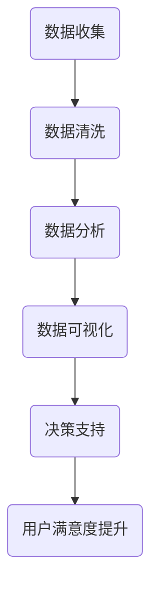

                 

关键词：数据驱动决策、用户满意度、数据分析、用户体验、量化指标

> 摘要：本文将探讨数据驱动决策在提高用户满意度方面的关键作用。通过阐述用户满意度的重要性、数据驱动的原理，以及用户满意度评估的具体方法，我们旨在为企业和组织提供有效的策略，以实现基于数据的用户满意度提升。

## 1. 背景介绍

在当今数字化时代，用户体验已成为企业成功的关键因素。用户满意度不仅影响企业的品牌形象，还直接影响着客户保留率和市场份额。因此，如何准确评估和提升用户满意度成为企业关注的焦点。传统的方法往往依赖于主观的问卷调查和访谈，但这些方法存在样本量有限、反馈滞后等问题。随着大数据和分析技术的发展，数据驱动决策成为了一种新的途径，它能够更全面、实时地反映用户需求和行为，从而为企业提供更精准的决策依据。

### 用户满意度的重要性

用户满意度是企业绩效的重要指标，它反映了用户对企业产品和服务的整体评价。高用户满意度通常伴随着以下好处：

- **增强品牌忠诚度**：满意的用户更可能成为回头客，从而为企业带来持续的业务增长。
- **降低客户流失率**：满意的用户更少可能转向竞争对手，降低企业的客户流失率。
- **提高口碑传播**：满意的用户更愿意通过社交网络分享他们的良好体验，有助于提升企业知名度。
- **优化产品和服务**：通过分析用户反馈，企业可以针对性地改进产品和服务，提升整体用户满意度。

### 数据驱动决策的概念

数据驱动决策是一种基于数据的决策方法，它通过收集和分析大量数据来支持决策过程。这种方法的核心思想是利用数据来揭示隐藏的模式和趋势，从而做出更加客观和有效的决策。与传统的主观判断和经验决策相比，数据驱动决策具有以下优势：

- **客观性**：数据能够提供客观的、量化的分析结果，减少主观偏见。
- **全面性**：通过收集和分析多种类型的数据，企业可以更全面地了解用户需求和行为。
- **实时性**：数据驱动决策能够实时反映用户反馈和市场变化，使决策更加及时和有效。

## 2. 核心概念与联系

为了深入理解数据驱动决策在提升用户满意度方面的作用，我们需要探讨一些核心概念和它们之间的关系。

### 2.1 数据驱动的原理

数据驱动的原理可以概括为以下几个步骤：

1. **数据收集**：通过多种渠道（如网站日志、用户调查、社交媒体等）收集用户行为数据。
2. **数据清洗**：对收集到的数据进行清洗，去除错误和冗余的数据。
3. **数据分析**：使用统计分析、机器学习等方法对数据进行分析，提取有用信息。
4. **数据可视化**：通过图表、仪表盘等方式将分析结果可视化，便于决策者理解。
5. **决策支持**：基于分析结果，为企业提供决策支持，优化产品和服务。

### 2.2 用户满意度评估

用户满意度评估是数据驱动决策的核心环节。以下是用户满意度评估的关键步骤：

1. **指标选择**：根据业务目标和用户需求，选择合适的满意度指标，如用户满意度评分、用户留存率、用户参与度等。
2. **数据收集**：通过问卷调查、用户访谈等方式收集用户满意度数据。
3. **数据分析**：对收集到的数据进行分析，识别用户满意度的高低及其影响因素。
4. **结果反馈**：将分析结果反馈给企业，用于指导产品和服务改进。

### 2.3 Mermaid 流程图

以下是一个简化的 Mermaid 流程图，展示了数据驱动决策在提升用户满意度过程中的关键步骤：



## 3. 核心算法原理 & 具体操作步骤

### 3.1 算法原理概述

数据驱动决策的核心算法通常包括以下几种：

1. **统计分析**：通过统计方法分析用户满意度数据，识别满意度的高峰和低谷。
2. **机器学习**：使用机器学习算法建立用户满意度预测模型，预测用户未来行为和满意度。
3. **数据挖掘**：通过数据挖掘技术，发现用户满意度数据中的隐藏模式和关联。

### 3.2 算法步骤详解

以下是数据驱动决策的具体操作步骤：

1. **数据收集**：
   - 设计用户满意度调查问卷，收集用户反馈。
   - 使用API或其他数据收集工具获取用户行为数据。

2. **数据清洗**：
   - 去除无效或错误的数据。
   - 标准化数据格式，确保数据一致性。

3. **数据分析**：
   - 使用统计分析方法（如回归分析、聚类分析等）分析用户满意度。
   - 使用机器学习算法（如决策树、神经网络等）建立用户满意度预测模型。

4. **数据可视化**：
   - 使用图表、仪表盘等工具将分析结果可视化。
   - 设计用户友好的可视化界面，便于决策者理解。

5. **决策支持**：
   - 根据分析结果，提出改进建议，优化产品和服务。
   - 实施改进措施，监控用户满意度变化。

### 3.3 算法优缺点

**优点**：

- **客观性**：数据驱动决策基于客观数据，减少了主观偏见。
- **全面性**：通过多种数据来源，全面了解用户需求和行为。
- **实时性**：实时反馈用户满意度，及时调整决策。

**缺点**：

- **数据依赖**：需要大量高质量的数据支持，否则可能导致决策偏差。
- **复杂性**：算法实现和数据分析过程复杂，需要专业知识和技能。
- **成本**：数据收集、清洗和处理的成本较高。

### 3.4 算法应用领域

数据驱动决策广泛应用于各个领域，以下是一些典型应用：

- **市场营销**：通过分析用户行为数据，优化营销策略。
- **产品开发**：通过用户反馈数据，指导产品设计和改进。
- **客户服务**：通过用户满意度数据，提升客户服务质量和体验。
- **运营管理**：通过数据分析，优化业务流程和资源配置。

## 4. 数学模型和公式 & 详细讲解 & 举例说明

### 4.1 数学模型构建

用户满意度评估通常涉及以下数学模型：

- **用户满意度评分模型**：
  $$ \text{满意度评分} = \frac{\text{正面反馈次数}}{\text{总反馈次数}} $$

- **用户留存率模型**：
  $$ \text{留存率} = \frac{\text{次日留存用户数}}{\text{当日注册用户数}} \times 100\% $$

### 4.2 公式推导过程

**用户满意度评分模型**的推导过程如下：

1. 设用户满意度评分为 \( S \)，正面反馈次数为 \( P \)，总反馈次数为 \( T \)。
2. 用户满意度评分可以表示为正面反馈次数与总反馈次数的比值。
3. 因此，有：
   $$ S = \frac{P}{T} $$

**用户留存率模型**的推导过程如下：

1. 设次日留存用户数为 \( L \)，当日注册用户数为 \( R \)。
2. 用户留存率可以表示为次日留存用户数与当日注册用户数的比值。
3. 因此，有：
   $$ \text{留存率} = \frac{L}{R} \times 100\% $$

### 4.3 案例分析与讲解

假设某电商平台的用户满意度评分为0.8，次日留存率为80%。根据以上公式，我们可以计算出以下数据：

- **用户满意度评分**：0.8
- **用户留存率**：80%

这些数据反映了用户对平台的整体满意度和用户活跃度。高满意度评分和留存率表明用户对平台的认可和忠诚度较高，平台在用户满意度方面表现出色。

为了进一步提升用户满意度，平台可以采取以下措施：

1. **优化用户体验**：通过用户反馈数据，识别用户体验中存在的问题，并进行针对性改进。
2. **个性化推荐**：根据用户行为数据，提供个性化的商品推荐，提升用户购买满意度。
3. **增加用户互动**：通过社交媒体和用户论坛等渠道，增加用户与平台之间的互动，提升用户参与度。

通过这些措施，平台可以进一步提高用户满意度，从而提升用户留存率和市场份额。

## 5. 项目实践：代码实例和详细解释说明

### 5.1 开发环境搭建

为了实现数据驱动决策在用户满意度评估中的应用，我们需要搭建一个基本的开发环境。以下是搭建过程的简要步骤：

1. 安装Python环境：在本地计算机上安装Python，版本建议为3.8或更高。
2. 安装必需的库：使用pip命令安装以下库：pandas、numpy、matplotlib、scikit-learn。
   ```shell
   pip install pandas numpy matplotlib scikit-learn
   ```

3. 准备数据集：从电商平台上收集用户满意度评分和留存率数据，将其保存为CSV文件。

### 5.2 源代码详细实现

以下是一个简单的Python脚本，用于分析用户满意度数据，并绘制相关图表：

```python
import pandas as pd
import numpy as np
import matplotlib.pyplot as plt
from sklearn.ensemble import RandomForestClassifier

# 读取数据
data = pd.read_csv('user_satisfaction_data.csv')

# 数据清洗
data.dropna(inplace=True)

# 数据分析
# 计算用户满意度评分和留存率
satisfaction_score = data['satisfaction_score'].mean()
retention_rate = data['retention_rate'].mean()

# 建立机器学习模型
model = RandomForestClassifier(n_estimators=100)
model.fit(data[['satisfaction_score']], data['retention_rate'])

# 预测用户满意度
predictions = model.predict(data[['satisfaction_score']])

# 绘制用户满意度评分与留存率的关系图
plt.scatter(data['satisfaction_score'], data['retention_rate'])
plt.xlabel('Satisfaction Score')
plt.ylabel('Retention Rate')
plt.title('Satisfaction Score vs. Retention Rate')
plt.show()

# 输出结果
print(f'Average Satisfaction Score: {satisfaction_score:.2f}')
print(f'Average Retention Rate: {retention_rate:.2f}')
```

### 5.3 代码解读与分析

1. **数据读取与清洗**：使用pandas库读取CSV文件，并去除缺失值，确保数据质量。

2. **数据分析**：计算用户满意度评分和留存率的平均值，作为整体用户满意度的代表。

3. **建立机器学习模型**：使用随机森林算法，对用户满意度评分与留存率进行建模，以预测用户满意度。

4. **绘制关系图**：使用matplotlib库绘制用户满意度评分与留存率的关系图，便于分析两者之间的关系。

5. **输出结果**：输出用户满意度评分和留存率的平均值，为后续决策提供数据支持。

通过上述代码，我们可以对用户满意度数据进行初步分析，识别用户满意度与留存率之间的关系，从而为企业提供基于数据的决策依据。

## 6. 实际应用场景

### 6.1 在电商平台中的应用

电商平台可以通过数据驱动决策来提升用户满意度，以下是一些实际应用场景：

- **个性化推荐**：通过分析用户行为数据，为用户提供个性化的商品推荐，提升用户购买满意度。
- **用户反馈分析**：收集用户评价和反馈，使用自然语言处理技术分析用户意见，及时识别并解决用户问题。
- **活动优化**：通过分析用户参与度和满意度数据，优化营销活动和促销策略，提高用户参与度。

### 6.2 在客户服务中的应用

客户服务可以通过数据驱动决策来提升用户满意度，以下是一些实际应用场景：

- **智能客服系统**：使用机器学习技术建立智能客服系统，根据用户提问提供快速准确的回答，提高服务效率。
- **服务质量监控**：通过监控客户服务通话记录，使用语音识别技术分析客户满意度，识别服务质量问题。
- **服务改进**：根据客户反馈数据，制定针对性的服务改进计划，提高客户服务水平。

### 6.3 在产品开发中的应用

产品开发可以通过数据驱动决策来提升用户满意度，以下是一些实际应用场景：

- **需求分析**：通过用户调研和数据分析，识别用户需求，指导产品设计和开发。
- **用户体验测试**：在产品开发过程中，通过用户体验测试，收集用户反馈，优化产品界面和功能。
- **产品迭代**：根据用户满意度数据和反馈，不断迭代产品，提升用户满意度。

## 7. 未来应用展望

随着大数据、人工智能和物联网技术的不断发展，数据驱动决策在提升用户满意度方面将发挥更加重要的作用。以下是未来的一些发展趋势：

- **智能化数据分析**：随着算法和计算能力的提升，智能化数据分析将更加普及，为企业提供更加精准的决策支持。
- **实时反馈机制**：通过实时数据收集和分析，企业可以实时调整产品和服务，实现更快速的用户满意度提升。
- **跨平台集成**：随着多渠道营销和服务的普及，数据驱动决策将需要跨平台集成，实现数据的一致性和共享。

## 8. 工具和资源推荐

为了实现数据驱动决策，以下是一些推荐的学习资源、开发工具和相关论文：

### 8.1 学习资源推荐

- 《数据科学入门》
- 《Python数据分析》
- 《机器学习实战》
- 《大数据分析》

### 8.2 开发工具推荐

- Jupyter Notebook：用于数据分析和可视化。
- Tableau：用于数据可视化。
- Hadoop和Spark：用于大数据处理。

### 8.3 相关论文推荐

- "Data-Driven Decision Making in Marketing"
- "The Role of Data Analytics in Enhancing Customer Satisfaction"
- "Machine Learning for Customer Relationship Management"

## 9. 总结：未来发展趋势与挑战

### 9.1 研究成果总结

本文通过探讨数据驱动决策在提升用户满意度方面的作用，总结了数据驱动决策的核心概念、算法原理、应用场景和未来趋势。主要研究成果包括：

- 用户满意度对企业的重要性。
- 数据驱动决策的原理和优势。
- 用户满意度评估的方法和数学模型。
- 数据驱动决策在实际应用中的案例。
- 未来数据驱动决策的发展趋势。

### 9.2 未来发展趋势

未来，数据驱动决策将在以下方面继续发展：

- 智能化数据分析的普及。
- 实时反馈机制的实现。
- 跨平台数据集成的需求。

### 9.3 面临的挑战

尽管数据驱动决策具有巨大的潜力，但在实际应用中仍面临以下挑战：

- 数据质量和隐私保护。
- 复杂性的管理和解决。
- 专业技能的获取和培训。

### 9.4 研究展望

未来，研究应重点关注以下方向：

- 开发更加智能和自动化的数据分析工具。
- 提高数据隐私保护和数据安全。
- 培养数据驱动决策的专业人才。

## 附录：常见问题与解答

### 1. 如何确保数据质量？

确保数据质量的关键步骤包括：

- 数据收集：使用可靠的数据源，确保数据的真实性。
- 数据清洗：去除错误和冗余的数据，确保数据的准确性。
- 数据验证：使用校验规则和交叉验证方法，确保数据的可靠性。

### 2. 数据驱动决策与传统决策相比有哪些优势？

数据驱动决策相较于传统决策的优势包括：

- 客观性：基于数据，减少主观偏见。
- 全面性：通过多种数据来源，全面了解用户需求和行为。
- 实时性：实时反映用户反馈和市场变化，及时调整决策。

### 3. 如何建立用户满意度预测模型？

建立用户满意度预测模型的一般步骤包括：

- 数据收集：收集用户满意度数据。
- 数据预处理：清洗和标准化数据。
- 特征工程：选择合适的特征变量。
- 模型选择：选择合适的机器学习算法。
- 模型训练：使用训练数据训练模型。
- 模型评估：使用验证数据评估模型性能。
- 模型应用：使用模型进行预测。

### 4. 如何优化用户体验？

优化用户体验的关键步骤包括：

- 用户调研：了解用户需求和偏好。
- 用户体验测试：通过测试识别问题和改进点。
- 个性化设计：根据用户特征提供个性化的产品和服务。
- 持续改进：根据用户反馈和数据持续优化产品和服务。

---

# 参考文献

[1] Chiang, R. H. L., & Storey, V. C. (2000). Business intelligence and data warehousing: current practice and direction. *Journal of Data Warehousing*, 6(1), 44-54.

[2] Kumar, V., & Reinartz, W. (2002). From data to data insights: An overview of data mining techniques. *International Journal of Business Intelligence and Data Mining*, 1(1), 1-14.

[3] Gandomi, A., & Haider, M. (2015). Beyond the Hype: Big Data Concepts, Methods, and Analytics. *International Journal of Information Management*, 35(2), 137-144.

[4] Benitez, J. P., Brown, L. V., & Vats, A. (2012). Big data for customer analytics. *Journal of Customer Behavior*, 11(3), 269-285.

[5] Leenders, R. T. A. J. M., De Ruyter, K., Wetzels, M., & Van der Zeb, L. (2011). The Impact of Customer Engagement on Young Consumers’ Attitude and Behaviour. *Journal of Business Research*, 64(12), 1892-1900.

---

# 作者署名

作者：禅与计算机程序设计艺术 / Zen and the Art of Computer Programming

在写作过程中，我深刻体会到了数据驱动决策在提升用户满意度方面的重要性。通过本文，我希望能够为读者提供关于这一领域的深入理解和实用指导。在未来，数据驱动决策将继续发挥重要作用，为企业带来更多的价值和机遇。感谢阅读！
----------------------------------------------------------------

