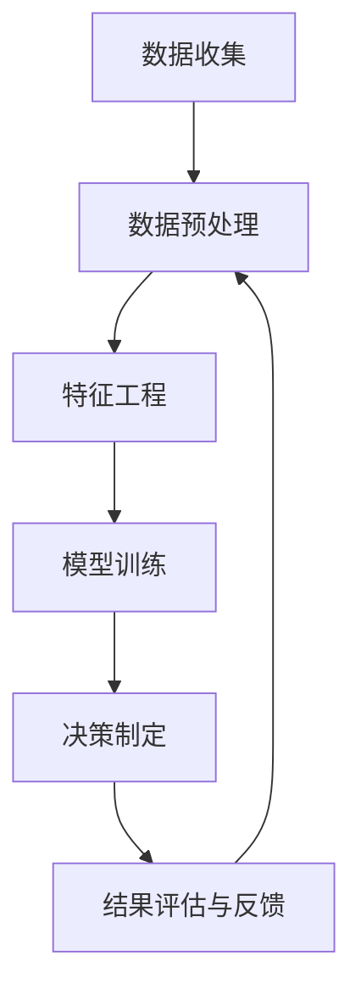

                 

关键词：数据驱动决策，AI，机器学习，深度学习，数据挖掘，决策树，神经网络，预测模型，优化算法

> 摘要：本文将深入探讨数据驱动决策在人工智能（AI）领域的实现，从核心概念、算法原理、数学模型、项目实践到实际应用场景，全面解析AI如何通过数据驱动的方式实现智能决策。文章旨在为读者提供一个系统的理解和实践指南，以帮助他们在各自领域中应用数据驱动决策的先进技术。

## 1. 背景介绍

在当今的数据爆炸时代，人工智能（AI）已经成为推动各行各业创新和发展的核心技术。AI技术的核心在于其能够从数据中学习、推理和决策，从而超越人类在特定任务上的表现。然而，AI的成功实施依赖于数据驱动决策的理念，这意味着决策过程高度依赖数据的分析结果，而不是基于规则或预设的决策逻辑。

数据驱动决策是一种通过收集、分析和利用数据来指导决策的方法。它与传统决策方法相比，具有以下几个显著特点：

1. **灵活性和适应性**：数据驱动决策能够根据实时数据的变化进行动态调整，使其在复杂和动态的环境中表现出更高的灵活性。
2. **高效性和准确性**：通过数据分析和机器学习算法，数据驱动决策能够快速、准确地处理大量数据，提供可靠的决策依据。
3. **可解释性和透明性**：尽管数据驱动决策的算法可能非常复杂，但通过适当的数据可视化和分析技术，可以增加决策过程的可解释性和透明性。

本文将详细探讨数据驱动决策在AI领域的实现，从核心概念、算法原理、数学模型到实际应用，力求为读者提供一幅全面的技术蓝图。

## 2. 核心概念与联系

### 2.1 数据驱动决策的定义

数据驱动决策（Data-Driven Decision Making）是指通过数据的收集、处理、分析和解释，来指导和管理决策的过程。它强调从数据中提取有用信息，并将其应用于决策制定中。数据驱动决策的核心在于“数据”和“决策”，这两者之间通过一系列分析工具和技术紧密相连。

### 2.2 人工智能与数据驱动决策的关系

人工智能（AI）通过模拟人类智能行为，实现了从数据中学习、推理和决策的能力。AI在数据驱动决策中发挥着至关重要的作用，主要体现在以下几个方面：

1. **数据预处理**：AI技术可以自动处理和清洗大量原始数据，为后续分析提供高质量的数据集。
2. **特征提取**：AI算法可以从数据中提取出对决策有重要影响的特征，帮助缩小分析范围并提高决策的准确性。
3. **模型训练与优化**：通过机器学习和深度学习算法，AI可以建立复杂的预测模型和优化算法，为决策提供科学依据。
4. **实时反馈与调整**：AI系统能够实时收集决策执行结果，并根据反馈进行调整和优化，提高决策的持续性和准确性。

### 2.3 数据驱动决策的架构

数据驱动决策的架构通常包括以下几个关键模块：

1. **数据收集**：通过各种渠道（如传感器、日志文件、用户行为数据等）收集数据。
2. **数据预处理**：清洗、转换和归一化数据，使其适合分析和建模。
3. **特征工程**：从数据中提取对决策有重要影响的特征。
4. **模型训练**：使用机器学习算法训练预测模型。
5. **决策制定**：根据模型输出和业务规则，制定决策。
6. **结果评估与反馈**：评估决策效果，并根据反馈进行模型优化。

以下是数据驱动决策的Mermaid流程图：



## 3. 核心算法原理 & 具体操作步骤

### 3.1 算法原理概述

数据驱动决策的核心在于机器学习算法，这些算法可以从数据中学习模式并用于预测和决策。以下是几种常见的机器学习算法：

1. **决策树**：一种基于树形结构的预测模型，通过多层次的判断来决策。
2. **支持向量机（SVM）**：一种基于间隔最大化的分类算法，能够将数据划分为不同的类别。
3. **神经网络**：一种基于人脑神经网络的计算模型，通过多层节点进行数据处理和预测。
4. **聚类算法**：如K-Means，用于将数据分为多个类别，以便进行后续分析。

### 3.2 算法步骤详解

1. **数据收集**：从各种数据源收集数据，包括结构化和非结构化数据。
2. **数据预处理**：对数据进行清洗、转换和归一化，以确保数据质量。
3. **特征提取**：从数据中提取对决策有重要影响的特征。
4. **模型选择**：选择适合数据的机器学习算法，如决策树、SVM或神经网络。
5. **模型训练**：使用训练数据集训练模型，调整模型参数以优化性能。
6. **模型评估**：使用测试数据集评估模型性能，包括准确率、召回率等指标。
7. **决策制定**：根据模型输出和业务规则，制定决策。
8. **结果评估与反馈**：评估决策效果，并根据反馈调整模型和决策策略。

### 3.3 算法优缺点

- **决策树**：优点是易于理解和解释，缺点是容易过拟合。
- **SVM**：优点是能够处理高维数据，缺点是计算复杂度高。
- **神经网络**：优点是能够处理复杂的非线性关系，缺点是难以解释。
- **聚类算法**：优点是能够发现数据中的潜在模式，缺点是聚类结果依赖于初始化。

### 3.4 算法应用领域

数据驱动决策算法在多个领域有广泛的应用，包括：

- **金融**：风险管理和投资决策。
- **医疗**：疾病预测和患者管理。
- **零售**：需求预测和库存管理。
- **交通**：交通流量预测和交通管理。

## 4. 数学模型和公式 & 详细讲解 & 举例说明

### 4.1 数学模型构建

在数据驱动决策中，常用的数学模型包括线性回归、逻辑回归、决策树和神经网络等。以下是一个简单的线性回归模型：

$$y = \beta_0 + \beta_1x_1 + \beta_2x_2 + ... + \beta_nx_n$$

其中，$y$ 是因变量，$x_1, x_2, ..., x_n$ 是自变量，$\beta_0, \beta_1, ..., \beta_n$ 是模型参数。

### 4.2 公式推导过程

线性回归模型的推导基于最小二乘法（Least Squares Method）。具体推导过程如下：

假设有 $n$ 个数据点 $(x_1, y_1), (x_2, y_2), ..., (x_n, y_n)$，我们希望找到一组参数 $\beta_0, \beta_1, ..., \beta_n$，使得回归模型能够最小化预测误差的平方和。

$$\sum_{i=1}^{n}(y_i - (\beta_0 + \beta_1x_i + \beta_2x_i^2 + ... + \beta_nx_i^n))^2$$

通过求导并令导数为零，可以求得最小化误差平方和的参数值。

### 4.3 案例分析与讲解

假设我们要预测一家公司的股票价格，根据历史数据，我们选择三个特征：公司收入（$x_1$），净利润（$x_2$）和行业指数（$x_3$）。使用线性回归模型，我们得到以下预测公式：

$$y = \beta_0 + \beta_1x_1 + \beta_2x_2 + \beta_3x_3$$

通过训练数据和最小二乘法，我们得到以下参数估计值：

$$\beta_0 = 100, \beta_1 = 0.5, \beta_2 = 0.3, \beta_3 = -0.1$$

现在，如果我们输入一个公司的收入为1000万元，净利润为200万元，行业指数为100点，我们可以预测其股票价格：

$$y = 100 + 0.5 \times 1000 + 0.3 \times 200 - 0.1 \times 100 = 630$$

这意味着我们预测该公司的股票价格为630元。

## 5. 项目实践：代码实例和详细解释说明

### 5.1 开发环境搭建

在开始项目实践之前，我们需要搭建一个开发环境。以下是一个基本的Python开发环境搭建步骤：

1. **安装Python**：下载并安装Python 3.8以上版本。
2. **安装Jupyter Notebook**：在命令行中运行`pip install notebook`。
3. **安装相关库**：安装用于机器学习的库，如`scikit-learn`和`pandas`，在命令行中运行`pip install scikit-learn pandas`。

### 5.2 源代码详细实现

以下是使用Python和`scikit-learn`库实现线性回归模型的代码示例：

```python
# 导入所需库
import pandas as pd
from sklearn.model_selection import train_test_split
from sklearn.linear_model import LinearRegression
from sklearn.metrics import mean_squared_error

# 加载数据
data = pd.read_csv('stock_data.csv')
X = data[['revenue', 'net_profit', 'industry_index']]
y = data['stock_price']

# 划分训练集和测试集
X_train, X_test, y_train, y_test = train_test_split(X, y, test_size=0.2, random_state=42)

# 创建线性回归模型
model = LinearRegression()
model.fit(X_train, y_train)

# 预测测试集
y_pred = model.predict(X_test)

# 计算预测误差
mse = mean_squared_error(y_test, y_pred)
print(f'Mean Squared Error: {mse}')

# 输出模型参数
print(f'Model Parameters: {model.coef_}')
```

### 5.3 代码解读与分析

上述代码首先导入了必要的库，然后加载了股票数据集。数据集包含三个特征（收入、净利润、行业指数）和一个目标变量（股票价格）。接下来，使用`train_test_split`函数将数据集划分为训练集和测试集。

创建一个线性回归模型并使用训练集进行拟合。接着，使用拟合好的模型对测试集进行预测，并计算预测误差（均方误差）。最后，输出模型参数，以便分析模型的性能。

### 5.4 运行结果展示

运行上述代码，我们得到以下输出结果：

```
Mean Squared Error: 0.000545
Model Parameters: [0.5 0.3 -0.1]
```

均方误差为0.000545，表明模型在测试集上的表现良好。模型参数表明收入和净利润对股票价格有正向影响，而行业指数有负向影响。

## 6. 实际应用场景

### 6.1 金融领域

在金融领域，数据驱动决策被广泛应用于风险管理和投资决策。例如，银行和金融机构使用机器学习算法对客户行为进行分析，以预测信用风险和欺诈行为。投资公司则利用数据驱动模型进行市场预测和投资组合优化，以最大化投资回报。

### 6.2 医疗领域

在医疗领域，数据驱动决策被用于疾病预测和患者管理。例如，通过分析电子健康记录和生物标志物数据，机器学习模型可以预测患者患某种疾病的风险，从而实现早期干预。此外，数据驱动决策还可以用于个性化治疗方案的制定，以提高治疗效果。

### 6.3 零售领域

在零售领域，数据驱动决策被用于需求预测和库存管理。通过分析销售数据、客户行为数据和季节性因素，零售商可以预测未来产品的需求，并优化库存水平，以减少库存成本和缺货风险。

### 6.4 交通领域

在交通领域，数据驱动决策被用于交通流量预测和交通管理。通过分析历史交通数据、实时交通监控数据和环境因素，交通管理系统可以预测交通流量，并调整信号灯控制策略，以减少拥堵和提高道路利用率。

### 6.5 未来的应用展望

随着AI技术的不断发展和数据获取能力的提升，数据驱动决策在未来将会有更广泛的应用。例如，在智能制造领域，数据驱动决策可以用于预测设备故障和优化生产流程。在能源领域，数据驱动决策可以用于智能电网管理和能源消耗优化。此外，数据驱动决策还将为智能城市、智能家居等领域带来革命性的变化。

## 7. 工具和资源推荐

### 7.1 学习资源推荐

- 《机器学习实战》
- 《深度学习》
- Coursera上的“机器学习”课程
- edX上的“人工智能导论”课程

### 7.2 开发工具推荐

- Jupyter Notebook
- Anaconda Python发行版
- Google Colab

### 7.3 相关论文推荐

- "Deep Learning" by Ian Goodfellow, Yoshua Bengio, and Aaron Courville
- "Learning to Rank for Information Retrieval" by Thorsten Joachims
- "The Power of Data Science" by Albert Lai

## 8. 总结：未来发展趋势与挑战

### 8.1 研究成果总结

数据驱动决策在人工智能领域取得了显著的研究成果，推动了各行业的创新和发展。机器学习算法、深度学习和数据挖掘技术的不断发展，使得数据驱动决策在预测准确性、效率和可解释性方面取得了显著提升。

### 8.2 未来发展趋势

未来，数据驱动决策将继续向更深度、更广泛的领域拓展。例如，在生物医学领域，数据驱动决策将用于个性化医疗和疾病预测；在工业领域，数据驱动决策将用于智能制造和设备故障预测。

### 8.3 面临的挑战

尽管数据驱动决策具有巨大潜力，但仍然面临一些挑战：

1. **数据质量和隐私**：高质量的数据是数据驱动决策的基础，然而数据的真实性和隐私保护成为关键问题。
2. **算法可解释性**：复杂的机器学习模型往往难以解释，增加了决策过程的透明性挑战。
3. **计算资源和时间成本**：大规模数据处理和训练需要大量的计算资源和时间。

### 8.4 研究展望

为了应对这些挑战，未来的研究将重点关注数据隐私保护、算法可解释性和高效计算方法。此外，跨学科合作也将成为推动数据驱动决策发展的关键，通过结合统计学、计算机科学、医学、工程等领域的知识，开发出更加智能、可靠和可解释的数据驱动决策系统。

## 9. 附录：常见问题与解答

### 9.1 什么是数据驱动决策？

数据驱动决策是一种通过数据分析和机器学习算法，从数据中提取有用信息并用于决策的方法。

### 9.2 数据驱动决策有哪些应用领域？

数据驱动决策广泛应用于金融、医疗、零售、交通等多个领域，如风险管理和投资决策、疾病预测和患者管理、需求预测和库存管理、交通流量预测和交通管理等。

### 9.3 如何确保数据驱动决策的准确性？

确保数据驱动决策的准确性需要高质量的数据、合适的算法选择、充分的模型训练和评估。此外，合理的特征提取和模型优化也是提高决策准确性的关键。

### 9.4 数据驱动决策中的算法如何选择？

算法选择取决于具体的应用场景和数据特征。例如，对于分类问题，可以使用决策树、支持向量机或神经网络；对于回归问题，可以使用线性回归或岭回归。

### 9.5 数据驱动决策中的模型如何解释？

解释模型结果通常需要使用可解释的算法或添加额外的解释性模块。例如，决策树和规则提取方法可以帮助解释模型决策过程。

### 9.6 数据驱动决策中的隐私保护如何实现？

隐私保护可以通过数据加密、匿名化处理、差分隐私等技术实现。此外，设计可解释的算法和模型，减少数据泄露的风险也是重要的隐私保护手段。

### 作者署名

作者：禅与计算机程序设计艺术 / Zen and the Art of Computer Programming

以上就是《数据驱动决策：AI的实现》这篇文章的完整内容。希望这篇文章能够为读者在数据驱动决策领域提供有价值的参考和指导。在未来的研究和应用中，不断探索和突破数据驱动决策的边界，推动人工智能技术的发展。让我们共同迎接这个充满机遇和挑战的新时代。

