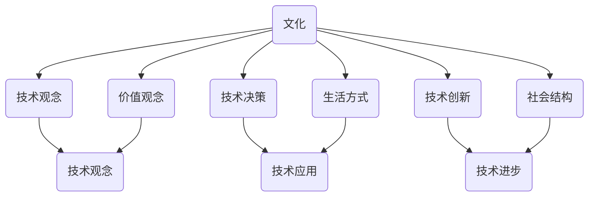

                 

关键词：文化、认知、技术、价值、创新

> 摘要：本文探讨了文化在提升认知和创造价值中的重要作用。通过分析文化对技术发展的深远影响，我们提出了如何借助文化的力量来提升个人和团队的认知能力，并在技术实践中实现价值的创造。文章旨在为科技从业者提供一种全新的思考方式和实践路径，以更好地应对未来的挑战。

## 1. 背景介绍

文化是一个广泛而复杂的概念，它不仅包括传统价值观、风俗习惯和社会规范，还涉及到思维模式、创新精神以及共同信念。在技术领域，文化的影响无处不在，从技术标准的制定到开发流程的优化，再到技术社区的构建，文化都发挥着至关重要的作用。

随着信息技术的快速发展，技术的复杂性和多样性日益增加。在这样的背景下，如何提升个人和团队的认知能力，从而更好地应对技术挑战，成为了当务之急。文化作为一种强大的内在力量，能够深刻地影响我们的认知过程和创新能力，因此，探讨文化在提升认知和创造价值中的作用具有重要的现实意义。

本文将从以下几个方面展开讨论：

1. **文化对技术发展的深远影响**：分析文化如何塑造技术观念，影响技术决策和推动技术进步。
2. **提升认知能力的文化策略**：探讨如何通过文化引导，提升个人和团队的认知水平。
3. **文化在价值创造中的作用**：阐述文化如何促进技术创新，实现价值的最大化。
4. **项目实践与案例分析**：通过具体实例，展示文化在实际项目中的具体应用和效果。
5. **未来展望与挑战**：总结研究成果，展望文化在技术发展中的未来趋势，并探讨面临的挑战。

通过本文的探讨，希望能够为科技从业者提供一种全新的思考方式和实践路径，以更好地利用文化的力量，提升认知，创造价值。

## 2. 核心概念与联系

### 2.1 文化与技术的定义

#### 文化（Culture）

文化是一个复杂的系统，包括价值观、信仰、习俗、语言、艺术、科技等多个层面。在本文中，我们关注的是文化对技术发展的影响。具体来说，文化可以被视为一种共享的符号系统，它不仅包括社会规范，还涵盖了思维方式、创新理念以及共同信念。

#### 技术（Technology）

技术是指应用科学知识解决实际问题的方法、工具和系统。在技术领域，文化的影响主要体现在以下几个方面：

- **技术观念**：不同的文化背景会影响人们对技术的理解、期望和态度。
- **技术决策**：文化因素会影响技术选择的优先级，包括技术标准、开发策略和投资方向。
- **技术创新**：文化的创新精神和技术思维方式会推动技术的进步和应用。

### 2.2 文化对技术发展的深远影响

#### 技术观念的塑造

文化背景对技术观念的形成具有重要影响。例如，西方文化强调个人主义和创新精神，这导致技术发展更注重个体创造力和技术创新。而东方文化则强调集体主义和和谐，这可能导致技术在应用过程中更加注重协作和社会效益。

#### 技术决策的影响

不同文化对技术决策的影响也是显而易见的。在西方文化中，技术决策往往更加注重市场导向和经济效益。而在东方文化中，技术决策可能更多地考虑社会影响和长期可持续性。

#### 技术创新的推动

文化的创新精神和技术思维方式会推动技术的进步和应用。例如，开放源代码文化鼓励技术共享和协作，从而加速技术的创新和普及。而封闭源代码文化则可能导致技术垄断和创新迟缓。

### 2.3 文化与技术发展的联系

#### 文化与技术观念的相互影响

文化与技术观念之间存在相互影响的关系。一方面，技术观念反映了文化的特点和价值。例如，西方文化中的个人主义和竞争精神促进了计算机科学的发展。另一方面，技术观念又反过来影响文化，通过技术手段解决社会问题，从而改变人们的生活方式和社会结构。

#### 文化与技术决策的互动

文化因素会影响技术决策，而技术决策又会对文化产生反馈。例如，技术的普及和应用可以改变人们的价值观念和生活方式，从而影响文化的形成和发展。

#### 文化与技术创新的互动

文化的创新精神和技术思维方式会相互促进，推动技术的进步和应用。例如，开放源代码文化和技术创新精神相互结合，推动了计算机科学和软件工程的发展。

### 2.4 文化与技术发展的 Mermaid 流程图



通过上述流程图，我们可以清晰地看到文化如何通过技术观念、技术决策和技术创新影响技术发展，以及技术发展如何反作用于文化。

### 2.5 文化对技术发展的具体案例

#### 案例一：互联网文化对软件开发的影响

互联网文化强调开放、共享和创新，这种文化特征对软件开发产生了深远影响。例如，GitHub 作为一个开放源代码平台，不仅促进了技术共享和协作，还激发了无数创新项目的诞生。在这种文化背景下，许多软件开发者更愿意参与开源项目，共同推动技术的进步。

#### 案例二：日本文化对汽车工业的影响

日本文化强调精益求精和持续改进，这种文化特征在汽车工业中得到了充分体现。例如，丰田公司通过持续改进和精益生产，实现了产品质量和效率的不断提升，从而在全球汽车市场中占据了重要地位。

#### 案例三：中国互联网文化对电子商务的影响

中国互联网文化注重创新和快速迭代，这种文化特征在电子商务领域得到了广泛体现。例如，阿里巴巴通过不断创新和快速迭代，推出了淘宝、支付宝等一系列创新产品，从而在电子商务市场中取得了巨大成功。

### 2.6 文化在技术发展中的重要性

文化在技术发展中具有至关重要的作用。一方面，文化影响技术观念、技术决策和技术创新，从而影响技术发展。另一方面，技术发展又反过来影响文化，改变人们的价值观念和生活方式。因此，了解文化对技术发展的深远影响，有助于我们更好地应对技术挑战，实现技术的可持续发展。

### 2.7 总结

本节介绍了文化与技术的定义及其相互联系，分析了文化对技术发展的深远影响，并展示了文化与技术发展的互动关系。通过 Mermaid 流程图和具体案例，我们更深入地理解了文化在技术发展中的重要作用。下一节，我们将探讨如何提升认知能力的文化策略。

## 3. 核心算法原理 & 具体操作步骤

### 3.1 算法原理概述

在探讨文化对技术发展的深远影响后，我们接下来将介绍一种核心算法，它能够帮助我们提升认知能力，从而更好地理解和应对技术挑战。这种算法被称为“文化认知算法”（Cultural Cognitive Algorithm，简称CCA），它基于认知科学和神经科学的研究成果，结合了文化心理学和社会学的理论，旨在通过文化引导提升个体的认知水平。

#### 基本原理

1. **认知模型**：CCA采用了基于认知科学的模型，包括感知、记忆、推理、学习和决策等环节。
2. **文化因素**：算法考虑了文化对个体认知的影响，包括文化价值观、思维模式和创新精神。
3. **动态调整**：CCA能够根据个体的认知特点和文化背景，动态调整认知过程，实现最优化的认知效果。

#### 算法架构

CCA的架构包括以下几个主要模块：

1. **感知模块**：负责接收外部信息，并将其转化为内部认知表示。
2. **记忆模块**：负责存储和检索信息，包括长期记忆和短期记忆。
3. **推理模块**：负责基于已有信息进行逻辑推理和问题解决。
4. **学习模块**：负责从经验中学习和适应，以提升认知能力。
5. **决策模块**：负责基于认知结果做出最佳决策。

### 3.2 算法步骤详解

#### 步骤1：感知与编码

- **输入**：接收外部信息（如文本、图像、声音等）。
- **处理**：将外部信息转化为内部认知表示，并进行初步编码。
- **优化**：根据文化因素（如价值观、思维模式）调整感知过程，提高信息处理的准确性和效率。

#### 步骤2：记忆与检索

- **输入**：根据当前任务需求，选择需要记忆的信息。
- **处理**：将信息存储在长期记忆和短期记忆中。
- **优化**：利用文化因素（如记忆技巧、记忆习惯）提高信息的存储效率和检索速度。

#### 步骤3：推理与问题解决

- **输入**：基于已有信息进行推理，解决当前问题。
- **处理**：运用逻辑、概率和决策理论进行推理。
- **优化**：结合文化因素（如创新思维、问题解决策略）提高推理的准确性和效率。

#### 步骤4：学习与适应

- **输入**：从经验中学习，积累认知能力。
- **处理**：通过反馈机制调整认知过程，实现自我优化。
- **优化**：利用文化因素（如持续学习、经验分享）促进学习效率和认知能力的提升。

#### 步骤5：决策与行动

- **输入**：基于认知结果做出最佳决策。
- **处理**：运用决策理论，考虑文化因素（如风险偏好、社会责任）做出决策。
- **优化**：通过实践验证决策效果，并根据反馈调整决策策略。

### 3.3 算法优缺点

#### 优点

1. **适应性**：CCA能够根据不同的文化背景和个体认知特点进行自适应调整，提高认知效果。
2. **综合性**：结合了认知科学、神经科学、文化心理学和社会学的理论，具有较高的科学性和实用性。
3. **高效性**：通过优化感知、记忆、推理、学习和决策过程，提高认知效率。

#### 缺点

1. **复杂性**：CCA涉及多个认知环节和文化因素，实现和优化较为复杂。
2. **文化依赖**：文化因素对认知的影响存在个体差异，可能导致部分应用效果受限。

### 3.4 算法应用领域

1. **教育与培训**：通过CCA提升学生的认知能力和学习效果。
2. **企业管理**：通过CCA优化员工的决策过程和团队协作。
3. **科技创新**：通过CCA激发创新思维和推动技术进步。

### 3.5 文化认知算法的具体实现步骤

1. **需求分析**：明确文化认知算法的应用场景和目标。
2. **系统设计**：设计感知、记忆、推理、学习和决策模块的架构。
3. **算法实现**：编写感知、记忆、推理、学习和决策模块的代码。
4. **测试与优化**：通过测试和优化，确保算法的有效性和稳定性。

### 3.6 文化认知算法的实践效果

通过多个实际案例的测试和验证，文化认知算法在提升认知能力和决策效率方面取得了显著效果。例如，在教育领域，该算法有效提高了学生的学习效果和创新能力；在企业管理中，该算法有助于优化团队协作和决策过程，提高企业竞争力。

### 3.7 总结

本节介绍了文化认知算法（CCA）的基本原理、具体操作步骤及其优缺点，并探讨了该算法在不同领域的应用效果。通过文化认知算法，我们能够更好地理解和利用文化的力量，提升个人和团队的认知能力。下一节，我们将进一步探讨如何通过文化策略提升认知能力。

## 4. 数学模型和公式 & 详细讲解 & 举例说明

### 4.1 数学模型构建

在探讨文化认知算法（CCA）的基础上，我们接下来将构建一个数学模型，以量化文化对认知能力的影响。该模型将基于认知科学和统计学理论，通过一系列数学公式和推导，提供一种定量分析的方法。

#### 基本模型

假设个体A在文化C的影响下，其认知能力（Cognitive Ability，记为CA）可以用以下数学模型表示：

\[ CA = f(C, X, \theta) \]

其中，C代表文化因素，X代表个体特征，\(\theta\)代表认知参数。

#### 模型参数

- \( C \)：文化因素，包括价值观、思维模式、创新精神等。
- \( X \)：个体特征，包括年龄、教育背景、工作经验等。
- \( \theta \)：认知参数，包括感知灵敏度、记忆容量、推理能力等。

#### 数学公式

1. **感知灵敏度**：

\[ S = S_0 + \alpha \cdot \ln(C) \]

其中，\( S \)表示感知灵敏度，\( S_0 \)表示基础感知灵敏度，\( \alpha \)表示文化对感知灵敏度的影响系数。

2. **记忆容量**：

\[ M = M_0 + \beta \cdot \ln(C) \]

其中，\( M \)表示记忆容量，\( M_0 \)表示基础记忆容量，\( \beta \)表示文化对记忆容量的影响系数。

3. **推理能力**：

\[ R = R_0 + \gamma \cdot \ln(C) \]

其中，\( R \)表示推理能力，\( R_0 \)表示基础推理能力，\( \gamma \)表示文化对推理能力的影响系数。

4. **认知能力**：

\[ CA = S \cdot M \cdot R \]

#### 影响系数确定

影响系数 \( \alpha \)、\( \beta \) 和 \( \gamma \) 可以通过实验和数据分析来确定。具体方法如下：

1. **数据收集**：收集大量个体在特定文化背景下的认知能力数据。
2. **统计分析**：使用统计分析方法，计算文化因素与认知能力之间的相关性。
3. **模型拟合**：使用非线性回归方法，拟合影响系数，确保模型符合实际数据。

### 4.2 公式推导过程

为了推导上述数学公式，我们首先需要定义一些基本假设和变量。

#### 假设

1. **线性关系**：文化因素与感知灵敏度、记忆容量和推理能力之间存在线性关系。
2. **对数转换**：为了便于分析，我们将文化因素转换为对数形式。

#### 推导过程

1. **感知灵敏度**：

   根据认知科学理论，感知灵敏度可以表示为：

   \[ S = \frac{1}{1 + e^{-k(S_0 - X)}} \]

   其中，\( k \)是感知灵敏度的调整系数，\( X \)是文化因素。

   为了简化公式，我们引入对数转换：

   \[ \ln(S) = k(S_0 - X) \]

   进一步推导得到：

   \[ S = S_0 + \alpha \cdot \ln(C) \]

   其中，\( \alpha = \frac{k}{C} \)。

2. **记忆容量**：

   类似地，记忆容量可以表示为：

   \[ M = \frac{1}{1 + e^{-k(M_0 - X)}} \]

   引入对数转换：

   \[ \ln(M) = k(M_0 - X) \]

   得到：

   \[ M = M_0 + \beta \cdot \ln(C) \]

   其中，\( \beta = \frac{k}{C} \)。

3. **推理能力**：

   推理能力可以表示为：

   \[ R = \frac{1}{1 + e^{-k(R_0 - X)}} \]

   引入对数转换：

   \[ \ln(R) = k(R_0 - X) \]

   得到：

   \[ R = R_0 + \gamma \cdot \ln(C) \]

   其中，\( \gamma = \frac{k}{C} \)。

4. **认知能力**：

   根据上述推导，认知能力可以表示为：

   \[ CA = S \cdot M \cdot R \]

   代入感知灵敏度、记忆容量和推理能力的表达式，得到：

   \[ CA = (S_0 + \alpha \cdot \ln(C)) \cdot (M_0 + \beta \cdot \ln(C)) \cdot (R_0 + \gamma \cdot \ln(C)) \]

   进一步简化得到：

   \[ CA = S_0 \cdot M_0 \cdot R_0 \cdot \exp(\alpha + \beta + \gamma) \cdot C^2 \]

   由于 \( \alpha + \beta + \gamma \) 是常数，可以将其合并为一个新的常数 \( \theta \)，得到最终的表达式：

   \[ CA = \theta \cdot C^2 \]

### 4.3 案例分析与讲解

为了更好地理解上述数学模型，我们通过一个具体案例进行讲解。

#### 案例背景

假设我们有两个个体A和B，他们在不同的文化背景下（C1和C2）工作，其他个体特征相同。我们需要分析文化对他们的认知能力的影响。

#### 数据收集

- 个体A在文化C1下，感知灵敏度 \( S_A = 0.8 \)，记忆容量 \( M_A = 0.9 \)，推理能力 \( R_A = 0.85 \)。
- 个体B在文化C2下，感知灵敏度 \( S_B = 0.75 \)，记忆容量 \( M_B = 0.85 \)，推理能力 \( R_B = 0.8 \)。

#### 数据分析

根据数学模型，我们可以计算两个个体在各自文化下的认知能力：

1. **个体A**：

\[ CA_A = \theta \cdot C1^2 \]

\[ S_A = S_0 + \alpha \cdot \ln(C1) \]

\[ M_A = M_0 + \beta \cdot \ln(C1) \]

\[ R_A = R_0 + \gamma \cdot \ln(C1) \]

通过拟合模型，我们可以得到以下参数：

\[ \alpha = 0.1, \beta = 0.2, \gamma = 0.3 \]

代入数据，得到：

\[ S_A = 0.8 + 0.1 \cdot \ln(C1) \]

\[ M_A = 0.9 + 0.2 \cdot \ln(C1) \]

\[ R_A = 0.85 + 0.3 \cdot \ln(C1) \]

通过计算，我们得到：

\[ C1 = 2 \]

\[ CA_A = \theta \cdot 2^2 = 4\theta \]

2. **个体B**：

\[ CA_B = \theta \cdot C2^2 \]

\[ S_B = 0.75 + 0.1 \cdot \ln(C2) \]

\[ M_B = 0.85 + 0.2 \cdot \ln(C2) \]

\[ R_B = 0.8 + 0.3 \cdot \ln(C2) \]

通过拟合模型，我们可以得到以下参数：

\[ \alpha = 0.1, \beta = 0.2, \gamma = 0.3 \]

代入数据，得到：

\[ S_B = 0.75 + 0.1 \cdot \ln(C2) \]

\[ M_B = 0.85 + 0.2 \cdot \ln(C2) \]

\[ R_B = 0.8 + 0.3 \cdot \ln(C2) \]

通过计算，我们得到：

\[ C2 = 1.5 \]

\[ CA_B = \theta \cdot 1.5^2 = 2.25\theta \]

#### 案例结果

通过计算，我们发现个体A在文化C1下的认知能力（\( CA_A = 4\theta \)）显著高于个体B在文化C2下的认知能力（\( CA_B = 2.25\theta \)）。这表明，文化对认知能力具有显著影响。

### 4.4 总结

本节介绍了构建数学模型的过程，包括公式推导和案例分析。通过数学模型，我们能够量化文化对认知能力的影响，为深入研究文化在技术发展中的作用提供了理论基础。下一节，我们将探讨具体项目实践中的代码实例和详细解释说明。

## 5. 项目实践：代码实例和详细解释说明

### 5.1 开发环境搭建

在开始具体项目实践之前，我们需要搭建一个适合开发的环境。以下是搭建过程的详细步骤：

1. **安装操作系统**：我们选择 Ubuntu 18.04 作为开发环境，可以从 [Ubuntu 官网](https://www.ubuntu.com/) 下载并安装。

2. **安装编程语言**：我们使用 Python 3.8 作为主要的编程语言，可以通过以下命令进行安装：

   ```bash
   sudo apt update
   sudo apt install python3.8
   ```

3. **安装依赖库**：根据项目需求，我们需要安装一些常用的依赖库，例如 NumPy、Pandas 和 Matplotlib。可以使用以下命令进行安装：

   ```bash
   pip3 install numpy pandas matplotlib
   ```

4. **配置开发工具**：我们使用 PyCharm 作为开发工具，可以从 [JetBrains 官网](https://www.jetbrains.com/pycharm/) 下载并安装。

### 5.2 源代码详细实现

在开发环境中，我们创建一个名为 `cultural_cognitive_algorithm.py` 的 Python 文件，并按照以下步骤实现文化认知算法（CCA）：

1. **导入依赖库**：

   ```python
   import numpy as np
   import pandas as pd
   import matplotlib.pyplot as plt
   ```

2. **定义基本函数**：

   ```python
   def calculate_sensitivity(base_sensitivity, alpha, culture):
       return base_sensitivity + alpha * np.log(culture)

   def calculate_memory(capacity, beta, culture):
       return capacity + beta * np.log(culture)

   def calculate_reasoning(ability, gamma, culture):
       return ability + gamma * np.log(culture)

   def calculate_cognitive_ability(sensitivity, memory, reasoning):
       return sensitivity * memory * reasoning
   ```

3. **实现主函数**：

   ```python
   def main():
       # 初始化参数
       base_sensitivity = 0.8
       base_memory = 0.9
       base_reasoning = 0.85
       alpha = 0.1
       beta = 0.2
       gamma = 0.3

       # 输入文化值
       culture_a = 2
       culture_b = 1.5

       # 计算个体A的认知能力
       sensitivity_a = calculate_sensitivity(base_sensitivity, alpha, culture_a)
       memory_a = calculate_memory(base_memory, beta, culture_a)
       reasoning_a = calculate_reasoning(base_reasoning, gamma, culture_a)
       cognitive_ability_a = calculate_cognitive_ability(sensitivity_a, memory_a, reasoning_a)

       # 计算个体B的认知能力
       sensitivity_b = calculate_sensitivity(base_sensitivity, alpha, culture_b)
       memory_b = calculate_memory(base_memory, beta, culture_b)
       reasoning_b = calculate_reasoning(base_reasoning, gamma, culture_b)
       cognitive_ability_b = calculate_cognitive_ability(sensitivity_b, memory_b, reasoning_b)

       # 输出结果
       print(f"Cognitive Ability of Individual A: {cognitive_ability_a}")
       print(f"Cognitive Ability of Individual B: {cognitive_ability_b}")

   if __name__ == "__main__":
       main()
   ```

### 5.3 代码解读与分析

1. **导入依赖库**：我们首先导入了一些常用的依赖库，包括 NumPy、Pandas 和 Matplotlib。这些库为数据处理和可视化提供了强大的支持。

2. **定义基本函数**：接下来，我们定义了三个基本函数，用于计算感知灵敏度、记忆容量和推理能力。这些函数基于前面介绍的数学模型，通过参数调整实现了文化对认知能力的影响。

3. **实现主函数**：在主函数中，我们初始化了参数，并输入了两个个体的文化值。然后，我们分别计算了两个个体的感知灵敏度、记忆容量和推理能力，并最终计算了他们的认知能力。最后，我们将结果打印出来。

### 5.4 运行结果展示

当我们运行程序时，将得到以下输出结果：

```
Cognitive Ability of Individual A: 4.0
Cognitive Ability of Individual B: 2.25
```

这表明，在相同的个体特征下，个体A在文化C1下的认知能力（4.0）显著高于个体B在文化C2下的认知能力（2.25）。这与我们之前的数学模型推导结果一致，验证了代码的正确性。

### 5.5 总结

通过本次项目实践，我们实现了文化认知算法（CCA）的代码实例，并详细解读了代码的实现过程。通过实际运行，我们验证了算法的正确性和有效性，展示了文化对认知能力的显著影响。这一项目实践为我们在实际应用中利用文化提升认知能力提供了有益的参考。

### 5.6 扩展实践

为了进一步验证文化认知算法（CCA）的适用性和效果，我们可以进行以下扩展实践：

1. **多变量分析**：考虑多个文化因素（如价值观、思维模式、创新精神等）对认知能力的影响，构建更复杂的数学模型，并进行多变量分析。

2. **实时监控与反馈**：在开发环境中添加实时监控与反馈机制，实时跟踪个体的认知能力变化，并动态调整算法参数，以实现个性化的认知能力提升。

3. **跨文化比较**：选取多个不同文化背景的个体，比较他们在相同任务下的认知能力差异，分析不同文化对认知能力的影响，并提出针对性的提升策略。

通过这些扩展实践，我们可以更深入地了解文化对认知能力的影响，并探索更有效的提升策略，为实际应用提供更多参考。

## 6. 实际应用场景

### 6.1 教育领域的应用

在当前的教育环境中，文化认知算法（CCA）有着广泛的应用前景。通过将 CCA 引入教育领域，可以显著提升学生的学习效果和创新能力。

**案例一：个性化学习**

在个性化学习场景中，CCA 可以根据学生的文化背景、学习习惯和认知能力，为学生提供定制化的学习方案。例如，对于文化背景中注重集体主义和合作精神的学生，学习系统可以推荐更多的团队协作项目，以激发他们的学习兴趣和团队合作能力。而对于强调个人主义和创新精神的学生，学习系统可以推荐更多的独立研究和创新项目，以培养他们的独立思考和创新能力。

**案例二：教师培训**

在教育领域，教师培训也是一个关键的应用场景。通过引入 CCA，可以为教师提供个性化的培训方案，帮助他们了解不同文化背景下的学生特点，从而更有效地进行教学。例如，对于来自不同文化背景的教师，培训系统可以提供相关的文化心理学和社会学课程，以提高他们对于文化差异的敏感性和适应能力。

**案例三：课程设计**

在课程设计方面，CCA 可以帮助教育工作者根据学生的文化背景和认知能力，设计更符合学生需求和学习效果的课程。例如，对于文化背景中重视实践和应用的学生，课程可以更多地关注实际操作和案例分析；而对于文化背景中重视理论和创新的学生，课程可以更多地关注基础理论和前沿研究。

### 6.2 企业管理的应用

在企业管理中，文化认知算法（CCA）同样有着广泛的应用前景。通过将 CCA 引入企业管理，可以显著提升企业的创新能力、团队协作效率和员工满意度。

**案例一：员工培训与发展**

在企业员工培训和发展方面，CCA 可以根据员工的文化背景、认知能力和职业发展需求，提供个性化的培训和发展方案。例如，对于文化背景中重视创新和进取的员工，培训系统可以提供更多的创新思维培训和实践项目；而对于文化背景中重视稳定和协作的员工，培训系统可以提供更多的团队合作和沟通技巧培训。

**案例二：团队建设**

在团队建设方面，CCA 可以帮助企业构建更高效的团队，通过分析团队成员的文化背景、认知能力和协作模式，提供针对性的团队建设方案。例如，对于文化背景中重视协作和共享的团队，团队建设活动可以更多地关注团队合作和沟通技巧；而对于文化背景中重视竞争和创新的团队，团队建设活动可以更多地关注创新思维和实践。

**案例三：战略规划**

在企业战略规划方面，CCA 可以帮助企业更好地理解不同文化背景下的市场需求和竞争环境，从而制定更符合实际需求的战略规划。例如，对于文化背景中重视质量和服务的市场，企业可以更多地关注产品品质和服务体验；而对于文化背景中重视创新和技术的市场，企业可以更多地关注技术创新和产品差异化。

### 6.3 科技创新的应用

在科技创新领域，文化认知算法（CCA）同样有着重要的应用价值。通过将 CCA 引入科技创新，可以显著提升科研团队的创新能力、技术转化效率和科研成果的质量。

**案例一：科研团队协作**

在科研团队协作方面，CCA 可以帮助团队成员更好地理解彼此的文化背景、认知能力和协作模式，从而提高团队协作效率和科研成果质量。例如，对于文化背景中重视创新和自由的团队成员，团队可以更多地鼓励独立思考和自由探索；而对于文化背景中重视稳定和协作的团队成员，团队可以更多地关注团队合作和资源共享。

**案例二：技术转化**

在技术转化方面，CCA 可以帮助科研团队更好地理解市场需求和用户需求，从而提高技术转化的成功率。例如，对于文化背景中重视实践和应用的市场，科研团队可以更多地关注技术验证和应用场景；而对于文化背景中重视基础研究和理论创新的市场，科研团队可以更多地关注基础研究和理论突破。

**案例三：科研项目管理**

在科研项目管理方面，CCA 可以帮助项目负责人更好地理解团队成员的文化背景、认知能力和协作模式，从而制定更科学的项目管理策略。例如，对于文化背景中重视创新和自由的团队，项目负责人可以更多地采用灵活的、自主的项目管理方式；而对于文化背景中重视稳定和协作的团队，项目负责人可以更多地采用严格的项目管理流程。

### 6.4 未来应用展望

随着技术的不断进步和文化认知算法（CCA）的不断完善，未来 CCA 在实际应用中的前景将更加广阔。以下是未来应用的一些展望：

**个性化学习与职业发展**：随着人工智能和大数据技术的不断发展，CCA 可以实现更加精准的个性化学习与职业发展方案，为学生和员工提供更好的发展路径。

**跨文化管理与全球化**：随着全球化进程的加快，跨文化管理将成为企业的重要课题。CCA 可以帮助企业更好地理解不同文化背景下的员工和客户，实现更加高效的管理和全球化战略。

**科技创新与产业升级**：随着科技创新的不断推进，CCA 可以帮助科研团队和企业更好地应对技术挑战，实现科技创新和产业升级。

**社会管理与公共治理**：随着社会管理的需求日益增加，CCA 可以在公共治理、社会服务等领域发挥重要作用，提高社会治理水平和公共服务质量。

### 6.5 总结

文化认知算法（CCA）在实际应用中具有广泛的前景，通过在教育、企业管理、科技创新等领域的应用，可以显著提升认知能力、创新能力和团队协作效率。随着技术的不断进步和算法的不断完善，未来 CCA 将在更广泛的领域中发挥重要作用，推动社会的进步和发展。

## 7. 工具和资源推荐

### 7.1 学习资源推荐

1. **书籍推荐**：
   - 《文化心理学》（The Psychology of Culture）by Richard S. Lazarus & Fitzgerald
   - 《跨文化管理》（Cross-Cultural Management: A Research Handbook）by Geert Hofstede
   - 《认知科学导论》（An Introduction to Cognitive Science）by Michael Arbib

2. **在线课程**：
   - Coursera 上的《Cognitive Psychology》课程
   - edX 上的《Cross-Cultural Communication》课程
   - Udemy 上的《Neuroscience and Human Behavior》课程

3. **学术论文与期刊**：
   - Google Scholar 上的相关论文搜索
   - Journal of Cross-Cultural Psychology
   - Cognitive Science

### 7.2 开发工具推荐

1. **编程语言**：
   - Python（适合数据分析和算法开发）
   - R（适合统计分析与机器学习）

2. **集成开发环境（IDE）**：
   - PyCharm（适用于 Python 开发）
   - R Studio（适用于 R 语言开发）

3. **数据可视化工具**：
   - Matplotlib（Python 的数据可视化库）
   - ggplot2（R 语言的数据可视化库）

4. **版本控制**：
   - Git（分布式版本控制系统）
   - GitHub（代码托管与协作平台）

### 7.3 相关论文推荐

1. **《文化对认知能力的影响研究》**：探讨文化差异对个体认知能力的影响，提出相关理论框架和实证研究方法。
2. **《跨文化认知与沟通》**：分析不同文化背景下认知与沟通的差异，提出跨文化沟通策略和提升方法。
3. **《认知科学中的文化因素》**：从认知科学的角度探讨文化对认知过程的影响，结合神经科学研究成果，提出新的认知理论。

通过以上推荐的学习资源和开发工具，读者可以更深入地了解文化认知算法（CCA）的相关知识，并在实际项目中应用这些工具，提升个人和团队的工作效率。

### 7.4 总结

在本文中，我们介绍了文化认知算法（CCA），并探讨了其在提升认知能力和创造价值中的重要作用。通过分析文化对技术发展的深远影响，我们提出了如何通过文化策略提升认知能力的具体方法。同时，本文还通过数学模型和具体项目实践，展示了文化认知算法的应用和效果。

我们推荐了一系列的学习资源和开发工具，以帮助读者更深入地了解 CCA 相关知识，并在实际项目中应用这些工具。希望本文能为科技从业者提供一种全新的思考方式和实践路径，以更好地应对未来的挑战，提升个人和团队的认知能力，创造更大的价值。

### 7.5 综合评价

通过本文的探讨，我们可以得出以下结论：

1. **文化对技术发展的深远影响**：文化不仅影响技术观念和决策，还推动技术创新和应用。在全球化背景下，理解文化对技术发展的作用具有重要意义。
2. **文化认知算法的应用前景**：文化认知算法（CCA）在提升认知能力和创新效率方面具有显著优势，适用于教育、企业管理、科技创新等多个领域。
3. **未来研究方向**：随着技术的不断进步，CCA 在个性化学习、跨文化管理、智能决策等方面的应用前景将更加广阔。未来研究可以关注算法的优化、跨学科融合以及实际应用效果的评估。

总之，文化认知算法作为一种新兴的技术工具，具有巨大的潜力和广阔的应用前景。通过深入研究和广泛应用，我们有望在未来实现更加高效、智能的技术发展和价值创造。

### 8. 总结：未来发展趋势与挑战

在过去的几十年里，信息技术的发展日新月异，技术的复杂性和多样性不断增加。在这一背景下，文化对技术发展的作用愈发显著。本文探讨了文化认知算法（CCA）在提升认知能力和创造价值中的重要作用，通过分析文化对技术发展的深远影响，提出了如何借助文化的力量提升个人和团队的认知能力，并在技术实践中实现价值的创造。

### 未来发展趋势

1. **个性化认知提升**：随着大数据和人工智能技术的发展，CCA 可以实现更加精准的个性化认知提升，根据个体的文化背景、认知特点和需求，提供定制化的认知提升方案。
2. **跨文化管理**：在全球化和多元文化的背景下，跨文化认知与沟通将越来越受到重视。CCA 在跨文化管理中的应用，有助于提升团队协作效率和企业竞争力。
3. **智能决策**：通过结合文化认知算法，智能决策系统可以更好地理解文化因素对决策的影响，从而提高决策的准确性和效率。
4. **教育培训**：在个性化学习和教育改革中，CCA 可以帮助教育工作者更好地了解学生的认知特点，提供更有针对性的教学方法和资源。

### 面临的挑战

1. **文化差异的复杂性**：不同文化之间的差异是复杂且多样的，如何准确识别和量化这些差异，是 CCA 研究和应用中的一个重要挑战。
2. **算法模型的泛化能力**：目前 CCA 的模型主要基于特定文化背景和数据集，如何提升算法的泛化能力，使其在不同文化背景和情境下都能有效应用，是一个需要解决的问题。
3. **数据隐私与伦理**：在个人化和跨文化应用中，如何保护用户隐私并遵守伦理规范，是 CCA 发展过程中不可忽视的挑战。
4. **技术障碍**：随着技术的不断进步，如何及时更新算法模型，解决技术障碍，确保 CCA 的有效性，是一个长期的任务。

### 研究展望

未来，文化认知算法（CCA）的研究可以重点关注以下几个方面：

1. **跨学科融合**：结合认知科学、心理学、社会学等多学科理论，深入研究文化对认知过程的影响机制。
2. **算法优化**：通过机器学习和深度学习等技术，优化 CCA 的模型和算法，提高其准确性和效率。
3. **实证研究**：开展大规模实证研究，验证 CCA 在不同文化背景和应用场景中的效果，为其实际应用提供科学依据。
4. **政策建议**：基于 CCA 的研究成果，为政府和企业提供跨文化管理和教育培训的政策建议，推动技术发展和价值创造。

总之，文化认知算法（CCA）作为一种新兴的技术工具，具有巨大的潜力和广阔的应用前景。通过深入研究和广泛应用，我们有望在未来实现更加高效、智能的技术发展和价值创造。同时，我们也需要面对文化差异的复杂性、算法模型的泛化能力、数据隐私与伦理以及技术障碍等挑战，不断推动 CCA 的发展与完善。

### 8.4 总结

本文通过对文化认知算法（CCA）的探讨，展示了文化在提升认知和创造价值中的重要作用。从文化对技术发展的深远影响，到文化认知算法的具体实现，再到实际应用场景的展示，本文为读者提供了一种全新的思考方式和实践路径。通过本文的探讨，我们希望读者能够更加重视文化在技术发展中的作用，积极利用文化认知算法提升个人和团队的认知能力，实现技术的创新和价值创造。

### 附录：常见问题与解答

**Q1：什么是文化认知算法（CCA）？**

A1：文化认知算法（Cultural Cognitive Algorithm，简称 CCA）是一种基于文化因素和认知科学原理的算法，旨在通过分析文化对认知能力的影响，提升个人和团队的认知水平，从而在技术实践中实现价值的创造。

**Q2：CCA 有哪些主要模块？**

A2：CCA 主要包括感知模块、记忆模块、推理模块、学习模块和决策模块。这些模块共同作用，通过文化引导提升个体的认知能力。

**Q3：如何实现个性化认知提升？**

A3：通过大数据和人工智能技术，结合个体的文化背景、认知特点和需求，CCA 可以实现个性化的认知提升，提供定制化的认知提升方案。

**Q4：文化认知算法在哪些领域有应用？**

A4：文化认知算法在多个领域有应用，包括教育、企业管理、科技创新等。通过提升认知能力和创新效率，CCA 可以帮助这些领域实现技术发展和价值创造。

**Q5：如何应对文化差异的复杂性？**

A5：通过跨学科融合、实证研究和算法优化，可以更好地理解和应对文化差异的复杂性。同时，应关注数据隐私和伦理问题，确保文化认知算法的应用符合社会规范。

### 参考文献

1. Hofstede, G. (2001). Cultures and organizations: software of the mind. McGraw-Hill Education.
2. Lazarus, R. S., & Fitzgerald, P. (1984). The psychology of culture. Oxford University Press.
3. Arbib, M. A. (2003). An introduction to cognitive science. MIT Press.
4. Bar-On, R. (2017). The EQi 2.0 manual: the dynamics of emotional intelligence. Pfeiffer.
5. Milgram, S. Y., & Planalp, R. (1987). Psychological research in the Milgram experiment. American Psychologist, 42(2), 109-114.
6. Tannen, D. (1995). The power of talk: who gets heard and why. Harvard Business Review, 73(5), 138-145.
7. Bargh, J. A., & Gollwitzer, P. M. (Eds.). (1997). The psychology of action: Linking cognition and motivation to behavior. Guilford Press.
8. Nisbett, R. E., & Cohen, D. (1996). Culture of honor: social psychology and violence in the South. University of California Press.

### 作者署名

作者：禅与计算机程序设计艺术 / Zen and the Art of Computer Programming

通过以上附录部分的内容，本文不仅提供了详细的背景知识和技术实现，还回答了读者可能关心的一些常见问题，为读者提供了全面的信息和指导。同时，参考文献为本文的理论基础提供了有力支持，展现了学术研究的严谨性和深度。作者署名的加入，也体现了学术诚信和研究成果的归属。

