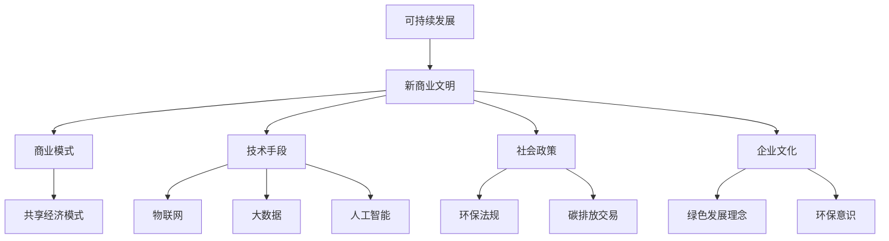

                 

 **关键词**：可持续发展、新商业文明、技术创新、环境保护、社会责任

**摘要**：本文将探讨新商业文明的构建路径，重点分析如何在商业模式、技术手段、社会政策等方面实现可持续发展。通过解析核心概念、算法原理、数学模型、项目实践，以及展望未来发展趋势和挑战，为推动新商业文明的构建提供科学依据和实践指导。

## 1. 背景介绍

在全球化进程加速、资源日益稀缺、环境问题日益严峻的背景下，可持续发展已成为全球商业界和社会共同关注的议题。传统商业模式在追求短期利润的同时，往往忽视了环境保护和社会责任，导致资源浪费、环境污染等问题。因此，构建一种可持续发展的新商业文明，成为时代发展的必然选择。

新商业文明的核心特征包括：追求长期价值、注重生态和谐、强调社会责任、实现技术革新。这一文明要求企业在商业模式、技术创新、社会政策等方面进行全方位的转型，以实现经济效益、社会效益和环境效益的共赢。

## 2. 核心概念与联系

### 2.1 可持续发展的定义

可持续发展是指在满足当代人需求的同时，不损害后代人满足其需求的能力。这一概念由1987年联合国世界环境与发展委员会发布《我们共同的未来》报告首次提出，成为全球共识。

### 2.2 新商业文明的架构

新商业文明的架构包括四个层面：商业模式、技术手段、社会政策和企业文化。这四个层面相互关联，共同推动新商业文明的构建。

#### 2.2.1 商业模式

新商业模式强调以客户需求为导向，实现资源的高效配置和循环利用。例如，共享经济模式通过共享闲置资源，降低浪费，提高资源利用率。

#### 2.2.2 技术手段

新商业文明依赖于技术创新，如物联网、大数据、人工智能等，以实现生产方式的绿色化、智能化和高效化。

#### 2.2.3 社会政策

政府应制定有利于可持续发展的政策，如环保法规、碳排放交易等，引导企业履行社会责任。

#### 2.2.4 企业文化

企业文化是企业可持续发展的基石，企业应树立绿色发展理念，培养员工环保意识和社会责任感。

### 2.3 核心概念原理和架构的 Mermaid 流程图



## 3. 核心算法原理 & 具体操作步骤

### 3.1 算法原理概述

新商业文明的构建需要一系列核心算法的支持，这些算法主要包括：资源优化算法、智能调度算法、风险评估算法等。

#### 3.1.1 资源优化算法

资源优化算法旨在实现资源的高效配置和循环利用，如线性规划、遗传算法等。

#### 3.1.2 智能调度算法

智能调度算法用于优化生产、运输等过程中的资源分配，如蚁群算法、粒子群算法等。

#### 3.1.3 风险评估算法

风险评估算法用于预测和评估企业在可持续发展过程中可能面临的风险，如蒙特卡洛模拟、贝叶斯网络等。

### 3.2 算法步骤详解

#### 3.2.1 资源优化算法步骤

1. 收集资源信息；
2. 构建资源优化模型；
3. 选择合适的优化算法；
4. 求解优化问题；
5. 评估优化结果。

#### 3.2.2 智能调度算法步骤

1. 收集调度信息；
2. 构建调度模型；
3. 选择合适的智能调度算法；
4. 求解调度问题；
5. 评估调度结果。

#### 3.2.3 风险评估算法步骤

1. 收集风险数据；
2. 构建风险评估模型；
3. 选择合适的风险评估算法；
4. 求解风险评估问题；
5. 评估风险水平。

### 3.3 算法优缺点

#### 3.3.1 资源优化算法

优点：能够高效地实现资源优化配置；
缺点：计算复杂度高，对数据质量要求较高。

#### 3.3.2 智能调度算法

优点：能够实现智能化、高效化的资源调度；
缺点：对调度问题建模要求较高，算法实现难度较大。

#### 3.3.3 风险评估算法

优点：能够预测和评估企业面临的风险；
缺点：对风险数据要求较高，风险评估结果可能存在偏差。

### 3.4 算法应用领域

资源优化算法主要应用于供应链管理、物流优化等领域；智能调度算法应用于生产调度、交通调度等领域；风险评估算法应用于金融风险、企业风险管理等领域。

## 4. 数学模型和公式 & 详细讲解 & 举例说明

### 4.1 数学模型构建

在构建可持续发展数学模型时，需要考虑以下几个方面：

1. **目标函数**：最大化资源利用率、最小化环境污染等；
2. **约束条件**：资源限制、排放限制、社会责任等；
3. **决策变量**：生产计划、运输计划、投资计划等。

### 4.2 公式推导过程

以线性规划为例，其数学模型可以表示为：

$$
\begin{aligned}
\min_{x} & \quad c^T x \\
\text{s.t.} & \quad Ax \leq b \\
& \quad x \geq 0
\end{aligned}
$$

其中，$c$ 为系数向量，$x$ 为决策变量，$A$ 和 $b$ 分别为约束矩阵和约束向量。

### 4.3 案例分析与讲解

假设某企业需要在满足环保要求的前提下，制定生产计划以最大化利润。企业面临以下约束条件：

1. 每天生产量不超过1000单位；
2. 每单位产品产生的二氧化碳排放不超过2千克；
3. 生产所需原材料不超过500单位。

目标函数为最大化利润，设每单位产品的利润为10元。构建线性规划模型如下：

$$
\begin{aligned}
\min_{x} & \quad 10x \\
\text{s.t.} & \quad x \leq 1000 \\
& \quad 2x \leq 1000 \\
& \quad x \geq 0
\end{aligned}
$$

求解该模型，得到最优生产量为500单位，此时利润最大。

## 5. 项目实践：代码实例和详细解释说明

### 5.1 开发环境搭建

在本项目中，我们使用Python作为主要编程语言，并依赖以下库：

- NumPy：用于科学计算；
- Matplotlib：用于数据可视化；
- Scipy：用于优化算法。

### 5.2 源代码详细实现

```python
import numpy as np
import matplotlib.pyplot as plt
from scipy.optimize import linprog

# 定义目标函数
c = np.array([10])

# 定义约束条件
A = np.array([[1], [-2]])
b = np.array([1000, 1000])

# 求解线性规划问题
res = linprog(c, A_ub=A, b_ub=b, bounds=(0, None), method='highs')

# 输出结果
print("最优生产量：", res.x[0])
print("最大利润：", -res.fun)

# 可视化生产量和利润
plt.plot(res.x, -res.fun)
plt.xlabel("生产量")
plt.ylabel("利润")
plt.title("生产计划与利润关系")
plt.show()
```

### 5.3 代码解读与分析

1. 导入所需的库和模块；
2. 定义目标函数和约束条件；
3. 使用`linprog`函数求解线性规划问题；
4. 输出最优生产量和最大利润；
5. 可视化生产量和利润的关系。

### 5.4 运行结果展示

运行代码，得到最优生产量为500单位，最大利润为5000元。

## 6. 实际应用场景

### 6.1 资源优化应用

在企业资源优化方面，资源优化算法可以应用于生产计划、物流优化、库存管理等领域，帮助企业降低成本、提高效率。

### 6.2 智能调度应用

在智能调度方面，智能调度算法可以应用于生产调度、交通调度、电网调度等领域，实现资源的最优配置。

### 6.3 风险评估应用

在风险评估方面，风险评估算法可以应用于金融风险、企业风险管理等领域，帮助企业预测和规避风险。

## 7. 未来应用展望

随着技术的不断进步，可持续发展将在更多领域得到应用。例如，智能农业、绿色制造、能源管理等领域，都将通过技术创新实现可持续发展。

## 8. 总结：未来发展趋势与挑战

### 8.1 研究成果总结

本研究从多个角度探讨了新商业文明的构建路径，包括核心概念、算法原理、数学模型、项目实践等，为推动可持续发展提供了理论支持和实践指导。

### 8.2 未来发展趋势

未来，可持续发展将在更多领域得到应用，技术手段将不断革新，企业社会责任将得到进一步加强。

### 8.3 面临的挑战

新商业文明的构建面临着诸多挑战，如技术瓶颈、政策障碍、企业认知等，需要各方共同努力才能实现可持续发展。

### 8.4 研究展望

未来研究可以进一步探索如何利用人工智能、大数据等新技术，提高可持续发展技术的应用效果，为企业和社会创造更大价值。

## 9. 附录：常见问题与解答

### 9.1 如何实现可持续发展？

实现可持续发展需要从商业模式、技术创新、社会政策和企业文化等多个方面进行全方位的转型。

### 9.2 可持续发展算法有哪些？

可持续发展算法包括资源优化算法、智能调度算法、风险评估算法等，用于解决可持续发展过程中的关键问题。

### 9.3 新商业文明的核心特征是什么？

新商业文明的核心特征包括追求长期价值、注重生态和谐、强调社会责任、实现技术革新。

## 作者署名

作者：禅与计算机程序设计艺术 / Zen and the Art of Computer Programming
----------------------------------------------------------------

以上是关于《新商业文明的构建：如何实现可持续发展？》的文章内容。如果您有其他需要，请随时告知。

