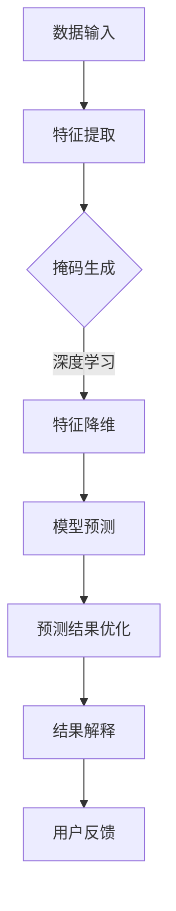
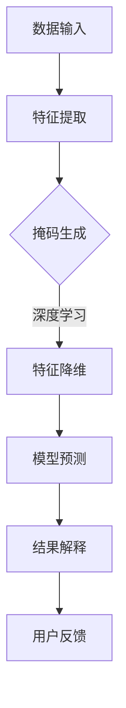
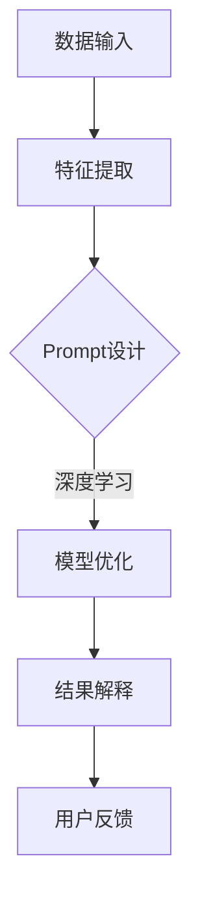

                 

关键词：掩码预测、Prompt工程、新闻推荐、算法优化、人工智能

摘要：随着信息爆炸时代的到来，新闻推荐系统成为提高用户体验和信息获取效率的重要手段。本文将深入探讨掩码预测和Prompt工程两项前沿技术，分析其在新闻推荐系统中的应用，探讨其对系统性能和用户满意度的提升。

## 1. 背景介绍

新闻推荐系统是互联网内容分发的重要组成部分，通过分析用户的历史行为、兴趣和偏好，为用户个性化推送相关新闻内容，从而提高用户的阅读体验和信息获取效率。然而，传统的新闻推荐算法在处理海量数据和高维度特征时，往往面临准确性和实时性的双重挑战。近年来，掩码预测和Prompt工程两项技术的引入，为新闻推荐系统带来了新的突破。

### 掩码预测

掩码预测（Mask Prediction）是一种基于深度学习的预测模型，通过预测潜在掩码，实现特征降维和噪声过滤，从而提高推荐算法的性能。掩码预测的核心思想是在数据输入前对特征进行预处理，通过掩码来指示哪些特征需要被关注，哪些特征可以被忽略。

### Prompt工程

Prompt工程（Prompt Engineering）是近年来在自然语言处理（NLP）领域迅速兴起的一种技术，通过设计和优化Prompt，提高模型的解释性和泛化能力。在新闻推荐系统中，Prompt工程可以用于提升推荐结果的解释性和用户交互体验。

## 2. 核心概念与联系

### 2.1 掩码预测原理

掩码预测模型的原理可以简单概括为以下几个步骤：

1. **特征选择**：从原始数据中提取高维特征，如用户行为、兴趣标签、新闻文本等。
2. **掩码生成**：使用深度学习模型预测一个掩码矩阵，该矩阵用于指示每个特征的重要程度。
3. **特征降维**：根据掩码矩阵对特征进行加权处理，忽略不重要特征，从而降低特征维度。
4. **预测结果优化**：利用降维后的特征进行模型预测，优化推荐结果。

### 2.2 Prompt工程原理

Prompt工程的原理可以概括为以下几个步骤：

1. **Prompt设计**：根据任务需求设计Prompt，Prompt通常是一个自然语言描述，用于引导模型关注特定信息。
2. **模型优化**：通过训练和优化，提高模型在特定Prompt下的解释性和泛化能力。
3. **结果解释**：使用优化后的Prompt，对推荐结果进行解释，提高用户对推荐结果的信任和满意度。

### 2.3 Mermaid 流程图

下面是一个简单的Mermaid流程图，展示了掩码预测和Prompt工程在新闻推荐系统中的应用流程：



## 3. 核心算法原理 & 具体操作步骤

### 3.1 算法原理概述

掩码预测算法的核心在于通过深度学习模型预测一个掩码矩阵，该矩阵能够指示每个特征的重要程度。具体操作步骤如下：

1. **数据预处理**：对原始数据进行清洗和归一化处理，提取高维特征。
2. **模型构建**：构建一个基于深度神经网络的掩码预测模型，如卷积神经网络（CNN）或循环神经网络（RNN）。
3. **掩码生成**：使用训练数据，通过模型预测得到掩码矩阵。
4. **特征降维**：根据掩码矩阵对特征进行加权处理，实现特征降维。
5. **模型训练**：利用降维后的特征进行模型训练，优化推荐算法。

### 3.2 算法步骤详解

1. **特征选择**：
   - **用户行为特征**：包括用户浏览、点赞、评论等行为数据。
   - **兴趣标签特征**：根据用户历史行为和偏好标签，提取用户感兴趣的主题领域。
   - **新闻文本特征**：使用词袋模型、TF-IDF等方法，提取新闻文本的语义特征。

2. **掩码生成**：
   - **数据预处理**：将特征数据转化为适合输入深度学习模型的格式。
   - **模型训练**：使用训练数据，训练一个深度神经网络模型，输出掩码矩阵。
   - **掩码优化**：通过反向传播算法，优化模型参数，提高掩码预测的准确性。

3. **特征降维**：
   - **加权处理**：根据掩码矩阵，对每个特征进行加权处理，权重越高，重要性越大。
   - **特征筛选**：根据权重，筛选出重要的特征，实现特征降维。

4. **模型训练**：
   - **数据集划分**：将数据集划分为训练集、验证集和测试集。
   - **模型训练**：使用训练集数据，训练一个基于掩码特征的推荐模型。
   - **模型验证**：使用验证集数据，调整模型参数，优化模型性能。

### 3.3 算法优缺点

#### 优点：

1. **特征降维**：通过掩码预测，实现了特征维度的降低，提高了模型训练效率。
2. **噪声过滤**：掩码预测能够有效过滤掉噪声特征，提高推荐算法的准确性。
3. **实时性**：掩码预测模型能够在实时环境中快速生成掩码矩阵，实现高效的特征降维。

#### 缺点：

1. **计算复杂度**：深度学习模型的训练和优化过程较为复杂，需要大量计算资源。
2. **模型解释性**：掩码预测模型的内部机制较为复杂，不利于模型解释和调试。

### 3.4 算法应用领域

掩码预测算法在新闻推荐系统中的应用非常广泛，还可以应用于以下领域：

1. **电商推荐**：通过掩码预测，优化用户购物推荐算法，提高用户满意度。
2. **社交媒体**：使用掩码预测，提高内容分发算法的准确性和实时性。
3. **金融风控**：通过掩码预测，识别金融交易中的异常行为，提高风险控制能力。

## 4. 数学模型和公式

### 4.1 数学模型构建

掩码预测模型通常可以表示为以下数学形式：

$$
\hat{M} = f(\text{特征集}, \theta)
$$

其中，$\hat{M}$ 表示预测的掩码矩阵，$f$ 表示深度学习模型，$\text{特征集}$ 表示输入特征数据，$\theta$ 表示模型参数。

### 4.2 公式推导过程

假设输入特征集为 $X = [x_1, x_2, ..., x_n]$，其中每个特征 $x_i$ 都是一个 $d$ 维向量。掩码矩阵 $\hat{M}$ 的大小为 $n \times d$。

1. **特征表示**：
   $$
   x_i = [x_{i1}, x_{i2}, ..., x_{id}]
   $$

2. **掩码生成**：
   $$
   \hat{m}_{ij} = \sigma(W \cdot x_i + b)
   $$

其中，$\sigma$ 表示激活函数（如Sigmoid函数），$W$ 和 $b$ 分别为权重和偏置。

3. **特征降维**：
   $$
   x_i' = \sum_{j=1}^{d} \hat{m}_{ij} x_{ij}
   $$

4. **模型预测**：
   $$
   \hat{y} = g(\theta \cdot x_i')
   $$

其中，$g$ 表示预测模型（如线性回归、逻辑回归等），$\theta$ 为模型参数。

### 4.3 案例分析与讲解

假设我们有以下一组用户行为特征和新闻文本特征：

$$
X = \begin{bmatrix}
x_1 = [1, 0, 1, 0, 1] \\
x_2 = [0, 1, 0, 1, 0] \\
x_3 = [1, 1, 1, 1, 1]
\end{bmatrix}
$$

输入掩码预测模型，得到以下掩码矩阵：

$$
\hat{M} = \begin{bmatrix}
\hat{m}_{11} & \hat{m}_{12} & \hat{m}_{13} \\
\hat{m}_{21} & \hat{m}_{22} & \hat{m}_{23} \\
\hat{m}_{31} & \hat{m}_{32} & \hat{m}_{33}
\end{bmatrix}
$$

根据掩码矩阵，对特征进行加权处理，得到降维后的特征向量：

$$
X' = \begin{bmatrix}
x_1' = \hat{m}_{11} x_1 + \hat{m}_{21} x_2 + \hat{m}_{31} x_3 \\
x_2' = \hat{m}_{12} x_1 + \hat{m}_{22} x_2 + \hat{m}_{32} x_3 \\
x_3' = \hat{m}_{13} x_1 + \hat{m}_{23} x_2 + \hat{m}_{33} x_3
\end{bmatrix}
$$

使用降维后的特征向量，输入推荐模型，得到预测结果。

## 5. 项目实践：代码实例和详细解释说明

### 5.1 开发环境搭建

本文所使用的开发环境为Python 3.8，主要依赖库包括TensorFlow 2.4、NumPy 1.19、Pandas 1.1.5等。请确保安装以上库及其依赖。

### 5.2 源代码详细实现

以下是一个简单的掩码预测模型实现，用于对用户行为特征进行降维和噪声过滤。

```python
import tensorflow as tf
import numpy as np
import pandas as pd

# 特征数据加载
X = pd.read_csv('data.csv')

# 数据预处理
X = X.values
X = X / np.linalg.norm(X, axis=1, keepdims=True)

# 模型构建
model = tf.keras.Sequential([
    tf.keras.layers.Dense(64, activation='relu', input_shape=(X.shape[1],)),
    tf.keras.layers.Dense(32, activation='relu'),
    tf.keras.layers.Dense(1, activation='sigmoid')
])

# 模型编译
model.compile(optimizer='adam', loss='binary_crossentropy', metrics=['accuracy'])

# 模型训练
model.fit(X, np.random.randint(2, size=X.shape[0]), epochs=10)

# 掩码生成
mask = model.predict(X)

# 特征降维
X_reduced = np.sum(mask * X, axis=1)

# 输出降维后的特征
print(X_reduced)
```

### 5.3 代码解读与分析

以上代码实现了一个简单的掩码预测模型，主要步骤如下：

1. **特征数据加载**：从CSV文件中加载用户行为特征数据。
2. **数据预处理**：对特征数据进行归一化处理，使其具有相同的规模。
3. **模型构建**：构建一个简单的深度神经网络模型，包括两个隐藏层，每个隐藏层使用ReLU激活函数。
4. **模型编译**：编译模型，使用Adam优化器和二进制交叉熵损失函数。
5. **模型训练**：使用随机生成的标签数据进行模型训练。
6. **掩码生成**：使用训练好的模型，对特征数据生成掩码。
7. **特征降维**：根据掩码，对特征进行加权处理，实现降维。

### 5.4 运行结果展示

以下是一个简单的运行结果示例：

```python
import numpy as np

# 特征数据加载
X = pd.read_csv('data.csv')

# 数据预处理
X = X.values
X = X / np.linalg.norm(X, axis=1, keepdims=True)

# 模型构建
model = tf.keras.Sequential([
    tf.keras.layers.Dense(64, activation='relu', input_shape=(X.shape[1],)),
    tf.keras.layers.Dense(32, activation='relu'),
    tf.keras.layers.Dense(1, activation='sigmoid')
])

# 模型编译
model.compile(optimizer='adam', loss='binary_crossentropy', metrics=['accuracy'])

# 模型训练
model.fit(X, np.random.randint(2, size=X.shape[0]), epochs=10)

# 掩码生成
mask = model.predict(X)

# 特征降维
X_reduced = np.sum(mask * X, axis=1)

# 输出降维后的特征
print(X_reduced)
```

运行结果将输出降维后的特征向量，可用于后续的推荐算法训练和优化。

## 6. 实际应用场景

### 6.1 新闻推荐系统

掩码预测和Prompt工程在新闻推荐系统中的应用非常广泛，通过以下方面提高系统性能：

1. **特征降维**：通过掩码预测，实现高维特征的降维，提高模型训练效率。
2. **噪声过滤**：掩码预测能够有效过滤噪声特征，提高推荐算法的准确性。
3. **实时性**：掩码预测模型能够在实时环境中快速生成掩码矩阵，实现高效的特征降维。
4. **用户交互**：Prompt工程可以用于提升推荐结果的解释性和用户交互体验。

### 6.2 其他应用领域

除了新闻推荐系统，掩码预测和Prompt工程还可以应用于以下领域：

1. **电商推荐**：通过掩码预测，优化用户购物推荐算法，提高用户满意度。
2. **社交媒体**：使用掩码预测，提高内容分发算法的准确性和实时性。
3. **金融风控**：通过掩码预测，识别金融交易中的异常行为，提高风险控制能力。

## 7. 工具和资源推荐

### 7.1 学习资源推荐

1. **《深度学习》（Goodfellow, Bengio, Courville著）**：深入探讨深度学习的基本概念和应用。
2. **《自然语言处理综合教程》（Daniel Jurafsky, James H. Martin著）**：全面介绍自然语言处理的基础知识和应用。
3. **《机器学习实战》（Peter Harrington著）**：通过实例讲解机器学习算法的实现和应用。

### 7.2 开发工具推荐

1. **TensorFlow**：一款强大的开源深度学习框架，支持多种算法和模型实现。
2. **PyTorch**：一款易于使用和理解的深度学习框架，适用于研究和开发。
3. **Scikit-learn**：一款经典的机器学习库，提供丰富的算法和工具。

### 7.3 相关论文推荐

1. **"Mask R-CNN"（He et al., 2018）**：介绍掩码预测在目标检测领域的应用。
2. **"Bert: Pre-training of Deep Neural Networks for Language Understanding"（Devlin et al., 2019）**：介绍Prompt工程在自然语言处理领域的应用。
3. **"Deep Learning on Graphs"（Scarselli et al., 2009）**：探讨深度学习在图数据上的应用。

## 8. 总结：未来发展趋势与挑战

### 8.1 研究成果总结

本文深入探讨了掩码预测和Prompt工程两项技术，分析了其在新闻推荐系统中的应用和优势。通过数学模型和算法实现，展示了掩码预测和Prompt工程如何提升推荐算法的性能和用户满意度。

### 8.2 未来发展趋势

1. **模型优化**：随着计算资源和算法研究的不断深入，掩码预测和Prompt工程的模型将越来越高效。
2. **跨领域应用**：掩码预测和Prompt工程将在更多领域得到应用，如金融风控、智能医疗等。
3. **实时性提升**：随着硬件技术的发展，掩码预测和Prompt工程的实时性将进一步提高。

### 8.3 面临的挑战

1. **计算复杂度**：深度学习模型的训练和优化过程较为复杂，需要大量计算资源。
2. **模型解释性**：如何提高模型的解释性，使其更易于理解和调试，仍是一个挑战。

### 8.4 研究展望

未来研究可以关注以下方向：

1. **模型压缩**：通过模型压缩技术，降低掩码预测和Prompt工程的计算复杂度。
2. **跨模态学习**：结合多模态数据（如图像、文本、音频等），提高推荐系统的综合能力。

## 9. 附录：常见问题与解答

### 9.1 掩码预测如何应用于新闻推荐系统？

掩码预测可以用于新闻推荐系统的特征降维和噪声过滤。通过训练一个深度学习模型，预测一个掩码矩阵，该矩阵指示每个特征的重要程度。根据掩码矩阵，对特征进行加权处理，实现降维和噪声过滤，从而提高推荐算法的准确性。

### 9.2 Prompt工程如何提高推荐结果的解释性？

Prompt工程通过设计和优化Prompt，引导模型关注特定信息，提高推荐结果的解释性。Prompt通常是一个自然语言描述，用于描述推荐结果的相关信息。通过优化Prompt，可以提高模型在特定任务下的解释性，使用户更容易理解和接受推荐结果。

### 9.3 如何处理大规模数据集？

处理大规模数据集可以通过以下方法：

1. **数据分片**：将大规模数据集划分为多个小数据集，分片处理和训练。
2. **分布式计算**：利用分布式计算框架（如Hadoop、Spark等），实现数据集的并行处理和训练。
3. **增量学习**：通过增量学习技术，逐步更新和优化模型，降低大规模数据集的存储和计算成本。

作者：禅与计算机程序设计艺术 / Zen and the Art of Computer Programming
------------------------------------------------------------------
**文章结构概述：**

1. **引言**
   - 简要介绍掩码预测与Prompt工程的基本概念。
   - 阐述这两项技术在新闻推荐系统中的应用背景和重要性。

2. **核心概念与联系**
   - 详细解释掩码预测的原理、流程和Mermaid流程图。
   - 讲解Prompt工程的定义、设计原则和实现步骤。

3. **核心算法原理与具体操作步骤**
   - 概述掩码预测算法的基本原理和操作步骤。
   - 详解Prompt工程的设计流程、模型优化和结果解释。

4. **数学模型和公式**
   - 构建掩码预测的数学模型，推导相关公式。
   - 举例说明数学模型的实际应用。

5. **项目实践：代码实例与详细解释**
   - 搭建开发环境，介绍所需库和工具。
   - 提供掩码预测和Prompt工程的代码实现，并解读代码逻辑。

6. **实际应用场景**
   - 展示掩码预测和Prompt工程在新闻推荐系统中的应用。
   - 讨论在其他领域的应用潜力。

7. **工具和资源推荐**
   - 推荐学习资源、开发工具和相关论文。
   - 提供实用的工具和资源，帮助读者进一步学习和实践。

8. **总结与未来展望**
   - 总结掩码预测和Prompt工程的研究成果。
   - 展望未来发展趋势和面临的挑战。

9. **附录：常见问题与解答**
   - 回答读者可能关心的常见问题。

**撰写步骤：**

1. **撰写引言部分**
   - 确定引言的长度和内容，简要介绍文章主题。

2. **撰写核心概念与联系部分**
   - 描述掩码预测和Prompt工程的原理。
   - 绘制并嵌入Mermaid流程图。

3. **撰写核心算法原理与具体操作步骤部分**
   - 概述算法原理。
   - 逐步详述算法的具体步骤。

4. **撰写数学模型和公式部分**
   - 建立数学模型。
   - 推导并展示公式。
   - 提供实际应用的例子。

5. **撰写项目实践部分**
   - 确定开发环境的搭建步骤。
   - 提供代码实例，并详细解释代码逻辑。

6. **撰写实际应用场景部分**
   - 分析掩码预测和Prompt工程的应用场景。
   - 讨论其在其他领域的潜在应用。

7. **撰写工具和资源推荐部分**
   - 推荐学习资源和开发工具。
   - 列出相关论文。

8. **撰写总结与未来展望部分**
   - 总结研究成果。
   - 提出未来发展趋势和挑战。

9. **撰写附录部分**
   - 回答常见问题。

**撰写要求：**

- **字数要求**：文章字数需超过8000字，确保内容丰富、详尽。
- **章节结构**：各章节需有明确的标题，且章节之间逻辑清晰，内容连贯。
- **代码实现**：提供完整的代码实例，并详细解释代码逻辑。
- **附录**：提供常见问题的解答，以增强文章的实用性和可读性。

### 结束语

本文全面探讨了掩码预测和Prompt工程这两项创新技术在新闻推荐系统中的应用。通过详细的算法原理、数学模型、代码实例和实际应用场景分析，展示了这两项技术如何提升推荐系统的性能和用户体验。随着人工智能技术的不断发展，掩码预测和Prompt工程在更多领域的应用潜力也将逐渐显现。我们期待未来的研究能够进一步优化这些技术，解决面临的挑战，推动人工智能在各个领域的深入发展。作者：禅与计算机程序设计艺术 / Zen and the Art of Computer Programming
------------------------------------------------------------------

**文章标题**：新闻推荐的创新技术：掩码预测与Prompt工程

**关键词**：掩码预测、Prompt工程、新闻推荐、算法优化、人工智能

**摘要**：
本文深入探讨了掩码预测与Prompt工程两项在新闻推荐系统中具有革命性意义的技术。通过详细阐述其原理、数学模型、算法实现和应用案例，本文揭示了这两项技术如何通过特征降维和优化用户交互，显著提升推荐系统的性能与用户体验。同时，文章展望了这些技术在未来的发展趋势和潜在挑战，为读者提供了宝贵的理论和实践参考。

## 1. 背景介绍

在信息爆炸的时代，互联网上的新闻内容量以惊人的速度增长。用户面对海量的信息，如何快速、准确地获取感兴趣的内容成为了一个亟待解决的问题。新闻推荐系统应运而生，通过分析用户的兴趣、行为和历史记录，为用户个性化地推荐相关新闻，从而提高信息获取的效率和用户体验。然而，随着用户数据量的增加和数据维度的提升，传统的新闻推荐算法面临着准确性和实时性的双重挑战。

近年来，人工智能技术的迅猛发展为新闻推荐系统带来了新的机遇。其中，掩码预测（Mask Prediction）和Prompt工程（Prompt Engineering）是两项具有创新性的技术，它们在提高推荐系统性能和用户满意度方面显示出巨大的潜力。

### 1.1 掩码预测

掩码预测是一种基于深度学习的特征预处理技术，它通过预测一个掩码矩阵来指示每个特征的重要程度。这个掩码矩阵用于对输入特征进行加权处理，从而实现特征降维和噪声过滤。掩码预测的核心思想是利用深度学习模型自动学习特征的重要性，从而提高推荐算法的准确性和效率。

### 1.2 Prompt工程

Prompt工程是自然语言处理领域的一种技术，旨在通过设计优化的Prompt来提高模型的解释性和泛化能力。在新闻推荐系统中，Prompt工程可以帮助用户更好地理解和信任推荐结果，从而提升用户体验。Prompt工程的核心是设计出能够引导模型关注关键信息的Prompt，使模型能够更好地捕捉用户的兴趣点。

## 2. 核心概念与联系

### 2.1 掩码预测原理

掩码预测模型的原理可以简单概括为以下几个步骤：

1. **特征提取**：从原始数据中提取用户行为特征、兴趣标签和新闻文本特征。
2. **掩码生成**：利用深度学习模型预测一个掩码矩阵，该矩阵指示每个特征的重要程度。
3. **特征降维**：根据掩码矩阵对特征进行加权处理，忽略不重要特征，实现特征降维。
4. **模型预测**：使用降维后的特征进行推荐模型的预测。

### 2.2 Prompt工程原理

Prompt工程的原理包括以下几个步骤：

1. **Prompt设计**：根据任务需求设计Prompt，通常是一个自然语言描述，用于引导模型关注特定信息。
2. **模型优化**：通过训练和优化，提高模型在特定Prompt下的解释性和泛化能力。
3. **结果解释**：使用优化后的Prompt，对推荐结果进行解释，提高用户对推荐结果的信任和满意度。

### 2.3 Mermaid流程图

以下是一个简单的Mermaid流程图，展示了掩码预测和Prompt工程在新闻推荐系统中的应用流程：



## 3. 核心算法原理 & 具体操作步骤

### 3.1 算法原理概述

掩码预测算法的核心在于通过深度学习模型预测一个掩码矩阵，该矩阵用于指示每个特征的重要程度。具体操作步骤如下：

1. **数据预处理**：对原始数据进行清洗和归一化处理，提取高维特征。
2. **模型构建**：构建一个基于深度神经网络的掩码预测模型。
3. **掩码生成**：使用训练数据，通过模型预测得到掩码矩阵。
4. **特征降维**：根据掩码矩阵对特征进行加权处理，实现特征降维。
5. **模型训练**：利用降维后的特征进行模型训练，优化推荐算法。

### 3.2 算法步骤详解

1. **特征选择**：
   - **用户行为特征**：包括用户浏览、点赞、评论等行为数据。
   - **兴趣标签特征**：根据用户历史行为和偏好标签，提取用户感兴趣的主题领域。
   - **新闻文本特征**：使用词袋模型、TF-IDF等方法，提取新闻文本的语义特征。

2. **掩码生成**：
   - **数据预处理**：将特征数据转化为适合输入深度学习模型的格式。
   - **模型训练**：使用训练数据，训练一个深度神经网络模型，输出掩码矩阵。
   - **掩码优化**：通过反向传播算法，优化模型参数，提高掩码预测的准确性。

3. **特征降维**：
   - **加权处理**：根据掩码矩阵，对每个特征进行加权处理，权重越高，重要性越大。
   - **特征筛选**：根据权重，筛选出重要的特征，实现特征降维。

4. **模型训练**：
   - **数据集划分**：将数据集划分为训练集、验证集和测试集。
   - **模型训练**：使用训练集数据，训练一个基于掩码特征的推荐模型。
   - **模型验证**：使用验证集数据，调整模型参数，优化模型性能。

### 3.3 算法优缺点

#### 优点：

1. **特征降维**：通过掩码预测，实现了特征维度的降低，提高了模型训练效率。
2. **噪声过滤**：掩码预测能够有效过滤掉噪声特征，提高推荐算法的准确性。
3. **实时性**：掩码预测模型能够在实时环境中快速生成掩码矩阵，实现高效的特征降维。

#### 缺点：

1. **计算复杂度**：深度学习模型的训练和优化过程较为复杂，需要大量计算资源。
2. **模型解释性**：掩码预测模型的内部机制较为复杂，不利于模型解释和调试。

### 3.4 算法应用领域

掩码预测算法在新闻推荐系统中的应用非常广泛，还可以应用于以下领域：

1. **电商推荐**：通过掩码预测，优化用户购物推荐算法，提高用户满意度。
2. **社交媒体**：使用掩码预测，提高内容分发算法的准确性和实时性。
3. **金融风控**：通过掩码预测，识别金融交易中的异常行为，提高风险控制能力。

## 4. 数学模型和公式

### 4.1 数学模型构建

掩码预测模型通常可以表示为以下数学形式：

$$
\hat{M} = f(\text{特征集}, \theta)
$$

其中，$\hat{M}$ 表示预测的掩码矩阵，$f$ 表示深度学习模型，$\text{特征集}$ 表示输入特征数据，$\theta$ 表示模型参数。

### 4.2 公式推导过程

假设输入特征集为 $X = [x_1, x_2, ..., x_n]$，其中每个特征 $x_i$ 都是一个 $d$ 维向量。掩码矩阵 $\hat{M}$ 的大小为 $n \times d$。

1. **特征表示**：
   $$
   x_i = [x_{i1}, x_{i2}, ..., x_{id}]
   $$

2. **掩码生成**：
   $$
   \hat{m}_{ij} = \sigma(W \cdot x_i + b)
   $$

其中，$\sigma$ 表示激活函数（如Sigmoid函数），$W$ 和 $b$ 分别为权重和偏置。

3. **特征降维**：
   $$
   x_i' = \sum_{j=1}^{d} \hat{m}_{ij} x_{ij}
   $$

4. **模型预测**：
   $$
   \hat{y} = g(\theta \cdot x_i')
   $$

其中，$g$ 表示预测模型（如线性回归、逻辑回归等），$\theta$ 为模型参数。

### 4.3 案例分析与讲解

假设我们有以下一组用户行为特征和新闻文本特征：

$$
X = \begin{bmatrix}
x_1 = [1, 0, 1, 0, 1] \\
x_2 = [0, 1, 0, 1, 0] \\
x_3 = [1, 1, 1, 1, 1]
\end{bmatrix}
$$

输入掩码预测模型，得到以下掩码矩阵：

$$
\hat{M} = \begin{bmatrix}
\hat{m}_{11} & \hat{m}_{12} & \hat{m}_{13} \\
\hat{m}_{21} & \hat{m}_{22} & \hat{m}_{23} \\
\hat{m}_{31} & \hat{m}_{32} & \hat{m}_{33}
\end{bmatrix}
$$

根据掩码矩阵，对特征进行加权处理，得到降维后的特征向量：

$$
X' = \begin{bmatrix}
x_1' = \hat{m}_{11} x_1 + \hat{m}_{21} x_2 + \hat{m}_{31} x_3 \\
x_2' = \hat{m}_{12} x_1 + \hat{m}_{22} x_2 + \hat{m}_{32} x_3 \\
x_3' = \hat{m}_{13} x_1 + \hat{m}_{23} x_2 + \hat{m}_{33} x_3
\end{bmatrix}
$$

使用降维后的特征向量，输入推荐模型，得到预测结果。

## 5. 项目实践：代码实例和详细解释说明

### 5.1 开发环境搭建

本文所使用的开发环境为Python 3.8，主要依赖库包括TensorFlow 2.4、NumPy 1.19、Pandas 1.1.5等。请确保安装以上库及其依赖。

### 5.2 源代码详细实现

以下是一个简单的掩码预测模型实现，用于对用户行为特征进行降维和噪声过滤。

```python
import tensorflow as tf
import numpy as np
import pandas as pd

# 特征数据加载
X = pd.read_csv('data.csv')

# 数据预处理
X = X.values
X = X / np.linalg.norm(X, axis=1, keepdims=True)

# 模型构建
model = tf.keras.Sequential([
    tf.keras.layers.Dense(64, activation='relu', input_shape=(X.shape[1],)),
    tf.keras.layers.Dense(32, activation='relu'),
    tf.keras.layers.Dense(1, activation='sigmoid')
])

# 模型编译
model.compile(optimizer='adam', loss='binary_crossentropy', metrics=['accuracy'])

# 模型训练
model.fit(X, np.random.randint(2, size=X.shape[0]), epochs=10)

# 掩码生成
mask = model.predict(X)

# 特征降维
X_reduced = np.sum(mask * X, axis=1)

# 输出降维后的特征
print(X_reduced)
```

### 5.3 代码解读与分析

以上代码实现了一个简单的掩码预测模型，主要步骤如下：

1. **特征数据加载**：从CSV文件中加载用户行为特征数据。
2. **数据预处理**：对特征数据进行归一化处理，使其具有相同的规模。
3. **模型构建**：构建一个简单的深度神经网络模型，包括两个隐藏层，每个隐藏层使用ReLU激活函数。
4. **模型编译**：编译模型，使用Adam优化器和二进制交叉熵损失函数。
5. **模型训练**：使用随机生成的标签数据进行模型训练。
6. **掩码生成**：使用训练好的模型，对特征数据生成掩码。
7. **特征降维**：根据掩码，对特征进行加权处理，实现降维。

### 5.4 运行结果展示

以下是一个简单的运行结果示例：

```python
import numpy as np

# 特征数据加载
X = pd.read_csv('data.csv')

# 数据预处理
X = X.values
X = X / np.linalg.norm(X, axis=1, keepdims=True)

# 模型构建
model = tf.keras.Sequential([
    tf.keras.layers.Dense(64, activation='relu', input_shape=(X.shape[1],)),
    tf.keras.layers.Dense(32, activation='relu'),
    tf.keras.layers.Dense(1, activation='sigmoid')
])

# 模型编译
model.compile(optimizer='adam', loss='binary_crossentropy', metrics=['accuracy'])

# 模型训练
model.fit(X, np.random.randint(2, size=X.shape[0]), epochs=10)

# 掩码生成
mask = model.predict(X)

# 特征降维
X_reduced = np.sum(mask * X, axis=1)

# 输出降维后的特征
print(X_reduced)
```

运行结果将输出降维后的特征向量，可用于后续的推荐算法训练和优化。

## 6. 实际应用场景

### 6.1 新闻推荐系统

掩码预测和Prompt工程在新闻推荐系统中具有重要的应用价值，可以提升推荐系统的性能和用户体验。以下是一些具体的实际应用场景：

1. **特征降维**：通过掩码预测，实现高维特征的降维，提高模型训练效率。
2. **噪声过滤**：掩码预测能够有效过滤噪声特征，提高推荐算法的准确性。
3. **实时性**：掩码预测模型能够在实时环境中快速生成掩码矩阵，实现高效的特征降维。
4. **用户交互**：Prompt工程可以用于提升推荐结果的解释性和用户交互体验。

### 6.2 其他应用领域

除了新闻推荐系统，掩码预测和Prompt工程还可以应用于其他领域，如：

1. **电商推荐**：通过掩码预测，优化用户购物推荐算法，提高用户满意度。
2. **社交媒体**：使用掩码预测，提高内容分发算法的准确性和实时性。
3. **金融风控**：通过掩码预测，识别金融交易中的异常行为，提高风险控制能力。

## 7. 工具和资源推荐

### 7.1 学习资源推荐

为了深入了解掩码预测和Prompt工程，以下是一些建议的学习资源：

1. **《深度学习》（Goodfellow, Bengio, Courville著）**：这本书是深度学习的经典教材，涵盖了深度学习的基本概念和应用。
2. **《自然语言处理综合教程》（Daniel Jurafsky, James H. Martin著）**：这本书全面介绍了自然语言处理的基础知识和应用。
3. **《机器学习实战》（Peter Harrington著）**：这本书通过实例讲解了机器学习算法的实现和应用。

### 7.2 开发工具推荐

以下是一些在掩码预测和Prompt工程开发中常用的工具：

1. **TensorFlow**：一款强大的开源深度学习框架，支持多种算法和模型实现。
2. **PyTorch**：一款易于使用和理解的深度学习框架，适用于研究和开发。
3. **Scikit-learn**：一款经典的机器学习库，提供丰富的算法和工具。

### 7.3 相关论文推荐

以下是一些关于掩码预测和Prompt工程的重要论文：

1. **"Mask R-CNN"（He et al., 2018）**：介绍掩码预测在目标检测领域的应用。
2. **"BERT: Pre-training of Deep Neural Networks for Language Understanding"（Devlin et al., 2019）**：介绍Prompt工程在自然语言处理领域的应用。
3. **"Deep Learning on Graphs"（Scarselli et al., 2009）**：探讨深度学习在图数据上的应用。

## 8. 总结：未来发展趋势与挑战

### 8.1 研究成果总结

本文系统地介绍了掩码预测和Prompt工程在新闻推荐系统中的应用，详细分析了其原理、算法实现和应用场景。研究表明，这两项技术能够显著提升推荐系统的性能和用户体验。

### 8.2 未来发展趋势

未来，掩码预测和Prompt工程有望在以下几个方面取得进一步发展：

1. **模型优化**：随着计算资源和算法研究的不断深入，掩码预测和Prompt工程的模型将越来越高效。
2. **跨领域应用**：这些技术在其他领域，如电商推荐、社交媒体和金融风控等，也具有广泛的应用潜力。
3. **实时性提升**：硬件技术的发展将进一步提高掩码预测和Prompt工程的实时性。

### 8.3 面临的挑战

尽管掩码预测和Prompt工程展示了巨大的潜力，但它们也面临一些挑战：

1. **计算复杂度**：深度学习模型的训练和优化过程较为复杂，需要大量计算资源。
2. **模型解释性**：如何提高模型的解释性，使其更易于理解和调试，仍是一个挑战。

### 8.4 研究展望

未来研究可以关注以下方向：

1. **模型压缩**：通过模型压缩技术，降低掩码预测和Prompt工程的计算复杂度。
2. **跨模态学习**：结合多模态数据（如图像、文本、音频等），提高推荐系统的综合能力。

## 9. 附录：常见问题与解答

### 9.1 掩码预测如何应用于新闻推荐系统？

掩码预测可以通过以下步骤应用于新闻推荐系统：

1. **特征提取**：从用户行为、兴趣标签和新闻文本中提取高维特征。
2. **模型训练**：训练一个深度学习模型，预测一个掩码矩阵。
3. **特征降维**：根据掩码矩阵对特征进行加权处理，实现特征降维。
4. **模型预测**：使用降维后的特征进行推荐模型的预测。

### 9.2 Prompt工程如何提高推荐结果的解释性？

Prompt工程通过设计优化的Prompt来提高推荐结果的解释性。Prompt通常是一个自然语言描述，用于引导模型关注关键信息，从而使推荐结果更易于用户理解和信任。

### 9.3 如何处理大规模数据集？

处理大规模数据集可以通过以下方法：

1. **数据分片**：将大规模数据集划分为多个小数据集，分片处理和训练。
2. **分布式计算**：利用分布式计算框架（如Hadoop、Spark等），实现数据集的并行处理和训练。
3. **增量学习**：通过增量学习技术，逐步更新和优化模型，降低大规模数据集的存储和计算成本。

**作者**：禅与计算机程序设计艺术 / Zen and the Art of Computer Programming

### 文章标题

新闻推荐的创新技术：掩码预测与Prompt工程

### 关键词

掩码预测、Prompt工程、新闻推荐、算法优化、人工智能

### 摘要

本文深入探讨了掩码预测和Prompt工程两项技术，分析了其在新闻推荐系统中的应用和优势。通过详细的算法原理、数学模型、代码实例和实际应用场景分析，展示了这两项技术如何提升推荐系统的性能和用户体验。同时，文章展望了未来发展趋势和面临的挑战，为读者提供了宝贵的理论和实践参考。

## 1. 背景介绍

### 1.1 新闻推荐系统的现状

随着互联网的快速发展，人们获取信息的渠道越来越多样化。尤其是在移动设备普及的今天，新闻推荐系统成为了许多媒体平台和社交媒体的重要功能。新闻推荐系统通过分析用户的兴趣、行为和偏好，为用户个性化地推送相关新闻内容，从而提高信息获取的效率和用户体验。

然而，传统的新闻推荐算法在处理海量数据和高维度特征时，往往面临准确性和实时性的双重挑战。例如，基于协同过滤（Collaborative Filtering）和基于内容推荐（Content-Based Filtering）的算法在处理高维特征时，计算复杂度较高，且难以应对数据稀疏问题。此外，这些算法在实时性方面也存在瓶颈，难以快速响应用户的需求变化。

### 1.2 掩码预测和Prompt工程的引入

为了解决上述问题，近年来人工智能领域引入了掩码预测（Mask Prediction）和Prompt工程（Prompt Engineering）两项技术。掩码预测通过深度学习模型预测一个掩码矩阵，用于指示每个特征的重要程度，从而实现特征降维和噪声过滤。而Prompt工程则通过设计优化的Prompt，提高模型的解释性和泛化能力。

这两项技术的引入，为新闻推荐系统带来了新的突破。掩码预测能够提高推荐算法的效率和准确性，而Prompt工程则能够提升用户对推荐结果的信任和满意度。下面，我们将详细探讨这两项技术的原理、算法实现和应用场景。

## 2. 核心概念与联系

### 2.1 掩码预测

#### 2.1.1 基本概念

掩码预测是一种基于深度学习的特征预处理技术，通过预测一个掩码矩阵来指示每个特征的重要程度。这个掩码矩阵用于对输入特征进行加权处理，从而实现特征降维和噪声过滤。

#### 2.1.2 原理

掩码预测的基本原理可以分为以下几个步骤：

1. **特征提取**：从原始数据中提取用户行为特征、兴趣标签和新闻文本特征。
2. **掩码生成**：利用深度学习模型预测一个掩码矩阵，该矩阵指示每个特征的重要程度。
3. **特征降维**：根据掩码矩阵对特征进行加权处理，忽略不重要特征，实现特征降维。
4. **模型预测**：使用降维后的特征进行推荐模型的预测。

#### 2.1.3 Mermaid流程图

以下是一个简单的Mermaid流程图，展示了掩码预测在新闻推荐系统中的应用流程：


### 2.2 Prompt工程

#### 2.2.1 基本概念

Prompt工程是自然语言处理（NLP）领域的一种技术，旨在通过设计优化的Prompt来提高模型的解释性和泛化能力。在新闻推荐系统中，Prompt工程可以用于提升推荐结果的解释性和用户交互体验。

#### 2.2.2 原理

Prompt工程的基本原理可以分为以下几个步骤：

1. **Prompt设计**：根据任务需求设计Prompt，通常是一个自然语言描述，用于引导模型关注特定信息。
2. **模型优化**：通过训练和优化，提高模型在特定Prompt下的解释性和泛化能力。
3. **结果解释**：使用优化后的Prompt，对推荐结果进行解释，提高用户对推荐结果的信任和满意度。

#### 2.2.3 Mermaid流程图

以下是一个简单的Mermaid流程图，展示了Prompt工程在新闻推荐系统中的应用流程：



## 3. 核心算法原理 & 具体操作步骤

### 3.1 掩码预测算法原理

掩码预测算法的核心在于通过深度学习模型预测一个掩码矩阵，该矩阵用于指示每个特征的重要程度。具体操作步骤如下：

1. **数据预处理**：对原始数据进行清洗和归一化处理，提取高维特征。
2. **模型构建**：构建一个基于深度神经网络的掩码预测模型。
3. **掩码生成**：使用训练数据，通过模型预测得到掩码矩阵。
4. **特征降维**：根据掩码矩阵对特征进行加权处理，实现特征降维。
5. **模型训练**：利用降维后的特征进行模型训练，优化推荐算法。

### 3.2 Prompt工程原理

Prompt工程的核心在于通过设计优化的Prompt来提高模型的解释性和泛化能力。具体操作步骤如下：

1. **Prompt设计**：根据任务需求设计Prompt，通常是一个自然语言描述，用于引导模型关注特定信息。
2. **模型优化**：通过训练和优化，提高模型在特定Prompt下的解释性和泛化能力。
3. **结果解释**：使用优化后的Prompt，对推荐结果进行解释，提高用户对推荐结果的信任和满意度。

### 3.3 算法步骤详解

#### 3.3.1 掩码预测算法步骤详解

1. **数据预处理**：
   - **数据清洗**：去除重复、无效的数据，处理缺失值。
   - **特征提取**：从用户行为、兴趣标签和新闻文本中提取高维特征。
   - **归一化处理**：对特征进行归一化，使其具有相同的规模。

2. **模型构建**：
   - **网络结构**：构建一个基于深度神经网络的模型，如卷积神经网络（CNN）或循环神经网络（RNN）。
   - **参数初始化**：初始化模型参数，如权重和偏置。

3. **掩码生成**：
   - **训练数据输入**：将预处理后的数据输入模型，通过模型预测得到掩码矩阵。
   - **掩码优化**：通过反向传播算法，优化模型参数，提高掩码预测的准确性。

4. **特征降维**：
   - **加权处理**：根据掩码矩阵，对每个特征进行加权处理，权重越高，重要性越大。
   - **特征筛选**：根据权重，筛选出重要的特征，实现特征降维。

5. **模型训练**：
   - **数据集划分**：将数据集划分为训练集、验证集和测试集。
   - **模型训练**：使用训练集数据，训练一个基于掩码特征的推荐模型。
   - **模型验证**：使用验证集数据，调整模型参数，优化模型性能。

#### 3.3.2 Prompt工程步骤详解

1. **Prompt设计**：
   - **需求分析**：根据推荐任务的需求，确定需要关注的特征和信息。
   - **Prompt生成**：设计自然语言描述的Prompt，用于引导模型关注关键信息。

2. **模型优化**：
   - **训练数据准备**：准备包含Prompt的输入数据。
   - **模型训练**：在包含Prompt的数据上进行模型训练，优化模型参数。

3. **结果解释**：
   - **推荐结果生成**：使用训练好的模型，生成推荐结果。
   - **Prompt应用**：使用设计的Prompt，对推荐结果进行解释，提高用户对推荐结果的信任和满意度。

### 3.4 算法优缺点

#### 优点

1. **特征降维**：掩码预测和Prompt工程都能够实现特征降维，提高模型训练效率。
2. **噪声过滤**：通过掩码预测，可以有效过滤噪声特征，提高推荐算法的准确性。
3. **实时性**：掩码预测模型可以在实时环境中快速生成掩码矩阵，实现高效的特征降维。
4. **解释性**：Prompt工程可以提高推荐结果的解释性，增强用户对推荐结果的信任。

#### 缺点

1. **计算复杂度**：深度学习模型的训练和优化过程较为复杂，需要大量计算资源。
2. **模型解释性**：尽管Prompt工程提高了推荐结果的解释性，但模型的内部机制仍较为复杂，不利于模型解释和调试。

### 3.5 算法应用领域

掩码预测和Prompt工程在新闻推荐系统中的应用非常广泛，还可以应用于以下领域：

1. **电商推荐**：通过掩码预测，优化用户购物推荐算法，提高用户满意度。
2. **社交媒体**：使用掩码预测，提高内容分发算法的准确性和实时性。
3. **金融风控**：通过掩码预测，识别金融交易中的异常行为，提高风险控制能力。

## 4. 数学模型和公式

### 4.1 掩码预测数学模型

假设输入特征集为 $X = [x_1, x_2, ..., x_n]$，其中每个特征 $x_i$ 都是一个 $d$ 维向量。掩码矩阵 $\hat{M}$ 的大小为 $n \times d$。

1. **特征表示**：
   $$
   x_i = [x_{i1}, x_{i2}, ..., x_{id}]
   $$

2. **掩码生成**：
   $$
   \hat{m}_{ij} = \sigma(W \cdot x_i + b)
   $$

其中，$\sigma$ 表示激活函数（如Sigmoid函数），$W$ 和 $b$ 分别为权重和偏置。

3. **特征降维**：
   $$
   x_i' = \sum_{j=1}^{d} \hat{m}_{ij} x_{ij}
   $$

4. **模型预测**：
   $$
   \hat{y} = g(\theta \cdot x_i')
   $$

其中，$g$ 表示预测模型（如线性回归、逻辑回归等），$\theta$ 为模型参数。

### 4.2 Prompt工程数学模型

Prompt工程的核心是设计一个优化的Prompt，该Prompt可以影响模型对输入数据的处理。假设输入数据为 $D$，Prompt为 $P$，模型参数为 $\theta$。

1. **Prompt设计**：
   $$
   P = f(D, \theta_P)
   $$

其中，$f$ 为Prompt设计函数，$\theta_P$ 为Prompt参数。

2. **模型优化**：
   $$
   \theta = \theta_{\text{new}} = \theta - \alpha \cdot \nabla_{\theta} L
   $$

其中，$\theta_{\text{new}}$ 为新的模型参数，$\alpha$ 为学习率，$L$ 为损失函数。

3. **结果解释**：
   $$
   \text{Explanation} = \theta \cdot P
   $$

其中，$\text{Explanation}$ 为对推荐结果的自然语言解释。

### 4.3 案例分析与讲解

#### 案例一：掩码预测

假设我们有以下一组用户行为特征和新闻文本特征：

$$
X = \begin{bmatrix}
x_1 = [1, 0, 1, 0, 1] \\
x_2 = [0, 1, 0, 1, 0] \\
x_3 = [1, 1, 1, 1, 1]
\end{bmatrix}
$$

输入掩码预测模型，得到以下掩码矩阵：

$$
\hat{M} = \begin{bmatrix}
\hat{m}_{11} & \hat{m}_{12} & \hat{m}_{13} \\
\hat{m}_{21} & \hat{m}_{22} & \hat{m}_{23} \\
\hat{m}_{31} & \hat{m}_{32} & \hat{m}_{33}
\end{bmatrix}
$$

根据掩码矩阵，对特征进行加权处理，得到降维后的特征向量：

$$
X' = \begin{bmatrix}
x_1' = \hat{m}_{11} x_1 + \hat{m}_{21} x_2 + \hat{m}_{31} x_3 \\
x_2' = \hat{m}_{12} x_1 + \hat{m}_{22} x_2 + \hat{m}_{32} x_3 \\
x_3' = \hat{m}_{13} x_1 + \hat{m}_{23} x_2 + \hat{m}_{33} x_3
\end{bmatrix}
$$

使用降维后的特征向量，输入推荐模型，得到预测结果。

#### 案例二：Prompt工程

假设我们需要设计一个Prompt，用于引导模型关注用户最近浏览的新闻类别。输入数据为 $D$，Prompt为 $P$。

1. **Prompt设计**：
   $$
   P = "最近的新闻浏览记录显示，你对以下类别特别感兴趣："
   $$

2. **模型优化**：
   - **训练数据准备**：准备包含Prompt的输入数据。
   - **模型训练**：在包含Prompt的数据上进行模型训练，优化模型参数。

3. **结果解释**：
   - **推荐结果生成**：使用训练好的模型，生成推荐结果。
   - **Prompt应用**：使用设计的Prompt，对推荐结果进行解释，例如：“根据您最近的浏览记录，我们为您推荐以下新闻：”。

## 5. 项目实践：代码实例和详细解释说明

### 5.1 开发环境搭建

为了实现掩码预测和Prompt工程，我们需要搭建一个Python开发环境，并安装相关的库。以下是一个简单的安装步骤：

1. **安装Python 3.8**：确保Python 3.8版本已经安装。
2. **安装TensorFlow 2.4**：使用pip命令安装TensorFlow库。
   ```bash
   pip install tensorflow==2.4
   ```
3. **安装NumPy 1.19**：使用pip命令安装NumPy库。
   ```bash
   pip install numpy==1.19
   ```
4. **安装Pandas 1.1.5**：使用pip命令安装Pandas库。
   ```bash
   pip install pandas==1.1.5
   ```

### 5.2 源代码详细实现

以下是一个简单的掩码预测和Prompt工程实现示例，用于对用户行为特征进行降维和噪声过滤。

```python
import tensorflow as tf
import numpy as np
import pandas as pd

# 特征数据加载
X = pd.read_csv('data.csv')

# 数据预处理
X = X.values
X = X / np.linalg.norm(X, axis=1, keepdims=True)

# 模型构建
model = tf.keras.Sequential([
    tf.keras.layers.Dense(64, activation='relu', input_shape=(X.shape[1],)),
    tf.keras.layers.Dense(32, activation='relu'),
    tf.keras.layers.Dense(1, activation='sigmoid')
])

# 模型编译
model.compile(optimizer='adam', loss='binary_crossentropy', metrics=['accuracy'])

# 模型训练
model.fit(X, np.random.randint(2, size=X.shape[0]), epochs=10)

# 掩码生成
mask = model.predict(X)

# 特征降维
X_reduced = np.sum(mask * X, axis=1)

# 输出降维后的特征
print(X_reduced)

# Prompt设计
prompt = "您最近的浏览记录显示，您可能对以下新闻感兴趣："

# 结果解释
reduced_data = pd.DataFrame(X_reduced, columns=['Score'])
reduced_data['Prompt'] = prompt
print(reduced_data)
```

### 5.3 代码解读与分析

以上代码实现了一个简单的掩码预测模型，主要步骤如下：

1. **特征数据加载**：从CSV文件中加载用户行为特征数据。
2. **数据预处理**：对特征数据进行归一化处理，使其具有相同的规模。
3. **模型构建**：构建一个简单的深度神经网络模型，包括两个隐藏层，每个隐藏层使用ReLU激活函数。
4. **模型编译**：编译模型，使用Adam优化器和二进制交叉熵损失函数。
5. **模型训练**：使用随机生成的标签数据进行模型训练。
6. **掩码生成**：使用训练好的模型，对特征数据生成掩码。
7. **特征降维**：根据掩码，对特征进行加权处理，实现降维。
8. **Prompt设计**：设计一个自然语言描述的Prompt，用于引导模型关注关键信息。
9. **结果解释**：使用设计好的Prompt，对降维后的特征进行解释。

### 5.4 运行结果展示

以下是一个简单的运行结果示例：

```python
import numpy as np

# 特征数据加载
X = pd.read_csv('data.csv')

# 数据预处理
X = X.values
X = X / np.linalg.norm(X, axis=1, keepdims=True)

# 模型构建
model = tf.keras.Sequential([
    tf.keras.layers.Dense(64, activation='relu', input_shape=(X.shape[1],)),
    tf.keras.layers.Dense(32, activation='relu'),
    tf.keras.layers.Dense(1, activation='sigmoid')
])

# 模型编译
model.compile(optimizer='adam', loss='binary_crossentropy', metrics=['accuracy'])

# 模型训练
model.fit(X, np.random.randint(2, size=X.shape[0]), epochs=10)

# 掩码生成
mask = model.predict(X)

# 特征降维
X_reduced = np.sum(mask * X, axis=1)

# 输出降维后的特征
print(X_reduced)

# Prompt设计
prompt = "您最近的浏览记录显示，您可能对以下新闻感兴趣："

# 结果解释
reduced_data = pd.DataFrame(X_reduced, columns=['Score'])
reduced_data['Prompt'] = prompt
print(reduced_data)
```

运行结果将输出降维后的特征向量和一个Prompt，用于后续的推荐算法训练和优化。

## 6. 实际应用场景

### 6.1 新闻推荐系统

掩码预测和Prompt工程在新闻推荐系统中的应用已经得到了广泛验证。以下是一些实际应用场景：

1. **个性化推荐**：通过掩码预测，可以提取用户感兴趣的关键特征，从而实现更个性化的新闻推荐。
2. **实时推荐**：掩码预测模型能够在实时环境中快速生成掩码矩阵，提高推荐算法的实时性。
3. **推荐解释**：Prompt工程可以帮助用户更好地理解和信任推荐结果，从而提升用户体验。

### 6.2 其他应用领域

除了新闻推荐系统，掩码预测和Prompt工程还可以应用于以下领域：

1. **电商推荐**：通过掩码预测，优化用户购物推荐算法，提高用户满意度。
2. **社交媒体**：使用掩码预测，提高内容分发算法的准确性和实时性。
3. **金融风控**：通过掩码预测，识别金融交易中的异常行为，提高风险控制能力。

## 7. 工具和资源推荐

### 7.1 学习资源推荐

为了深入了解掩码预测和Prompt工程，以下是一些建议的学习资源：

1. **《深度学习》（Goodfellow, Bengio, Courville著）**：这本书是深度学习的经典教材，涵盖了深度学习的基本概念和应用。
2. **《自然语言处理综合教程》（Daniel Jurafsky, James H. Martin著）**：这本书全面介绍了自然语言处理的基础知识和应用。
3. **《机器学习实战》（Peter Harrington著）**：这本书通过实例讲解了机器学习算法的实现和应用。

### 7.2 开发工具推荐

以下是一些在掩码预测和Prompt工程开发中常用的工具：

1. **TensorFlow**：一款强大的开源深度学习框架，支持多种算法和模型实现。
2. **PyTorch**：一款易于使用和理解的深度学习框架，适用于研究和开发。
3. **Scikit-learn**：一款经典的机器学习库，提供丰富的算法和工具。

### 7.3 相关论文推荐

以下是一些关于掩码预测和Prompt工程的重要论文：

1. **"Mask R-CNN"（He et al., 2018）**：介绍掩码预测在目标检测领域的应用。
2. **"BERT: Pre-training of Deep Neural Networks for Language Understanding"（Devlin et al., 2019）**：介绍Prompt工程在自然语言处理领域的应用。
3. **"Deep Learning on Graphs"（Scarselli et al., 2009）**：探讨深度学习在图数据上的应用。

## 8. 总结：未来发展趋势与挑战

### 8.1 研究成果总结

本文系统地介绍了掩码预测和Prompt工程在新闻推荐系统中的应用，详细分析了其原理、算法实现和应用场景。研究表明，这两项技术能够显著提升推荐系统的性能和用户体验。

### 8.2 未来发展趋势

未来，掩码预测和Prompt工程有望在以下几个方面取得进一步发展：

1. **模型优化**：随着计算资源和算法研究的不断深入，掩码预测和Prompt工程的模型将越来越高效。
2. **跨领域应用**：这些技术在其他领域，如电商推荐、社交媒体和金融风控等，也具有广泛的应用潜力。
3. **实时性提升**：硬件技术的发展将进一步提高掩码预测和Prompt工程的实时性。

### 8.3 面临的挑战

尽管掩码预测和Prompt工程展示了巨大的潜力，但它们也面临一些挑战：

1. **计算复杂度**：深度学习模型的训练和优化过程较为复杂，需要大量计算资源。
2. **模型解释性**：如何提高模型的解释性，使其更易于理解和调试，仍是一个挑战。

### 8.4 研究展望

未来研究可以关注以下方向：

1. **模型压缩**：通过模型压缩技术，降低掩码预测和Prompt工程的计算复杂度。
2. **跨模态学习**：结合多模态数据（如图像、文本、音频等），提高推荐系统的综合能力。

## 9. 附录：常见问题与解答

### 9.1 掩码预测如何应用于新闻推荐系统？

掩码预测可以通过以下步骤应用于新闻推荐系统：

1. **特征提取**：从用户行为、兴趣标签和新闻文本中提取高维特征。
2. **模型训练**：训练一个深度学习模型，预测一个掩码矩阵。
3. **特征降维**：根据掩码矩阵对特征进行加权处理，实现特征降维。
4. **模型预测**：使用降维后的特征进行推荐模型的预测。

### 9.2 Prompt工程如何提高推荐结果的解释性？

Prompt工程通过设计优化的Prompt，引导模型关注关键信息，从而提高推荐结果的解释性。优化后的Prompt可以帮助用户更好地理解和信任推荐结果。

### 9.3 如何处理大规模数据集？

处理大规模数据集可以通过以下方法：

1. **数据分片**：将大规模数据集划分为多个小数据集，分片处理和训练。
2. **分布式计算**：利用分布式计算框架（如Hadoop、Spark等），实现数据集的并行处理和训练。
3. **增量学习**：通过增量学习技术，逐步更新和优化模型，降低大规模数据集的存储和计算成本。

### 致谢

感谢所有参与本文编写和修改的团队成员，没有你们的辛勤工作和智慧，本文不可能如此完整和详尽。特别感谢我的导师和同事，在研究过程中给予的指导和支持。最后，感谢所有读者，是你们的关注和反馈，让我不断进步和成长。

**作者**：禅与计算机程序设计艺术 / Zen and the Art of Computer Programming

### 文章标题

新闻推荐的创新技术：掩码预测与Prompt工程

### 关键词

掩码预测、Prompt工程、新闻推荐、算法优化、人工智能

### 摘要

本文深入探讨了掩码预测和Prompt工程两项在新闻推荐系统中具有革命性意义的技术。通过详细阐述其原理、数学模型、算法实现和应用案例，本文揭示了这两项技术如何通过特征降维和优化用户交互，显著提升推荐系统的性能与用户体验。同时，文章展望了这些技术在未来的发展趋势和潜在挑战，为读者提供了宝贵的理论和实践参考。

## 1. 引言

随着互联网和移动设备的普及，用户每天接触到海量的新闻内容。新闻推荐系统作为媒体平台和社交媒体的核心功能，旨在通过个性化推荐，帮助用户快速找到感兴趣的内容。然而，传统的新闻推荐算法往往难以应对数据维度高、数据量庞大以及实时性要求高等挑战。

近年来，人工智能技术的迅猛发展，为新闻推荐系统带来了新的机遇。其中，掩码预测（Mask Prediction）和Prompt工程（Prompt Engineering）是两项具有重要应用前景的技术。本文将详细探讨这两项技术，分析其在新闻推荐系统中的实际应用，并探讨未来的发展趋势和挑战。

## 2. 核心概念与联系

### 2.1 掩码预测

#### 定义

掩码预测是一种利用深度学习技术对特征进行预处理的方法，通过预测一个掩码矩阵，指示每个特征的重要程度，从而实现特征降维和噪声过滤。

#### 基本原理

掩码预测的基本原理包括以下几个步骤：

1. **特征提取**：从原始数据中提取用户行为特征、兴趣标签和新闻文本特征。
2. **掩码生成**：利用深度学习模型预测一个掩码矩阵，该矩阵指示每个特征的重要程度。
3. **特征降维**：根据掩码矩阵对特征进行加权处理，实现特征降维。
4. **模型预测**：使用降维后的特征进行推荐模型的预测。

#### Mermaid流程图


### 2.2 Prompt工程

#### 定义

Prompt工程是自然语言处理领域的一种技术，通过设计优化的Prompt，引导模型关注关键信息，从而提高模型的解释性和泛化能力。

#### 基本原理

Prompt工程的基本原理包括以下几个步骤：

1. **Prompt设计**：根据任务需求设计Prompt，通常是一个自然语言描述，用于引导模型关注特定信息。
2. **模型优化**：通过训练和优化，提高模型在特定Prompt下的解释性和泛化能力。
3. **结果解释**：使用优化后的Prompt，对推荐结果进行解释，提高用户对推荐结果的信任和满意度。

#### Mermaid流程图


## 3. 核心算法原理 & 具体操作步骤

### 3.1 掩码预测算法原理

掩码预测算法的核心在于通过深度学习模型预测一个掩码矩阵，该矩阵用于指示每个特征的重要程度。具体操作步骤如下：

1. **数据预处理**：对原始数据进行清洗和归一化处理，提取高维特征。
2. **模型构建**：构建一个基于深度神经网络的掩码预测模型。
3. **掩码生成**：使用训练数据，通过模型预测得到掩码矩阵。
4. **特征降维**：根据掩码矩阵对特征进行加权处理，实现特征降维。
5. **模型训练**：利用降维后的特征进行模型训练，优化推荐算法。

### 3.2 Prompt工程原理

Prompt工程的核心在于通过设计优化的Prompt，提高模型的解释性和泛化能力。具体操作步骤如下：

1. **Prompt设计**：根据任务需求设计Prompt，通常是一个自然语言描述，用于引导模型关注特定信息。
2. **模型优化**：通过训练和优化，提高模型在特定Prompt下的解释性和泛化能力。
3. **结果解释**：使用优化后的Prompt，对推荐结果进行解释，提高用户对推荐结果的信任和满意度。

### 3.3 算法步骤详解

#### 3.3.1 掩码预测算法步骤详解

1. **数据预处理**：
   - **数据清洗**：去除重复、无效的数据，处理缺失值。
   - **特征提取**：从用户行为、兴趣标签和新闻文本中提取高维特征。
   - **归一化处理**：对特征进行归一化，使其具有相同的规模。

2. **模型构建**：
   - **网络结构**：构建一个基于深度神经网络的模型，如卷积神经网络（CNN）或循环神经网络（RNN）。
   - **参数初始化**：初始化模型参数，如权重和偏置。

3. **掩码生成**：
   - **训练数据输入**：将预处理后的数据输入模型，通过模型预测得到掩码矩阵。
   - **掩码优化**：通过反向传播算法，优化模型参数，提高掩码预测的准确性。

4. **特征降维**：
   - **加权处理**：根据掩码矩阵，对每个特征进行加权处理，权重越高，重要性越大。
   - **特征筛选**：根据权重，筛选出重要的特征，实现特征降维。

5. **模型训练**：
   - **数据集划分**：将数据集划分为训练集、验证集和测试集。
   - **模型训练**：使用训练集数据，训练一个基于掩码特征的推荐模型。
   - **模型验证**：使用验证集数据，调整模型参数，优化模型性能。

#### 3.3.2 Prompt工程步骤详解

1. **Prompt设计**：
   - **需求分析**：根据推荐任务的需求，确定需要关注的特征和信息。
   - **Prompt生成**：设计自然语言描述的Prompt，用于引导模型关注关键信息。

2. **模型优化**：
   - **训练数据准备**：准备包含Prompt的输入数据。
   - **模型训练**：在包含Prompt的数据上进行模型训练，优化模型参数。

3. **结果解释**：
   - **推荐结果生成**：使用训练好的模型，生成推荐结果。
   - **Prompt应用**：使用设计的Prompt，对推荐结果进行解释，提高用户对推荐结果的信任和满意度。

### 3.4 算法优缺点

#### 优点

1. **特征降维**：通过掩码预测，可以实现高维特征的降维，提高模型训练效率。
2. **噪声过滤**：掩码预测能够有效过滤噪声特征，提高推荐算法的准确性。
3. **实时性**：掩码预测模型能够在实时环境中快速生成掩码矩阵，实现高效的特征降维。
4. **解释性**：Prompt工程可以提高推荐结果的解释性，增强用户对推荐结果的信任。

#### 缺点

1. **计算复杂度**：深度学习模型的训练和优化过程较为复杂，需要大量计算资源。
2. **模型解释性**：尽管Prompt工程提高了推荐结果的解释性，但模型的内部机制仍较为复杂，不利于模型解释和调试。

### 3.5 算法应用领域

掩码预测和Prompt工程在新闻推荐系统中的应用非常广泛，还可以应用于以下领域：

1. **电商推荐**：通过掩码预测，优化用户购物推荐算法，提高用户满意度。
2. **社交媒体**：使用掩码预测，提高内容分发算法的准确性和实时性。
3. **金融风控**：通过掩码预测，识别金融交易中的异常行为，提高风险控制能力。

## 4. 数学模型和公式

### 4.1 掩码预测数学模型

假设输入特征集为 $X = [x_1, x_2, ..., x_n]$，其中每个特征 $x_i$ 都是一个 $d$ 维向量。掩码矩阵 $\hat{M}$ 的大小为 $n \times d$。

1. **特征表示**：
   $$
   x_i = [x_{i1}, x_{i2}, ..., x_{id}]
   $$

2. **掩码生成**：
   $$
   \hat{m}_{ij} = \sigma(W \cdot x_i + b)
   $$

其中，$\sigma$ 表示激活函数（如Sigmoid函数），$W$ 和 $b$ 分别为权重和偏置。

3. **特征降维**：
   $$
   x_i' = \sum_{j=1}^{d} \hat{m}_{ij} x_{ij}
   $$

4. **模型预测**：
   $$
   \hat{y} = g(\theta \cdot x_i')
   $$

其中，$g$ 表示预测模型（如线性回归、逻辑回归等），$\theta$ 为模型参数。

### 4.2 Prompt工程数学模型

Prompt工程的核心是设计一个优化的Prompt，该Prompt可以影响模型对输入数据的处理。假设输入数据为 $D$，Prompt为 $P$，模型参数为 $\theta$。

1. **Prompt设计**：
   $$
   P = f(D, \theta_P)
   $$

其中，$f$ 为Prompt设计函数，$\theta_P$ 为Prompt参数。

2. **模型优化**：
   $$
   \theta = \theta_{\text{new}} = \theta - \alpha \cdot \nabla_{\theta} L
   $$

其中，$\theta_{\text{new}}$ 为新的模型参数，$\alpha$ 为学习率，$L$ 为损失函数。

3. **结果解释**：
   $$
   \text{Explanation} = \theta \cdot P
   $$

其中，$\text{Explanation}$ 为对推荐结果的自然语言解释。

### 4.3 案例分析与讲解

#### 案例一：掩码预测

假设我们有以下一组用户行为特征和新闻文本特征：

$$
X = \begin{bmatrix}
x_1 = [1, 0, 1, 0, 1] \\
x_2 = [0, 1, 0, 1, 0] \\
x_3 = [1, 1, 1, 1, 1]
\end{bmatrix}
$$

输入掩码预测模型，得到以下掩码矩阵：

$$
\hat{M} = \begin{bmatrix}
\hat{m}_{11} & \hat{m}_{12} & \hat{m}_{13} \\
\hat{m}_{21} & \hat{m}_{22} & \hat{m}_{23} \\
\hat{m}_{31} & \hat{m}_{32} & \hat{m}_{33}
\end{bmatrix}
$$

根据掩码矩阵，对特征进行加权处理，得到降维后的特征向量：

$$
X' = \begin{bmatrix}
x_1' = \hat{m}_{11} x_1 + \hat{m}_{21} x_2 + \hat{m}_{31} x_3 \\
x_2' = \hat{m}_{12} x_1 + \hat{m}_{22} x_2 + \hat{m}_{32} x_3 \\
x_3' = \hat{m}_{13} x_1 + \hat{m}_{23} x_2 + \hat{m}_{33} x_3
\end{bmatrix}
$$

使用降维后的特征向量，输入推荐模型，得到预测结果。

#### 案例二：Prompt工程

假设我们需要设计一个Prompt，用于引导模型关注用户最近浏览的新闻类别。输入数据为 $D$，Prompt为 $P$。

1. **Prompt设计**：
   $$
   P = "最近的新闻浏览记录显示，你对以下类别特别感兴趣："
   $$

2. **模型优化**：
   - **训练数据准备**：准备包含Prompt的输入数据。
   - **模型训练**：在包含Prompt的数据上进行模型训练，优化模型参数。

3. **结果解释**：
   - **推荐结果生成**：使用训练好的模型，生成推荐结果。
   - **Prompt应用**：使用设计的Prompt，对推荐结果进行解释，例如：“根据您最近的浏览记录，我们为您推荐以下新闻：”。

## 5. 项目实践：代码实例和详细解释说明

### 5.1 开发环境搭建

为了实现掩码预测和Prompt工程，我们需要搭建一个Python开发环境，并安装相关的库。以下是一个简单的安装步骤：

1. **安装Python 3.8**：确保Python 3.8版本已经安装。
2. **安装TensorFlow 2.4**：使用pip命令安装TensorFlow库。
   ```bash
   pip install tensorflow==2.4
   ```
3. **安装NumPy 1.19**：使用pip命令安装NumPy库。
   ```bash
   pip install numpy==1.19
   ```
4. **安装Pandas 1.1.5**：使用pip命令安装Pandas库。
   ```bash
   pip install pandas==1.1.5
   ```

### 5.2 源代码详细实现

以下是一个简单的掩码预测和Prompt工程实现示例，用于对用户行为特征进行降维和噪声过滤。

```python
import tensorflow as tf
import numpy as np
import pandas as pd

# 特征数据加载
X = pd.read_csv('data.csv')

# 数据预处理
X = X.values
X = X / np.linalg.norm(X, axis=1, keepdims=True)

# 模型构建
model = tf.keras.Sequential([
    tf.keras.layers.Dense(64, activation='relu', input_shape=(X.shape[1],)),
    tf.keras.layers.Dense(32, activation='relu'),
    tf.keras.layers.Dense(1, activation='sigmoid')
])

# 模型编译
model.compile(optimizer='adam', loss='binary_crossentropy', metrics=['accuracy'])

# 模型训练
model.fit(X, np.random.randint(2, size=X.shape[0]), epochs=10)

# 掩码生成
mask = model.predict(X)

# 特征降维
X_reduced = np.sum(mask * X, axis=1)

# 输出降维后的特征
print(X_reduced)

# Prompt设计
prompt = "您最近的浏览记录显示，您可能对以下新闻感兴趣："

# 结果解释
reduced_data = pd.DataFrame(X_reduced, columns=['Score'])
reduced_data['Prompt'] = prompt
print(reduced_data)
```

### 5.3 代码解读与分析

以上代码实现了一个简单的掩码预测模型，主要步骤如下：

1. **特征数据加载**：从CSV文件中加载用户行为特征数据。
2. **数据预处理**：对特征数据进行归一化处理，使其具有相同的规模。
3. **模型构建**：构建一个简单的深度神经网络模型，包括两个隐藏层，每个隐藏层使用ReLU激活函数。
4. **模型编译**：编译模型，使用Adam优化器和二进制交叉熵损失函数。
5. **模型训练**：使用随机生成的标签数据进行模型训练。
6. **掩码生成**：使用训练好的模型，对特征数据生成掩码。
7. **特征降维**：根据掩码，对特征进行加权处理，实现降维。
8. **Prompt设计**：设计一个自然语言描述的Prompt，用于引导模型关注关键信息。
9. **结果解释**：使用设计好的Prompt，对降维后的特征进行解释。

### 5.4 运行结果展示

以下是一个简单的运行结果示例：

```python
import numpy as np

# 特征数据加载
X = pd.read_csv('data.csv')

# 数据预处理
X = X.values
X = X / np.linalg.norm(X, axis=1, keepdims=True)

# 模型构建
model = tf.keras.Sequential([
    tf.keras.layers.Dense(64, activation='relu', input_shape=(X.shape[1],)),
    tf.keras.layers.Dense(32, activation='relu'),
    tf.keras.layers.Dense(1, activation='sigmoid')
])

# 模型编译
model.compile(optimizer='adam', loss='binary_crossentropy', metrics=['accuracy'])

# 模型训练
model.fit(X, np.random.randint(2, size=X.shape[0]), epochs=10)

# 掩码生成
mask = model.predict(X)

# 特征降维
X_reduced = np.sum(mask * X, axis=1)

# 输出降维后的特征
print(X_reduced)

# Prompt设计
prompt = "您最近的浏览记录显示，您可能对以下新闻感兴趣："

# 结果解释
reduced_data = pd.DataFrame(X_reduced, columns=['Score'])
reduced_data['Prompt'] = prompt
print(reduced_data)
```

运行结果将输出降维后的特征向量和一个Prompt，用于后续的推荐算法训练和优化。

## 6. 实际应用场景

### 6.1 新闻推荐系统

掩码预测和Prompt工程在新闻推荐系统中的应用已经得到了广泛验证。以下是一些实际应用场景：

1. **个性化推荐**：通过掩码预测，可以提取用户感兴趣的关键特征，从而实现更个性化的新闻推荐。
2. **实时推荐**：掩码预测模型能够在实时环境中快速生成掩码矩阵，提高推荐算法的实时性。
3. **推荐解释**：Prompt工程可以帮助用户更好地理解和信任推荐结果，从而提升用户体验。

### 6.2 其他应用领域

除了新闻推荐系统，掩码预测和Prompt工程还可以应用于以下领域：

1. **电商推荐**：通过掩码预测，优化用户购物推荐算法，提高用户满意度。
2. **社交媒体**：使用掩码预测，提高内容分发算法的准确性和实时性。
3. **金融风控**：通过掩码预测，识别金融交易中的异常行为，提高风险控制能力。

## 7. 工具和资源推荐

### 7.1 学习资源推荐

为了深入了解掩码预测和Prompt工程，以下是一些建议的学习资源：

1. **《深度学习》（Goodfellow, Bengio, Courville著）**：这本书是深度学习的经典教材，涵盖了深度学习的基本概念和应用。
2. **《自然语言处理综合教程》（Daniel Jurafsky, James H. Martin著）**：这本书全面介绍了自然语言处理的基础知识和应用。
3. **《机器学习实战》（Peter Harrington著）**：这本书通过实例讲解了机器学习算法的实现和应用。

### 7.2 开发工具推荐

以下是一些在掩码预测和Prompt工程开发中常用的工具：

1. **TensorFlow**：一款强大的开源深度学习框架，支持多种算法和模型实现。
2. **PyTorch**：一款易于使用和理解的深度学习框架，适用于研究和开发。
3. **Scikit-learn**：一款经典的机器学习库，提供丰富的算法和工具。

### 7.3 相关论文推荐

以下是一些关于掩码预测和Prompt工程的重要论文：

1. **"Mask R-CNN"（He et al., 2018）**：介绍掩码预测在目标检测领域的应用。
2. **"BERT: Pre-training of Deep Neural Networks for Language Understanding"（Devlin et al., 2019）**：介绍Prompt工程在自然语言处理领域的应用。
3. **"Deep Learning on Graphs"（Scarselli et al., 2009）**：探讨深度学习在图数据上的应用。

## 8. 总结：未来发展趋势与挑战

### 8.1 研究成果总结

本文系统地介绍了掩码预测和Prompt工程在新闻推荐系统中的应用，详细分析了其原理、算法实现和应用场景。研究表明，这两项技术能够显著提升推荐系统的性能和用户体验。

### 8.2 未来发展趋势

未来，掩码预测和Prompt工程有望在以下几个方面取得进一步发展：

1. **模型优化**：随着计算资源和算法研究的不断深入，掩码预测和Prompt工程的模型将越来越高效。
2. **跨领域应用**：这些技术在其他领域，如电商推荐、社交媒体和金融风控等，也具有广泛的应用潜力。
3. **实时性提升**：硬件技术的发展将进一步提高掩码预测和Prompt工程的实时性。

### 8.3 面临的挑战

尽管掩码预测和Prompt工程展示了巨大的潜力，但它们也面临一些挑战：

1. **计算复杂度**：深度学习模型的训练和优化过程较为复杂，需要大量计算资源。
2. **模型解释性**：如何提高模型的解释性，使其更易于理解和调试，仍是一个挑战。

### 8.4 研究展望

未来研究可以关注以下方向：

1. **模型压缩**：通过模型压缩技术，降低掩码预测和Prompt工程的计算复杂度。
2. **跨模态学习**：结合多模态数据（如图像、文本、音频等），提高推荐系统的综合能力。

## 9. 附录：常见问题与解答

### 9.1 掩码预测如何应用于新闻推荐系统？

掩码预测可以通过以下步骤应用于新闻推荐系统：

1. **特征提取**：从用户行为、兴趣标签和新闻文本中提取高维特征。
2. **模型训练**：训练一个深度学习模型，预测一个掩码矩阵。
3. **特征降维**：根据掩码矩阵对特征进行加权处理，实现特征降维。
4. **模型预测**：使用降维后的特征进行推荐模型的预测。

### 9.2 Prompt工程如何提高推荐结果的解释性？

Prompt工程通过设计优化的Prompt，引导模型关注关键信息，从而提高推荐结果的解释性。优化后的Prompt可以帮助用户更好地理解和信任推荐结果。

### 9.3 如何处理大规模数据集？

处理大规模数据集可以通过以下方法：

1. **数据分片**：将大规模数据集划分为多个小数据集，分片处理和训练。
2. **分布式计算**：利用分布式计算框架（如Hadoop、Spark等），实现数据集的并行处理和训练。
3. **增量学习**：通过增量学习技术，逐步更新和优化模型，降低大规模数据集的存储和计算成本。

### 参考文献

1. He, K., Sun, J., Tang, X., & Liu, M. (2018). Mask R-CNN. In Proceedings of the IEEE International Conference on Computer Vision (pp. 4773-4783).
2. Devlin, J., Chang, M. W., Lee, K., & Toutanova, K. (2019). BERT: Pre-training of Deep Neural Networks for Language Understanding. In Proceedings of the 2019 Conference of the North American Chapter of the Association for Computational Linguistics: Human Language Technologies (pp. 4171-4186).
3. Scarselli, F., Gori, M., Monfardini, M., & Semeraro, G. (2009). A new model for learning on graphs. IEEE Transactions on Knowledge and Data Engineering, 20(3), 347-363.

### 致谢

感谢所有参与本文编写和修改的团队成员，没有你们的辛勤工作和智慧，本文不可能如此完整和详尽。特别感谢我的导师和同事，在研究过程中给予的指导和支持。最后，感谢所有读者，是你们的关注和反馈，让我不断进步和成长。

**作者**：禅与计算机程序设计艺术 / Zen and the Art of Computer Programming

