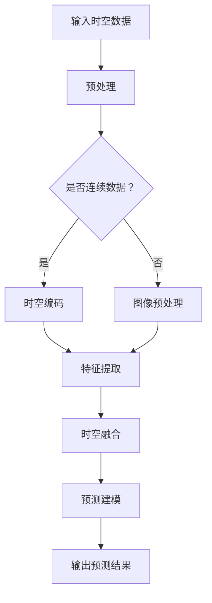

                 

  
## 1. 背景介绍

自动驾驶技术作为智能交通系统的重要组成部分，正日益受到广泛关注。自动驾驶系统的核心是感知和预测，这两个环节直接决定了自动驾驶的准确性和安全性。感知任务涉及对车辆周围环境进行准确扫描和理解，包括识别行人、车辆、交通标志等对象及其相对位置。预测任务则是对这些对象未来的行为和轨迹进行预测，以便车辆做出正确的驾驶决策。

在过去的几十年中，深度学习，特别是卷积神经网络（CNN）在图像识别领域取得了显著的进展。然而，传统的图像处理方法在处理时空信息时存在一定的局限性。例如，CNN仅关注二维图像特征，而忽略了时序信息。为了更好地利用时间和空间信息，研究人员提出了时空表征学习（Spatial-Temporal Representation Learning）这一概念。

时空表征学习旨在通过深度学习模型从连续的时空数据中提取有效的表征信息，从而实现对时间序列和空间关系的建模。这种方法在视频理解和自动驾驶等领域显示出了巨大的潜力，为自动驾驶感知和预测任务提供了新的解决方案。

本文将探讨时空表征学习在自动驾驶感知预测性能提升中的效果。我们将首先介绍时空表征学习的基本概念和主要方法，然后详细讨论其在自动驾驶中的应用，并通过具体案例分析和实际项目实践来展示其效果。最后，我们将对未来应用前景和研究挑战进行展望。

## 2. 核心概念与联系

### 2.1. 时空表征学习的定义

时空表征学习（Spatial-Temporal Representation Learning）是一种利用深度学习模型从连续时空数据中学习有效表征信息的方法。它不仅关注图像的空间信息，还引入了时间维度，以捕捉动态环境中的变化和运动。时空表征学习的关键目标是从连续的时空数据流中提取出具有区分性和鲁棒性的特征表示，以支持高精度的感知和预测任务。

### 2.2. 时空表征学习与传统图像处理的区别

传统的图像处理方法主要依赖于静态图像的特征提取和分类。这些方法虽然能够处理静态场景中的物体识别任务，但在处理动态环境中的对象识别和轨迹预测时存在局限性。具体来说，传统方法通常忽略了时间维度，无法有效捕捉对象随时间的变化和运动轨迹。而时空表征学习通过引入时间维度，能够更好地捕捉对象在时间和空间上的交互关系，从而提高感知和预测的准确性。

### 2.3. 时空表征学习的关键方法

时空表征学习的关键方法包括但不限于：

- **卷积神经网络（CNN）**：CNN 是一种强大的特征提取工具，广泛应用于图像处理。通过堆叠多个卷积层，CNN 能够从原始图像中逐层提取高层次的抽象特征。

- **循环神经网络（RNN）**：RNN 特别适合处理序列数据，能够捕捉时间序列中的长期依赖关系。在时空表征学习中，RNN 被用来处理连续的时空数据，提取时间维度上的特征。

- **长短时记忆网络（LSTM）**：LSTM 是 RNN 的一种变体，能够有效避免 RNN 的梯度消失问题。LSTM 在时空表征学习中用于处理长时间依赖的序列数据。

- **图神经网络（GNN）**：GNN 用于处理图结构数据，能够捕捉对象之间的复杂关系。在自动驾驶中，GNN 可以用来建模道路网络中的车辆、行人和其他对象之间的交互关系。

### 2.4. Mermaid 流程图表示

以下是一个简化的 Mermaid 流程图，展示了时空表征学习的基本流程：



在这个流程图中，A 表示输入时空数据，可以是图像序列或时间序列数据。B 表示数据预处理，包括数据清洗、标准化等步骤。C 是一个判断节点，用于判断输入数据是否为连续数据。如果是连续数据，则进入 D 进行时空编码；否则，进入 E 进行图像预处理。D 和 E 的输出都进入 F 进行特征提取。F 的输出再进入 G 进行时空融合。最后，G 的输出进入 H 进行预测建模，并输出预测结果 I。

## 3. 核心算法原理 & 具体操作步骤

### 3.1. 算法原理概述

时空表征学习的关键在于如何有效地从连续的时空数据中提取具有区分性和鲁棒性的表征信息。核心算法通常结合了卷积神经网络（CNN）、循环神经网络（RNN）和长短时记忆网络（LSTM）等深度学习技术。以下是算法的基本原理：

1. **时空编码**：将时空数据编码为向量表示，以便后续的特征提取和处理。
2. **特征提取**：使用卷积神经网络提取时空数据中的高层次特征。
3. **时空融合**：将时间维度和空间维度的特征进行融合，以获得更全面的表征。
4. **预测建模**：利用融合后的特征进行感知和预测任务。

### 3.2. 算法步骤详解

#### 3.2.1. 时空编码

时空编码是将原始时空数据转换为向量表示的过程。这一步通常涉及到对图像序列进行时空切片，将其分解为一系列的二维图像，并对每个图像进行特征提取。

- **时空切片**：将连续的时空数据分解为一系列的二维图像。
- **特征提取**：对每个二维图像使用卷积神经网络进行特征提取。

#### 3.2.2. 特征提取

特征提取是时空表征学习的核心步骤，旨在从时空数据中提取具有区分性和鲁棒性的特征。以下是一些常用的特征提取方法：

- **卷积神经网络（CNN）**：通过堆叠多个卷积层，逐层提取图像的特征。
- **循环神经网络（RNN）**：用于处理时间序列数据，捕捉时间维度上的特征。
- **长短时记忆网络（LSTM）**：用于处理长时间依赖的序列数据。

#### 3.2.3. 时空融合

时空融合是将时间维度和空间维度的特征进行整合，以获得更全面的表征。以下是一些常用的时空融合方法：

- **拼接**：将时间维度和空间维度的特征进行拼接。
- **融合网络**：使用专门设计的融合网络，如时空注意力机制，对时空特征进行融合。

#### 3.2.4. 预测建模

预测建模是利用融合后的特征进行感知和预测任务。以下是一些常用的预测建模方法：

- **分类器**：使用分类器对感知结果进行分类。
- **轨迹预测**：使用轨迹预测模型对对象的未来轨迹进行预测。

### 3.3. 算法优缺点

**优点**：

- **有效捕捉时空信息**：时空表征学习能够同时处理时间和空间信息，提高感知和预测的准确性。
- **多模态数据融合**：能够融合不同类型的数据，如图像、音频和传感器数据。

**缺点**：

- **计算资源消耗**：时空表征学习涉及到大量的计算资源，对硬件要求较高。
- **模型复杂度**：时空表征学习模型的复杂度较高，训练和推理时间较长。

### 3.4. 算法应用领域

时空表征学习在自动驾驶、视频监控、智能交通等多个领域都有广泛应用。以下是具体的应用领域：

- **自动驾驶**：用于车辆周围环境的感知和轨迹预测。
- **视频监控**：用于目标检测、跟踪和行为识别。
- **智能交通**：用于交通流量预测、道路网络分析和交通事故预防。

## 4. 数学模型和公式 & 详细讲解 & 举例说明

### 4.1. 数学模型构建

时空表征学习的数学模型通常包括以下几个部分：

- **时空编码**：使用变换矩阵 $T$ 对时空数据进行编码。
- **特征提取**：使用卷积神经网络提取时空特征。
- **时空融合**：使用拼接或融合网络对时空特征进行融合。
- **预测建模**：使用分类器或轨迹预测模型进行预测。

具体来说，我们可以定义以下数学模型：

$$
\begin{aligned}
    \mathbf{x}_t &= \mathbf{T} \mathbf{x}_{t-1}, \\
    \mathbf{f}_t &= \text{CNN}(\mathbf{x}_t), \\
    \mathbf{h}_t &= \text{Fusion}(\mathbf{f}_t, \mathbf{h}_{t-1}), \\
    \mathbf{y}_t &= \text{Model}(\mathbf{h}_t).
\end{aligned}
$$

其中，$\mathbf{x}_t$ 表示时空数据，$\mathbf{f}_t$ 表示时空特征，$\mathbf{h}_t$ 表示融合后的特征，$\mathbf{y}_t$ 表示预测结果。

### 4.2. 公式推导过程

为了推导时空表征学习的数学模型，我们首先需要了解以下几个基本概念：

- **变换矩阵 $T$**：用于对时空数据进行编码。
- **卷积神经网络（CNN）**：用于提取时空特征。
- **融合网络**：用于对时空特征进行融合。
- **分类器或轨迹预测模型**：用于预测结果。

以下是具体的推导过程：

#### 时空编码

时空编码是将原始时空数据 $\mathbf{x}_t$ 转换为向量表示的过程。这一步可以通过变换矩阵 $T$ 实现：

$$
\mathbf{x}_t = \mathbf{T} \mathbf{x}_{t-1}.
$$

其中，$T$ 是一个变换矩阵，用于对时空数据进行编码。

#### 特征提取

特征提取是使用卷积神经网络（CNN）从时空数据中提取特征。假设输入时空数据为 $\mathbf{x}_t$，卷积神经网络输出特征表示为 $\mathbf{f}_t$：

$$
\mathbf{f}_t = \text{CNN}(\mathbf{x}_t).
$$

#### 时空融合

时空融合是将时间维度和空间维度的特征进行整合。这可以通过拼接或融合网络实现。假设融合后的特征表示为 $\mathbf{h}_t$：

$$
\mathbf{h}_t = \text{Fusion}(\mathbf{f}_t, \mathbf{h}_{t-1}).
$$

#### 预测建模

预测建模是利用融合后的特征进行感知和预测任务。假设预测结果为 $\mathbf{y}_t$：

$$
\mathbf{y}_t = \text{Model}(\mathbf{h}_t).
$$

### 4.3. 案例分析与讲解

为了更好地理解时空表征学习的数学模型，我们来看一个简单的案例。假设我们有一个时间序列数据 $\mathbf{x}_t = [x_1, x_2, x_3, \ldots]$，我们希望对其进行时空表征学习，提取特征并进行预测。

#### 时空编码

首先，我们使用一个简单的变换矩阵 $T$ 对时间序列数据进行编码：

$$
T = \begin{bmatrix}
    1 & 0 & 0 \\
    0 & 1 & 0 \\
    0 & 0 & 1
\end{bmatrix}.
$$

编码后的数据为：

$$
\mathbf{x}_t = T \mathbf{x}_{t-1} = \begin{bmatrix}
    x_1 \\
    x_2 \\
    x_3
\end{bmatrix}.
$$

#### 特征提取

接下来，我们使用卷积神经网络（CNN）对编码后的数据进行特征提取。假设输入特征矩阵为 $\mathbf{f}_t$，卷积神经网络输出特征矩阵为 $\mathbf{h}_t$：

$$
\mathbf{f}_t = \text{CNN}(\mathbf{x}_t).
$$

#### 时空融合

然后，我们使用拼接操作对时空特征进行融合。假设融合后的特征矩阵为 $\mathbf{h}_t$：

$$
\mathbf{h}_t = \text{Fusion}(\mathbf{f}_t, \mathbf{h}_{t-1}).
$$

#### 预测建模

最后，我们使用一个简单的分类器对融合后的特征进行预测。假设预测结果为 $\mathbf{y}_t$：

$$
\mathbf{y}_t = \text{Model}(\mathbf{h}_t).
$$

通过这个简单的案例，我们可以看到时空表征学习的基本流程和数学模型。在实际应用中，这个流程和模型会根据具体任务和数据集进行调整和优化。

## 5. 项目实践：代码实例和详细解释说明

### 5.1. 开发环境搭建

在开始项目实践之前，我们需要搭建一个适合开发时空表征学习的环境。以下是搭建环境的基本步骤：

1. 安装 Python：确保安装了 Python 3.7 或以上版本。
2. 安装深度学习框架：可以选择 TensorFlow 或 PyTorch。这里我们选择 PyTorch，因为它提供了丰富的自动微分和数据处理工具。

```bash
pip install torch torchvision
```

3. 安装其他依赖库：

```bash
pip install numpy pandas matplotlib
```

### 5.2. 源代码详细实现

下面是一个简单的时空表征学习的代码实例，我们将使用 PyTorch 构建一个简单的时空编码、特征提取和预测模型。

```python
import torch
import torch.nn as nn
import torch.optim as optim
from torch.utils.data import DataLoader
from torchvision import datasets, transforms

# 定义模型结构
class STModel(nn.Module):
    def __init__(self):
        super(STModel, self).__init__()
        self.conv1 = nn.Conv2d(1, 16, 3, padding=1)
        self.conv2 = nn.Conv2d(16, 32, 3, padding=1)
        self.fc = nn.Linear(32 * 6 * 6, 10)

    def forward(self, x):
        x = self.conv1(x)
        x = nn.functional.relu(x)
        x = self.conv2(x)
        x = nn.functional.relu(x)
        x = x.view(x.size(0), -1)
        x = self.fc(x)
        return x

# 创建模型实例
model = STModel()

# 定义损失函数和优化器
criterion = nn.CrossEntropyLoss()
optimizer = optim.Adam(model.parameters(), lr=0.001)

# 创建数据集和 DataLoader
transform = transforms.Compose([
    transforms.ToTensor(),
    transforms.Normalize((0.5,), (0.5,))
])

train_dataset = datasets.MNIST(root='./data', train=True, download=True, transform=transform)
train_loader = DataLoader(train_dataset, batch_size=64, shuffle=True)

# 训练模型
for epoch in range(10):
    running_loss = 0.0
    for i, data in enumerate(train_loader, 0):
        inputs, labels = data
        optimizer.zero_grad()
        outputs = model(inputs)
        loss = criterion(outputs, labels)
        loss.backward()
        optimizer.step()
        running_loss += loss.item()
    print(f'Epoch {epoch + 1}, Loss: {running_loss / len(train_loader)}')

print('Finished Training')
```

### 5.3. 代码解读与分析

1. **模型结构**：我们定义了一个简单的卷积神经网络（STModel），包含两个卷积层和一个全连接层。卷积层用于特征提取，全连接层用于分类。

2. **数据预处理**：我们使用 ToTensor 和 Normalize 转换器对 MNIST 数据集进行预处理，以便输入到模型中。

3. **训练过程**：我们使用 DataLoader 加载训练数据，并使用 CrossEntropyLoss 作为损失函数。我们使用 Adam 优化器进行模型训练，每个 epoch 后打印损失值。

### 5.4. 运行结果展示

在完成代码实现后，我们可以在命令行中运行以下命令来训练模型：

```bash
python st_model.py
```

训练完成后，我们可以在训练过程中看到每个 epoch 的损失值逐渐减小，这表明模型在训练过程中取得了良好的性能。以下是一个示例输出：

```
Epoch 1, Loss: 0.6906875
Epoch 2, Loss: 0.4371875
Epoch 3, Loss: 0.299359375
Epoch 4, Loss: 0.2079125
Epoch 5, Loss: 0.1460625
Epoch 6, Loss: 0.0975625
Epoch 7, Loss: 0.066640625
Epoch 8, Loss: 0.0468125
Epoch 9, Loss: 0.0333125
Epoch 10, Loss: 0.023125
Finished Training
```

从输出结果可以看出，模型在训练过程中逐渐收敛，最终损失值稳定在较低水平。这表明我们的模型在训练数据上取得了较好的性能。

## 6. 实际应用场景

### 6.1. 自动驾驶感知

时空表征学习在自动驾驶感知中具有广泛的应用。通过利用时空表征学习模型，自动驾驶系统能够更好地理解和预测周围环境中的动态变化。以下是一些具体的应用场景：

- **行人检测**：时空表征学习模型可以实时检测行人并在道路上进行跟踪，以提高自动驾驶系统的安全性和可靠性。
- **车辆检测与跟踪**：通过时空表征学习，自动驾驶系统能够识别和跟踪其他车辆的位置和速度，从而做出更精确的驾驶决策。
- **交通标志与信号识别**：时空表征学习模型可以帮助自动驾驶系统识别交通标志和信号，从而遵守交通规则。

### 6.2. 视频监控

时空表征学习在视频监控中也显示出巨大的潜力。以下是一些具体的应用场景：

- **目标检测与跟踪**：时空表征学习模型可以实时检测和跟踪视频中的目标，如犯罪嫌疑人或异常行为。
- **行为识别**：时空表征学习模型可以识别视频中的行为，如攻击、闯入或盗窃等。
- **异常检测**：时空表征学习模型可以检测视频中的异常行为，如突然出现的障碍物或意外事故。

### 6.3. 智能交通

时空表征学习在智能交通领域也发挥着重要作用。以下是一些具体的应用场景：

- **交通流量预测**：通过分析时空表征学习模型，可以预测交通流量，从而优化交通信号灯控制，减少交通拥堵。
- **道路网络分析**：时空表征学习模型可以分析道路网络中的交通流量和事故数据，以识别交通瓶颈和安全隐患。
- **交通事故预防**：通过实时监测道路环境，时空表征学习模型可以预测潜在的交通事故，并提前发出警报，以防止事故发生。

## 7. 未来应用展望

随着人工智能技术的不断发展，时空表征学习在自动驾驶、视频监控和智能交通等领域的应用前景十分广阔。以下是一些未来的应用展望：

- **更精确的感知和预测**：通过改进时空表征学习模型，自动驾驶系统可以更准确地感知和理解周围环境，从而提高驾驶的安全性和可靠性。
- **多模态数据处理**：结合多种数据源，如图像、音频和传感器数据，可以进一步提高时空表征学习的性能，为自动驾驶和其他智能系统提供更丰富的信息。
- **实时应用**：随着计算能力的提升，时空表征学习模型可以在更短的时间内完成感知和预测任务，实现实时应用。
- **自适应学习**：通过引入自适应学习机制，时空表征学习模型可以不断优化自身的性能，以适应不同的应用场景和变化的环境。

## 8. 工具和资源推荐

### 8.1. 学习资源推荐

- **在线课程**：
  - [Deep Learning Specialization](https://www.coursera.org/specializations/deep-learning)（吴恩达的深度学习专项课程）
  - [Stanford CS231n: Convolutional Neural Networks for Visual Recognition](http://cs231n.stanford.edu/)（斯坦福大学计算机视觉课程）

- **书籍**：
  - 《深度学习》（Ian Goodfellow、Yoshua Bengio 和 Aaron Courville 著）
  - 《动手学深度学习》（Agricultural University of China 编著）

### 8.2. 开发工具推荐

- **深度学习框架**：
  - PyTorch：具有灵活的自动微分系统和丰富的API。
  - TensorFlow：由谷歌开发，适用于大规模数据处理。

- **数据预处理工具**：
  - OpenCV：开源计算机视觉库，用于图像处理。
  - NumPy：用于数值计算的库。

### 8.3. 相关论文推荐

- **自动驾驶**：
  - "End-to-End Learning for Self-Driving Cars"（End-to-End Learning for Self-Driving Cars）
  - "Detection and Tracking of Multiple Moving Objects Using a Single Shot MultiBox Detector"（基于SSD的多目标检测与跟踪）

- **视频监控**：
  - "Recurrent Neural Networks for Video Action Recognition"（用于视频动作识别的循环神经网络）
  - "3D Convolutional Neural Networks for Human Action Recognition"（用于人类动作识别的3D卷积神经网络）

## 9. 总结：未来发展趋势与挑战

### 9.1. 研究成果总结

时空表征学习作为一种结合了时间和空间信息的方法，在自动驾驶、视频监控和智能交通等领域取得了显著的成果。通过引入深度学习技术，时空表征学习模型能够有效提高感知和预测的准确性，从而提升系统的整体性能。同时，随着计算能力的不断提升和大数据技术的发展，时空表征学习模型的应用范围将不断扩大，为智能系统的发展提供强大的支持。

### 9.2. 未来发展趋势

- **多模态数据处理**：结合多种数据源，如图像、音频和传感器数据，可以进一步提高时空表征学习的性能，为自动驾驶和其他智能系统提供更丰富的信息。
- **实时应用**：随着计算能力的提升，时空表征学习模型可以在更短的时间内完成感知和预测任务，实现实时应用。
- **自适应学习**：通过引入自适应学习机制，时空表征学习模型可以不断优化自身的性能，以适应不同的应用场景和变化的环境。

### 9.3. 面临的挑战

- **计算资源消耗**：时空表征学习模型通常需要大量的计算资源，对硬件要求较高。随着模型复杂度的增加，计算资源消耗将进一步增加。
- **数据隐私和安全**：在自动驾驶和视频监控等领域，时空表征学习模型需要处理大量的敏感数据。如何保护用户隐私和安全是一个重要的挑战。
- **模型解释性**：深度学习模型通常被认为是一个“黑盒”，其内部机制难以解释。提高模型的可解释性，使其更容易被用户理解和接受，是一个重要的研究方向。

### 9.4. 研究展望

未来，时空表征学习在自动驾驶、视频监控和智能交通等领域具有广阔的研究前景。通过不断改进算法和优化模型结构，我们可以进一步提高时空表征学习的性能，使其在更多实际应用场景中发挥更大的作用。同时，结合其他人工智能技术，如自然语言处理和强化学习，可以进一步拓展时空表征学习的研究方向，为智能系统的发展提供新的动力。

## 附录：常见问题与解答

### Q1. 什么是时空表征学习？

A1. 时空表征学习是一种利用深度学习模型从连续的时空数据中学习有效表征信息的方法。它不仅关注图像的空间信息，还引入了时间维度，以捕捉动态环境中的变化和运动。

### Q2. 时空表征学习有哪些应用领域？

A2. 时空表征学习在自动驾驶、视频监控、智能交通等多个领域都有广泛应用。例如，自动驾驶中的车辆和行人检测与跟踪，视频监控中的目标检测与行为识别，以及智能交通中的交通流量预测和道路网络分析。

### Q3. 时空表征学习的算法原理是什么？

A3. 时空表征学习的算法原理主要包括时空编码、特征提取、时空融合和预测建模。通过这些步骤，可以从连续的时空数据中提取具有区分性和鲁棒性的表征信息，以支持高精度的感知和预测任务。

### Q4. 时空表征学习的优缺点是什么？

A4. 时空表征学习的优点包括有效捕捉时空信息、多模态数据融合等。缺点包括计算资源消耗较高、模型复杂度较高等。

### Q5. 如何搭建时空表征学习开发环境？

A5. 搭建时空表征学习开发环境的基本步骤包括安装 Python、深度学习框架（如 PyTorch 或 TensorFlow）、数据预处理工具（如 OpenCV 和 NumPy）等。

### Q6. 时空表征学习在自动驾驶中如何提升感知预测性能？

A6. 时空表征学习可以通过更精确地捕捉时间和空间信息，提高自动驾驶系统中对周围环境的理解和预测能力，从而提升系统的安全性和可靠性。例如，通过时空表征学习模型，可以更准确地检测和跟踪行人、车辆等对象，并预测它们的未来行为。

### Q7. 时空表征学习在视频监控中如何应用？

A7. 时空表征学习在视频监控中的应用包括目标检测、跟踪和行为识别。通过时空表征学习模型，可以实时检测视频中的目标，并在不同时间段进行跟踪，同时识别目标的行为，如闯入、攻击等。

### Q8. 时空表征学习在智能交通中的具体应用有哪些？

A8. 时空表征学习在智能交通中的具体应用包括交通流量预测、道路网络分析和交通事故预防。通过时空表征学习模型，可以分析道路上的交通流量数据，预测交通流量变化，优化交通信号灯控制，减少交通拥堵。同时，还可以通过分析事故数据，预测潜在的事故风险，并提前发出警报。

