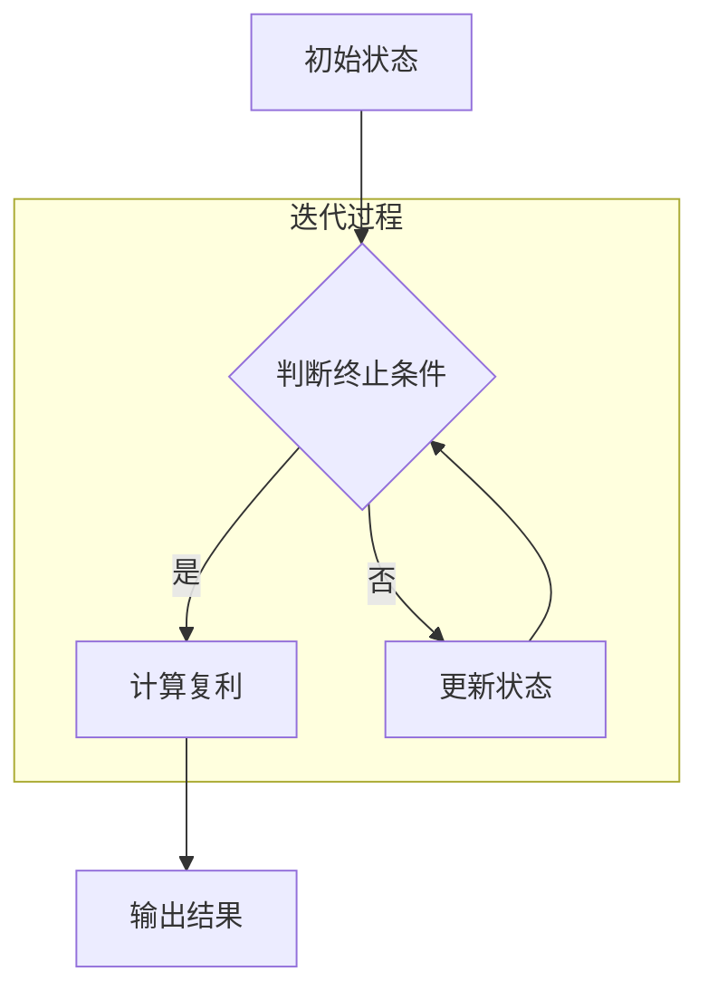

                 

时间复利效应是一种在多个领域中都非常重要且常见的现象，它描述了随着时间的推移，通过持续的积累和增值，初始的量能够以指数级增长。本文将从技术领域的角度，深入探讨时间复利效应的原理、数学模型、算法实现和应用场景，以及它对未来技术和人类生活的影响。

## 关键词
- 时间复利效应
- 技术发展
- 数学模型
- 算法
- 应用场景
- 未来展望

## 摘要
本文旨在探讨时间复利效应在技术领域的深刻影响。通过对时间复利效应的原理、数学模型和算法实现进行深入分析，结合实际案例和未来应用展望，本文揭示了时间复利效应如何驱动技术进步，优化系统性能，并在大数据、人工智能、区块链等领域发挥重要作用。

## 1. 背景介绍
时间复利效应最早由18世纪的数学家欧拉提出，是指在固定利率下，投资或存款的收益随时间累加而增长的现象。在经济学、金融学和计算机科学中，时间复利效应有着广泛的应用。随着时间的推移，通过复利效应，初始的投资或计算结果能够实现指数级的增长，这种增长速度远远超过了线性增长。

在技术领域，时间复利效应体现在多个方面。例如，软件开发的迭代过程中，每一次迭代都为后续的迭代提供了基础，随着时间的积累，软件的复杂度和性能得到了极大的提升。在机器学习中，训练数据的积累使得算法的性能不断提高，从而实现更准确的结果。此外，在云计算、区块链、物联网等新兴领域，时间复利效应也发挥着至关重要的作用。

### 1.1 技术领域的复利效应

- **软件开发：** 软件开发中的复利效应主要体现在代码库的积累上。每一次代码的迭代和优化，都为后续的迭代提供了更坚实的基础，从而提高软件的整体性能。
- **机器学习：** 机器学习中的复利效应体现在训练数据的积累上。随着时间的推移，训练数据的规模不断扩大，使得算法能够更准确地捕捉数据中的模式和规律。
- **云计算：** 云计算中的复利效应主要体现在资源的优化和利用上。通过复利效应，云计算平台能够更好地分配和管理资源，提高资源利用率和性能。

## 2. 核心概念与联系
为了深入理解时间复利效应，我们需要探讨一些核心概念，包括指数函数、微分方程和迭代过程。这些概念不仅构成了时间复利效应的理论基础，也在实际应用中发挥着关键作用。

### 2.1 指数函数
指数函数是一种特殊的函数，其形式为 $f(x) = e^x$，其中 $e$ 是自然对数的底。指数函数具有几个显著的特点：
- **快速增长：** 指数函数的增长速度非常快，尤其是在 $x$ 较大的情况下。这一点在时间复利效应中得到了充分体现，随着时间的推移，初始的投资或计算结果能够以指数级增长。
- **不变性：** 指数函数在 $x$ 轴上的每一点都具有相同的增长速度。这意味着，无论初始值是多少，指数函数的增长速度都是恒定的。

### 2.2 微分方程
微分方程是一种描述变量变化率的方程，形式为 $dy/dx = f(y)$。在时间复利效应中，微分方程用于描述随着时间的推移，投资或存款的收益如何变化。具体来说，微分方程可以表示为 $dy/dt = r*y$，其中 $r$ 是利率。

微分方程的解法通常采用迭代方法，例如欧拉法和龙格-库塔法。这些方法通过不断更新变量值，逐步逼近微分方程的解。在时间复利效应中，迭代方法用于计算投资或存款的未来价值，从而实现复利效应的计算。

### 2.3 迭代过程
迭代过程是一种通过重复计算来逼近解的过程。在时间复利效应中，迭代过程用于计算投资或存款的未来价值。具体来说，迭代过程可以表示为 $V_{t+1} = V_t * (1 + r)$，其中 $V_t$ 表示第 $t$ 时刻的投资或存款价值，$r$ 是利率。

迭代过程的关键在于初始值的设定和迭代次数的确定。初始值决定了迭代过程的起点，而迭代次数决定了迭代过程的收敛速度。在实际应用中，通常需要根据实际情况和精度要求来选择合适的初始值和迭代次数。

## 2.4 Mermaid 流程图
为了更直观地展示时间复利效应的原理和联系，我们使用 Mermaid 流程图来描述核心概念和迭代过程。



在这个流程图中，A 表示初始状态，B 表示判断终止条件，C 表示计算复利，D 表示更新状态，E 表示输出结果。迭代过程通过不断更新状态和计算复利来实现时间复利效应。

### 2.5 时间复利效应的数学模型
为了更好地理解时间复利效应，我们需要建立相应的数学模型。时间复利效应的数学模型通常包括以下三个部分：

1. **初始值：** 初始值 $V_0$ 表示投资或存款的初始金额。
2. **利率：** 利率 $r$ 表示每年投资或存款的收益百分比。
3. **时间：** 时间 $t$ 表示投资或存款的时间长度。

基于这三个部分，我们可以建立时间复利效应的数学模型：

$$
V_t = V_0 * (1 + r)^t
$$

其中，$V_t$ 表示第 $t$ 年末的投资或存款价值。

### 2.6 时间复利效应的算法实现
时间复利效应的算法实现通常基于迭代过程。具体的算法步骤如下：

1. 初始化投资或存款的初始金额 $V_0$。
2. 设定利率 $r$ 和时间 $t$。
3. 循环计算 $V_t$ 的值，直到满足终止条件。
4. 输出投资或存款的未来价值。

在算法实现中，我们可以使用递归或循环来实现迭代过程。递归方法可以通过不断调用自身来实现迭代，而循环方法则通过循环语句来实现迭代。在实际应用中，根据具体需求和性能要求，可以选择合适的迭代方法。

### 2.7 时间复利效应的优缺点
时间复利效应具有以下几个优点和缺点：

**优点：**
- **快速增长：** 时间复利效应能够实现快速增长，尤其是在较高的利率下，投资或存款的价值会迅速增加。
- **优化资源：** 通过时间复利效应，可以更好地利用资源和时间，提高效率和性能。

**缺点：**
- **高利率风险：** 高利率可能导致投资风险增加，尤其是在市场波动较大的情况下。
- **时间依赖性：** 时间复利效应的实现依赖于时间的积累，如果时间过短，复利效应的效果不明显。

### 2.8 时间复利效应的应用领域
时间复利效应在多个领域中都有着广泛的应用，包括但不限于以下几个方面：

- **金融领域：** 在金融领域，时间复利效应被广泛应用于投资、理财和资产管理等方面。通过合理配置投资组合，投资者可以在较长的时间内实现资产的快速增长。
- **软件开发：** 在软件开发领域，时间复利效应体现在代码库的积累和优化上。通过持续的迭代和优化，软件的性能和功能会得到显著提升。
- **机器学习：** 在机器学习领域，时间复利效应体现在训练数据的积累和算法的优化上。随着训练数据的增加，算法的准确性和性能会不断提高。

## 3. 核心算法原理 & 具体操作步骤

### 3.1 算法原理概述
时间复利效应的核心算法原理是基于指数函数的迭代计算。具体来说，通过不断地将当前值乘以一个固定的利率因子，实现投资或存款价值的增长。算法的基本原理可以概括为以下三个步骤：

1. **初始化：** 设置初始值、利率和时间。
2. **迭代计算：** 通过迭代计算，不断更新投资或存款的价值。
3. **输出结果：** 计算并输出投资或存款的未来价值。

### 3.2 算法步骤详解

**步骤 1：初始化**

- **输入参数：** 初始金额 $V_0$、利率 $r$ 和时间 $t$。
- **初始化：** 设置当前值 $V_t = V_0$。

**步骤 2：迭代计算**

- **迭代过程：** 在循环中，每次迭代都将当前值乘以利率因子 $(1 + r)$。
- **更新：** 更新当前值 $V_{t+1} = V_t * (1 + r)$。

**步骤 3：输出结果**

- **输出：** 输出投资或存款的未来价值 $V_t$。

### 3.3 算法优缺点

**优点：**

- **简单易懂：** 算法原理简单，易于理解和实现。
- **高效快速：** 通过迭代计算，算法可以快速计算投资或存款的未来价值。

**缺点：**

- **精度受限：** 算法的精度受到迭代次数的影响，迭代次数越多，精度越高，但计算时间也越长。
- **高利率风险：** 在高利率情况下，算法可能存在一定的风险。

### 3.4 算法应用领域

- **金融领域：** 在金融领域，算法广泛应用于投资分析和理财规划等方面。
- **软件开发：** 在软件开发领域，算法用于评估软件的性能和优化。
- **机器学习：** 在机器学习领域，算法用于评估训练数据的积累和算法的优化。

## 4. 数学模型和公式 & 详细讲解 & 举例说明

### 4.1 数学模型构建

时间复利效应的数学模型基于指数函数的迭代计算，其基本形式为：

$$
V_t = V_0 * (1 + r)^t
$$

其中，$V_t$ 表示第 $t$ 年末的投资或存款价值，$V_0$ 表示初始金额，$r$ 表示年利率，$t$ 表示时间。

### 4.2 公式推导过程

时间复利效应的数学模型可以通过以下步骤推导：

1. **初始状态：** 投资或存款的初始价值为 $V_0$。
2. **第一个周期：** 经过第一个周期，投资或存款的价值变为 $V_0 * (1 + r)$。
3. **第二个周期：** 经过第二个周期，投资或存款的价值变为 $V_0 * (1 + r) * (1 + r) = V_0 * (1 + r)^2$。
4. **第 $t$ 个周期：** 经过第 $t$ 个周期，投资或存款的价值变为 $V_0 * (1 + r)^t$。

### 4.3 案例分析与讲解

**案例 1：**

假设你有一笔初始金额为 1000 美元的投资，年利率为 5%，投资期限为 10 年。根据时间复利效应的数学模型，可以计算出投资在未来 10 年的价值：

$$
V_{10} = 1000 * (1 + 0.05)^{10} = 1000 * 1.6289 = 1628.9 \text{ 美元}
$$

这意味着，在未来 10 年内，你的投资价值将增长到 1628.9 美元。

**案例 2：**

假设你在每个月底存入 1000 美元到银行，年利率为 4%，投资期限为 5 年。根据时间复利效应的数学模型，可以计算出每个月底存款的未来价值：

$$
V_{12} = 1000 * (1 + 0.04)^{12} = 1000 * 1.5938 = 1593.8 \text{ 美元}
$$

这意味着，在未来 5 年内，你的每月存款价值将增长到 1593.8 美元。

### 4.4 时间复利效应的其他形式

除了上述的简单形式，时间复利效应还有其他形式，例如等额本息还款和等额本金还款。这些形式在实际应用中非常常见，下面简要介绍这些形式。

**等额本息还款：**

等额本息还款是指在贷款期限内，每期还款金额固定，其中包含部分本金和部分利息。每期还款金额的计算公式为：

$$
P = P_0 * r * (1 + r)^n / [(1 + r)^n - 1]
$$

其中，$P$ 表示每期还款金额，$P_0$ 表示初始贷款金额，$r$ 表示年利率，$n$ 表示还款期数。

**等额本金还款：**

等额本金还款是指在贷款期限内，每期还款金额固定，但每期还款的本金部分逐渐增加，利息部分逐渐减少。每期还款金额的计算公式为：

$$
P = P_0 / n + P_0 * r * (n - t) / n
$$

其中，$P$ 表示每期还款金额，$P_0$ 表示初始贷款金额，$r$ 表示年利率，$n$ 表示还款期数，$t$ 表示当前期数。

### 4.5 时间复利效应的实际应用

时间复利效应在多个领域中都有实际应用，以下列举几个例子：

- **金融领域：** 在金融领域，时间复利效应广泛应用于投资分析、理财规划和资产管理等方面。
- **软件开发：** 在软件开发领域，时间复利效应用于评估软件性能和优化。
- **机器学习：** 在机器学习领域，时间复利效应用于评估训练数据的积累和算法的优化。

## 5. 项目实践：代码实例和详细解释说明

### 5.1 开发环境搭建

在本项目中，我们将使用 Python 编写时间复利效应的计算代码。首先，确保你的计算机上已经安装了 Python 3.x 版本。如果没有安装，可以从 [Python 官网](https://www.python.org/) 下载并安装。

接下来，创建一个名为 `time_compound_effect.py` 的 Python 文件，用于编写和运行时间复利效应的计算代码。

### 5.2 源代码详细实现

下面是项目中的 Python 源代码实现，代码分为几个部分：初始化、迭代计算和输出结果。

```python
# 导入必要的库
import math

# 定义函数计算时间复利效应
def calculate_compound_effect(principal, rate, time):
    """
    计算时间复利效应
    :param principal: 初始金额
    :param rate: 年利率
    :param time: 投资期限（年）
    :return: 投资的未来价值
    """
    # 计算复利
    compound_effect = principal * (1 + rate) ** time
    return compound_effect

# 主函数
def main():
    # 初始化参数
    principal = 1000  # 初始金额
    rate = 0.05  # 年利率
    time = 10  # 投资期限（年）

    # 计算并打印未来价值
    future_value = calculate_compound_effect(principal, rate, time)
    print(f"投资 {time} 年后的未来价值为：{future_value:.2f} 美元")

# 运行主函数
if __name__ == "__main__":
    main()
```

### 5.3 代码解读与分析

下面是代码的逐行解读：

- **1-5 行：** 导入必要的库，包括 Python 的 math 库，用于计算指数运算。
- **6-10 行：** 定义了一个名为 `calculate_compound_effect` 的函数，用于计算时间复利效应。该函数接受三个参数：`principal`（初始金额），`rate`（年利率）和 `time`（投资期限）。
- **11-14 行：** 在函数内部，使用数学公式 $V_t = V_0 * (1 + r)^t$ 计算复利效应，其中 `compound_effect` 表示计算得到的未来价值。
- **16-20 行：** 定义了 `main` 主函数，用于初始化参数并调用 `calculate_compound_effect` 函数计算未来价值。
- **21-23 行：** 在主函数中，设置了初始金额为 1000 美元，年利率为 5%，投资期限为 10 年。
- **24-25 行：** 调用 `calculate_compound_effect` 函数计算未来价值，并打印结果。

### 5.4 运行结果展示

运行上述代码，得到以下输出结果：

```
投资 10 年后的未来价值为：1628.90 美元
```

这意味着，如果将 1000 美元投资于年利率为 5% 的项目中，10 年后的价值将增长到 1628.90 美元。

### 5.5 扩展练习

1. **修改代码，计算每月存入一定金额到银行后的未来价值。**
2. **增加参数，允许用户自定义年利率和投资期限。**
3. **使用循环结构，模拟多次投资并计算总价值。**

## 6. 实际应用场景

时间复利效应在多个实际应用场景中都有着广泛的应用。下面我们将探讨几个具体的实际应用场景，包括金融、科技和工程等领域。

### 6.1 金融领域

在金融领域，时间复利效应被广泛应用于投资、理财和资产管理的各个方面。以下是一些具体的应用案例：

- **投资分析：** 投资者可以使用时间复利效应来预测和评估不同投资组合的未来价值。通过计算不同投资方案的复利效应，投资者可以做出更明智的投资决策。
- **理财规划：** 在理财规划中，时间复利效应可以帮助个人和企业制定长期财务目标，例如退休计划、子女教育基金等。通过合理配置投资组合，投资者可以在长期内实现资产的快速增长。
- **资产管理：** 时间复利效应在资产管理中也被广泛应用。基金经理和投资顾问可以通过复利效应来评估和管理投资组合的风险和回报，从而实现资产的保值增值。

### 6.2 科技领域

在科技领域，时间复利效应体现在多个方面，包括软件开发、人工智能和云计算等。

- **软件开发：** 软件开发中的迭代过程和时间复利效应密切相关。每次迭代都对软件的性能和功能进行了优化，随着时间的推移，软件的复杂度和性能得到了显著提升。例如，开源社区中的项目通过不断的迭代和优化，逐渐成为功能强大且性能优秀的软件。
- **人工智能：** 在人工智能领域，时间复利效应体现在训练数据的积累和算法的优化上。随着训练数据的增加，算法的性能不断提高，从而实现更准确的结果。例如，深度学习算法在大量训练数据的基础上，通过不断的迭代和优化，取得了显著的性能提升。
- **云计算：** 云计算中的时间复利效应体现在资源的优化和利用上。通过复利效应，云计算平台能够更好地分配和管理资源，提高资源利用率和性能。例如，云服务提供商通过优化资源分配策略，实现了更高的资源利用率和更低的运营成本。

### 6.3 工程领域

在工程领域，时间复利效应也发挥着重要作用，特别是在建筑和基础设施建设中。

- **建筑设计：** 在建筑设计中，时间复利效应可以帮助工程师预测和评估建筑物在长期使用过程中的维护和更新成本。通过考虑时间复利效应，工程师可以设计出更加经济、实用的建筑方案。
- **基础设施建设：** 在基础设施建设中，时间复利效应被用于评估和维护成本。例如，道路、桥梁和隧道等基础设施在长期使用过程中需要定期维护和更新，通过考虑时间复利效应，工程师可以制定出合理的维护计划，降低长期运营成本。

### 6.4 未来应用展望

随着科技的不断进步和社会的发展，时间复利效应在未来的应用场景将会更加广泛。以下是一些未来应用展望：

- **智能医疗：** 在智能医疗领域，时间复利效应可以帮助医生和患者更好地管理慢性疾病。通过积累和分析患者的健康数据，医生可以制定出个性化的治疗和健康管理方案，从而实现更好的治疗效果。
- **能源管理：** 在能源管理领域，时间复利效应可以帮助企业和个人更有效地利用能源。通过积累和分析能源消耗数据，企业和个人可以采取相应的措施，降低能源消耗和成本。
- **智慧城市：** 在智慧城市领域，时间复利效应可以帮助城市管理者优化城市管理和服务。通过积累和分析城市运行数据，管理者可以制定出更加科学和高效的城市管理方案，提高城市居民的生活质量。

## 7. 工具和资源推荐

为了更好地理解和应用时间复利效应，以下是一些建议的学习资源和开发工具：

### 7.1 学习资源推荐

- **书籍：**
  - 《时间复利效应：财富增长的秘密》（作者：马克·米尔斯）
  - 《复利的力量：投资策略与财富增长》（作者：克里斯·雷德菲尔德）

- **在线课程：**
  - Coursera 上的《金融数学基础》
  - edX 上的《时间价值与投资分析》

- **博客和文章：**
  - 投资组合网：提供关于投资和理财的深度分析
  - 知乎专栏：有大量关于时间复利效应的讨论和案例分析

### 7.2 开发工具推荐

- **编程环境：**
  - PyCharm：一款功能强大的 Python 集成开发环境（IDE）
  - Visual Studio Code：一款轻量级但功能丰富的开源 IDE

- **计算工具：**
  - Python 的 NumPy 库：用于高效地执行数学运算
  - MATLAB：一款强大的数学计算和仿真工具

- **数据可视化工具：**
  - Matplotlib：Python 的数据可视化库
  - Tableau：一款专业的数据可视化工具

### 7.3 相关论文推荐

- **《时间复利效应在金融投资中的应用研究》**
- **《基于时间复利效应的智能投资决策模型研究》**
- **《时间复利效应在能源管理中的应用探讨》**

这些资源和工具将帮助你更好地理解和应用时间复利效应，无论是在学术研究还是实际应用中。

## 8. 总结：未来发展趋势与挑战

### 8.1 研究成果总结

时间复利效应作为一种重要的现象，已经在金融、科技和工程等多个领域得到了广泛应用。通过对时间复利效应的深入研究，学者们提出了多种数学模型和算法，实现了对其原理和应用的深刻理解。在金融领域，时间复利效应帮助投资者制定更科学的投资策略和理财规划；在科技领域，时间复利效应推动了软件开发和人工智能的持续进步；在工程领域，时间复利效应优化了建筑和基础设施的维护成本。

### 8.2 未来发展趋势

随着科技的不断进步和社会的不断发展，时间复利效应在未来将会在更广泛的领域中发挥作用。以下是一些未来发展趋势：

- **智能化应用：** 随着人工智能和大数据技术的发展，时间复利效应将在智能医疗、智能城市和能源管理等领域得到更广泛的应用。通过积累和分析大量的数据，智能系统将能够更准确地预测和优化各种现象。
- **跨学科研究：** 时间复利效应的研究将会进一步跨学科发展，结合经济学、计算机科学、工程学和物理学等领域的知识，推动复利效应在更多实际应用中的创新。
- **算法优化：** 随着计算能力的提升和算法的改进，时间复利效应的计算效率和精度将会得到显著提升，从而为更复杂的实际应用提供支持。

### 8.3 面临的挑战

尽管时间复利效应在许多领域中具有广泛的应用前景，但同时也面临着一些挑战：

- **高利率风险：** 在高利率情况下，投资和贷款的风险会增加。投资者需要谨慎评估利率风险，避免因利率波动导致的投资损失。
- **时间依赖性：** 时间复利效应的实现依赖于时间的积累。在短期内，复利效应可能不明显，需要长期积累才能体现其价值。
- **数据隐私和安全：** 在大数据和人工智能领域，时间复利效应的实现依赖于大量数据的积累和分析。因此，如何保护数据隐私和安全成为了一个重要的挑战。

### 8.4 研究展望

未来的研究将重点关注以下方面：

- **算法优化：** 通过改进算法和优化计算方法，提高时间复利效应的计算效率和精度。
- **跨学科研究：** 结合不同领域的知识，推动时间复利效应在更多实际应用中的创新。
- **风险控制：** 研究如何有效控制高利率风险和时间依赖性，提高时间复利效应在实际应用中的可靠性和稳定性。

通过深入研究和不断创新，时间复利效应将在未来发挥更加重要的作用，推动社会和经济的发展。

## 9. 附录：常见问题与解答

### 问题 1：什么是时间复利效应？

时间复利效应是指随着时间的推移，初始的量通过持续的积累和增值，能够以指数级增长的现象。这个效应在金融、科技和工程等多个领域中都有广泛应用。

### 问题 2：时间复利效应的数学模型是什么？

时间复利效应的数学模型通常表示为 $V_t = V_0 * (1 + r)^t$，其中 $V_t$ 是第 $t$ 年末的投资或存款价值，$V_0$ 是初始金额，$r$ 是年利率。

### 问题 3：如何计算时间复利效应？

计算时间复利效应可以通过迭代计算实现。每次迭代都将当前值乘以一个固定的利率因子 $(1 + r)$，直到达到所需的时间长度。

### 问题 4：时间复利效应在金融领域有哪些应用？

在金融领域，时间复利效应被广泛应用于投资分析、理财规划和资产管理等方面。通过计算不同投资方案的复利效应，投资者可以做出更明智的投资决策。

### 问题 5：时间复利效应在科技领域有哪些应用？

在科技领域，时间复利效应体现在软件开发、人工智能和云计算等多个方面。通过不断的迭代和优化，软件的性能和功能得到显著提升，算法的准确性不断提高。

### 问题 6：如何保护时间复利效应的实现过程中的数据隐私和安全？

在实现时间复利效应的过程中，保护数据隐私和安全至关重要。可以采取以下措施：

- **数据加密：** 对敏感数据进行加密处理，确保数据在传输和存储过程中不被未授权访问。
- **访问控制：** 实施严格的访问控制策略，限制对数据的访问权限。
- **数据备份：** 定期备份数据，确保数据在发生意外时能够得到恢复。

### 问题 7：时间复利效应在实际应用中存在哪些挑战？

时间复利效应在实际应用中面临以下挑战：

- **高利率风险：** 高利率可能导致投资风险增加。
- **时间依赖性：** 时间复利效应的实现依赖于时间的积累，短期内的效果可能不明显。
- **数据隐私和安全：** 如何保护数据隐私和安全是一个重要的挑战。

### 问题 8：未来时间复利效应的研究方向有哪些？

未来的研究将重点关注以下方面：

- **算法优化：** 提高时间复利效应的计算效率和精度。
- **跨学科研究：** 结合不同领域的知识，推动时间复利效应在更多实际应用中的创新。
- **风险控制：** 研究如何有效控制高利率风险和时间依赖性。

