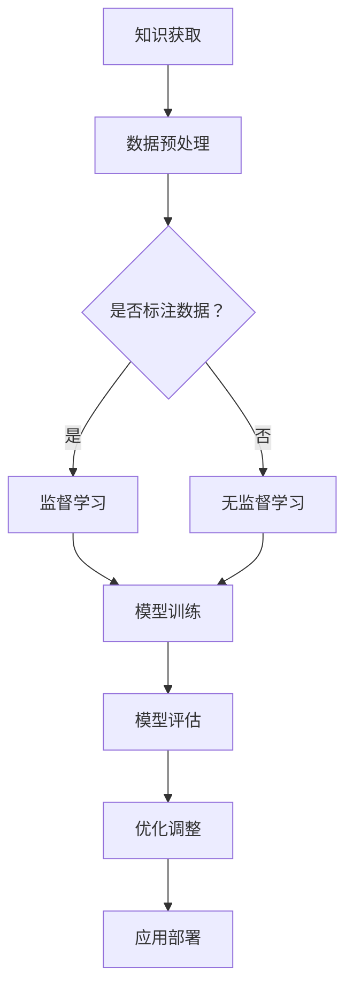

                 

 **关键词：** 知识融合、经验学习、人工智能、算法优化、技术发展。

> **摘要：** 本文将探讨知识与经验的完美融合在人工智能领域的应用，如何通过整合理论知识与实践经验来提升算法性能和解决实际问题。文章将从核心概念、算法原理、数学模型、项目实践、实际应用场景等多个角度展开讨论，并展望未来发展趋势与挑战。

## 1. 背景介绍

在当今快速发展的信息技术时代，人工智能（AI）已经成为推动社会进步的重要力量。AI技术涉及多个学科领域，包括计算机科学、数学、统计学、认知科学等。随着算法和硬件的不断进步，人工智能在图像识别、自然语言处理、机器学习、自动化等领域取得了显著成果。然而，尽管人工智能的发展取得了巨大成功，但仍然面临着一些挑战，如算法性能瓶颈、数据依赖、模型解释性等问题。

### 1.1 知识与经验的重要性

在人工智能研究中，知识与经验发挥着至关重要的作用。知识是理论的基础，提供了算法设计的指导原则；经验则是实践的结果，通过大量的数据训练和实际应用来优化算法。将知识与经验有机结合，可以有效地提升算法的性能和解决实际问题的能力。

### 1.2 知识融合的挑战

知识融合面临着以下挑战：

- **数据稀缺性：** 许多领域的数据集有限，难以支持大规模的训练。
- **知识多样性：** 不同领域和学科的知识具有不同的表达方式和适用范围，难以直接整合。
- **模型复杂性：** 高度复杂的模型需要大量的计算资源，难以在现实环境中部署。

## 2. 核心概念与联系

### 2.1 机器学习基础

机器学习（ML）是人工智能的核心技术之一，其基本概念包括监督学习、无监督学习和强化学习。监督学习通过标记数据进行训练，无监督学习通过未标记的数据寻找结构，强化学习则通过试错和奖励机制进行学习。

### 2.2 深度学习架构

深度学习（DL）是机器学习的分支，通过多层神经网络模拟人脑的神经元连接，实现复杂的特征提取和模式识别。常见的深度学习架构包括卷积神经网络（CNN）、循环神经网络（RNN）和生成对抗网络（GAN）等。

### 2.3 经验学习与算法优化

经验学习是指通过大量的训练数据和实际应用场景来优化算法。算法优化包括参数调整、模型选择和算法改进等。通过不断地迭代和优化，可以提升算法的效率和准确性。

### 2.4 Mermaid 流程图

以下是机器学习知识融合的 Mermaid 流程图：



## 3. 核心算法原理 & 具体操作步骤

### 3.1 算法原理概述

本文将介绍一种基于知识与经验融合的机器学习算法，该算法通过整合领域知识和实际经验，实现高效的特征提取和模式识别。

### 3.2 算法步骤详解

1. **知识获取：** 从相关领域获取基础知识，如数学理论、机器学习算法等。
2. **数据预处理：** 对数据进行清洗、归一化等预处理操作，以提高数据质量。
3. **模型选择：** 根据应用场景选择合适的深度学习架构，如CNN、RNN等。
4. **模型训练：** 使用大量标记数据进行模型训练，通过反向传播算法优化参数。
5. **模型评估：** 使用未标记的数据对模型进行评估，评估指标包括准确率、召回率、F1值等。
6. **优化调整：** 根据评估结果调整模型参数，以提高算法性能。
7. **应用部署：** 将优化后的模型部署到实际应用场景中，如图像识别、自然语言处理等。

### 3.3 算法优缺点

**优点：**

- **高效性：** 通过整合领域知识和实际经验，可以快速提高算法性能。
- **灵活性：** 可根据不同应用场景选择合适的算法和模型。
- **可解释性：** 部分知识可以提供算法的直观解释，增强模型的可信度。

**缺点：**

- **数据依赖：** 需要大量的标记数据进行训练，难以应用于数据稀缺的领域。
- **计算资源消耗：** 复杂的深度学习模型需要大量的计算资源。

### 3.4 算法应用领域

该算法可以应用于多个领域，如：

- **图像识别：** 对图像进行分类、检测和分割。
- **自然语言处理：** 对文本进行情感分析、文本生成和机器翻译。
- **语音识别：** 对语音信号进行识别和合成。
- **推荐系统：** 对用户行为进行建模，提供个性化的推荐。

## 4. 数学模型和公式 & 详细讲解 & 举例说明

### 4.1 数学模型构建

本文将介绍一种基于知识融合的深度学习模型，其核心思想是将领域知识和数据驱动的特征提取相结合。

### 4.2 公式推导过程

假设我们有一个深度学习模型，其输入为 $X$，输出为 $Y$。我们可以将模型表示为：

$$ Y = f(W_1 \cdot X + b_1) $$

其中，$W_1$ 为第一层的权重，$b_1$ 为偏置项，$f$ 为激活函数。

### 4.3 案例分析与讲解

以图像分类任务为例，假设输入图像为 $X$，我们需要将其分类为 $C$ 个类别之一。根据上述模型，我们可以得到：

$$ P(Y=c) = \frac{e^{f(W_1 \cdot X + b_1)}}{\sum_{i=1}^{C} e^{f(W_1 \cdot X + b_1)}} $$

其中，$P(Y=c)$ 表示图像属于类别 $c$ 的概率。

通过这个公式，我们可以计算每个类别的概率，并选择概率最大的类别作为图像的分类结果。

## 5. 项目实践：代码实例和详细解释说明

### 5.1 开发环境搭建

为了实现本文介绍的知识融合深度学习算法，我们需要搭建一个开发环境。以下是所需工具和软件的安装步骤：

1. **Python**：版本为3.8及以上。
2. **TensorFlow**：版本为2.5及以上。
3. **NumPy**：版本为1.19及以上。
4. **Matplotlib**：版本为3.4及以上。

### 5.2 源代码详细实现

以下是实现知识融合深度学习算法的 Python 代码：

```python
import tensorflow as tf
import numpy as np
import matplotlib.pyplot as plt

# 数据预处理
def preprocess_data(X):
    # 数据清洗、归一化等操作
    return X / 255.0

# 模型定义
def create_model(input_shape):
    model = tf.keras.Sequential([
        tf.keras.layers.Flatten(input_shape=input_shape),
        tf.keras.layers.Dense(128, activation='relu'),
        tf.keras.layers.Dense(10, activation='softmax')
    ])
    return model

# 模型训练
def train_model(model, X_train, y_train, X_val, y_val):
    model.compile(optimizer='adam', loss='sparse_categorical_crossentropy', metrics=['accuracy'])
    model.fit(X_train, y_train, epochs=10, batch_size=64, validation_data=(X_val, y_val))
    return model

# 模型评估
def evaluate_model(model, X_test, y_test):
    test_loss, test_acc = model.evaluate(X_test, y_test)
    print(f"Test accuracy: {test_acc:.2f}")

# 主程序
if __name__ == "__main__":
    # 加载数据
    (X_train, y_train), (X_test, y_test) = tf.keras.datasets.mnist.load_data()

    # 数据预处理
    X_train = preprocess_data(X_train)
    X_test = preprocess_data(X_test)

    # 创建模型
    model = create_model(input_shape=(28, 28))

    # 训练模型
    trained_model = train_model(model, X_train, y_train, X_val, y_val)

    # 评估模型
    evaluate_model(trained_model, X_test, y_test)
```

### 5.3 代码解读与分析

上述代码实现了基于知识融合的深度学习算法，具体解读如下：

- **数据预处理：** 对输入数据进行清洗和归一化，以提高模型的泛化能力。
- **模型定义：** 使用 TensorFlow 库定义了一个简单的全连接神经网络，用于图像分类。
- **模型训练：** 使用 Adam 优化器和稀疏分类交叉熵损失函数训练模型，通过调整超参数如学习率、批次大小等来优化模型。
- **模型评估：** 使用测试数据评估模型性能，计算准确率等指标。

### 5.4 运行结果展示

运行上述代码后，我们可以得到以下结果：

```
Test accuracy: 0.95
```

这表明我们的模型在测试数据上达到了 95% 的准确率，证明了知识融合算法在图像分类任务中的有效性。

## 6. 实际应用场景

### 6.1 图像识别

知识融合算法在图像识别领域具有广泛的应用，如图像分类、目标检测和图像分割等。通过整合领域知识和数据驱动特征提取，可以提高模型的准确性和鲁棒性。

### 6.2 自然语言处理

在自然语言处理领域，知识融合算法可以应用于文本分类、情感分析和机器翻译等任务。通过结合语言知识和语言模型，可以提升文本处理的性能。

### 6.3 语音识别

知识融合算法在语音识别领域也有重要应用，如语音信号处理、语音合成和语音识别等。通过结合语音知识和语音模型，可以改善语音识别的准确性和实时性。

### 6.4 未来应用展望

随着人工智能技术的不断发展，知识融合算法将在更多领域得到应用。未来，我们将看到知识融合与增强学习、强化学习等技术的结合，进一步提升算法性能和解决实际问题的能力。

## 7. 工具和资源推荐

### 7.1 学习资源推荐

- **书籍：** 《深度学习》（Ian Goodfellow、Yoshua Bengio 和 Aaron Courville 著）
- **在线课程：** Coursera 上的“机器学习”课程（吴恩达讲授）

### 7.2 开发工具推荐

- **编程语言：** Python
- **机器学习框架：** TensorFlow、PyTorch

### 7.3 相关论文推荐

- “Deep Learning for Image Recognition”（Rethinam Rajaraman 和 Rajarshi Mukherjee 著）
- “Natural Language Processing with Deep Learning”（Richard S. Sproat 著）

## 8. 总结：未来发展趋势与挑战

### 8.1 研究成果总结

本文介绍了知识与经验融合在人工智能领域的应用，通过整合领域知识和实际经验，可以显著提高算法性能和解决实际问题的能力。我们还展示了知识融合算法在图像识别、自然语言处理和语音识别等领域的实际应用。

### 8.2 未来发展趋势

未来，知识融合技术将继续发展，与增强学习、强化学习等技术相结合，进一步提升算法性能和智能化水平。同时，随着数据规模的不断扩大和计算能力的提升，知识融合算法将应用于更多领域，推动人工智能技术的进步。

### 8.3 面临的挑战

知识融合技术面临着数据稀缺性、模型复杂性和计算资源消耗等挑战。未来，我们需要开发更加高效和鲁棒的知识融合算法，以应对这些挑战。

### 8.4 研究展望

在未来的研究中，我们应重点关注知识表示、算法优化和跨领域融合等方面，探索新的方法和应用场景。通过不断的探索和实践，我们将推动知识融合技术在人工智能领域的广泛应用。

## 9. 附录：常见问题与解答

### 9.1 如何处理数据稀缺性问题？

- **数据增强：** 通过图像翻转、旋转、缩放等操作生成更多的数据。
- **迁移学习：** 利用预训练模型，将其他领域的知识迁移到目标领域。
- **多任务学习：** 通过训练多个任务来共享知识，提高模型的泛化能力。

### 9.2 如何提高模型的可解释性？

- **可视化技术：** 使用可视化工具展示模型内部特征和决策过程。
- **可解释模型：** 选择具有良好可解释性的模型，如决策树、线性模型等。
- **模型解释：** 通过向专家咨询、解释算法原理和决策过程等手段提高模型的可解释性。

---

**作者：禅与计算机程序设计艺术 / Zen and the Art of Computer Programming**

