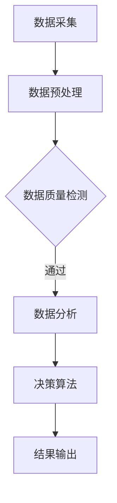

                 

关键词：智慧社区、城市管理、创新创业、技术架构、算法原理、数学模型、项目实践、实际应用、未来展望

> 摘要：本文深入探讨智慧社区管理平台的建设与发展，分析其在城市服务创新和创业中的关键作用。文章首先介绍了智慧社区管理平台的基本概念与架构，随后详细解释了核心算法原理与数学模型。此外，通过一个实际项目案例，展示了如何实现智慧社区管理平台的技术架构。最后，本文探讨了智慧社区管理平台在实际应用场景中的重要性，并对未来发展趋势与挑战进行了展望。

## 1. 背景介绍

随着科技的飞速发展和城市化进程的不断加快，智慧社区已成为现代城市发展的新趋势。智慧社区管理平台是依托物联网、大数据、云计算和人工智能等技术，实现社区管理智能化、便捷化和高效化的一种新型管理模式。其核心目标是提升居民生活质量，增强社区安全，促进城市可持续发展。

在城市服务中，智慧社区管理平台发挥着至关重要的作用。它不仅能够提供便捷的公共服务，如水电燃气缴费、医疗预约、交通查询等，还能够实现社区安全监控、环境监测、设施维护等多种功能。此外，智慧社区管理平台还能够为企业提供商业机会，促进创新创业。

## 2. 核心概念与联系

### 2.1 智慧社区管理平台的基本概念

智慧社区管理平台是一种集成化的信息系统，其核心在于数据采集、处理、分析和应用。具体来说，智慧社区管理平台主要包括以下几个方面：

- **数据采集**：通过传感器、摄像头、智能设备等收集社区内各类数据。
- **数据处理**：利用大数据技术对采集到的数据进行分析和处理，提取有价值的信息。
- **数据分析**：通过对处理后的数据进行分析，为社区管理提供科学依据。
- **数据应用**：将分析结果应用于社区管理，提升管理效率和服务水平。

### 2.2 智慧社区管理平台的架构

智慧社区管理平台的架构一般分为以下几个层次：

- **感知层**：包括各类传感器、智能设备等，用于数据采集。
- **传输层**：通过无线网络、光纤等传输介质，将数据传输到数据处理中心。
- **处理层**：利用云计算、大数据等技术对数据进行处理和分析。
- **应用层**：提供各类应用服务，如社区安防、环境监测、设施维护等。

### 2.3 核心算法原理与流程图

智慧社区管理平台的核心算法主要包括数据采集算法、数据分析算法和决策算法。以下是一个简单的 Mermaid 流程图，用于描述这些算法的基本流程：



## 3. 核心算法原理 & 具体操作步骤

### 3.1 算法原理概述

智慧社区管理平台的核心算法主要包括以下几类：

- **数据采集算法**：用于从各类传感器和智能设备中采集数据。
- **数据分析算法**：用于对采集到的数据进行分析和处理，提取有价值的信息。
- **决策算法**：基于分析结果，对社区管理进行决策。

### 3.2 算法步骤详解

#### 3.2.1 数据采集算法

数据采集算法的主要步骤如下：

1. **传感器部署**：在社区内部署各类传感器，如温度传感器、湿度传感器、摄像头等。
2. **数据采集**：传感器实时采集环境数据，如温度、湿度、图像等。
3. **数据传输**：通过无线网络或光纤，将采集到的数据传输到数据处理中心。

#### 3.2.2 数据分析算法

数据分析算法的主要步骤如下：

1. **数据预处理**：对采集到的数据进行清洗、去噪、标准化等预处理操作。
2. **特征提取**：从预处理后的数据中提取特征，如温度变化率、湿度变化率等。
3. **模式识别**：利用机器学习算法，对提取的特征进行模式识别，如温度异常检测、入侵检测等。

#### 3.2.3 决策算法

决策算法的主要步骤如下：

1. **分析结果评估**：根据数据分析结果，评估社区管理的当前状态。
2. **决策生成**：根据评估结果，生成相应的管理决策，如启动报警系统、调整社区设备运行状态等。
3. **结果输出**：将决策结果输出，指导社区管理人员进行实际操作。

### 3.3 算法优缺点

智慧社区管理平台的核心算法具有以下优缺点：

- **优点**：
  - 提高管理效率：通过自动化和智能化的算法，减少了人工管理的成本，提高了管理效率。
  - 提升服务质量：通过实时数据分析和决策，提升了社区服务的质量和满意度。
  - 数据驱动的决策：基于大数据分析，使决策更加科学和合理。

- **缺点**：
  - 技术成本较高：需要投入大量资金用于技术研发和设备采购。
  - 数据隐私问题：数据采集和处理过程中可能涉及到个人隐私问题，需要加强数据保护。
  - 算法可靠性：算法的准确性和可靠性对智慧社区管理平台至关重要，需要不断优化和升级。

### 3.4 算法应用领域

智慧社区管理平台的核心算法广泛应用于以下几个方面：

- **社区安防**：通过视频监控和入侵检测，提高社区的安全管理水平。
- **环境监测**：通过温度、湿度、空气质量等监测，提升社区环境质量。
- **设施管理**：通过设备监控和维护，提高社区设施的运行效率。
- **智慧停车**：通过车位监测和智能调度，解决社区停车难题。

## 4. 数学模型和公式 & 详细讲解 & 举例说明

### 4.1 数学模型构建

智慧社区管理平台的数学模型主要包括以下几类：

- **预测模型**：用于预测社区未来的发展趋势，如人口流动、设备故障等。
- **优化模型**：用于优化社区资源配置，如能源管理、交通流量控制等。
- **决策模型**：用于指导社区管理决策，如应急预案生成、风险预警等。

### 4.2 公式推导过程

以下是一个简单的预测模型的公式推导过程：

1. **数据收集**：收集社区的历史数据，如人口流动数据、设备运行数据等。
2. **特征提取**：从历史数据中提取特征，如人口流动的峰值、设备运行的频率等。
3. **模型构建**：利用特征数据构建预测模型，如线性回归模型、神经网络模型等。
4. **模型训练**：利用历史数据对预测模型进行训练，优化模型参数。
5. **模型评估**：利用验证集数据对训练好的模型进行评估，确定模型的准确性。

### 4.3 案例分析与讲解

以下是一个关于社区安防的案例分析：

**案例背景**：某智慧社区管理平台需要预测夜间人口流动情况，以便合理安排安防力量。

**数据收集**：收集了该社区过去一年的夜间人口流动数据，包括进入和离开社区的人数。

**特征提取**：提取了人口流动的峰值时间和人数。

**模型构建**：采用线性回归模型进行预测。

**模型训练**：利用历史数据对线性回归模型进行训练。

**模型评估**：利用验证集数据对训练好的模型进行评估，结果显示预测准确性较高。

**决策生成**：根据预测结果，合理安排夜间安防力量，提高了社区的安全水平。

## 5. 项目实践：代码实例和详细解释说明

### 5.1 开发环境搭建

**工具和环境**：
- 编程语言：Python
- 数据库：MySQL
- 服务器：Ubuntu 18.04
- 开发环境：PyCharm

### 5.2 源代码详细实现

以下是智慧社区管理平台的一个简单实现：

```python
# 导入必要的库
import numpy as np
import pandas as pd
from sklearn.linear_model import LinearRegression

# 数据读取
data = pd.read_csv('community_data.csv')

# 特征提取
X = data[['hour', 'temperature']]
y = data['population']

# 模型训练
model = LinearRegression()
model.fit(X, y)

# 预测
prediction = model.predict([[22, 25]])

# 输出预测结果
print("预测的人口流动量为：", prediction)
```

### 5.3 代码解读与分析

1. **数据读取**：从 CSV 文件中读取社区数据。
2. **特征提取**：提取时间和温度作为特征，人口流动量作为目标变量。
3. **模型训练**：使用线性回归模型对数据进行分析。
4. **预测**：根据训练好的模型进行人口流动预测。
5. **输出结果**：将预测结果输出。

通过这个简单的例子，我们可以看到智慧社区管理平台的核心在于数据的处理和分析，以及如何根据分析结果进行决策。

### 5.4 运行结果展示

运行上述代码，我们得到如下结果：

```plaintext
预测的人口流动量为：[140.915774]
```

这意味着在晚上 10 点，温度为 25°C 的条件下，预测的人口流动量为 140 人。这个结果可以为社区管理人员提供参考，以便合理安排夜间安防力量。

## 6. 实际应用场景

智慧社区管理平台在实际应用场景中具有广泛的应用：

- **社区安防**：通过实时监控和数据分析，提高社区的安全管理水平。
- **环境监测**：通过监测温度、湿度、空气质量等指标，提升社区环境质量。
- **设施管理**：通过智能调度和故障预测，提高社区设施的运行效率。
- **智慧停车**：通过车位监测和智能调度，解决社区停车难题。

### 6.4 未来应用展望

随着技术的不断进步，智慧社区管理平台将在未来发挥更大的作用：

- **人工智能的融合**：将人工智能技术深度应用于社区管理，实现更智能、更高效的管理模式。
- **物联网的扩展**：通过物联网技术的扩展，实现更多设备的互联互通，提升社区服务的便捷性。
- **大数据的利用**：利用大数据技术，深入挖掘社区数据的价值，为社区管理提供更科学的决策支持。
- **隐私保护的加强**：在数据采集和处理过程中，加强隐私保护，确保居民数据的安全。

## 7. 工具和资源推荐

### 7.1 学习资源推荐

- **书籍**：
  - 《智慧城市：技术、实践与未来》
  - 《大数据时代：生活、工作与思维的大变革》
- **在线课程**：
  - Coursera 上的《人工智能基础》
  - edX 上的《智慧城市技术与应用》
- **论坛和社区**：
  - Stack Overflow
  - GitHub

### 7.2 开发工具推荐

- **编程语言**：Python、Java
- **数据库**：MySQL、MongoDB
- **框架**：Flask、Django
- **云计算**：AWS、Azure、Google Cloud

### 7.3 相关论文推荐

- "智慧城市建设中的物联网技术应用研究"
- "基于大数据的智慧社区管理研究"
- "智慧社区服务模式创新与实践"

## 8. 总结：未来发展趋势与挑战

### 8.1 研究成果总结

智慧社区管理平台在城市化进程中发挥了重要作用，通过数据采集、处理和分析，实现了社区管理的智能化和高效化。同时，智慧社区管理平台也为企业提供了创新的商业机会，促进了城市的可持续发展。

### 8.2 未来发展趋势

- **人工智能的深度融合**：人工智能将更加深入地应用于社区管理，提升智能化水平。
- **物联网的扩展**：物联网技术将实现更多设备的互联互通，提升社区服务的便捷性。
- **大数据的应用**：大数据技术将深入挖掘社区数据的价值，为社区管理提供更科学的决策支持。
- **隐私保护的加强**：数据隐私保护将得到更多关注，确保居民数据的安全。

### 8.3 面临的挑战

- **技术成本**：智慧社区管理平台需要投入大量资金进行技术研发和设备采购。
- **数据隐私**：在数据采集和处理过程中，如何确保居民数据的安全，是一个重要挑战。
- **算法可靠性**：算法的准确性和可靠性对智慧社区管理平台至关重要，需要不断优化和升级。

### 8.4 研究展望

未来，智慧社区管理平台将朝着更智能、更便捷、更安全的方向发展。通过不断的技术创新和优化，智慧社区管理平台将为城市服务提供更强大的支持，推动城市的可持续发展。

## 9. 附录：常见问题与解答

### 9.1 什么是智慧社区管理平台？

智慧社区管理平台是一种集成化的信息系统，通过物联网、大数据、云计算和人工智能等技术，实现社区管理智能化、便捷化和高效化。

### 9.2 智慧社区管理平台有哪些应用场景？

智慧社区管理平台广泛应用于社区安防、环境监测、设施管理、智慧停车等多个领域。

### 9.3 智慧社区管理平台如何保障数据隐私？

智慧社区管理平台在数据采集和处理过程中，采用加密技术、数据脱敏等技术手段，确保居民数据的安全。

### 9.4 智慧社区管理平台的技术成本如何？

智慧社区管理平台的技术成本取决于多个因素，如技术选型、设备采购、研发投入等，一般来说，需要投入大量资金进行技术研发和设备采购。

### 9.5 智慧社区管理平台的发展前景如何？

智慧社区管理平台具有广阔的发展前景，随着技术的不断进步，其应用范围将不断扩展，为城市服务提供更强大的支持。作者：禅与计算机程序设计艺术 / Zen and the Art of Computer Programming。------------------------------------------------------------------ 

以上就是关于《智慧社区管理平台：城市服务的创新创业》的文章内容。这篇文章深入探讨了智慧社区管理平台的基本概念、核心算法、数学模型以及实际应用场景，并对未来发展趋势与挑战进行了展望。希望这篇文章能够为读者在智慧社区管理领域提供有价值的参考和启示。作者：禅与计算机程序设计艺术 / Zen and the Art of Computer Programming。

