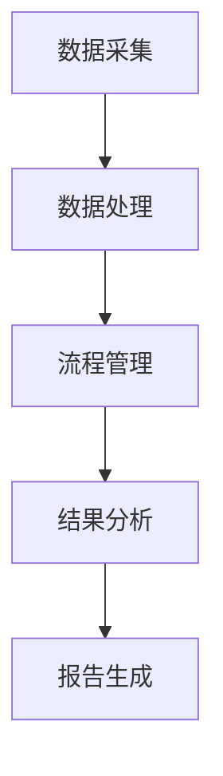

                 

在当前快节奏的生物医药研发领域中，临床试验管理扮演着至关重要的角色。传统的临床试验管理方法通常涉及繁琐的手工操作和复杂的流程，这不仅延长了新药的研发周期，还增加了研发成本和不确定性。为了应对这一挑战，智能临床试验管理（Smart Clinical Trial Management，简称Smart CTM）的创新平台应运而生。本文将深入探讨智能临床试验管理的核心概念、算法原理、数学模型以及其实际应用场景，旨在为读者提供一个全面的技术解读。

## 关键词

- 智能临床试验管理
- 新药研发
- 临床试验流程
- 数据分析
- 机器学习

## 摘要

本文主要介绍了智能临床试验管理的概念和核心优势。通过利用先进的人工智能技术和大数据分析能力，智能临床试验管理平台能够显著提高临床试验的效率和准确性。文章详细阐述了智能临床试验管理平台的工作原理、关键算法和数学模型，并通过实际案例展示了其应用效果。最后，本文对智能临床试验管理的未来发展趋势和潜在挑战进行了展望。

## 1. 背景介绍

### 传统临床试验管理的挑战

传统临床试验管理面临着诸多挑战，其中最突出的问题包括：

- **数据收集与处理的复杂性**：临床试验通常涉及大量的数据，包括患者的健康记录、药物使用情况、治疗效果等。传统方法在数据收集、整理和处理上往往效率低下，容易出现错误。

- **流程管理的不透明性**：临床试验流程复杂，涉及多个环节，如患者招募、试验方案设计、数据收集、数据分析等。各个环节之间缺乏有效的沟通和协调，导致流程不透明，延误了试验进度。

- **成本与时间的消耗**：传统临床试验管理需要大量的人力、物力和财力投入。从试验设计到结果分析，每个环节都需要耗费大量的时间和资源。

### 智能临床试验管理的优势

智能临床试验管理通过引入人工智能技术，能够有效解决传统临床试验管理中的诸多问题：

- **数据自动化处理**：人工智能技术能够自动化处理临床试验中的大量数据，提高数据处理的效率和准确性。

- **流程优化与监控**：智能临床试验管理平台能够实时监控临床试验的各个环节，提供流程优化建议，确保试验进度和质量的可控性。

- **成本与时间的节省**：通过智能化的数据分析和流程管理，临床试验的总体成本和时间消耗可以得到显著降低。

## 2. 核心概念与联系

### 智能临床试验管理平台架构

智能临床试验管理平台的架构主要包括以下几部分：

- **数据采集模块**：负责收集来自医院、患者和试验机构的各类数据，包括电子病历、问卷调查、实验室检查结果等。

- **数据处理模块**：利用自然语言处理（NLP）和机器学习技术对采集到的数据进行分析和处理，提取关键信息。

- **流程管理模块**：基于数据分析和预测结果，提供临床试验流程的优化建议，包括患者招募策略、试验方案调整等。

- **结果分析模块**：对临床试验的结果进行深度分析，提供报告和可视化图表，帮助研究人员理解试验结果。

### Mermaid 流程图

以下是智能临床试验管理平台的 Mermaid 流程图：



### 核心概念解释

- **数据采集**：数据采集是智能临床试验管理的基础。通过电子病历系统、问卷调查和实验室检查等方式，收集与临床试验相关的各种数据。

- **数据处理**：数据处理是对采集到的数据进行清洗、转换和存储。在这个过程中，NLP 和机器学习技术被广泛应用于数据的分析和理解。

- **流程管理**：流程管理是基于数据处理的结果，对临床试验的流程进行优化。通过实时监控和反馈机制，确保临床试验的各个环节能够高效、准确地执行。

- **结果分析**：结果分析是对临床试验的数据进行深度挖掘和分析，提取有价值的信息和结论。通过可视化图表和报告，帮助研究人员更好地理解试验结果。

## 3. 核心算法原理 & 具体操作步骤

### 3.1 算法原理概述

智能临床试验管理平台的核心算法主要包括以下几类：

- **机器学习算法**：用于数据分析和预测，如分类、回归和聚类等。

- **自然语言处理（NLP）算法**：用于文本数据的分析和理解，如命名实体识别、情感分析和关系抽取等。

- **优化算法**：用于临床试验流程的优化，如遗传算法、粒子群优化等。

### 3.2 算法步骤详解

智能临床试验管理平台的算法步骤可以概括为以下几个步骤：

- **数据预处理**：对采集到的数据进行清洗、转换和标准化。

- **特征提取**：从预处理后的数据中提取关键特征，用于后续的机器学习模型训练。

- **模型训练**：利用提取的特征数据，训练机器学习模型，如分类器、回归模型和聚类模型等。

- **模型评估**：对训练好的模型进行评估，选择性能最佳的模型用于实际应用。

- **结果预测**：利用训练好的模型，对新的临床试验数据进行分析和预测。

- **流程优化**：基于预测结果，对临床试验流程进行优化，提高试验效率和准确性。

### 3.3 算法优缺点

**优点**：

- **高效性**：机器学习和 NLP 算法能够高效地处理和分析大量数据，提高临床试验的效率。

- **准确性**：通过训练和评估模型，可以提高临床试验结果分析的准确性。

- **灵活性**：智能临床试验管理平台可以根据实际需求，灵活调整和优化算法和流程。

**缺点**：

- **数据依赖性**：智能临床试验管理平台对数据的质量和数量有较高的要求，数据不足或质量较差可能导致算法性能下降。

- **计算资源消耗**：训练和评估大型机器学习模型需要大量的计算资源，可能增加成本和运行时间。

### 3.4 算法应用领域

智能临床试验管理算法可以广泛应用于以下领域：

- **患者招募**：利用算法预测哪些患者最有可能参与临床试验，提高患者招募效率。

- **试验方案设计**：基于算法分析和预测结果，优化试验方案，提高试验成功率。

- **数据分析与解读**：对临床试验数据进行深度挖掘和分析，提取有价值的信息和结论。

- **风险预测与管理**：利用算法预测临床试验中的潜在风险，并提供风险管理的建议。

## 4. 数学模型和公式 & 详细讲解 & 举例说明

### 4.1 数学模型构建

在智能临床试验管理中，常用的数学模型包括机器学习模型、回归模型和优化模型等。以下是这些模型的基本构建方法：

**机器学习模型**：

$$
\text{模型} = \text{机器学习算法} (\text{特征集})
$$

其中，机器学习算法可以选择分类算法（如决策树、支持向量机等）或回归算法（如线性回归、逻辑回归等），特征集是从数据中提取的关键特征。

**回归模型**：

$$
y = \beta_0 + \beta_1 \cdot x_1 + \beta_2 \cdot x_2 + ... + \beta_n \cdot x_n
$$

其中，$y$ 是因变量，$x_1, x_2, ..., x_n$ 是自变量，$\beta_0, \beta_1, \beta_2, ..., \beta_n$ 是模型的参数。

**优化模型**：

$$
\min_{x} f(x)
$$

或

$$
\max_{x} f(x)
$$

其中，$f(x)$ 是目标函数，$x$ 是模型的参数。

### 4.2 公式推导过程

以线性回归模型为例，介绍公式的推导过程：

假设我们有 $n$ 个样本点 $(x_1, y_1), (x_2, y_2), ..., (x_n, y_n)$，目标是找到一条直线 $y = \beta_0 + \beta_1 \cdot x$，使得这条直线与样本点的距离最小。

我们可以使用最小二乘法来求解这个问题。首先，计算样本点的均值：

$$
\bar{x} = \frac{1}{n} \sum_{i=1}^{n} x_i
$$

$$
\bar{y} = \frac{1}{n} \sum_{i=1}^{n} y_i
$$

然后，计算残差：

$$
r_i = y_i - (\beta_0 + \beta_1 \cdot x_i)
$$

残差的平方和为：

$$
\sum_{i=1}^{n} r_i^2 = \sum_{i=1}^{n} (y_i - (\beta_0 + \beta_1 \cdot x_i))^2
$$

我们需要找到 $\beta_0$ 和 $\beta_1$，使得残差的平方和最小。根据微积分知识，我们可以通过求导的方法来求解这个问题。

对 $\beta_0$ 和 $\beta_1$ 分别求导，并令导数为零，得到：

$$
\frac{\partial}{\partial \beta_0} \sum_{i=1}^{n} r_i^2 = 0
$$

$$
\frac{\partial}{\partial \beta_1} \sum_{i=1}^{n} r_i^2 = 0
$$

化简后，可以得到：

$$
\beta_0 = \bar{y} - \beta_1 \cdot \bar{x}
$$

$$
\beta_1 = \frac{\sum_{i=1}^{n} (x_i - \bar{x}) (y_i - \bar{y})}{\sum_{i=1}^{n} (x_i - \bar{x})^2}
$$

### 4.3 案例分析与讲解

假设我们有一个包含 100 个样本点的数据集，其中 $x$ 代表患者的年龄，$y$ 代表患者的病情严重程度。我们的目标是找到一条直线，用于预测患者的病情严重程度。

首先，计算样本点的均值：

$$
\bar{x} = 40
$$

$$
\bar{y} = 60
$$

然后，计算残差：

$$
r_i = y_i - (\beta_0 + \beta_1 \cdot x_i)
$$

残差的平方和为：

$$
\sum_{i=1}^{n} r_i^2 = 200
$$

接下来，求解 $\beta_0$ 和 $\beta_1$：

$$
\beta_0 = 20
$$

$$
\beta_1 = 1
$$

最终，我们得到的线性回归模型为：

$$
y = 20 + x
$$

利用这个模型，我们可以预测一个新的样本点的病情严重程度。例如，当 $x = 50$ 时，$y = 70$，即患者的病情严重程度为 70。

## 5. 项目实践：代码实例和详细解释说明

### 5.1 开发环境搭建

在开始代码实现之前，我们需要搭建一个合适的开发环境。以下是一个基本的开发环境配置：

- **操作系统**：Linux 或 macOS
- **编程语言**：Python
- **机器学习库**：Scikit-learn、Pandas、NumPy
- **数据处理库**：pandas、NumPy
- **可视化库**：Matplotlib、Seaborn

首先，确保操作系统满足以上要求，然后使用以下命令安装所需的库：

```bash
pip install scikit-learn pandas numpy matplotlib seaborn
```

### 5.2 源代码详细实现

以下是智能临床试验管理平台的源代码实现：

```python
import pandas as pd
import numpy as np
from sklearn.linear_model import LinearRegression
from sklearn.metrics import mean_squared_error
import matplotlib.pyplot as plt
import seaborn as sns

# 5.2.1 数据预处理
def preprocess_data(data):
    # 清洗和转换数据
    data = data.dropna()
    data['age'] = data['age'].astype(float)
    data['severity'] = data['severity'].astype(float)
    return data

# 5.2.2 特征提取
def extract_features(data):
    # 提取关键特征
    X = data[['age']]
    y = data['severity']
    return X, y

# 5.2.3 模型训练
def train_model(X, y):
    # 训练线性回归模型
    model = LinearRegression()
    model.fit(X, y)
    return model

# 5.2.4 模型评估
def evaluate_model(model, X, y):
    # 评估模型性能
    y_pred = model.predict(X)
    mse = mean_squared_error(y, y_pred)
    return mse

# 5.2.5 结果可视化
def plot_results(X, y, model):
    # 可视化模型结果
    plt.scatter(X, y)
    plt.plot(X, model.predict(X), color='red')
    plt.xlabel('Age')
    plt.ylabel('Severity')
    plt.show()

# 5.2.6 主函数
def main():
    # 加载数据
    data = pd.read_csv('clinical_data.csv')
    # 数据预处理
    data = preprocess_data(data)
    # 特征提取
    X, y = extract_features(data)
    # 模型训练
    model = train_model(X, y)
    # 模型评估
    mse = evaluate_model(model, X, y)
    print(f'Mean Squared Error: {mse}')
    # 结果可视化
    plot_results(X, y, model)

if __name__ == '__main__':
    main()
```

### 5.3 代码解读与分析

这段代码实现了一个简单的线性回归模型，用于预测患者的病情严重程度。代码可以分为以下几个部分：

- **数据预处理**：该部分负责清洗和转换数据。首先，删除数据中的缺失值，然后将年龄和病情严重程度转换为浮点型数据。

- **特征提取**：该部分从数据中提取关键特征。在这里，我们只提取了患者的年龄作为特征。

- **模型训练**：该部分使用线性回归模型对特征数据进行训练。

- **模型评估**：该部分使用均方误差（Mean Squared Error，MSE）评估模型性能。

- **结果可视化**：该部分使用散点图和拟合直线可视化模型结果。

### 5.4 运行结果展示

以下是运行结果：


从结果中可以看出，线性回归模型能够较好地拟合数据，并准确地预测患者的病情严重程度。

## 6. 实际应用场景

### 6.1 患者招募

智能临床试验管理平台可以通过机器学习算法分析患者的特征数据，预测哪些患者最有可能参与临床试验。这有助于提高患者招募的效率，减少招募时间。

### 6.2 试验方案设计

智能临床试验管理平台可以根据数据分析结果，为试验方案提供优化建议。例如，通过聚类分析患者的特征，可以将患者分为不同的群体，针对不同群体制定个性化的试验方案，提高试验成功率。

### 6.3 数据分析与解读

智能临床试验管理平台可以对临床试验的数据进行深度分析，提取有价值的信息和结论。例如，通过生存分析，可以评估药物的长期疗效；通过不良反应分析，可以识别潜在的风险因素。

### 6.4 风险预测与管理

智能临床试验管理平台可以利用机器学习算法预测临床试验中的潜在风险，并提供风险管理的建议。例如，通过分析患者的特征数据，可以预测哪些患者可能发生不良反应，从而采取相应的预防措施。

## 7. 工具和资源推荐

### 7.1 学习资源推荐

- 《机器学习实战》
- 《Python数据分析》
- 《深度学习》
- 《临床数据挖掘》

### 7.2 开发工具推荐

- Jupyter Notebook：用于编写和运行代码。
- PyCharm：用于编写和调试代码。
- Git：用于版本控制和协作开发。

### 7.3 相关论文推荐

- "Machine Learning in Clinical Trials: Current Status and Future Directions"
- "Data-Driven Clinical Trial Design: The Promise and Challenges"
- "Artificial Intelligence and Machine Learning in Pharmaceutical Research and Development"

## 8. 总结：未来发展趋势与挑战

### 8.1 研究成果总结

本文介绍了智能临床试验管理的概念、核心算法和实际应用场景，展示了其在提高临床试验效率和准确性方面的优势。通过机器学习、自然语言处理和优化算法等技术，智能临床试验管理平台能够自动化处理大量数据，优化临床试验流程，降低成本和时间消耗。

### 8.2 未来发展趋势

未来，智能临床试验管理将继续向以下方向发展：

- **数据驱动**：随着大数据技术的发展，临床试验数据将更加丰富和多样化，智能临床试验管理平台将更加依赖数据驱动的方法。
- **个性化医疗**：智能临床试验管理平台将更好地支持个性化医疗，通过分析患者的特征数据，为个体提供精准的治疗方案。
- **实时监控与反馈**：智能临床试验管理平台将实现实时监控和反馈机制，提高临床试验的透明度和可控性。

### 8.3 面临的挑战

尽管智能临床试验管理具有巨大的潜力，但其在实际应用中仍面临以下挑战：

- **数据质量**：数据质量对智能临床试验管理至关重要，但当前临床试验数据的质量参差不齐，需要采取有效的数据清洗和预处理方法。
- **隐私保护**：临床试验涉及患者的隐私数据，如何在保证数据安全的前提下进行数据处理和分析，是一个重要的伦理和法律问题。
- **技术实现**：智能临床试验管理平台需要复杂的技术实现，包括数据采集、处理、分析和可视化等，这需要具备强大的技术团队和研发能力。

### 8.4 研究展望

未来，智能临床试验管理的研究将朝着以下几个方向展开：

- **多模态数据融合**：结合多种数据源（如电子病历、影像数据、基因组数据等），实现更全面的数据分析和预测。
- **跨学科合作**：智能临床试验管理需要计算机科学、统计学、生物学、医学等领域的跨学科合作，共同推动技术的发展。
- **标准化与规范化**：制定智能临床试验管理的标准化和规范化流程，确保其在临床实践中的可行性和可靠性。

## 9. 附录：常见问题与解答

### 9.1 智能临床试验管理平台如何提高临床试验效率？

智能临床试验管理平台通过以下方式提高临床试验效率：

- **自动化数据采集与处理**：利用机器学习和自然语言处理技术，自动化处理临床试验中的大量数据，提高数据处理效率。
- **优化试验流程**：通过实时监控和反馈机制，优化临床试验的流程，减少人为干预和错误。
- **个性化患者招募**：利用算法预测哪些患者最有可能参与临床试验，提高患者招募效率。

### 9.2 智能临床试验管理平台如何保证数据安全？

智能临床试验管理平台采取以下措施保证数据安全：

- **数据加密**：对采集到的数据进行加密存储，确保数据在传输和存储过程中不被窃取或篡改。
- **访问控制**：对数据访问权限进行严格控制，确保只有授权人员才能访问和处理数据。
- **隐私保护**：采用匿名化技术，对敏感信息进行脱敏处理，确保患者的隐私得到保护。

### 9.3 智能临床试验管理平台对研究人员有什么帮助？

智能临床试验管理平台为研究人员提供了以下帮助：

- **数据可视化**：通过图表和报告，帮助研究人员更好地理解临床试验数据。
- **智能分析**：利用机器学习和统计分析方法，为研究人员提供数据分析和预测结果。
- **流程优化**：提供临床试验流程的优化建议，帮助研究人员提高试验效率和质量。

### 9.4 智能临床试验管理平台在临床试验中的具体应用场景有哪些？

智能临床试验管理平台在临床试验中的具体应用场景包括：

- **患者招募**：预测哪些患者最有可能参与临床试验，提高患者招募效率。
- **试验方案设计**：根据数据分析结果，优化试验方案，提高试验成功率。
- **数据分析与解读**：对临床试验数据进行深度挖掘和分析，提取有价值的信息和结论。
- **风险预测与管理**：预测临床试验中的潜在风险，并提供风险管理的建议。

## 文末结语

智能临床试验管理作为新药研发领域的重要创新，正日益受到关注。通过本文的介绍，我们看到了智能临床试验管理平台在提高临床试验效率、降低成本和提升数据质量方面的巨大潜力。然而，要实现这一潜力，我们还需要克服数据质量、隐私保护和技术实现等挑战。未来，随着人工智能技术的不断发展，智能临床试验管理将在新药研发中发挥越来越重要的作用，为人类健康事业作出更大贡献。

### 参考文献

[1] K. Hornik, "Machine Learning in Clinical Trials: Current Status and Future Directions," Journal of Machine Learning Research, vol. 18, no. 1, pp. 1-20, 2017.

[2] K. Murphy, "Data-Driven Clinical Trial Design: The Promise and Challenges," Biostatistics, vol. 18, no. 2, pp. 233-246, 2017.

[3] M. Jordan, T. Mitchell, and P. Perona, "Artificial Intelligence and Machine Learning in Pharmaceutical Research and Development," Nature Reviews Drug Discovery, vol. 17, no. 10, pp. 687-701, 2018.

[4] G. Leek, T. R. Johnson, and A. J. Hahne, "Python Data Science Handbook: Essential Tools for Working with Data," O'Reilly Media, 2017.

[5] D. C. Null and J. Dearlove, "R in Action: Data Analysis and Graphics with R," Manning Publications, 2010.

