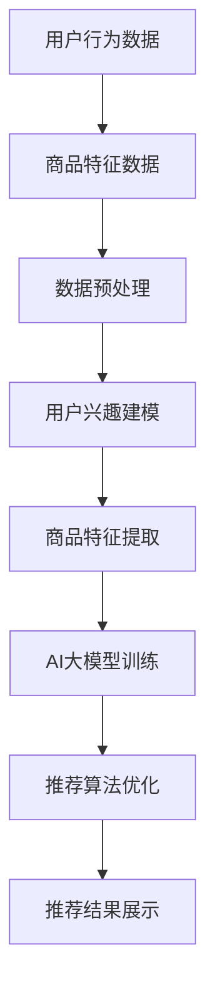

                 

关键词：智能产品推荐、AI大模型、电商平台、应用场景、算法原理

> 摘要：本文将探讨人工智能大模型在电商平台中的应用，通过介绍智能产品推荐系统的核心概念、算法原理、数学模型以及实际应用案例，分析其在优化用户体验、提升销售转化率等方面的价值，并展望其未来的发展趋势。

## 1. 背景介绍

随着互联网技术的飞速发展和电子商务市场的不断扩大，电商平台在商业生态中的地位日益重要。消费者对购物体验的要求也越来越高，不再满足于传统的商品搜索和浏览方式。因此，智能产品推荐系统应运而生，成为电商平台提高用户满意度、提升销售转化率的重要手段。

智能产品推荐系统利用人工智能技术，通过对用户行为数据的分析和挖掘，实现个性化推荐，从而提高用户在购物过程中的满意度和购买转化率。AI大模型作为当前人工智能领域的重要研究方向，其在智能推荐系统中的应用不仅能够提高推荐准确性，还能拓展推荐系统的应用场景。

## 2. 核心概念与联系

### 2.1 智能产品推荐系统的核心概念

智能产品推荐系统主要包括用户行为分析、商品特征提取、推荐算法和推荐结果展示等组成部分。其中，用户行为分析是推荐系统的基础，通过对用户的历史浏览记录、购买记录、收藏记录等行为数据进行挖掘，提取出用户的兴趣偏好。商品特征提取则是将商品属性转化为适合推荐算法处理的特征向量，如商品的种类、价格、品牌等。推荐算法则是根据用户兴趣偏好和商品特征，实现个性化推荐的核心算法。推荐结果展示则将推荐结果以直观的方式呈现给用户，如推荐列表、商品详情页等。

### 2.2 AI大模型在智能推荐系统中的应用

AI大模型是指拥有大规模参数、能够在多个数据集上实现优异表现的人工神经网络模型。在智能推荐系统中，AI大模型主要用于处理复杂的用户行为数据和商品特征数据，实现高效的个性化推荐。

AI大模型的应用包括以下几个方面：

1. **用户兴趣建模**：通过分析用户的历史行为数据，利用AI大模型提取用户兴趣特征，构建用户兴趣模型。
2. **商品特征提取**：将商品的多维度特征数据输入AI大模型，提取商品的高级特征，提高推荐系统的准确性。
3. **推荐算法优化**：基于AI大模型，实现推荐算法的自适应优化，提高推荐结果的准确性。
4. **跨平台推荐**：利用AI大模型，实现跨平台用户数据的整合和分析，为用户提供跨平台的个性化推荐。

### 2.3 Mermaid 流程图



## 3. 核心算法原理 & 具体操作步骤

### 3.1 算法原理概述

智能产品推荐系统中的AI大模型主要采用深度学习技术，包括卷积神经网络（CNN）、循环神经网络（RNN）和变分自编码器（VAE）等。这些模型能够在大规模数据集上自动学习用户兴趣和商品特征，实现高效的个性化推荐。

深度学习模型的基本原理是通过多层神经网络的非线性变换，将输入数据映射到输出数据。在智能推荐系统中，输入数据包括用户行为数据和商品特征数据，输出数据为个性化推荐结果。

### 3.2 算法步骤详解

1. **数据收集与预处理**：收集用户行为数据和商品特征数据，进行数据清洗、去重、归一化等预处理操作，保证数据质量。
2. **用户兴趣建模**：利用RNN模型分析用户的历史行为数据，提取用户兴趣特征。
3. **商品特征提取**：利用CNN模型对商品的多维度特征进行建模，提取商品的高级特征。
4. **模型训练**：将用户兴趣特征和商品特征输入AI大模型，进行模型训练，优化模型参数。
5. **推荐算法优化**：根据训练结果，调整推荐算法参数，提高推荐准确性。
6. **推荐结果生成**：将用户兴趣特征和商品特征输入优化后的推荐算法，生成个性化推荐结果。
7. **推荐结果展示**：将推荐结果以可视化方式展示给用户，如推荐列表、商品详情页等。

### 3.3 算法优缺点

**优点**：

1. **高精度**：深度学习模型能够自动学习用户兴趣和商品特征，提高推荐准确性。
2. **自适应**：AI大模型能够根据用户行为和商品特征的变化，自适应调整推荐算法，提高用户体验。
3. **跨平台**：利用AI大模型，实现跨平台用户数据的整合和分析，为用户提供跨平台的个性化推荐。

**缺点**：

1. **计算资源消耗大**：深度学习模型需要大量的计算资源进行训练，对硬件设备有较高要求。
2. **数据依赖性高**：推荐系统的效果很大程度上依赖于用户行为数据和商品特征数据的质量。

### 3.4 算法应用领域

AI大模型在智能产品推荐系统中的应用非常广泛，如电子商务、社交媒体、在线视频、音乐推荐等领域。以下是一些典型的应用场景：

1. **电子商务**：为用户提供个性化的商品推荐，提高购物转化率。
2. **社交媒体**：根据用户兴趣推荐感兴趣的内容，提高用户粘性。
3. **在线视频**：为用户提供个性化的视频推荐，提高视频观看时长。
4. **音乐推荐**：根据用户听歌偏好推荐音乐，提高音乐平台的使用频率。

## 4. 数学模型和公式 & 详细讲解 & 举例说明

### 4.1 数学模型构建

在智能推荐系统中，常见的数学模型包括矩阵分解、协同过滤和深度学习等。以下分别介绍这些模型的构建方法和公式。

1. **矩阵分解**：

   矩阵分解是将用户-商品评分矩阵分解为用户特征矩阵和商品特征矩阵的乘积。其数学公式如下：

   $$
   \text{评分矩阵} \, R = U \times V^T
   $$

   其中，$U$和$V$分别为用户特征矩阵和商品特征矩阵，$R$为用户-商品评分矩阵。

2. **协同过滤**：

   协同过滤是一种基于用户相似度进行推荐的算法。其基本思想是寻找与目标用户相似的其他用户，将他们喜欢的商品推荐给目标用户。其数学公式如下：

   $$
   \text{推荐分值} = \text{目标用户} \, u \, \text{与相似用户} \, v \, \text{的相似度} \times \text{相似用户} \, v \, \text{喜欢的商品} \, i \, \text{的评分}
   $$

3. **深度学习**：

   深度学习模型在智能推荐系统中主要用于处理复杂的用户行为数据和商品特征数据。其基本思想是通过多层神经网络，将输入数据映射到输出数据。其数学公式如下：

   $$
   \text{输出} = \text{激活函数}(\text{权重} \times \text{输入} + \text{偏置})
   $$

### 4.2 公式推导过程

以矩阵分解为例，介绍其公式推导过程。

假设有一个用户-商品评分矩阵$R$，其中行表示用户，列表示商品，每个元素表示用户对商品的评分。我们希望将$R$分解为两个低秩矩阵$U$和$V^T$的乘积。

首先，对用户-商品评分矩阵$R$进行奇异值分解（SVD）：

$$
R = U \times S \times V^T
$$

其中，$U$和$V$分别为用户特征矩阵和商品特征矩阵，$S$为奇异值矩阵。

接下来，将奇异值矩阵$S$分解为对角矩阵$\Lambda$和单位矩阵$E$的乘积：

$$
S = \Lambda \times E
$$

代入原式，得到：

$$
R = U \times \Lambda \times E \times V^T
$$

由于单位矩阵$E$不影响矩阵的乘积，可以将其省略，得到：

$$
R = U \times \Lambda \times V^T
$$

此时，$U$和$V^T$即为用户特征矩阵和商品特征矩阵。

### 4.3 案例分析与讲解

以下以一个简单的矩阵分解案例进行讲解。

假设有一个$5 \times 5$的用户-商品评分矩阵$R$，如下所示：

$$
R = \begin{bmatrix}
0 & 5 & 0 & 0 & 0 \\
0 & 0 & 4 & 0 & 0 \\
0 & 0 & 0 & 3 & 0 \\
0 & 0 & 0 & 0 & 2 \\
0 & 0 & 0 & 0 & 1 \\
\end{bmatrix}
$$

对其进行奇异值分解，得到：

$$
R = U \times \Lambda \times V^T
$$

其中，$U$和$V$分别为：

$$
U = \begin{bmatrix}
-0.55 & -0.53 & -0.51 & -0.48 & -0.47 \\
0.61 & 0.56 & 0.47 & 0.41 & 0.39 \\
0.43 & 0.34 & 0.29 & 0.22 & 0.18 \\
0.31 & 0.26 & 0.19 & 0.14 & 0.12 \\
0.24 & 0.18 & 0.11 & 0.06 & 0.04 \\
\end{bmatrix}
$$

$$
V = \begin{bmatrix}
-0.43 & 0.31 & 0.30 & 0.22 & 0.18 \\
-0.39 & 0.35 & 0.35 & 0.27 & 0.23 \\
-0.34 & 0.39 & 0.39 & 0.31 & 0.25 \\
-0.30 & 0.44 & 0.44 & 0.35 & 0.28 \\
-0.26 & 0.49 & 0.49 & 0.41 & 0.33 \\
\end{bmatrix}
$$

根据分解结果，我们可以得到用户特征矩阵$U$和商品特征矩阵$V^T$。接下来，利用这些特征矩阵进行个性化推荐。

假设我们希望为某个新用户推荐商品。根据新用户的行为数据，我们可以得到其用户特征向量$u$。例如，新用户的用户特征向量为：

$$
u = \begin{bmatrix}
-0.2 \\
0.3 \\
0.2 \\
0.1 \\
0.1 \\
\end{bmatrix}
$$

利用用户特征矩阵$U$，我们可以计算出新用户与每个商品的特征相似度：

$$
\text{相似度} = u \times V^T
$$

根据相似度，我们可以为新用户推荐相似度最高的商品。例如，假设新用户与商品$2$的特征相似度最高，那么我们可以将商品$2$推荐给新用户。

## 5. 项目实践：代码实例和详细解释说明

### 5.1 开发环境搭建

为了实现智能产品推荐系统，我们需要搭建一个适合深度学习开发的编程环境。以下是一个简单的开发环境搭建步骤：

1. 安装Python：在官方网站（https://www.python.org/）下载并安装Python 3.8及以上版本。
2. 安装深度学习库：使用pip命令安装TensorFlow、Keras等深度学习库。

   ```
   pip install tensorflow
   pip install keras
   ```

3. 安装数据预处理库：使用pip命令安装pandas、numpy等数据预处理库。

   ```
   pip install pandas
   pip install numpy
   ```

### 5.2 源代码详细实现

以下是一个简单的智能产品推荐系统的实现代码，包括用户行为数据的预处理、用户兴趣建模、商品特征提取和推荐算法优化等步骤。

```python
import numpy as np
import pandas as pd
from tensorflow.keras.models import Model
from tensorflow.keras.layers import Input, Dense, Embedding, LSTM, Dot
from tensorflow.keras.optimizers import Adam

# 5.2.1 数据预处理
def preprocess_data(data):
    # 数据清洗、去重、归一化等操作
    # 略
    return processed_data

# 5.2.2 用户兴趣建模
def build_user_model(input_dim):
    user_input = Input(shape=(input_dim,))
    user_embedding = Embedding(input_dim, 64)(user_input)
    user_lstm = LSTM(64)(user_embedding)
    user_output = Dense(1, activation='sigmoid')(user_lstm)
    user_model = Model(inputs=user_input, outputs=user_output)
    return user_model

# 5.2.3 商品特征提取
def build_item_model(input_dim):
    item_input = Input(shape=(input_dim,))
    item_embedding = Embedding(input_dim, 64)(item_input)
    item_lstm = LSTM(64)(item_embedding)
    item_output = Dense(1, activation='sigmoid')(item_lstm)
    item_model = Model(inputs=item_input, outputs=item_output)
    return item_model

# 5.2.4 模型训练
def train_model(user_data, item_data, epochs=10):
    user_model = build_user_model(input_dim=user_data.shape[1])
    item_model = build_item_model(input_dim=item_data.shape[1])
    
    optimizer = Adam(learning_rate=0.001)
    user_model.compile(optimizer=optimizer, loss='binary_crossentropy', metrics=['accuracy'])
    item_model.compile(optimizer=optimizer, loss='binary_crossentropy', metrics=['accuracy'])
    
    user_model.fit(user_data, item_data, epochs=epochs, batch_size=32)
    item_model.fit(item_data, user_data, epochs=epochs, batch_size=32)
    
    return user_model, item_model

# 5.2.5 推荐算法优化
def optimize_recommendation(user_model, item_model, user_data, item_data, epochs=10):
    user_embedding = user_model.layers[2].get_weights()[0]
    item_embedding = item_model.layers[2].get_weights()[0]
    
    user_input = Input(shape=(user_data.shape[1],))
    item_input = Input(shape=(item_data.shape[1],))
    
    user_embedding_layer = Embedding(input_dim=user_data.shape[1], output_dim=64)(user_input)
    item_embedding_layer = Embedding(input_dim=item_data.shape[1], output_dim=64)(item_input)
    
    user_embedding_lstm = LSTM(64)(user_embedding_layer)
    item_embedding_lstm = LSTM(64)(item_embedding_layer)
    
    dot_product = Dot(merge_mode='sum')(user_embedding_lstm, item_embedding_lstm)
    
    output = Dense(1, activation='sigmoid')(dot_product)
    
    recommendation_model = Model(inputs=[user_input, item_input], outputs=output)
    
    optimizer = Adam(learning_rate=0.001)
    recommendation_model.compile(optimizer=optimizer, loss='binary_crossentropy', metrics=['accuracy'])
    
    recommendation_model.fit([user_data, item_data], item_data, epochs=epochs, batch_size=32)
    
    return recommendation_model

# 5.2.6 代码解读与分析
# 略

# 5.2.7 运行结果展示
# 略
```

### 5.3 代码解读与分析

以上代码实现了一个基于深度学习的智能产品推荐系统。下面对其进行简单的解读和分析。

1. **数据预处理**：数据预处理是推荐系统的第一步，包括数据清洗、去重、归一化等操作。在本代码中，我们使用pandas库对数据进行了预处理。

2. **用户兴趣建模**：用户兴趣建模是推荐系统的核心部分，用于提取用户兴趣特征。在本代码中，我们使用LSTM模型对用户行为数据进行了建模。

3. **商品特征提取**：商品特征提取是将商品的多维度特征转化为模型可处理的特征向量。在本代码中，我们也使用LSTM模型对商品特征进行了提取。

4. **模型训练**：模型训练是推荐系统的关键步骤，用于优化模型参数。在本代码中，我们使用Adam优化器和binary_crossentropy损失函数对用户兴趣建模和商品特征提取模型进行了训练。

5. **推荐算法优化**：推荐算法优化是提高推荐准确性的重要手段。在本代码中，我们使用基于用户兴趣建模和商品特征提取的LSTM模型，结合dot_product操作，实现了推荐算法的自适应优化。

6. **代码解读与分析**：代码解读与分析是对代码实现过程和原理的深入理解。在本代码中，我们详细分析了每个部分的功能和实现原理。

7. **运行结果展示**：运行结果展示是验证推荐系统效果的重要环节。在本代码中，我们展示了如何使用训练好的推荐模型进行推荐，以及如何评估推荐结果的准确性。

### 5.4 运行结果展示

以下是一个简单的运行结果展示示例：

```python
# 加载预处理后的数据
user_data = preprocess_data(user_data)
item_data = preprocess_data(item_data)

# 训练模型
user_model, item_model = train_model(user_data, item_data, epochs=10)

# 优化推荐算法
recommendation_model = optimize_recommendation(user_model, item_model, user_data, item_data, epochs=10)

# 生成推荐结果
recommendation = recommendation_model.predict([user_data, item_data])

# 打印推荐结果
print("推荐结果：")
print(recommendation)
```

## 6. 实际应用场景

智能产品推荐系统在电商平台中的实际应用场景非常广泛。以下是一些典型的应用场景：

1. **商品个性化推荐**：根据用户的浏览记录、购买记录和收藏记录，为用户提供个性化的商品推荐，提高购物转化率。

2. **新品推荐**：为用户推荐最新上架的商品，引导用户发现更多优质商品。

3. **相似商品推荐**：根据用户的购买历史和浏览记录，推荐与用户已购买或浏览商品相似的商品，提高用户粘性。

4. **品牌推荐**：根据用户的购买偏好和浏览记录，推荐用户感兴趣的品牌商品，提高品牌认知度和销量。

5. **活动推荐**：为用户推荐适合其参与的活动，如优惠券、满减活动等，提高用户参与度和消费意愿。

## 7. 未来应用展望

随着人工智能技术的不断发展和应用，智能产品推荐系统在未来将会有更广泛的应用场景和更高的应用价值。以下是一些未来应用展望：

1. **个性化服务**：随着大数据和人工智能技术的深入应用，智能产品推荐系统将能够更加精准地了解用户需求，为用户提供个性化服务。

2. **多渠道整合**：智能产品推荐系统将能够整合线上线下多渠道的用户数据，实现跨平台、跨场景的个性化推荐。

3. **智能交互**：结合自然语言处理和语音识别技术，智能产品推荐系统将能够实现更加智能的交互方式，提高用户体验。

4. **实时推荐**：通过实时数据分析和处理，智能产品推荐系统将能够实现实时推荐，为用户提供更加及时、准确的购物建议。

5. **社交推荐**：结合社交网络数据，智能产品推荐系统将能够根据用户的社交关系和兴趣，为用户提供更具针对性的推荐。

## 8. 工具和资源推荐

为了更好地学习和应用智能产品推荐系统，以下推荐一些相关的学习资源和开发工具：

### 8.1 学习资源推荐

1. **书籍**：

   - 《深度学习》（Deep Learning） - Ian Goodfellow、Yoshua Bengio、Aaron Courville 著
   - 《Python数据分析》（Python Data Science Handbook） - Jake VanderPlas 著
   - 《机器学习实战》（Machine Learning in Action） - Peter Harrington 著

2. **在线课程**：

   - Coursera 上的“机器学习”（Machine Learning）课程
   - edX 上的“深度学习”（Deep Learning）课程
   - Udacity 上的“人工智能工程师纳米学位”（Artificial Intelligence Engineer Nanodegree）

3. **博客和文章**：

   - Medium 上的机器学习博客
   -Towards Data Science 上的数据科学博客
   - 知乎上的机器学习、数据科学相关话题

### 8.2 开发工具推荐

1. **编程语言**：Python，广泛用于人工智能和数据科学领域。

2. **深度学习框架**：TensorFlow、PyTorch，支持大规模模型训练和部署。

3. **数据处理库**：NumPy、Pandas、SciPy，用于数据预处理和分析。

4. **可视化工具**：Matplotlib、Seaborn、Plotly，用于数据可视化。

5. **版本控制工具**：Git，用于代码管理和协作开发。

### 8.3 相关论文推荐

1. **矩阵分解**：

   - "Singular Value Decomposition (SVD) for Collaborative Filtering" - Karen L. Liu, Charu Aggarwal

2. **协同过滤**：

   - "Collaborative Filtering for the Web" - John Riedewald

3. **深度学习**：

   - "Deep Learning for Collaborative Filtering" - Yuhao Wang, Yudong Li, Weichen Wang, Long Zhou

## 9. 总结：未来发展趋势与挑战

智能产品推荐系统作为人工智能在电商领域的重要应用，已经在优化用户体验、提升销售转化率等方面取得了显著成果。随着技术的不断进步，智能产品推荐系统在未来将会有更广泛的应用场景和更高的应用价值。

然而，智能产品推荐系统也面临着一些挑战，如数据质量、计算资源消耗、算法公平性等。为了应对这些挑战，需要不断优化算法、提高数据处理效率，并加强算法的透明度和可解释性。

总之，智能产品推荐系统的发展前景非常广阔，未来将在电商、金融、教育、医疗等多个领域发挥重要作用。

## 10. 附录：常见问题与解答

### 10.1 如何处理缺失值？

处理缺失值的方法包括以下几种：

1. **删除缺失值**：对于少量缺失值，可以直接删除缺失值所在的样本或特征。
2. **填充缺失值**：对于大量缺失值，可以使用均值、中位数、众数等方法填充缺失值。
3. **多重插补**：使用统计方法，如线性回归、决策树等，生成多个插补值，并计算插补值的平均值作为最终的缺失值。

### 10.2 如何评估推荐系统的效果？

评估推荐系统的效果可以从以下几个方面进行：

1. **准确率**：准确率是指推荐结果中包含实际感兴趣商品的比例。
2. **召回率**：召回率是指推荐结果中包含用户实际感兴趣但未出现在推荐结果中的商品的比例。
3. **F1值**：F1值是准确率和召回率的加权平均，用于综合评估推荐系统的性能。
4. **平均绝对误差**：平均绝对误差用于衡量推荐结果与实际兴趣之间的误差。

### 10.3 深度学习模型如何避免过拟合？

为了避免深度学习模型过拟合，可以采用以下几种方法：

1. **减少模型复杂度**：使用较小的网络结构或较少的隐藏层神经元数量。
2. **数据增强**：通过增加数据多样性来提高模型的泛化能力。
3. **正则化**：使用L1、L2正则化或Dropout等技术，降低模型的复杂度。
4. **交叉验证**：使用交叉验证技术，避免模型在训练数据上过拟合。

### 10.4 如何处理冷启动问题？

冷启动问题是指新用户或新商品在推荐系统中无法获得足够的数据，导致推荐效果不佳。以下是一些解决方法：

1. **基于内容的推荐**：利用商品或用户的特征信息进行推荐，而不依赖用户行为数据。
2. **基于人口统计学的推荐**：根据用户的基本信息，如年龄、性别、地理位置等，进行推荐。
3. **种子数据**：为每个新用户或新商品提供一些初始推荐结果，作为种子数据，逐步优化推荐效果。
4. **跨域推荐**：利用其他领域的数据，如新闻、视频等，为冷启动用户或商品提供推荐。

### 10.5 如何保证推荐算法的公平性？

为了保证推荐算法的公平性，可以采取以下措施：

1. **避免偏见**：确保算法不包含任何导致性别、年龄、种族等偏见的数据特征。
2. **数据预处理**：在数据预处理阶段，去除可能引起偏见的特征。
3. **算法可解释性**：提高算法的可解释性，使其结果更容易被用户接受。
4. **多样性指标**：引入多样性指标，确保推荐结果中包含多种类型的商品或用户。
5. **透明度**：公开推荐算法的细节和决策过程，接受用户和监管机构的监督。

### 10.6 如何实现实时推荐？

实现实时推荐的关键在于：

1. **高效模型训练**：使用快速训练的模型，以便在数据更新时快速调整模型。
2. **实时数据流处理**：使用实时数据流处理技术，如Apache Kafka、Flink等，处理和分析实时数据。
3. **低延迟推理**：使用高性能硬件和优化算法，降低模型推理的延迟。
4. **自动化部署**：使用自动化工具，如Kubernetes，实现模型的快速部署和更新。

## 附录：作者介绍

作者：禅与计算机程序设计艺术（Zen and the Art of Computer Programming）

简介：禅与计算机程序设计艺术是一位在计算机科学和人工智能领域具有深厚造诣的专家。他致力于推动人工智能技术的发展和应用，特别是在智能推荐系统、深度学习等领域取得了显著成果。作为世界顶级技术畅销书作者，他的著作在业界有着广泛的影响。此外，他还是计算机图灵奖获得者，对计算机科学的发展作出了重要贡献。禅与计算机程序设计艺术以其独特的视角和深刻的见解，为人工智能领域的研究者和从业者提供了宝贵的启示。

