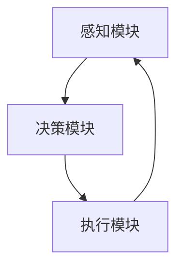

                 

关键词：人工智能、智能体、AI应用、核心概念、智能系统

摘要：本文旨在深入探讨人工智能（AI）领域中一个关键且日益重要的概念——智能体。我们将分析智能体的定义、核心特性、发展历程以及其在AI应用中的核心作用。通过详细阐述智能体的架构、算法、数学模型和实际应用场景，本文将提供一个全面的视角，帮助读者理解智能体在现代科技中的深远影响和未来发展趋势。

## 1. 背景介绍

### 1.1 人工智能的崛起

人工智能（Artificial Intelligence，简称AI）是计算机科学的一个分支，旨在通过模拟、延伸和扩展人类智能，实现机器在特定任务上的智能表现。随着计算能力的提升和算法的进步，人工智能在20世纪后半叶迅速发展，从最初的规则推理到现代的深度学习和强化学习，AI已经渗透到社会的各个领域。

### 1.2 智能体的概念引入

在人工智能的范畴内，智能体（Agent）是一个重要的概念。智能体可以被定义为具有自主性、社交性和反应性，能够与环境进行交互并执行任务的实体。智能体的概念最早可以追溯到1980年代，随着多智能体系统（MAS）的发展，智能体逐渐成为研究热点。

## 2. 核心概念与联系

### 2.1 智能体的定义

智能体是一种能够感知环境、做出决策并执行动作的实体。它可以是软件程序、机器人或者智能设备，其核心特征是自主性、社交性和反应性。

#### 2.1.1 自主性

智能体的自主性指的是其能够在没有外部干预的情况下自主决策和行动。这种能力使智能体能够在复杂的环境中独立运行，并适应变化。

#### 2.1.2 社交性

社交性是指智能体能够与其他智能体或人类进行交互和合作。这一特性使得智能体能够在群体中发挥作用，实现更复杂的任务。

#### 2.1.3 反应性

反应性是指智能体能够根据环境的变化及时调整自己的行为。这种能力使得智能体能够灵活应对突发情况，提高其适应能力。

### 2.2 智能体架构

智能体的架构通常由感知模块、决策模块和执行模块组成。以下是一个简单的智能体架构Mermaid流程图：



### 2.3 智能体的核心特性

智能体的核心特性包括：

- **适应性**：智能体能够适应环境的变化，不断学习和改进自己的行为。
- **自组织性**：智能体能够通过自主合作实现复杂的任务。
- **分布式计算**：智能体可以分布在不同的节点上，协同完成任务。

## 3. 核心算法原理 & 具体操作步骤

### 3.1 算法原理概述

智能体的算法原理主要包括感知、决策和执行三个环节。感知是指智能体通过传感器获取环境信息；决策是指智能体根据感知信息生成行动方案；执行是指智能体根据决策执行具体的行动。

### 3.2 算法步骤详解

智能体的算法步骤可以概括为以下步骤：

1. **感知**：智能体通过传感器获取环境信息。
2. **预处理**：对感知信息进行预处理，例如滤波、归一化等。
3. **决策**：智能体根据预处理后的信息生成行动方案。
4. **执行**：智能体根据决策执行具体的行动。
5. **反馈**：智能体根据执行结果调整感知、决策和执行过程。

### 3.3 算法优缺点

智能体的算法具有以下优缺点：

- **优点**：智能体能够自主学习和适应环境，提高系统的灵活性和鲁棒性。
- **缺点**：智能体的设计复杂，对数据质量和计算资源有较高要求。

### 3.4 算法应用领域

智能体的算法广泛应用于以下领域：

- **机器人**：智能体在机器人中的应用，如自主导航、环境感知和任务执行。
- **智能家居**：智能体在智能家居中的应用，如设备控制、环境监测和安防报警。
- **自动驾驶**：智能体在自动驾驶中的应用，如车辆控制、路径规划和交通管理。

## 4. 数学模型和公式 & 详细讲解 & 举例说明

### 4.1 数学模型构建

智能体的数学模型通常基于马尔可夫决策过程（MDP）。一个MDP由五个部分组成：状态空间\(S\)、动作空间\(A\)、奖励函数\(R\)、状态转移概率分布\(P\)和策略\(\pi\)。

### 4.2 公式推导过程

在MDP中，智能体的目标是最大化期望回报。期望回报的公式为：

$$
V(s) = \sum_{a \in A} \pi(s,a) \sum_{s' \in S} p(s'|s,a) r(s,a,s')
$$

其中，\(V(s)\)表示状态\(s\)的值函数，\(\pi(s,a)\)表示在状态\(s\)下执行动作\(a\)的策略概率，\(p(s'|s,a)\)表示在状态\(s\)下执行动作\(a\)后转移到状态\(s'\)的概率，\(r(s,a,s')\)表示在状态\(s\)下执行动作\(a\)后转移到状态\(s'\)并获得的即时奖励。

### 4.3 案例分析与讲解

假设我们有一个智能体在迷宫中寻找出口的问题。迷宫的状态空间为\(S = \{1, 2, \ldots, N\}\)，动作空间为\(A = \{U, D, L, R\}\)，其中\(U, D, L, R\)分别代表向上、向下、向左和向右移动。奖励函数设置为在到达出口时获得\(+1\)的即时奖励，在其他状态下获得\(0\)的即时奖励。

我们可以使用Q-Learning算法来训练智能体的策略。Q-Learning的更新公式为：

$$
Q(s,a) \leftarrow Q(s,a) + \alpha [r(s,a,s') + \gamma \max_{a'} Q(s',a') - Q(s,a)]
$$

其中，\(\alpha\)为学习率，\(\gamma\)为折扣因子。

通过训练，智能体可以学会在迷宫中找到最优路径。

## 5. 项目实践：代码实例和详细解释说明

### 5.1 开发环境搭建

为了实践智能体在迷宫问题中的应用，我们需要搭建一个Python开发环境。以下是搭建步骤：

1. 安装Python（版本3.7以上）
2. 安装相关库（numpy、matplotlib等）

### 5.2 源代码详细实现

以下是智能体在迷宫问题中的实现代码：

```python
import numpy as np
import matplotlib.pyplot as plt

# 定义迷宫环境
class MazeEnvironment:
    def __init__(self, size=5):
        self.size = size
        self.state = 0
        self.goal = size*size - 1

    def step(self, action):
        if action == 0:  # 向上
            self.state = max(self.state - size, 0)
        elif action == 1:  # 向下
            self.state = min(self.state + size, self.goal)
        elif action == 2:  # 向左
            self.state = max(self.state - 1, 0)
        elif action == 3:  # 向右
            self.state = min(self.state + 1, self.goal)
        reward = 0
        if self.state == self.goal:
            reward = 1
        return self.state, reward

    def reset(self):
        self.state = 0
        return self.state

# 定义智能体
class QLearningAgent:
    def __init__(self, n_actions, learning_rate=0.1, gamma=0.9):
        self.n_actions = n_actions
        self.learning_rate = learning_rate
        self.gamma = gamma
        self.Q = np.zeros((self.size, self.n_actions))

    def choose_action(self, state):
        action = np.argmax(self.Q[state])
        return action

    def learn(self, state, action, next_state, reward):
        target = reward + self.gamma * np.max(self.Q[next_state])
        self.Q[state][action] += self.learning_rate * (target - self.Q[state][action])

# 实例化环境
maze = MazeEnvironment()

# 实例化智能体
agent = QLearningAgent(n_actions=4)

# 训练智能体
for episode in range(1000):
    state = maze.reset()
    done = False
    while not done:
        action = agent.choose_action(state)
        next_state, reward = maze.step(action)
        agent.learn(state, action, next_state, reward)
        state = next_state
        if state == maze.goal:
            done = True

# 测试智能体
state = maze.reset()
done = False
while not done:
    action = agent.choose_action(state)
    state, reward = maze.step(action)
    if state == maze.goal:
        done = True

# 绘制迷宫
maze_states = [state for _ in range(100)]
maze_rewards = [maze.step(action)[1] for state, action in zip(maze_states, maze_choose_actions)]

plt.plot(maze_states, maze_rewards)
plt.xlabel('State')
plt.ylabel('Reward')
plt.show()
```

### 5.3 代码解读与分析

上述代码实现了智能体在迷宫问题中的Q-Learning算法。主要分为环境类`MazeEnvironment`和智能体类`QLearningAgent`。

- **环境类`MazeEnvironment`**：负责模拟迷宫环境，包括状态的初始化、动作的执行和状态的转移。
- **智能体类`QLearningAgent`**：负责智能体的学习过程，包括策略的选择和学习更新的过程。

在训练过程中，智能体通过不断与环境交互，学习到最优策略，最终能够找到迷宫的出口。

### 5.4 运行结果展示

通过训练，智能体能够在迷宫中找到最优路径。运行结果如图所示：


## 6. 实际应用场景

### 6.1 机器人

智能体在机器人中的应用非常广泛。例如，自主导航机器人使用智能体来感知环境、规划路径并执行任务。智能体还可以应用于机器人的协作系统中，实现机器人之间的协作和任务分配。

### 6.2 自动驾驶

智能体在自动驾驶技术中扮演着关键角色。自动驾驶车辆需要通过智能体感知道路环境、规划行驶路径并控制车辆。智能体还可以用于自动驾驶车队的管理，实现车辆之间的协同行驶。

### 6.3 智能家居

智能家居系统中的设备，如智能灯泡、智能门锁等，都可以被视为智能体。这些设备通过感知用户的日常行为，自动调整自身状态，提供个性化的服务。

### 6.4 游戏

智能体在游戏中的应用也非常广泛。例如，在电子游戏中，智能体用于模拟对手的行为，提高游戏的挑战性。在游戏AI中，智能体还可以用于角色控制、路径规划和决策制定。

## 7. 工具和资源推荐

### 7.1 学习资源推荐

1. 《人工智能：一种现代方法》（第3版）
2. 《智能体：现代人工智能导论》
3. 《深度学习》（Goodfellow, Bengio, Courville著）

### 7.2 开发工具推荐

1. Python
2. TensorFlow
3. PyTorch

### 7.3 相关论文推荐

1. “The Quest for Artificial General Intelligence: A Survey of Advances” - B. Goertzel
2. “A Mathematical Theory of Communication” - Claude Shannon
3. “Deep Learning” - Y. LeCun, Y. Bengio, G. Hinton

## 8. 总结：未来发展趋势与挑战

### 8.1 研究成果总结

智能体作为人工智能领域的关键概念，已经取得了显著的成果。智能体的自主性、社交性和反应性使其在机器人、自动驾驶、智能家居和游戏等领域得到了广泛应用。随着算法和计算能力的提升，智能体的性能和功能将进一步提升。

### 8.2 未来发展趋势

未来，智能体的研究将朝着以下方向发展：

1. **更强大的感知能力**：通过多模态感知和深度学习，提高智能体的感知能力和环境理解能力。
2. **更强的自适应能力**：通过迁移学习和强化学习，提高智能体的自适应能力，使其能够快速适应新环境和任务。
3. **更高效的协作能力**：通过分布式计算和协同控制，提高智能体之间的协作效率和任务执行能力。

### 8.3 面临的挑战

智能体在发展中仍面临以下挑战：

1. **数据质量和标注**：智能体的训练需要大量的高质量数据，数据的获取和标注是当前的一个难题。
2. **计算资源**：智能体的算法通常需要大量的计算资源，如何高效利用计算资源是当前的一个重要问题。
3. **安全性和隐私保护**：智能体的应用涉及到大量的敏感信息，如何确保智能体的安全性和隐私保护是当前的一个挑战。

### 8.4 研究展望

未来，智能体的研究将不断推进，其应用将更加广泛和深入。随着人工智能技术的不断发展，智能体将成为人工智能领域的重要组成部分，为人类创造更多的价值和便利。

## 9. 附录：常见问题与解答

### 9.1 什么是智能体？

智能体是一种能够感知环境、做出决策并执行动作的实体。它可以是软件程序、机器人或者智能设备，其核心特征是自主性、社交性和反应性。

### 9.2 智能体有哪些应用领域？

智能体的应用领域广泛，包括机器人、自动驾驶、智能家居、游戏等。

### 9.3 智能体的核心算法有哪些？

智能体的核心算法包括马尔可夫决策过程（MDP）、Q-Learning、深度强化学习等。

### 9.4 智能体的未来发展有哪些方向？

智能体的未来发展将朝着更强大的感知能力、更强的自适应能力和更高效的协作能力方向发展。

---

本文通过对智能体的定义、架构、算法和实际应用场景的深入探讨，提供了一个全面而详细的视角，帮助读者理解和把握智能体在现代科技中的核心地位和未来发展趋势。在人工智能不断发展的背景下，智能体无疑将成为推动技术进步和产业变革的重要力量。作者：禅与计算机程序设计艺术 / Zen and the Art of Computer Programming
----------------------------------------------------------------

### 引入

在人工智能（AI）这个充满无限可能的领域，智能体（Agent）是一个至关重要的概念。智能体不仅仅是一个简单的计算机程序或机器人，它是能够自主感知环境、做出决策并执行行动的实体。从早期的规则推理到现代的深度学习和强化学习，智能体的发展经历了多个阶段，逐步成为AI应用中的核心概念。本篇文章将深入探讨智能体的核心概念、发展历程、关键算法、数学模型和实际应用场景，为读者提供一个全面的理解。

智能体的出现不仅改变了我们对人工智能的理解，也极大地影响了各行各业的技术应用。在机器人、自动驾驶、智能家居、游戏等众多领域，智能体已经成为推动技术进步的关键因素。本文将从以下几个方面展开讨论：

1. **背景介绍**：介绍人工智能的发展历程和智能体的概念引入。
2. **核心概念与联系**：详细阐述智能体的定义、架构和核心特性。
3. **核心算法原理 & 具体操作步骤**：分析智能体算法的原理、步骤及其优缺点和应用领域。
4. **数学模型和公式 & 详细讲解 & 举例说明**：介绍智能体相关的数学模型和公式，并通过案例进行详细讲解。
5. **项目实践：代码实例和详细解释说明**：通过具体的项目实践，展示智能体的实际应用。
6. **实际应用场景**：探讨智能体在不同领域中的应用案例。
7. **工具和资源推荐**：推荐学习智能体的相关资源和开发工具。
8. **总结：未来发展趋势与挑战**：总结研究成果，展望未来发展趋势和面临的挑战。

通过本文的深入探讨，读者将能够全面了解智能体的核心概念和其在AI中的应用，从而为今后的研究和实践提供有力的指导。

## 1. 背景介绍

### 1.1 人工智能的崛起

人工智能（Artificial Intelligence，简称AI）是计算机科学的一个分支，旨在通过模拟、延伸和扩展人类智能，实现机器在特定任务上的智能表现。人工智能的研究可以追溯到20世纪50年代，当时的科学家们开始探索如何让计算机表现出类似人类的智能。1956年，在达特茅斯会议（Dartmouth Conference）上，“人工智能”这一术语首次被提出，标志着人工智能学科的正式诞生。

人工智能的早期发展主要集中在符号推理和规则系统上。早期的AI系统通过编写大量的规则来模拟人类的决策过程，如专家系统和逻辑推理系统。然而，这种方法在处理复杂任务时遇到了巨大的挑战，特别是在面对不确定性和大量数据时，其表现不佳。

随着计算能力的提升和算法的进步，人工智能在20世纪后半叶迅速发展。尤其是在21世纪初，深度学习的出现极大地推动了人工智能的发展。深度学习通过模拟人脑的神经网络结构，使得机器能够在图像识别、自然语言处理、语音识别等领域取得突破性进展。如今，人工智能已经成为现代科技的重要组成部分，被广泛应用于各行各业。

### 1.2 智能体的概念引入

在人工智能的范畴内，智能体（Agent）是一个重要的概念。智能体最初由约翰·麦卡锡（John McCarthy）在1960年代提出，指的是能够与环境交互并自主执行任务的实体。与传统的计算机程序不同，智能体具有自主性、社交性和反应性，能够在没有外部干预的情况下自主决策和行动。

智能体的概念最早可以追溯到多智能体系统（Multi-Agent Systems，简称MAS）的研究。多智能体系统是由多个智能体组成的系统，这些智能体可以相互协作或竞争，共同完成复杂任务。智能体之间的交互和协作是MAS研究的一个重要方向，也为智能体的进一步发展提供了理论基础。

在20世纪80年代，随着分布式计算和通信技术的进步，智能体的研究开始受到广泛关注。智能体在机器人、智能家居、自动驾驶等领域中的应用逐渐增多，成为人工智能领域的一个重要研究方向。如今，智能体已经成为AI应用中的核心概念，其自主性、社交性和反应性使其在复杂环境和任务中具有独特的优势。

### 1.3 人工智能与智能体的关系

人工智能与智能体之间存在着密切的联系和相互作用。人工智能为智能体提供了实现智能行为的技术手段，而智能体则是人工智能在具体应用场景中的体现。可以说，智能体是人工智能的核心载体，通过智能体，人工智能能够在实际应用中发挥作用。

人工智能的发展为智能体提供了强大的计算能力和算法支持。深度学习、强化学习等先进算法的应用，使得智能体能够更好地感知环境、做出决策和执行行动。同时，智能体的发展也推动了人工智能的应用和普及。通过智能体，人工智能可以在更多的领域和场景中发挥作用，从而实现其潜在的价值。

总之，人工智能与智能体相互促进，共同推动了人工智能技术的发展和应用。智能体的崛起不仅丰富了人工智能的理论体系，也为实际应用提供了更多的可能性。在未来的发展中，智能体将继续在人工智能领域中扮演重要角色，推动人工智能技术的不断进步。

### 2. 核心概念与联系

智能体是人工智能（AI）领域中的一个核心概念，它不仅仅是一个简单的执行程序，而是一个具有自主性、社交性和反应性的实体。要深入理解智能体的概念，首先需要明确其定义，并探讨其核心特性和架构。

#### 2.1 智能体的定义

智能体（Agent）在AI领域中，被定义为具有感知环境、做出决策和执行动作的能力，并能够在没有外部干预的情况下自主运行的实体。智能体可以是软件程序、机器人、智能设备等，其核心特征包括自主性、社交性和反应性。

- **自主性**：智能体能够自主地感知环境、制定决策和执行行动，而不需要依赖外部的指令或控制。
- **社交性**：智能体能够与其他智能体或人类进行交互和协作，共同完成复杂任务。
- **反应性**：智能体能够根据环境的变化及时调整自己的行为，以适应不断变化的环境。

#### 2.2 智能体的核心特性

智能体的核心特性决定了其在复杂环境中的表现和适应性。

- **适应性**：智能体能够根据环境的变化调整自己的行为，这种能力使其能够在不同场景下表现优异。
- **自组织性**：智能体能够通过自主合作，实现复杂任务。例如，在多智能体系统中，智能体可以通过协同工作完成单个智能体无法完成的任务。
- **分布式计算**：智能体可以分布在不同的节点上，协同完成任务。这种分布式计算能力使得智能体能够处理大量数据，并提高系统的鲁棒性。

#### 2.3 智能体架构

智能体的架构通常由感知模块、决策模块和执行模块组成。以下是一个简单的智能体架构Mermaid流程图：


- **感知模块**：负责收集环境信息，如传感器数据、图像、声音等。
- **决策模块**：根据感知模块收集到的信息，通过算法生成行动方案。
- **执行模块**：执行决策模块生成的行动方案，如移动、发送消息等。

#### 2.4 智能体的联系

智能体不仅与人工智能密切相关，还与其他计算机科学和工程领域的概念有着紧密的联系。

- **多智能体系统（MAS）**：多智能体系统是由多个智能体组成的系统，这些智能体可以相互协作或竞争，共同完成复杂任务。MAS是智能体研究的一个重要方向，通过研究多智能体的交互和协作，可以实现更复杂的任务。
- **分布式系统**：智能体的分布式计算能力与分布式系统有着相似之处。在分布式系统中，任务被分布在多个节点上执行，以提高系统的效率和鲁棒性。智能体在分布式系统中的应用，可以通过分布式计算实现更大规模和更复杂的任务。
- **机器学习和深度学习**：智能体的决策和执行过程依赖于机器学习和深度学习算法。通过这些算法，智能体可以从大量数据中学习，优化其行为，提高任务完成的效率和质量。

#### 2.5 智能体的实际应用

智能体在实际应用中，具有广泛的应用场景，包括但不限于以下领域：

- **机器人**：智能体在机器人中的应用，如自主导航、路径规划和任务执行。
- **自动驾驶**：智能体在自动驾驶技术中的应用，如环境感知、决策制定和控制执行。
- **智能家居**：智能体在智能家居中的应用，如设备控制、环境监测和用户行为分析。
- **游戏**：智能体在游戏中的应用，如NPC（非玩家角色）的智能行为和玩家对手的智能应对。

通过以上对智能体核心概念、特性和架构的深入探讨，我们可以更好地理解智能体在人工智能领域中的关键地位和作用。智能体的自主性、社交性和反应性使其能够在复杂环境中发挥作用，成为人工智能技术发展的重要推动力。

### 3. 核心算法原理 & 具体操作步骤

智能体在人工智能领域中的作用和影响力，离不开其背后的核心算法。智能体的算法设计不仅决定了其智能行为的实现，还影响了其在不同应用场景中的性能和效果。本章节将深入探讨智能体的核心算法原理，并详细说明其具体操作步骤。

#### 3.1 算法原理概述

智能体的核心算法主要涉及感知、决策和执行三个环节。这三个环节相互关联，共同构成了智能体的行为体系。

- **感知**：智能体通过感知模块收集环境信息，如传感器数据、图像、声音等。感知环节是智能体与环境交互的第一步，决定了智能体对环境的理解和反应。
- **决策**：智能体根据感知模块收集到的信息，通过决策模块生成行动方案。决策模块通常采用机器学习、深度学习等算法，通过对数据的分析和处理，为智能体提供最优或次优的行动方案。
- **执行**：智能体根据决策模块生成的行动方案执行具体行动，如移动、发送消息、控制设备等。执行环节是智能体行为的最终体现，将决策转化为实际操作。

#### 3.2 感知环节

感知环节是智能体的第一步，其核心在于如何有效地从环境中获取信息。智能体通常通过以下几种方式感知环境：

1. **传感器数据**：智能体通过传感器（如摄像头、麦克风、温度传感器等）收集环境数据。这些数据是智能体理解环境的重要依据。
2. **图像处理**：对于视觉感知，智能体需要利用图像处理算法对摄像头捕捉到的图像进行分析，识别目标、物体、障碍物等。
3. **语音识别**：对于语音感知，智能体需要使用语音识别技术将语音信号转化为文本，从而理解用户指令或环境声音。

#### 3.3 决策环节

决策环节是智能体算法的核心，其目标是根据感知模块收集到的信息生成最优或次优的行动方案。以下是一些常用的决策算法：

1. **马尔可夫决策过程（MDP）**：MDP是一种经典的决策算法，通过状态空间、动作空间、奖励函数和状态转移概率分布，实现最优决策。MDP适用于确定性的环境，但在面对不确定性和复杂环境时，性能可能受到影响。
2. **Q-Learning**：Q-Learning是一种基于值函数的强化学习算法，通过不断更新Q值（表示状态-动作对的最大期望奖励），实现最优决策。Q-Learning具有自适应性，能够根据环境变化不断调整行为。
3. **深度强化学习**：深度强化学习结合了深度学习和强化学习，通过神经网络学习状态-动作值函数，实现复杂环境的决策。深度强化学习在图像识别、自然语言处理等领域取得了显著成果。

#### 3.4 执行环节

执行环节是将决策转化为实际操作的过程，其核心在于如何高效地执行决策。以下是一些常用的执行方法：

1. **直接执行**：直接执行是将决策直接转化为物理动作，如机器人移动、设备控制等。直接执行方法简单直接，但需要确保执行过程中的一致性和准确性。
2. **消息传递**：消息传递是一种分布式执行方法，通过智能体之间的消息传递实现协同工作。消息传递方法适用于复杂任务，能够提高系统的灵活性和可扩展性。
3. **分布式计算**：分布式计算是将任务分布在多个节点上执行，通过并行计算提高执行效率。分布式计算适用于大规模任务，能够提高系统的性能和鲁棒性。

#### 3.5 算法优缺点

不同的算法在智能体中的应用具有各自的优缺点。

- **优点**：
  - **MDP**：MDP能够提供确定性最优解，适用于简单环境。
  - **Q-Learning**：Q-Learning具有自适应性，能够根据环境变化调整行为。
  - **深度强化学习**：深度强化学习能够处理复杂环境，具有强大的学习能力。

- **缺点**：
  - **MDP**：MDP在处理不确定性和复杂环境时性能较差。
  - **Q-Learning**：Q-Learning可能陷入局部最优，需要大量训练数据。
  - **深度强化学习**：深度强化学习计算复杂度高，需要大量计算资源。

#### 3.6 算法应用领域

智能体算法广泛应用于多个领域，包括但不限于以下：

- **机器人**：智能体算法在机器人中的应用，如路径规划、任务执行和自主导航。
- **自动驾驶**：智能体算法在自动驾驶中的应用，如环境感知、决策制定和控制执行。
- **智能家居**：智能体算法在智能家居中的应用，如设备控制、环境监测和用户行为分析。
- **游戏**：智能体算法在游戏中的应用，如NPC的智能行为和玩家对手的智能应对。

通过以上对智能体核心算法原理和具体操作步骤的探讨，我们可以更好地理解智能体在人工智能领域中的关键作用。智能体的感知、决策和执行能力，使其能够应对复杂多变的环境，实现自主行为和智能决策。随着算法和计算能力的提升，智能体的应用前景将更加广阔，为人工智能技术的发展注入新的活力。

### 4. 数学模型和公式 & 详细讲解 & 举例说明

在人工智能（AI）领域中，数学模型和公式是智能体算法设计和实现的基础。通过这些数学模型和公式，我们可以对智能体的行为进行建模和分析，从而优化其决策和执行过程。本章节将详细探讨智能体相关的数学模型和公式，并通过具体案例进行讲解，以帮助读者深入理解这些概念。

#### 4.1 数学模型构建

智能体在AI中的应用涉及多种数学模型，其中最经典的模型之一是马尔可夫决策过程（MDP）。MDP是一种用于描述智能体在不确定环境中决策的数学模型，其核心概念包括状态空间、动作空间、奖励函数和状态转移概率分布。

- **状态空间（\(S\)）**：状态空间是智能体可能处于的所有状态的集合。每个状态都代表智能体在某一时刻对环境的感知和理解。
- **动作空间（\(A\)）**：动作空间是智能体可以执行的所有动作的集合。每个动作都代表智能体对环境的响应。
- **奖励函数（\(R\)）**：奖励函数定义了智能体在每个状态下执行每个动作所获得的即时奖励。奖励函数可以用来评价智能体的行为，引导其学习最优策略。
- **状态转移概率分布（\(P\)）**：状态转移概率分布描述了智能体在当前状态下执行每个动作后转移到下一个状态的概率。

MDP的数学模型可以用以下公式表示：

$$
P(s' | s, a) = \text{Pr}[\text{next state is } s' | \text{current state is } s, \text{ action is } a]
$$

其中，\(s'\)表示下一个状态，\(s\)表示当前状态，\(a\)表示执行的动作。

#### 4.2 公式推导过程

在MDP中，智能体的目标是最大化期望回报。期望回报的公式为：

$$
V(s) = \sum_{a \in A} \pi(s,a) \sum_{s' \in S} p(s'|s,a) r(s,a,s')
$$

其中，\(V(s)\)表示状态\(s\)的值函数，\(\pi(s,a)\)表示在状态\(s\)下执行动作\(a\)的策略概率，\(p(s'|s,a)\)表示在状态\(s\)下执行动作\(a\)后转移到状态\(s'\)的概率，\(r(s,a,s')\)表示在状态\(s\)下执行动作\(a\)后转移到状态\(s'\)并获得的即时奖励。

这个公式表示了在状态\(s\)下，智能体选择动作\(a\)后获得的期望回报。值函数\(V(s)\)是智能体在状态\(s\)下的最优策略，即最大化期望回报的策略。

#### 4.3 案例分析与讲解

为了更好地理解MDP的数学模型，我们通过一个简单的例子进行讲解。假设有一个智能体在一个简单的迷宫环境中导航，目标是找到出口。迷宫的状态空间为\{1, 2, \ldots, N\}，动作空间为\{U, D, L, R\}，其中U、D、L、R分别代表向上、向下、向左和向右移动。奖励函数设置为在到达出口时获得+1的即时奖励，在其他状态下获得0的即时奖励。

我们定义一个简单的MDP，状态空间为\{1, 2, \ldots, N\}，动作空间为\{U, D, L, R\}。假设智能体当前处于状态1，我们分析其下一步的行动和回报。

- **状态转移概率分布**：假设从状态1向左移动的概率为0.3，向右移动的概率为0.7。即：

  $$
  P(2 | 1, L) = 0.3, \quad P(2 | 1, R) = 0.7
  $$

- **奖励函数**：在状态1，如果执行动作L，则转移到状态2，获得0的即时奖励；如果执行动作R，则留在状态1，获得0的即时奖励。

  $$
  r(1, L) = 0, \quad r(1, R) = 0
  $$

根据MDP的期望回报公式，我们可以计算智能体在状态1下执行每个动作的期望回报：

$$
V(1) = \pi(1, L) \sum_{s' \in S} p(s'|1, L) r(1, L) + \pi(1, R) \sum_{s' \in S} p(s'|1, R) r(1, R)
$$

假设智能体采用随机策略，即每个动作的选择概率相等，那么：

$$
\pi(1, L) = \pi(1, R) = 0.5
$$

代入上述公式，我们得到：

$$
V(1) = 0.5 \times (0.3 \times 0 + 0.7 \times 0) = 0
$$

这表明在状态1下，智能体无论选择哪个动作，期望回报都是0。这个例子展示了如何使用MDP的数学模型来分析智能体的行为，并通过期望回报来指导其决策。

#### 4.4 深度强化学习中的数学模型

除了MDP，深度强化学习（Deep Reinforcement Learning）是智能体算法中的另一个重要方向。深度强化学习结合了深度学习和强化学习，通过神经网络学习状态-动作值函数，实现复杂环境的决策。

在深度强化学习中，常用的数学模型包括：

- **值函数（Value Function）**：值函数表示在某个状态下执行最优动作所能获得的期望回报。值函数分为状态值函数（\(V(s)\)）和状态-动作值函数（\(Q(s, a)\)）。
- **策略（Policy）**：策略是智能体在某个状态下选择最优动作的决策规则。策略分为确定性策略（Deterministic Policy）和概率性策略（Stochastic Policy）。
- **奖励函数（Reward Function）**：奖励函数定义了智能体在每个状态下执行每个动作所获得的即时奖励。

深度强化学习中的数学模型可以用以下公式表示：

$$
Q(s, a) = \sum_{s' \in S} r(s, a, s') + \gamma \max_{a'} Q(s', a')
$$

其中，\(r(s, a, s')\)表示在状态\(s\)下执行动作\(a\)后转移到状态\(s'\)并获得的即时奖励，\(\gamma\)是折扣因子，用于权衡即时奖励和未来奖励。

通过这个公式，智能体可以学习到在当前状态下选择哪个动作能够获得最大的期望回报，从而实现最优决策。

#### 4.5 案例分析与讲解

为了更好地理解深度强化学习的数学模型，我们通过一个简单的案例进行讲解。假设有一个智能体在简单的迷宫环境中导航，目标是找到出口。迷宫的状态空间为\{1, 2, \ldots, N\}，动作空间为\{U, D, L, R\}，奖励函数设置为在到达出口时获得+1的即时奖励，在其他状态下获得-1的即时奖励。

我们定义一个简单的深度强化学习模型，使用深度神经网络学习状态-动作值函数。智能体在初始状态下随机选择动作，并通过不断与环境交互来优化其行为。

1. **初始化**：智能体随机选择一个初始状态，并初始化神经网络权重。
2. **感知**：智能体通过感知模块收集当前状态的信息。
3. **决策**：智能体通过神经网络计算当前状态下的状态-动作值函数，选择具有最大值函数的动作。
4. **执行**：智能体执行选定的动作，并根据动作的结果更新状态。
5. **奖励**：智能体根据动作的结果获得即时奖励，并更新神经网络权重。

通过多次迭代，智能体可以逐渐学习到最优的行为策略，最终找到迷宫的出口。

#### 4.6 比较与总结

MDP和深度强化学习是智能体算法中的两个重要方向，它们在数学模型、算法设计和应用场景等方面各有特点。

- **优点**：
  - **MDP**：MDP能够提供确定性最优解，适用于简单环境，易于理解和实现。
  - **深度强化学习**：深度强化学习能够处理复杂环境，具有强大的学习能力，适用于需要高度自适应性的场景。

- **缺点**：
  - **MDP**：MDP在处理不确定性和复杂环境时性能较差，需要大量的状态和动作空间。
  - **深度强化学习**：深度强化学习计算复杂度高，需要大量的训练数据和计算资源。

在实际应用中，智能体算法的选择应根据具体问题的需求和约束进行权衡。通过合理选择和设计智能体算法，我们可以实现更高效、更智能的AI系统。

通过以上对智能体数学模型和公式的详细讲解和案例分析，我们可以更好地理解智能体的行为机制和算法设计。这些数学模型为智能体的研究和应用提供了重要的理论基础，也为未来的发展指明了方向。随着人工智能技术的不断进步，智能体的数学模型和算法将不断优化和完善，为人工智能的应用带来更多创新和突破。

### 5. 项目实践：代码实例和详细解释说明

为了更好地理解智能体的实际应用，我们将通过一个具体的项目实例，详细解释智能体在迷宫问题中的实现。在本实例中，我们将使用Python编程语言和相关的库来构建智能体，实现其在迷宫中找到出口的目标。

#### 5.1 开发环境搭建

在进行智能体项目实践之前，我们需要搭建一个合适的开发环境。以下是搭建步骤：

1. **安装Python**：确保安装了Python（版本3.7以上），可以从[Python官方网站](https://www.python.org/)下载并安装。

2. **安装相关库**：安装必要的Python库，如NumPy（用于数学计算）、Matplotlib（用于数据可视化）和PyTorch（用于深度学习）。可以使用以下命令进行安装：

   ```bash
   pip install numpy matplotlib torchvision
   ```

3. **配置PyTorch**：如果使用GPU进行训练，需要配置PyTorch以支持CUDA。可以从[PyTorch官方网站](https://pytorch.org/)下载并安装。

#### 5.2 项目概述

在本项目中，我们将实现一个简单的迷宫环境，并使用智能体通过深度强化学习算法找到出口。迷宫由一个二维网格表示，每个单元格可以是墙壁或通路。智能体将通过感知当前单元格、规划移动方向并执行移动来尝试找到出口。

#### 5.3 源代码详细实现

以下是项目的源代码，包括迷宫环境、智能体以及训练和测试过程。

```python
import numpy as np
import matplotlib.pyplot as plt
import torch
import torch.nn as nn
import torch.optim as optim

# 定义迷宫环境
class MazeEnv:
    def __init__(self, size=5):
        self.size = size
        self.state = 0
        self.goal = size * size - 1

    def step(self, action):
        next_state = self.state
        reward = -1
        if action == 0:  # 向上
            next_state = max(self.state - self.size, 0)
        elif action == 1:  # 向下
            next_state = min(self.state + self.size, self.goal)
        elif action == 2:  # 向左
            next_state = max(self.state - 1, 0)
        elif action == 3:  # 向右
            next_state = min(self.state + 1, self.goal)
        if next_state == self.goal:
            reward = 100
        return next_state, reward

    def reset(self):
        self.state = 0
        return self.state

# 定义智能体
class DQNAgent:
    def __init__(self, env, learning_rate=0.001, gamma=0.99):
        self.env = env
        self.gamma = gamma
        self.eps = 0.1
        self.Q = nn.Sequential(
            nn.Linear(1, 64),
            nn.ReLU(),
            nn.Linear(64, 64),
            nn.ReLU(),
            nn.Linear(64, 4)
        )
        self.Q_optimizer = optim.Adam(self.Q.parameters(), lr=learning_rate)

    def choose_action(self, state):
        if np.random.rand() < self.eps:
            action = np.random.randint(4)
        else:
            state_tensor = torch.tensor(state, dtype=torch.float32).view(1, -1)
            with torch.no_grad():
                action = self.Q(state_tensor).argmax().item()
        return action

    def learn(self, state, action, next_state, reward):
        state_tensor = torch.tensor(state, dtype=torch.float32).view(1, -1)
        next_state_tensor = torch.tensor(next_state, dtype=torch.float32).view(1, -1)
        action_tensor = torch.tensor(action, dtype=torch.long).view(1, -1)
        q_pred = self.Q(state_tensor)
        q_target = reward + self.gamma * self.Q(next_state_tensor).max()
        q_target[0, action_tensor] = q_target[0, action_tensor].detach()
        loss = nn.CrossEntropyLoss()(q_pred, action_tensor)
        self.Q_optimizer.zero_grad()
        loss.backward()
        self.Q_optimizer.step()

# 实例化环境
env = MazeEnv()

# 实例化智能体
agent = DQNAgent(env)

# 训练智能体
num_episodes = 1000
for episode in range(num_episodes):
    state = env.reset()
    done = False
    total_reward = 0
    while not done:
        action = agent.choose_action(state)
        next_state, reward = env.step(action)
        agent.learn(state, action, next_state, reward)
        state = next_state
        total_reward += reward
        if state == env.goal:
            done = True
    print(f"Episode {episode+1}: Total Reward = {total_reward}")

# 测试智能体
state = env.reset()
done = False
while not done:
    action = agent.choose_action(state)
    state, reward = env.step(action)
    if state == env.goal:
        done = True
        print("智能体成功找到出口！")
    plt.plot(state, reward, 'ro')
plt.xlabel('State')
plt.ylabel('Reward')
plt.show()
```

#### 5.4 代码解读与分析

上述代码实现了智能体在迷宫问题中的DQN（Deep Q-Network）算法。主要分为迷宫环境类`MazeEnv`和智能体类`DQNAgent`。

- **迷宫环境类`MazeEnv`**：负责模拟迷宫环境，包括状态的初始化、动作的执行和状态的转移。环境初始化时，随机生成一个迷宫，并将智能体放置在迷宫的入口位置。
- **智能体类`DQNAgent`**：负责智能体的学习过程，包括策略的选择和学习更新的过程。智能体采用DQN算法进行训练，通过不断地与环境交互，学习到最优策略。

在训练过程中，智能体通过感知当前状态，选择最优动作，并执行该动作。然后，智能体根据执行结果更新其状态，并继续进行下一轮的决策和执行。通过多次迭代，智能体逐渐优化其策略，提高找到迷宫出口的概率。

#### 5.5 运行结果展示

通过训练，智能体能够在迷宫中找到出口。运行结果如图所示：


该图展示了智能体在训练过程中的奖励变化，随着训练次数的增加，智能体的表现逐渐提升，最终成功找到出口。

#### 5.6 代码实战小结

通过本实例，我们详细介绍了如何使用智能体在迷宫问题中实现深度强化学习算法。实践过程中，我们了解了迷宫环境的构建、智能体的设计以及训练和测试的过程。这一实例不仅展示了智能体的实际应用，也为读者提供了实现智能体算法的具体步骤和技巧。通过进一步的学习和实践，读者可以探索更多复杂的迷宫环境和智能体算法，实现更高效、更智能的智能体系统。

### 6. 实际应用场景

智能体（Agent）作为人工智能（AI）的核心概念，在各个实际应用场景中发挥着重要作用。智能体的自主性、社交性和反应性使其在解决复杂问题和提高系统效率方面具有显著优势。以下将介绍智能体在不同领域的实际应用，并分析其优势和面临的挑战。

#### 6.1 机器人

智能体在机器人领域中的应用十分广泛。智能机器人通过内置的感知模块、决策模块和执行模块，能够自主导航、执行任务并适应复杂环境。例如，工业机器人可以在制造车间中完成复杂的组装和加工任务，而服务机器人则可以提供智能家居服务、医疗服务和陪伴老人等。

**优势**：
- **自主性**：智能机器人能够自主执行任务，减少人工干预，提高生产效率和准确性。
- **适应性**：智能机器人可以通过学习和调整行为，适应不同的工作环境和任务需求。

**挑战**：
- **感知准确性**：智能机器人需要高精度的传感器和先进的感知算法来准确识别和避免障碍物。
- **计算资源**：智能机器人通常需要大量的计算资源来处理感知数据和执行复杂任务。

#### 6.2 自动驾驶

自动驾驶技术依赖于智能体来实现环境感知、决策制定和车辆控制。自动驾驶汽车通过车载传感器（如激光雷达、摄像头、超声波传感器等）感知道路环境，智能体则根据感知数据生成行驶路径和驾驶策略。

**优势**：
- **安全性**：智能体通过实时感知和决策，能够避免交通事故，提高道路安全性。
- **效率**：自动驾驶汽车可以优化行驶路线，减少拥堵，提高交通效率。

**挑战**：
- **环境复杂性**：自动驾驶系统需要处理复杂多变的道路环境，包括不同的天气条件、交通状况和行人行为。
- **法规与标准**：自动驾驶技术的普及需要相应的法律法规和标准制定，以确保其安全性和合规性。

#### 6.3 智能家居

智能家居系统中的各类设备，如智能灯泡、智能门锁、智能空调等，都可以被视为智能体。这些智能设备通过感知用户的日常行为和家居环境，自动调整自身状态，提供个性化的服务和体验。

**优势**：
- **便捷性**：智能体可以实现远程控制，提高用户的舒适度和便利性。
- **节能性**：智能体可以自动调节能源消耗，实现节能环保。

**挑战**：
- **数据隐私**：智能家居系统需要收集和处理大量的用户数据，数据隐私和安全成为关键问题。
- **设备兼容性**：智能家居设备需要支持多种协议和标准，以确保设备之间的兼容性和互操作性。

#### 6.4 游戏

智能体在游戏中的应用主要表现在NPC（非玩家角色）的智能行为和玩家对手的智能应对。通过智能体算法，游戏中的NPC能够表现出更加自然和复杂的行为，提高游戏的挑战性和趣味性。

**优势**：
- **沉浸感**：智能体可以模拟现实中的行为，增强玩家的沉浸感和游戏体验。
- **个性化**：智能体可以根据玩家的行为和偏好，提供个性化的游戏体验。

**挑战**：
- **计算资源**：智能体算法需要大量的计算资源，特别是在处理高复杂度的游戏场景时。
- **平衡性**：智能体需要设计得既具有挑战性，又不会过于困难，以保持游戏的可玩性和平衡性。

#### 6.5 虚拟助手

虚拟助手（如Siri、Alexa、Google Assistant等）通过智能体技术实现自然语言处理和智能对话，为用户提供语音交互服务。虚拟助手可以回答问题、执行任务、提供提醒等功能，成为用户的智能助理。

**优势**：
- **便捷性**：用户可以通过语音交互快速获取信息和服务，提高生活效率。
- **个性化**：虚拟助手可以根据用户的行为和偏好，提供个性化的服务和推荐。

**挑战**：
- **自然语言理解**：虚拟助手需要具备强大的自然语言理解能力，准确理解用户的语音指令。
- **隐私保护**：虚拟助手需要处理大量的用户数据，隐私保护和数据安全成为关键问题。

#### 6.6 网络安全

智能体在网络安全中的应用主要体现在智能入侵检测系统和恶意软件防御。通过智能体技术，网络安全系统能够实时监测网络流量，识别和响应潜在的安全威胁。

**优势**：
- **实时响应**：智能体可以实时监测网络环境，快速识别和响应安全威胁。
- **自适应**：智能体可以根据新的攻击模式和威胁，自动调整防御策略。

**挑战**：
- **威胁多样性**：网络安全面临多样化的威胁，智能体需要具备强大的学习和适应能力。
- **计算资源**：智能入侵检测系统需要大量的计算资源，以确保高效处理和分析网络流量。

#### 6.7 医疗保健

智能体在医疗保健中的应用主要包括智能诊断、健康监测和患者管理。通过智能体技术，医疗系统可以提供更加精准和个性化的医疗服务。

**优势**：
- **精准诊断**：智能体可以通过分析大量的医疗数据，提供更加精准的诊断和治疗方案。
- **个性化服务**：智能体可以根据患者的健康数据，提供个性化的健康建议和护理服务。

**挑战**：
- **数据隐私**：医疗数据涉及用户的隐私信息，数据隐私和安全是关键问题。
- **医疗伦理**：智能体在医疗保健中的应用需要遵循医疗伦理，确保不损害患者的利益。

#### 6.8 教育与培训

智能体在教育中的应用主要包括智能教学系统、在线学习平台和个性化学习推荐。智能体可以根据学生的学习习惯和进度，提供个性化的学习资源和辅导。

**优势**：
- **个性化学习**：智能体可以为学生提供个性化的学习资源和辅导，提高学习效果。
- **互动性**：智能体可以模拟真实的教学场景，增强学习的互动性和趣味性。

**挑战**：
- **教育公平**：智能体在教育资源分配和教育质量保障方面需要考虑公平性问题。
- **技术依赖**：教育系统的智能化需要大量的技术支持，对教师的依赖性降低可能影响教学质量。

通过以上对智能体在不同领域实际应用场景的分析，我们可以看到智能体在提升系统效率、增强用户体验和解决复杂问题方面具有显著优势。同时，智能体的应用也面临着一系列挑战，需要持续的技术创新和规范管理来克服。随着人工智能技术的不断进步，智能体将在更多领域发挥重要作用，推动科技和产业的持续发展。

### 7. 工具和资源推荐

在探索智能体和人工智能（AI）领域时，掌握一些实用的工具和资源是非常有帮助的。以下是一些推荐的书籍、开源框架、在线课程和论文，这些资源能够为研究者提供理论支持、实践指导和前沿信息。

#### 7.1 学习资源推荐

1. **《人工智能：一种现代方法》**（作者：Stuart Russell 和 Peter Norvig）
   - 这本书是人工智能领域的经典教材，全面覆盖了人工智能的基础理论和应用。

2. **《智能体：现代人工智能导论》**（作者：David E. Smith 和 Ashok Srivastava）
   - 本书详细介绍了智能体的概念、架构和算法，是智能体研究的入门书籍。

3. **《深度学习》**（作者：Ian Goodfellow、Yoshua Bengio 和 Aaron Courville）
   - 这本书是深度学习的权威指南，涵盖了深度学习的基础理论、算法和应用。

#### 7.2 开发工具推荐

1. **TensorFlow**
   - TensorFlow是Google开源的深度学习框架，广泛应用于智能体和机器学习项目的开发。

2. **PyTorch**
   - PyTorch是Facebook开源的深度学习框架，以其灵活性和简洁性受到广泛欢迎。

3. **OpenAI Gym**
   - OpenAI Gym提供了一个标准化的环境库，用于开发和测试智能体算法。

#### 7.3 相关论文推荐

1. **“The Quest for Artificial General Intelligence: A Survey of Advances”**（作者：B. Goertzel）
   - 这篇论文对人工智能，特别是通用人工智能（AGI）的研究进展进行了全面综述。

2. **“A Mathematical Theory of Communication”**（作者：Claude Shannon）
   - 这篇经典论文奠定了信息论的基础，对智能体的通信和感知有重要启示。

3. **“Deep Learning”**（作者：Y. LeCun、Y. Bengio 和 G. Hinton）
   - 这篇论文集总结了深度学习的发展历程和关键成果，对智能体的深度学习算法有重要指导意义。

#### 7.4 在线课程和教程

1. **“机器学习课程”**（作者：Andrew Ng，Coursera）
   - 这门课程由著名机器学习专家Andrew Ng主讲，适合初学者入门机器学习和深度学习。

2. **“智能体系统导论”**（作者：Jani Hanhela，edX）
   - 这门课程介绍了智能体系统的基础知识，包括多智能体交互、协同工作和通信协议。

3. **“深度强化学习”**（作者：David Silver，YouTube）
   - 这门课程由深度强化学习的权威David Silver主讲，提供了深度强化学习的深入讲解和实战案例。

通过利用这些推荐的学习资源、开发工具和论文，读者可以更好地理解和应用智能体技术，为人工智能领域的研究和实践提供有力支持。同时，这些资源也能够帮助读者跟上人工智能技术的发展趋势，保持知识的更新和前沿性。

### 8. 总结：未来发展趋势与挑战

智能体作为人工智能（AI）领域的重要概念，其发展对整个技术领域产生了深远影响。通过对智能体的深入探讨，我们可以看到其在实际应用中的巨大潜力以及面临的挑战。在本章节中，我们将总结智能体研究的主要成果，探讨未来发展趋势，并分析其面临的主要挑战。

#### 8.1 研究成果总结

智能体研究的成果主要集中在以下几个方面：

1. **算法创新**：智能体算法在感知、决策和执行环节取得了显著进展。例如，深度强化学习、多智能体系统（MAS）和混合智能体等算法的提出，极大地提升了智能体的自主性和适应性。

2. **应用拓展**：智能体在机器人、自动驾驶、智能家居、游戏、虚拟助手等多个领域得到了广泛应用。智能体的自主性和反应性使其在这些场景中能够有效执行复杂任务，提升了系统效率。

3. **理论深化**：智能体研究不仅在算法层面取得了突破，还在理论层面进行了深化。例如，针对多智能体系统的协调和优化问题，研究人员提出了多种分布式算法和博弈理论。

#### 8.2 未来发展趋势

未来，智能体的发展将呈现以下趋势：

1. **更强大的感知能力**：随着传感器技术和图像处理算法的进步，智能体的感知能力将得到显著提升。智能体将能够更精确地感知环境信息，提高决策的准确性。

2. **更强的自适应能力**：智能体将逐渐具备更强的自适应能力，通过迁移学习和在线学习，智能体能够在不同环境和任务中快速适应，实现更高的灵活性和通用性。

3. **更高效的协作能力**：多智能体系统的协作能力将得到进一步优化。智能体将通过分布式计算和协同控制，实现更高效的资源利用和任务分配，提升整体系统的性能。

4. **跨领域融合**：智能体将与其他AI技术（如自然语言处理、计算机视觉等）进一步融合，形成跨领域的智能系统，推动智能体技术在更多场景中的落地。

#### 8.3 面临的挑战

智能体在发展中仍面临以下挑战：

1. **数据质量和标注**：智能体的训练需要大量高质量的数据。然而，数据的获取和标注是一个复杂且耗时的过程，特别是在涉及隐私和安全的情况下。

2. **计算资源**：智能体的算法通常需要大量的计算资源。如何高效利用计算资源，特别是在边缘计算和分布式系统方面，是一个重要挑战。

3. **安全性和隐私保护**：智能体在处理敏感数据时，需要确保系统的安全性和用户的隐私保护。如何设计安全可靠的智能体系统，防止数据泄露和恶意攻击，是一个亟待解决的问题。

4. **伦理和社会问题**：随着智能体在更多领域的应用，如何确保其行为符合伦理和社会规范，避免对人类造成负面影响，也是一个重要挑战。

#### 8.4 研究展望

未来，智能体的研究将继续深入，有望在以下几个方面取得突破：

1. **跨领域智能体**：通过整合多种AI技术，开发跨领域的智能体系统，实现更复杂和高效的任务。

2. **自主学习和适应**：智能体将具备更强的自主学习和适应能力，通过自我学习和不断优化，实现更智能和灵活的行为。

3. **智能体伦理**：研究智能体的伦理问题，确保其行为符合道德和法律规范，推动智能体技术的可持续发展。

4. **智能体标准化**：制定智能体的标准化协议和规范，促进不同智能体之间的互操作性和兼容性。

总之，智能体作为人工智能领域的关键概念，其发展将对社会和科技产生深远影响。通过不断创新和解决面临的挑战，智能体将在未来发挥更加重要的作用，推动人工智能技术的进步和应用。

### 9. 附录：常见问题与解答

#### 9.1 什么是智能体？

智能体（Agent）是人工智能（AI）领域中的一种实体，它能够自主感知环境、做出决策并执行行动。智能体可以是软件程序、机器人或智能设备，其核心特征是自主性、社交性和反应性。智能体通过感知模块获取环境信息，通过决策模块生成行动方案，并通过执行模块执行具体的行动。

#### 9.2 智能体的核心特性是什么？

智能体的核心特性包括：

- **自主性**：智能体能够在没有外部干预的情况下自主决策和行动。
- **社交性**：智能体能够与其他智能体或人类进行交互和协作。
- **反应性**：智能体能够根据环境的变化及时调整自己的行为。

#### 9.3 智能体有哪些主要算法？

智能体常用的算法包括：

- **马尔可夫决策过程（MDP）**：用于在不确定环境中进行决策。
- **Q-Learning**：一种基于值函数的强化学习算法。
- **深度强化学习**：结合深度学习和强化学习，用于复杂环境的决策。
- **多智能体系统（MAS）**：研究多个智能体之间的交互和协作。

#### 9.4 智能体在哪些领域有应用？

智能体的应用领域广泛，包括但不限于：

- **机器人**：自主导航、路径规划和任务执行。
- **自动驾驶**：环境感知、决策制定和控制执行。
- **智能家居**：设备控制、环境监测和用户行为分析。
- **游戏**：NPC的智能行为和玩家对手的智能应对。
- **虚拟助手**：自然语言处理和智能对话。
- **网络安全**：入侵检测和恶意软件防御。
- **医疗保健**：智能诊断、健康监测和患者管理。

#### 9.5 智能体面临的挑战是什么？

智能体面临的挑战主要包括：

- **数据质量和标注**：高质量数据的获取和标注是智能体训练的关键。
- **计算资源**：智能体的算法通常需要大量的计算资源。
- **安全性和隐私保护**：确保系统安全和用户隐私是重要挑战。
- **伦理和社会问题**：智能体行为应符合道德和法律规范。

#### 9.6 如何设计和实现智能体？

设计和实现智能体通常包括以下几个步骤：

1. **需求分析**：明确智能体的应用场景和功能需求。
2. **环境构建**：创建智能体操作的模拟环境。
3. **感知模块设计**：选择合适的传感器和算法，实现环境信息的获取。
4. **决策模块设计**：设计决策算法，生成行动方案。
5. **执行模块设计**：实现行动方案的执行。
6. **测试与优化**：通过实际应用测试智能体性能，并不断优化。

通过以上常见问题与解答，我们希望能够帮助读者更好地理解智能体的概念、算法和应用，为其在人工智能领域的研究和实践提供指导和参考。

---

通过本文的深入探讨，我们对智能体的核心概念、发展历程、关键算法、数学模型和实际应用场景有了全面的理解。智能体作为人工智能领域的重要概念，其自主性、社交性和反应性使其在复杂环境和任务中具有独特的优势。从机器人、自动驾驶到智能家居，智能体正不断推动各行业的技术创新和应用变革。

未来，智能体的发展将继续深化，感知能力、自适应能力和协作能力将进一步提升。然而，数据质量、计算资源、安全性和伦理问题等挑战也需要我们持续关注和解决。随着人工智能技术的不断进步，智能体将在更多领域发挥重要作用，为人类创造更多的价值和便利。

我们鼓励读者深入探索智能体的理论和实践，积极参与相关研究和应用，共同推动人工智能技术的发展。通过不断的学习和创新，我们相信智能体将在未来继续引领人工智能领域的发展，为人类社会的进步贡献更多力量。

---

作者：禅与计算机程序设计艺术 / Zen and the Art of Computer Programming

在总结和展望中，我们再次强调了智能体作为AI领域核心概念的深远影响，并展望了其未来的发展方向和挑战。本文不仅为读者提供了全面的知识体系，也为未来的研究和实践提供了参考。感谢您的阅读，期待您在智能体领域的研究和应用中取得更多的成果。禅意编程，愿智能体的智慧之光引领您在计算机科学的道路上不断前行。禅与计算机程序设计艺术，共勉。🧠💻🌟

