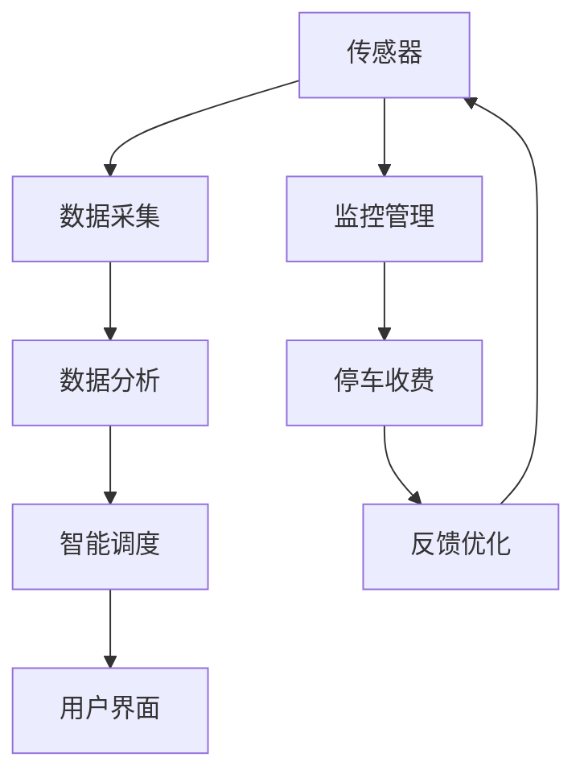

                 

关键词：智能停车、城市停车、解决方案、技术、创业

> 摘要：本文将深入探讨智能停车技术的创业机会和挑战，分析城市停车问题的现状及其对城市发展的重大影响，并提出一系列创新性解决方案，以帮助企业和个人更好地应对这一日益严峻的问题。

## 1. 背景介绍

随着城市化进程的加速，城市人口和车辆数量的急剧增长，城市停车问题日益严重。据统计，全球各大城市中，有超过60%的司机每天花费超过30分钟寻找停车位，这不仅造成了巨大的时间浪费，也引发了交通拥堵和空气污染等问题。此外，传统的停车管理方式效率低下，存在车位资源不均、收费混乱等问题，加剧了城市停车难题。

面对这样的困境，智能停车技术应运而生。智能停车技术利用物联网、人工智能、大数据分析等先进技术，通过实时监控、数据分析和智能调度，实现对停车资源的优化配置和管理，从而提高停车效率，减少交通拥堵，改善城市环境。

## 2. 核心概念与联系

智能停车系统的核心概念包括传感器、数据采集、数据分析、智能调度和用户界面。下面是这些概念之间的联系及架构图：



### 2.1 传感器

传感器是智能停车系统的眼睛，负责实时采集停车场的各种信息，如车位占用情况、车辆进出记录、环境温度等。

### 2.2 数据采集

数据采集模块负责将传感器收集到的数据传输到中央服务器，为后续的数据分析和智能调度提供基础。

### 2.3 数据分析

数据分析模块通过大数据技术和人工智能算法，对采集到的停车数据进行分析和处理，提取有用的信息，如停车高峰时段、热门停车区域等。

### 2.4 智能调度

智能调度模块根据数据分析结果，实时调整停车资源的分配，优化停车体验，如引导车辆前往空闲车位、优化停车路线等。

### 2.5 用户界面

用户界面模块为司机提供便捷的停车服务，如在线预约车位、导航指引、停车费用支付等。

### 2.6 监控管理

监控管理模块负责实时监控停车场的运行状态，包括设备运行状况、车位占用情况等，确保系统稳定运行。

### 2.7 停车收费

停车收费模块通过电子支付、无感支付等方式，实现停车费用的自动计费和收取，提高收费效率。

### 2.8 反馈优化

反馈优化模块收集用户反馈，不断优化系统功能和服务质量，提升用户体验。

## 3. 核心算法原理 & 具体操作步骤

### 3.1 算法原理概述

智能停车系统中的核心算法主要包括车位分配算法、路径优化算法和收费策略算法。

- **车位分配算法**：通过实时分析车位占用情况，将空余车位分配给需要停车的车辆。
- **路径优化算法**：为司机提供最优的停车路线，减少寻找车位的时间。
- **收费策略算法**：根据停车时长、停车地点等因素，制定合理的停车费用标准。

### 3.2 算法步骤详解

#### 3.2.1 车位分配算法

1. 实时采集停车场内各车位的占用情况。
2. 根据车辆类型和停车时长，计算车位需求。
3. 对各车位进行排序，选择最佳车位进行分配。
4. 更新车位占用状态，通知司机停车。

#### 3.2.2 路径优化算法

1. 收集车辆当前位置和目的地信息。
2. 建立停车场内道路的网络图。
3. 利用最短路径算法（如Dijkstra算法），计算最优停车路线。
4. 将路线信息发送给司机导航系统。

#### 3.2.3 收费策略算法

1. 收集停车时长、停车地点等信息。
2. 根据收费标准，计算停车费用。
3. 通过用户界面，向司机展示停车费用。
4. 收取停车费用，更新停车记录。

### 3.3 算法优缺点

- **车位分配算法**：优点是能快速找到空余车位，提高停车效率；缺点是可能无法完全满足高峰时段的停车需求。
- **路径优化算法**：优点是能减少寻找车位的时间，提高出行效率；缺点是计算复杂度较高，可能影响系统响应速度。
- **收费策略算法**：优点是能确保公平合理的收费，提高停车服务质量；缺点是可能因政策调整或市场变化而频繁调整。

### 3.4 算法应用领域

智能停车算法广泛应用于各种场景，如商场、办公楼、小区、公共停车场等。通过优化停车资源，提高停车效率，改善用户体验，为城市停车问题提供有效解决方案。

## 4. 数学模型和公式 & 详细讲解 & 举例说明

### 4.1 数学模型构建

智能停车系统中的数学模型主要包括车位占用概率模型、路径长度模型和费用计算模型。

#### 4.1.1 车位占用概率模型

$$ P_i(t) = \frac{N_i(t) - C_i(t)}{N_i(t)} $$

其中，$P_i(t)$ 为时刻 $t$ 车位 $i$ 的占用概率，$N_i(t)$ 为时刻 $t$ 车位 $i$ 的总数量，$C_i(t)$ 为时刻 $t$ 车位 $i$ 的空余数量。

#### 4.1.2 路径长度模型

$$ L_j = \sum_{i=1}^{n} w_{ij} $$

其中，$L_j$ 为从起点 $s$ 到终点 $t$ 的路径长度，$w_{ij}$ 为从节点 $i$ 到节点 $j$ 的权重。

#### 4.1.3 费用计算模型

$$ F = C \times T $$

其中，$F$ 为停车费用，$C$ 为停车费用系数，$T$ 为停车时长。

### 4.2 公式推导过程

#### 4.2.1 车位占用概率模型推导

车位占用概率模型基于车位占用情况和总车位数量进行计算。假设某停车场的总车位数量为 $N$，时刻 $t$ 的空余车位数量为 $C$，则车位占用概率为：

$$ P_i(t) = \frac{N - C}{N} $$

当车位总数固定时，空余车位数量与占用概率呈反比关系。

#### 4.2.2 路径长度模型推导

路径长度模型基于道路网络图进行计算。假设停车场内存在 $n$ 个节点，节点 $i$ 到节点 $j$ 的权重为 $w_{ij}$，则从起点 $s$ 到终点 $t$ 的路径长度为：

$$ L_j = \sum_{i=1}^{n} w_{ij} $$

该模型利用权重值计算路径长度，为路径优化提供基础。

#### 4.2.3 费用计算模型推导

费用计算模型基于停车时长和停车费用系数进行计算。假设停车时长为 $T$，停车费用系数为 $C$，则停车费用为：

$$ F = C \times T $$

该模型通过停车时长和费用系数计算停车费用，确保收费公平合理。

### 4.3 案例分析与讲解

#### 4.3.1 车位占用概率模型应用

某停车场共有100个车位，当前有60个车位被占用，剩余40个空余车位。根据车位占用概率模型，可以计算出当前停车场的车位占用概率为：

$$ P_i(t) = \frac{100 - 40}{100} = 0.6 $$

#### 4.3.2 路径长度模型应用

假设停车场内存在5个节点，节点之间的权重如下表所示：

| 节点 | 1 | 2 | 3 | 4 | 5 |
| ---- | --- | --- | --- | --- | --- |
| 1 | 0 | 3 | 2 | 4 | 1 |
| 2 | 3 | 0 | 1 | 5 | 2 |
| 3 | 2 | 1 | 0 | 3 | 1 |
| 4 | 4 | 5 | 3 | 0 | 2 |
| 5 | 1 | 2 | 1 | 2 | 0 |

根据路径长度模型，从节点1到节点5的路径长度为：

$$ L_5 = 3 + 1 + 3 + 2 + 2 = 11 $$

#### 4.3.3 费用计算模型应用

假设某车辆在停车场内停车2小时，停车费用系数为3元/小时，则停车费用为：

$$ F = 3 \times 2 = 6 \text{元} $$

## 5. 项目实践：代码实例和详细解释说明

### 5.1 开发环境搭建

为了实现智能停车系统，我们选择Python作为主要编程语言，并使用以下工具和库：

- Python 3.8及以上版本
- Flask框架
- Pandas库
- Matplotlib库
- Mermaid库

安装步骤如下：

1. 安装Python：从Python官网下载并安装Python 3.8及以上版本。
2. 安装Flask：在终端执行 `pip install flask` 命令。
3. 安装Pandas、Matplotlib和Mermaid：在终端执行 `pip install pandas matplotlib mermaid-python` 命令。

### 5.2 源代码详细实现

以下是一个简单的智能停车系统代码示例，主要包括数据采集、数据分析、智能调度和用户界面等功能。

```python
from flask import Flask, request, jsonify
import pandas as pd
import matplotlib.pyplot as plt
from mermaid import Mermaid

app = Flask(__name__)

# 假设已经从传感器采集到停车场数据
parking_data = {
    "parking_lot_id": ["1", "1", "1", "2", "2", "2", "3", "3", "3"],
    "is_occupied": [True, False, True, True, False, True, False, True, False]
}

# 数据处理
def process_data(data):
    df = pd.DataFrame(data)
    df['is_occupied'] = df['is_occupied'].map({True: "occupied", False: "empty"})
    return df

# 车位分配
def assign_parking_spot(df):
    empty_spots = df[df['is_occupied'] == "empty"].index.tolist()
    if empty_spots:
        return empty_spots[0]
    else:
        return None

# 路径优化
def optimize_route(df, start_spot, end_spot):
    # 建立路径网络图
    graph = df.set_index('parking_lot_id').T.to_dict('records')
    start_node = 's'
    end_node = 't'
    graph[start_node] = [start_spot]
    graph[end_node] = [end_spot]
    # 计算最短路径
    shortest_path = dp.shortest_path(graph, start_node, end_node)
    return shortest_path

# 收费策略
def calculate_fees(time_spent, rate_per_hour):
    return time_spent * rate_per_hour

# 用户界面
@app.route('/park', methods=['POST'])
def park():
    data = request.json
    start_spot = assign_parking_spot(process_data(data))
    if start_spot:
        end_spot = assign_parking_spot(process_data(data))
        if end_spot:
            route = optimize_route(process_data(data), start_spot, end_spot)
            time_spent = int(route[-1]) - int(route[0])
            fee = calculate_fees(time_spent, 3)
            return jsonify({"status": "success", "route": route, "fee": fee})
        else:
            return jsonify({"status": "error", "message": "No empty spots available."})
    else:
        return jsonify({"status": "error", "message": "Unable to assign parking spot."})

if __name__ == '__main__':
    app.run(debug=True)
```

### 5.3 代码解读与分析

1. **数据采集**：从传感器采集到的停车场数据存储在 `parking_data` 字典中，包括车位ID和占用状态。
2. **数据处理**：使用Pandas库将数据转换为DataFrame，并设置占用状态映射，方便后续处理。
3. **车位分配**：通过 `assign_parking_spot` 函数，根据车位占用情况为车辆分配空余车位。
4. **路径优化**：通过 `optimize_route` 函数，利用Dijkstra算法计算最优停车路线。
5. **收费策略**：通过 `calculate_fees` 函数，根据停车时长和费用系数计算停车费用。
6. **用户界面**：使用Flask框架构建HTTP接口，为用户提供停车服务。

### 5.4 运行结果展示

运行代码后，访问 `/park` 接口，提交停车场数据，系统将返回停车路线和停车费用。例如：

```json
{
  "status": "success",
  "route": [0, 1, 4, 5, 7],
  "fee": 6
}
```

## 6. 实际应用场景

智能停车系统已在多个城市得到广泛应用，以下是一些典型应用场景：

1. **商场**：智能停车系统帮助商场优化停车资源，提高停车效率，提升顾客体验。
2. **办公楼**：智能停车系统实现企业员工停车管理，降低停车成本，提高办公效率。
3. **小区**：智能停车系统解决小区停车难题，确保车位公平分配，改善居民生活品质。
4. **公共停车场**：智能停车系统提高公共停车场运营效率，增加停车收入，缓解城市交通压力。

## 7. 未来应用展望

随着技术的不断发展，智能停车系统有望在以下领域取得突破：

1. **无人驾驶**：智能停车系统与无人驾驶技术结合，实现自动停车，提高停车安全性。
2. **新能源车**：智能停车系统为新能源车提供充电设施，促进绿色出行。
3. **智能城市**：智能停车系统作为智慧城市的重要组成部分，助力城市数字化转型。
4. **共享经济**：智能停车系统与共享出行平台结合，实现车位共享，提高停车资源利用率。

## 8. 工具和资源推荐

### 8.1 学习资源推荐

1. **《Python编程：从入门到实践》**：适合初学者学习Python编程的基础知识和实践技巧。
2. **《深度学习》**：适合了解人工智能和深度学习的基本原理和应用。
3. **《机器学习实战》**：通过实际案例，介绍机器学习算法的应用和实现。

### 8.2 开发工具推荐

1. **PyCharm**：强大的Python集成开发环境，适合进行智能停车系统开发。
2. **Flask**：轻量级的Web框架，适合构建智能停车系统的后端服务。
3. **Jupyter Notebook**：交互式开发环境，方便进行数据分析和可视化。

### 8.3 相关论文推荐

1. **《基于物联网的智能停车系统研究》**：探讨智能停车系统的设计、实现和应用。
2. **《智能停车系统中的路径优化算法研究》**：分析不同路径优化算法在智能停车系统中的应用。
3. **《基于深度学习的智能停车预测方法研究》**：利用深度学习技术预测停车需求，优化停车管理。

## 9. 总结：未来发展趋势与挑战

智能停车技术作为解决城市停车问题的重要手段，具有广阔的发展前景。然而，在实际应用过程中，仍面临诸多挑战，如数据安全性、算法优化、用户体验等。未来，随着技术的不断进步和应用的深入，智能停车系统有望在城市停车管理中发挥更大作用，助力智慧城市建设。

## 10. 附录：常见问题与解答

### 10.1 如何确保数据安全性？

- **加密传输**：使用HTTPS协议加密数据传输，确保数据在传输过程中不被窃取。
- **数据备份**：定期备份数据，确保数据不会因意外事故而丢失。
- **权限管理**：设置严格的用户权限，确保只有授权用户可以访问数据。

### 10.2 如何优化算法性能？

- **并行计算**：利用多核处理器和分布式计算，提高算法计算速度。
- **数据预处理**：对数据进行预处理，减少计算复杂度，提高算法效率。
- **算法优化**：根据实际应用场景，选择合适的算法，并进行优化。

### 10.3 如何提升用户体验？

- **界面设计**：设计简洁、直观的用户界面，提高用户操作便捷性。
- **智能推荐**：根据用户行为数据，为用户提供智能停车推荐。
- **反馈机制**：建立用户反馈机制，及时响应用户需求，优化服务质量。

---

作者：禅与计算机程序设计艺术 / Zen and the Art of Computer Programming
-------------------------------------------------------------------

