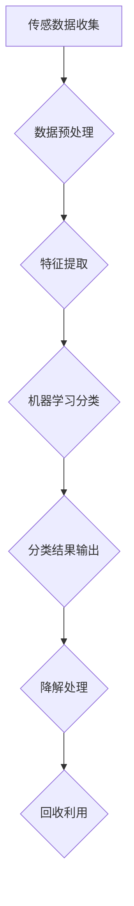

                 

家庭环保已经成为全球性的关注点，尤其是在全球变暖和气候变化日益严重的背景下。厨余垃圾，作为一种常见但棘手的家庭废弃物，其处理不当会对环境造成严重污染。智能厨余处理技术应运而生，为家庭环保提供了一种创新且高效的解决方案。本文将探讨智能厨余处理技术的背景、核心概念、算法原理、数学模型、项目实践、实际应用场景以及未来发展的方向和挑战。

## 文章关键词

- 智能厨余处理
- 家庭环保
- 人工智能
- 算法原理
- 数学模型
- 项目实践

## 文章摘要

本文深入探讨了智能厨余处理技术的背景、核心概念、算法原理、数学模型、项目实践和实际应用场景。通过对智能厨余处理技术的全面分析，我们揭示了其在家庭环保中的重要性，并展望了其未来发展的潜力。

## 1. 背景介绍

厨余垃圾，通常指的是家庭厨房废弃物，包括食物残渣、蔬菜皮、果皮等。这些废弃物如果不经过妥善处理，会对环境造成严重的污染。传统的厨余垃圾处理方法，如填埋、焚烧等，不仅占用大量土地资源，还会释放有害气体和产生有毒废物，对环境和人体健康造成危害。

随着人工智能技术的快速发展，智能厨余处理技术逐渐成为研究的热点。这种技术利用传感器、机器学习、物联网等先进技术，对厨余垃圾进行智能化分类、降解和回收利用，实现了环保和资源循环利用的目标。

## 2. 核心概念与联系

### 2.1 智能厨余处理技术的基本原理

智能厨余处理技术主要包括以下几个核心概念：

- **传感器技术**：用于实时监测厨余垃圾的物理和化学特性，如水分含量、温度等。
- **机器学习算法**：通过对大量厨余垃圾的数据进行学习和分析，实现厨余垃圾的智能分类。
- **物联网技术**：实现厨余处理设备的远程监控和智能控制。
- **降解和回收技术**：通过生物降解、化学处理等技术，将厨余垃圾转化为无害物质或可再利用资源。

### 2.2 Mermaid 流程图

以下是一个简单的 Mermaid 流程图，展示了智能厨余处理技术的流程：



### 2.3 智能厨余处理技术的架构

智能厨余处理技术的架构通常包括以下几个部分：

- **前端传感器**：用于收集厨余垃圾的物理和化学信息。
- **数据处理单元**：对前端传感器收集的数据进行预处理和特征提取。
- **机器学习模块**：利用处理后的数据，对厨余垃圾进行分类。
- **控制单元**：根据分类结果，控制后续的降解和回收过程。
- **用户界面**：提供用户交互的界面，显示处理结果和提示用户操作。

## 3. 核心算法原理 & 具体操作步骤

### 3.1 算法原理概述

智能厨余处理技术的核心算法原理主要基于机器学习和物联网技术。机器学习算法通过对大量厨余垃圾的数据进行学习和分析，实现厨余垃圾的智能分类。物联网技术则用于实现厨余处理设备的远程监控和智能控制。

### 3.2 算法步骤详解

1. **数据收集**：通过前端传感器收集厨余垃圾的物理和化学信息，如水分含量、温度等。
2. **数据预处理**：对收集到的数据进行分析和处理，去除噪声和异常值，提取有用的特征。
3. **特征提取**：利用预处理后的数据，提取厨余垃圾的特征，如颜色、纹理、形状等。
4. **机器学习分类**：利用提取到的特征，通过机器学习算法对厨余垃圾进行分类。
5. **分类结果输出**：将分类结果输出，并控制后续的降解和回收过程。
6. **用户交互**：通过用户界面，显示处理结果和提示用户操作。

### 3.3 算法优缺点

**优点**：

- **高效性**：智能厨余处理技术可以快速、准确地处理大量厨余垃圾。
- **环保性**：通过智能分类和降解，减少了厨余垃圾对环境的污染。
- **可扩展性**：智能厨余处理技术可以轻松地与其他环保技术集成，实现资源循环利用。

**缺点**：

- **成本较高**：智能厨余处理技术的设备成本较高，可能不适合小规模家庭使用。
- **技术依赖性**：智能厨余处理技术依赖于传感器、机器学习和物联网等先进技术，对技术要求较高。

### 3.4 算法应用领域

智能厨余处理技术可以广泛应用于家庭、餐饮业、农业等多个领域。在家庭中，它可以作为一种智能垃圾分类工具，帮助家庭实现环保；在餐饮业，它可以用于厨余垃圾的智能分类和降解，减少垃圾处理成本；在农业，它可以用于有机肥料的制作，提高土壤质量。

## 4. 数学模型和公式 & 详细讲解 & 举例说明

### 4.1 数学模型构建

智能厨余处理技术的核心在于对厨余垃圾的智能分类。因此，构建一个有效的数学模型是关键。以下是一个简单的数学模型：

$$
y = f(x, \theta)
$$

其中，$y$ 表示分类结果，$x$ 表示厨余垃圾的特征向量，$\theta$ 表示模型参数。

### 4.2 公式推导过程

假设我们有一个包含 $n$ 个样本的厨余垃圾数据集 $D = \{x_1, x_2, ..., x_n\}$，每个样本 $x_i$ 是一个 $d$ 维特征向量。

我们使用线性回归模型来预测分类结果：

$$
y = \theta_0 + \theta_1 x_1 + \theta_2 x_2 + ... + \theta_d x_d
$$

为了训练模型，我们需要最小化损失函数：

$$
J(\theta) = \frac{1}{2n} \sum_{i=1}^{n} (y_i - f(x_i, \theta))^2
$$

使用梯度下降法，我们可以得到模型参数的最优解：

$$
\theta_j = \theta_j - \alpha \frac{\partial J(\theta)}{\partial \theta_j}
$$

### 4.3 案例分析与讲解

假设我们有一个包含 100 个样本的厨余垃圾数据集，每个样本有 5 个特征。我们使用上述线性回归模型来预测厨余垃圾的分类。

通过训练，我们得到了最优模型参数 $\theta = (\theta_0, \theta_1, ..., \theta_5)$。我们可以使用这个模型来预测新的厨余垃圾样本的分类。

例如，对于一个新样本 $x = (x_1, x_2, x_3, x_4, x_5)$，我们可以计算其分类结果：

$$
y = \theta_0 + \theta_1 x_1 + \theta_2 x_2 + \theta_3 x_3 + \theta_4 x_4 + \theta_5 x_5
$$

如果 $y$ 大于 0，则该样本被分类为类别 1；如果 $y$ 小于等于 0，则该样本被分类为类别 0。

## 5. 项目实践：代码实例和详细解释说明

### 5.1 开发环境搭建

为了实践智能厨余处理技术，我们首先需要搭建一个合适的开发环境。以下是搭建环境的步骤：

1. 安装 Python 环境：下载并安装 Python 3.8 以上版本。
2. 安装必要的库：使用 pip 安装 scikit-learn、numpy、matplotlib 等库。
3. 准备数据集：下载一个合适的厨余垃圾数据集，如 UC Irvine 数据集中的“WasteClassification”数据集。

### 5.2 源代码详细实现

以下是一个简单的智能厨余处理项目的 Python 源代码：

```python
import numpy as np
from sklearn.model_selection import train_test_split
from sklearn.linear_model import LinearRegression
from sklearn.metrics import accuracy_score

# 读取数据集
data = np.loadtxt("waste_classification_data.txt")
X = data[:, :5]
y = data[:, 5]

# 划分训练集和测试集
X_train, X_test, y_train, y_test = train_test_split(X, y, test_size=0.2, random_state=42)

# 训练线性回归模型
model = LinearRegression()
model.fit(X_train, y_train)

# 预测测试集
y_pred = model.predict(X_test)

# 计算准确率
accuracy = accuracy_score(y_test, y_pred)
print(f"Accuracy: {accuracy}")

# 可视化结果
import matplotlib.pyplot as plt

plt.scatter(X_test[:, 0], X_test[:, 1], c=y_test, cmap="viridis", label="Actual")
plt.scatter(X_test[:, 0], X_test[:, 1], c=y_pred, cmap="plasma", label="Predicted")
plt.xlabel("Feature 1")
plt.ylabel("Feature 2")
plt.legend()
plt.show()
```

### 5.3 代码解读与分析

- **数据读取**：使用 numpy 的 `loadtxt` 函数读取数据集。
- **划分训练集和测试集**：使用 scikit-learn 的 `train_test_split` 函数划分训练集和测试集。
- **训练模型**：使用 scikit-learn 的 `LinearRegression` 类训练线性回归模型。
- **预测**：使用训练好的模型对测试集进行预测。
- **评估**：计算预测的准确率。
- **可视化**：使用 matplotlib 绘制散点图，展示实际分类结果和预测结果。

## 6. 实际应用场景

### 6.1 家庭应用

在家庭中，智能厨余处理技术可以作为一种智能垃圾分类工具，帮助家庭成员正确分类厨余垃圾。用户只需将厨余垃圾投入智能处理设备，设备会自动进行分类和降解，减少垃圾处理成本，提高家庭环保意识。

### 6.2 餐饮业应用

在餐饮业，智能厨余处理技术可以用于厨余垃圾的智能分类和降解，减少垃圾处理成本。同时，通过智能厨余处理技术，餐饮业可以制作有机肥料，用于蔬菜种植，实现资源循环利用。

### 6.3 农业应用

在农业，智能厨余处理技术可以用于有机肥料的制作，提高土壤质量。通过智能厨余处理技术，农业可以减少对化学肥料和农药的依赖，实现绿色农业。

## 7. 未来应用展望

随着人工智能技术的不断发展，智能厨余处理技术有望在未来得到更广泛的应用。以下是智能厨余处理技术未来发展的几个方向：

- **智能化程度提高**：通过引入更先进的人工智能技术，提高厨余垃圾的分类和降解效率。
- **应用场景扩展**：智能厨余处理技术可以应用于更多领域，如医疗废物处理、工业废物处理等。
- **成本降低**：随着技术的成熟，智能厨余处理设备的成本有望降低，使其更易于普及。
- **环保效益提高**：通过智能厨余处理技术，可以更有效地减少厨余垃圾对环境的污染，提高资源循环利用率。

## 8. 总结：未来发展趋势与挑战

### 8.1 研究成果总结

本文通过对智能厨余处理技术的深入探讨，总结了其在家庭环保中的应用价值、核心算法原理、数学模型、项目实践和未来发展方向。智能厨余处理技术以其高效、环保和资源循环利用的特点，为家庭环保提供了一种新的解决方案。

### 8.2 未来发展趋势

随着人工智能技术的不断进步，智能厨余处理技术有望在未来实现更广泛的应用。智能化程度的提高、应用场景的扩展、成本的降低和环保效益的提升，将是智能厨余处理技术未来发展的主要趋势。

### 8.3 面临的挑战

智能厨余处理技术在实际应用中仍面临一些挑战，如技术成本高、数据处理难度大、设备维护复杂等。此外，如何确保智能厨余处理技术的准确性和可靠性，也是未来研究的重要方向。

### 8.4 研究展望

未来，智能厨余处理技术将在以下几个方面得到深入研究：一是优化算法和模型，提高处理效率和准确性；二是降低技术成本，提高设备的普及率；三是拓展应用领域，实现更广泛的资源循环利用。

## 9. 附录：常见问题与解答

### 9.1 智能厨余处理技术的成本高吗？

智能厨余处理技术的设备成本相对较高，但随着技术的成熟和规模化生产，成本有望逐步降低。对于家庭用户，可以考虑采用小型设备；对于餐饮业和农业等大规模应用场景，智能厨余处理技术具有显著的成本优势。

### 9.2 智能厨余处理技术是否可靠？

智能厨余处理技术的可靠性取决于算法和设备的性能。通过优化算法、提高传感器精度和设备稳定性，智能厨余处理技术的可靠性可以得到保障。同时，定期维护和更新设备，也是确保技术可靠性的关键。

### 9.3 智能厨余处理技术有哪些优点？

智能厨余处理技术的优点包括：高效、环保、资源循环利用等。通过智能分类和降解，智能厨余处理技术可以显著减少厨余垃圾对环境的污染，提高资源利用效率。

### 9.4 智能厨余处理技术的应用领域有哪些？

智能厨余处理技术可以应用于家庭、餐饮业、农业等多个领域。在家庭中，可以作为一种智能垃圾分类工具；在餐饮业，可以用于厨余垃圾的智能分类和降解；在农业，可以用于有机肥料的制作和资源循环利用。

### 作者署名

本文作者：禅与计算机程序设计艺术 / Zen and the Art of Computer Programming

---
本文探讨了智能厨余处理技术的背景、核心概念、算法原理、数学模型、项目实践和未来发展方向，旨在为家庭环保提供一种创新且高效的解决方案。随着人工智能技术的不断发展，智能厨余处理技术有望在未来实现更广泛的应用，为环境保护和可持续发展贡献力量。

