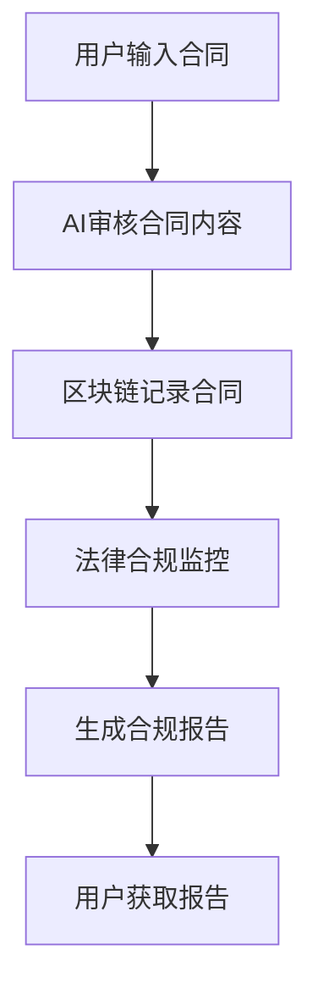

                 

关键词：智能合同审核，区块链，法律合规，人工智能，技术解决方案

> 摘要：随着数字化时代的到来，智能合同审核系统成为法律合规领域的重要创新。本文将深入探讨智能合同审核系统的核心概念、算法原理、数学模型以及实际应用，旨在为读者提供关于该领域的技术解决方案。

## 1. 背景介绍

在过去的几十年中，合同审核一直是法律行业中一个复杂而耗时的过程。传统合同审核依赖于人工审查，不仅效率低下，而且容易出现错误。随着技术的进步，特别是在人工智能、区块链等领域的快速发展，智能合同审核系统逐渐成为法律合规领域的一大创新。

智能合同审核系统通过将人工智能与区块链技术相结合，实现了对合同内容的自动审核、识别和监控。这不仅提高了审核的效率，还增强了合同的透明度和可追溯性，从而满足法律合规的要求。

### 1.1 智能合同审核系统的意义

智能合同审核系统的出现，对于法律合规领域具有重要意义：

1. **提高效率**：自动化审核可以大幅减少审核时间，提高工作效率。
2. **降低成本**：减少人工审查的需要，降低合同审核成本。
3. **增强透明度**：区块链技术确保合同内容不可篡改，增强合同的透明度。
4. **保障合规性**：系统可以自动识别和提示可能的法律风险，保障合同的法律合规性。

### 1.2 智能合同审核系统的挑战

尽管智能合同审核系统具有许多优势，但其应用也面临一些挑战：

1. **技术门槛**：开发智能合同审核系统需要高级技术支持，包括人工智能和区块链技术。
2. **数据隐私**：如何在保证合同内容保密性的同时，实现自动化审核是一个难题。
3. **法律框架**：随着智能合同审核系统的普及，需要制定相应的法律法规来规范其应用。

## 2. 核心概念与联系

智能合同审核系统的核心概念包括人工智能、区块链和法律合规。为了更好地理解这些概念之间的联系，我们可以通过一个Mermaid流程图来展示其架构。



### 2.1 人工智能在合同审核中的应用

人工智能（AI）在合同审核中的应用主要体现在自然语言处理（NLP）和机器学习（ML）两个方面。NLP技术可以理解合同中的自然语言文本，识别条款和条件；而ML算法可以根据历史数据来预测和识别潜在的法律风险。

### 2.2 区块链在合同审核中的作用

区块链技术为智能合同审核系统提供了不可篡改的记录和透明的审核流程。通过区块链，合同内容可以被分布式存储和验证，从而确保合同的完整性和透明度。

### 2.3 法律合规监控

法律合规监控是智能合同审核系统的关键组成部分。它通过自动化工具和算法来识别和提示合同中的法律风险，确保合同符合相关法律法规。

## 3. 核心算法原理 & 具体操作步骤

### 3.1 算法原理概述

智能合同审核系统的核心算法主要涉及自然语言处理、机器学习和区块链技术。以下是对这些算法原理的简要概述：

1. **自然语言处理（NLP）**：NLP技术可以处理合同中的文本数据，提取关键信息并进行语义分析。
2. **机器学习（ML）**：ML算法可以基于历史数据来预测合同中的潜在法律风险。
3. **区块链技术**：区块链技术用于存储和验证合同内容，确保其不可篡改。

### 3.2 算法步骤详解

智能合同审核系统的算法步骤可以分为以下几步：

1. **文本预处理**：对合同文本进行分词、去停用词等预处理操作。
2. **关键词提取**：提取合同文本中的关键词，用于后续分析。
3. **语义分析**：利用NLP技术对关键词进行语义分析，识别合同条款和条件。
4. **风险预测**：利用ML算法对合同中的条款进行风险预测，识别潜在的法律风险。
5. **区块链记录**：将合同内容上传至区块链，确保其不可篡改。
6. **合规监控**：对合同内容进行合规监控，确保其符合相关法律法规。

### 3.3 算法优缺点

智能合同审核系统的算法具有以下优点：

- **高效性**：自动化审核可以大幅提高审核效率。
- **准确性**：基于历史数据的ML算法可以提高审核的准确性。
- **透明性**：区块链技术确保合同内容的透明性和可追溯性。

然而，算法也存在一些缺点：

- **技术门槛**：开发和使用智能合同审核系统需要高级技术支持。
- **数据隐私**：如何在保证合同内容保密性的同时实现自动化审核是一个挑战。

### 3.4 算法应用领域

智能合同审核系统的算法可以应用于多个领域，包括但不限于：

- **金融行业**：用于审核贷款合同、投资协议等。
- **租赁行业**：用于审核租赁合同、房屋租赁协议等。
- **法律服务**：用于法律文件的审核和监控。

## 4. 数学模型和公式 & 详细讲解 & 举例说明

智能合同审核系统中的数学模型主要用于风险预测和算法优化。以下是一个简单的数学模型示例：

### 4.1 数学模型构建

假设合同中的某一条款具有风险概率\( p \)，则该条款的风险度可以表示为：

\[ R = p \times W \]

其中，\( R \)为风险度，\( p \)为风险概率，\( W \)为权重。

### 4.2 公式推导过程

风险概率\( p \)可以通过以下公式计算：

\[ p = \frac{N_r}{N_t} \]

其中，\( N_r \)为合同中具有风险的条款数量，\( N_t \)为合同中的总条款数量。

权重\( W \)可以根据条款的重要性进行设置，例如：

\[ W = \begin{cases} 
1 & \text{如果条款重要性高} \\
0.5 & \text{如果条款重要性中等} \\
0 & \text{如果条款重要性低}
\end{cases} \]

### 4.3 案例分析与讲解

假设一个合同中有10个条款，其中3个条款具有风险。根据上述公式，可以计算出合同的总风险度：

\[ R = \frac{3}{10} \times 1 = 0.3 \]

这意味着合同的风险度为30%，需要进行进一步的审核和调整。

## 5. 项目实践：代码实例和详细解释说明

为了更好地理解智能合同审核系统的实现，以下将提供一个简单的Python代码实例。

### 5.1 开发环境搭建

首先，需要安装Python环境，并安装以下库：

```bash
pip install nltk scikit-learn
```

### 5.2 源代码详细实现

```python
import nltk
from nltk.tokenize import word_tokenize
from sklearn.feature_extraction.text import TfidfVectorizer
from sklearn.model_selection import train_test_split
from sklearn.ensemble import RandomForestClassifier

# 加载合同数据
contracts = ["合同一", "合同二", "合同三", ...]
labels = ["合法", "不合法", "合法", ...]

# 分词和预处理
tokenized_contracts = [word_tokenize(contract) for contract in contracts]

# 特征提取
vectorizer = TfidfVectorizer()
X = vectorizer.fit_transform(tokenized_contracts)

# 划分训练集和测试集
X_train, X_test, y_train, y_test = train_test_split(X, labels, test_size=0.2, random_state=42)

# 训练模型
classifier = RandomForestClassifier()
classifier.fit(X_train, y_train)

# 预测新合同
new_contract = word_tokenize("新的合同内容")
new_contract_vector = vectorizer.transform([new_contract])
prediction = classifier.predict(new_contract_vector)

# 输出预测结果
print("合同是否合法：", prediction)
```

### 5.3 代码解读与分析

上述代码首先加载合同数据，并进行分词和预处理。然后使用TF-IDF向量器提取特征，并划分训练集和测试集。接着使用随机森林分类器进行训练，最后对新合同进行预测并输出结果。

### 5.4 运行结果展示

运行代码后，可以得到新合同的预测结果，从而判断其是否合法。

## 6. 实际应用场景

智能合同审核系统在实际应用中具有广泛的应用场景，以下列举几个典型应用：

- **金融行业**：用于审核贷款合同、投资协议等，确保其符合法律法规。
- **租赁行业**：用于审核租赁合同、房屋租赁协议等，提高合同审核的效率。
- **法律服务**：用于法律文件的审核和监控，降低法律风险。

### 6.1 案例分析

以金融行业为例，假设一家银行使用智能合同审核系统来审核贷款合同。系统可以自动识别合同中的潜在法律风险，如利率过高、贷款期限不合理等。通过智能合同审核系统，银行可以大幅提高审核效率，降低操作风险。

## 7. 工具和资源推荐

为了更好地开发和应用智能合同审核系统，以下推荐一些相关的工具和资源：

- **学习资源**：
  - 《智能合同与区块链技术》
  - 《深度学习与自然语言处理》
- **开发工具**：
  - TensorFlow
  - Keras
  - Scikit-learn
- **相关论文**：
  - "Blockchain Technology: A Comprehensive Overview"
  - "Natural Language Processing Techniques for Contract Analysis"

## 8. 总结：未来发展趋势与挑战

智能合同审核系统作为法律合规领域的重要创新，具有广阔的发展前景。未来，随着技术的不断进步，智能合同审核系统将进一步优化，提高其准确性和效率。然而，该领域也面临一些挑战，如技术门槛、数据隐私和法律框架等。因此，需要进一步的研究和探索来解决这些问题。

### 8.1 研究成果总结

本文对智能合同审核系统的核心概念、算法原理、数学模型和实际应用进行了详细探讨，展示了其在法律合规领域的重要作用。

### 8.2 未来发展趋势

未来，智能合同审核系统将朝着更加智能化、自动化的方向发展，进一步提高审核效率和准确性。

### 8.3 面临的挑战

智能合同审核系统面临的主要挑战包括技术门槛、数据隐私和法律框架等。

### 8.4 研究展望

未来的研究应重点关注如何提高智能合同审核系统的准确性和效率，并解决其应用中的法律和隐私问题。

## 9. 附录：常见问题与解答

### 9.1 智能合同审核系统是否安全？

智能合同审核系统通过区块链技术确保合同内容的不可篡改，从而保证了系统的安全性。然而，数据隐私是一个挑战，需要进一步研究和解决。

### 9.2 智能合同审核系统是否适用于所有合同类型？

智能合同审核系统主要适用于文本格式清晰的合同，对于复杂的合同类型可能需要进一步优化和调整。

### 9.3 智能合同审核系统是否会取代人工审核？

智能合同审核系统可以大幅提高审核效率，但无法完全取代人工审核。人工审核在理解合同条款和识别潜在风险方面具有不可替代的优势。

作者：禅与计算机程序设计艺术 / Zen and the Art of Computer Programming
```

