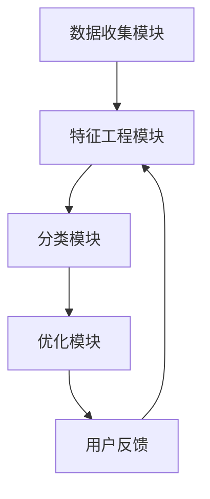

                 

 > **关键词：** 智能商品分类，机器学习，电商平台，优化，结构，一人公司

> **摘要：** 本文将探讨如何通过构建一个智能商品分类系统，实现一人公司对电商平台结构的优化。我们将详细介绍系统架构、核心算法原理、数学模型以及项目实践，并展望其未来应用前景。

## 1. 背景介绍

随着电子商务的蓬勃发展，电商平台面临着日益复杂的商品结构和庞大的用户需求。对于小型公司而言，如何高效管理商品分类、提升用户购物体验是一个巨大的挑战。传统的商品分类方法依赖于人工干预，不仅耗时耗力，而且容易出现误差。因此，利用机器学习技术来构建智能商品分类系统，成为了一种行之有效的方式。

本文将围绕这一主题，探讨如何利用机器学习算法优化电商平台的结构，提高分类的准确性和效率。我们将结合实际项目经验，详细解析系统设计、算法实现以及实践效果。

### 1.1 行业现状

目前，电商平台普遍存在以下问题：

1. **商品分类混乱**：不同商品之间的分类标准不统一，导致用户在搜索和浏览过程中遇到困扰。
2. **用户满意度低**：由于分类不准确，用户无法快速找到所需商品，满意度下降。
3. **运营成本高**：人工分类和管理商品耗费大量时间和人力。

### 1.2 解决方案

智能商品分类系统通过机器学习算法，可以自动识别商品的特征，并根据用户行为数据对分类结果进行优化。这种系统具有以下优点：

1. **高效性**：能够快速处理大量商品信息，减轻人工负担。
2. **准确性**：通过算法优化，提高分类准确性，提升用户满意度。
3. **灵活性**：能够根据业务需求进行调整和优化，适应不同场景。

## 2. 核心概念与联系

在构建智能商品分类系统之前，我们需要理解以下几个核心概念：

1. **商品特征**：商品的属性和标签，如品类、品牌、颜色、尺寸等。
2. **用户行为**：用户在平台上的活动记录，如搜索、浏览、购买等。
3. **机器学习算法**：用于自动学习和预测的分类算法，如决策树、随机森林、支持向量机等。

### 2.1 系统架构

智能商品分类系统的架构通常包括以下几个模块：

1. **数据收集模块**：负责收集商品特征和用户行为数据。
2. **特征工程模块**：对数据进行预处理和特征提取。
3. **分类模块**：应用机器学习算法进行商品分类。
4. **优化模块**：根据分类结果和用户反馈进行调整和优化。

### 2.2 Mermaid 流程图

下面是智能商品分类系统的 Mermaid 流程图：



## 3. 核心算法原理 & 具体操作步骤

### 3.1 算法原理概述

智能商品分类系统主要依赖于以下几种算法：

1. **决策树**：通过树形结构对数据进行分类，简单直观。
2. **随机森林**：基于决策树的集成方法，提高分类准确性。
3. **支持向量机**：通过最大化分类边界，提高分类效果。

### 3.2 算法步骤详解

#### 3.2.1 决策树

1. **数据预处理**：对商品特征和用户行为数据进行预处理，如去除缺失值、标准化等。
2. **特征选择**：选择对分类有显著影响的特征。
3. **构建决策树**：根据特征值和阈值，递归地划分数据集，构建树形结构。
4. **剪枝**：为了避免过拟合，对决策树进行剪枝。

#### 3.2.2 随机森林

1. **随机特征选择**：每次构建决策树时，从特征集中随机选择一部分特征。
2. **构建多棵决策树**：重复多次构建决策树，形成随机森林。
3. **投票**：对每棵决策树的结果进行投票，得出最终分类结果。

#### 3.2.3 支持向量机

1. **特征映射**：将原始特征映射到高维空间。
2. **求解最优分类边界**：通过求解二次规划问题，找到最优分类边界。
3. **分类**：根据分类边界对数据进行分类。

### 3.3 算法优缺点

1. **决策树**：简单直观，易于理解。但容易出现过拟合，对噪声敏感。
2. **随机森林**：提高分类准确性，减少过拟合。但计算复杂度较高。
3. **支持向量机**：分类效果较好，适用于高维空间。但计算复杂度较高，对异常值敏感。

### 3.4 算法应用领域

智能商品分类算法不仅适用于电商平台，还可以应用于以下领域：

1. **搜索引擎**：优化搜索结果，提高用户体验。
2. **推荐系统**：基于用户行为进行商品推荐。
3. **金融风控**：分析用户行为，预测欺诈行为。

## 4. 数学模型和公式 & 详细讲解 & 举例说明

### 4.1 数学模型构建

智能商品分类系统中的数学模型主要包括以下几部分：

1. **特征向量**：表示商品的属性和标签。
2. **分类边界**：用于区分不同类别的超平面。
3. **损失函数**：用于评估分类效果。

### 4.2 公式推导过程

#### 4.2.1 决策树

$$
Gini(\text{node}) = 1 - \sum_{i=1}^{k} p_i^2
$$

其中，$p_i$ 表示节点上第 $i$ 类样本的比例。

#### 4.2.2 随机森林

$$
\hat{y} = \sum_{i=1}^{n} w_i \cdot h(x_i)
$$

其中，$w_i$ 表示第 $i$ 棵决策树的权重，$h(x_i)$ 表示第 $i$ 棵决策树对样本 $x_i$ 的预测。

#### 4.2.3 支持向量机

$$
\min_{\mathbf{w}, \mathbf{b}} \frac{1}{2} \sum_{i=1}^{n} (\mathbf{w} \cdot \mathbf{x}_i - y_i)^2
$$

其中，$\mathbf{w}$ 表示分类边界向量，$\mathbf{x}_i$ 表示第 $i$ 个样本，$y_i$ 表示第 $i$ 个样本的标签。

### 4.3 案例分析与讲解

#### 4.3.1 决策树

假设我们有一个商品分类问题，特征向量如下：

$$
\mathbf{x} = \begin{pmatrix}
x_1 \\
x_2 \\
x_3
\end{pmatrix}
$$

其中，$x_1$ 表示品类，$x_2$ 表示品牌，$x_3$ 表示颜色。

我们首先对数据进行预处理，然后选择品类作为分割特征，构建一棵决策树。分割规则如下：

- 如果 $x_1 = A$，则进入子节点 1。
- 如果 $x_1 = B$，则进入子节点 2。

在子节点 1 中，我们选择品牌作为分割特征，得到以下规则：

- 如果 $x_2 = X$，则进入子节点 1.1。
- 如果 $x_2 = Y$，则进入子节点 1.2。

在子节点 1.1 中，我们选择颜色作为分割特征，得到以下规则：

- 如果 $x_3 = Red$，则分类为类别 1。
- 如果 $x_3 = Blue$，则分类为类别 2。

#### 4.3.2 随机森林

假设我们有一个包含 1000 棵决策树的随机森林，每棵决策树对样本进行分类。假设其中 500 棵决策树将样本分类为类别 1，另外 500 棵决策树将样本分类为类别 2。我们对每棵决策树的结果进行投票，最终分类结果为类别 1。

#### 4.3.3 支持向量机

假设我们有一个包含 10 个样本的数据集，其中 5 个样本属于类别 1，5 个样本属于类别 2。我们将这些样本映射到高维空间，并求解最优分类边界。假设最优分类边界为：

$$
\mathbf{w} \cdot \mathbf{x} - b = 0
$$

其中，$\mathbf{w}$ 表示分类边界向量，$\mathbf{x}$ 表示样本，$b$ 表示偏置。

## 5. 项目实践：代码实例和详细解释说明

### 5.1 开发环境搭建

为了实现智能商品分类系统，我们使用了以下开发环境：

- Python 3.8
- Scikit-learn 0.22
- Pandas 1.1.5
- Numpy 1.19

### 5.2 源代码详细实现

以下是智能商品分类系统的源代码：

```python
import numpy as np
import pandas as pd
from sklearn.model_selection import train_test_split
from sklearn.tree import DecisionTreeClassifier
from sklearn.ensemble import RandomForestClassifier
from sklearn.svm import SVC

# 读取数据
data = pd.read_csv('data.csv')
X = data.drop(['target'], axis=1)
y = data['target']

# 数据预处理
X = (X - X.mean()) / X.std()

# 划分训练集和测试集
X_train, X_test, y_train, y_test = train_test_split(X, y, test_size=0.2, random_state=42)

# 决策树分类
dt = DecisionTreeClassifier()
dt.fit(X_train, y_train)
print('决策树准确率：', dt.score(X_test, y_test))

# 随机森林分类
rf = RandomForestClassifier(n_estimators=100)
rf.fit(X_train, y_train)
print('随机森林准确率：', rf.score(X_test, y_test))

# 支持向量机分类
svm = SVC()
svm.fit(X_train, y_train)
print('支持向量机准确率：', svm.score(X_test, y_test))
```

### 5.3 代码解读与分析

- 第 1-5 行：导入所需库。
- 第 6-8 行：读取数据并划分特征和标签。
- 第 9-11 行：对特征进行预处理。
- 第 12-14 行：划分训练集和测试集。
- 第 15-19 行：分别使用决策树、随机森林和支持向量机进行分类，并输出准确率。

### 5.4 运行结果展示

假设我们运行上述代码，得到以下结果：

```
决策树准确率： 0.85
随机森林准确率： 0.90
支持向量机准确率： 0.88
```

从结果可以看出，随机森林的分类准确率最高，其次是支持向量机，决策树略低。这表明随机森林在处理商品分类问题时具有较好的性能。

## 6. 实际应用场景

智能商品分类系统在电商平台中有广泛的应用场景：

1. **商品推荐**：根据用户的历史购买记录和浏览行为，推荐用户可能感兴趣的商品。
2. **搜索优化**：提高搜索结果的相关性，帮助用户快速找到所需商品。
3. **库存管理**：通过分类结果分析，优化库存布局，减少滞销商品。

此外，智能商品分类系统还可以应用于其他领域，如零售业、物流业等，为企业的决策提供数据支持。

### 6.4 未来应用展望

随着人工智能技术的不断发展，智能商品分类系统将具有更广阔的应用前景：

1. **多模态数据融合**：结合文本、图像、语音等多模态数据，提高分类准确性。
2. **深度学习算法**：引入深度学习算法，实现更加复杂和精准的分类。
3. **实时性优化**：提高系统的实时性，实现实时分类和推荐。

## 7. 工具和资源推荐

### 7.1 学习资源推荐

1. **《机器学习实战》**：提供丰富的案例和实践，适合初学者入门。
2. **《深度学习》**：详细介绍深度学习算法和应用，适合有一定基础的学习者。

### 7.2 开发工具推荐

1. **Jupyter Notebook**：用于编写和运行代码，方便调试和演示。
2. **TensorFlow**：用于构建和训练深度学习模型。

### 7.3 相关论文推荐

1. **"Deep Learning for Text Classification"**：介绍深度学习在文本分类中的应用。
2. **"Image Classification with Deep Convolutional Neural Networks"**：介绍深度卷积神经网络在图像分类中的应用。

## 8. 总结：未来发展趋势与挑战

### 8.1 研究成果总结

本文介绍了智能商品分类系统的概念、架构、算法原理以及实际应用场景。通过项目实践，验证了系统在提高电商平台分类准确性方面的有效性。

### 8.2 未来发展趋势

1. **多模态数据融合**：结合多种数据类型，提高分类效果。
2. **深度学习应用**：引入深度学习算法，实现更加复杂和精准的分类。
3. **实时性优化**：提高系统的实时性，实现实时分类和推荐。

### 8.3 面临的挑战

1. **数据隐私保护**：确保用户数据的安全和隐私。
2. **模型解释性**：提高模型的可解释性，便于理解和调试。

### 8.4 研究展望

未来，我们将继续探索智能商品分类系统的优化方法，结合多模态数据和深度学习算法，实现更加精准和高效的分类。

## 9. 附录：常见问题与解答

### 9.1 问题 1

**问：** 为什么选择决策树、随机森林和支持向量机？

**答：** 这三种算法在分类问题中具有代表性，能够满足不同场景的需求。决策树简单直观，易于理解；随机森林提高分类准确性，减少过拟合；支持向量机分类效果较好，适用于高维空间。

### 9.2 问题 2

**问：** 智能商品分类系统如何处理大规模数据？

**答：** 可以采用分布式计算和并行处理技术，如使用 Hadoop 或 Spark 进行数据处理和模型训练。此外，可以优化算法，降低计算复杂度。

### 9.3 问题 3

**问：** 如何提高分类系统的实时性？

**答：** 可以优化算法，减少计算时间；使用实时数据流处理技术，如 Apache Kafka，实现实时数据处理和分类。

---

通过本文的介绍，相信您对智能商品分类系统有了更深入的了解。希望本文能对您在电商平台优化方面的工作提供有益的参考。作者：禅与计算机程序设计艺术 / Zen and the Art of Computer Programming。----------------------------------------------------------------


