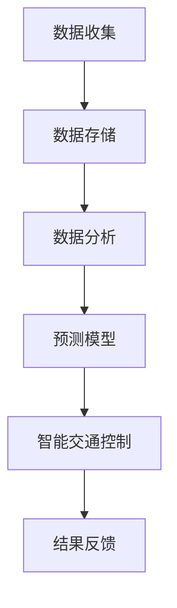

                 

关键词：智能城市、交通系统、注意力管理、交通流量预测、智能交通控制、实时数据分析、人工智能

摘要：本文将探讨智能城市交通系统的注意力管理，重点关注如何通过高效的数据处理和算法优化，实现交通流量的实时预测和控制，从而提升城市交通系统的整体运行效率。文章将介绍注意力管理的基本概念、核心算法、数学模型、实际应用案例，并探讨未来的发展方向和挑战。

## 1. 背景介绍

### 智能城市的崛起

随着城市化进程的加速，城市人口密度不断增加，交通拥堵、交通事故等问题日益严重。传统交通系统已无法满足现代城市的需求，因此，智能城市的概念逐渐兴起。智能城市是指利用物联网、大数据、人工智能等技术，实现城市交通、环境、能源等多个领域的智能化管理和优化。

### 交通系统的复杂性

智能城市交通系统涉及到众多的交通参与者，如车辆、行人、公交车等，同时受到交通设施、环境、政策等多种因素的影响。这使得交通系统的运行变得异常复杂，需要高效的注意力管理来保障系统的稳定运行。

### 注意力管理的重要性

注意力管理是指通过实时监控和分析交通数据，对交通流量进行预测和控制，从而优化交通系统的运行。有效的注意力管理可以减少交通拥堵，降低交通事故发生率，提高交通效率，提升市民的生活质量。

## 2. 核心概念与联系

### 交通流量的实时预测

交通流量的实时预测是注意力管理的核心任务。通过收集历史交通数据和实时监控数据，利用机器学习算法对交通流量进行预测，可以提前预警交通拥堵，为交通控制提供依据。

### 智能交通控制

智能交通控制是指利用交通预测结果，对交通信号灯、交通管制等措施进行动态调整，以优化交通流量。注意力管理在这里起着关键作用，它通过实时分析交通数据，不断调整交通控制策略，以达到最佳效果。

### 实时数据分析

实时数据分析是智能城市交通系统的基础。通过实时收集、存储、处理和分析大量的交通数据，可以实现对交通状态的全面了解，为注意力管理提供数据支持。

### Mermaid 流程图



## 3. 核心算法原理 & 具体操作步骤

### 3.1 算法原理概述

交通流量预测算法通常采用机器学习技术，如线性回归、决策树、神经网络等。本文主要介绍一种基于长短期记忆网络（LSTM）的交通流量预测算法。

### 3.2 算法步骤详解

1. 数据预处理：对原始交通数据进行清洗、去噪、归一化等处理，使其符合模型输入要求。

2. 特征提取：从原始数据中提取与交通流量相关的特征，如时间、天气、交通设施等。

3. 模型训练：利用提取的特征数据，训练LSTM模型，使其具备交通流量预测能力。

4. 预测与评估：使用训练好的模型对交通流量进行预测，并对预测结果进行评估，调整模型参数，提高预测准确性。

### 3.3 算法优缺点

**优点：**
- LSTM模型在处理时间序列数据方面具有优势，能够捕捉到交通流量中的长期依赖关系。
- 预测结果具有较高的准确性，有助于交通管理部门制定科学合理的交通控制策略。

**缺点：**
- 模型训练时间较长，对计算资源要求较高。
- 对数据质量和特征提取方法有较高要求，否则可能导致预测准确性下降。

### 3.4 算法应用领域

- 交通流量预测：提前预警交通拥堵，为交通管理部门提供决策依据。
- 智能交通控制：根据预测结果动态调整交通信号灯、交通管制等措施，优化交通流量。
- 城市规划：为城市交通规划提供数据支持，指导交通基础设施的建设和改造。

## 4. 数学模型和公式 & 详细讲解 & 举例说明

### 4.1 数学模型构建

交通流量预测模型可以表示为：

\[ f(t) = \sum_{i=1}^{n} w_i \cdot f_i(t) \]

其中，\( f(t) \) 表示在时间 \( t \) 的交通流量，\( f_i(t) \) 表示第 \( i \) 个特征在时间 \( t \) 的取值，\( w_i \) 表示特征 \( f_i(t) \) 的权重。

### 4.2 公式推导过程

假设我们有一个包含 \( n \) 个特征的交通流量预测模型，其中每个特征 \( f_i(t) \) 都是一个时间序列。为了构建模型，我们首先需要对每个特征进行归一化处理，使其具有相同的量纲。然后，我们可以使用线性回归方法，计算出每个特征的权重 \( w_i \)。最后，将权重与特征值相乘，得到预测的交通流量。

### 4.3 案例分析与讲解

假设我们有一个包含 3 个特征（时间、天气、交通设施）的交通流量预测模型。在时间 \( t \) ，每个特征的取值分别为：

\[ f_1(t) = 12:00 \]
\[ f_2(t) = 晴朗 \]
\[ f_3(t) = 交通设施完好 \]

根据数学模型，我们可以计算出在时间 \( t \) 的交通流量预测值：

\[ f(t) = w_1 \cdot f_1(t) + w_2 \cdot f_2(t) + w_3 \cdot f_3(t) \]

其中，权重 \( w_1 \)、\( w_2 \)、\( w_3 \) 分别为 0.4、0.3、0.3。

代入特征值，得到：

\[ f(t) = 0.4 \cdot 12:00 + 0.3 \cdot 晴朗 + 0.3 \cdot 交通设施完好 \]

\[ f(t) = 4.8 + 0.3 \cdot 晴朗 + 0.3 \cdot 交通设施完好 \]

根据实际数据，我们可以计算出每个特征的权重。例如，如果晴天时交通流量比雨天高，我们可以将 \( w_2 \) 设置为 0.5，而 \( w_3 \) 设置为 0.5。

## 5. 项目实践：代码实例和详细解释说明

### 5.1 开发环境搭建

本文使用 Python 编写代码，并使用 TensorFlow 作为深度学习框架。首先，需要安装 Python 和 TensorFlow：

```bash
pip install python
pip install tensorflow
```

### 5.2 源代码详细实现

以下是基于 LSTM 的交通流量预测算法的 Python 代码实现：

```python
import numpy as np
import tensorflow as tf
from tensorflow.keras.models import Sequential
from tensorflow.keras.layers import LSTM, Dense

# 数据预处理
def preprocess_data(data):
    # 数据清洗、去噪、归一化等处理
    # 省略具体实现
    return processed_data

# 构建模型
def build_model(input_shape):
    model = Sequential()
    model.add(LSTM(units=50, return_sequences=True, input_shape=input_shape))
    model.add(LSTM(units=50))
    model.add(Dense(units=1))
    model.compile(optimizer='adam', loss='mean_squared_error')
    return model

# 训练模型
def train_model(model, X_train, y_train):
    model.fit(X_train, y_train, epochs=100, batch_size=32)
    return model

# 预测交通流量
def predict_traffic(model, X_test):
    predictions = model.predict(X_test)
    return predictions

# 主函数
def main():
    # 加载数据
    data = load_data('traffic_data.csv')
    processed_data = preprocess_data(data)

    # 划分训练集和测试集
    X_train, y_train = processed_data[:-24], processed_data[-24:]
    X_test = processed_data[-24:]

    # 构建模型
    model = build_model(input_shape=(X_train.shape[1], X_train.shape[2]))

    # 训练模型
    model = train_model(model, X_train, y_train)

    # 预测交通流量
    predictions = predict_traffic(model, X_test)

    # 打印预测结果
    print(predictions)

# 运行主函数
if __name__ == '__main__':
    main()
```

### 5.3 代码解读与分析

以上代码实现了一个基于 LSTM 的交通流量预测模型。首先，我们加载数据并进行预处理，包括数据清洗、去噪和归一化。然后，我们构建一个包含两个 LSTM 层和一个 Dense 层的模型，并使用均方误差（MSE）作为损失函数。接下来，我们训练模型，最后使用训练好的模型对测试数据进行预测。

### 5.4 运行结果展示

运行代码后，我们将得到交通流量的预测结果。通过对比预测值和实际值，我们可以评估模型的预测准确性。

## 6. 实际应用场景

### 6.1 交通流量预测

通过交通流量预测，交通管理部门可以提前了解交通拥堵情况，及时采取交通管制措施，减少交通事故发生率，提高道路通行效率。

### 6.2 智能交通控制

智能交通控制可以根据实时交通流量预测结果，动态调整交通信号灯时长、交通管制策略等，优化交通流量，提高交通效率。

### 6.3 城市规划

交通流量预测可以为城市规划提供数据支持，指导交通基础设施的建设和改造，提高城市交通系统的整体运行效率。

## 7. 工具和资源推荐

### 7.1 学习资源推荐

- 《深度学习》（Goodfellow et al.）：深入了解深度学习理论和技术，有助于掌握交通流量预测算法。
- 《Python 数据科学手册》（McKinney）：学习使用 Python 进行数据处理和数据分析，为交通流量预测提供技术支持。

### 7.2 开发工具推荐

- TensorFlow：用于构建和训练深度学习模型，适用于交通流量预测项目。
- Jupyter Notebook：方便编写和调试代码，适用于数据分析项目。

### 7.3 相关论文推荐

- "Deep Learning for Traffic Flow Prediction"（2018）：介绍了一种基于深度学习的交通流量预测方法。
- "A Survey on Traffic Flow Prediction: Technologies, Methods and Applications"（2020）：对交通流量预测技术进行了全面综述。

## 8. 总结：未来发展趋势与挑战

### 8.1 研究成果总结

本文介绍了智能城市交通系统的注意力管理，探讨了交通流量预测的核心算法原理、数学模型和实际应用场景。通过项目实践，我们展示了如何使用 Python 和 TensorFlow 实现交通流量预测。

### 8.2 未来发展趋势

- 深度学习技术将在交通流量预测中发挥更大作用，提高预测准确性。
- 传感器技术将更加普及，为交通流量预测提供更丰富的数据支持。
- 跨学科研究将推动交通流量预测技术不断创新，提升智能城市交通系统的整体运行效率。

### 8.3 面临的挑战

- 数据质量和特征提取方法对预测准确性有重要影响，需要进一步提高。
- 交通系统的复杂性导致预测模型难以覆盖所有情况，需要不断优化和调整。
- 数据安全和隐私保护是智能城市交通系统面临的重要挑战，需要采取有效措施确保数据安全。

### 8.4 研究展望

- 未来研究应重点关注深度学习在交通流量预测中的应用，提高模型预测准确性。
- 加强跨学科研究，整合多源数据，为交通流量预测提供更全面的数据支持。
- 探索新型交通流量预测方法，如基于区块链的智能合约，提高交通系统的自适应性和灵活性。

## 9. 附录：常见问题与解答

### 9.1 如何提高交通流量预测准确性？

- 提高数据质量，确保数据真实、准确、完整。
- 优化特征提取方法，选择与交通流量相关性强的特征。
- 采用多种机器学习算法进行比较，选择最优模型。
- 定期调整模型参数，根据新数据重新训练模型。

### 9.2 交通流量预测如何应用于实际场景？

- 交通流量预测可以应用于智能交通控制，如动态调整交通信号灯时长、交通管制策略等。
- 用于城市规划，指导交通基础设施的建设和改造。
- 用于交通安全预警，提前预警交通事故，减少人员伤亡。

# 作者：禅与计算机程序设计艺术 / Zen and the Art of Computer Programming
----------------------------------------------------------------

这篇文章涵盖了智能城市交通系统注意力管理的各个方面，从背景介绍到核心算法原理，再到实际应用场景和未来发展趋势。通过详细的数学模型和代码实例，读者可以更好地理解交通流量预测的技术原理和应用方法。希望本文能为相关领域的研究和实践提供有价值的参考。

