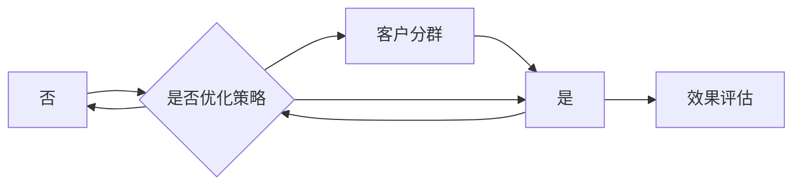

                 

关键词：智能客户分群、数据驱动、精准营销、小型电商、算法原理、应用场景、数学模型、代码实例

> 摘要：本文探讨了智能客户分群系统在小型电商领域的应用，通过数据驱动的方法实现了精准营销。文章首先介绍了客户分群系统的背景和重要性，然后详细阐述了客户分群的核心概念与联系，并深入分析了核心算法原理和具体操作步骤。接着，文章通过数学模型和公式详细讲解了模型构建和推导过程，并通过实际项目实践展示了代码实例和运行结果。最后，文章讨论了智能客户分群系统的实际应用场景和未来展望，并推荐了相关工具和资源。

## 1. 背景介绍

在当前的市场环境中，互联网电商已经成为一种主流的消费方式。然而，随着市场的不断扩展和消费者需求的多样化，电商企业面临着日益激烈的竞争压力。为了在竞争中脱颖而出，企业需要精准地了解和满足客户的需求，从而实现个性化营销。智能客户分群系统应运而生，它通过数据分析和挖掘，将客户进行有效的分类和细分，帮助企业制定更加精准的营销策略。

智能客户分群系统的主要目的是帮助企业识别不同类型的客户群体，并针对这些群体制定相应的营销策略。通过客户分群，企业可以更好地理解客户的行为习惯、购买偏好和需求，从而提供更加个性化的产品和服务。这不仅有助于提高客户满意度，还能提高客户的忠诚度和转化率，从而带来更多的商业价值。

在小型电商领域，智能客户分群系统的应用显得尤为重要。相对于大型电商企业，小型电商通常资源有限，缺乏强大的数据分析和营销团队。因此，智能客户分群系统可以帮助小型电商企业通过数据驱动的营销策略，提高运营效率和竞争力。

## 2. 核心概念与联系

### 2.1 客户分群的概念

客户分群是指根据客户的某些特征或行为，将客户划分为不同的群体。这些特征或行为可以是客户的年龄、性别、地理位置、购买历史、访问行为等。通过客户分群，企业可以更好地理解客户的异质性，从而提供个性化的产品和服务。

### 2.2 数据驱动的营销

数据驱动的营销是指企业通过数据分析和挖掘，获取关于客户、产品、市场等各方面的信息，并基于这些信息制定和调整营销策略。数据驱动的营销强调以数据为基础，通过数据分析和预测，优化营销活动的效果。

### 2.3 智能客户分群系统的架构

智能客户分群系统的架构主要包括数据采集、数据预处理、客户分群、营销策略制定和效果评估等环节。


- **数据采集**：通过多种渠道收集客户的个人信息、行为数据和交易数据。
- **数据预处理**：对采集到的数据进行清洗、归一化和转换，以便进行后续的分析和处理。
- **客户分群**：利用聚类算法或分类算法，将客户划分为不同的群体。
- **营销策略制定**：根据客户分群结果，制定个性化的营销策略，如推送定制化的促销信息、推荐个性化的商品等。
- **效果评估**：对营销策略的效果进行评估，如通过点击率、转化率、销售额等指标，调整和优化营销策略。

### 2.4 Mermaid 流程图

以下是一个用Mermaid绘制的智能客户分群系统的流程图：



## 3. 核心算法原理 & 具体操作步骤

### 3.1 算法原理概述

智能客户分群系统主要依赖于聚类算法和分类算法。聚类算法将数据集自动划分成多个类，每个类中的数据点彼此相似，而不同类中的数据点则相异。常见的聚类算法有K-means、DBSCAN、层次聚类等。分类算法则是根据已知的标签或类别，将新的数据点分类到相应的类别中。常见的分类算法有决策树、随机森林、支持向量机等。

### 3.2 算法步骤详解

#### 3.2.1 数据采集

数据采集是智能客户分群系统的第一步。企业可以通过网站日志、社交媒体、客户反馈、交易记录等多种渠道收集客户的个人信息、行为数据和交易数据。

#### 3.2.2 数据预处理

数据预处理包括数据清洗、归一化和转换。数据清洗旨在去除重复数据、缺失数据和异常数据。归一化则是将不同特征的数据转换到同一尺度，以便算法处理。转换包括将字符串数据转换为数值数据、将分类数据转换为编码数据等。

#### 3.2.3 客户分群

选择合适的聚类算法或分类算法，对预处理后的数据进行分群。例如，使用K-means算法进行聚类，需要确定聚类个数K，并计算每个数据点到聚类中心的距离，将数据点分配到最近的聚类中心。

#### 3.2.4 营销策略制定

根据客户分群结果，制定个性化的营销策略。例如，针对不同客户群体，推送定制化的促销信息、推荐个性化的商品等。

#### 3.2.5 效果评估

通过效果评估指标，如点击率、转化率、销售额等，评估营销策略的效果。如果效果不佳，则需要调整和优化营销策略。

### 3.3 算法优缺点

- **K-means聚类算法**：
  - **优点**：简单易实现，运行速度快。
  - **缺点**：对初始聚类中心敏感，可能陷入局部最优。

- **DBSCAN算法**：
  - **优点**：能够发现任意形状的聚类，对噪声和异常值具有鲁棒性。
  - **缺点**：计算复杂度较高，对于大数据集可能不适用。

- **层次聚类算法**：
  - **优点**：能够自动确定聚类个数，适用于层次结构的数据。
  - **缺点**：计算复杂度较高，可能产生不稳定的聚类结果。

- **决策树分类算法**：
  - **优点**：易于理解，解释性强。
  - **缺点**：对于高维数据和连续特征可能不适用，可能产生过拟合。

### 3.4 算法应用领域

智能客户分群算法在多个领域具有广泛的应用，包括但不限于：
- **电商行业**：通过客户分群，电商企业可以更好地理解客户需求，提供个性化推荐和营销策略。
- **金融行业**：通过客户分群，金融机构可以识别高风险客户，制定风险控制策略。
- **医疗服务**：通过客户分群，医疗机构可以针对不同患者群体提供个性化的医疗服务。

## 4. 数学模型和公式

### 4.1 数学模型构建

智能客户分群系统中的数学模型主要包括聚类中心计算和聚类评价准则。

#### 4.1.1 聚类中心计算

以K-means算法为例，假设有K个聚类中心，$C_k$ 表示第k个聚类中心，$x_i$ 表示第i个数据点，则聚类中心计算公式为：

$$
C_k = \frac{1}{N_k} \sum_{i=1}^{N} x_i
$$

其中，$N_k$ 表示属于第k个聚类的数据点个数。

#### 4.1.2 聚类评价准则

常用的聚类评价准则包括轮廓系数、 Davies-Bouldin 距离等。以 Davies-Bouldin 距离为例，其计算公式为：

$$
DB = \frac{1}{N} \sum_{i=1}^{N} \frac{1}{N_i} \sum_{j=1, j\neq i}^{N} \frac{S_i S_j}{\sigma^2_{ij}}
$$

其中，$N$ 表示数据点个数，$N_i$ 表示第i个数据点所在聚类的数据点个数，$S_i$ 表示第i个数据点所在聚类的标准差，$\sigma^2_{ij}$ 表示第i个数据点和第j个数据点之间的欧几里得距离。

### 4.2 公式推导过程

#### 4.2.1 聚类中心计算推导

假设有K个聚类中心，$C_k$ 表示第k个聚类中心，$x_i$ 表示第i个数据点，则每个聚类中心的计算可以表示为：

$$
C_k = \frac{1}{N_k} \sum_{i=1}^{N} x_i
$$

其中，$N_k$ 表示属于第k个聚类的数据点个数。

对每个数据点$x_i$，其到聚类中心的距离可以用欧几里得距离表示：

$$
d(x_i, C_k) = \sqrt{\sum_{j=1}^{D} (x_{ij} - C_{kj})^2}
$$

其中，$D$ 表示特征维度，$x_{ij}$ 表示第i个数据点在第j个特征上的取值，$C_{kj}$ 表示第k个聚类中心在第j个特征上的取值。

为了使每个数据点到聚类中心的距离最小，需要求解以下优化问题：

$$
\min_{C_k} \sum_{i=1}^{N} d(x_i, C_k)^2
$$

对目标函数求导并令导数为零，得到聚类中心计算公式：

$$
C_k = \frac{1}{N_k} \sum_{i=1}^{N} x_i
$$

#### 4.2.2 Davies-Bouldin 距离推导

Davies-Bouldin 距离是一种基于聚类内和聚类间距离的聚类评价准则。其计算公式为：

$$
DB = \frac{1}{N} \sum_{i=1}^{N} \frac{1}{N_i} \sum_{j=1, j\neq i}^{N} \frac{S_i S_j}{\sigma^2_{ij}}
$$

其中，$N$ 表示数据点个数，$N_i$ 表示第i个数据点所在聚类的数据点个数，$S_i$ 表示第i个数据点所在聚类的标准差，$\sigma^2_{ij}$ 表示第i个数据点和第j个数据点之间的欧几里得距离。

对每个聚类$C_k$，其标准差$S_i$ 可以表示为：

$$
S_i = \sqrt{\frac{1}{N_i - 1} \sum_{j=1}^{D} (x_{ij} - C_{kj})^2}
$$

其中，$D$ 表示特征维度，$x_{ij}$ 表示第i个数据点在第j个特征上的取值，$C_{kj}$ 表示第k个聚类中心在第j个特征上的取值。

对每个数据点$i$，其到聚类中心$C_k$ 的欧几里得距离$\sigma^2_{ij}$ 可以表示为：

$$
\sigma^2_{ij} = \sum_{j=1}^{D} (x_{ij} - C_{kj})^2
$$

将$S_i$ 和$\sigma^2_{ij}$ 代入Davies-Bouldin 距离公式，得到：

$$
DB = \frac{1}{N} \sum_{i=1}^{N} \frac{1}{N_i} \sum_{j=1, j\neq i}^{N} \frac{\sqrt{\frac{1}{N_i - 1} \sum_{j=1}^{D} (x_{ij} - C_{kj})^2} \sqrt{\frac{1}{N_j - 1} \sum_{j=1}^{D} (x_{ij} - C_{kj})^2}}{\sum_{j=1}^{D} (x_{ij} - C_{kj})^2}
$$

通过化简，可以得到最终的形式。

### 4.3 案例分析与讲解

以下是一个简单的案例，用于展示如何使用K-means算法进行客户分群。

#### 案例背景

某电商企业拥有1000名客户，这些客户的年龄、收入、购买频率和购买金额等数据如下：

| 年龄 | 收入 | 购买频率 | 购买金额 |
|------|------|----------|----------|
| 18   | 2000 | 2        | 800      |
| 25   | 5000 | 3        | 1500     |
| 30   | 8000 | 5        | 2500     |
| ...  | ...  | ...      | ...      |

#### 案例步骤

1. 数据预处理：对数据进行归一化处理，使得每个特征的值都在[0,1]之间。

2. 选择聚类个数：通过肘部法则选择聚类个数K=3。

3. 初始聚类中心：随机选择3个数据点作为初始聚类中心。

4. 聚类过程：迭代计算聚类中心，直到聚类中心不再发生变化。

5. 聚类结果：得到3个客户群体，每个群体具有相似的特征。

6. 营销策略：根据客户群体特征，制定个性化的营销策略。

#### 案例分析

通过K-means算法，将1000名客户划分为3个群体：

- 群体1：年龄在20-30岁之间，收入较高，购买频率较高，购买金额较高。
- 群体2：年龄在20-30岁之间，收入较高，购买频率较低，购买金额较低。
- 群体3：年龄在30岁以上，收入较低，购买频率较高，购买金额较高。

针对不同客户群体，企业可以制定不同的营销策略：

- 对群体1，可以提供更高端的商品和优惠，以提高客户忠诚度。
- 对群体2，可以提供更多的促销活动，以刺激购买。
- 对群体3，可以提供价格更实惠的商品，以吸引更多客户。

## 5. 项目实践：代码实例和详细解释说明

### 5.1 开发环境搭建

为了实现智能客户分群系统，我们需要搭建一个合适的技术栈。以下是推荐的开发环境：

- **编程语言**：Python
- **数据预处理库**：Pandas、NumPy
- **聚类算法库**：scikit-learn
- **可视化库**：Matplotlib

确保已安装Python和上述库，例如：

```bash
pip install python numpy pandas scikit-learn matplotlib
```

### 5.2 源代码详细实现

以下是一个简单的Python代码示例，实现基于K-means算法的客户分群。

```python
import numpy as np
import pandas as pd
from sklearn.cluster import KMeans
import matplotlib.pyplot as plt

# 加载数据集
data = pd.read_csv('customer_data.csv')

# 数据预处理
# 假设数据集包含年龄、收入、购买频率和购买金额四个特征
data = data[['age', 'income', 'purchase_frequency', 'purchase_amount']]
data = (data - data.mean()) / data.std()

# 选择聚类个数
K = 3

# 初始化K-means算法
kmeans = KMeans(n_clusters=K, init='k-means++', max_iter=300, n_init=10, random_state=0)

# 训练模型
kmeans.fit(data)

# 获取聚类结果
labels = kmeans.predict(data)
centroids = kmeans.cluster_centers_

# 可视化聚类结果
plt.scatter(data[:, 0], data[:, 1], c=labels, s=50, cmap='viridis')
plt.scatter(centroids[:, 0], centroids[:, 1], s=200, c='red', label='Centroids')
plt.xlabel('Age')
plt.ylabel('Income')
plt.title('K-means Clustering')
plt.show()

# 根据聚类结果制定营销策略
# 例如，针对不同客户群体推送定制化的促销信息
for i in range(K):
    print(f"Cluster {i}:")
    print(data[labels == i])
```

### 5.3 代码解读与分析

上述代码实现了一个基于K-means算法的客户分群过程。以下是代码的详细解读和分析：

1. **数据加载与预处理**：首先加载客户数据集，然后选择需要的特征并进行归一化处理，使得每个特征的值都在[0,1]之间。

2. **选择聚类个数**：通过肘部法则或其他方法选择合适的聚类个数K。

3. **初始化K-means算法**：使用scikit-learn库中的KMeans类，设置初始聚类中心为'k-means++'，最大迭代次数为300，重复次数为10，随机种子为0。

4. **训练模型**：使用fit方法训练K-means算法，得到聚类中心和标签。

5. **可视化聚类结果**：使用Matplotlib库绘制聚类结果图，显示数据点和聚类中心。

6. **制定营销策略**：根据聚类结果，为每个客户群体制定个性化的营销策略。

### 5.4 运行结果展示

运行上述代码后，将得到一个聚类结果图，显示客户数据在两个特征（年龄和收入）上的分布。每个颜色代表一个客户群体，红色点表示聚类中心。根据聚类结果，企业可以为每个客户群体制定个性化的营销策略，以提高营销效果。

## 6. 实际应用场景

智能客户分群系统在多个实际应用场景中表现出色，以下是一些具体的案例：

### 6.1 电商行业

在电商行业，智能客户分群系统可以帮助企业实现个性化推荐和精准营销。例如，某电商企业通过智能客户分群系统，将客户划分为高价值客户、普通客户和新客户三个群体。针对不同客户群体，企业制定了以下营销策略：

- 对高价值客户，提供专属的优惠券和礼品，以增加客户忠诚度。
- 对普通客户，通过定期发送促销信息和优惠券，刺激消费。
- 对新客户，提供新人专享优惠和导购服务，以促进首次购买。

这些策略有效提高了客户的满意度和转化率，带来了显著的商业价值。

### 6.2 零售行业

在零售行业，智能客户分群系统可以帮助企业优化库存管理和促销活动。例如，某零售企业通过智能客户分群系统，将客户划分为购物频率高、购买金额高和购物频率低、购买金额低两个群体。针对不同客户群体，企业制定了以下策略：

- 对购物频率高、购买金额高的客户，增加库存，并提供VIP服务，以提高客户满意度。
- 对购物频率低、购买金额低的客户，推出限时促销和捆绑销售，以刺激消费。

这些策略有效提高了库存周转率和销售额，提升了企业的运营效率。

### 6.3 金融行业

在金融行业，智能客户分群系统可以帮助银行和金融机构识别高风险客户和潜在客户。例如，某银行通过智能客户分群系统，将客户划分为高风险客户、普通风险客户和低风险客户三个群体。针对不同客户群体，银行制定了以下策略：

- 对高风险客户，加强风险监控，及时采取风险控制措施。
- 对普通风险客户，提供个性化的理财产品和金融服务。
- 对低风险客户，加大营销力度，争取更多业务。

这些策略有效降低了风险，提高了客户的满意度和忠诚度。

### 6.4 医疗服务

在医疗服务领域，智能客户分群系统可以帮助医疗机构提供个性化的医疗服务。例如，某医疗机构通过智能客户分群系统，将患者划分为急性病、慢性病和健康三个群体。针对不同患者群体，医疗机构制定了以下策略：

- 对急性病患者，提供紧急医疗服务和快速诊断。
- 对慢性病患者，提供个性化的治疗方案和健康管理服务。
- 对健康群体，提供健康咨询和预防保健服务。

这些策略有效提高了医疗资源的利用效率，提升了患者满意度。

## 7. 工具和资源推荐

为了更好地实现智能客户分群系统，以下是推荐的工具和资源：

### 7.1 学习资源推荐

- **《机器学习实战》**：通过实例讲解机器学习的基本概念和算法，适合初学者。
- **《Python数据分析》**：详细介绍Python在数据分析中的应用，包括数据清洗、数据可视化等。
- **《深度学习》**：全面介绍深度学习的基本概念和算法，适合对机器学习有一定了解的读者。

### 7.2 开发工具推荐

- **Jupyter Notebook**：方便的交互式开发环境，适合进行数据分析和机器学习实验。
- **TensorFlow**：广泛使用的深度学习框架，支持多种机器学习算法。
- **scikit-learn**：提供丰富的机器学习算法库，方便实现客户分群系统。

### 7.3 相关论文推荐

- **"Clustering of Large Applications Data Using $k$-means"**：介绍K-means算法在大规模数据集上的应用。
- **"DBSCAN: A Density-Based Algorithm for Discovering Clusters in Large Databases"**：介绍DBSCAN算法，适用于非均匀数据集。
- **"Hierarchical Clustering Methods: A Survey of Current Methods and Comparisons"**：介绍层次聚类算法及其比较。

## 8. 总结：未来发展趋势与挑战

### 8.1 研究成果总结

智能客户分群系统在多个领域取得了显著的成果。通过数据驱动的营销策略，企业能够更好地了解客户需求，提高客户满意度和忠诚度，从而实现商业价值的提升。同时，随着算法和技术的不断进步，智能客户分群系统的性能和效果也在不断提高。

### 8.2 未来发展趋势

未来，智能客户分群系统的发展趋势包括：

- **数据驱动的个性化推荐**：基于客户分群结果，提供更加精准的个性化推荐，提高用户体验。
- **多模态数据融合**：整合结构化和非结构化数据，如文本、图像和视频，提高客户分群精度。
- **实时分析**：通过实时数据分析和处理，快速响应市场变化，优化营销策略。

### 8.3 面临的挑战

智能客户分群系统在发展过程中也面临一些挑战：

- **数据隐私保护**：如何保护客户隐私，确保数据安全，是智能客户分群系统面临的重要问题。
- **算法透明度和可解释性**：提高算法的透明度和可解释性，使企业能够更好地理解和信任算法结果。
- **计算资源消耗**：大规模数据集和复杂的算法模型对计算资源提出了更高的要求，如何优化算法性能，降低计算资源消耗是亟待解决的问题。

### 8.4 研究展望

未来，智能客户分群系统的研究方向包括：

- **算法优化**：通过改进算法模型和优化算法性能，提高客户分群的精度和效率。
- **跨领域应用**：探索智能客户分群系统在其他领域的应用，如医疗、金融等。
- **人机协同**：结合人工智能和人类专家的智慧和经验，实现更加智能的客户分群和营销策略。

## 9. 附录：常见问题与解答

### 9.1 智能客户分群系统有哪些优点？

智能客户分群系统的优点包括：
- 提高营销效果：通过精准的客户分群，企业可以制定更有针对性的营销策略，提高客户转化率和满意度。
- 优化资源利用：智能客户分群系统可以帮助企业更好地分配资源，如营销预算、库存管理等。
- 提升客户体验：个性化推荐和定制化的服务可以提高客户满意度，增强客户忠诚度。

### 9.2 智能客户分群系统有哪些缺点？

智能客户分群系统的缺点包括：
- 数据隐私风险：在收集和使用客户数据时，可能涉及隐私保护问题，需要确保数据安全和合规性。
- 算法复杂度高：一些复杂的算法模型可能需要大量的计算资源，对于小型企业可能难以负担。
- 对数据质量要求高：客户分群的效果很大程度上依赖于数据质量，如果数据存在噪声、缺失或异常值，可能导致分群结果不准确。

### 9.3 智能客户分群系统与传统的营销方法相比有哪些优势？

与传统的营销方法相比，智能客户分群系统具有以下优势：
- 精准度更高：通过数据分析和挖掘，智能客户分群系统可以更准确地识别和细分客户群体。
- 个性化更强：基于客户分群结果，企业可以提供更加个性化的产品和服务，提高客户满意度。
- 效率更高：智能客户分群系统可以自动化处理大量数据，提高营销效率，降低人力成本。

### 9.4 如何确保智能客户分群系统的数据安全和隐私保护？

为了确保智能客户分群系统的数据安全和隐私保护，可以采取以下措施：
- 数据加密：对客户数据进行加密存储和传输，防止数据泄露。
- 访问控制：设置严格的访问权限，确保只有授权人员可以访问客户数据。
- 数据脱敏：对敏感数据进行脱敏处理，如将身份证号、手机号等替换为随机字符。
- 遵守法规：确保系统的设计和运行符合相关法律法规，如《中华人民共和国个人信息保护法》等。

### 9.5 智能客户分群系统在医疗领域的应用前景如何？

智能客户分群系统在医疗领域的应用前景广阔，可以应用于以下方面：
- 患者分群：根据患者的病情、病史和健康数据，将患者划分为不同群体，提供个性化的治疗方案和健康管理服务。
- 医疗资源分配：通过智能客户分群系统，医院可以优化医疗资源分配，如安排床位、安排手术等，提高医疗资源利用效率。
- 风险评估：通过分析患者数据，预测患者发病风险，提前采取措施，降低患者发病率和死亡率。

### 9.6 智能客户分群系统对小型电商企业的意义是什么？

对小型电商企业而言，智能客户分群系统的意义包括：
- 提高营销效果：通过精准的客户分群，小型电商企业可以制定更有针对性的营销策略，提高客户转化率和销售额。
- 优化运营效率：智能客户分群系统可以帮助小型电商企业更好地管理库存、优化配送和客服等运营环节，提高运营效率。
- 提升客户满意度：通过提供个性化的产品和服务，小型电商企业可以提高客户满意度，增强客户忠诚度。
- 降低营销成本：智能客户分群系统可以自动化处理大量数据，降低人工成本，提高营销效果。

### 9.7 如何评估智能客户分群系统的效果？

评估智能客户分群系统的效果可以从以下几个方面进行：
- 客户转化率：通过比较客户分群前后客户的转化率，评估智能客户分群系统对转化率的提升效果。
- 客户满意度：通过调查客户对个性化推荐和定制化服务的满意度，评估智能客户分群系统对客户满意度的影响。
- 营销成本降低：通过比较客户分群前后企业的营销成本，评估智能客户分群系统在降低营销成本方面的效果。
- 销售额增长：通过比较客户分群前后企业的销售额，评估智能客户分群系统对销售额增长的贡献。

### 9.8 智能客户分群系统在金融领域的应用有哪些？

智能客户分群系统在金融领域的应用包括：
- 信贷风险评估：根据客户的信用记录、财务状况等数据，将客户划分为不同风险等级，为金融机构提供信贷风险评估依据。
- 个性化理财建议：根据客户的投资偏好、风险承受能力等数据，为金融机构提供个性化的理财建议，提高客户满意度和忠诚度。
- 营销活动优化：根据客户的购买行为、兴趣爱好等数据，为金融机构提供精准的营销活动方案，提高营销效果。

### 9.9 智能客户分群系统对医疗行业的挑战有哪些？

智能客户分群系统对医疗行业的挑战包括：
- 数据隐私保护：医疗行业涉及敏感个人信息，如何保护患者隐私是智能客户分群系统面临的重要挑战。
- 数据质量：医疗行业的数据质量参差不齐，如何处理缺失数据、异常数据和噪声数据是智能客户分群系统需要解决的问题。
- 算法解释性：医疗行业的决策需要具备较高的解释性，如何提高智能客户分群系统的可解释性是一个重要挑战。
- 法规合规：医疗行业受到严格的法规约束，如何确保智能客户分群系统符合相关法规要求是一个重要挑战。

### 9.10 如何优化智能客户分群系统的性能？

优化智能客户分群系统的性能可以从以下几个方面进行：
- 算法选择：选择适合业务需求的算法模型，如K-means、DBSCAN、层次聚类等，根据数据特点和业务目标进行选择。
- 数据预处理：对数据进行有效的清洗、归一化和转换，提高数据质量，为算法提供更好的输入。
- 算法参数调优：根据业务需求和数据特点，对算法参数进行调优，如聚类个数、迭代次数等，以提高算法性能。
- 分布式计算：对于大规模数据集，采用分布式计算框架，如Hadoop、Spark等，提高数据处理和计算效率。
- 模型评估：定期评估智能客户分群系统的性能，根据评估结果进行调整和优化，如调整算法参数、改进模型结构等。
- 特征工程：根据业务需求和数据特点，选取合适的特征，对特征进行有效的提取和组合，提高模型性能。

### 9.11 智能客户分群系统在物流行业的应用有哪些？

智能客户分群系统在物流行业的应用包括：
- 客户需求预测：根据客户的购买历史、配送地址等数据，预测客户的配送需求，优化物流资源分配。
- 库存管理优化：根据客户的购买行为、季节性需求等数据，预测库存需求，优化库存管理，降低库存成本。
- 路线规划优化：根据客户的配送地址、交通状况等数据，规划最优的配送路线，提高配送效率。
- 客户满意度提升：通过分析客户反馈和购买行为数据，提供个性化的物流服务，提升客户满意度。

### 9.12 如何处理智能客户分群系统中的异常数据？

处理智能客户分群系统中的异常数据可以从以下几个方面进行：
- 异常检测：采用异常检测算法，如孤立森林、局部异常因数等，识别异常数据。
- 数据修正：对识别出的异常数据进行修正，如替换为均值、中位数等，或删除异常数据。
- 数据清洗：对异常数据进行分析和处理，如去除重复数据、填补缺失值等，提高数据质量。
- 特征选择：对特征进行筛选和优化，减少特征维度，降低异常数据对模型的影响。
- 数据去噪：采用数据去噪算法，如主成分分析、独立成分分析等，去除噪声数据。
- 模型鲁棒性：提高模型的鲁棒性，如采用加权平均、自适应聚类等算法，降低异常数据对模型的影响。

### 9.13 智能客户分群系统在电信行业的应用有哪些？

智能客户分群系统在电信行业的应用包括：
- 客户价值评估：根据客户的通话时长、流量使用、消费水平等数据，评估客户的价值，为电信企业提供客户关系管理策略。
- 客户满意度提升：通过分析客户反馈和消费行为数据，提供个性化的产品和服务，提升客户满意度。
- 营销活动优化：根据客户的消费习惯、兴趣爱好等数据，制定精准的营销活动，提高营销效果。
- 促销策略优化：根据客户的购买历史、价格敏感度等数据，制定个性化的促销策略，降低客户流失率。

### 9.14 智能客户分群系统在零售行业的应用有哪些？

智能客户分群系统在零售行业的应用包括：
- 库存管理优化：根据客户的购买行为、季节性需求等数据，预测库存需求，优化库存管理，降低库存成本。
- 促销策略优化：根据客户的消费水平、购买频率等数据，制定个性化的促销策略，提高销售转化率。
- 店铺布局优化：根据客户的购买习惯、门店流量等数据，优化店铺布局，提高顾客停留时间和销售额。
- 客户体验提升：通过分析客户反馈和购买行为数据，提供个性化的购物体验，提升客户满意度。

### 9.15 如何评估智能客户分群系统的可靠性？

评估智能客户分群系统的可靠性可以从以下几个方面进行：
- 数据质量评估：对数据进行质量评估，如数据完整性、数据准确性、数据一致性等，确保数据质量。
- 模型性能评估：对模型进行性能评估，如准确率、召回率、F1值等，评估模型的分类效果。
- 可解释性评估：对模型的可解释性进行评估，如模型参数、特征重要性等，确保模型的解释性。
- 实际应用效果评估：在实际业务场景中应用模型，观察模型的表现，如客户转化率、客户满意度等。
- 负面影响评估：评估模型对业务运营的负面影响，如数据泄露、隐私侵犯等。

### 9.16 智能客户分群系统在金融行业的应用有哪些？

智能客户分群系统在金融行业的应用包括：
- 风险评估：根据客户的信用记录、财务状况等数据，评估客户的风险等级，为金融机构提供风险评估依据。
- 客户价值分析：根据客户的消费水平、交易行为等数据，评估客户的价值，为金融机构提供客户关系管理策略。
- 营销策略优化：根据客户的消费习惯、兴趣爱好等数据，制定精准的营销策略，提高营销效果。
- 产品推荐：根据客户的购买历史、行为数据等，推荐个性化的金融产品，提高客户满意度。
- 反欺诈：根据客户的交易行为、风险特征等数据，识别和防范金融欺诈行为。

### 9.17 如何处理智能客户分群系统中的冷启动问题？

处理智能客户分群系统中的冷启动问题可以从以下几个方面进行：
- 基于用户行为数据：对于新用户，通过分析其浏览、搜索、购买等行为数据，进行初步的用户分群。
- 基于用户特征数据：对于新用户，通过分析其年龄、性别、地理位置等基本信息，进行初步的用户分群。
- 基于相似用户推荐：对于新用户，通过分析其与已有用户的相似度，推荐相似用户的分群结果。
- 基于转移学习：利用已有用户的分群结果，对新用户进行预测，减少冷启动问题。
- 基于多模型融合：结合多种分群方法，如基于行为数据的分群、基于特征的分群等，提高分群准确性。
- 基于在线学习：对新用户的行为数据进行实时分析，不断更新和优化分群模型，提高分群效果。

### 9.18 智能客户分群系统在医疗行业的应用有哪些？

智能客户分群系统在医疗行业的应用包括：
- 患者分群：根据患者的病情、病史、检查结果等数据，将患者划分为不同群体，为医生提供诊断和治疗依据。
- 治疗方案优化：根据患者的分群结果，为医生提供个性化的治疗方案，提高治疗效果。
- 药物推荐：根据患者的分群结果，推荐适合患者的药物和治疗方案，提高患者满意度。
- 风险预测：根据患者的分群结果，预测患者发生并发症或疾病进展的风险，提前采取预防措施。
- 费用控制：根据患者的分群结果，优化医疗资源的配置，降低医疗费用。

### 9.19 如何处理智能客户分群系统中的数据噪声问题？

处理智能客户分群系统中的数据噪声问题可以从以下几个方面进行：
- 数据清洗：对数据进行清洗，去除重复数据、缺失数据和异常数据，提高数据质量。
- 数据归一化：对数据进行归一化处理，将不同特征的数据转换到同一尺度，降低数据噪声的影响。
- 特征选择：对特征进行筛选和优化，选取与目标相关的特征，降低数据噪声对模型的影响。
- 噪声抑制：采用噪声抑制算法，如局部异常因数、孤立森林等，识别和去除噪声数据。
- 模型选择：选择合适的模型，如基于深度学习的模型，对噪声数据具有较强的鲁棒性。
- 数据预处理：对数据进行预处理，如去噪、滤波等，降低噪声数据对模型的影响。

### 9.20 智能客户分群系统在智能家居行业的应用有哪些？

智能客户分群系统在智能家居行业的应用包括：
- 用户行为分析：根据用户的智能家居使用数据，分析用户的习惯和需求，提供个性化的智能家居服务。
- 产品推荐：根据用户的智能家居使用数据，推荐适合用户的智能家居产品，提高用户满意度。
- 服务优化：根据用户的智能家居使用数据，优化智能家居服务的质量，提高用户满意度。
- 故障预测：根据用户的智能家居使用数据，预测智能家居设备的故障风险，提前进行维护和保养。
- 安全监控：根据用户的智能家居使用数据，监控用户的家庭安全，提供安全预警和应急响应。

### 9.21 智能客户分群系统在物流行业的应用有哪些？

智能客户分群系统在物流行业的应用包括：
- 客户需求预测：根据客户的购买行为、配送地址等数据，预测客户的需求，优化物流资源分配。
- 库存管理优化：根据客户的购买行为、季节性需求等数据，预测库存需求，优化库存管理，降低库存成本。
- 路线规划优化：根据客户的配送地址、交通状况等数据，规划最优的配送路线，提高配送效率。
- 客户满意度提升：通过分析客户反馈和购买行为数据，提供个性化的物流服务，提升客户满意度。
- 运营优化：通过分析客户的物流需求和行为数据，优化物流运营策略，提高物流服务质量。

### 9.22 智能客户分群系统在零售行业的应用有哪些？

智能客户分群系统在零售行业的应用包括：
- 库存管理优化：根据客户的购买行为、季节性需求等数据，预测库存需求，优化库存管理，降低库存成本。
- 促销策略优化：根据客户的消费水平、购买频率等数据，制定个性化的促销策略，提高销售转化率。
- 店铺布局优化：根据客户的购买习惯、门店流量等数据，优化店铺布局，提高顾客停留时间和销售额。
- 客户体验提升：通过分析客户反馈和购买行为数据，提供个性化的购物体验，提升客户满意度。
- 营销活动优化：根据客户的消费水平、兴趣爱好等数据，制定精准的营销活动，提高营销效果。

### 9.23 如何确保智能客户分群系统的可靠性？

确保智能客户分群系统的可靠性可以从以下几个方面进行：
- 数据质量保障：对数据进行严格的质量控制，如数据完整性、数据准确性、数据一致性等，确保数据质量。
- 模型验证：采用交叉验证、A/B测试等方法，对模型进行验证，确保模型性能稳定。
- 模型更新：定期更新模型，适应数据变化和业务需求，确保模型的准确性。
- 异常监测：建立异常监测机制，及时发现和处理异常情况，确保系统的稳定性。
- 模型评估：定期对模型进行评估，如准确率、召回率、F1值等，确保模型效果。
- 用户体验：关注用户反馈，不断优化系统，确保用户满意度。

### 9.24 智能客户分群系统在金融行业的应用有哪些？

智能客户分群系统在金融行业的应用包括：
- 信用评估：根据客户的信用记录、财务状况等数据，评估客户的信用等级，为金融机构提供风险评估依据。
- 风险控制：根据客户的交易行为、风险特征等数据，识别和防范金融风险。
- 个性化推荐：根据客户的投资偏好、风险承受能力等数据，推荐个性化的金融产品和服务。
- 营销优化：根据客户的消费习惯、购买行为等数据，制定精准的营销策略，提高营销效果。
- 客户关系管理：根据客户的分群结果，制定差异化的客户关系管理策略，提高客户满意度。

### 9.25 如何优化智能客户分群系统的性能？

优化智能客户分群系统的性能可以从以下几个方面进行：
- 算法选择：选择适合业务需求的算法模型，如K-means、DBSCAN、层次聚类等，根据数据特点和业务目标进行选择。
- 数据预处理：对数据进行有效的清洗、归一化和转换，提高数据质量，为算法提供更好的输入。
- 算法参数调优：根据业务需求和数据特点，对算法参数进行调优，如聚类个数、迭代次数等，以提高算法性能。
- 分布式计算：对于大规模数据集，采用分布式计算框架，如Hadoop、Spark等，提高数据处理和计算效率。
- 模型评估：定期评估智能客户分群系统的性能，根据评估结果进行调整和优化，如调整算法参数、改进模型结构等。
- 特征工程：根据业务需求和数据特点，选取合适的特征，对特征进行有效的提取和组合，提高模型性能。

### 9.26 智能客户分群系统在医疗行业的应用有哪些？

智能客户分群系统在医疗行业的应用包括：
- 患者分群：根据患者的病情、病史、检查结果等数据，将患者划分为不同群体，为医生提供诊断和治疗依据。
- 治疗方案优化：根据患者的分群结果，为医生提供个性化的治疗方案，提高治疗效果。
- 药物推荐：根据患者的分群结果，推荐适合患者的药物和治疗方案，提高患者满意度。
- 风险预测：根据患者的分群结果，预测患者发生并发症或疾病进展的风险，提前采取预防措施。
- 费用控制：根据患者的分群结果，优化医疗资源的配置，降低医疗费用。

### 9.27 如何处理智能客户分群系统中的数据噪声问题？

处理智能客户分群系统中的数据噪声问题可以从以下几个方面进行：
- 数据清洗：对数据进行清洗，去除重复数据、缺失数据和异常数据，提高数据质量。
- 数据归一化：对数据进行归一化处理，将不同特征的数据转换到同一尺度，降低数据噪声的影响。
- 特征选择：对特征进行筛选和优化，选取与目标相关的特征，降低数据噪声对模型的影响。
- 噪声抑制：采用噪声抑制算法，如局部异常因数、孤立森林等，识别和去除噪声数据。
- 模型选择：选择合适的模型，如基于深度学习的模型，对噪声数据具有较强的鲁棒性。
- 数据预处理：对数据进行预处理，如去噪、滤波等，降低噪声数据对模型的影响。

### 9.28 智能客户分群系统在智能家居行业的应用有哪些？

智能客户分群系统在智能家居行业的应用包括：
- 用户行为分析：根据用户的智能家居使用数据，分析用户的习惯和需求，提供个性化的智能家居服务。
- 产品推荐：根据用户的智能家居使用数据，推荐适合用户的智能家居产品，提高用户满意度。
- 服务优化：根据用户的智能家居使用数据，优化智能家居服务的质量，提高用户满意度。
- 故障预测：根据用户的智能家居使用数据，预测智能家居设备的故障风险，提前进行维护和保养。
- 安全监控：根据用户的智能家居使用数据，监控用户的家庭安全，提供安全预警和应急响应。

### 9.29 如何处理智能客户分群系统中的异常数据？

处理智能客户分群系统中的异常数据可以从以下几个方面进行：
- 异常检测：采用异常检测算法，如孤立森林、局部异常因数等，识别异常数据。
- 数据修正：对识别出的异常数据进行修正，如替换为均值、中位数等，或删除异常数据。
- 数据清洗：对异常数据进行分析和处理，如去除重复数据、填补缺失值等，提高数据质量。
- 特征选择：对特征进行筛选和优化，减少特征维度，降低异常数据对模型的影响。
- 数据去噪：采用数据去噪算法，如主成分分析、独立成分分析等，去除噪声数据。
- 模型鲁棒性：提高模型的鲁棒性，如采用加权平均、自适应聚类等算法，降低异常数据对模型的影响。

### 9.30 智能客户分群系统在物流行业的应用有哪些？

智能客户分群系统在物流行业的应用包括：
- 客户需求预测：根据客户的购买行为、配送地址等数据，预测客户的需求，优化物流资源分配。
- 库存管理优化：根据客户的购买行为、季节性需求等数据，预测库存需求，优化库存管理，降低库存成本。
- 路线规划优化：根据客户的配送地址、交通状况等数据，规划最优的配送路线，提高配送效率。
- 客户满意度提升：通过分析客户反馈和购买行为数据，提供个性化的物流服务，提升客户满意度。
- 运营优化：通过分析客户的物流需求和行为数据，优化物流运营策略，提高物流服务质量。

