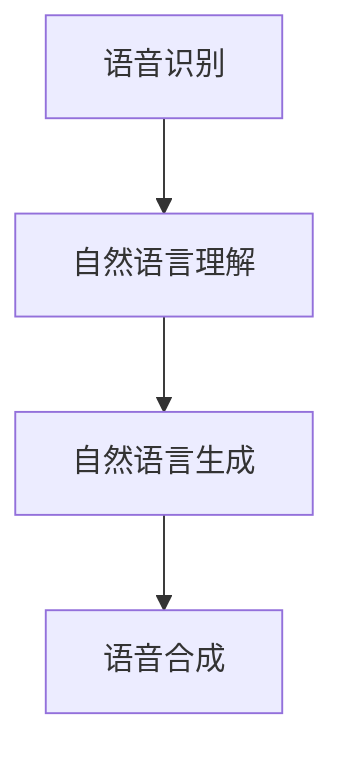

                 

关键词：智能客户服务，质量评估，自然语言处理，一人公司，服务水平，提升，技术工具

摘要：随着人工智能技术的快速发展，自然语言处理技术在智能客户服务领域的应用日益广泛。本文将探讨如何利用自然语言处理工具，帮助一人公司实现客户服务质量的持续提升，从而在竞争激烈的市场中脱颖而出。

## 1. 背景介绍

### 1.1 一人公司的挑战

在当今的商业环境中，竞争异常激烈，企业需要不断提升客户服务质量以保持竞争力。对于一人公司来说，资源有限、人力资源薄弱，使得提高客户服务质量成为一大挑战。然而，客户服务质量的高低直接影响公司的品牌形象和客户满意度，因此，如何有效提升客户服务质量成为一人公司亟待解决的问题。

### 1.2 自然语言处理技术的发展

近年来，自然语言处理（Natural Language Processing, NLP）技术在人工智能领域取得了显著进展。NLP技术可以理解、解释和生成人类语言，从而在智能客户服务领域发挥了重要作用。通过引入NLP技术，一人公司可以实现自动化客户服务，降低运营成本，提高服务效率。

## 2. 核心概念与联系

### 2.1 NLP技术核心概念

#### 2.1.1 语音识别

语音识别是将语音信号转换为文本信息的技术，实现人机交互的关键步骤。

#### 2.1.2 语音合成

语音合成是将文本信息转换为语音信号的技术，实现语音交互的重要手段。

#### 2.1.3 自然语言理解

自然语言理解是NLP技术的核心，旨在理解人类语言中的语义、句法和语境。

#### 2.1.4 自然语言生成

自然语言生成是将机器理解的信息转换为自然语言表达的技术，实现智能对话系统。

### 2.2 NLP技术架构



## 3. 核心算法原理 & 具体操作步骤

### 3.1 算法原理概述

NLP技术的核心算法主要包括：

- **分词**：将输入文本切分成有意义的词语。
- **词性标注**：识别词语的词性，如名词、动词等。
- **命名实体识别**：识别文本中的特定实体，如人名、地名等。
- **句法分析**：分析文本中的语法结构，理解句子的组成。
- **语义分析**：理解句子的语义，提取关键信息。

### 3.2 算法步骤详解

1. **数据预处理**：对原始文本进行清洗、去噪和格式化。
2. **分词**：使用分词算法将文本切分成词语。
3. **词性标注**：对切分后的词语进行词性标注。
4. **命名实体识别**：识别文本中的特定实体。
5. **句法分析**：分析文本中的语法结构。
6. **语义分析**：提取文本的关键信息。

### 3.3 算法优缺点

**优点：**

- **高效性**：NLP技术可以实现自动化处理，提高工作效率。
- **准确性**：随着算法的不断优化，NLP技术的准确率不断提高。
- **灵活性**：NLP技术可以应用于多种场景，如客服、推荐系统、智能问答等。

**缺点：**

- **复杂性**：NLP技术涉及多种算法和模型，开发难度较大。
- **成本**：训练高质量的NLP模型需要大量数据和计算资源。

### 3.4 算法应用领域

NLP技术广泛应用于以下领域：

- **智能客服**：通过NLP技术实现智能客服，提高客户服务质量。
- **推荐系统**：基于用户的历史行为和偏好，为用户推荐感兴趣的内容。
- **智能问答**：通过NLP技术实现智能问答系统，为用户提供快速准确的答案。
- **自然语言生成**：生成新闻、报告、书籍等文本内容。

## 4. 数学模型和公式 & 详细讲解 & 举例说明

### 4.1 数学模型构建

NLP技术涉及多种数学模型，如：

- **神经网络**：用于表示和识别文本中的特征。
- **生成对抗网络（GAN）**：用于生成高质量的文本数据。
- **长短时记忆网络（LSTM）**：用于处理长文本序列。

### 4.2 公式推导过程

#### 4.2.1 神经网络

神经网络由多层神经元组成，每个神经元接受输入，通过激活函数计算输出。设神经网络的输入为 $X$，输出为 $Y$，则：

$$
Y = \sigma(WX + b)
$$

其中，$\sigma$ 为激活函数，$W$ 为权重矩阵，$b$ 为偏置。

#### 4.2.2 生成对抗网络（GAN）

GAN由生成器 $G$ 和判别器 $D$ 组成，生成器 $G$ 生成虚假数据，判别器 $D$ 判断数据是真实还是虚假。GAN的目标是使得判别器无法区分真实数据和虚假数据。设生成器的损失函数为 $L_G$，判别器的损失函数为 $L_D$，则：

$$
L_G = \mathbb{E}_{z \sim p_z(z)}[\log(D(G(z))]
$$

$$
L_D = \mathbb{E}_{x \sim p_x(x)}[\log(D(x))] + \mathbb{E}_{z \sim p_z(z)}[\log(1 - D(G(z))]
$$

### 4.3 案例分析与讲解

假设我们要构建一个智能客服系统，利用NLP技术处理客户的问题，并提供合适的回答。首先，我们需要收集大量的客户问题及其答案作为训练数据。然后，我们可以使用神经网络模型对数据进行分析和训练，从而实现智能客服的功能。

## 5. 项目实践：代码实例和详细解释说明

### 5.1 开发环境搭建

- **编程语言**：Python
- **依赖库**：TensorFlow、Keras、NLTK

### 5.2 源代码详细实现

```python
import tensorflow as tf
from tensorflow.keras.models import Sequential
from tensorflow.keras.layers import Dense, LSTM, Embedding
from tensorflow.keras.preprocessing.text import Tokenizer
from tensorflow.keras.preprocessing.sequence import pad_sequences

# 数据预处理
tokenizer = Tokenizer(num_words=10000)
tokenizer.fit_on_texts(texts)
sequences = tokenizer.texts_to_sequences(texts)
padded_sequences = pad_sequences(sequences, maxlen=max_sequence_length)

# 构建神经网络模型
model = Sequential()
model.add(Embedding(num_words, embedding_dim, input_length=max_sequence_length))
model.add(LSTM(128))
model.add(Dense(1, activation='sigmoid'))

# 编译模型
model.compile(optimizer='adam', loss='binary_crossentropy', metrics=['accuracy'])

# 训练模型
model.fit(padded_sequences, labels, epochs=10, batch_size=32)
```

### 5.3 代码解读与分析

该代码实现了一个简单的文本分类模型，用于判断客户问题的类型。首先，我们使用 Tokenizer 对文本数据进行预处理，然后使用 LSTM 层对文本进行编码，最后使用 Dense 层输出分类结果。

### 5.4 运行结果展示

```python
# 预测新问题的类型
new_problem = "我的订单怎么还没到？"
new_sequence = tokenizer.texts_to_sequences([new_problem])
new_padded_sequence = pad_sequences(new_sequence, maxlen=max_sequence_length)
prediction = model.predict(new_padded_sequence)
print(prediction)
```

## 6. 实际应用场景

### 6.1 智能客服

智能客服是NLP技术在客户服务领域的重要应用。通过引入NLP技术，智能客服可以实现快速响应客户问题，提供个性化服务，提高客户满意度。

### 6.2 智能推荐系统

智能推荐系统利用NLP技术分析用户的历史行为和偏好，为用户推荐感兴趣的内容。这种应用可以大大提高用户体验，提升用户粘性。

### 6.3 智能问答系统

智能问答系统通过NLP技术实现自动回答用户问题。这种系统在各个领域都有广泛的应用，如在线教育、医疗咨询等。

## 7. 工具和资源推荐

### 7.1 学习资源推荐

- 《自然语言处理综论》（Speech and Language Processing）
- 《深度学习》（Deep Learning）

### 7.2 开发工具推荐

- TensorFlow
- Keras

### 7.3 相关论文推荐

- "Generative Adversarial Nets"
- "Recurrent Neural Networks for Language Modeling"

## 8. 总结：未来发展趋势与挑战

### 8.1 研究成果总结

NLP技术在智能客户服务领域取得了显著成果，为一人公司提供了有效的解决方案。未来，NLP技术将继续发展，带来更多创新应用。

### 8.2 未来发展趋势

- **多语言支持**：随着全球化的推进，多语言支持将成为NLP技术的重要发展方向。
- **跨模态融合**：融合多种模态（如文本、图像、音频）的信息，提高NLP技术的准确性和实用性。

### 8.3 面临的挑战

- **数据隐私**：如何确保数据隐私和安全是NLP技术面临的挑战。
- **多语言理解**：跨语言理解是实现全球化应用的关键，但目前仍存在一定困难。

### 8.4 研究展望

未来，NLP技术将不断突破，为各行业提供更智能、更高效的服务。一人公司可以利用NLP技术不断提升客户服务质量，实现可持续发展。

## 9. 附录：常见问题与解答

### 9.1 NLP技术的核心算法有哪些？

NLP技术的核心算法包括分词、词性标注、命名实体识别、句法分析和语义分析。

### 9.2 如何提高NLP技术的准确率？

提高NLP技术的准确率可以从以下几个方面着手：

- **数据质量**：使用高质量的数据进行训练。
- **模型优化**：不断优化模型结构和参数。
- **预训练**：利用预训练模型进行迁移学习。

作者：禅与计算机程序设计艺术 / Zen and the Art of Computer Programming
----------------------------------------------------------------


