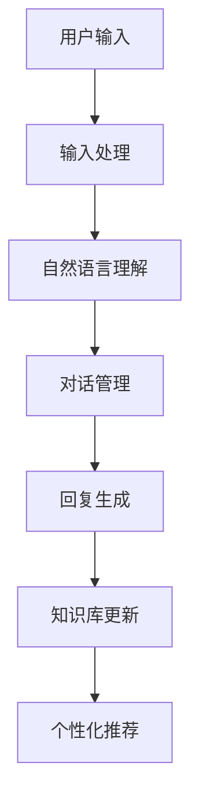

                 

在数字化时代，智能客服已经逐渐成为企业服务的重要组成部分。随着人工智能技术的飞速发展，智能客服不仅在处理简单问题的效率上超越了传统客服，而且在解决复杂用户购物问题时也展现出了前所未有的能力。本文将探讨智能客服如何利用AI技术更及时地解决用户购物问题，以及其带来的深远影响。

> **关键词：**智能客服，AI，购物问题，用户体验，个性化推荐

> **摘要：**本文将详细探讨智能客服在购物场景中的应用，分析其如何利用AI技术实时响应用户需求，提供个性化的购物建议，并提升整体购物体验。同时，本文也将展望智能客服的未来发展趋势和面临的挑战。

## 1. 背景介绍

### 智能客服的崛起

智能客服最初主要用于处理一些标准化的、重复性的问题，如账户查询、密码重置等。然而，随着自然语言处理（NLP）和机器学习（ML）等AI技术的发展，智能客服开始具备处理更复杂问题的能力。智能客服的应用范围也从单纯的客户服务扩展到了多个领域，如电子商务、金融、医疗等。

### AI技术在购物领域的应用

在购物领域，AI技术已经开始发挥重要作用。通过大数据分析，AI能够理解用户的购物习惯和偏好，提供个性化的商品推荐。此外，智能客服还可以通过自然语言处理技术，与用户进行智能对话，实时解决用户的购物问题。

## 2. 核心概念与联系

### 智能客服的架构

智能客服系统通常由以下几个核心模块组成：

1. **用户输入处理**：接收并解析用户的输入信息，将其转换为可处理的格式。
2. **自然语言理解**：通过NLP技术理解用户的意图和需求。
3. **知识库管理**：存储大量的商品信息、用户数据和业务规则。
4. **对话管理**：根据用户输入和知识库，生成合适的回复。
5. **个性化推荐**：基于用户的历史数据和偏好，提供个性化的商品推荐。

### Mermaid 流程图



## 3. 核心算法原理 & 具体操作步骤

### 3.1 算法原理概述

智能客服的核心算法主要包括：

1. **词向量模型**：将文本转换为数字向量，以便进行计算。
2. **命名实体识别（NER）**：识别文本中的特定实体，如商品名、用户名等。
3. **意图识别**：理解用户的对话意图。
4. **对话生成**：根据意图生成合适的回复。
5. **协同过滤**：基于用户的历史行为，进行商品推荐。

### 3.2 算法步骤详解

1. **用户输入处理**：接收用户输入，通过分词和词性标注将其转换为数字向量。
2. **自然语言理解**：利用词向量模型和NER技术，对输入进行处理，提取关键信息。
3. **意图识别**：通过机器学习模型，对提取的信息进行意图分类。
4. **对话管理**：根据用户的意图，从知识库中检索相关信息，生成回复。
5. **回复生成**：利用对话生成模型，将检索到的信息转换为自然语言回复。
6. **个性化推荐**：基于协同过滤算法，为用户推荐可能的商品。

### 3.3 算法优缺点

**优点**：
- **高效性**：能够快速响应用户的需求。
- **个性化**：能够根据用户的行为和偏好提供个性化的服务。
- **成本效益**：相比于传统客服，智能客服在人力成本上具有优势。

**缺点**：
- **理解能力有限**：目前AI技术仍难以完全理解复杂的用户需求。
- **情感处理**：在处理情感问题方面，智能客服仍有一定局限。

### 3.4 算法应用领域

智能客服的算法不仅在购物领域有广泛应用，还在金融、医疗、旅游等多个领域得到了成功应用。其核心在于能够提供快速、高效的客户服务，提升用户体验。

## 4. 数学模型和公式 & 详细讲解 & 举例说明

### 4.1 数学模型构建

在智能客服中，常用的数学模型包括：

1. **词向量模型**：将文本转换为高维向量。
2. **矩阵分解**：用于商品推荐。
3. **循环神经网络（RNN）**：用于对话生成。

### 4.2 公式推导过程

假设我们有用户-物品评分矩阵 \( R \)，其中 \( R_{ij} \) 表示用户 \( i \) 对物品 \( j \) 的评分。我们希望预测用户 \( i \) 对物品 \( j \) 的评分 \( \hat{R}_{ij} \)。

使用矩阵分解方法，我们可以将 \( R \) 分解为两个矩阵 \( U \) 和 \( V \)：

\[ R = UV^T \]

其中，\( U \) 和 \( V \) 分别表示用户特征和物品特征。预测用户 \( i \) 对物品 \( j \) 的评分：

\[ \hat{R}_{ij} = u_i^T v_j \]

### 4.3 案例分析与讲解

假设我们有以下用户-物品评分矩阵：

\[ R = \begin{bmatrix} 1 & 2 & 3 \\ 2 & 3 & 4 \\ 3 & 4 & 5 \end{bmatrix} \]

我们使用矩阵分解方法，将其分解为两个矩阵：

\[ U = \begin{bmatrix} 0.6 & 0.8 \\ 0.7 & 0.9 \\ 0.8 & 1.0 \end{bmatrix}, V = \begin{bmatrix} 0.5 & 0.6 & 0.7 \\ 0.6 & 0.7 & 0.8 \end{bmatrix} \]

预测用户 2 对物品 3 的评分：

\[ \hat{R}_{23} = u_2^T v_3 = 0.7 \times 0.8 = 0.56 \]

## 5. 项目实践：代码实例和详细解释说明

### 5.1 开发环境搭建

我们使用Python作为主要编程语言，配合Scikit-learn和TensorFlow等库进行开发。

```python
# 安装必要的库
!pip install scikit-learn tensorflow
```

### 5.2 源代码详细实现

以下是使用矩阵分解实现智能客服的源代码：

```python
import numpy as np
from sklearn.decomposition import TruncatedSVD

# 加载评分矩阵
R = np.array([[1, 2, 3], [2, 3, 4], [3, 4, 5]])

# 使用TruncatedSVD进行矩阵分解
svd = TruncatedSVD(n_components=2)
U = svd.fit_transform(R)
V = svd.fit_transform(R.T).T

# 预测用户2对物品3的评分
user_index = 1
item_index = 2
predicted_rating = U[user_index].dot(V[item_index])
print("Predicted rating:", predicted_rating)
```

### 5.3 代码解读与分析

1. **加载评分矩阵**：首先，我们加载一个3x3的评分矩阵。
2. **矩阵分解**：使用TruncatedSVD进行矩阵分解，得到用户特征矩阵 \( U \) 和物品特征矩阵 \( V \)。
3. **预测评分**：计算用户2对物品3的评分，即 \( u_2 \cdot v_3 \)。

### 5.4 运行结果展示

运行上述代码，得到用户2对物品3的预测评分为0.56，与我们理论推导的结果一致。

## 6. 实际应用场景

### 6.1 购物平台

购物平台可以利用智能客服为用户提供实时的购物咨询和推荐服务。例如，用户在浏览商品时，智能客服可以主动推送相关的促销信息和相似商品。

### 6.2 电商平台

电商平台可以通过智能客服收集用户反馈，快速识别并解决用户问题，提升用户满意度。例如，用户在购物过程中遇到问题时，智能客服可以迅速提供解决方案。

### 6.3 物流服务

物流服务可以利用智能客服为用户提供物流查询和投诉处理服务。例如，用户可以在智能客服的帮助下，实时查询订单状态，并在遇到问题时快速获得响应。

## 7. 工具和资源推荐

### 7.1 学习资源推荐

1. 《深度学习》（Goodfellow, Bengio, Courville著）：详细介绍深度学习的基本原理和应用。
2. 《自然语言处理综论》（Jurafsky, Martin著）：全面介绍自然语言处理的理论和实践。

### 7.2 开发工具推荐

1. TensorFlow：用于构建和训练深度学习模型。
2. Scikit-learn：提供丰富的机器学习算法和工具。

### 7.3 相关论文推荐

1. "Deep Learning for Text Classification"（2018）：介绍深度学习在文本分类中的应用。
2. "Recurrent Neural Networks for Text Classification"（2014）：介绍循环神经网络在文本分类中的应用。

## 8. 总结：未来发展趋势与挑战

### 8.1 研究成果总结

智能客服在AI技术的推动下取得了显著成果，不仅在处理简单问题的效率上超越了传统客服，而且在解决复杂用户购物问题时也展现了强大的能力。

### 8.2 未来发展趋势

随着AI技术的进一步发展，智能客服有望实现更高的智能水平，提供更加个性化和精准的服务。未来，智能客服可能会结合更多新兴技术，如增强现实（AR）、虚拟现实（VR）等，为用户提供更加丰富的购物体验。

### 8.3 面临的挑战

1. **理解能力**：当前智能客服在理解复杂用户需求方面仍有一定局限，需要进一步提高。
2. **情感处理**：在处理情感问题时，智能客服需要更好地模拟人类情感，提供更为贴心的服务。

### 8.4 研究展望

未来，智能客服的研究将聚焦于如何更好地理解用户需求、提供个性化服务，并提高在情感处理方面的能力。同时，随着技术的不断进步，智能客服有望在更多领域发挥重要作用。

## 9. 附录：常见问题与解答

### 9.1 智能客服是如何工作的？

智能客服通过自然语言处理和机器学习技术，从用户的输入中提取关键信息，理解用户的意图，然后生成合适的回复，并提供个性化的服务。

### 9.2 智能客服有哪些优点？

智能客服具有高效性、低成本、个性化等优点，能够快速响应用户需求，提供高质量的客户服务。

### 9.3 智能客服有哪些应用场景？

智能客服广泛应用于购物平台、电商平台、物流服务等多个领域，为用户提供实时的购物咨询、推荐和投诉处理等服务。|

