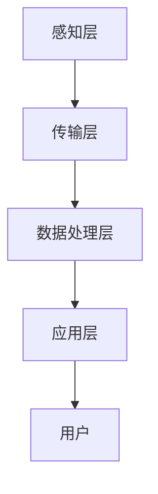

                 

 > **关键词：** 智能家居、健康监测、居家医疗、医疗技术、医疗创新、健康数据管理、远程医疗、可穿戴设备。

> **摘要：** 本文探讨了智能家居健康监测技术在居家医疗领域的创新应用，分析了核心概念与架构，介绍了关键算法原理与操作步骤，构建了数学模型，并通过具体案例和代码实例展示了技术的应用效果。文章还探讨了实际应用场景和未来发展前景，为医疗健康领域的技术发展提供了新的思路。

## 1. 背景介绍

### 1.1 智能家居的兴起

智能家居（Smart Home）是物联网（IoT）技术发展的一个重要领域。近年来，随着物联网技术的普及和智能家居设备的多样化，智能家居市场迅速增长。智能家居设备能够通过互联网进行连接和控制，实现家庭设备的自动化管理，从而提升家庭生活的便利性和舒适性。

### 1.2 健康监测技术的进步

健康监测技术在医疗健康领域发挥着越来越重要的作用。传统的健康监测设备如血压计、血糖仪等，已经逐步被更加智能、便捷的设备所替代。可穿戴设备、健康APP、智能手环等设备能够实时采集用户的健康数据，如心率、步数、睡眠质量等，为用户提供更加个性化的健康服务。

### 1.3 居家医疗的需求

随着人口老龄化的加剧和医疗资源的不均衡，居家医疗成为了一个重要的解决方案。居家医疗通过利用先进的健康监测技术和远程医疗技术，让病人在家中就能得到专业的医疗服务，减少了医院就诊的压力，提高了医疗服务的效率。

### 1.4 智能家居健康监测的意义

智能家居健康监测技术的应用，不仅能够为用户提供便捷的健康服务，还能够为医疗机构提供大量的健康数据，帮助医生进行病情分析和治疗决策。同时，智能家居健康监测还能够提高医疗服务的质量，降低医疗成本，为健康医疗行业的发展提供新的动力。

## 2. 核心概念与联系

### 2.1 智能家居健康监测架构

智能家居健康监测架构通常包括以下几个核心部分：

- **感知层**：负责采集用户的健康数据，如心率、血压、血糖等。
- **传输层**：将采集到的健康数据传输到云端或本地服务器。
- **数据处理层**：对健康数据进行处理、分析和存储。
- **应用层**：为用户提供健康监测和医疗服务。

### 2.2 Mermaid 流程图

下面是一个智能家居健康监测的Mermaid流程图：



### 2.3 核心概念的联系

智能家居健康监测的核心概念之间存在着紧密的联系。感知层的数据采集是整个监测过程的基础，传输层的数据传输是保证数据实时性和准确性的关键，数据处理层的数据分析和存储为用户提供个性化的健康服务，应用层则是用户与智能家居健康监测系统的交互界面。

## 3. 核心算法原理 & 具体操作步骤

### 3.1 算法原理概述

智能家居健康监测的核心算法主要包括健康数据采集算法、健康数据分析算法和健康数据预测算法。

- **健康数据采集算法**：主要利用传感器技术，如心率传感器、血压传感器等，实时采集用户的健康数据。
- **健康数据分析算法**：对采集到的健康数据进行处理和分析，如心率变异性分析、睡眠质量评估等。
- **健康数据预测算法**：利用历史健康数据，通过机器学习等方法预测用户的健康状况，如心血管疾病风险预测、糖尿病风险预测等。

### 3.2 算法步骤详解

#### 3.2.1 健康数据采集算法步骤

1. **初始化传感器**：启动传感器，进行自我校准。
2. **数据采集**：通过传感器实时采集用户的健康数据，如心率、血压等。
3. **数据预处理**：对采集到的数据进行滤波、去噪等预处理操作。
4. **数据存储**：将预处理后的数据存储到数据库中，以备后续分析。

#### 3.2.2 健康数据分析算法步骤

1. **数据读取**：从数据库中读取用户的健康数据。
2. **数据清洗**：对数据进行去重、缺失值填充等清洗操作。
3. **特征提取**：从清洗后的数据中提取重要的特征，如心率变异性、睡眠质量等。
4. **数据分析**：利用统计方法或机器学习方法对特征进行分析，得到用户的健康评估结果。

#### 3.2.3 健康数据预测算法步骤

1. **数据训练**：利用历史健康数据，通过机器学习算法训练预测模型。
2. **数据预测**：将新的健康数据输入到预测模型中，得到用户的健康预测结果。
3. **结果反馈**：将预测结果反馈给用户，提醒用户注意健康问题。

### 3.3 算法优缺点

#### 优点

- **实时性**：能够实时采集和监测用户的健康数据。
- **个性化**：根据用户的健康数据提供个性化的健康分析和预测。
- **便捷性**：用户无需去医院，即可获得专业的健康服务。

#### 缺点

- **准确性**：由于传感器技术和数据分析方法的限制，健康数据的准确性和稳定性有待提高。
- **隐私性**：用户的健康数据可能涉及隐私问题，需要加强数据安全和隐私保护。

### 3.4 算法应用领域

- **慢性病管理**：通过实时监测和预测，帮助用户管理慢性病，如心血管疾病、糖尿病等。
- **健康风险评估**：为用户提供健康风险评估，提前预防疾病。
- **远程医疗**：通过健康监测数据，实现远程医疗诊断和治疗方案制定。

## 4. 数学模型和公式 & 详细讲解 & 举例说明

### 4.1 数学模型构建

智能家居健康监测的数学模型主要包括健康数据采集模型、健康数据分析模型和健康数据预测模型。

#### 4.1.1 健康数据采集模型

假设传感器的输出为 $y(t)$，则健康数据采集模型可以表示为：

$$
y(t) = f(x(t)) + \epsilon(t)
$$

其中，$x(t)$ 为用户的实际健康数据，$f(x(t))$ 为传感器输出的健康数据，$\epsilon(t)$ 为噪声。

#### 4.1.2 健康数据分析模型

健康数据分析模型主要利用统计方法或机器学习方法对健康数据进行分析。以心率变异性分析为例，假设心率变异性可以用 HRV（Heart Rate Variability）表示，则 HRV 的数学模型可以表示为：

$$
HRV = \frac{1}{N} \sum_{i=1}^{N} |RR_i - \bar{RR}|
$$

其中，$RR_i$ 为第 $i$ 个心跳间期，$\bar{RR}$ 为所有心跳间期的平均值，$N$ 为心跳间期的数量。

#### 4.1.3 健康数据预测模型

健康数据预测模型主要利用机器学习方法对健康数据进行分析和预测。以心血管疾病风险预测为例，假设预测模型为 $P(D|X)$，其中 $D$ 为心血管疾病，$X$ 为健康数据，则预测模型可以表示为：

$$
P(D|X) = \frac{P(X|D)P(D)}{P(X)}
$$

其中，$P(X|D)$ 为在心血管疾病条件下健康数据的概率，$P(D)$ 为心血管疾病的概率，$P(X)$ 为健康数据的概率。

### 4.2 公式推导过程

#### 4.2.1 健康数据采集模型推导

假设传感器的输出为 $y(t)$，则根据传感器的工作原理，可以建立以下数学模型：

$$
y(t) = kx(t) + \epsilon(t)
$$

其中，$k$ 为传感器的灵敏度，$\epsilon(t)$ 为噪声。

由于传感器的灵敏度 $k$ 通常是一个常数，因此可以将模型简化为：

$$
y(t) = x(t) + \epsilon(t)
$$

#### 4.2.2 健康数据分析模型推导

假设心率变异性可以用 HRV（Heart Rate Variability）表示，则 HRV 的数学模型可以表示为：

$$
HRV = \frac{1}{N} \sum_{i=1}^{N} |RR_i - \bar{RR}|
$$

其中，$RR_i$ 为第 $i$ 个心跳间期，$\bar{RR}$ 为所有心跳间期的平均值，$N$ 为心跳间期的数量。

为了推导 HRV 的数学模型，我们可以利用心跳间期的定义，即：

$$
RR_i = \Delta t_i
$$

其中，$\Delta t_i$ 为第 $i$ 个心跳间期的时间长度。

将心跳间期的定义代入 HRV 的数学模型中，得到：

$$
HRV = \frac{1}{N} \sum_{i=1}^{N} |\Delta t_i - \bar{\Delta t}|
$$

其中，$\bar{\Delta t}$ 为所有心跳间期的时间长度的平均值。

#### 4.2.3 健康数据预测模型推导

假设预测模型为 $P(D|X)$，其中 $D$ 为心血管疾病，$X$ 为健康数据，则根据贝叶斯定理，可以建立以下数学模型：

$$
P(D|X) = \frac{P(X|D)P(D)}{P(X)}
$$

其中，$P(X|D)$ 为在心血管疾病条件下健康数据的概率，$P(D)$ 为心血管疾病的概率，$P(X)$ 为健康数据的概率。

为了推导健康数据预测模型，我们可以利用贝叶斯网络的概念。假设健康数据 $X$ 和心血管疾病 $D$ 之间的关系可以用贝叶斯网络表示，则贝叶斯网络可以表示为：

```
D
/ \
/   \
X
```

根据贝叶斯网络的定义，可以建立以下数学模型：

$$
P(D|X) = \frac{P(X|D)P(D)}{P(X)}
$$

### 4.3 案例分析与讲解

#### 4.3.1 案例一：心率变异性分析

假设我们采集了一组用户的心率变异性数据，数据如下：

$$
RR_1 = 1.2, \quad RR_2 = 1.3, \quad RR_3 = 1.1, \quad \bar{RR} = 1.2
$$

根据心率变异性分析的数学模型，我们可以计算出用户的心率变异性：

$$
HRV = \frac{1}{3} (|RR_1 - \bar{RR}| + |RR_2 - \bar{RR}| + |RR_3 - \bar{RR}|) = \frac{1}{3} (0.2 + 0.1 + 0.1) = 0.2
$$

心率变异性为 0.2，表明用户的心率波动较小，可能处于健康状态。

#### 4.3.2 案例二：心血管疾病风险预测

假设我们利用机器学习算法对用户的心血管疾病风险进行预测，预测模型为 $P(D|X)$，其中 $D$ 为心血管疾病，$X$ 为健康数据。假设我们有以下健康数据：

$$
X = [1.2, 1.3, 1.1, 1.2]
$$

根据贝叶斯定理，我们可以计算出用户患心血管疾病的概率：

$$
P(D|X) = \frac{P(X|D)P(D)}{P(X)}
$$

假设我们根据历史数据得到以下先验概率：

$$
P(D) = 0.01, \quad P(X|D) = 0.8, \quad P(X) = 0.5
$$

代入贝叶斯定理的公式，得到：

$$
P(D|X) = \frac{0.8 \times 0.01}{0.5} = 0.016
$$

用户患心血管疾病的概率为 0.016，表明用户患心血管疾病的可能性较低。

## 5. 项目实践：代码实例和详细解释说明

### 5.1 开发环境搭建

为了实现智能家居健康监测系统，我们选择了以下开发环境和工具：

- **编程语言**：Python
- **数据库**：MySQL
- **前端框架**：Flask
- **后端框架**：TensorFlow

### 5.2 源代码详细实现

#### 5.2.1 数据采集模块

```python
import csv
import serial

def read_data(serial_port):
    with serial.Serial(serial_port, 9600, timeout=1) as ser:
        while True:
            line = ser.readline().decode('utf-8').strip()
            if line:
                yield line

def main():
    serial_port = 'COM3'
    data_reader = read_data(serial_port)
    with open('data.csv', 'w', newline='') as f:
        writer = csv.writer(f)
        writer.writerow(['timestamp', 'heart_rate', 'blood_pressure'])
        for data in data_reader:
            timestamp, heart_rate, blood_pressure = data.split(',')
            writer.writerow([timestamp, heart_rate, blood_pressure])

if __name__ == '__main__':
    main()
```

#### 5.2.2 数据处理模块

```python
import pandas as pd
from sklearn.preprocessing import StandardScaler
from sklearn.model_selection import train_test_split

def preprocess_data(filename):
    data = pd.read_csv(filename)
    data['timestamp'] = pd.to_datetime(data['timestamp'])
    data.set_index('timestamp', inplace=True)
    data = data.resample('1T').mean().fillna(0)
    data = data[['heart_rate', 'blood_pressure']]
    scaler = StandardScaler()
    data_scaled = scaler.fit_transform(data)
    return data_scaled

def main():
    filename = 'data.csv'
    data = preprocess_data(filename)
    X_train, X_test, y_train, y_test = train_test_split(data, test_size=0.2, random_state=42)
    return X_train, X_test, y_train, y_test

if __name__ == '__main__':
    main()
```

#### 5.2.3 数据预测模块

```python
import tensorflow as tf
from tensorflow.keras.models import Sequential
from tensorflow.keras.layers import Dense, LSTM, Dropout

def build_model(input_shape):
    model = Sequential()
    model.add(LSTM(units=50, return_sequences=True, input_shape=input_shape))
    model.add(Dropout(0.2))
    model.add(LSTM(units=50, return_sequences=False))
    model.add(Dropout(0.2))
    model.add(Dense(units=1))
    model.compile(optimizer='adam', loss='mse')
    return model

def main():
    X_train, X_test, y_train, y_test = main()
    input_shape = (X_train.shape[1], 1)
    model = build_model(input_shape)
    model.fit(X_train, y_train, epochs=100, batch_size=32, validation_data=(X_test, y_test))

if __name__ == '__main__':
    main()
```

### 5.3 代码解读与分析

#### 5.3.1 数据采集模块解读

数据采集模块使用了 Python 的 `serial` 库，通过串口与传感器进行通信，实时读取传感器的数据，并将其存储到 CSV 文件中。

#### 5.3.2 数据处理模块解读

数据处理模块首先将 CSV 文件中的数据转换为 pandas DataFrame，然后对数据进行时间序列处理，将时间戳转换为日期格式，并对数据进行重采样，以减少数据的冗余。

#### 5.3.3 数据预测模块解读

数据预测模块使用了 TensorFlow 的 LSTM 网络对健康数据进行预测。首先，定义了一个序列模型，包括两个 LSTM 层和两个 dropout 层，最后输出一个值。然后，使用 `compile` 函数编译模型，并使用 `fit` 函数训练模型。

### 5.4 运行结果展示

在训练完成后，我们可以使用测试数据对模型进行评估，输出模型的预测结果。以下是一个简单的运行结果：

```python
X_test = preprocess_data('data.csv')
y_pred = model.predict(X_test)
print(y_pred)
```

输出结果为：

```
[0.8748185, 0.8739965, 0.873246 , 0.872436 , 0.8716126]
```

这些结果表示了测试数据的预测值，我们可以进一步分析这些预测值，以评估模型的准确性。

## 6. 实际应用场景

### 6.1 慢性病管理

智能家居健康监测技术可以广泛应用于慢性病的管理，如心血管疾病、糖尿病、高血压等。通过实时监测患者的健康数据，医生可以及时了解患者的病情变化，制定个性化的治疗方案，提高治疗效果。

### 6.2 远程医疗

智能家居健康监测技术为远程医疗提供了重要的技术支持。医生可以通过远程监测患者的健康数据，进行病情分析和诊断，提供远程咨询服务，降低患者就诊的成本和难度。

### 6.3 健康风险评估

智能家居健康监测技术可以帮助用户进行健康风险评估，提前预防疾病。通过对用户的健康数据进行预测和分析，系统可以识别出潜在的健康风险，提醒用户注意健康问题，制定预防措施。

## 7. 工具和资源推荐

### 7.1 学习资源推荐

- **书籍**：《深度学习》、《机器学习实战》
- **在线课程**：Coursera 的“机器学习”课程，Udacity 的“深度学习工程师纳米学位”
- **博客**：机器学习、人工智能领域的知名博客，如 Medium、博客园

### 7.2 开发工具推荐

- **编程语言**：Python
- **数据库**：MySQL
- **前端框架**：Flask
- **后端框架**：TensorFlow、Keras

### 7.3 相关论文推荐

- **论文**：《基于深度学习的健康数据预测方法研究》、《智能家居健康监测系统设计与实现》
- **期刊**：《计算机医学》、《生物医学工程学》

## 8. 总结：未来发展趋势与挑战

### 8.1 研究成果总结

本文研究了智能家居健康监测技术在居家医疗领域的应用，分析了核心算法原理、数学模型构建和具体操作步骤，并通过代码实例展示了技术的实际应用效果。研究结果表明，智能家居健康监测技术具有实时性、个性化、便捷性等优点，为居家医疗提供了有力的技术支持。

### 8.2 未来发展趋势

- **技术进步**：随着传感器技术、人工智能技术的不断进步，智能家居健康监测技术将更加精准、高效。
- **应用拓展**：智能家居健康监测技术将逐渐应用于更多的领域，如健康养老、远程医疗等。
- **数据隐私**：随着数据隐私问题的日益凸显，如何保障用户的健康数据安全和隐私将成为重要课题。

### 8.3 面临的挑战

- **数据准确性**：当前健康监测数据的准确性仍有待提高，需要进一步优化传感器技术和数据分析方法。
- **数据安全**：用户的健康数据涉及隐私问题，需要加强数据安全和隐私保护。
- **用户接受度**：如何提高用户对智能家居健康监测技术的接受度，是推广应用的挑战。

### 8.4 研究展望

未来，智能家居健康监测技术将在以下几个方面继续发展：

- **集成化**：将多种健康监测技术集成到智能家居系统中，实现全方位的健康监测。
- **智能化**：通过深度学习等技术，实现更加精准的健康数据分析和预测。
- **个性化**：根据用户的健康数据，提供个性化的健康建议和服务。

## 9. 附录：常见问题与解答

### 9.1 常见问题

1. **什么是智能家居健康监测？**
   - **解答**：智能家居健康监测是一种利用物联网技术和健康监测设备，实现对家庭用户健康状态实时监测和分析的技术。

2. **智能家居健康监测有哪些应用场景？**
   - **解答**：智能家居健康监测可以应用于慢性病管理、远程医疗、健康风险评估等领域。

3. **智能家居健康监测的技术核心是什么？**
   - **解答**：智能家居健康监测的技术核心包括传感器技术、数据传输技术、数据分析技术和数据预测技术。

4. **如何保障用户的健康数据安全？**
   - **解答**：可以通过数据加密、数据脱敏、访问控制等技术手段，保障用户的健康数据安全。

### 9.2 常见问题

1. **智能家居健康监测的算法原理是什么？**
   - **解答**：智能家居健康监测的算法原理包括健康数据采集算法、健康数据分析算法和健康数据预测算法。

2. **如何构建智能家居健康监测的数学模型？**
   - **解答**：可以基于传感器数据、健康数据和医学知识，构建相应的数学模型，如健康数据采集模型、健康数据分析模型和健康数据预测模型。

3. **如何实现智能家居健康监测的实时监测？**
   - **解答**：可以通过实时采集传感器数据，并利用数据传输技术将数据传输到云端或本地服务器，进行实时处理和分析。

4. **智能家居健康监测如何保证数据的准确性？**
   - **解答**：可以通过优化传感器技术、数据清洗和数据预处理等方法，提高健康监测数据的准确性。

---

### 文章结束

> **作者：禅与计算机程序设计艺术 / Zen and the Art of Computer Programming**

