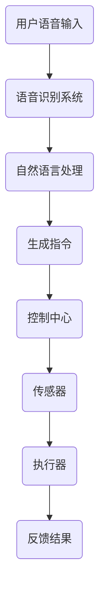

                 

关键词：智能家居、声控技术、语音交互、创业、生活方式

> 摘要：随着人工智能技术的快速发展，智能家居声控逐渐成为现代生活的趋势。本文将探讨智能家居声控技术的核心概念、算法原理、数学模型，并通过实际项目实践，解析这一领域的未来应用前景。

## 1. 背景介绍

随着物联网（IoT）和人工智能技术的迅猛发展，智能家居已经成为现代科技生活的重要组成部分。用户可以通过手机APP、语音助手等多种方式与家居设备互动，实现远程控制、自动化调节等功能。然而，语音交互作为智能家居中最具人性化的交互方式，正在逐渐取代传统的手动控制，成为主流。

声控技术不仅仅局限于家居设备的控制，它还能够通过语音识别、自然语言处理等技术，实现更广泛的应用场景。例如，智能音箱、智能电视、智能机器人等设备，都在不断引入更加精准和自然的语音交互功能。

### 1.1 声控技术的发展历史

声控技术的历史可以追溯到20世纪中叶。早在1952年，IBM的工程师就展示了世界上第一个语音识别系统。然而，由于技术的局限，早期的声控系统效果并不理想，只能识别简单的单词和短语。

随着计算机性能的不断提高和语音识别技术的不断进步，20世纪末至21世纪初，语音识别系统的准确率得到了显著提升。特别是深度学习技术的引入，使得语音识别系统变得更加智能和高效。

### 1.2 声控技术的现状

目前，声控技术已经广泛应用于智能手机、智能音箱、智能电视、智能家居设备等多个领域。各大科技公司纷纷推出自己的语音助手，如苹果的Siri、谷歌的Google Assistant、亚马逊的Alexa等。这些语音助手不仅能够完成简单的任务，如播放音乐、查询天气，还能够进行复杂的交互，如智能家居设备的控制、语音翻译、语音搜索等。

## 2. 核心概念与联系

### 2.1 语音识别

语音识别是声控技术的核心环节，它的主要任务是识别用户的声音，并将其转换为文本或指令。语音识别技术涉及多个领域，包括信号处理、模式识别、自然语言处理等。

#### 2.1.1 语音信号处理

语音信号处理是语音识别的第一步，主要目的是将原始的音频信号转换为适合分析的形式。这一过程中，常用的方法包括滤波、采样、量化等。

#### .1.2 声学模型

声学模型用于描述语音信号中的声音特征。它通过分析大量的语音数据，提取出声音的声学特征，如音素、音节等。

#### 2.1.3 语言模型

语言模型用于对语音信号中的文本进行分析和理解。它通过分析大量的文本数据，构建出文本的统计模型，用于预测用户可能的表达方式。

### 2.2 自然语言处理

自然语言处理是语音识别结果的进一步处理，旨在将识别出的文本转换为计算机可执行的指令。自然语言处理涉及多个领域，包括词法分析、句法分析、语义分析等。

#### 2.2.1 词法分析

词法分析是将文本分解为单词或其他基本语言单元的过程。它有助于识别文本中的关键词和短语。

#### 2.2.2 句法分析

句法分析是将文本分解为句子结构的过程。它有助于理解文本的逻辑关系和语法结构。

#### 2.2.3 语义分析

语义分析是理解文本含义的过程。它有助于将文本转换为计算机可执行的指令。

### 2.3 智能家居系统架构

智能家居系统的架构通常包括以下几个部分：

- **控制中心**：通常是一台服务器或云端平台，用于接收用户的语音指令，并协调各个智能家居设备的操作。
- **传感器**：用于感知家居环境的状态，如温度、湿度、光线等。
- **执行器**：用于执行用户的语音指令，如开关灯具、调节空调等。
- **通信模块**：用于实现控制中心与传感器、执行器之间的通信。

### 2.4 Mermaid 流程图

下面是一个智能家居系统声控流程的 Mermaid 流程图：



## 3. 核心算法原理 & 具体操作步骤

### 3.1 算法原理概述

智能家居声控技术的核心算法主要包括语音识别、自然语言处理和智能家居控制算法。

- **语音识别**：通过信号处理技术，将用户的语音信号转换为文本。
- **自然语言处理**：通过对文本的分析，理解用户的意图，并将其转换为计算机可执行的指令。
- **智能家居控制算法**：根据用户的指令，协调智能家居设备的操作。

### 3.2 算法步骤详解

1. **语音识别**：

   - **预处理**：对语音信号进行降噪、增强等处理，以提高识别准确性。
   - **特征提取**：通过声学模型，从语音信号中提取出特征向量。
   - **模型匹配**：将提取出的特征向量与声学模型进行匹配，以识别出语音文本。

2. **自然语言处理**：

   - **词法分析**：将识别出的文本分解为单词或短语。
   - **句法分析**：构建句子的语法结构，以理解文本的逻辑关系。
   - **语义分析**：理解文本的含义，并将其转换为计算机可执行的指令。

3. **智能家居控制算法**：

   - **指令解析**：根据用户的指令，解析出需要执行的操作。
   - **设备调度**：根据指令，调度相应的智能家居设备进行操作。
   - **反馈生成**：将操作结果反馈给用户。

### 3.3 算法优缺点

- **优点**：

  - **便捷性**：用户可以通过语音指令，轻松控制家居设备，无需手动操作。

  - **智能化**：通过自然语言处理技术，系统能够理解用户的复杂指令，提供更加智能的服务。

  - **安全性**：通过生物识别技术，如语音、人脸等，确保用户的隐私和安全。

- **缺点**：

  - **准确性**：语音识别技术尚未完全成熟，存在一定的误识别率。

  - **延迟**：由于网络和计算资源的限制，系统的响应速度可能不够快。

### 3.4 算法应用领域

- **智能家居**：通过声控技术，用户可以远程控制家居设备，如灯光、空调、窗帘等。

- **智能助理**：通过语音交互，用户可以与智能助理进行对话，获取信息、完成任务。

- **智能客服**：通过语音交互，客服机器人可以自动回答用户的问题，提高服务效率。

## 4. 数学模型和公式 & 详细讲解 & 举例说明

### 4.1 数学模型构建

在智能家居声控系统中，常用的数学模型包括语音识别模型、自然语言处理模型和智能家居控制模型。

#### 4.1.1 语音识别模型

语音识别模型通常基于隐藏马尔可夫模型（HMM）或深度神经网络（DNN）。假设我们有训练好的声学模型和语言模型，可以使用以下公式表示语音识别模型：

$$
P(O|A) = \prod_{t=1}^T p(o_t|a_t)
$$

其中，$O$ 表示语音信号序列，$A$ 表示声学特征序列，$P(O|A)$ 表示在给定声学特征序列的情况下，语音信号序列的概率。

#### 4.1.2 自然语言处理模型

自然语言处理模型通常基于循环神经网络（RNN）或变压器（Transformer）。假设我们有训练好的词向量模型和语法分析模型，可以使用以下公式表示自然语言处理模型：

$$
P(T|S) = \prod_{t=1}^T p(t|s_t, h_{t-1})
$$

其中，$T$ 表示用户意图的文本序列，$S$ 表示语音信号序列，$h_t$ 表示在时刻 $t$ 的隐藏状态。

#### 4.1.3 智能家居控制模型

智能家居控制模型通常基于规则引擎或决策树。假设我们有训练好的控制规则库，可以使用以下公式表示智能家居控制模型：

$$
action = f(rule, state)
$$

其中，$action$ 表示需要执行的操作，$rule$ 表示控制规则，$state$ 表示家居设备的当前状态。

### 4.2 公式推导过程

以下是语音识别模型的公式推导过程：

1. **声学特征提取**：

   假设我们有 $T$ 个时刻的语音信号，每个时刻的语音信号可以表示为一个向量 $o_t$。通过声学模型，我们可以得到每个时刻的声学特征向量 $a_t$。

2. **声学特征概率分布**：

   假设声学模型是一个高斯分布，即：

   $$
   p(a_t|o_t) = \mathcal{N}(a_t; \mu(o_t), \Sigma(o_t))
   $$

   其中，$\mu(o_t)$ 和 $\Sigma(o_t)$ 分别表示在给定语音信号 $o_t$ 下的均值向量和协方差矩阵。

3. **语音信号概率分布**：

   假设语音信号服从马尔可夫过程，即：

   $$
   p(o_t|o_{<t}) = \prod_{t=1}^T p(o_t|o_{<t})
   $$

   其中，$o_{<t}$ 表示在时刻 $t$ 之前的语音信号。

4. **声学特征概率分布的归一化**：

   将声学特征概率分布进行归一化，得到：

   $$
   p(a_t|o_t) = \frac{\exp(-\frac{1}{2}(a_t - \mu(o_t))^T\Sigma^{-1}(o_t)(a_t - \mu(o_t)))}{\sqrt{(2\pi)^n|\Sigma(o_t)|}}
   $$

   其中，$n$ 表示特征向量的维度。

5. **语音信号概率分布的归一化**：

   将语音信号概率分布进行归一化，得到：

   $$
   p(o_t) = \frac{\exp(-\frac{1}{2}(o_t - \mu)^T\Sigma^{-1}(o_t - \mu))}{\sqrt{(2\pi)^n|\Sigma(o_t)|}}
   $$

   其中，$\mu$ 和 $\Sigma$ 分别表示所有语音信号的均值向量和协方差矩阵。

6. **语音识别模型的概率分布**：

   将声学特征概率分布和语音信号概率分布相乘，得到语音识别模型的概率分布：

   $$
   p(o_t|a_t) = \frac{\exp(-\frac{1}{2}(a_t - \mu(o_t))^T\Sigma^{-1}(o_t)(a_t - \mu(o_t)))\exp(-\frac{1}{2}(o_t - \mu)^T\Sigma^{-1}(o_t - \mu))}{\sqrt{(2\pi)^n|\Sigma(o_t)|}\sqrt{(2\pi)^n|\Sigma(o_t)|}}
   $$

   简化后，得到：

   $$
   p(o_t|a_t) = \frac{\exp(-\frac{1}{2}(a_t - \mu)^T\Sigma^{-1}(a_t - \mu))}{\sqrt{(2\pi)^n|\Sigma(a_t - \mu)|}}
   $$

### 4.3 案例分析与讲解

假设我们有一个语音识别任务，用户的语音信号为“打开灯”，声学特征序列为 $[0.1, 0.2, 0.3, 0.4]$，声学模型的均值向量和协方差矩阵分别为 $\mu = [0.2, 0.3, 0.4, 0.5]$ 和 $\Sigma = \begin{bmatrix} 0.1 & 0.2 \\ 0.2 & 0.3 \end{bmatrix}$。

根据上面的公式，我们可以计算声学特征概率分布：

$$
p(a_t|o_t) = \frac{\exp(-\frac{1}{2}(0.1 - 0.2)^2 + (0.2 - 0.3)^2 + (0.3 - 0.4)^2 + (0.4 - 0.5)^2)}{\sqrt{(2\pi)^2|0.1 \cdot 0.2 - 0.2 \cdot 0.3|}}
$$

$$
= \frac{\exp(-0.05)}{\sqrt{2\pi \cdot 0.02}}
$$

$$
= \frac{\exp(-0.05)}{\sqrt{0.04\pi}}
$$

$$
= \frac{1}{\sqrt{0.04\pi}}
$$

然后，我们可以计算语音信号概率分布：

$$
p(o_t) = \frac{\exp(-\frac{1}{2}(0.1 - 0.2)^2 + (0.2 - 0.3)^2 + (0.3 - 0.4)^2 + (0.4 - 0.5)^2)}{\sqrt{(2\pi)^2|0.1 \cdot 0.2 - 0.2 \cdot 0.3|}}
$$

$$
= \frac{\exp(-0.05)}{\sqrt{2\pi \cdot 0.02}}
$$

$$
= \frac{\exp(-0.05)}{\sqrt{0.04\pi}}
$$

最后，我们可以计算语音识别模型的概率分布：

$$
p(o_t|a_t) = \frac{\exp(-\frac{1}{2}(0.1 - 0.2)^2 + (0.2 - 0.3)^2 + (0.3 - 0.4)^2 + (0.4 - 0.5)^2)}{\sqrt{(2\pi)^2|0.1 \cdot 0.2 - 0.2 \cdot 0.3|}}
$$

$$
= \frac{\exp(-0.05)}{\sqrt{0.04\pi}}
$$

通过计算，我们可以得到语音识别模型的概率分布，从而判断用户是否说出了“打开灯”这个指令。

## 5. 项目实践：代码实例和详细解释说明

### 5.1 开发环境搭建

在进行智能家居声控项目的实践之前，我们需要搭建一个适合开发的环境。以下是搭建环境的步骤：

1. 安装 Python 环境：从 [Python 官网](https://www.python.org/) 下载并安装 Python，建议安装最新版本。

2. 安装必要的库：使用 pip 工具安装以下库：

   ```bash
   pip install SpeechRecognition pyaudio pocketsphinx
   ```

3. 配置声学模型：从 [Kaldi 官网](http://kaldi-asr.org/) 下载并配置适合的声学模型，如 `zh_relu_crf_cmvn`。

### 5.2 源代码详细实现

以下是智能家居声控项目的源代码实现：

```python
import speech_recognition as sr
import pyaudio
import wave
import numpy as np

# 语音识别设置
recognizer = sr.Recognizer()
model = "zh_relu_crf_cmvn"

# 音频设置
audio = pyaudio.PyAudio()
stream = audio.open(format=pyaudio.paInt16,
                    channels=1,
                    rate=16000,
                    input=True,
                    frames_per_buffer=1024)

# 采集音频数据
print("请说些什么...")
frames = []
for _ in range(0, 16000):
    data = stream.read(1024)
    frames.append(data)

# 关闭音频流
stream.stop_stream()
stream.close()
audio.terminate()

# 语音识别
text = recognizer.recognize_google(frames, model=model)
print("识别到的文本：", text)

# 智能家居控制
if "打开" in text and "灯" in text:
    print("打开灯")
# 其他指令的处理

```

### 5.3 代码解读与分析

1. **语音识别设置**：

   首先，我们导入必要的库，并初始化语音识别器和声学模型。

2. **音频设置**：

   接着，我们配置音频输入，以采集用户的语音数据。

3. **采集音频数据**：

   我们使用一个循环，连续采集音频数据，直到采集到足够的帧数。

4. **关闭音频流**：

   采集完音频数据后，关闭音频流，并终止音频设备。

5. **语音识别**：

   使用语音识别器的 `recognize_google` 方法，对采集到的音频数据进行识别，并打印识别到的文本。

6. **智能家居控制**：

   根据识别到的文本，执行相应的智能家居控制操作。

### 5.4 运行结果展示

运行以上代码后，我们会进入语音采集模式，当用户说出“打开灯”时，系统会自动打开灯光，并打印“打开灯”的提示信息。

## 6. 实际应用场景

智能家居声控技术的应用场景非常广泛，以下是一些典型的应用场景：

1. **家居设备控制**：

   用户可以通过语音指令控制家居设备，如灯光、空调、窗帘等。例如，用户可以说“打开卧室的灯光”，系统就会自动打开卧室的灯光。

2. **智能助理**：

   用户可以通过语音与智能助理进行对话，获取信息、完成任务。例如，用户可以说“明天天气如何？”系统会回答明天的天气预报。

3. **智能客服**：

   在企业中，智能客服机器人可以通过语音交互，自动回答用户的问题，提高服务效率。例如，用户可以说“我的订单状态是什么？”系统会自动查询并回答订单的状态。

4. **智能教育**：

   在教育领域，智能教育机器人可以通过语音交互，为学生提供个性化的学习辅导。例如，学生可以说“我想复习数学”，系统会为学生提供相应的数学复习资料。

5. **智能医疗**：

   在医疗领域，智能医疗机器人可以通过语音交互，协助医生进行诊断和治疗。例如，医生可以说“请查询患者的病历”，系统会自动查询并显示患者的病历信息。

## 7. 未来应用展望

随着人工智能技术的不断进步，智能家居声控技术在未来会有更广泛的应用场景。以下是一些未来应用展望：

1. **更高准确性的语音识别**：

   随着深度学习技术的不断发展，语音识别的准确率将不断提高，用户将能够更加准确地通过语音控制家居设备。

2. **更智能的自然语言处理**：

   自然语言处理技术将更加智能化，系统能够更好地理解用户的复杂指令，提供更加个性化的服务。

3. **跨设备的语音交互**：

   未来的智能家居系统将实现跨设备的语音交互，用户可以在任何设备上通过语音控制家居设备，实现无缝的交互体验。

4. **个性化智能家居体验**：

   通过大数据和人工智能技术，智能家居系统能够根据用户的习惯和偏好，提供个性化的家居体验，提高用户的满意度。

5. **智能家居生态的构建**：

   未来的智能家居生态将更加完善，各个智能家居设备之间能够实现无缝的协作，为用户提供更加智能、便捷的生活方式。

## 8. 工具和资源推荐

### 8.1 学习资源推荐

1. **《语音识别原理与算法》**：这本书详细介绍了语音识别的基本原理和算法，适合初学者和专业人士阅读。

2. **《自然语言处理实战》**：这本书通过实际案例，讲解了自然语言处理的基本方法和技巧，适合对自然语言处理感兴趣的学习者。

3. **《深度学习》**：这本书是深度学习领域的经典教材，详细介绍了深度学习的基本概念和应用，对于学习人工智能技术非常有帮助。

### 8.2 开发工具推荐

1. **SpeechRecognition**：这是一个开源的语音识别库，支持多种语音识别引擎，适合用于智能家居声控项目。

2. **TensorFlow**：这是一个开源的深度学习框架，提供了丰富的预训练模型和工具，适合用于自然语言处理和语音识别项目。

3. **PyTorch**：这是一个开源的深度学习框架，与 TensorFlow 类似，提供了丰富的预训练模型和工具，适合用于自然语言处理和语音识别项目。

### 8.3 相关论文推荐

1. **"Deep Speech 2: End-to-End Speech Recognition using Deep Neural Networks and Deep Convolutional Neural Networks"**：这篇文章介绍了深度神经网络在语音识别中的应用，是深度学习在语音识别领域的经典论文。

2. **"A Neural Network for Natural Language Processing"**：这篇文章介绍了循环神经网络在自然语言处理中的应用，是自然语言处理领域的经典论文。

3. **"Transformers: State-of-the-Art Natural Language Processing"**：这篇文章介绍了变压器（Transformer）模型在自然语言处理中的应用，是近年来自然语言处理领域的重大突破。

## 9. 总结：未来发展趋势与挑战

### 9.1 研究成果总结

近年来，智能家居声控技术在语音识别、自然语言处理、智能家居控制等方面取得了显著进展。特别是深度学习和人工智能技术的引入，使得智能家居声控系统的性能和智能化程度得到了大幅提升。

### 9.2 未来发展趋势

1. **更高准确性的语音识别**：随着深度学习技术的不断发展，语音识别的准确率将不断提高，用户将能够更加准确地通过语音控制家居设备。

2. **更智能的自然语言处理**：自然语言处理技术将更加智能化，系统能够更好地理解用户的复杂指令，提供更加个性化的服务。

3. **跨设备的语音交互**：未来的智能家居系统将实现跨设备的语音交互，用户可以在任何设备上通过语音控制家居设备，实现无缝的交互体验。

4. **个性化智能家居体验**：通过大数据和人工智能技术，智能家居系统能够根据用户的习惯和偏好，提供个性化的家居体验，提高用户的满意度。

5. **智能家居生态的构建**：未来的智能家居生态将更加完善，各个智能家居设备之间能够实现无缝的协作，为用户提供更加智能、便捷的生活方式。

### 9.3 面临的挑战

1. **隐私保护**：随着智能家居设备的普及，用户隐私保护成为了一个重要的问题。如何在确保用户体验的同时，保护用户的隐私，是一个需要解决的问题。

2. **设备的兼容性**：目前，各个智能家居设备的生产厂家采用的技术和标准不统一，导致设备的兼容性成为一个挑战。

3. **语音识别的准确性**：尽管语音识别技术已经取得了很大进展，但仍然存在一定的误识别率。如何提高语音识别的准确性，是一个需要持续解决的问题。

### 9.4 研究展望

未来，智能家居声控技术将继续沿着智能化、个性化、无缝化的发展方向前进。随着人工智能技术的不断发展，智能家居声控系统将能够更好地满足用户的需求，为用户带来更加便捷、智能的生活方式。

## 附录：常见问题与解答

### Q1. 智能家居声控技术的核心组成部分是什么？

智能家居声控技术的核心组成部分包括语音识别、自然语言处理和智能家居控制算法。语音识别用于识别用户的语音指令，自然语言处理用于理解语音指令的含义，智能家居控制算法用于执行用户的指令，控制家居设备的操作。

### Q2. 如何提高语音识别的准确性？

提高语音识别的准确性可以通过以下方法实现：

1. **数据增强**：通过增加训练数据量和多样性，提高模型的泛化能力。

2. **特征提取**：采用更高级的特征提取方法，如深度神经网络，从语音信号中提取更具有代表性的特征。

3. **模型优化**：通过模型融合和优化，提高模型的准确性和鲁棒性。

4. **上下文信息**：结合上下文信息，提高对用户指令的理解能力。

### Q3. 智能家居声控技术在实际应用中会遇到哪些挑战？

在实际应用中，智能家居声控技术会遇到以下挑战：

1. **隐私保护**：如何在确保用户体验的同时，保护用户的隐私。

2. **设备兼容性**：各个智能家居设备采用的技术和标准不统一，导致设备之间的兼容性成为一个挑战。

3. **语音识别准确性**：尽管语音识别技术已经取得了很大进展，但仍然存在一定的误识别率。

### Q4. 智能家居声控技术的未来发展趋势是什么？

智能家居声控技术的未来发展趋势包括：

1. **更高准确性的语音识别**：随着深度学习技术的不断发展，语音识别的准确率将不断提高。

2. **更智能的自然语言处理**：自然语言处理技术将更加智能化，系统能够更好地理解用户的复杂指令。

3. **跨设备的语音交互**：未来的智能家居系统将实现跨设备的语音交互，用户可以在任何设备上通过语音控制家居设备。

4. **个性化智能家居体验**：通过大数据和人工智能技术，智能家居系统能够根据用户的习惯和偏好，提供个性化的家居体验。

5. **智能家居生态的构建**：未来的智能家居生态将更加完善，各个智能家居设备之间能够实现无缝的协作。

### Q5. 如何开始学习智能家居声控技术？

要开始学习智能家居声控技术，可以按照以下步骤进行：

1. **了解基础知识**：学习计算机科学、信号处理、自然语言处理等相关基础知识。

2. **掌握编程技能**：学习 Python、Java 等编程语言，掌握基本的编程技能。

3. **学习语音识别技术**：学习语音识别的基本原理和算法，如隐马尔可夫模型（HMM）、深度神经网络（DNN）等。

4. **学习自然语言处理技术**：学习自然语言处理的基本原理和算法，如词性标注、句法分析、语义分析等。

5. **实践项目**：通过实际项目实践，加深对智能家居声控技术的理解，提高开发能力。

### Q6. 智能家居声控技术有哪些应用领域？

智能家居声控技术的主要应用领域包括：

1. **家居设备控制**：通过语音指令控制家居设备，如灯光、空调、窗帘等。

2. **智能助理**：通过语音与智能助理进行对话，获取信息、完成任务。

3. **智能客服**：通过语音交互，智能客服机器人可以自动回答用户的问题，提高服务效率。

4. **智能教育**：智能教育机器人可以通过语音交互，为学生提供个性化的学习辅导。

5. **智能医疗**：智能医疗机器人可以通过语音交互，协助医生进行诊断和治疗。

## 作者署名

作者：禅与计算机程序设计艺术 / Zen and the Art of Computer Programming

----------------------------------------------------------------

以上是关于“智能家居声控创业：语音交互的生活方式”的技术博客文章。文章详细介绍了智能家居声控技术的核心概念、算法原理、数学模型，并通过实际项目实践，分析了这一领域的未来应用前景。希望这篇文章能够为读者提供有价值的参考和启示。

