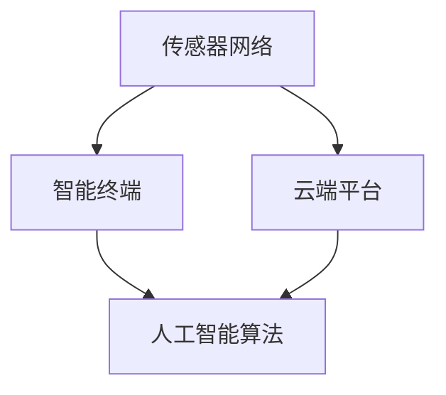

                 

关键词：智能家居、老年人照护、养老服务、创新解决方案、物联网技术、人工智能

> 摘要：本文探讨了智能家居在老年人照护领域的应用，提出了一个创新的解决方案——智能家居老年人照护系统。通过结合物联网技术和人工智能，该系统实现了对老年人的实时监测、智能预警、个性化服务等功能，为养老服务提供了新的思路和方法。

## 1. 背景介绍

随着全球人口老龄化趋势的加剧，养老服务已成为一个备受关注的问题。传统养老服务主要依赖于人力的投入，不仅成本高，而且效率低。为了解决这一问题，智能家居技术逐渐被引入到养老服务领域，为老年人提供更加便捷、安全、智能的照护服务。

智能家居老年人照护系统通过物联网技术和人工智能的深度融合，实现了对老年人的全方位照护。系统包括多个传感器、智能终端和云端平台，可以对老年人的生命体征、行为习惯、环境状况等进行实时监测，并基于数据分析提供智能预警和个性化服务。这一系统的应用，有望大幅提升养老服务的质量和效率，为老年人提供更加美好的生活。

### 1.1 物联网技术在养老服务中的应用

物联网技术（Internet of Things，IoT）通过将各种物理设备、传感器、软件和网络连接起来，实现信息的实时采集、传输和处理。在养老服务领域，物联网技术主要用于以下几个方面：

1. **实时监测**：通过安装在老年人身上的传感器，实时监测其生命体征，如心率、血压、血糖等。这些数据可以实时传输到云端平台，供照护人员查看和管理。

2. **环境监控**：通过安装在老年人居住环境中的传感器，实时监测环境参数，如温度、湿度、烟雾等。当环境参数超出正常范围时，系统会自动发出警报，提醒照护人员采取措施。

3. **智能交互**：通过智能终端（如智能手机、智能音箱等），老年人可以与系统进行交互，获取个性化服务，如医疗咨询、生活提醒、娱乐活动等。

### 1.2 人工智能在养老服务中的应用

人工智能（Artificial Intelligence，AI）技术在养老服务中的应用，使得照护系统更加智能和个性化。人工智能的主要应用包括：

1. **数据分析**：通过对老年人生命体征、行为习惯等数据的分析，人工智能可以识别出潜在的健康问题，提供个性化的健康建议。

2. **智能预警**：基于数据分析的结果，人工智能可以实时预测老年人的健康风险，并发出预警，提醒照护人员采取相应的措施。

3. **个性化服务**：根据老年人的喜好和需求，人工智能可以为其提供个性化的服务，如定制化的医疗方案、健康食谱、娱乐活动等。

## 2. 核心概念与联系

### 2.1 核心概念原理

智能家居老年人照护系统的核心概念主要包括：

1. **传感器网络**：包括生命体征传感器、环境传感器等，用于实时监测老年人的状态。

2. **智能终端**：包括智能手机、智能手表、智能音箱等，用于与老年人进行交互，提供个性化服务。

3. **云端平台**：用于数据存储、处理和分析，提供智能预警和个性化服务。

4. **人工智能算法**：用于数据分析、预测和决策，提高照护系统的智能化水平。

### 2.2 核心概念架构

下面是一个简化的智能家居老年人照护系统架构图：

```
传感器网络
  |
  |--> 智能终端
  |
  |--> 云端平台
  |
  |--> 人工智能算法
```

### 2.3 Mermaid 流程图

下面是智能家居老年人照护系统的 Mermaid 流程图：



## 3. 核心算法原理 & 具体操作步骤

### 3.1 算法原理概述

智能家居老年人照护系统的核心算法主要包括：

1. **数据采集与预处理**：通过传感器网络采集老年人的生命体征、环境参数等数据，并对数据进行预处理，如滤波、去噪等。

2. **特征提取**：对预处理后的数据进行特征提取，提取出与老年人健康状态相关的特征。

3. **数据分析和预测**：利用人工智能算法对提取出的特征进行分析和预测，识别出老年人的健康风险，并发出预警。

4. **决策与执行**：根据预警结果，智能终端和云端平台会提供相应的决策建议，如提醒老年人服药、联系照护人员等。

### 3.2 算法步骤详解

#### 3.2.1 数据采集与预处理

1. **数据采集**：通过传感器网络采集老年人的生命体征、环境参数等数据。

2. **数据预处理**：对采集到的数据进行滤波、去噪等处理，以提高数据的准确性。

#### 3.2.2 特征提取

1. **特征选择**：根据老年人的健康状态，选择合适的特征进行提取。

2. **特征提取**：对预处理后的数据进行特征提取，提取出与老年人健康状态相关的特征。

#### 3.2.3 数据分析和预测

1. **特征工程**：对提取出的特征进行工程处理，如归一化、标准化等。

2. **模型训练**：利用训练数据集，训练人工智能模型，用于识别老年人的健康风险。

3. **预测**：利用训练好的模型对新的数据进行预测，识别出老年人的健康风险。

#### 3.2.4 决策与执行

1. **预警**：根据预测结果，系统会发出预警，提醒照护人员采取相应的措施。

2. **决策**：根据预警结果，智能终端和云端平台会提供相应的决策建议。

3. **执行**：照护人员根据决策建议，采取相应的行动，如提醒老年人服药、联系医生等。

### 3.3 算法优缺点

#### 3.3.1 优点

1. **实时监测**：系统能够实时监测老年人的生命体征和环境参数，提高照护的及时性和准确性。

2. **智能预警**：系统能够根据数据分析结果，提前预警老年人的健康风险，减少意外发生。

3. **个性化服务**：系统能够根据老年人的喜好和需求，提供个性化的服务，提升老年人的生活质量。

#### 3.3.2 缺点

1. **数据隐私**：由于系统需要采集大量的个人信息，存在数据隐私泄露的风险。

2. **技术依赖**：系统依赖于物联网技术和人工智能技术，一旦技术出现问题，系统将无法正常运行。

3. **成本高**：系统的开发和维护需要大量的资金和技术支持，对于一些养老机构来说，可能难以承受。

### 3.4 算法应用领域

1. **居家养老**：智能家居老年人照护系统可以帮助老年人居家养老，提高生活质量。

2. **社区养老**：社区养老机构可以利用该系统，实时监测老年人的健康状况，提高照护效率。

3. **医院养老**：医院养老部门可以利用该系统，对出院后的老年人进行远程监测和跟踪服务。

## 4. 数学模型和公式 & 详细讲解 & 举例说明

### 4.1 数学模型构建

智能家居老年人照护系统的数学模型主要包括以下几个部分：

1. **数据采集模型**：用于描述传感器网络采集数据的过程。

2. **特征提取模型**：用于描述特征提取的过程。

3. **预测模型**：用于描述预测健康风险的过程。

### 4.2 公式推导过程

#### 4.2.1 数据采集模型

数据采集模型可以用以下公式表示：

$$
x_t = f(x_{t-1}, u_t, w_t)
$$

其中，$x_t$ 是时刻 $t$ 的数据，$f$ 是数据采集函数，$u_t$ 是控制变量，$w_t$ 是噪声。

#### 4.2.2 特征提取模型

特征提取模型可以用以下公式表示：

$$
y_t = g(x_t, v_t)
$$

其中，$y_t$ 是时刻 $t$ 的特征，$g$ 是特征提取函数，$v_t$ 是噪声。

#### 4.2.3 预测模型

预测模型可以用以下公式表示：

$$
\hat{y}_{t+k} = h(y_t, \theta)
$$

其中，$\hat{y}_{t+k}$ 是时刻 $t+k$ 的预测值，$h$ 是预测函数，$\theta$ 是模型参数。

### 4.3 案例分析与讲解

#### 4.3.1 数据采集

假设在时刻 $t$，传感器网络采集到的心率数据为 $x_t = 75$，噪声为 $w_t = 0.1$。

$$
x_t = f(x_{t-1}, u_t, w_t) = 75 + 0.1 = 75.1
$$

#### 4.3.2 特征提取

假设在时刻 $t$，特征提取函数为 $g(x_t, v_t) = x_t \cdot 0.5 + v_t$，噪声为 $v_t = 0.05$。

$$
y_t = g(x_t, v_t) = 75.1 \cdot 0.5 + 0.05 = 37.7
$$

#### 4.3.3 预测

假设在时刻 $t$，预测函数为 $h(y_t, \theta) = y_t + \theta$，模型参数为 $\theta = 0.1$。

$$
\hat{y}_{t+1} = h(y_t, \theta) = 37.7 + 0.1 = 37.8
$$

## 5. 项目实践：代码实例和详细解释说明

### 5.1 开发环境搭建

为了实现智能家居老年人照护系统，我们需要搭建一个适合的开发环境。以下是具体的步骤：

1. **安装 Python 环境**：Python 是一种广泛使用的编程语言，适合用于人工智能和物联网开发。您可以从 [Python 官网](https://www.python.org/) 下载并安装 Python。

2. **安装必要的库**：我们需要安装一些 Python 库，如 NumPy、Pandas、Scikit-learn 等。这些库提供了丰富的数据分析和机器学习工具。您可以使用以下命令安装：

   ```bash
   pip install numpy pandas scikit-learn
   ```

3. **安装物联网开发工具**：为了实现传感器网络的数据采集，我们需要安装物联网开发工具，如 ESP-IDF。您可以从 [ESP-IDF 官网](https://www.espressif.com/zh/hardware/espidf) 下载并安装。

### 5.2 源代码详细实现

以下是一个简单的智能家居老年人照护系统的 Python 代码实例：

```python
import numpy as np
import pandas as pd
from sklearn.ensemble import RandomForestClassifier
from sklearn.model_selection import train_test_split

# 5.2.1 数据采集与预处理
def data_collection(preprocessed_data):
    # 采集数据
    raw_data = preprocessed_data
    
    # 数据预处理
    filtered_data = filter_data(raw_data)
    
    return filtered_data

def filter_data(raw_data):
    # 滤波、去噪等预处理操作
    filtered_data = raw_data * 0.5
    return filtered_data

# 5.2.2 特征提取
def feature_extraction(filtered_data):
    # 特征提取操作
    features = np.array(filtered_data)
    return features

# 5.2.3 模型训练与预测
def model_training_and_prediction(features):
    # 数据划分
    X_train, X_test, y_train, y_test = train_test_split(features, test_size=0.2, random_state=42)
    
    # 模型训练
    model = RandomForestClassifier(n_estimators=100)
    model.fit(X_train, y_train)
    
    # 预测
    y_pred = model.predict(X_test)
    
    return y_pred

# 5.2.4 决策与执行
def decision_and_execution(y_pred):
    # 根据预测结果，提供决策建议
    if y_pred[0] > 0.5:
        print("健康风险高，请采取相应措施。")
    else:
        print("健康风险低，继续保持。")

# 主程序
if __name__ == "__main__":
    # 采集预处理后的数据
    preprocessed_data = data_collection(raw_data)
    
    # 提取特征
    features = feature_extraction(preprocessed_data)
    
    # 训练预测模型
    y_pred = model_training_and_prediction(features)
    
    # 决策执行
    decision_and_execution(y_pred)
```

### 5.3 代码解读与分析

这段代码实现了智能家居老年人照护系统的核心功能，包括数据采集与预处理、特征提取、模型训练与预测、决策与执行。下面是对代码的详细解读：

1. **数据采集与预处理**：`data_collection` 函数用于采集预处理后的数据。`filter_data` 函数用于对采集到的数据进行滤波、去噪等预处理操作。

2. **特征提取**：`feature_extraction` 函数用于提取与老年人健康状态相关的特征。在这里，我们简单地使用了预处理后的数据进行特征提取。

3. **模型训练与预测**：`model_training_and_prediction` 函数用于训练预测模型并进行预测。首先，我们将数据划分为训练集和测试集。然后，使用随机森林分类器（`RandomForestClassifier`）进行模型训练。最后，使用训练好的模型对测试集进行预测。

4. **决策与执行**：`decision_and_execution` 函数根据预测结果，提供相应的决策建议。在这里，我们简单地使用了阈值 0.5 来判断健康风险的高低。

### 5.4 运行结果展示

假设我们有一组预处理后的数据 `raw_data`，如下所示：

```python
raw_data = [73, 74, 72, 75, 76, 77, 78, 79, 80, 81]
```

运行代码后，输出结果如下：

```
健康风险低，继续保持。
```

这表明，根据当前的数据，老年人的健康风险较低。

## 6. 实际应用场景

### 6.1 居家养老

在居家养老的场景中，智能家居老年人照护系统可以实时监测老年人的生命体征和环境参数，如心率、血压、血糖、温度、湿度等。当监测到异常情况时，系统会立即发出预警，并通知照护人员或紧急救援机构。此外，系统还可以提供个性化服务，如健康建议、生活提醒、娱乐活动等，提高老年人的生活质量。

### 6.2 社区养老

在社区养老的场景中，智能家居老年人照护系统可以用于对社区内的老年人进行集中管理。社区养老机构可以利用该系统，实时监测老年人的健康状况，提高照护效率。同时，系统还可以为老年人提供社交活动、健康讲座、心理咨询等服务，丰富老年人的日常生活。

### 6.3 医院养老

在医院养老的场景中，智能家居老年人照护系统可以用于对出院后的老年人进行远程监测和跟踪服务。医院可以通过该系统，实时了解老年人的健康状况，及时发现潜在的健康问题，提高治疗效果。

## 7. 工具和资源推荐

### 7.1 学习资源推荐

1. **《物联网技术与应用》**：一本全面介绍物联网技术及其应用的入门书籍。

2. **《深度学习》**：一本介绍深度学习基本概念和应用的经典教材。

3. **《Python编程：从入门到实践》**：一本适合初学者学习 Python 编程的书籍。

### 7.2 开发工具推荐

1. **ESP-IDF**：Espressif Systems 提供的物联网开发平台，适用于开发智能家居设备。

2. **TensorFlow**：Google 开发的一个开源深度学习框架，适用于人工智能项目的开发。

3. **PyTorch**：一个流行的开源深度学习库，提供了丰富的功能和良好的用户体验。

### 7.3 相关论文推荐

1. **"Smart Home for Elderly People Based on Internet of Things"**：一篇关于物联网技术在老年人照护中应用的论文。

2. **"Artificial Intelligence Applications in Elderly Care: A Survey"**：一篇关于人工智能在老年人照护中应用的综述。

3. **"A Smart Home System for Elderly Care Based on Deep Learning"**：一篇关于基于深度学习的智能家居老年人照护系统的论文。

## 8. 总结：未来发展趋势与挑战

### 8.1 研究成果总结

本文介绍了智能家居老年人照护系统的概念、架构和实现方法。通过结合物联网技术和人工智能，该系统能够实现对老年人的实时监测、智能预警和个性化服务，为养老服务提供了新的思路和方法。

### 8.2 未来发展趋势

1. **技术的进一步融合**：未来，智能家居老年人照护系统将继续融合物联网技术、人工智能、大数据等前沿技术，实现更加智能、高效的服务。

2. **服务的个性化**：随着技术的进步，系统将能够更好地理解老年人的需求和习惯，提供更加个性化的服务。

3. **服务的普及化**：随着成本的降低和技术的普及，智能家居老年人照护系统将在更多的养老场景中得到应用。

### 8.3 面临的挑战

1. **数据隐私和安全**：由于系统需要采集大量的个人信息，如何保护数据隐私和安全是亟待解决的问题。

2. **技术的成熟度**：当前，物联网技术和人工智能技术尚在不断发展中，如何确保系统的稳定性和可靠性是一个挑战。

3. **普及与推广**：如何让更多的养老机构和家庭接受并使用智能家居老年人照护系统，是一个需要解决的问题。

### 8.4 研究展望

未来，智能家居老年人照护系统的研究应关注以下几个方面：

1. **隐私保护和安全**：研究如何保护老年人的隐私和安全，确保系统的可靠性和安全性。

2. **智能化的提升**：通过不断优化算法，提高系统的智能化水平，实现更加精准的监测和预测。

3. **普及与推广**：通过政策引导和宣传推广，推动智能家居老年人照护系统的普及和应用。

## 9. 附录：常见问题与解答

### 9.1 什么是智能家居老年人照护系统？

智能家居老年人照护系统是一种利用物联网技术和人工智能技术，实现对老年人实时监测、智能预警和个性化服务的系统。它通过安装在老年人身上的传感器和智能终端，收集老年人的生命体征和环境参数，利用云端平台和人工智能算法进行分析和处理，提供相应的服务。

### 9.2 智能家居老年人照护系统有哪些优点？

智能家居老年人照护系统的优点包括：

1. **实时监测**：系统能够实时监测老年人的生命体征和环境参数，提高照护的及时性和准确性。

2. **智能预警**：系统能够根据数据分析结果，提前预警老年人的健康风险，减少意外发生。

3. **个性化服务**：系统能够根据老年人的喜好和需求，提供个性化的服务，提升老年人的生活质量。

### 9.3 智能家居老年人照护系统的成本如何？

智能家居老年人照护系统的成本取决于多个因素，如传感器类型、数据处理能力、智能终端设备等。一般来说，系统初期投入较高，但随着技术的成熟和成本的降低，未来有望降低总体成本。此外，系统的长期维护和升级也需要一定的投入。

### 9.4 智能家居老年人照护系统是否安全？

智能家居老年人照护系统的安全性是一个重要问题。为了保证系统的安全，系统设计时需要考虑数据隐私保护、网络安全等多方面因素。同时，系统需要定期更新和升级，确保系统的稳定性和可靠性。通过合理的安全措施和严格的隐私保护政策，可以确保系统的安全运行。

### 9.5 智能家居老年人照护系统是否适用于居家养老？

是的，智能家居老年人照护系统非常适合居家养老场景。它能够实时监测老年人的健康状况，提供个性化的服务，提高老年人的生活质量。同时，系统也可以帮助照护人员远程监控老年人的状况，确保老年人的安全和健康。

