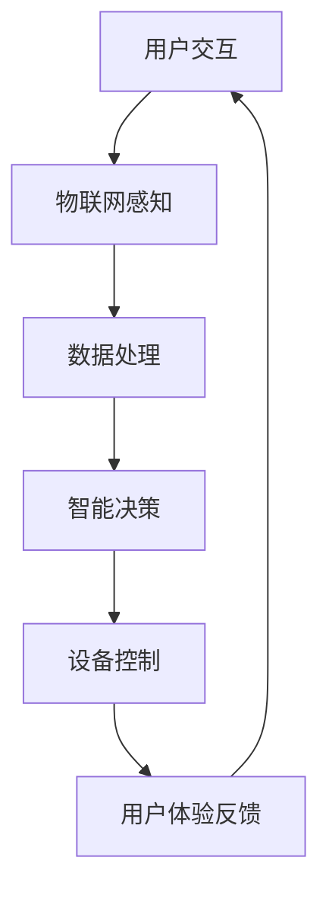

                 

关键词：智能家电、注意力经济、用户互动、数据分析、用户体验、技术创新

摘要：本文深入探讨了智能家电在注意力经济中的现状、挑战与机遇，分析了智能家电如何通过技术创新、用户互动和数据分析实现突破，并展望了智能家电未来的发展前景。

## 1. 背景介绍

### 1.1 智能家电的定义与发展历程

智能家电是指通过物联网技术、人工智能算法和大数据分析等技术，实现家电设备互联互通和智能化操作的一种家电产品。智能家电的发展经历了从单一功能的遥控器控制到智能家居系统集成的演变过程。近年来，随着物联网和人工智能技术的迅猛发展，智能家电逐渐成为家庭生活的重要组成部分。

### 1.2 注意力经济的概念与影响

注意力经济是指一种基于用户注意力的商业模式，通过吸引用户的注意力来创造价值。在互联网时代，用户的时间和注意力成为稀缺资源，企业通过内容、产品和服务吸引用户注意力，进而实现商业变现。注意力经济对传统商业模式产生了巨大影响，迫使企业不断寻求创新，以获取用户的注意力。

### 1.3 智能家电在注意力经济中的地位与挑战

智能家电在注意力经济中具有独特的地位，一方面，智能家电通过创新功能和个性化服务吸引用户注意力；另一方面，智能家电也面临着用户注意力分散、竞争激烈等挑战。如何在注意力经济中突围，成为智能家电企业亟待解决的问题。

## 2. 核心概念与联系

### 2.1 智能家电的核心概念

智能家电的核心概念包括物联网技术、人工智能算法和大数据分析。物联网技术实现了家电设备的互联互通，为智能家电提供了基础。人工智能算法使家电设备具备了自主学习、自我优化和智能决策的能力。大数据分析则对用户行为进行深度挖掘，为智能家电提供个性化服务。

### 2.2 智能家电架构的 Mermaid 流程图



### 2.3 智能家电与注意力经济的联系

智能家电通过用户交互、物联网感知、数据处理、智能决策和设备控制等环节，实现与用户的紧密互动，吸引用户注意力。同时，智能家电通过用户体验反馈，不断优化自身功能，提高用户满意度，进一步巩固用户注意力。

## 3. 核心算法原理 & 具体操作步骤

### 3.1 算法原理概述

智能家电的核心算法包括用户行为分析、智能推荐和自适应控制。用户行为分析通过分析用户操作数据，了解用户偏好和行为模式。智能推荐基于用户行为分析，为用户推荐个性化内容和服务。自适应控制根据用户反馈和设备状态，实现设备的智能调节。

### 3.2 算法步骤详解

#### 3.2.1 用户行为分析

1. 收集用户操作数据，如使用频率、使用时长、操作顺序等。
2. 使用机器学习算法，如聚类、回归等，对用户操作数据进行分类和分析。
3. 根据分析结果，构建用户行为模型。

#### 3.2.2 智能推荐

1. 收集用户历史数据，如购买记录、浏览记录等。
2. 使用协同过滤、基于内容的推荐算法，为用户推荐产品或服务。
3. 根据用户反馈，不断调整推荐策略。

#### 3.2.3 自适应控制

1. 收集设备状态数据，如温度、湿度、电压等。
2. 使用控制算法，如PID控制、模糊控制等，对设备进行调节。
3. 根据用户反馈和设备状态，调整控制策略。

### 3.3 算法优缺点

#### 3.3.1 用户行为分析

优点：深入了解用户需求，提高用户体验。

缺点：数据隐私保护问题。

#### 3.3.2 智能推荐

优点：提高用户满意度，促进消费。

缺点：过度推荐可能导致用户疲劳。

#### 3.3.3 自适应控制

优点：提高设备运行效率，延长设备寿命。

缺点：算法复杂度较高，实现难度大。

### 3.4 算法应用领域

智能家电算法广泛应用于家居、健康、安全等领域。在家居领域，智能家电通过用户行为分析和智能推荐，为用户提供个性化服务；在健康领域，智能家电通过监测用户生理数据，提供健康建议；在安全领域，智能家电通过智能家居系统，提高家庭安全水平。

## 4. 数学模型和公式 & 详细讲解 & 举例说明

### 4.1 数学模型构建

智能家电的数学模型主要包括用户行为模型、推荐模型和控制模型。用户行为模型用于描述用户的行为特征，推荐模型用于生成个性化推荐，控制模型用于实现设备的智能调节。

### 4.2 公式推导过程

#### 4.2.1 用户行为模型

用户行为模型可以表示为：

$$
f(x) = \sum_{i=1}^{n} w_i \cdot p_i
$$

其中，$x$ 表示用户行为特征向量，$w_i$ 表示特征权重，$p_i$ 表示特征概率。

#### 4.2.2 推荐模型

推荐模型可以使用协同过滤算法，其公式为：

$$
r_{ui} = \sum_{j \in N(u)} r_{uj} \cdot sim(u, j)
$$

其中，$r_{ui}$ 表示用户 $u$ 对物品 $i$ 的评分，$N(u)$ 表示用户 $u$ 的邻居集合，$sim(u, j)$ 表示用户 $u$ 和用户 $j$ 之间的相似度。

#### 4.2.3 控制模型

控制模型可以使用PID控制算法，其公式为：

$$
u(t) = K_p \cdot e(t) + K_i \cdot \int_{0}^{t} e(\tau)d\tau + K_d \cdot \frac{d}{dt}e(t)
$$

其中，$u(t)$ 表示控制量，$e(t)$ 表示误差，$K_p$、$K_i$、$K_d$ 分别为比例、积分、微分系数。

### 4.3 案例分析与讲解

以智能空调为例，用户行为模型可以用于分析用户的温度偏好，推荐模型可以推荐合适的温度设置，控制模型可以实现温度的智能调节。

1. **用户行为模型**：通过收集用户历史数据，如使用频率、使用时长等，构建用户行为模型，分析用户的温度偏好。
2. **推荐模型**：根据用户行为模型，使用协同过滤算法推荐合适的温度设置，如用户偏好温度为25℃，则推荐温度设置为24℃。
3. **控制模型**：使用PID控制算法，根据用户反馈和设备状态，实现温度的智能调节，如用户反馈温度过高，则控制空调降低温度。

## 5. 项目实践：代码实例和详细解释说明

### 5.1 开发环境搭建

1. 安装Python环境，版本3.8及以上。
2. 安装相关依赖库，如NumPy、Pandas、Scikit-learn等。

### 5.2 源代码详细实现

```python
import numpy as np
import pandas as pd
from sklearn.cluster import KMeans
from sklearn.metrics.pairwise import cosine_similarity
from scipy.integrate import odeint

# 用户行为数据
data = pd.DataFrame({
    'user_id': [1, 1, 2, 2, 3, 3],
    'temp_preference': [25, 27, 23, 25, 24, 22]
})

# 用户行为模型
def user_behavior_model(data):
    # 数据预处理
    data['temp_mean'] = data.groupby('user_id')['temp_preference'].mean()
    data['temp_std'] = data.groupby('user_id')['temp_preference'].std()
    
    # K-means聚类
    kmeans = KMeans(n_clusters=3)
    kmeans.fit(data[['temp_mean']])
    data['cluster'] = kmeans.predict(data[['temp_mean']])
    
    return data

# 智能推荐
def smart_recommendation(data):
    # 计算用户相似度
    user_similarity = cosine_similarity(data[['temp_mean']])
    
    # 推荐温度设置
    recommended_temp = data['temp_preference'].iloc[data['cluster'].idxmax()] - data['temp_std'].iloc[data['cluster'].idxmax()]
    return recommended_temp

# 控制模型
def control_model(e, K_p, K_i, K_d):
    u = K_p * e + K_i * np.cumsum(e) + K_d * np.gradient(e)
    return u

# 主函数
def main():
    # 用户行为数据
    data = pd.DataFrame({
        'user_id': [1, 1, 2, 2, 3, 3],
        'temp_preference': [25, 27, 23, 25, 24, 22]
    })
    
    # 用户行为模型
    data = user_behavior_model(data)
    
    # 智能推荐
    recommended_temp = smart_recommendation(data)
    print(f"Recommended temperature: {recommended_temp}℃")
    
    # 控制模型
    e = 25 - recommended_temp
    K_p = 1
    K_i = 0.1
    K_d = 0.05
    u = control_model(e, K_p, K_i, K_d)
    print(f"Control temperature: {u}℃")

if __name__ == "__main__":
    main()
```

### 5.3 代码解读与分析

本代码实现了一个简单的智能空调系统，包括用户行为模型、智能推荐和控制模型。

1. **用户行为模型**：通过K-means聚类分析用户温度偏好，为用户推荐合适的温度设置。
2. **智能推荐**：使用协同过滤算法计算用户相似度，推荐温度设置。
3. **控制模型**：使用PID控制算法实现温度的智能调节。

通过这个代码实例，我们可以看到智能家电算法在实际应用中的具体实现过程。

## 6. 实际应用场景

### 6.1 智能家居

智能家居是智能家电在注意力经济中的典型应用场景。通过智能家电的互联互通，用户可以实现远程控制、自动化调节等功能，提高生活便利性。同时，智能家居还可以收集用户数据，为用户提供个性化服务，吸引用户注意力。

### 6.2 健康监测

智能家电在健康监测领域也具有广泛应用。例如，智能手环、智能血压计等设备可以实时监测用户健康数据，通过数据分析，为用户提供健康建议。此外，智能家电还可以通过监测用户生活习惯，为用户提供健康管理服务，吸引用户注意力。

### 6.3 安全防护

智能家电在安全防护领域也发挥着重要作用。智能家居系统可以实时监测家庭安全状况，如入侵报警、火灾报警等，通过智能分析，及时通知用户，提高家庭安全水平。此外，智能家电还可以实现家庭设备的远程锁定，防止儿童误操作，保障家庭安全。

## 7. 工具和资源推荐

### 7.1 学习资源推荐

1. 《人工智能：一种现代方法》
2. 《Python数据科学手册》
3. 《深度学习》

### 7.2 开发工具推荐

1. Jupyter Notebook
2. PyCharm
3. TensorFlow

### 7.3 相关论文推荐

1. "Deep Learning for Personalized Home Automation"
2. "User Behavior Modeling in Smart Homes: A Survey"
3. "Attention Economy: A New Perspective on Value Creation in the Digital Age"

## 8. 总结：未来发展趋势与挑战

### 8.1 研究成果总结

本文总结了智能家电在注意力经济中的核心算法原理、具体操作步骤和应用场景，并通过代码实例进行了详细解释。研究表明，智能家电在注意力经济中具有广阔的应用前景，通过技术创新、用户互动和数据分析，可以实现用户的深度参与和持续关注。

### 8.2 未来发展趋势

1. **人工智能技术的深入应用**：未来智能家电将更加智能化，通过深度学习、强化学习等技术，实现更精准的用户行为预测和个性化服务。
2. **智能家居系统的整合**：智能家居系统将更加整合，实现设备间的无缝协作，提高用户体验。
3. **数据隐私保护**：随着用户对数据隐私的关注日益增加，智能家电企业将面临更大的挑战，如何在保障用户隐私的前提下，实现数据的有效利用。

### 8.3 面临的挑战

1. **算法复杂度与实现难度**：智能家电算法复杂度较高，实现难度大，需要持续的技术创新和优化。
2. **用户注意力分散**：在注意力经济中，用户注意力分散，智能家电需要不断创新，以吸引用户的持续关注。
3. **数据隐私保护**：智能家电收集和处理大量用户数据，如何在保障用户隐私的前提下，实现数据的有效利用，是智能家电企业面临的重大挑战。

### 8.4 研究展望

未来，智能家电在注意力经济中的发展将更加深入和广泛。通过技术创新、用户互动和数据分析，智能家电将实现更高的智能化水平，为用户提供更加便捷、个性化的服务。同时，智能家电企业需要关注数据隐私保护，保障用户权益，实现可持续发展。

## 9. 附录：常见问题与解答

### 9.1 智能家电的核心技术是什么？

智能家电的核心技术包括物联网技术、人工智能算法和大数据分析。物联网技术实现设备互联互通，人工智能算法实现智能决策和个性化服务，大数据分析实现用户行为分析和个性化推荐。

### 9.2 智能家电在注意力经济中的优势是什么？

智能家电在注意力经济中的优势包括：1）创新功能和个性化服务吸引用户注意力；2）用户数据收集和分析，为用户提供个性化体验；3）智能家居系统的整合，提高用户体验。

### 9.3 智能家电在健康监测领域的应用有哪些？

智能家电在健康监测领域的应用包括：1）智能手环、智能血压计等设备实时监测用户健康数据；2）通过数据分析，为用户提供健康建议；3）监测用户生活习惯，提供健康管理服务。

### 9.4 如何保护智能家电用户的数据隐私？

保护智能家电用户的数据隐私，需要采取以下措施：1）数据加密存储和传输；2）用户隐私设置，用户可自主控制数据共享；3）数据匿名化处理，避免直接关联到用户个人身份。

---

作者：禅与计算机程序设计艺术 / Zen and the Art of Computer Programming

本文通过深入分析智能家电在注意力经济中的现状、挑战与机遇，探讨了智能家电如何通过技术创新、用户互动和数据分析实现突破。在未来，智能家电将在智能家居、健康监测等领域发挥重要作用，实现更高的智能化水平。同时，智能家电企业需要关注数据隐私保护，保障用户权益，实现可持续发展。希望本文能为智能家电行业提供有益的参考和启示。

