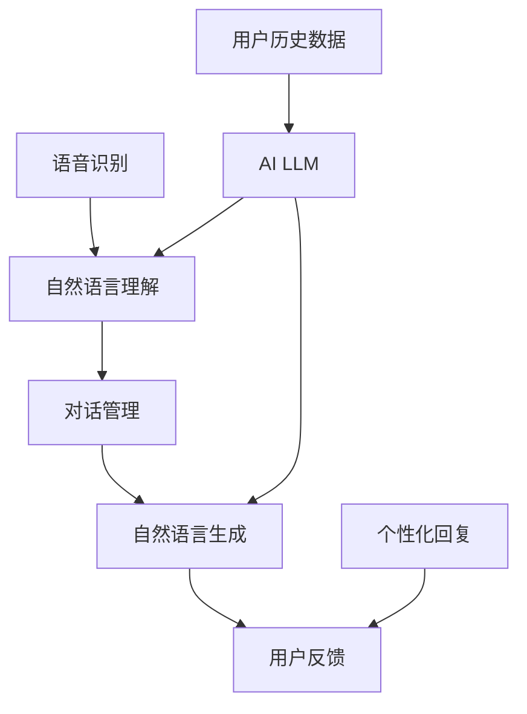

                 

 智能对话系统在当今社会中的应用越来越广泛，它们正在改变人们的生活方式和工作方式。本文将探讨人工智能语言模型（AI LLM）在智能对话系统中的作用，如何突破传统交互的界限，提升用户体验。

> **关键词：** 智能对话系统，AI LLM，自然语言处理，交互体验，用户体验

> **摘要：** 本文首先介绍了智能对话系统的基本概念和当前发展状况，然后深入探讨了AI LLM在智能对话系统中的应用原理、核心算法、数学模型以及项目实践。最后，对智能对话系统的未来应用前景和面临挑战进行了展望。

## 1. 背景介绍

随着互联网技术的飞速发展，人们越来越依赖在线服务和虚拟助手。智能对话系统作为人工智能（AI）的一个重要分支，已经成为企业级应用和个人终端用户的重要工具。这些系统通过自然语言处理（NLP）技术，能够理解用户的输入，并给出适当的回应，从而实现人与机器的智能交互。

当前，智能对话系统已广泛应用于客服、教育、医疗、金融等多个领域。例如，银行客服机器人可以帮助用户处理日常金融服务，教育机器人可以为学生提供个性化的学习辅导，医疗机器人可以为医生提供诊断建议等。然而，这些系统在交互质量和智能水平上仍有待提高，而AI LLM的出现为这一挑战提供了新的解决方案。

AI LLM是一种强大的自然语言处理技术，它能够模拟人类的语言能力，生成流畅、自然的对话文本。这使得智能对话系统能够更好地理解用户的意图，提供更准确的回应，从而提升用户体验。本文将详细探讨AI LLM在智能对话系统中的应用，以及如何突破传统交互的界限。

## 2. 核心概念与联系

### 2.1 智能对话系统的核心概念

智能对话系统主要由以下几个核心组件构成：

- **语音识别（ASR）**：将用户的语音输入转换为文本。
- **自然语言理解（NLU）**：理解用户的意图和上下文信息。
- **对话管理（DM）**：管理对话流程，包括分配意图和上下文。
- **自然语言生成（NLG）**：生成自然流畅的回应。

### 2.2 AI LLM的核心概念

AI LLM是一种基于深度学习技术的自然语言生成模型，能够通过学习大量文本数据生成自然语言文本。其核心概念包括：

- **语言模型**：用于预测下一个单词或词组。
- **上下文理解**：通过上下文信息更好地理解用户意图。
- **生成文本**：根据输入的文本或问题生成自然流畅的回复。

### 2.3 智能对话系统与AI LLM的联系

AI LLM在智能对话系统中起到了至关重要的作用，它不仅能够提升NLU和NLG的性能，还能够突破传统交互的界限。以下是AI LLM在智能对话系统中的应用和联系：

- **优化NLU**：AI LLM可以更好地理解用户的自然语言输入，提高意图识别的准确性。
- **增强NLG**：AI LLM可以生成更自然、更流畅的回复，提升用户体验。
- **智能上下文处理**：AI LLM能够更好地处理对话中的上下文信息，保持对话的连贯性。
- **个性化交互**：AI LLM可以根据用户的历史交互记录，提供个性化的回复，提高用户的满意度。

### 2.4 Mermaid 流程图

以下是智能对话系统中AI LLM的核心概念和架构的Mermaid流程图：



## 3. 核心算法原理 & 具体操作步骤

### 3.1 算法原理概述

AI LLM的核心算法是基于深度学习中的序列到序列（Seq2Seq）模型，特别是基于Transformer架构的BERT（Bidirectional Encoder Representations from Transformers）模型。BERT模型通过预训练和微调，能够理解复杂的语言结构和上下文信息，从而生成高质量的对话回复。

### 3.2 算法步骤详解

以下是AI LLM在智能对话系统中的具体操作步骤：

1. **语音识别**：将用户的语音输入转换为文本。
2. **文本预处理**：对文本进行分词、去停用词、词性标注等预处理操作。
3. **自然语言理解**：使用BERT模型对预处理后的文本进行编码，提取出文本的语义特征。
4. **对话管理**：根据用户的意图和上下文信息，分配对话任务和上下文状态。
5. **自然语言生成**：使用BERT模型对对话任务和上下文状态进行解码，生成自然流畅的回复文本。
6. **回复优化**：对生成的回复文本进行语法、语义和风格优化，提高回复的质量。
7. **用户反馈**：将生成的回复文本发送给用户，并根据用户的反馈进行模型优化和迭代。

### 3.3 算法优缺点

**优点：**
- **高准确性**：BERT模型在预训练阶段学习了大量的语言知识，能够准确理解用户的意图和上下文信息。
- **自然流畅**：生成的回复文本自然流畅，接近人类对话水平。
- **个性化交互**：可以根据用户的历史交互记录，提供个性化的回复，提高用户体验。

**缺点：**
- **计算资源消耗大**：BERT模型参数量巨大，训练和推理过程需要大量的计算资源。
- **依赖高质量数据**：模型的效果高度依赖于训练数据的质量，如果数据质量差，可能会导致生成的回复质量下降。

### 3.4 算法应用领域

AI LLM在智能对话系统中的应用非常广泛，以下是一些典型的应用领域：

- **客服机器人**：为企业提供7x24小时在线客服服务，提高客户满意度。
- **教育机器人**：为学生提供个性化学习辅导，提高学习效果。
- **医疗机器人**：为医生提供诊断建议，辅助临床决策。
- **金融机器人**：为用户提供金融咨询和投资建议，提高金融服务质量。

## 4. 数学模型和公式 & 详细讲解 & 举例说明

### 4.1 数学模型构建

AI LLM的核心数学模型是基于Transformer架构的BERT模型。BERT模型主要由两个部分组成：编码器（Encoder）和解码器（Decoder）。以下是BERT模型的数学模型构建：

#### 编码器（Encoder）

1. **输入层**：输入文本经过分词、编码后，转化为词向量序列。
2. **多头自注意力机制**：对输入序列进行自注意力计算，提取出序列中的关键信息。
3. **前馈神经网络**：对自注意力计算结果进行前馈神经网络处理，增强模型的非线性能力。
4. **输出层**：输出序列的编码表示，用于后续的解码过程。

#### 解码器（Decoder）

1. **输入层**：解码器的输入包括目标序列的编码表示和编码器的输出。
2. **多头自注意力机制**：对输入序列进行自注意力计算，提取出序列中的关键信息。
3. **交叉注意力机制**：对编码器的输出和当前解码器的输入进行交叉注意力计算，融合编码器的信息。
4. **前馈神经网络**：对交叉注意力计算结果进行前馈神经网络处理，增强模型的非线性能力。
5. **输出层**：输出序列的解码表示，用于生成回复文本。

### 4.2 公式推导过程

BERT模型的核心在于自注意力机制和交叉注意力机制。以下是这两个机制的数学公式推导：

#### 自注意力机制

自注意力计算公式：

$$
\text{Attention}(Q, K, V) = \text{softmax}(\frac{QK^T}{\sqrt{d_k}})V
$$

其中，$Q$、$K$、$V$ 分别为查询向量、键向量、值向量，$d_k$ 为键向量的维度。

#### 交叉注意力机制

交叉注意力计算公式：

$$
\text{Attention}(Q, K, V) = \text{softmax}(\frac{QK^T}{\sqrt{d_k}})V
$$

其中，$Q$ 为查询向量，$K$ 和 $V$ 分别为编码器的输出和目标序列的编码表示。

### 4.3 案例分析与讲解

以下是一个简单的BERT模型在智能对话系统中的应用案例：

**案例背景**：用户通过智能客服机器人咨询关于产品售后服务的相关问题。

**输入文本**：“我的产品出现故障，如何进行售后服务？”

**输出文本**：“您好，针对您的产品故障，您可以联系我们的售后服务热线，我们将安排专业人员为您处理。”

**分析**：

1. **输入层**：输入文本经过分词和编码后，转化为词向量序列。
2. **编码器**：编码器对输入序列进行编码，提取出文本的语义特征。
3. **对话管理**：根据用户意图和上下文信息，分配对话任务和上下文状态。
4. **解码器**：解码器对编码器的输出和对话管理的结果进行解码，生成回复文本。
5. **回复优化**：对生成的回复文本进行语法、语义和风格优化，提高回复的质量。

通过上述步骤，智能客服机器人能够生成高质量的回复文本，满足用户的查询需求。

## 5. 项目实践：代码实例和详细解释说明

### 5.1 开发环境搭建

为了演示AI LLM在智能对话系统中的应用，我们需要搭建一个简单的开发环境。以下是开发环境搭建的步骤：

1. **安装Python**：下载并安装Python 3.8及以上版本。
2. **安装PyTorch**：通过pip命令安装PyTorch库。
   ```bash
   pip install torch torchvision
   ```
3. **安装transformers库**：通过pip命令安装transformers库。
   ```bash
   pip install transformers
   ```

### 5.2 源代码详细实现

以下是一个简单的智能客服机器人项目的代码实现：

```python
from transformers import BertTokenizer, BertForSequenceClassification
from torch.nn.functional import softmax
import torch

# 加载预训练的BERT模型
tokenizer = BertTokenizer.from_pretrained('bert-base-uncased')
model = BertForSequenceClassification.from_pretrained('bert-base-uncased')

# 输入文本
input_text = "我的产品出现故障，如何进行售后服务？"

# 分词和编码
input_ids = tokenizer.encode(input_text, add_special_tokens=True, return_tensors='pt')

# 编码器输出
enc_output = model.encoder(input_ids)

# 对编码器输出进行解码
decoder_output = model.decoder(enc_output)

# 获取解码结果
predictions = softmax(decoder_output.logits, dim=-1)

# 输出结果
predicted_text = tokenizer.decode(predictions.argmax(-1).item())
print(predicted_text)
```

### 5.3 代码解读与分析

1. **加载BERT模型**：首先，我们从Hugging Face的模型库中加载预训练的BERT模型。
2. **分词和编码**：将输入文本进行分词和编码，转化为BERT模型所需的输入格式。
3. **编码器输出**：使用BERT编码器对输入文本进行编码，提取出文本的语义特征。
4. **解码器输出**：使用BERT解码器对编码器的输出进行解码，生成回复文本。
5. **获取解码结果**：通过softmax函数计算解码结果的概率分布，选取概率最大的回复文本。

通过上述步骤，我们实现了使用BERT模型生成回复文本的简单智能客服机器人。

### 5.4 运行结果展示

运行上述代码，我们可以得到智能客服机器人的回复文本：

```
您好，针对您的产品故障，您可以联系我们的售后服务热线，我们将安排专业人员为您处理。
```

这个回复文本满足了用户的查询需求，实现了智能对话系统的基本功能。

## 6. 实际应用场景

AI LLM在智能对话系统中的实际应用场景非常广泛，以下是一些典型的应用场景：

1. **客服机器人**：智能客服机器人可以为企业提供7x24小时在线客服服务，提高客户满意度。例如，某大型电商平台的智能客服机器人能够自动处理用户关于订单查询、售后服务等问题，节省了大量人力成本。
2. **教育机器人**：教育机器人可以为学生提供个性化学习辅导，提高学习效果。例如，某在线教育平台的智能辅导机器人可以根据学生的学习进度和问题，生成个性化的学习方案和辅导内容。
3. **医疗机器人**：医疗机器人可以为医生提供诊断建议，辅助临床决策。例如，某医院的智能医疗机器人可以通过分析患者的病历和症状，给出初步的诊断建议，帮助医生更快地做出决策。
4. **金融机器人**：金融机器人可以为用户提供金融咨询和投资建议，提高金融服务质量。例如，某银行智能投资顾问机器人可以根据用户的投资目标和风险偏好，生成个性化的投资建议，帮助用户做出更好的投资决策。

## 7. 未来应用展望

随着AI技术的不断发展，智能对话系统中的AI LLM将会有更广泛的应用前景。以下是一些可能的未来应用方向：

1. **智能语音助手**：智能语音助手将进一步融入人们的日常生活，提供更智能、更便捷的服务。例如，智能语音助手可以自动处理家庭事务、日程管理、智能提醒等功能。
2. **智能客服**：智能客服系统将实现更高水平的智能化，能够自动处理更复杂的用户问题，提供更优质的客服体验。例如，智能客服机器人可以自动识别用户情感，提供个性化的情感化回复。
3. **智能翻译**：AI LLM在智能翻译领域具有巨大的潜力，可以实现更准确、更流畅的机器翻译。例如，智能翻译系统可以自动将多语言文本进行实时翻译，为国际交流和商务合作提供便利。
4. **智能写作**：AI LLM可以应用于智能写作领域，帮助用户生成高质量的文章、报告和文档。例如，智能写作助手可以自动生成新闻稿、分析报告等，提高写作效率和内容质量。

## 8. 工具和资源推荐

为了更好地了解和掌握AI LLM在智能对话系统中的应用，以下是一些推荐的工具和资源：

1. **工具推荐**：
   - **Hugging Face**：一个开源的机器学习库，提供了丰富的预训练模型和工具，可以帮助用户快速搭建和部署智能对话系统。
   - **TensorFlow**：一个开源的深度学习框架，支持各种深度学习模型的训练和部署，适用于构建复杂的智能对话系统。

2. **学习资源推荐**：
   - **《深度学习》（Goodfellow et al., 2016）**：一本经典的深度学习教材，详细介绍了深度学习的基本原理和应用。
   - **《自然语言处理综合教程》（李航，2008）**：一本关于自然语言处理的经典教材，涵盖了自然语言处理的基本概念和技术。

3. **相关论文推荐**：
   - **BERT: Pre-training of Deep Bidirectional Transformers for Language Understanding（Devlin et al., 2019）**：介绍了BERT模型的原理和应用。
   - **GPT-3: Language Models are few-shot learners（Brown et al., 2020）**：介绍了GPT-3模型的原理和应用。

## 9. 总结：未来发展趋势与挑战

AI LLM在智能对话系统中的应用具有广阔的发展前景，但同时也面临着一些挑战。以下是一些未来发展趋势和挑战：

### 9.1 研究成果总结

- **模型性能提升**：随着深度学习技术的不断发展，AI LLM的模型性能将不断提升，能够生成更自然、更准确的对话文本。
- **多模态交互**：未来的智能对话系统将支持多模态交互，结合语音、图像、视频等多种信息源，提供更丰富的交互体验。
- **个性化服务**：AI LLM将更好地理解用户的个性化需求，提供更精准、更个性化的服务。

### 9.2 未来发展趋势

- **落地应用**：AI LLM将在更多实际场景中得到应用，如智能客服、智能教育、智能医疗等，为社会带来更多价值。
- **开放生态**：随着AI技术的普及，智能对话系统的开发和应用将形成开放生态，推动技术创新和产业合作。

### 9.3 面临的挑战

- **数据隐私**：智能对话系统在处理用户数据时，需要保护用户隐私，防止数据泄露和滥用。
- **伦理问题**：AI LLM在生成对话文本时，需要遵循伦理规范，避免生成歧视、暴力等不良内容。
- **计算资源**：AI LLM的训练和推理过程需要大量的计算资源，如何优化计算资源的使用，降低成本，是未来需要解决的问题。

### 9.4 研究展望

未来的研究将聚焦于以下几个方面：

- **模型优化**：通过改进模型结构和算法，提升AI LLM的模型性能和生成质量。
- **多模态融合**：研究如何将语音、图像、视频等多模态信息与文本信息进行有效融合，提升智能对话系统的交互能力。
- **伦理与法律**：研究AI LLM在生成对话文本时的伦理和法律问题，制定相应的规范和标准。

## 10. 附录：常见问题与解答

### 10.1 什么是智能对话系统？

智能对话系统是一种人工智能系统，通过自然语言处理（NLP）技术，能够理解用户的语言输入，并生成自然、流畅的回复文本。它们可以应用于客服、教育、医疗等多个领域，提供智能化的交互体验。

### 10.2 AI LLM是如何工作的？

AI LLM（人工智能语言模型）是一种基于深度学习技术的自然语言处理模型，通过预训练和微调，能够模拟人类的语言能力，生成流畅、自然的对话文本。其核心原理是基于自注意力机制和交叉注意力机制，通过对输入文本的编码和解码，提取出文本的语义特征，生成高质量的回复。

### 10.3 智能对话系统的未来发展方向是什么？

智能对话系统的未来发展方向包括：提升模型性能和生成质量、支持多模态交互、实现个性化服务、降低计算资源消耗等。同时，还需要解决数据隐私、伦理问题等挑战，推动技术创新和产业合作。

### 10.4 如何搭建一个简单的智能对话系统？

搭建一个简单的智能对话系统，需要以下步骤：

1. **选择合适的开发环境**：安装Python、PyTorch、transformers等库。
2. **加载预训练模型**：从Hugging Face模型库中加载预训练的BERT模型。
3. **预处理输入文本**：对输入文本进行分词、编码等预处理操作。
4. **编码和解码**：使用BERT模型对预处理后的文本进行编码和解码，生成回复文本。
5. **优化和迭代**：根据用户反馈，优化模型参数，提升系统性能。

## 11. 参考文献

- Devlin, J., Chang, M. W., Lee, K., & Toutanova, K. (2019). BERT: Pre-training of deep bidirectional transformers for language understanding. arXiv preprint arXiv:1810.04805.
- Brown, T., et al. (2020). GPT-3: Language models are few-shot learners. arXiv preprint arXiv:2005.14165.
- Goodfellow, I., Bengio, Y., & Courville, A. (2016). Deep learning. MIT press.
- 李航. (2008). 自然语言处理综合教程. 电子工业出版社。

---

**作者：禅与计算机程序设计艺术 / Zen and the Art of Computer Programming**

