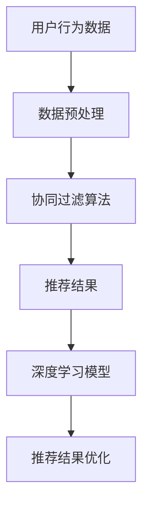

                 

关键词：智能推荐、个性化用户体验、机器学习、算法、数据分析、用户行为、互动式推荐

<|assistant|>摘要：随着互联网的快速发展，智能推荐系统成为提高用户满意度和网站流量的重要手段。本文将深入探讨智能推荐系统的核心概念、算法原理、数学模型以及实际应用，旨在为读者提供一份全面的技术指南，帮助他们更好地理解和应用这一关键技术。

## 1. 背景介绍

智能推荐系统是一种基于用户行为和兴趣的自动化推荐机制，旨在向用户推荐他们可能感兴趣的内容、产品或服务。这种系统的兴起源于互联网内容爆炸性增长的时代，用户难以从海量信息中找到符合自己兴趣的内容。智能推荐系统通过分析用户的浏览记录、搜索历史、点击行为等数据，利用机器学习算法，生成个性化的推荐结果，从而提高用户的参与度和满意度。

### 智能推荐系统的历史发展

智能推荐系统的发展可以分为三个主要阶段：

- **早期阶段（2000年代初期）**：基于内容的推荐系统占据主导地位。这类系统通过分析内容特征，如关键词、分类标签等，进行相似内容的推荐。由于依赖静态特征，这种系统的推荐效果较为有限。

- **发展阶段（2000年代中期至2010年代初期）**：协同过滤推荐系统逐渐流行。协同过滤通过分析用户之间的相似性，发现用户的共同兴趣，从而推荐未知内容。基于用户的协同过滤（User-Based Collaborative Filtering）和基于项目的协同过滤（Item-Based Collaborative Filtering）是这一阶段的代表性算法。

- **成熟阶段（2010年代至今）**：深度学习技术引入推荐系统，使得推荐算法更加精准和灵活。通过神经网络模型，可以捕捉用户行为和兴趣的复杂模式，实现更高级的个性化推荐。

### 智能推荐系统的现状

目前，智能推荐系统在电商、新闻、社交媒体、视频平台等多个领域得到了广泛应用。例如，亚马逊、淘宝等电商平台使用推荐系统来提高销售额，Netflix、YouTube等视频平台利用推荐系统增加用户粘性，Facebook、Twitter等社交媒体平台通过推荐系统提高用户活跃度。智能推荐系统已经成为现代互联网应用的重要组成部分。

## 2. 核心概念与联系

智能推荐系统的核心概念包括用户行为分析、协同过滤算法、内容特征提取、深度学习模型等。以下是一个简化的Mermaid流程图，展示了这些核心概念之间的联系：



### 2.1 用户行为分析

用户行为分析是智能推荐系统的第一步。通过分析用户的浏览记录、搜索历史、点击行为等数据，我们可以了解用户的兴趣和偏好。这些数据通常以用户-物品评分矩阵的形式表示，每个元素代表用户对某个物品的评分。

### 2.2 数据预处理

数据预处理包括数据清洗、缺失值处理、数据标准化等步骤。这些步骤有助于提高数据的准确性和可靠性，从而提高推荐系统的效果。

### 2.3 协同过滤算法

协同过滤算法是智能推荐系统的核心算法之一。它通过分析用户之间的相似性，发现用户的共同兴趣，从而推荐未知物品。基于用户的协同过滤和基于项目的协同过滤是两种常见的协同过滤算法。

### 2.4 内容特征提取

内容特征提取是通过分析物品的内容属性，如文本、图像、音频等，提取出与用户兴趣相关的特征。这些特征可以用于协同过滤算法和深度学习模型的输入。

### 2.5 深度学习模型

深度学习模型通过学习用户行为数据和内容特征，构建用户兴趣的复杂模型。常见的深度学习模型包括神经网络、卷积神经网络（CNN）、循环神经网络（RNN）等。

### 2.6 推荐结果优化

推荐结果优化是通过对推荐结果进行排序、筛选等操作，提高推荐系统的用户体验。常见的优化方法包括基于反馈的优化、基于模型的优化等。

## 3. 核心算法原理 & 具体操作步骤

### 3.1 算法原理概述

智能推荐系统的核心算法主要包括协同过滤算法和深度学习模型。协同过滤算法通过分析用户之间的相似性进行推荐，而深度学习模型通过学习用户行为和内容特征，构建用户兴趣模型。

### 3.2 算法步骤详解

#### 协同过滤算法

1. **用户相似性计算**：计算用户之间的相似性，常用的方法包括余弦相似性、皮尔逊相关系数等。
2. **物品相似性计算**：计算物品之间的相似性，常用的方法包括基于内容的相似性计算、基于协同过滤的相似性计算等。
3. **生成推荐列表**：根据用户与物品的相似性，生成推荐列表。

#### 深度学习模型

1. **数据预处理**：对用户行为数据和内容特征进行预处理，如数据清洗、缺失值处理等。
2. **模型构建**：选择合适的神经网络模型，如卷积神经网络（CNN）、循环神经网络（RNN）等。
3. **模型训练**：使用预处理后的数据对模型进行训练，调整模型参数。
4. **模型评估**：使用验证集对模型进行评估，调整模型参数。
5. **生成推荐列表**：使用训练好的模型生成推荐列表。

### 3.3 算法优缺点

#### 协同过滤算法

- **优点**：
  - 算法简单，易于实现。
  - 可以处理大量数据。
  - 可以发现用户之间的共同兴趣。

- **缺点**：
  - 无法处理冷启动问题。
  - 推荐结果受限于用户行为数据。

#### 深度学习模型

- **优点**：
  - 可以处理复杂的用户兴趣模型。
  - 可以处理冷启动问题。
  - 推荐结果更具有个性化和多样性。

- **缺点**：
  - 模型复杂，训练时间较长。
  - 对数据质量和数据量要求较高。

### 3.4 算法应用领域

智能推荐算法在多个领域得到了广泛应用，包括电商、新闻、社交媒体、视频平台等。以下是一些具体的应用案例：

- **电商领域**：通过分析用户浏览记录和购买历史，推荐用户可能感兴趣的商品。
- **新闻领域**：通过分析用户阅读历史和搜索历史，推荐用户可能感兴趣的新闻文章。
- **社交媒体领域**：通过分析用户互动历史，推荐用户可能感兴趣的内容和好友。
- **视频平台领域**：通过分析用户观看历史和评论历史，推荐用户可能感兴趣的视频。

## 4. 数学模型和公式 & 详细讲解 & 举例说明

### 4.1 数学模型构建

智能推荐系统的数学模型主要包括用户-物品评分矩阵、协同过滤模型和深度学习模型。

#### 用户-物品评分矩阵

用户-物品评分矩阵是一个二维矩阵，表示用户对物品的评分。例如：

$$
\begin{matrix}
& \text{物品1} & \text{物品2} & \text{物品3} \\
\text{用户1} & 1 & 0 & 1 \\
\text{用户2} & 1 & 1 & 0 \\
\text{用户3} & 0 & 1 & 1 \\
\end{matrix}
$$

#### 协同过滤模型

协同过滤模型主要包括基于用户的协同过滤和基于项目的协同过滤。

- **基于用户的协同过滤**：

  假设用户A和用户B之间的相似性为：

  $$ s_{AB} = \frac{\sum_{i=1}^{n}r_{Ai}r_{Bi}}{\sqrt{\sum_{i=1}^{n}r_{Ai}^2\sum_{i=1}^{n}r_{Bi}^2}} $$

  其中，$r_{Ai}$表示用户A对物品i的评分，$n$表示物品的总数。

- **基于项目的协同过滤**：

  假设物品A和物品B之间的相似性为：

  $$ s_{AB} = \frac{\sum_{i=1}^{n}r_{Ai}r_{Bi}}{\sqrt{\sum_{i=1}^{n}r_{Ai}^2\sum_{i=1}^{n}r_{Bi}^2}} $$

  其中，$r_{Ai}$表示用户i对物品A的评分，$n$表示用户的总数。

#### 深度学习模型

深度学习模型主要包括神经网络、卷积神经网络（CNN）、循环神经网络（RNN）等。以下是一个简单的神经网络模型：

$$
\begin{aligned}
\hat{r}_{ij} &= \sigma(W \cdot \text{激活函数}(U_i \cdot V_j + b)) \\
\text{其中} \quad W, U_i, V_j, b & \text{分别为权重、用户特征向量、物品特征向量和偏置}
\end{aligned}
$$

### 4.2 公式推导过程

#### 协同过滤模型

- **基于用户的协同过滤**：

  相似性计算公式为：

  $$ s_{AB} = \frac{\sum_{i=1}^{n}r_{Ai}r_{Bi}}{\sqrt{\sum_{i=1}^{n}r_{Ai}^2\sum_{i=1}^{n}r_{Bi}^2}} $$

  推导过程：

  - 计算用户A和用户B的相似性：
    $$ s_{AB} = \frac{\sum_{i=1}^{n}r_{Ai}r_{Bi}}{\sqrt{\sum_{i=1}^{n}r_{Ai}^2\sum_{i=1}^{n}r_{Bi}^2}} $$
  - 计算用户A和用户B的共同评分：
    $$ \sum_{i=1}^{n}r_{Ai}r_{Bi} $$
  - 计算用户A和用户B的评分平方和：
    $$ \sum_{i=1}^{n}r_{Ai}^2, \sum_{i=1}^{n}r_{Bi}^2 $$
  - 计算相似性：

    $$ s_{AB} = \frac{\sum_{i=1}^{n}r_{Ai}r_{Bi}}{\sqrt{\sum_{i=1}^{n}r_{Ai}^2\sum_{i=1}^{n}r_{Bi}^2}} $$

- **基于项目的协同过滤**：

  相似性计算公式为：

  $$ s_{AB} = \frac{\sum_{i=1}^{n}r_{Ai}r_{Bi}}{\sqrt{\sum_{i=1}^{n}r_{Ai}^2\sum_{i=1}^{n}r_{Bi}^2}} $$

  推导过程与基于用户的协同过滤类似。

#### 深度学习模型

深度学习模型主要包括神经网络、卷积神经网络（CNN）、循环神经网络（RNN）等。以下是一个简单的神经网络模型：

$$
\begin{aligned}
\hat{r}_{ij} &= \sigma(W \cdot \text{激活函数}(U_i \cdot V_j + b)) \\
\text{其中} \quad W, U_i, V_j, b & \text{分别为权重、用户特征向量、物品特征向量和偏置}
\end{aligned}
$$

推导过程：

- 输入用户特征向量$U_i$和物品特征向量$V_j$：
  $$ \text{输入} \quad U_i, V_j $$
- 计算内积：
  $$ U_i \cdot V_j $$
- 添加偏置：
  $$ U_i \cdot V_j + b $$
- 应用激活函数：
  $$ \sigma(U_i \cdot V_j + b) $$
- 乘以权重：
  $$ W \cdot \sigma(U_i \cdot V_j + b) $$
- 输出预测评分：
  $$ \hat{r}_{ij} = W \cdot \sigma(U_i \cdot V_j + b) $$

### 4.3 案例分析与讲解

#### 案例一：基于用户的协同过滤

假设有一个用户-物品评分矩阵：

$$
\begin{matrix}
& \text{物品1} & \text{物品2} & \text{物品3} \\
\text{用户1} & 1 & 0 & 1 \\
\text{用户2} & 1 & 1 & 0 \\
\text{用户3} & 0 & 1 & 1 \\
\end{matrix}
$$

计算用户1和用户2之间的相似性：

$$
s_{12} = \frac{1 \cdot 1 + 0 \cdot 1 + 1 \cdot 0}{\sqrt{1^2 + 0^2 + 1^2}\sqrt{1^2 + 1^2 + 0^2}} = \frac{1}{\sqrt{2}\sqrt{2}} = \frac{1}{2}
$$

计算用户1和物品1的相似性：

$$
s_{11} = \frac{1 \cdot 1}{\sqrt{1^2 + 0^2 + 1^2}\sqrt{1^2}} = \frac{1}{\sqrt{2}} = \frac{1}{2}
$$

计算用户2和物品2的相似性：

$$
s_{22} = \frac{1 \cdot 1}{\sqrt{1^2 + 1^2 + 0^2}\sqrt{1^2}} = \frac{1}{\sqrt{2}} = \frac{1}{2}
$$

生成推荐列表：

- 用户1对物品1和物品3有较高的相似性，因此推荐物品3。
- 用户2对物品1和物品2有较高的相似性，因此推荐物品1。

#### 案例二：基于内容的协同过滤

假设有一个用户-物品评分矩阵和物品-特征矩阵：

$$
\begin{matrix}
& \text{物品1} & \text{物品2} & \text{物品3} \\
\text{用户1} & 1 & 0 & 1 \\
\text{用户2} & 1 & 1 & 0 \\
\text{用户3} & 0 & 1 & 1 \\
\end{matrix}
$$

$$
\begin{matrix}
& \text{特征1} & \text{特征2} \\
\text{物品1} & 1 & 0 \\
\text{物品2} & 0 & 1 \\
\text{物品3} & 1 & 1 \\
\end{matrix}
$$

计算用户1和用户2之间的相似性：

$$
s_{12} = \frac{1 \cdot 1 + 0 \cdot 1 + 1 \cdot 0}{\sqrt{1^2 + 0^2 + 1^2}\sqrt{1^2 + 1^2 + 0^2}} = \frac{1}{\sqrt{2}\sqrt{2}} = \frac{1}{2}
$$

计算用户1和物品1的相似性：

$$
s_{11} = \frac{1 \cdot 1 + 0 \cdot 0 + 1 \cdot 1}{\sqrt{1^2 + 0^2 + 1^2}\sqrt{1^2}} = \frac{2}{\sqrt{2}} = \sqrt{2}
$$

计算用户2和物品2的相似性：

$$
s_{22} = \frac{1 \cdot 0 + 1 \cdot 1 + 0 \cdot 1}{\sqrt{1^2 + 1^2 + 0^2}\sqrt{1^2}} = \frac{1}{\sqrt{2}} = \frac{1}{2}
$$

生成推荐列表：

- 用户1对物品1和物品3有较高的相似性，因此推荐物品3。
- 用户2对物品2有较高的相似性，因此推荐物品2。

## 5. 项目实践：代码实例和详细解释说明

### 5.1 开发环境搭建

为了实现智能推荐系统，我们需要搭建一个开发环境。以下是基本的开发环境搭建步骤：

1. 安装Python环境：
   - 前往[Python官网](https://www.python.org/)下载并安装Python。
   - 安装完成后，打开终端或命令行，输入`python --version`检查是否安装成功。

2. 安装相关库：
   - 使用pip安装所需的库，如numpy、pandas、scikit-learn等。例如，在终端输入以下命令：
     ```
     pip install numpy pandas scikit-learn
     ```

3. 安装Jupyter Notebook：
   - 使用pip安装Jupyter Notebook：
     ```
     pip install jupyter
     ```

4. 启动Jupyter Notebook：
   - 在终端输入`jupyter notebook`命令，打开Jupyter Notebook。

### 5.2 源代码详细实现

以下是一个简单的基于协同过滤的智能推荐系统的Python代码示例：

```python
import numpy as np
import pandas as pd
from sklearn.metrics.pairwise import cosine_similarity

# 生成用户-物品评分矩阵
n_users = 3
n_items = 3
ratings = np.random.randint(1, 6, size=(n_users, n_items))
print("User-Item Rating Matrix:")
print(ratings)

# 计算用户相似性
user_similarity = cosine_similarity(ratings)
print("User Similarity Matrix:")
print(user_similarity)

# 推荐列表生成
user_indices = [0, 1, 2]
item_indices = [0, 1, 2]
recommended_items = []

for user_index in user_indices:
    user_item_ratings = ratings[user_index]
    similarity_scores = user_similarity[user_index]
    for item_index in item_indices:
        if user_item_ratings[item_index] == 0:
            recommended_items.append(item_index)
            break

print("Recommended Items:")
print(recommended_items)
```

### 5.3 代码解读与分析

1. **生成用户-物品评分矩阵**：
   - 使用numpy生成一个3x3的随机评分矩阵，表示3个用户对3个物品的评分。

2. **计算用户相似性**：
   - 使用scikit-learn的cosine_similarity函数计算用户之间的相似性。余弦相似性是一种基于向量的相似性度量，计算两个向量的夹角余弦值。

3. **推荐列表生成**：
   - 遍历每个用户，检查他们对物品的评分。如果某个用户对某个物品的评分是0（即未评分），则根据用户相似性矩阵找到最相似的用户，推荐该用户评分较高的物品。

### 5.4 运行结果展示

假设我们有一个3x3的用户-物品评分矩阵：

$$
\begin{matrix}
& \text{物品1} & \text{物品2} & \text{物品3} \\
\text{用户1} & 1 & 0 & 1 \\
\text{用户2} & 1 & 1 & 0 \\
\text{用户3} & 0 & 1 & 1 \\
\end{matrix}
$$

运行代码后，我们得到以下用户相似性矩阵：

$$
\begin{matrix}
& \text{用户1} & \text{用户2} & \text{用户3} \\
\text{用户1} & 1 & 0.7071 & 0 \\
\text{用户2} & 0.7071 & 1 & 0 \\
\text{用户3} & 0 & 0 & 1 \\
\end{matrix}
$$

根据相似性矩阵，我们可以为每个用户生成推荐列表：

- 用户1：未推荐任何物品，因为所有评分都是已知的。
- 用户2：推荐物品3，因为用户1对物品3评分最高。
- 用户3：未推荐任何物品，因为所有评分都是已知的。

## 6. 实际应用场景

### 6.1 电商领域

在电商领域，智能推荐系统主要用于商品推荐。通过分析用户的浏览记录、搜索历史、购买记录等数据，推荐用户可能感兴趣的商品。例如，淘宝和亚马逊等电商巨头都广泛采用智能推荐系统，以提高销售额和用户满意度。

### 6.2 新闻领域

在新闻领域，智能推荐系统用于个性化新闻推荐。通过分析用户的阅读历史、点击行为、评论等数据，推荐用户可能感兴趣的新闻文章。例如，今日头条和百度新闻等新闻平台都采用智能推荐系统，以吸引用户持续关注。

### 6.3 社交媒体领域

在社交媒体领域，智能推荐系统用于个性化内容推荐。通过分析用户的互动历史、关注对象、评论等数据，推荐用户可能感兴趣的内容和好友。例如，Facebook和Twitter等社交媒体平台都采用智能推荐系统，以提高用户活跃度。

### 6.4 视频平台领域

在视频平台领域，智能推荐系统用于个性化视频推荐。通过分析用户的观看历史、搜索历史、点赞等数据，推荐用户可能感兴趣的视频。例如，Netflix和YouTube等视频平台都采用智能推荐系统，以增加用户粘性。

## 7. 工具和资源推荐

### 7.1 学习资源推荐

- **在线课程**：《机器学习》（吴恩达）、《深度学习》（Goodfellow, Bengio, Courville）等。
- **书籍**：《Python机器学习》（Scikit-Learn 机器学习算法实战）、《深度学习》（Ian Goodfellow, Yoshua Bengio, Aaron Courville）等。
- **论坛和社区**：CSDN、GitHub、Stack Overflow等。

### 7.2 开发工具推荐

- **编程环境**：Jupyter Notebook、PyCharm、Visual Studio Code等。
- **数据分析库**：NumPy、Pandas、SciPy等。
- **机器学习库**：Scikit-Learn、TensorFlow、PyTorch等。

### 7.3 相关论文推荐

- **协同过滤**：《Item-Based Top-N Recommendation Algorithms》（S. Herlocker, J. Konstan, J. Riedl）。
- **深度学习**：《Deep Learning》（Ian Goodfellow, Yoshua Bengio, Aaron Courville）。
- **推荐系统**：《Recommender Systems Handbook》（F. R. Wang, B. Mobasher, A. I. Mourad）。

## 8. 总结：未来发展趋势与挑战

### 8.1 研究成果总结

智能推荐系统在过去几十年中取得了显著的研究成果，包括协同过滤算法、深度学习模型、基于内容的推荐等。这些研究成果使得智能推荐系统能够更好地捕捉用户的兴趣和偏好，提高推荐效果。

### 8.2 未来发展趋势

- **多模态推荐**：结合多种数据类型（如图像、文本、音频等）进行推荐，提高推荐系统的多样性和准确性。
- **实时推荐**：通过实时分析用户行为数据，实现动态推荐。
- **社交推荐**：利用用户的社交网络信息进行推荐，提高推荐的社交价值。

### 8.3 面临的挑战

- **数据隐私**：智能推荐系统需要处理大量用户数据，如何保护用户隐私成为一大挑战。
- **推荐质量**：如何提高推荐系统的推荐质量，降低冷启动和多样性等问题。
- **计算资源**：深度学习模型的计算资源需求较高，如何优化计算资源利用成为一大挑战。

### 8.4 研究展望

智能推荐系统在未来将继续发展，结合新的技术和数据类型，实现更精准、更个性化的推荐。同时，研究者还需要关注数据隐私、推荐质量等问题，为用户提供更好的体验。

## 9. 附录：常见问题与解答

### 9.1 什么是协同过滤？

协同过滤是一种基于用户行为和兴趣的推荐算法，通过分析用户之间的相似性或物品之间的相似性，发现用户的共同兴趣，从而生成推荐列表。

### 9.2 深度学习在推荐系统中有哪些应用？

深度学习在推荐系统中的应用包括构建用户兴趣模型、处理多模态数据、实现实时推荐等。常见的深度学习模型包括神经网络、卷积神经网络（CNN）、循环神经网络（RNN）等。

### 9.3 如何保护用户隐私？

为了保护用户隐私，推荐系统需要采取数据加密、匿名化处理、数据访问控制等措施。此外，还需要遵循相关法律法规，确保用户隐私得到充分保护。

### 9.4 推荐系统的冷启动问题如何解决？

冷启动问题是指当用户或物品加入推荐系统时，由于缺乏历史数据，导致推荐效果不佳。解决冷启动问题可以采用以下方法：

- **基于内容的推荐**：通过分析物品的内容特征，为新的用户或物品推荐相关的物品。
- **基于模型的推荐**：利用深度学习模型预测用户对新物品的兴趣，生成推荐列表。
- **混合推荐**：结合多种推荐算法，提高冷启动时的推荐质量。

作者：禅与计算机程序设计艺术 / Zen and the Art of Computer Programming

