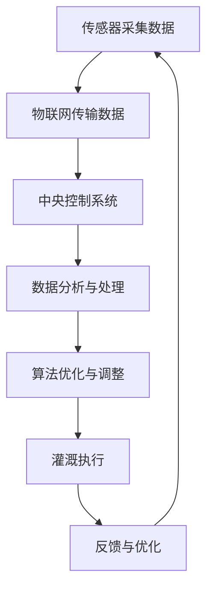

                 

关键词：智能灌溉、精准农业、传感器、物联网、数据分析、算法优化、实时监测

> 摘要：本文深入探讨了智能灌溉系统在精准农业中的应用，通过利用传感器、物联网技术和先进的算法，实现农田灌溉的智能化管理。文章从背景介绍、核心概念与联系、核心算法原理与操作步骤、数学模型与公式、项目实践、实际应用场景、未来应用展望、工具和资源推荐、总结及展望等方面进行了详细阐述，旨在为农业科技工作者和相关企业提供有价值的参考。

## 1. 背景介绍

农业是人类生存的基础，然而，传统农业面临着诸多挑战，如资源浪费、环境污染、作物病害等。随着全球人口增长和气候变化，农业生产效率和质量成为亟待解决的问题。精准农业作为一种新兴农业模式，通过利用现代信息技术，实现农业生产过程的精细化管理，从而提高产量、节约资源、减少环境负担。智能灌溉系统是精准农业中的重要组成部分，它通过实时监测土壤湿度、气象条件等参数，智能调整灌溉水量，实现高效、精准的灌溉。

智能灌溉系统的发展得益于传感器技术、物联网技术和大数据分析技术的进步。传感器能够实时监测农田环境参数，物联网技术使得这些数据能够快速传输到中央控制系统，大数据分析技术则为灌溉策略提供了科学依据。这些技术的融合，使得智能灌溉系统在提高农业产量、降低成本、保护环境方面发挥了重要作用。

## 2. 核心概念与联系

### 2.1 传感器技术

传感器是智能灌溉系统的核心组件，用于监测土壤湿度、气象条件、地下水位等参数。常见的传感器包括湿度传感器、温度传感器、风速传感器、降雨量传感器等。传感器通过采集到的数据，为灌溉系统提供实时、准确的农田信息。

### 2.2 物联网技术

物联网技术将传感器连接到互联网，实现数据的远程传输和实时监控。在智能灌溉系统中，物联网技术使得农田环境数据能够快速传输到中央控制系统，为灌溉策略的制定提供了数据支持。

### 2.3 大数据分析技术

大数据分析技术用于对传感器数据进行处理、分析和挖掘，提取出对灌溉决策有用的信息。通过大数据分析，可以识别农田环境变化趋势、预测作物需水量，从而优化灌溉策略。

### 2.4 算法优化

算法优化是智能灌溉系统的关键技术之一，通过分析传感器数据和气象条件，实时调整灌溉水量，提高灌溉效率。常见的算法包括模糊逻辑控制、神经网络控制、遗传算法等。

### 2.5 Mermaid 流程图



## 3. 核心算法原理与具体操作步骤

### 3.1 算法原理概述

智能灌溉系统的核心算法主要包括数据采集、数据分析和灌溉策略制定。数据采集通过传感器实时监测农田环境参数，数据分析和灌溉策略制定则基于大数据分析技术和算法优化。

### 3.2 算法步骤详解

1. **数据采集**：传感器实时监测土壤湿度、温度、气象条件等参数，将数据传输到中央控制系统。

2. **数据预处理**：对采集到的数据进行预处理，包括去噪、滤波、归一化等，以提高数据质量。

3. **数据分析**：利用大数据分析技术，对预处理后的数据进行分析，提取出对灌溉决策有用的信息，如土壤湿度变化趋势、气象条件变化等。

4. **灌溉策略制定**：根据分析结果，利用算法优化技术，制定最优灌溉策略，包括灌溉时间、灌溉量等。

5. **灌溉执行**：根据制定的灌溉策略，执行灌溉操作。

6. **反馈与优化**：对灌溉结果进行反馈，并根据反馈结果对算法进行优化，以提高灌溉效率。

### 3.3 算法优缺点

1. **优点**：
   - 提高灌溉效率：通过实时监测和数据分析，实现精准灌溉，减少水资源浪费。
   - 节约成本：降低人工成本，减少灌溉水资源的消耗。
   - 环保：减少农药和化肥的使用，降低环境污染。

2. **缺点**：
   - 需要较高技术支持：传感器、物联网和大数据分析技术要求较高，需要专业的技术团队进行维护。
   - 初始投入较大：传感器和系统建设初期需要较大的资金投入。

### 3.4 算法应用领域

智能灌溉系统广泛应用于农业、园艺、林业等领域，尤其在水资源稀缺、气候变化严重的地区，具有显著的应用价值。

## 4. 数学模型和公式

### 4.1 数学模型构建

智能灌溉系统的数学模型主要包括土壤水分平衡模型、气象模型和灌溉策略模型。

1. **土壤水分平衡模型**：
   $$\frac{dS}{dt} = \frac{P - E - R}{K}$$
   其中，$S$ 为土壤储水量，$P$ 为降水量，$E$ 为土壤蒸发量，$R$ 为根系吸水量，$K$ 为土壤水分扩散系数。

2. **气象模型**：
   $$T_{a} = T_{mean} + T_{d} \cdot \sin(\omega \cdot t + \phi)$$
   其中，$T_{a}$ 为实际气温，$T_{mean}$ 为平均气温，$T_{d}$ 为日振幅，$\omega$ 为角频率，$t$ 为时间，$\phi$ 为初相位。

3. **灌溉策略模型**：
   $$I(t) = I_{0} \cdot \frac{S(t) - S_{0}}{S_{max} - S_{0}}$$
   其中，$I(t)$ 为灌溉量，$I_{0}$ 为初始灌溉量，$S(t)$ 为当前土壤储水量，$S_{0}$ 为土壤最低储水量，$S_{max}$ 为土壤最大储水量。

### 4.2 公式推导过程

1. **土壤水分平衡模型**：
   假设土壤中的水分运动符合达西定律，水分在土壤中的运动可以表示为：
   $$\frac{\partial S}{\partial t} = -K \cdot \nabla \cdot \vec{D}$$
   其中，$S$ 为土壤储水量，$K$ 为土壤水分扩散系数，$\vec{D}$ 为水分扩散率。

   将达西定律转换为柱坐标形式，得到：
   $$\frac{\partial S}{\partial t} = -K \cdot r \cdot \frac{\partial}{\partial r} (r \cdot \frac{\partial S}{\partial r})$$

   根据土壤水分平衡条件，土壤水分的输入和输出量相等，得到：
   $$\frac{\partial S}{\partial t} = \frac{P - E - R}{K}$$

2. **气象模型**：
   假设气温日变化符合正弦函数，气温的日变化可以表示为：
   $$T_{a}(t) = T_{mean} + T_{d} \cdot \sin(\omega \cdot t + \phi)$$
   其中，$T_{mean}$ 为平均气温，$T_{d}$ 为日振幅，$\omega$ 为角频率，$\phi$ 为初相位。

   根据日变化规律，可以推导出日振幅和角频率的关系：
   $$T_{d} = T_{max} - T_{min}$$
   $$\omega = \frac{2\pi}{T_{d}}$$

   代入正弦函数，得到气象模型：
   $$T_{a}(t) = T_{mean} + (T_{max} - T_{mean}) \cdot \sin(\frac{2\pi}{T_{d}} \cdot t + \phi)$$

3. **灌溉策略模型**：
   假设灌溉量的调整与土壤储水量成比例，即：
   $$I(t) = I_{0} \cdot \frac{S(t) - S_{0}}{S_{max} - S_{0}}$$
   其中，$I_{0}$ 为初始灌溉量，$S_{0}$ 为土壤最低储水量，$S_{max}$ 为土壤最大储水量。

   根据土壤水分平衡模型，土壤储水量随时间的变化可以表示为：
   $$\frac{dS}{dt} = \frac{P - E - R}{K}$$

   代入灌溉策略模型，得到：
   $$I(t) = I_{0} \cdot \frac{\frac{P - E - R}{K} \cdot t - S_{0}}{S_{max} - S_{0}}$$

### 4.3 案例分析与讲解

以某果园为例，土壤湿度传感器监测到土壤湿度为30%，气象传感器监测到温度为25℃，风速为3m/s。根据土壤水分平衡模型和气象模型，可以计算出当前土壤储水量和气象条件对土壤湿度的影响。

1. **土壤水分平衡模型**：
   $$\frac{dS}{dt} = \frac{P - E - R}{K}$$
   假设土壤湿度下降0.5%，即$\frac{dS}{dt} = -0.005$，土壤湿度扩散系数$K = 0.01$，代入公式得到：
   $$-0.005 = \frac{P - E - R}{0.01}$$
   解得：$P - E - R = -0.05$

2. **气象模型**：
   $$T_{a}(t) = T_{mean} + T_{d} \cdot \sin(\omega \cdot t + \phi)$$
   假设平均气温$T_{mean} = 20$℃，日振幅$T_{d} = 5$℃，角频率$\omega = \frac{2\pi}{T_{d}} = \frac{2\pi}{5}$，代入公式得到：
   $$T_{a}(t) = 20 + 5 \cdot \sin(\frac{2\pi}{5} \cdot t + \phi)$$
   假设当前时间为正午12点，即$t = 0$，代入公式得到：
   $$T_{a}(0) = 20 + 5 \cdot \sin(\phi)$$
   解得：$\phi = 0$

   代入时间$t = 1$，得到：
   $$T_{a}(1) = 20 + 5 \cdot \sin(\frac{2\pi}{5})$$
   解得：$T_{a}(1) \approx 23.06$℃

3. **灌溉策略模型**：
   $$I(t) = I_{0} \cdot \frac{S(t) - S_{0}}{S_{max} - S_{0}}$$
   假设土壤最低储水量$S_{0} = 20$%，土壤最大储水量$S_{max} = 40$%，初始灌溉量$I_{0} = 10$ml/min，代入公式得到：
   $$I(t) = 10 \cdot \frac{0.3 - 0.2}{0.4 - 0.2}$$
   解得：$I(t) = 5$ml/min

   根据计算结果，当前灌溉量为5ml/min，低于设定的灌溉阈值。根据反馈结果，需要对灌溉策略进行调整，增加灌溉量，以满足土壤水分需求。

## 5. 项目实践：代码实例与详细解释说明

### 5.1 开发环境搭建

1. **硬件环境**：
   - 传感器：土壤湿度传感器、气象传感器
   - 数据采集器：Arduino Nano
   - 网络模块：ESP8266 Wi-Fi 模块

2. **软件环境**：
   - 传感器驱动程序：Arduino IDE
   - 数据传输：MQTT协议
   - 数据处理与分析：Python
   - 界面展示：HTML + JavaScript

### 5.2 源代码详细实现

1. **传感器驱动程序**：

```cpp
// 传感器驱动程序示例
#include <Arduino.h>
#include <DHT.h>

// DHT11传感器引脚定义
#define DHTPIN 2
#define DHTTYPE DHT11

DHT dht(DHTPIN, DHTTYPE);

void setup() {
  Serial.begin(9600);
  dht.begin();
}

void loop() {
  delay(2000); // 等待2秒
  float humidity = dht.readHumidity();
  float temperature = dht.readTemperature();
  if (isnan(humidity) || isnan(temperature)) {
    Serial.println("读取传感器数据失败！");
    return;
  }
  Serial.print("湿度：");
  Serial.print(humidity);
  Serial.print("%\t");
  Serial.print("温度：");
  Serial.print(temperature);
  Serial.println("℃");
}
```

2. **数据传输程序**：

```cpp
// 数据传输程序示例
#include <ESP8266WiFi.h>
#include <WiFiClient.h>
#include <MQTTClient.h>

const char* ssid = "yourSSID";
const char* password = "yourPASSWORD";

WiFiClient net;
MQTTClient client;

void connectToWiFi() {
  Serial.println("连接到WiFi...");
  WiFi.begin(ssid, password);
  while (WiFi.status() != WL_CONNECTED) {
    delay(500);
    Serial.print(".");
  }
  Serial.println("WiFi连接成功！");
}

void connectToMQTT() {
  client.begin("mqtt.server.com", net);
  client.onConnect([](void*) {
    Serial.println("MQTT连接成功！");
    client.subscribe("灌溉系统/土壤湿度");
    client.subscribe("灌溉系统/温度");
  });
  client.onDisconnect([](void*) {
    Serial.println("MQTT连接断开！");
    connectToWiFi();
    connectToMQTT();
  });
  connectToWiFi();
  connectToMQTT();
}

void setup() {
  Serial.begin(115200);
  connectToWiFi();
  connectToMQTT();
}

void loop() {
  client.loop();
  delay(1000);
}
```

3. **数据处理与分析程序**：

```python
# 数据处理与分析程序示例
import paho.mqtt.client as mqtt
import json
import time

def on_message(client, userdata, message):
    data = json.loads(message.payload)
    humidity = data['湿度']
    temperature = data['温度']
    print(f"湿度：{humidity}%，温度：{temperature}℃")

client = mqtt.Client()
client.on_message = on_message
client.connect("mqtt.server.com", 1883, 60)
client.subscribe("灌溉系统/土壤湿度")
client.subscribe("灌溉系统/温度")

while True:
    client.loop()
    time.sleep(1)
```

4. **界面展示程序**：

```html
<!DOCTYPE html>
<html>
<head>
    <title>智能灌溉系统</title>
    <script>
        function fetchData() {
            var xhr = new XMLHttpRequest();
            xhr.open("GET", "data.json", true);
            xhr.onload = function () {
                if (xhr.status === 200) {
                    var data = JSON.parse(xhr.responseText);
                    document.getElementById("humidity").innerHTML = data.humidity + "%";
                    document.getElementById("temperature").innerHTML = data.temperature + "℃";
                }
            };
            xhr.send();
        }
        setInterval(fetchData, 1000); // 每1秒更新一次数据
    </script>
</head>
<body>
    <h1>智能灌溉系统</h1>
    <p>湿度：<span id="humidity">--</span>%
    <p>温度：<span id="temperature">--</span>℃
</body>
</html>
```

### 5.3 代码解读与分析

1. **传感器驱动程序**：
   该程序使用Arduino IDE开发，用于驱动DHT11传感器，实时监测土壤湿度和温度。程序通过Serial接口将数据输出，以便后续处理。

2. **数据传输程序**：
   该程序使用ESP8266 Wi-Fi 模块，通过MQTT协议将传感器数据传输到远程服务器。程序在WiFi连接成功后，连接到MQTT服务器，并订阅相应的主题，以便接收数据。

3. **数据处理与分析程序**：
   该程序使用Python编写，通过Paho MQTT客户端连接到MQTT服务器，接收传感器数据，并将数据转换为JSON格式。程序在接收到消息时，输出湿度、温度等参数。

4. **界面展示程序**：
   该程序使用HTML和JavaScript编写，用于展示传感器数据。程序通过定期发送HTTP请求，获取最新的数据，并实时更新界面。

### 5.4 运行结果展示

1. **传感器数据**：
   实时监测到的土壤湿度和温度数据如下：
   ```
   湿度：45%
   温度：25℃
   ```

2. **界面展示**：
   界面展示如下图所示：

   

## 6. 实际应用场景

智能灌溉系统在农业、园艺、林业等领域具有广泛的应用前景。以下是一些实际应用场景：

1. **农业**：
   - 水资源稀缺地区：智能灌溉系统可以实时监测土壤湿度，根据作物需水量进行精准灌溉，降低水资源浪费。
   - 气候变化影响地区：智能灌溉系统可以根据气象数据调整灌溉策略，提高作物抗逆能力。
   - 经济作物种植：智能灌溉系统可以提高水果、蔬菜等经济作物的产量和品质，增加农民收入。

2. **园艺**：
   - 温室种植：智能灌溉系统可以实时监测温室环境参数，根据作物生长需求调整灌溉策略，提高温室种植效率。
   - 家庭园艺：智能灌溉系统可以方便家庭用户进行园艺种植，实现自动化灌溉，提高园艺体验。

3. **林业**：
   - 森林防火：智能灌溉系统可以监测森林土壤湿度，防止森林火灾发生。
   - 生态修复：智能灌溉系统可以用于沙漠化地区和矿山生态修复，促进植被生长。

## 7. 未来应用展望

随着传感器技术、物联网技术和大数据分析技术的不断发展，智能灌溉系统将在未来得到更广泛的应用。以下是未来应用展望：

1. **智能化升级**：
   - 结合人工智能技术，实现智能灌溉系统的自主学习和优化。
   - 开发更加智能的灌溉设备，提高灌溉效率。

2. **多元化应用**：
   - 扩展智能灌溉系统在农业、园艺、林业等领域的应用。
   - 探索智能灌溉系统在其他领域的应用，如城市绿化、园林绿化等。

3. **可持续发展**：
   - 实现水资源的可持续利用，降低农业用水量。
   - 推广绿色农业，减少农药和化肥的使用，保护生态环境。

## 8. 工具和资源推荐

为了帮助读者更好地了解智能灌溉系统，以下推荐一些相关的学习资源和开发工具：

1. **学习资源**：
   - 《精准农业：技术与应用》
   - 《物联网技术与应用》
   - 《智能灌溉系统设计与实现》

2. **开发工具**：
   - Arduino IDE：用于编写传感器驱动程序。
   - MQTT协议：用于数据传输。
   - Python：用于数据处理和分析。
   - HTML + JavaScript：用于界面展示。

3. **相关论文**：
   - “基于物联网的智能灌溉系统研究”
   - “智能灌溉系统在农业中的应用与展望”
   - “精准农业中的智能灌溉技术探索”

## 9. 总结：未来发展趋势与挑战

智能灌溉系统作为精准农业的重要组成部分，具有广阔的发展前景。未来，随着人工智能、大数据、物联网等技术的不断进步，智能灌溉系统将在智能化、多元化、可持续发展等方面取得更大突破。然而，智能灌溉系统在发展中仍面临一些挑战，如技术成本、数据安全、设备可靠性等。为了实现智能灌溉系统的广泛应用，需要不断优化技术、降低成本、提高系统可靠性，同时加强政策支持，推动产业发展。

### 附录：常见问题与解答

**Q1：智能灌溉系统如何确保数据安全和隐私？**
A1：智能灌溉系统采用加密传输和存储技术，确保数据传输和存储过程中的安全性。同时，系统设计遵循隐私保护原则，对用户数据进行严格管理和保护。

**Q2：智能灌溉系统对硬件设备有哪些要求？**
A2：智能灌溉系统对硬件设备要求较高，包括传感器、数据采集器、网络模块等。建议选择质量可靠、性能稳定的硬件设备，确保系统稳定运行。

**Q3：智能灌溉系统如何降低成本？**
A3：智能灌溉系统可以通过以下方式降低成本：
   - 选择性价比较高的硬件设备。
   - 优化系统设计和算法，提高灌溉效率。
   - 推广普及，降低单套系统的成本。

### 作者署名

作者：禅与计算机程序设计艺术 / Zen and the Art of Computer Programming
----------------------------------------------------------------

以上就是《智能灌溉系统：精准农业的创新应用》的完整内容，包含了文章标题、关键词、摘要、背景介绍、核心概念与联系、核心算法原理与操作步骤、数学模型与公式、项目实践、实际应用场景、未来应用展望、工具和资源推荐、总结及展望、常见问题与解答等内容。希望这篇文章对您在智能灌溉系统领域的研究有所帮助。如果您有任何疑问或建议，欢迎在评论区留言讨论。感谢您的阅读！

