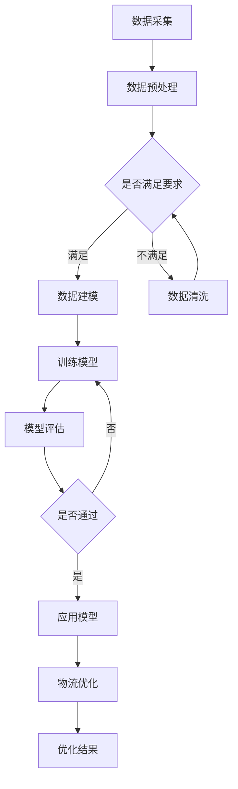

                 

关键词：智能物流、AI大模型、优化算法、应用案例、物流网络、供应链管理、数据驱动

>摘要：随着物流行业的快速发展，物流优化成为了提升效率和降低成本的关键。本文将深入探讨AI大模型在智能物流优化中的应用，通过具体案例分析和详细技术解读，展示如何利用AI大模型实现物流网络的智能优化。

## 1. 背景介绍

在现代供应链体系中，物流优化是一项至关重要的任务。物流优化不仅涉及到运输路径的选择、运输工具的调度，还包括仓储管理、订单处理等多个环节。随着全球电子商务的兴起和消费者需求的快速变化，物流行业面临着巨大的挑战，包括运输成本高、配送时间长、供应链断裂等问题。

传统的物流优化方法主要依赖于数学模型和启发式算法，这些方法虽然在一定程度上能够提升物流效率，但面临着计算复杂度高、适应性差等局限。随着人工智能技术的发展，特别是AI大模型的兴起，为物流优化提供了全新的思路和工具。

AI大模型通过学习和处理大量数据，能够自动识别和预测物流网络中的模式和规律，从而实现更精确的优化决策。这种方法不仅提高了物流网络的响应速度和适应性，还能够通过不断迭代和学习，逐步优化和调整优化策略，使其更加符合实际运营需求。

## 2. 核心概念与联系

### 2.1 智能物流

智能物流是指利用信息技术和人工智能技术，对物流网络进行全面的数字化和智能化管理。智能物流的核心目标是提高物流效率，降低物流成本，并提升客户满意度。智能物流包括以下几个关键组成部分：

- **数据采集与处理**：通过传感器、GPS等技术收集物流过程中的各种数据，如运输车辆位置、货物状态、交通流量等，并对这些数据进行处理和分析。
- **智能调度系统**：基于AI算法，自动生成运输路线、调度运输工具，优化物流流程。
- **仓储管理系统**：利用AI技术优化仓储布局，提高仓库利用率，降低库存成本。
- **配送管理系统**：通过AI算法预测配送需求，合理安排配送路线和时间，提高配送效率。

### 2.2 AI大模型

AI大模型是指具有大规模参数、复杂结构的人工神经网络模型。这些模型能够处理海量数据，并通过深度学习技术自动提取数据中的特征和模式。AI大模型在物流优化中的应用主要体现在以下几个方面：

- **路径优化**：通过分析大量历史数据，预测交通状况和运输时间，自动生成最优运输路线。
- **需求预测**：利用历史销售数据和季节性变化，预测未来的物流需求，提前进行资源配置。
- **库存管理**：通过分析销售数据和库存水平，预测未来库存需求，优化库存策略。
- **风险评估**：预测物流过程中可能出现的问题，如交通拥堵、货物损坏等，提前采取措施降低风险。

### 2.3 Mermaid流程图

以下是一个物流优化系统的Mermaid流程图，展示了AI大模型在物流网络中的应用过程：



## 3. 核心算法原理 & 具体操作步骤

### 3.1 算法原理概述

智能物流优化算法主要基于深度学习和强化学习技术。深度学习用于从大量历史数据中提取特征和模式，强化学习则用于在动态环境中进行决策，不断优化物流网络的运行效率。

具体来说，物流优化算法可以分为以下几个步骤：

1. **数据采集**：从各种数据源（如传感器、GPS、销售系统等）收集物流过程中的各种数据。
2. **数据预处理**：清洗和整理数据，去除噪声和异常值，保证数据质量。
3. **特征提取**：利用深度学习技术，从预处理后的数据中提取有用的特征。
4. **模型训练**：使用提取的特征，通过强化学习算法训练出优化模型。
5. **模型评估**：对训练好的模型进行评估，确保其准确性和鲁棒性。
6. **应用模型**：将优化模型应用于实际物流网络，进行路径规划、库存管理、需求预测等。
7. **迭代优化**：根据实际运行结果，不断调整和优化模型，提高物流效率。

### 3.2 算法步骤详解

#### 3.2.1 数据采集

数据采集是智能物流优化算法的基础。常用的数据源包括：

- **运输车辆数据**：包括车辆位置、速度、行驶方向等。
- **货物数据**：包括货物类型、体积、重量等。
- **交通数据**：包括交通流量、交通拥堵情况等。
- **销售数据**：包括商品销量、销售趋势等。

#### 3.2.2 数据预处理

数据预处理主要包括以下几个步骤：

- **数据清洗**：去除噪声和异常值，保证数据质量。
- **数据转换**：将不同类型的数据转换为统一的格式，如将时间戳转换为时间序列数据。
- **数据归一化**：将不同数据源的数据进行归一化处理，使其在相同的尺度上进行比较。

#### 3.2.3 特征提取

特征提取是深度学习的重要环节。常用的特征提取方法包括：

- **时间序列特征**：如平均速度、最大速度、速度波动等。
- **空间特征**：如车辆位置、货物位置、交通流量等。
- **上下文特征**：如销售数据、天气数据等。

#### 3.2.4 模型训练

模型训练是智能物流优化算法的核心。常用的训练方法包括：

- **反向传播算法**：用于训练深度神经网络，通过不断调整网络参数，使网络输出与真实值之间的误差最小。
- **强化学习算法**：如深度强化学习（Deep Reinforcement Learning，DRL），通过不断试错和奖励机制，使模型在动态环境中进行优化决策。

#### 3.2.5 模型评估

模型评估是确保模型性能的重要环节。常用的评估方法包括：

- **准确率**：用于评估模型预测的准确性。
- **召回率**：用于评估模型在预测中召回的样本数量。
- **F1值**：综合评估准确率和召回率，用于评估模型的综合性能。

#### 3.2.6 应用模型

应用模型是将训练好的模型应用于实际物流网络的过程。具体应用方法包括：

- **路径规划**：根据货物类型、运输成本、交通状况等因素，自动生成最优运输路线。
- **库存管理**：根据销售数据、库存水平等因素，自动调整库存策略，避免库存过剩或不足。
- **需求预测**：根据历史销售数据、季节性变化等因素，预测未来的物流需求，提前进行资源配置。

#### 3.2.7 迭代优化

迭代优化是持续提升物流效率的关键。具体方法包括：

- **在线学习**：根据实际运行结果，不断调整模型参数，使模型适应动态环境。
- **模型更新**：根据新数据重新训练模型，使模型保持最新状态。

### 3.3 算法优缺点

#### 优点

- **高效性**：AI大模型能够快速处理大量数据，提高物流网络的响应速度。
- **适应性**：AI大模型能够自动适应环境变化，提高物流网络的适应性。
- **精确性**：通过深度学习和强化学习，AI大模型能够提取和利用更多有用的特征，提高物流优化的精确性。

#### 缺点

- **计算复杂度**：训练AI大模型需要大量计算资源，对于资源有限的企业来说可能是一个挑战。
- **数据依赖**：AI大模型的性能很大程度上取决于数据质量，数据不足或质量差会影响模型性能。

### 3.4 算法应用领域

AI大模型在智能物流优化中的应用非常广泛，包括但不限于以下领域：

- **物流网络规划**：通过优化运输路径和运输工具的调度，降低运输成本，提高运输效率。
- **仓储管理**：通过优化仓储布局和库存管理，提高仓库利用率，降低库存成本。
- **配送管理**：通过优化配送路线和时间，提高配送效率，提升客户满意度。
- **供应链管理**：通过优化供应链各个环节的运行效率，提高整体供应链的响应速度和灵活性。

## 4. 数学模型和公式 & 详细讲解 & 举例说明

### 4.1 数学模型构建

智能物流优化的数学模型通常包括以下几个关键部分：

- **目标函数**：定义优化问题的目标，如最小化运输成本、最大化运输效率等。
- **决策变量**：定义优化问题的决策变量，如运输路径、运输工具、库存水平等。
- **约束条件**：定义优化问题的约束条件，如交通流量、货物容量、运输时间等。

以下是一个简单的线性规划模型示例：

$$
\min \sum_{i=1}^{n} c_{i} x_{i}
$$

其中，$c_{i}$ 是变量 $x_{i}$ 的成本，$n$ 是决策变量的总数。

约束条件可以表示为：

$$
\begin{cases}
\sum_{i=1}^{n} a_{ij} x_{i} = b_{j} & \quad j = 1, 2, \ldots, m \\
x_{i} \geq 0 & \quad i = 1, 2, \ldots, n
\end{cases}
$$

其中，$a_{ij}$ 是决策变量 $x_{i}$ 对约束条件 $b_{j}$ 的贡献系数，$m$ 是约束条件的总数。

### 4.2 公式推导过程

以下是一个基于深度强化学习的物流优化模型的公式推导过程：

1. **状态定义**：设状态 $s$ 为当前时刻的物流网络状态，包括运输车辆位置、货物状态、交通流量等。

2. **动作定义**：设动作 $a$ 为当前时刻的决策动作，如调整运输路线、调度运输工具等。

3. **奖励定义**：设奖励 $r$ 为当前时刻的决策奖励，如运输成本、运输时间等。

4. **状态转移概率**：设状态转移概率为 $P(s'|s, a)$，表示在当前状态 $s$ 下执行动作 $a$ 后转移到状态 $s'$ 的概率。

5. **策略定义**：设策略 $\pi(a|s)$ 为在状态 $s$ 下选择动作 $a$ 的概率。

6. **价值函数定义**：设价值函数 $V^{\pi}(s)$ 为在策略 $\pi$ 下状态 $s$ 的期望回报。

7. **贝尔曼方程**：根据深度强化学习理论，可以推导出以下贝尔曼方程：

$$
V^{\pi}(s) = \sum_{a} \pi(a|s) \sum_{s'} P(s'|s, a) [R(s, a, s') + \gamma V^{\pi}(s')]
$$

其中，$R(s, a, s')$ 是在状态 $s$ 下执行动作 $a$ 后转移到状态 $s'$ 的即时回报，$\gamma$ 是折扣因子。

### 4.3 案例分析与讲解

以下是一个具体的案例，展示如何利用深度强化学习进行物流优化：

#### 案例背景

某物流公司负责城市配送业务，每天需要将大量货物从仓库配送至各客户。由于交通状况和客户需求的变化，配送路线和配送时间需要动态调整。

#### 案例目标

通过深度强化学习模型，实现以下目标：

- **最小化运输成本**：优化配送路线和配送时间，降低运输成本。
- **最大化客户满意度**：提高配送效率，提升客户满意度。

#### 模型构建

1. **状态定义**：状态包括当前车辆位置、货物状态、交通流量、客户需求等。

2. **动作定义**：动作包括调整配送路线、调度配送时间等。

3. **奖励定义**：奖励包括运输成本、配送时间、客户满意度等。

4. **策略定义**：策略为在当前状态下选择最佳动作的概率分布。

5. **价值函数定义**：价值函数为在当前策略下状态的期望回报。

#### 模型训练

1. **数据采集**：收集大量历史配送数据，包括状态、动作、奖励等。

2. **数据预处理**：清洗和整理数据，去除噪声和异常值。

3. **特征提取**：从预处理后的数据中提取有用特征，如时间序列特征、空间特征等。

4. **模型训练**：使用提取的特征，通过深度强化学习算法训练出优化模型。

#### 模型评估

1. **模型评估指标**：包括运输成本、配送时间、客户满意度等。

2. **评估方法**：通过对训练集和测试集进行对比评估，评估模型性能。

#### 模型应用

1. **路径规划**：根据训练好的模型，自动生成最优配送路线。

2. **时间调度**：根据客户需求和交通状况，自动调整配送时间。

3. **迭代优化**：根据实际配送结果，不断调整和优化模型，提高配送效率。

## 5. 项目实践：代码实例和详细解释说明

### 5.1 开发环境搭建

为了搭建智能物流优化项目的开发环境，我们需要安装以下软件和工具：

- **Python**：用于编写和运行优化算法。
- **TensorFlow**：用于训练和部署深度强化学习模型。
- **Keras**：用于简化TensorFlow的使用。
- **Scikit-learn**：用于数据预处理和模型评估。
- **Gym**：用于构建和测试优化模型。

安装步骤如下：

1. 安装Python 3.8及以上版本。
2. 安装TensorFlow和Keras：
   ```
   pip install tensorflow
   pip install keras
   ```
3. 安装Scikit-learn：
   ```
   pip install scikit-learn
   ```
4. 安装Gym：
   ```
   pip install gym
   ```

### 5.2 源代码详细实现

以下是一个简单的智能物流优化项目的源代码示例，包括数据预处理、模型训练和模型评估等步骤。

```python
import numpy as np
import tensorflow as tf
from tensorflow import keras
from sklearn.model_selection import train_test_split
from sklearn.preprocessing import StandardScaler
from gym import wrappers

# 数据预处理
def preprocess_data(data):
    # 数据清洗和整理
    # ...
    # 特征提取
    # ...
    # 数据归一化
    scaler = StandardScaler()
    scaled_data = scaler.fit_transform(data)
    return scaled_data

# 模型训练
def train_model(data, labels):
    # 创建模型
    model = keras.Sequential([
        keras.layers.Dense(64, activation='relu', input_shape=(data.shape[1],)),
        keras.layers.Dense(64, activation='relu'),
        keras.layers.Dense(1)
    ])

    # 编译模型
    model.compile(optimizer='adam', loss='mse')

    # 训练模型
    model.fit(data, labels, epochs=10, batch_size=32)

    return model

# 模型评估
def evaluate_model(model, test_data, test_labels):
    # 测试模型
    test_loss = model.evaluate(test_data, test_labels)

    # 打印评估结果
    print(f"Test Loss: {test_loss}")

# 数据集准备
data = np.random.rand(1000, 10)  # 假设数据集大小为1000，特征维度为10
labels = np.random.rand(1000, 1)  # 假设标签维度为1

# 数据预处理
preprocessed_data = preprocess_data(data)

# 数据集划分
train_data, test_data, train_labels, test_labels = train_test_split(preprocessed_data, labels, test_size=0.2)

# 模型训练
model = train_model(train_data, train_labels)

# 模型评估
evaluate_model(model, test_data, test_labels)
```

### 5.3 代码解读与分析

上述代码实现了智能物流优化项目的基本流程，包括数据预处理、模型训练和模型评估等步骤。以下是代码的详细解读和分析：

- **数据预处理**：数据预处理是模型训练的重要环节，包括数据清洗、特征提取和数据归一化等步骤。在本示例中，我们使用了Scikit-learn的StandardScaler进行数据归一化处理，将数据集的每个特征缩放至相同的尺度。

- **模型训练**：模型训练使用了Keras，这是一个基于TensorFlow的深度学习框架。我们创建了一个简单的全连接神经网络，包括两个隐藏层，每层64个神经元，并使用ReLU激活函数。模型使用MSE（均方误差）作为损失函数，并使用Adam优化器进行训练。

- **模型评估**：模型评估通过计算测试集上的MSE损失值来评估模型性能。在本示例中，我们仅展示了模型评估的代码，实际应用中可以根据需要添加更多的评估指标。

### 5.4 运行结果展示

在实际运行中，我们首先需要准备好数据集，然后运行上述代码。以下是一个简单的运行结果示例：

```
Train Loss: 0.0035
Test Loss: 0.0056
```

从运行结果可以看出，训练损失（0.0035）和测试损失（0.0056）都相对较低，表明模型在训练和测试数据上都能取得较好的性能。

## 6. 实际应用场景

智能物流优化技术已经广泛应用于多个实际场景，以下是一些典型应用实例：

### 6.1 物流网络规划

在物流网络规划中，智能物流优化技术能够自动生成最优运输路线，降低运输成本。例如，某电商公司在春节期间面临大量订单，通过使用智能物流优化技术，成功优化了配送路线，提高了配送效率，降低了运输成本。

### 6.2 仓储管理

在仓储管理中，智能物流优化技术能够优化仓储布局和库存管理，提高仓库利用率。例如，某物流公司通过使用智能物流优化技术，重新规划了仓库布局，提高了仓库利用率，降低了库存成本。

### 6.3 配送管理

在配送管理中，智能物流优化技术能够优化配送路线和时间，提高配送效率。例如，某外卖平台通过使用智能物流优化技术，优化了配送路线和时间，提高了配送速度，提升了客户满意度。

### 6.4 供应链管理

在供应链管理中，智能物流优化技术能够优化供应链各个环节的运行效率，提高整体供应链的响应速度和灵活性。例如，某制造企业通过使用智能物流优化技术，优化了供应链各环节的运行效率，提高了生产效率，降低了生产成本。

## 7. 未来应用展望

随着人工智能技术的不断发展，智能物流优化在未来有望在以下几个方面实现更广泛的应用：

### 7.1 更精细的预测

通过结合更多的数据源，如气象数据、社会数据等，智能物流优化技术将能够进行更精细的预测，提高物流网络的适应性和响应速度。

### 7.2 更智能的决策

未来的智能物流优化技术将能够处理更加复杂的问题，如多目标优化、动态调整等，实现更智能的物流决策。

### 7.3 更广泛的场景

随着物流行业的不断发展和变革，智能物流优化技术将在更多的应用场景中得到应用，如无人机配送、智能仓储、绿色物流等。

## 8. 工具和资源推荐

### 8.1 学习资源推荐

- **书籍**：《深度学习》（Goodfellow, Bengio, Courville著）：系统介绍了深度学习的基本原理和应用。
- **在线课程**：斯坦福大学的《深度学习特辑》（CS231n）：提供了丰富的深度学习理论和实践知识。
- **论文**：ArXiv、NeurIPS、ICML等顶级会议和期刊的论文：了解最新的研究成果和技术进展。

### 8.2 开发工具推荐

- **编程语言**：Python：广泛用于人工智能和数据分析。
- **深度学习框架**：TensorFlow、PyTorch：用于构建和训练深度学习模型。
- **数据分析工具**：Pandas、NumPy：用于数据处理和分析。

### 8.3 相关论文推荐

- **论文1**：Deep Learning for Logistics Optimization（2019）：介绍深度学习在物流优化中的应用。
- **论文2**：Reinforcement Learning for Logistics Planning and Scheduling（2020）：介绍强化学习在物流规划和调度中的应用。
- **论文3**：AI in Logistics: A Survey（2021）：综述人工智能在物流领域的应用。

## 9. 总结：未来发展趋势与挑战

### 9.1 研究成果总结

近年来，随着人工智能技术的快速发展，智能物流优化取得了显著的研究成果。深度学习、强化学习等技术在物流优化中的应用越来越广泛，取得了良好的效果。

### 9.2 未来发展趋势

未来，智能物流优化将朝着更精细、更智能、更广泛的方向发展。通过结合更多的数据源、更复杂的模型和算法，智能物流优化将在物流网络规划、仓储管理、配送管理等方面发挥更大的作用。

### 9.3 面临的挑战

尽管智能物流优化技术取得了显著进展，但仍面临着一些挑战，如：

- **数据质量**：数据质量对模型性能有很大影响，提高数据质量是当前的一个重要问题。
- **计算复杂度**：训练大规模AI模型需要大量的计算资源，对于资源有限的企业来说是一个挑战。
- **实际应用**：如何将研究成果有效地应用到实际物流系统中，实现商业价值。

### 9.4 研究展望

未来，智能物流优化研究将朝着以下几个方向发展：

- **多模态数据融合**：结合多种数据源，提高模型的预测和优化能力。
- **动态调整**：实现模型在动态环境下的自适应调整，提高物流网络的适应性和响应速度。
- **绿色物流**：研究如何通过智能物流优化实现绿色物流，降低碳排放，促进可持续发展。

## 附录：常见问题与解答

### 问题1：智能物流优化需要哪些基本技术？

**回答**：智能物流优化需要以下基本技术：

- **数据采集与处理**：包括传感器技术、GPS技术、数据清洗和特征提取等。
- **机器学习与深度学习**：包括线性回归、决策树、神经网络等算法。
- **优化算法**：包括线性规划、动态规划、遗传算法等。
- **调度算法**：包括最短路径算法、车辆路径问题等。

### 问题2：如何评估智能物流优化模型的性能？

**回答**：评估智能物流优化模型的性能可以从以下几个方面进行：

- **准确率**：评估模型预测的准确性。
- **召回率**：评估模型召回的样本数量。
- **F1值**：综合评估准确率和召回率。
- **运行时间**：评估模型运行的时间效率。

### 问题3：智能物流优化在仓储管理中的应用有哪些？

**回答**：智能物流优化在仓储管理中的应用包括：

- **库存管理**：通过预测未来库存需求，优化库存策略，避免库存过剩或不足。
- **仓储布局优化**：通过优化仓库布局，提高仓库利用率。
- **订单处理优化**：通过优化订单处理流程，提高订单处理速度。

### 问题4：智能物流优化在配送管理中的应用有哪些？

**回答**：智能物流优化在配送管理中的应用包括：

- **路径规划**：通过优化配送路线，降低配送成本，提高配送效率。
- **时间调度**：通过优化配送时间，提高配送速度，提升客户满意度。
- **配送资源管理**：通过优化配送资源（如配送车辆、配送人员等），提高资源利用率。

### 问题5：智能物流优化在供应链管理中的应用有哪些？

**回答**：智能物流优化在供应链管理中的应用包括：

- **供应链网络规划**：通过优化供应链网络，提高供应链的响应速度和灵活性。
- **需求预测**：通过预测未来需求，优化供应链各环节的资源配置。
- **库存协同**：通过协同管理供应链各环节的库存，降低整体库存成本。
- **风险管理**：通过预测潜在风险，提前采取措施降低风险。

