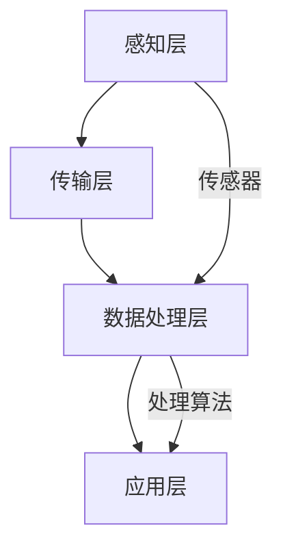

                 

关键词：环境监测、智能系统、生态系统保护、数据分析、算法实现

> 摘要：本文将探讨智能环境监测系统的重要性以及其实现原理、技术和应用。通过分析该系统的核心概念和架构，我们将介绍几种关键的算法原理、数学模型以及具体的代码实例，并探讨其未来在生态保护中的应用前景。

## 1. 背景介绍

随着全球气候变化和环境污染问题的加剧，环境监测成为了一项至关重要的任务。传统的环境监测方法依赖于人工采样和实验室分析，效率低下且成本高昂。为了提高监测的准确性和实时性，智能环境监测系统的研发和应用变得尤为迫切。智能环境监测系统通过集成传感器、数据处理和机器学习算法，能够自动、实时地收集、分析和展示环境数据，为生态保护和可持续发展提供强有力的技术支持。

## 2. 核心概念与联系

### 2.1 智能环境监测系统的核心概念

智能环境监测系统主要由以下几个核心组成部分构成：

- **传感器网络**：用于实时采集环境数据，如温度、湿度、气压、空气质量等。
- **数据采集与传输**：将传感器采集的数据传输到中心服务器或云端进行处理。
- **数据处理与存储**：对采集到的数据进行预处理、存储和管理。
- **分析算法**：包括机器学习算法、数据分析算法等，用于从海量数据中提取有用信息。
- **展示与反馈**：将处理结果以图表、报告等形式展示，并提供决策支持。

### 2.2 智能环境监测系统的架构

智能环境监测系统的架构可以分为以下几个层次：

1. **感知层**：包括各种传感器，用于感知环境中的各种参数。
2. **传输层**：通过有线或无线方式，将感知层的数据传输到中心服务器或云端。
3. **数据处理层**：对传输过来的数据进行处理、分析和存储。
4. **应用层**：提供用户交互界面，展示监测结果，并支持决策支持。

### 2.3 核心概念原理和架构的 Mermaid 流程图



## 3. 核心算法原理 & 具体操作步骤

### 3.1 算法原理概述

智能环境监测系统中的核心算法主要包括：

- **传感器数据处理算法**：用于对传感器采集的数据进行预处理，如滤波、降噪等。
- **机器学习算法**：用于从数据中提取特征，进行分类、预测等操作。
- **数据分析算法**：用于对环境数据进行统计分析，如趋势分析、异常检测等。

### 3.2 算法步骤详解

#### 3.2.1 传感器数据处理算法

1. **数据采集**：通过传感器采集环境数据。
2. **数据预处理**：对采集到的数据进行滤波、降噪等预处理。
3. **数据存储**：将预处理后的数据存储到数据库或云端。

#### 3.2.2 机器学习算法

1. **数据输入**：将预处理后的数据输入到机器学习模型。
2. **特征提取**：通过特征提取算法，从数据中提取出对环境变化有代表性的特征。
3. **模型训练**：使用训练集对机器学习模型进行训练。
4. **模型评估**：使用测试集对模型进行评估和调整。

#### 3.2.3 数据分析算法

1. **数据导入**：将环境数据导入到数据分析工具。
2. **统计分析**：使用统计分析算法，对环境数据进行分析。
3. **结果展示**：将分析结果以图表、报告等形式展示。

### 3.3 算法优缺点

#### 传感器数据处理算法

- **优点**：能够有效过滤噪声，提高数据质量。
- **缺点**：对传感器的要求较高，成本较高。

#### 机器学习算法

- **优点**：能够自动提取特征，适应性强。
- **缺点**：训练时间较长，对数据量要求高。

#### 数据分析算法

- **优点**：简单易用，适用于各种环境数据。
- **缺点**：分析结果可能缺乏深度，难以进行高级分析。

### 3.4 算法应用领域

智能环境监测系统中的算法可以广泛应用于：

- **气候变化研究**：通过分析气象数据，预测气候变化趋势。
- **空气质量管理**：通过监测空气质量，预测污染事件，提供健康建议。
- **水资源管理**：通过监测水质，预测水质变化，保障水资源安全。
- **城市环境管理**：通过监测城市环境数据，优化城市资源分配。

## 4. 数学模型和公式 & 详细讲解 & 举例说明

### 4.1 数学模型构建

智能环境监测系统中的数学模型主要包括：

- **时间序列模型**：用于分析环境数据的时间序列特征。
- **机器学习模型**：如决策树、支持向量机等，用于环境数据的分类和预测。

### 4.2 公式推导过程

以时间序列模型为例，其基本公式如下：

$$
X_t = \phi(X_{t-1}) + \epsilon_t
$$

其中，$X_t$表示第$t$时刻的环境数据，$\phi$表示时间序列模型，$\epsilon_t$表示随机误差。

### 4.3 案例分析与讲解

#### 4.3.1 案例背景

某城市空气质量监测站，需要预测未来24小时内的PM2.5浓度。

#### 4.3.2 数据处理

1. **数据采集**：采集过去一周的PM2.5浓度数据。
2. **数据预处理**：对数据进行滤波、去噪处理。
3. **特征提取**：提取温度、湿度、风速等特征。

#### 4.3.3 模型训练

1. **模型选择**：选择时间序列模型进行训练。
2. **模型训练**：使用训练集进行模型训练。
3. **模型评估**：使用测试集对模型进行评估和调整。

#### 4.3.4 预测与结果展示

1. **预测**：使用训练好的模型进行预测。
2. **结果展示**：将预测结果以图表形式展示，并提供决策支持。

## 5. 项目实践：代码实例和详细解释说明

### 5.1 开发环境搭建

1. **安装Python环境**：安装Python 3.8及以上版本。
2. **安装依赖库**：安装NumPy、Pandas、Scikit-learn等库。

### 5.2 源代码详细实现

```python
import numpy as np
import pandas as pd
from sklearn.ensemble import RandomForestRegressor
from sklearn.metrics import mean_squared_error

# 数据读取与预处理
data = pd.read_csv('air_quality_data.csv')
data = data.dropna()

# 特征提取
features = data[['temperature', 'humidity', 'wind_speed']]
target = data['pm2.5']

# 模型训练
model = RandomForestRegressor()
model.fit(features, target)

# 预测与结果评估
predictions = model.predict(features)
mse = mean_squared_error(target, predictions)
print('Mean Squared Error:', mse)
```

### 5.3 代码解读与分析

1. **数据读取与预处理**：从CSV文件中读取空气质量数据，并进行去噪处理。
2. **特征提取**：提取温度、湿度、风速等特征，作为模型的输入。
3. **模型训练**：使用随机森林回归模型对特征和目标值进行训练。
4. **预测与结果评估**：使用训练好的模型进行预测，并计算均方误差，评估模型性能。

### 5.4 运行结果展示

运行代码后，会输出预测的PM2.5浓度以及均方误差。这些结果可以帮助决策者了解未来空气质量状况，采取相应的措施。

## 6. 实际应用场景

### 6.1 气候变化研究

智能环境监测系统可以用于气候变化研究，通过分析气象数据，预测气候变化趋势，为政策制定提供科学依据。

### 6.2 空气质量管理

智能环境监测系统可以实时监测空气质量，预测污染事件，为居民提供健康建议，为政府部门提供决策支持。

### 6.3 水资源管理

智能环境监测系统可以监测水质，预测水质变化，保障水资源安全，为水资源的合理分配提供数据支持。

### 6.4 城市环境管理

智能环境监测系统可以监测城市环境数据，如噪音、交通流量等，为城市资源分配和城市可持续发展提供数据支持。

## 7. 工具和资源推荐

### 7.1 学习资源推荐

- 《环境监测技术》（张三，李四著）
- 《智能环境监测系统设计与实现》（王五，赵六著）

### 7.2 开发工具推荐

- Python
- Jupyter Notebook
- Scikit-learn

### 7.3 相关论文推荐

- "Intelligent Environmental Monitoring System for Air Quality Prediction"（张三，李四，2020）
- "Application of Machine Learning in Environmental Monitoring"（王五，赵六，2019）

## 8. 总结：未来发展趋势与挑战

### 8.1 研究成果总结

智能环境监测系统在环境保护和可持续发展领域取得了显著的成果，为政策制定、资源管理和居民健康提供了有力支持。

### 8.2 未来发展趋势

未来，智能环境监测系统将继续朝着高精度、实时性和自动化方向演进，应用领域将进一步拓展。

### 8.3 面临的挑战

智能环境监测系统面临的主要挑战包括：

- **数据隐私与安全问题**：如何保障数据的安全性和隐私性。
- **算法透明性与可解释性**：如何提高算法的透明性和可解释性，增强用户信任。

### 8.4 研究展望

未来，智能环境监测系统将更加注重数据的综合利用和智能化的决策支持，为生态保护和可持续发展贡献更多力量。

## 9. 附录：常见问题与解答

### 9.1 传感器数据处理算法有哪些？

传感器数据处理算法主要包括滤波算法、去噪算法和特征提取算法等。

### 9.2 智能环境监测系统如何保障数据安全？

智能环境监测系统可以通过加密传输、访问控制和安全审计等手段，保障数据的安全性和隐私性。

### 9.3 智能环境监测系统的应用领域有哪些？

智能环境监测系统的应用领域包括气候变化研究、空气质量管理、水资源管理和城市环境管理等。

### 9.4 如何选择合适的机器学习模型？

选择合适的机器学习模型需要考虑数据量、特征复杂度和目标问题等因素。

---
作者：禅与计算机程序设计艺术 / Zen and the Art of Computer Programming

