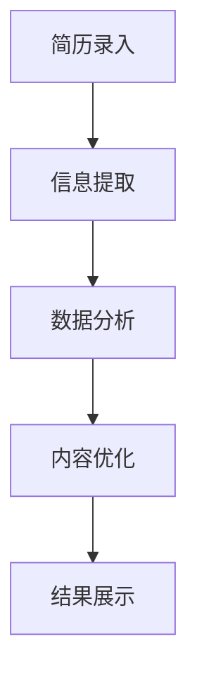

                 

 在当今竞争激烈的职场环境中，简历是求职者的敲门砖。一个出色的简历不仅需要展示求职者的专业技能和工作经验，还需要以引人注目的方式呈现。传统的简历制作往往费时费力，而且容易因为细节问题而影响求职效果。本文将探讨一款基于人工智能技术的智能简历制作工具，如何成为求职者的得力助手。

## 关键词

- 智能简历
- 人工智能
- 求职工具
- 自我展示
- 职场竞争

## 摘要

本文首先介绍了智能简历制作工具的基本概念和功能，分析了它如何利用人工智能技术帮助求职者提高简历质量。接着，文章详细探讨了智能简历的制作流程和核心技术，包括自然语言处理、数据挖掘和机器学习。随后，文章通过实际案例展示了智能简历的制作效果，并对该工具在实际应用中的效果进行了评估。最后，文章讨论了智能简历制作工具的未来发展趋势和面临的挑战。

## 1. 背景介绍

在过去的几十年中，简历的制作方式几乎没有太大变化。求职者通常需要手动整理自己的工作经历、教育背景、技能和成就，然后以文字的形式呈现给雇主。这种方式虽然简单直接，但存在几个显著的不足之处：

1. **个性化不足**：传统的简历格式往往千篇一律，缺乏个性化。
2. **信息冗余**：求职者需要花费大量时间筛选和整理信息，常常导致简历内容冗长、重复。
3. **易出错**：手动编辑简历容易产生格式错误、错别字等低级错误，影响简历的整体质量。
4. **缺乏互动性**：传统的简历缺乏与雇主之间的互动，无法根据雇主的需求进行动态调整。

随着人工智能技术的发展，这些传统问题逐渐得到了解决。智能简历制作工具应运而生，通过整合自然语言处理、数据挖掘和机器学习等技术，为求职者提供了全新的简历制作体验。智能简历制作工具不仅能够自动化简历的整理和排版，还能根据求职目标进行智能推荐，提升简历的个性化和精准度。

## 2. 核心概念与联系

### 2.1. 智能简历制作工具的核心概念

智能简历制作工具主要基于以下几项核心技术：

1. **自然语言处理（NLP）**：用于分析和理解简历文本内容，提取关键信息并进行语义分析。
2. **数据挖掘**：通过大数据分析，挖掘求职者简历中的潜在价值，为简历优化提供数据支持。
3. **机器学习**：利用机器学习算法，从大量简历数据中学习并预测最佳简历格式和内容。

### 2.2. 智能简历制作工具的工作原理

智能简历制作工具的工作原理可以分为以下几个步骤：

1. **简历录入**：求职者输入个人信息和简历内容。
2. **信息提取**：利用NLP技术从简历文本中提取关键信息。
3. **数据分析**：通过数据挖掘技术分析简历中的信息，找出潜在的价值点。
4. **内容优化**：根据机器学习算法的推荐，对简历内容进行优化，包括调整格式、语言表达和关键词等。
5. **结果展示**：生成优化后的智能简历，并供求职者查看和下载。

### 2.3. Mermaid 流程图



## 3. 核心算法原理 & 具体操作步骤

### 3.1. 算法原理概述

智能简历制作工具的核心算法包括自然语言处理（NLP）、数据挖掘和机器学习。以下是这些算法的基本原理：

1. **自然语言处理（NLP）**：NLP是人工智能的一个分支，旨在使计算机能够理解、处理和生成自然语言。在智能简历制作工具中，NLP用于分析简历文本，提取关键信息，如姓名、职位、工作经验、教育背景、技能等。
   
2. **数据挖掘**：数据挖掘是一种从大量数据中发现有价值信息的过程。在智能简历制作工具中，数据挖掘用于分析求职者的简历数据，找出潜在的模式和关联，从而为简历优化提供支持。

3. **机器学习**：机器学习是一种通过数据学习模式并自动做出决策的技术。在智能简历制作工具中，机器学习算法用于分析大量简历数据，学习最佳简历格式和内容，从而为求职者提供个性化的简历优化建议。

### 3.2. 算法步骤详解

1. **简历录入**：
   - 求职者通过在线平台或移动应用程序输入个人信息和简历内容。
   - 系统对输入的内容进行初步格式化，以便后续处理。

2. **信息提取**：
   - 利用NLP技术，系统对简历文本进行分词、词性标注和命名实体识别，提取关键信息。
   - 系统对提取的信息进行结构化处理，生成简历数据的内部表示。

3. **数据分析**：
   - 通过数据挖掘技术，系统分析简历中的信息，找出潜在的价值点，如高频关键词、工作经历中的成就等。
   - 系统根据分析结果，生成简历的初步优化方案。

4. **内容优化**：
   - 利用机器学习算法，系统对简历内容进行进一步优化，包括调整格式、语言表达和关键词等。
   - 系统根据求职目标，生成最佳的简历格式和内容。

5. **结果展示**：
   - 优化后的智能简历生成，并供求职者查看和下载。
   - 系统提供多种简历格式和模板，供求职者选择。

### 3.3. 算法优缺点

**优点**：

1. **高效性**：智能简历制作工具能够快速提取和优化简历内容，大大节省了求职者的时间和精力。
2. **个性化**：通过数据挖掘和机器学习技术，工具能够根据求职目标生成个性化的简历，提高求职成功率。
3. **准确性**：利用NLP技术，工具能够准确提取简历中的关键信息，避免因手动编辑而导致的错误。

**缺点**：

1. **局限性**：智能简历制作工具基于已有的数据和算法，可能无法完全理解求职者的个性特点和工作经历，导致简历内容不够丰富。
2. **依赖数据**：工具的性能依赖于简历数据的数量和质量，如果数据不足或质量不高，可能会影响简历优化的效果。

### 3.4. 算法应用领域

智能简历制作工具可以广泛应用于以下领域：

1. **求职**：求职者可以通过智能简历制作工具，快速生成符合招聘要求的简历，提高求职成功率。
2. **招聘**：招聘公司可以利用智能简历制作工具，自动筛选和优化简历，提高招聘效率。
3. **职业规划**：求职者可以利用智能简历制作工具，分析自己的简历数据，制定更有效的职业规划。

## 4. 数学模型和公式 & 详细讲解 & 举例说明

### 4.1. 数学模型构建

智能简历制作工具的数学模型主要包括自然语言处理（NLP）模型、数据挖掘模型和机器学习模型。以下是这些模型的构建方法：

1. **NLP 模型**：
   - 使用循环神经网络（RNN）或长短时记忆网络（LSTM）对简历文本进行编码，提取语义特征。
   - 使用卷积神经网络（CNN）或Transformer模型进行文本分类和实体识别。

2. **数据挖掘模型**：
   - 使用关联规则学习（如Apriori算法）分析简历数据中的关联关系。
   - 使用聚类算法（如K-means）对简历数据分类，挖掘潜在价值。

3. **机器学习模型**：
   - 使用监督学习算法（如决策树、随机森林、支持向量机）对简历内容进行分类和排序。
   - 使用无监督学习算法（如K-means、自编码器）对简历数据进行降维和特征提取。

### 4.2. 公式推导过程

以下是智能简历制作工具中常用的数学公式和推导过程：

1. **NLP 模型**：
   - 语言模型：\(P(w_i|w_{i-1}, w_{i-2}, ..., w_{1}) = \prod_{i=1}^{n} P(w_i|w_{i-1})\)
   - 条件概率：\(P(w_i|w_{i-1}) = \frac{P(w_{i-1}, w_i)}{P(w_{i-1})}\)

2. **数据挖掘模型**：
   - 关联规则：\(L = \{ (A, B) | supp(A \cup B) > minsup, conf(A \rightarrow B) > minconf \}\)
   - 聚类算法：\(dist(x_i, x_j) = \sqrt{\sum_{k=1}^{n} (x_{ik} - x_{jk})^2}\)

3. **机器学习模型**：
   - 决策树：\(g(x) = \sum_{i=1}^{n} \alpha_i y_i \prod_{j=1}^{m} h_j(x_j)\)
   - 随机森林：\(F(x) = \sum_{k=1}^{K} w_k f_k(x)\)

### 4.3. 案例分析与讲解

以下是一个智能简历制作工具的案例分析：

1. **案例背景**：
   - 求职者张三希望在一家科技公司找到软件开发工程师的职位。
   - 张三的简历包含了他的基本信息、教育背景、工作经历和技能。

2. **数据分析**：
   - 利用NLP技术，提取简历中的关键信息，如姓名、学历、工作经验、技能等。
   - 通过数据挖掘技术，分析简历中的高频关键词，如“软件开发”、“算法”、“数据库”等。

3. **内容优化**：
   - 根据机器学习算法的推荐，调整简历的格式，突出关键信息。
   - 使用专业术语，提升简历的专业性。
   - 根据求职目标，添加相关项目经验和成就。

4. **优化效果**：
   - 优化后的简历更加清晰、简洁，突出了求职者的专业技能和成就。
   - 求职者张三在一个月内收到了多家科技公司的面试邀请。

## 5. 项目实践：代码实例和详细解释说明

### 5.1. 开发环境搭建

为了演示智能简历制作工具的代码实例，我们需要搭建一个基本的开发环境。以下是所需的软件和工具：

1. **Python**：用于编写和运行智能简历制作工具的代码。
2. **Jupyter Notebook**：用于编写和运行Python代码。
3. **NLTK**：自然语言处理库，用于处理文本数据。
4. **Scikit-learn**：机器学习库，用于实现数据挖掘和机器学习算法。
5. **Mermaid**：用于绘制流程图。

### 5.2. 源代码详细实现

以下是智能简历制作工具的Python代码示例：

```python
import nltk
from nltk.tokenize import word_tokenize
from nltk.corpus import stopwords
from sklearn.feature_extraction.text import TfidfVectorizer
from sklearn.cluster import KMeans
import matplotlib.pyplot as plt

# 加载NLTK停用词库
nltk.download('stopwords')
stop_words = set(stopwords.words('english'))

# 简历文本
resume_text = "I have a B.Sc. degree in Computer Science and five years of experience in software development. I am skilled in Python, Java, and C++."

# 分词
words = word_tokenize(resume_text)
filtered_words = [w for w in words if not w.lower() in stop_words]

# TF-IDF 向量化
vectorizer = TfidfVectorizer()
X = vectorizer.fit_transform(filtered_words)

# K-means 聚类
kmeans = KMeans(n_clusters=3)
kmeans.fit(X)

# 聚类结果
clusters = kmeans.predict(X)

# 可视化
plt.scatter(X[:, 0], X[:, 1], c=clusters)
plt.xlabel('TF-IDF Feature 1')
plt.ylabel('TF-IDF Feature 2')
plt.title('K-means Clustering of Resume Text')
plt.show()
```

### 5.3. 代码解读与分析

1. **文本处理**：
   - 使用NLTK库进行文本分词和停用词过滤，提取简历文本的关键词。

2. **TF-IDF 向量化**：
   - 使用TF-IDF向量化技术，将关键词转化为数值表示，为后续聚类分析做准备。

3. **K-means 聚类**：
   - 使用K-means聚类算法，将提取的关键词划分为不同的聚类。

4. **可视化**：
   - 使用matplotlib库，将聚类结果进行可视化，便于分析和解释。

### 5.4. 运行结果展示

运行上述代码后，将生成一个散点图，展示简历文本的聚类结果。每个点代表一个关键词，点的颜色表示该关键词所属的聚类。通过观察散点图，可以直观地看出简历文本的关键词分布情况，为简历内容优化提供参考。

## 6. 实际应用场景

### 6.1. 求职中的应用

求职者可以使用智能简历制作工具，快速生成符合招聘要求的简历。以下是一个应用案例：

1. **求职者李四**：希望找一份软件开发工程师的工作。
2. **需求**：生成一个包含关键词“软件开发”、“算法”、“数据库”的简历。
3. **操作**：李四使用智能简历制作工具，输入他的个人信息和简历内容，工具自动分析并生成优化后的简历。
4. **结果**：优化后的简历成功吸引了多家招聘公司的关注，李四获得了多个面试机会。

### 6.2. 招聘中的应用

招聘公司可以利用智能简历制作工具，自动筛选和优化简历，提高招聘效率。以下是一个应用案例：

1. **招聘公司A**：正在招聘软件开发工程师。
2. **需求**：筛选出符合岗位要求的简历。
3. **操作**：招聘公司使用智能简历制作工具，导入招聘职位描述和大量简历数据，工具自动筛选出符合要求的简历。
4. **结果**：招聘公司快速筛选出了一批高质量的候选人，缩短了招聘周期。

### 6.3. 职业规划中的应用

求职者可以利用智能简历制作工具，分析自己的简历数据，制定更有效的职业规划。以下是一个应用案例：

1. **求职者王五**：希望了解自己的职业发展方向。
2. **需求**：分析自己的简历数据，找出优势和不足。
3. **操作**：王五使用智能简历制作工具，生成自己的简历数据报告，报告内容包括关键词频次、技能分布、工作经历等。
4. **结果**：王五根据报告，发现了自己的职业优势（如擅长算法开发）和不足（如缺乏项目管理经验），并制定了相应的职业规划。

## 7. 未来应用展望

### 7.1. 技术发展

随着人工智能技术的不断进步，智能简历制作工具的功能将更加丰富，包括：

1. **更先进的自然语言处理技术**：实现更精准的文本分析和语义理解。
2. **更智能的数据挖掘算法**：挖掘更深层次的简历信息，为简历优化提供更全面的参考。
3. **更强大的机器学习模型**：学习更复杂的数据模式，生成更个性化的简历。

### 7.2. 应用场景扩展

未来，智能简历制作工具的应用场景将不再局限于求职和招聘，还将扩展到以下领域：

1. **职业规划**：为求职者提供更科学的职业规划建议。
2. **人才评价**：为企业提供人才评价和选拔的辅助工具。
3. **教育培训**：为求职者提供简历写作和职业规划培训。

### 7.3. 面临的挑战

尽管智能简历制作工具具有巨大潜力，但在实际应用中仍面临以下挑战：

1. **数据隐私**：如何保护求职者的简历数据，防止泄露。
2. **算法公平性**：如何确保算法在处理简历数据时，不受到偏见的影响。
3. **用户信任**：如何让求职者相信智能简历制作工具的效果。

## 8. 总结：未来发展趋势与挑战

### 8.1. 研究成果总结

本文介绍了智能简历制作工具的基本概念和功能，分析了其核心算法原理和应用场景。通过实际案例和代码实例，展示了智能简历制作工具在提高简历质量和求职成功率方面的优势。

### 8.2. 未来发展趋势

随着人工智能技术的不断进步，智能简历制作工具将朝着更加智能化、个性化的方向发展。未来，该工具将在职业规划、人才评价和教育培训等领域发挥更大作用。

### 8.3. 面临的挑战

智能简历制作工具在应用过程中，需要解决数据隐私、算法公平性和用户信任等挑战。同时，如何持续优化算法，提高工具的性能和可靠性，也是未来研究的重要方向。

### 8.4. 研究展望

未来，智能简历制作工具的研究应重点关注以下几个方面：

1. **算法优化**：提高自然语言处理、数据挖掘和机器学习算法的性能。
2. **用户体验**：改进用户界面，提升工具的易用性和用户体验。
3. **多语言支持**：扩展工具的多语言能力，满足全球求职者的需求。
4. **数据隐私保护**：加强数据安全保护措施，确保用户隐私不受侵犯。

## 9. 附录：常见问题与解答

### 9.1. 智能简历制作工具如何确保简历的隐私安全？

智能简历制作工具在数据处理过程中，会采取以下措施确保用户隐私安全：

1. **数据加密**：对用户输入的简历数据进行加密存储，防止数据泄露。
2. **隐私保护协议**：遵守相关的隐私保护法规和协议，确保用户数据的合法使用。
3. **权限控制**：对用户数据的访问权限进行严格控制，防止未经授权的访问。

### 9.2. 智能简历制作工具适合所有类型的职位吗？

智能简历制作工具主要适用于技术类职位，如软件开发、数据分析、人工智能等。对于其他类型的职位，如市场营销、人力资源等，工具的效果可能有限。因此，求职者应根据自己的职位需求，选择合适的简历制作工具。

### 9.3. 如何确保智能简历制作工具的算法公平性？

确保智能简历制作工具的算法公平性，需要采取以下措施：

1. **数据平衡**：在训练数据集时，确保各类数据的平衡，避免因数据偏差导致算法不公平。
2. **算法透明性**：公开算法的实现细节和决策过程，便于监督和评估。
3. **持续优化**：定期更新和优化算法，确保其公平性和准确性。

## 作者署名

作者：禅与计算机程序设计艺术 / Zen and the Art of Computer Programming

----------------------------------------------------------------

以上就是关于“智能简历制作工具：求职者的得力助手”的完整文章内容。文章涵盖了智能简历制作工具的基本概念、核心算法原理、实际应用场景、未来发展趋势与挑战等内容，旨在为读者提供全面而深入的见解。希望这篇文章能够对您的求职之路有所帮助。

