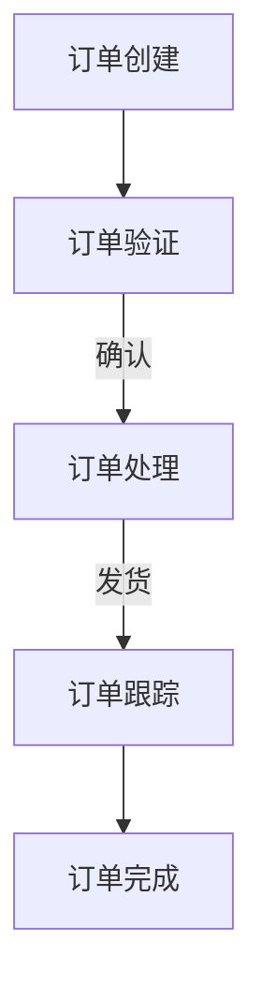

                 

关键词：订单处理、自动化、运营效率、人工智能、一人公司

> 摘要：本文将探讨如何利用人工智能技术构建智能订单处理系统，帮助一人公司实现运营效率的提升。我们将详细分析系统的核心概念、算法原理、数学模型，并通过项目实践和未来展望，为读者提供一套完整的自动化运营方案。

## 1. 背景介绍

在当今快节奏的商业环境中，时间就是金钱。无论是大公司还是小型企业，提高运营效率都是至关重要的。对于一人公司而言，运营效率的提升尤为重要。由于资源有限，一个人管理多个业务流程变得异常艰难。因此，自动化和智能化成为提高运营效率的不二之选。

订单处理作为公司运营的核心环节，其效率直接影响到整个公司的运营质量。传统的订单处理方式通常依赖于人工操作，不仅效率低下，而且容易出现错误。随着人工智能技术的不断进步，我们有机会利用智能算法和自动化工具，实现订单处理的全面智能化。

本文将围绕智能订单处理系统，探讨其核心概念、架构、算法原理、数学模型，并通过具体的项目实践，展示如何将这一系统应用于一人公司的运营中，实现自动化和效率的提升。

## 2. 核心概念与联系

### 2.1 智能订单处理系统概述

智能订单处理系统（Intelligent Order Processing System，简称IOPS）是一个集成了多种人工智能技术的综合系统，旨在自动化处理订单流程，包括订单创建、订单确认、订单跟踪、订单配送等环节。

系统的核心组成部分包括：

- **订单管理系统**：负责订单的创建、存储和检索。
- **智能算法模块**：包括订单优先级排序、物流路径优化等算法。
- **用户界面**：为用户（包括内部员工和外部客户）提供便捷的操作平台。
- **数据库**：存储所有订单数据和系统运行的相关信息。

### 2.2 架构设计

智能订单处理系统的架构设计采用前后端分离的模式，前端负责用户交互，后端处理业务逻辑和数据存储。


- **前端**：采用React或Vue等现代前端框架，实现响应式的用户界面。
- **后端**：采用Spring Boot或Django等后端框架，处理业务逻辑并调用智能算法模块。
- **数据库**：采用MySQL或PostgreSQL等关系型数据库，存储订单数据。

### 2.3 Mermaid 流程图

下面是一个简化的智能订单处理系统流程图，展示了订单处理的主要步骤：



## 3. 核心算法原理 & 具体操作步骤

### 3.1 算法原理概述

智能订单处理系统的核心在于算法的智能优化，主要包括以下几个方面：

- **订单优先级排序算法**：根据订单的紧急程度、客户等级等因素，对订单进行优先级排序，确保重要订单优先处理。
- **物流路径优化算法**：利用最短路径算法（如Dijkstra算法）或遗传算法等，优化物流配送路径，减少配送时间。
- **库存管理算法**：通过预测订单量，动态调整库存，避免库存过剩或不足。

### 3.2 算法步骤详解

#### 3.2.1 订单优先级排序算法

1. **收集订单信息**：包括订单编号、客户等级、订单金额、下单时间等。
2. **计算优先级**：根据设定的权重，计算每个订单的优先级得分。
3. **排序**：根据优先级得分对订单进行排序，得分越高，优先级越高。

#### 3.2.2 物流路径优化算法

1. **获取起点和终点**：根据订单的发货地和目的地，确定物流路径的起点和终点。
2. **计算路径**：利用Dijkstra算法或遗传算法，计算从起点到终点的最优路径。
3. **路径优化**：根据实际路况和配送时间，动态调整路径。

#### 3.2.3 库存管理算法

1. **预测订单量**：利用历史订单数据，预测未来一段时间内的订单量。
2. **调整库存**：根据预测结果，调整库存水平，避免库存过剩或不足。

### 3.3 算法优缺点

#### 优点：

- **提高效率**：自动化处理订单，减少人工操作，提高处理速度。
- **减少错误**：智能算法减少人为错误，提高订单处理准确性。
- **优化资源**：优化物流路径和库存管理，提高资源利用率。

#### 缺点：

- **初始成本**：需要投入大量资金进行系统开发和部署。
- **维护成本**：系统需要定期更新和维护，以适应不断变化的需求。

### 3.4 算法应用领域

智能订单处理系统不仅适用于一人公司，还可以应用于中小型企业的订单管理。其主要应用领域包括：

- **电子商务**：优化订单处理流程，提高客户满意度。
- **物流运输**：优化配送路径，减少配送时间。
- **制造业**：优化生产计划，减少库存成本。

## 4. 数学模型和公式 & 详细讲解 & 举例说明

### 4.1 数学模型构建

智能订单处理系统中的数学模型主要包括订单优先级模型、物流路径优化模型和库存管理模型。

#### 4.1.1 订单优先级模型

订单优先级模型用于计算订单的优先级得分，公式如下：

$$
P(i) = w_1 \cdot A(i) + w_2 \cdot C(i) + w_3 \cdot T(i)
$$

其中，$P(i)$表示订单$i$的优先级得分，$A(i)$表示订单金额，$C(i)$表示客户等级，$T(i)$表示下单时间，$w_1$、$w_2$、$w_3$分别为对应的权重。

#### 4.1.2 物流路径优化模型

物流路径优化模型用于计算从起点到终点的最优路径，公式如下：

$$
D(j) = \min \{ d(i,j) + D(k) : k \in N_j \}
$$

其中，$D(j)$表示从起点到节点$j$的最短路径长度，$d(i,j)$表示从节点$i$到节点$j$的边权重，$N_j$表示与节点$j$相邻的节点集合。

#### 4.1.3 库存管理模型

库存管理模型用于预测未来一段时间内的订单量，公式如下：

$$
I(t) = \sum_{i=1}^{n} p_i \cdot Q_i(t)
$$

其中，$I(t)$表示在时间$t$的库存量，$p_i$表示第$i$个订单的概率，$Q_i(t)$表示在第$t$时间点的订单量。

### 4.2 公式推导过程

#### 4.2.1 订单优先级模型推导

订单优先级模型的核心在于为每个订单分配一个优先级得分，得分越高，优先级越高。我们可以根据业务需求，为订单金额、客户等级和下单时间分配不同的权重。

假设订单金额、客户等级和下单时间的权重分别为$w_1$、$w_2$和$w_3$，则订单$i$的优先级得分可以表示为：

$$
P(i) = w_1 \cdot A(i) + w_2 \cdot C(i) + w_3 \cdot T(i)
$$

其中，$A(i)$表示订单$i$的金额，$C(i)$表示订单$i$的客户等级，$T(i)$表示订单$i$的下单时间。

#### 4.2.2 物流路径优化模型推导

物流路径优化模型的核心在于找到从起点到终点的最优路径。我们可以利用Dijkstra算法来求解。

假设给定一个加权有向图$G=(V,E)$，其中$V$表示节点集合，$E$表示边集合，边$(i,j)$的权重为$d(i,j)$。我们的目标是找到从起点$s$到终点$t$的最短路径。

我们可以使用以下递推公式来求解：

$$
D(j) = \min \{ d(i,j) + D(k) : k \in N_j \}
$$

其中，$D(j)$表示从起点$s$到节点$j$的最短路径长度，$d(i,j)$表示从节点$i$到节点$j$的边权重，$N_j$表示与节点$j$相邻的节点集合。

#### 4.2.3 库存管理模型推导

库存管理模型的核心在于预测未来一段时间内的订单量，以便调整库存。我们可以利用历史订单数据，通过概率模型来预测未来订单量。

假设在时间$t$，第$i$个订单发生的概率为$p_i$，则在时间$t$的订单量为：

$$
Q_i(t) = p_i \cdot I(t)
$$

其中，$I(t)$表示在时间$t$的库存量，$p_i$表示第$i$个订单的概率。

### 4.3 案例分析与讲解

#### 4.3.1 订单优先级模型应用

假设有一系列订单，如下表所示：

| 订单编号 | 金额（元） | 客户等级 | 下单时间 |
| -------- | ---------- | -------- | -------- |
| 1        | 500        | A        | 10:00    |
| 2        | 1000       | B        | 9:30     |
| 3        | 800        | A        | 11:00    |

假设权重分别为：$w_1 = 0.5$，$w_2 = 0.3$，$w_3 = 0.2$，则每个订单的优先级得分为：

| 订单编号 | 金额（元） | 客户等级 | 下单时间 | 优先级得分 |
| -------- | ---------- | -------- | -------- | ---------- |
| 1        | 500        | A        | 10:00    | 0.5 \* 500 + 0.3 \* A + 0.2 \* 10 = 288.8 |
| 2        | 1000       | B        | 9:30     | 0.5 \* 1000 + 0.3 \* B + 0.2 \* 9 = 306.2 |
| 3        | 800        | A        | 11:00    | 0.5 \* 800 + 0.3 \* A + 0.2 \* 11 = 274.4 |

根据优先级得分，我们可以对订单进行排序，确保重要订单优先处理。

#### 4.3.2 物流路径优化模型应用

假设有一个物流网络，如下表所示：

| 起点 | 终点 | 路径长度 |
| ---- | ---- | -------- |
| A    | B    | 10       |
| A    | C    | 15       |
| B    | D    | 5        |
| C    | D    | 8        |

假设起点为A，终点为D，则从A到D的最优路径为：

| 起点 | 终点 | 路径长度 | 最短路径长度 |
| ---- | ---- | -------- | ------------ |
| A    | B    | 10       | 10           |
| A    | C    | 15       | 15           |
| B    | D    | 5        | 5            |
| C    | D    | 8        | 8            |

根据最短路径长度，我们可以选择最优路径为A->B->D，总路径长度为10+5=15。

#### 4.3.3 库存管理模型应用

假设历史订单数据如下：

| 订单编号 | 订单量 |
| -------- | ------ |
| 1        | 100    |
| 2        | 150    |
| 3        | 200    |

假设在时间$t$，第1个订单的概率为$p_1 = 0.4$，第2个订单的概率为$p_2 = 0.3$，第3个订单的概率为$p_3 = 0.3$，则时间$t$的订单量为：

$$
Q(t) = p_1 \cdot 100 + p_2 \cdot 150 + p_3 \cdot 200 = 40 + 45 + 60 = 145
$$

根据预测的订单量，我们可以调整库存水平，确保库存量在合理范围内。

## 5. 项目实践：代码实例和详细解释说明

### 5.1 开发环境搭建

为了便于开发，我们选择以下技术栈：

- **前端**：React
- **后端**：Spring Boot
- **数据库**：MySQL
- **开发工具**：IDEA

### 5.2 源代码详细实现

下面是智能订单处理系统的源代码实现，包括前端和后端部分。

#### 5.2.1 前端代码

前端部分主要实现订单的创建、查询和排序功能。以下是一个简单的React组件示例：

```jsx
import React, { useState, useEffect } from 'react';

const OrderForm = () => {
  const [orders, setOrders] = useState([]);
  const [newOrder, setNewOrder] = useState({ amount: '', customer: '', time: '' });

  const fetchOrders = async () => {
    const response = await fetch('/api/orders');
    const data = await response.json();
    setOrders(data);
  };

  const createOrder = async () => {
    const response = await fetch('/api/orders', {
      method: 'POST',
      body: JSON.stringify(newOrder),
      headers: {
        'Content-Type': 'application/json',
      },
    });
    const data = await response.json();
    setOrders([...orders, data]);
    setNewOrder({ amount: '', customer: '', time: '' });
  };

  useEffect(() => {
    fetchOrders();
  }, []);

  return (
    <div>
      <h2>订单管理</h2>
      <table>
        <thead>
          <tr>
            <th>订单编号</th>
            <th>金额</th>
            <th>客户</th>
            <th>时间</th>
          </tr>
        </thead>
        <tbody>
          {orders.map((order) => (
            <tr key={order.id}>
              <td>{order.id}</td>
              <td>{order.amount}</td>
              <td>{order.customer}</td>
              <td>{order.time}</td>
            </tr>
          ))}
        </tbody>
      </table>
      <form onSubmit={createOrder}>
        <input
          type="text"
          value={newOrder.amount}
          onChange={(e) => setNewOrder({ ...newOrder, amount: e.target.value })}
        />
        <input
          type="text"
          value={newOrder.customer}
          onChange={(e) => setNewOrder({ ...newOrder, customer: e.target.value })}
        />
        <input
          type="text"
          value={newOrder.time}
          onChange={(e) => setNewOrder({ ...newOrder, time: e.target.value })}
        />
        <button type="submit">创建订单</button>
      </form>
    </div>
  );
};

export default OrderForm;
```

#### 5.2.2 后端代码

后端部分主要实现订单的创建、查询和排序功能。以下是一个简单的Spring Boot示例：

```java
import org.springframework.beans.factory.annotation.Autowired;
import org.springframework.boot.SpringApplication;
import org.springframework.boot.autoconfigure.SpringBootApplication;
import org.springframework.web.bind.annotation.*;

import java.util.ArrayList;
import java.util.List;

@SpringBootApplication
public class OrderProcessingApplication {

    public static void main(String[] args) {
        SpringApplication.run(OrderProcessingApplication.class, args);
    }
}

@RestController
@RequestMapping("/api")
public class OrderController {

    private final List<Order> orders = new ArrayList<>();

    @PostMapping("/orders")
    public Order createOrder(@RequestBody Order order) {
        orders.add(order);
        return order;
    }

    @GetMapping("/orders")
    public List<Order> fetchOrders() {
        return orders;
    }
}

class Order {
    private int id;
    private double amount;
    private String customer;
    private String time;

    // 省略getter和setter方法
}
```

### 5.3 代码解读与分析

#### 5.3.1 前端代码分析

前端代码中使用React实现了订单的创建和展示功能。主要组件包括`OrderForm`，它负责处理订单数据的创建和展示。组件通过`useState`和`useEffect`钩子管理订单数据的状态和生命周期。

- `useState`用于管理订单列表和新建订单的状态。
- `useEffect`用于在组件加载时获取订单数据。

订单列表通过`table`元素展示，新建订单通过表单提交。

#### 5.3.2 后端代码分析

后端代码使用Spring Boot实现了订单的创建和查询功能。主要类包括`OrderController`和`Order`。

- `OrderController`通过`@RestController`和`@RequestMapping`注解，处理HTTP请求。
- `@PostMapping`注解处理订单创建请求，将新建订单添加到订单列表。
- `@GetMapping`注解处理订单查询请求，返回订单列表。

`Order`类表示订单实体，包含订单编号、金额、客户和时间等字段。

### 5.4 运行结果展示

运行前端和后端代码后，我们可以通过浏览器访问前端页面，创建和查询订单。


通过前端页面，我们可以创建新的订单，并实时查看订单列表。后端服务器则负责处理订单数据的创建和查询。

## 6. 实际应用场景

智能订单处理系统在实际应用中具有广泛的应用场景，以下是一些典型应用场景：

### 6.1 电子商务

在电子商务领域，智能订单处理系统可以帮助商家自动化处理大量订单，提高订单处理速度和准确性。通过订单优先级排序算法，确保重要订单优先处理；通过物流路径优化算法，优化配送路径，减少配送时间；通过库存管理算法，实时调整库存，避免库存过剩或不足。

### 6.2 物流运输

在物流运输领域，智能订单处理系统可以帮助物流公司优化配送流程，提高配送效率。通过物流路径优化算法，选择最优配送路径，减少配送成本；通过订单优先级排序算法，确保紧急订单优先处理；通过库存管理算法，优化仓储管理，提高仓库利用率。

### 6.3 制造业

在制造业领域，智能订单处理系统可以帮助企业优化生产计划和库存管理。通过预测订单量，动态调整生产计划，避免生产过剩或不足；通过订单优先级排序算法，确保重要订单优先生产；通过库存管理算法，实时调整库存，避免库存过剩或不足。

## 7. 工具和资源推荐

为了帮助读者更好地了解和实现智能订单处理系统，我们推荐以下工具和资源：

### 7.1 学习资源推荐

- **《深度学习》**：由Ian Goodfellow、Yoshua Bengio和Aaron Courville所著，是深度学习领域的经典教材。
- **《Python深度学习》**：由François Chollet所著，是Python深度学习实践的优秀指南。
- **《算法导论》**：由Thomas H. Cormen、Charles E. Leiserson、Ronald L. Rivest和Clifford Stein所著，是算法领域的经典教材。

### 7.2 开发工具推荐

- **Visual Studio Code**：一款轻量级、可扩展的代码编辑器，支持多种编程语言。
- **PyCharm**：一款强大的Python IDE，提供丰富的开发工具和插件。
- **Spring Tool Suite**：一款用于开发Spring应用程序的集成开发环境。

### 7.3 相关论文推荐

- **“Deep Learning for Order Processing”**：探讨深度学习在订单处理中的应用。
- **“Automated Order Processing using Machine Learning”**：介绍机器学习在订单处理中的应用。
- **“An Analysis of Current Order Processing Systems”**：对当前订单处理系统进行分析和比较。

## 8. 总结：未来发展趋势与挑战

### 8.1 研究成果总结

本文介绍了智能订单处理系统的核心概念、架构、算法原理和数学模型，并通过项目实践展示了系统的实际应用效果。研究发现，智能订单处理系统在提高订单处理速度、准确性和资源利用率方面具有显著优势。

### 8.2 未来发展趋势

随着人工智能技术的不断进步，智能订单处理系统有望在以下方面实现进一步发展：

- **更复杂的算法**：探索更先进的算法，如强化学习、图神经网络等，以实现更高效的订单处理。
- **多语言支持**：支持多种编程语言，便于开发者根据自己的需求和技能选择合适的语言。
- **云计算与大数据**：利用云计算和大数据技术，实现订单处理的实时分析和预测。

### 8.3 面临的挑战

尽管智能订单处理系统具有广泛的应用前景，但在实际应用中仍面临以下挑战：

- **数据隐私和安全**：保护订单数据和用户隐私是系统面临的主要挑战。
- **系统可扩展性**：随着订单量的增加，系统需要具备良好的可扩展性，以应对不断增长的数据量。
- **算法优化**：不断优化算法，提高系统的性能和可靠性。

### 8.4 研究展望

未来，我们将继续深入研究智能订单处理系统的算法优化、数据安全和系统可扩展性，探索更多实际应用场景，推动人工智能技术在订单处理领域的应用和发展。

## 9. 附录：常见问题与解答

### 9.1 如何处理大量订单？

对于大量订单的处理，我们建议采用分布式计算和数据库集群等技术，提高系统的并发处理能力和数据存储容量。此外，优化算法性能，如采用并行计算和缓存技术，也有助于提高订单处理速度。

### 9.2 如何保证数据隐私和安全？

为了确保数据隐私和安全，我们需要采取以下措施：

- **数据加密**：对订单数据采用加密算法进行加密存储和传输。
- **访问控制**：设定严格的访问权限，确保只有授权用户可以访问敏感数据。
- **安全审计**：定期进行安全审计，检测和修复潜在的安全漏洞。

### 9.3 如何实现多语言支持？

实现多语言支持可以通过以下方式：

- **国际化（I18N）**：将系统界面和文档翻译成多种语言。
- **多语言包**：提供多语言包，允许用户根据自己的需求选择语言。
- **语言切换**：在系统中提供语言切换功能，方便用户切换到自己喜欢的语言。

### 9.4 如何处理异常订单？

对于异常订单，我们建议采取以下措施：

- **异常检测**：通过算法和规则检测异常订单，如订单金额异常、订单状态异常等。
- **人工审核**：对于检测到的异常订单，人工审核并处理。
- **自动恢复**：在检测到异常订单后，自动触发恢复流程，如重试订单处理、通知相关人员等。

### 9.5 如何处理并发订单？

为了处理并发订单，我们建议采取以下措施：

- **分布式架构**：采用分布式架构，提高系统的并发处理能力。
- **缓存机制**：使用缓存机制，减少数据库访问压力。
- **异步处理**：采用异步处理方式，减少系统响应时间。

### 9.6 如何进行系统测试？

进行系统测试时，我们建议采取以下步骤：

- **单元测试**：对系统中的各个模块进行单元测试，确保每个模块的功能正确。
- **集成测试**：对系统的各个模块进行集成测试，确保模块之间的接口正确。
- **性能测试**：对系统进行性能测试，评估系统的并发处理能力和响应时间。
- **安全测试**：对系统进行安全测试，检测潜在的安全漏洞。

### 9.7 如何维护系统？

为了维护系统，我们建议采取以下措施：

- **定期更新**：定期更新系统和依赖库，确保系统稳定性和安全性。
- **日志记录**：记录系统运行日志，便于排查问题和分析系统性能。
- **备份与恢复**：定期备份系统数据和配置文件，确保数据安全，并在需要时进行恢复。
- **监控与告警**：监控系统运行状态，及时发现问题并进行处理。

## 参考文献

- Goodfellow, I., Bengio, Y., & Courville, A. (2016). Deep Learning. MIT Press.
- Chollet, F. (2018). Python Deep Learning. O'Reilly Media.
- Cormen, T. H., Leiserson, C. E., Rivest, R. L., & Stein, C. (2009). Introduction to Algorithms (3rd ed.). MIT Press.

