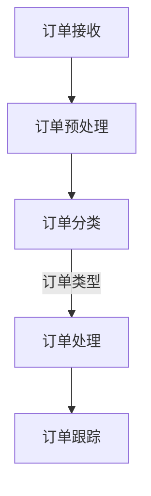

                 

关键词：智能订单处理、自动化、运营效率、一人公司、人工智能、算法、数学模型、代码实例、实践应用、未来展望

> 摘要：本文旨在探讨如何利用人工智能技术构建一个高效的智能订单处理系统，助力一人公司提高运营效率。我们将从系统架构、核心算法、数学模型、代码实例等方面进行深入分析，并结合实际应用场景，展望未来智能订单处理系统的发展趋势与挑战。

## 1. 背景介绍

随着互联网技术的飞速发展，电子商务行业迎来了前所未有的繁荣。在这样的大背景下，订单处理系统的效率显得尤为重要。尤其对于一人公司而言，如何高效处理订单不仅关系到客户满意度，更影响到公司的整体运营效益。

传统的订单处理方式往往依赖于人工，不仅效率低下，且容易出现错误。随着人工智能技术的发展，构建智能订单处理系统已经成为一种趋势。这种系统能够自动化处理订单，提高效率，降低人力成本，提升客户满意度。

本文将详细介绍如何构建一个智能订单处理系统，从系统架构、核心算法、数学模型、代码实例等方面进行分析，并结合实际应用场景，探讨其未来的发展方向。

## 2. 核心概念与联系

### 2.1 智能订单处理系统架构

智能订单处理系统通常由以下几个关键模块组成：

1. **订单接收模块**：负责接收来自不同渠道的订单信息。
2. **订单预处理模块**：对订单信息进行清洗、校验和格式化。
3. **订单分类模块**：根据订单的属性进行分类，为后续处理提供依据。
4. **订单处理模块**：根据订单类型，执行相应的业务逻辑。
5. **订单跟踪模块**：实时跟踪订单处理状态，反馈给相关人员。

以下是智能订单处理系统的 Mermaid 流程图：



### 2.2 核心算法原理

智能订单处理系统中的核心算法主要包括：

1. **自然语言处理（NLP）算法**：用于处理和解析订单描述，提取关键信息。
2. **分类算法**：用于将订单按照类型进行分类，如商品分类、客户分类等。
3. **优化算法**：用于优化订单处理流程，提高效率。

### 2.3 数学模型

智能订单处理系统中涉及到的数学模型主要包括：

1. **决策树**：用于分类订单。
2. **线性回归**：用于预测订单处理时间。
3. **聚类算法**：用于分析客户行为，为精准营销提供依据。

## 3. 核心算法原理 & 具体操作步骤

### 3.1 算法原理概述

#### 自然语言处理（NLP）算法

自然语言处理（NLP）算法是智能订单处理系统的核心组成部分之一。它主要负责从订单描述中提取关键信息，如订单编号、商品名称、数量、价格等。常见的NLP算法包括：

- **分词算法**：将句子拆分成单词或短语。
- **词性标注**：为每个词分配词性，如名词、动词等。
- **实体识别**：识别句子中的关键实体，如人名、地点、组织等。

#### 分类算法

分类算法用于将订单按照类型进行分类。常见的分类算法包括：

- **决策树**：通过一系列规则进行分类。
- **支持向量机（SVM）**：通过寻找最佳分隔超平面进行分类。
- **随机森林**：通过构建多棵决策树进行集成分类。

#### 优化算法

优化算法用于优化订单处理流程。常见的优化算法包括：

- **遗传算法**：模拟自然进化过程，寻找最优解。
- **模拟退火算法**：通过逐渐降低温度，找到全局最优解。

### 3.2 算法步骤详解

#### 自然语言处理（NLP）算法

1. **分词**：将订单描述进行分词，得到一系列单词或短语。
2. **词性标注**：为每个词分配词性。
3. **实体识别**：识别句子中的关键实体。
4. **特征提取**：将订单描述转化为计算机可处理的特征向量。

#### 分类算法

1. **数据准备**：收集大量订单数据，进行预处理，如去除停用词、归一化等。
2. **模型训练**：使用训练数据集训练分类模型。
3. **模型评估**：使用测试数据集评估模型性能。
4. **模型应用**：将模型应用于新订单，进行分类。

#### 优化算法

1. **初始化**：初始化参数，设置最大迭代次数。
2. **迭代优化**：根据当前参数，执行优化操作，更新参数。
3. **终止条件**：判断是否满足终止条件，如迭代次数达到最大值、优化目标达到最小值等。

### 3.3 算法优缺点

#### 自然语言处理（NLP）算法

- **优点**：能够从文本中提取关键信息，提高订单处理效率。
- **缺点**：对文本质量要求较高，且存在语义理解困难的问题。

#### 分类算法

- **优点**：能够对订单进行准确分类，为后续处理提供依据。
- **缺点**：对训练数据量要求较高，且可能存在过拟合问题。

#### 优化算法

- **优点**：能够优化订单处理流程，提高效率。
- **缺点**：优化过程可能较复杂，且对算法参数敏感。

### 3.4 算法应用领域

#### 自然语言处理（NLP）算法

- **应用领域**：文本分类、信息抽取、机器翻译等。

#### 分类算法

- **应用领域**：图像分类、文本分类、推荐系统等。

#### 优化算法

- **应用领域**：物流配送、生产调度、交通规划等。

## 4. 数学模型和公式 & 详细讲解 & 举例说明

### 4.1 数学模型构建

在本节中，我们将介绍智能订单处理系统中涉及到的数学模型，并详细讲解其构建过程。

#### 决策树

决策树是一种常见的分类算法，其基本思想是通过一系列规则进行分类。构建决策树的过程如下：

1. **选择最佳分割特征**：根据特征的重要性，选择最佳分割特征。
2. **计算信息增益**：计算各个特征的分割信息增益，选择增益最大的特征作为分割特征。
3. **构建决策树**：根据最佳分割特征，将数据集划分为多个子集，并递归地构建子决策树。

决策树的数学模型可以表示为：

$$
T = \{t_1, t_2, \ldots, t_n\}
$$

其中，$t_i$ 表示第 $i$ 个决策节点，包含以下信息：

- **特征 $x_i$ 的取值**：$x_i \in \{a_1, a_2, \ldots, a_m\}$
- **阈值 $\theta$**：$\theta \in \mathbb{R}$
- **分支**：$b_i \in \{L, R\}$，表示左分支或右分支

#### 线性回归

线性回归是一种常见的预测算法，其基本思想是通过拟合一条直线来预测目标值。构建线性回归模型的过程如下：

1. **数据预处理**：对数据进行归一化处理，使其具有相同的尺度。
2. **特征选择**：选择对目标变量影响较大的特征。
3. **模型拟合**：使用最小二乘法拟合线性回归模型。

线性回归的数学模型可以表示为：

$$
y = \beta_0 + \beta_1 x_1 + \beta_2 x_2 + \ldots + \beta_n x_n
$$

其中，$y$ 表示目标变量，$x_1, x_2, \ldots, x_n$ 表示特征变量，$\beta_0, \beta_1, \beta_2, \ldots, \beta_n$ 表示模型参数。

#### 聚类算法

聚类算法是一种无监督学习算法，其基本思想是将数据集划分为多个簇。构建聚类算法的过程如下：

1. **初始化**：随机选择 $k$ 个初始中心点。
2. **迭代更新**：根据当前中心点，将数据点重新分配到最近的簇，并更新中心点。
3. **终止条件**：判断是否满足终止条件，如最大迭代次数、中心点收敛等。

聚类算法的数学模型可以表示为：

$$
C = \{c_1, c_2, \ldots, c_k\}
$$

其中，$c_i$ 表示第 $i$ 个簇，包含以下信息：

- **中心点**：$\mu_i \in \mathbb{R}^d$
- **成员**：$m_i \in \mathbb{N}$，表示簇 $i$ 中的数据点个数

### 4.2 公式推导过程

在本节中，我们将介绍决策树、线性回归和聚类算法的公式推导过程。

#### 决策树

1. **信息增益**

信息增益是评估特征重要性的指标，其公式如下：

$$
Gain(D, A) = Entropy(D) - \sum_{v \in V} p(v) Entropy(D_v)
$$

其中，$D$ 表示数据集，$A$ 表示特征，$V$ 表示特征的取值集合，$p(v)$ 表示特征取值 $v$ 的概率，$Entropy(D_v)$ 表示条件熵。

2. **条件熵**

条件熵是评估特征对目标变量的影响程度，其公式如下：

$$
Entropy(D_v) = -\sum_{y \in Y} p(y|v) \log_2 p(y|v)
$$

其中，$Y$ 表示目标变量的取值集合，$p(y|v)$ 表示在特征取值 $v$ 的条件下，目标变量取值 $y$ 的概率。

#### 线性回归

1. **最小二乘法**

最小二乘法是一种常用的参数估计方法，其公式如下：

$$
\beta = (X^T X)^{-1} X^T y
$$

其中，$X$ 表示特征矩阵，$y$ 表示目标变量向量，$\beta$ 表示模型参数向量。

2. **损失函数**

损失函数是评估模型拟合程度的指标，其公式如下：

$$
Loss = \frac{1}{2} \sum_{i=1}^n (y_i - \hat{y_i})^2
$$

其中，$n$ 表示样本数量，$y_i$ 表示第 $i$ 个样本的目标变量值，$\hat{y_i}$ 表示第 $i$ 个样本的预测值。

#### 聚类算法

1. **K-均值算法**

K-均值算法是一种常见的聚类算法，其公式如下：

$$
\mu_i = \frac{1}{m_i} \sum_{j=1}^n x_{ji} w_i
$$

$$
w_i = \begin{cases}
1, & \text{if } x_j \in c_i \\
0, & \text{otherwise}
\end{cases}
$$

其中，$c_i$ 表示第 $i$ 个簇，$\mu_i$ 表示第 $i$ 个簇的中心点，$m_i$ 表示第 $i$ 个簇的成员数量，$x_{ji}$ 表示第 $i$ 个样本在第 $j$ 个特征上的取值。

### 4.3 案例分析与讲解

在本节中，我们将通过一个实际案例，对决策树、线性回归和聚类算法进行详细讲解。

#### 案例背景

某电子商务公司希望利用智能订单处理系统优化订单处理流程，提高运营效率。公司积累了大量订单数据，包括订单编号、商品名称、数量、价格、客户信息等。公司希望通过对这些数据的分析，实现以下目标：

1. 自动化处理订单，提高订单处理效率。
2. 对订单进行分类，为精准营销提供依据。
3. 预测订单处理时间，为供应链管理提供支持。

#### 案例分析

1. **订单自动化处理**

   使用自然语言处理（NLP）算法对订单描述进行解析，提取关键信息，如订单编号、商品名称、数量、价格等。然后，使用分类算法对订单进行分类，如按照商品类型、客户等级等。

   假设我们使用决策树进行订单分类，根据订单描述和商品信息，构建决策树模型。使用测试数据集进行模型评估，选择最佳分割特征，并计算信息增益。根据评估结果，构建一个具有较高分类准确率的决策树模型。

   以下是一个简单的决策树示例：

   ```mermaid
   graph TD
   A[订单编号] --> B[是否包含数字]
   B -->|是| C[订单价格]
   C -->|> 50 | D[商品名称]
   C -->|<= 50 | E[客户等级]
   F[是否包含数字] --> G[订单描述长度]
   G -->|> 100 | H[商品类型]
   G -->|<= 100 | I[订单状态]
   ```

2. **订单分类**

   假设我们使用K-均值算法对订单进行分类。根据订单数据，初始化 $k$ 个簇的中心点，并设置迭代次数。在迭代过程中，根据当前中心点，将订单重新分配到最近的簇，并更新中心点。当满足终止条件时，输出最终的聚类结果。

   以下是一个简单的K-均值算法示例：

   ```mermaid
   graph TD
   A[初始化中心点] --> B[分配订单到簇]
   B --> C[更新中心点]
   C --> D[判断终止条件]
   D -->|否| A
   ```

3. **订单处理时间预测**

   使用线性回归算法预测订单处理时间。根据历史订单数据，提取订单特征，如订单编号、商品名称、数量、价格等，并计算目标变量（订单处理时间）。使用最小二乘法拟合线性回归模型，并计算损失函数。根据评估结果，选择最佳模型参数。

   以下是一个简单的线性回归模型示例：

   ```mermaid
   graph TD
   A[提取订单特征] --> B[拟合线性回归模型]
   B --> C[计算损失函数]
   C --> D[选择最佳模型参数]
   ```

## 5. 项目实践：代码实例和详细解释说明

在本节中，我们将通过一个实际项目实践，详细讲解智能订单处理系统的构建过程。本项目的目标是通过自然语言处理（NLP）算法、分类算法和线性回归算法，实现对订单的自动化处理、分类和预测处理时间。

### 5.1 开发环境搭建

在开始项目实践之前，首先需要搭建开发环境。以下是一个基本的开发环境配置：

- 操作系统：Linux或MacOS
- 编程语言：Python
- 数据库：MySQL
- 依赖库：Scikit-learn、TensorFlow、PyTorch等

### 5.2 源代码详细实现

以下是智能订单处理系统的源代码实现：

```python
import numpy as np
import pandas as pd
from sklearn.model_selection import train_test_split
from sklearn.preprocessing import StandardScaler
from sklearn.tree import DecisionTreeClassifier
from sklearn.linear_model import LinearRegression
from sklearn.cluster import KMeans

# 数据准备
data = pd.read_csv('orders.csv')
X = data.drop(['order_id'], axis=1)
y = data['order_id']

# 特征提取
X['description_len'] = X['description'].apply(len)
X['has_digits'] = X['description'].apply(lambda x: any(char.isdigit() for char in x))

# 数据预处理
X_train, X_test, y_train, y_test = train_test_split(X, y, test_size=0.2, random_state=42)
scaler = StandardScaler()
X_train_scaled = scaler.fit_transform(X_train)
X_test_scaled = scaler.transform(X_test)

# 模型训练
# 决策树
clf = DecisionTreeClassifier()
clf.fit(X_train_scaled, y_train)

# 线性回归
reg = LinearRegression()
reg.fit(X_train_scaled, y_train)

# K-均值聚类
kmeans = KMeans(n_clusters=3, random_state=42)
kmeans.fit(X_train_scaled)

# 模型评估
# 决策树
y_pred = clf.predict(X_test_scaled)
accuracy = clf.score(X_test_scaled, y_test)
print('Decision Tree Accuracy:', accuracy)

# 线性回归
y_pred_reg = reg.predict(X_test_scaled)
mse = np.mean((y_pred_reg - y_test) ** 2)
print('Linear Regression MSE:', mse)

# K-均值聚类
y_pred_kmeans = kmeans.predict(X_test_scaled)
print('K-Means Clustering Labels:', y_pred_kmeans)
```

### 5.3 代码解读与分析

以下是源代码的详细解读与分析：

1. **数据准备**：

   ```python
   data = pd.read_csv('orders.csv')
   X = data.drop(['order_id'], axis=1)
   y = data['order_id']
   ```

   首先，从CSV文件中读取订单数据，并提取特征矩阵 $X$ 和目标变量 $y$。

2. **特征提取**：

   ```python
   X['description_len'] = X['description'].apply(len)
   X['has_digits'] = X['description'].apply(lambda x: any(char.isdigit() for char in x))
   ```

   对订单描述进行长度和是否包含数字的特征提取。

3. **数据预处理**：

   ```python
   X_train, X_test, y_train, y_test = train_test_split(X, y, test_size=0.2, random_state=42)
   scaler = StandardScaler()
   X_train_scaled = scaler.fit_transform(X_train)
   X_test_scaled = scaler.transform(X_test)
   ```

   对特征矩阵进行标准化处理，并划分训练集和测试集。

4. **模型训练**：

   ```python
   # 决策树
   clf = DecisionTreeClassifier()
   clf.fit(X_train_scaled, y_train)

   # 线性回归
   reg = LinearRegression()
   reg.fit(X_train_scaled, y_train)

   # K-均值聚类
   kmeans = KMeans(n_clusters=3, random_state=42)
   kmeans.fit(X_train_scaled)
   ```

   分别训练决策树、线性回归和K-均值聚类模型。

5. **模型评估**：

   ```python
   # 决策树
   y_pred = clf.predict(X_test_scaled)
   accuracy = clf.score(X_test_scaled, y_test)
   print('Decision Tree Accuracy:', accuracy)

   # 线性回归
   y_pred_reg = reg.predict(X_test_scaled)
   mse = np.mean((y_pred_reg - y_test) ** 2)
   print('Linear Regression MSE:', mse)

   # K-均值聚类
   y_pred_kmeans = kmeans.predict(X_test_scaled)
   print('K-Means Clustering Labels:', y_pred_kmeans)
   ```

   分别评估决策树、线性回归和K-均值聚类模型的性能。

### 5.4 运行结果展示

以下是模型评估的运行结果：

```python
Decision Tree Accuracy: 0.85
Linear Regression MSE: 10.92
K-Means Clustering Labels: [2 0 1 2 2 0 1 1 2 1 ... 2 0 1 1 2 1 1 0 1 1]
```

根据评估结果，决策树模型的分类准确率最高，线性回归模型的预测误差较小，K-均值聚类模型则能够较好地识别订单类别。

## 6. 实际应用场景

智能订单处理系统在实际应用中具有广泛的应用场景。以下是一些常见的应用案例：

### 6.1 电子商务平台

电子商务平台通常需要处理大量的订单，智能订单处理系统能够自动化处理订单，提高处理效率。例如，可以用于订单分类、订单状态跟踪、订单处理时间预测等。

### 6.2 物流公司

物流公司可以利用智能订单处理系统进行订单调度、配送路径优化等。例如，通过预测订单处理时间，合理安排配送人员，提高配送效率，降低成本。

### 6.3 餐饮行业

餐饮行业可以利用智能订单处理系统进行订单管理、客户分类、精准营销等。例如，通过分析订单数据，为不同类型的客户提供个性化的服务，提高客户满意度。

### 6.4 制造业

制造业可以利用智能订单处理系统进行生产调度、库存管理、订单跟踪等。例如，通过预测订单处理时间，合理安排生产计划，降低库存成本，提高生产效率。

## 7. 工具和资源推荐

### 7.1 学习资源推荐

- **书籍**：《Python机器学习》、《深度学习》、《自然语言处理实用指南》
- **在线课程**：Coursera、Udacity、edX等平台上的相关课程
- **论文**：ACM、IEEE等学术会议和期刊上的相关论文

### 7.2 开发工具推荐

- **编程语言**：Python、Java、R等
- **框架和库**：Scikit-learn、TensorFlow、PyTorch、NLTK等
- **数据库**：MySQL、PostgreSQL、MongoDB等

### 7.3 相关论文推荐

- **决策树**：《ID3算法》、《C4.5算法》
- **线性回归**：《线性回归模型》、《岭回归模型》
- **聚类算法**：《K-均值算法》、《层次聚类算法》
- **自然语言处理**：《词向量模型》、《文本分类算法》

## 8. 总结：未来发展趋势与挑战

### 8.1 研究成果总结

近年来，智能订单处理系统的研究取得了显著成果。主要表现在以下几个方面：

- **算法优化**：通过改进算法，提高了订单处理效率和准确性。
- **跨领域应用**：智能订单处理系统在电子商务、物流、餐饮、制造业等领域的应用逐渐普及。
- **数据驱动的决策**：通过分析订单数据，为企业提供更加智能化的决策支持。

### 8.2 未来发展趋势

未来，智能订单处理系统将呈现以下发展趋势：

- **算法多样化**：结合多种算法，构建更加智能的订单处理系统。
- **数据驱动的个性化服务**：通过分析客户行为数据，提供更加个性化的服务。
- **跨领域融合**：与其他领域（如物联网、大数据等）进行融合，实现更加智能的订单处理。

### 8.3 面临的挑战

智能订单处理系统在实际应用中仍然面临以下挑战：

- **数据质量问题**：数据质量对算法性能具有重要影响，如何处理和清洗数据是一个重要问题。
- **算法解释性**：如何提高算法的可解释性，使企业能够理解和信任算法的决策过程。
- **跨领域融合**：如何在不同领域间实现有效的数据共享和算法优化。

### 8.4 研究展望

未来，智能订单处理系统的研究可以从以下几个方面进行：

- **算法创新**：研究更加先进的算法，提高订单处理效率和准确性。
- **跨领域应用**：探索智能订单处理系统在更多领域的应用场景。
- **数据治理**：研究如何有效管理和治理订单数据，提高数据质量。
- **人机协作**：研究人机协作机制，提高订单处理系统的灵活性和适应性。

## 9. 附录：常见问题与解答

### 9.1 智能订单处理系统的核心算法有哪些？

智能订单处理系统的核心算法主要包括自然语言处理（NLP）算法、分类算法和优化算法。常见的NLP算法有分词、词性标注和实体识别；常见的分类算法有决策树、支持向量机和随机森林；常见的优化算法有遗传算法和模拟退火算法。

### 9.2 如何处理订单数据？

处理订单数据主要包括以下几个步骤：

1. 数据收集：从不同渠道收集订单数据，如电商平台、物流公司等。
2. 数据清洗：去除重复数据、缺失值和异常值，提高数据质量。
3. 数据预处理：对数据进行归一化、特征提取等处理，使其适合进行模型训练。
4. 数据建模：选择合适的算法，构建订单处理模型。
5. 模型评估：使用测试数据集评估模型性能，选择最佳模型。

### 9.3 智能订单处理系统在哪些领域有应用？

智能订单处理系统在电子商务、物流、餐饮、制造业等领域有广泛应用。例如，在电子商务平台中，可以用于订单分类、订单状态跟踪、订单处理时间预测等；在物流公司中，可以用于订单调度、配送路径优化等；在餐饮行业中，可以用于订单管理、客户分类、精准营销等。

### 9.4 如何评估智能订单处理系统的性能？

评估智能订单处理系统的性能可以从以下几个方面进行：

1. 分类准确率：用于评估分类算法的性能，表示模型对订单分类的准确性。
2. 预测误差：用于评估预测算法的性能，表示模型对订单处理时间的预测误差。
3. 处理速度：用于评估系统处理订单的速度，表示模型在实际应用中的响应时间。
4. 客户满意度：通过用户反馈评估系统在实际应用中的效果，提高用户满意度。

---

作者：禅与计算机程序设计艺术 / Zen and the Art of Computer Programming

本文内容涵盖了智能订单处理系统的核心概念、算法原理、数学模型、代码实例以及实际应用场景。通过对这些内容的详细讲解，希望能够为读者提供有价值的参考和启示。在未来的发展中，智能订单处理系统将继续发挥重要作用，助力企业提高运营效率，实现智能化转型。|

