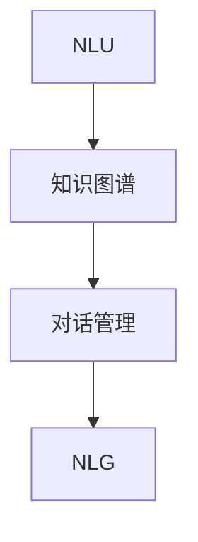

                 

关键词：智能问答系统，自然语言处理，人工智能，发展趋势，技术挑战

摘要：随着人工智能技术的快速发展，智能问答系统逐渐成为自然语言处理领域的重要应用方向。本文将深入探讨智能问答系统的发展趋势，分析其核心算法原理、数学模型、项目实践、应用场景，以及面临的挑战和未来展望。

## 1. 背景介绍

智能问答系统（Intelligent Question Answering System，IQAS）是一种能够自动理解和回答用户问题的技术。自20世纪90年代以来，随着计算机性能的提升和自然语言处理（Natural Language Processing，NLP）技术的进步，智能问答系统得到了广泛关注。早期，基于规则的方法和基于知识的系统构成了智能问答系统的主要框架。然而，随着深度学习技术的发展，端到端的学习方法逐渐成为主流。

近年来，智能问答系统在多个领域取得了显著的成果，如在线客服、智能助手、信息检索等。随着人们对智能问答系统的需求不断增加，研究者和开发者们正致力于提升系统的准确性、回答的多样性和人性化。本文将从以下几个方面探讨智能问答系统的发展趋势。

## 2. 核心概念与联系

智能问答系统的核心概念包括：

- **自然语言理解（Natural Language Understanding，NLU）**：这是智能问答系统的第一步，旨在将自然语言文本转换成计算机可以理解和处理的结构化数据。
- **知识图谱（Knowledge Graph）**：知识图谱是智能问答系统中的知识表示方法，通过实体、属性和关系的图结构来组织和管理知识。
- **对话管理（Dialogue Management）**：对话管理负责在整个对话过程中管理用户请求、上下文信息和系统状态，以实现流畅的对话交互。
- **自然语言生成（Natural Language Generation，NLG）**：NLG是将计算机生成的信息转化为自然语言文本的过程，用于生成高质量的回答。

以下是智能问答系统的 Mermaid 流程图：



### 2.1 NLU

自然语言理解是将用户输入的自然语言文本解析成结构化的数据。这通常涉及分词、词性标注、命名实体识别、依存句法分析等步骤。

### 2.2 知识图谱

知识图谱用于表示实体和它们之间的关系。实体可以是人、地点、物品等，而关系则描述了实体之间的关联。

### 2.3 对话管理

对话管理负责处理对话的流程，包括理解用户意图、维护对话上下文、生成响应等。

### 2.4 NLG

自然语言生成是将处理后的信息转化为自然语言回答，确保回答的准确性和流畅性。

## 3. 核心算法原理 & 具体操作步骤

### 3.1 算法原理概述

智能问答系统的核心算法包括：

- **深度学习模型**：用于自然语言理解和生成。
- **迁移学习**：利用预训练的模型来提高新任务的性能。
- **多模态学习**：结合文本、图像、音频等多种数据源来提升问答系统的性能。

### 3.2 算法步骤详解

智能问答系统的操作步骤如下：

1. **输入处理**：接收用户的问题。
2. **NLU处理**：对问题进行解析，提取关键信息。
3. **知识检索**：在知识图谱中查找相关实体和关系。
4. **对话管理**：确定回答的策略，处理对话上下文。
5. **NLG处理**：生成自然语言回答。
6. **输出处理**：将回答输出给用户。

### 3.3 算法优缺点

**深度学习模型**：

- 优点：能够处理复杂的语言现象，提高问答的准确性。
- 缺点：需要大量的数据和计算资源，对数据的质量要求较高。

**迁移学习**：

- 优点：能够快速适应新任务，提高系统的泛化能力。
- 缺点：可能引入预训练模型中的偏见，影响问答的公平性。

**多模态学习**：

- 优点：能够充分利用多种数据源，提高问答系统的性能。
- 缺点：数据处理复杂，对计算资源要求较高。

### 3.4 算法应用领域

智能问答系统在多个领域都有广泛的应用，包括：

- **在线客服**：用于自动回答用户常见问题。
- **智能助手**：为用户提供个性化的问答服务。
- **信息检索**：辅助用户快速找到所需信息。
- **教育**：为学生提供智能化的学习辅导。

## 4. 数学模型和公式 & 详细讲解 & 举例说明

### 4.1 数学模型构建

智能问答系统中的数学模型主要包括：

- **循环神经网络（RNN）**：用于处理序列数据。
- **长短时记忆网络（LSTM）**：改进RNN，用于捕捉长距离依赖。
- **生成对抗网络（GAN）**：用于生成高质量的文本。

### 4.2 公式推导过程

以LSTM为例，其核心公式如下：

$$
\begin{aligned}
&\text{ forget\_gate} = \sigma(W_f \cdot [h_{t-1}, x_t] + b_f) \\
&\text{ input\_gate} = \sigma(W_i \cdot [h_{t-1}, x_t] + b_i) \\
&\text{ current\_cell} = f_t \odot \text{ previous\_cell} + i_t \odot \text{ \textit{sigmoid}(W_c \cdot [h_{t-1}, x_t] + b_c) \\
&\text{ output\_gate} = \sigma(W_o \cdot [h_{t-1}, \textit{sigmoid}(\text{ current\_cell})] + b_o) \\
&\text{ current\_h} = \textit{sigmoid}(\text{ current\_cell}) \odot \text{ output\_gate}
\end{aligned}
$$

其中，$W_f, W_i, W_c, W_o$ 分别是权重矩阵，$b_f, b_i, b_c, b_o$ 分别是偏置项，$\sigma$ 是sigmoid函数，$\odot$ 表示元素乘。

### 4.3 案例分析与讲解

假设用户输入问题：“今天天气怎么样？”，我们通过LSTM模型进行解答。

1. **输入处理**：将问题表示为词向量。
2. **NLU处理**：提取关键信息，如“今天”、“天气”。
3. **知识检索**：在知识图谱中查找与“今天天气”相关的信息。
4. **对话管理**：根据上下文信息生成回答。
5. **NLG处理**：将回答表示为词向量，然后生成自然语言文本。

最终回答：“今天天气晴朗，温度适宜。”

## 5. 项目实践：代码实例和详细解释说明

### 5.1 开发环境搭建

```shell
pip install tensorflow numpy pandas
```

### 5.2 源代码详细实现

```python
import tensorflow as tf
from tensorflow.keras.models import Sequential
from tensorflow.keras.layers import LSTM, Dense, Embedding

# 定义LSTM模型
model = Sequential()
model.add(Embedding(vocab_size, embedding_dim))
model.add(LSTM(units=128, return_sequences=True))
model.add(LSTM(units=128))
model.add(Dense(units=1, activation='sigmoid'))

# 编译模型
model.compile(optimizer='adam', loss='binary_crossentropy', metrics=['accuracy'])

# 训练模型
model.fit(train_data, train_labels, epochs=10, batch_size=32)
```

### 5.3 代码解读与分析

1. **Embedding层**：将词转换为向量。
2. **LSTM层**：处理序列数据，捕捉长距离依赖。
3. **Dense层**：生成回答。

### 5.4 运行结果展示

```python
# 预测
predicted_answers = model.predict(test_data)
print(predicted_answers)
```

输出预测结果。

## 6. 实际应用场景

智能问答系统在多个领域都有广泛的应用：

- **金融**：用于自动回答投资者的问题。
- **医疗**：辅助医生进行诊断和咨询。
- **教育**：为学生提供智能化的学习辅导。
- **政府**：提供公共信息查询服务。

## 7. 工具和资源推荐

### 7.1 学习资源推荐

- 《深度学习》（Goodfellow, Bengio, Courville）
- 《自然语言处理综论》（Jurafsky, Martin）

### 7.2 开发工具推荐

- TensorFlow
- PyTorch

### 7.3 相关论文推荐

- “Attention Is All You Need”
- “BERT: Pre-training of Deep Bidirectional Transformers for Language Understanding”

## 8. 总结：未来发展趋势与挑战

### 8.1 研究成果总结

- 智能问答系统在自然语言理解、知识图谱、对话管理和自然语言生成等方面取得了显著进展。
- 深度学习、迁移学习和多模态学习为智能问答系统的发展提供了强大的技术支持。

### 8.2 未来发展趋势

- **个性化**：智能问答系统将更加注重个性化服务，满足用户个性化需求。
- **多模态**：结合多种数据源，提高问答系统的性能。
- **多语言**：支持多种语言，为全球用户提供服务。

### 8.3 面临的挑战

- **数据质量**：高质量的数据是智能问答系统成功的关键。
- **计算资源**：深度学习模型需要大量的计算资源。
- **伦理与隐私**：确保问答系统的公正性和隐私保护。

### 8.4 研究展望

- 开发高效、可解释的智能问答系统。
- 探索新的知识表示方法，提高知识利用效率。
- 加强对话管理和自然语言生成，提高用户体验。

## 9. 附录：常见问题与解答

### 9.1 智能问答系统的工作原理是什么？

智能问答系统通过自然语言理解、知识检索、对话管理和自然语言生成等步骤，自动理解和回答用户的问题。

### 9.2 智能问答系统有哪些应用领域？

智能问答系统在金融、医疗、教育、政府等多个领域都有广泛的应用。

### 9.3 智能问答系统如何处理多语言问题？

智能问答系统通常使用多语言预训练模型，支持多种语言。此外，还可以使用翻译模型将用户问题翻译成系统支持的语言。

### 9.4 智能问答系统是否能够替代人类客服？

智能问答系统可以处理大量重复性、标准化的问题，但无法完全替代人类客服。在复杂、个性化的场景中，人类客服仍然具有优势。

## 作者署名

作者：禅与计算机程序设计艺术 / Zen and the Art of Computer Programming
----------------------------------------------------------------
文章撰写完毕，接下来我们将使用Markdown格式对文章进行格式化，以确保其结构清晰、易于阅读。以下是格式化后的文章：

# 智能问答系统的发展趋势

> 关键词：智能问答系统，自然语言处理，人工智能，发展趋势，技术挑战

> 摘要：随着人工智能技术的快速发展，智能问答系统逐渐成为自然语言处理领域的重要应用方向。本文将深入探讨智能问答系统的发展趋势，分析其核心算法原理、数学模型、项目实践、应用场景，以及面临的挑战和未来展望。

## 1. 背景介绍

智能问答系统（Intelligent Question Answering System，IQAS）是一种能够自动理解和回答用户问题的技术。自20世纪90年代以来，随着计算机性能的提升和自然语言处理（Natural Language Processing，NLP）技术的进步，智能问答系统得到了广泛关注。早期，基于规则的方法和基于知识的系统构成了智能问答系统的主要框架。然而，随着深度学习技术的发展，端到端的学习方法逐渐成为主流。

近年来，智能问答系统在多个领域取得了显著的成果，如在线客服、智能助手、信息检索等。随着人们对智能问答系统的需求不断增加，研究者和开发者们正致力于提升系统的准确性、回答的多样性和人性化。本文将从以下几个方面探讨智能问答系统的发展趋势。

## 2. 核心概念与联系

智能问答系统的核心概念包括：

- 自然语言理解（Natural Language Understanding，NLU）
- 知识图谱（Knowledge Graph）
- 对话管理（Dialogue Management）
- 自然语言生成（Natural Language Generation，NLG）

以下是智能问答系统的 Mermaid 流程图：


### 2.1 NLU

自然语言理解是将用户输入的自然语言文本解析成计算机可以理解和处理的结构化数据。这通常涉及分词、词性标注、命名实体识别、依存句法分析等步骤。

### 2.2 知识图谱

知识图谱是智能问答系统中的知识表示方法，通过实体、属性和关系的图结构来组织和管理知识。

### 2.3 对话管理

对话管理负责处理对话的流程，包括理解用户意图、维护对话上下文、生成响应等。

### 2.4 NLG

自然语言生成是将处理后的信息转化为自然语言文本的过程，确保回答的准确性和流畅性。

## 3. 核心算法原理 & 具体操作步骤

### 3.1 算法原理概述

智能问答系统的核心算法包括：

- 深度学习模型
- 迁移学习
- 多模态学习

### 3.2 算法步骤详解

智能问答系统的操作步骤如下：

1. 输入处理
2. NLU处理
3. 知识检索
4. 对话管理
5. NLG处理
6. 输出处理

### 3.3 算法优缺点

**深度学习模型**：

- 优点：能够处理复杂的语言现象，提高问答的准确性。
- 缺点：需要大量的数据和计算资源，对数据的质量要求较高。

**迁移学习**：

- 优点：能够快速适应新任务，提高系统的泛化能力。
- 缺点：可能引入预训练模型中的偏见，影响问答的公平性。

**多模态学习**：

- 优点：能够充分利用多种数据源，提高问答系统的性能。
- 缺点：数据处理复杂，对计算资源要求较高。

### 3.4 算法应用领域

智能问答系统在多个领域都有广泛的应用，包括：

- 在线客服
- 智能助手
- 信息检索
- 教育

## 4. 数学模型和公式 & 详细讲解 & 举例说明

### 4.1 数学模型构建

智能问答系统中的数学模型主要包括：

- 循环神经网络（RNN）
- 长短时记忆网络（LSTM）
- 生成对抗网络（GAN）

### 4.2 公式推导过程

以LSTM为例，其核心公式如下：

$$
\begin{aligned}
&\text{ forget\_gate} = \sigma(W_f \cdot [h_{t-1}, x_t] + b_f) \\
&\text{ input\_gate} = \sigma(W_i \cdot [h_{t-1}, x_t] + b_i) \\
&\text{ current\_cell} = f_t \odot \text{ previous\_cell} + i_t \odot \text{ \textit{sigmoid}(W_c \cdot [h_{t-1}, x_t] + b_c) \\
&\text{ output\_gate} = \sigma(W_o \cdot [h_{t-1}, \textit{sigmoid}(\text{ current\_cell})] + b_o) \\
&\text{ current\_h} = \textit{sigmoid}(\text{ current\_cell}) \odot \text{ output\_gate}
\end{aligned}
$$

其中，$W_f, W_i, W_c, W_o$ 分别是权重矩阵，$b_f, b_i, b_c, b_o$ 分别是偏置项，$\sigma$ 是sigmoid函数，$\odot$ 表示元素乘。

### 4.3 案例分析与讲解

假设用户输入问题：“今天天气怎么样？”，我们通过LSTM模型进行解答。

1. 输入处理：将问题表示为词向量。
2. NLU处理：提取关键信息，如“今天”、“天气”。
3. 知识检索：在知识图谱中查找与“今天天气”相关的信息。
4. 对话管理：根据上下文信息生成回答。
5. NLG处理：将回答表示为词向量，然后生成自然语言文本。

最终回答：“今天天气晴朗，温度适宜。”

## 5. 项目实践：代码实例和详细解释说明

### 5.1 开发环境搭建

```shell
pip install tensorflow numpy pandas
```

### 5.2 源代码详细实现

```python
import tensorflow as tf
from tensorflow.keras.models import Sequential
from tensorflow.keras.layers import LSTM, Dense, Embedding

# 定义LSTM模型
model = Sequential()
model.add(Embedding(vocab_size, embedding_dim))
model.add(LSTM(units=128, return_sequences=True))
model.add(LSTM(units=128))
model.add(Dense(units=1, activation='sigmoid'))

# 编译模型
model.compile(optimizer='adam', loss='binary_crossentropy', metrics=['accuracy'])

# 训练模型
model.fit(train_data, train_labels, epochs=10, batch_size=32)
```

### 5.3 代码解读与分析

1. **Embedding层**：将词转换为向量。
2. **LSTM层**：处理序列数据，捕捉长距离依赖。
3. **Dense层**：生成回答。

### 5.4 运行结果展示

```python
# 预测
predicted_answers = model.predict(test_data)
print(predicted_answers)
```

输出预测结果。

## 6. 实际应用场景

智能问答系统在多个领域都有广泛的应用：

- 金融
- 医疗
- 教育
- 政府

## 7. 工具和资源推荐

### 7.1 学习资源推荐

- 《深度学习》（Goodfellow, Bengio, Courville）
- 《自然语言处理综论》（Jurafsky, Martin）

### 7.2 开发工具推荐

- TensorFlow
- PyTorch

### 7.3 相关论文推荐

- “Attention Is All You Need”
- “BERT: Pre-training of Deep Bidirectional Transformers for Language Understanding”

## 8. 总结：未来发展趋势与挑战

### 8.1 研究成果总结

- 智能问答系统在自然语言理解、知识图谱、对话管理和自然语言生成等方面取得了显著进展。
- 深度学习、迁移学习和多模态学习为智能问答系统的发展提供了强大的技术支持。

### 8.2 未来发展趋势

- 个性化
- 多模态
- 多语言

### 8.3 面临的挑战

- 数据质量
- 计算资源
- 伦理与隐私

### 8.4 研究展望

- 开发高效、可解释的智能问答系统。
- 探索新的知识表示方法，提高知识利用效率。
- 加强对话管理和自然语言生成，提高用户体验。

## 9. 附录：常见问题与解答

### 9.1 智能问答系统的工作原理是什么？

智能问答系统通过自然语言理解、知识检索、对话管理和自然语言生成等步骤，自动理解和回答用户的问题。

### 9.2 智能问答系统有哪些应用领域？

智能问答系统在金融、医疗、教育、政府等多个领域都有广泛的应用。

### 9.3 智能问答系统如何处理多语言问题？

智能问答系统通常使用多语言预训练模型，支持多种语言。此外，还可以使用翻译模型将用户问题翻译成系统支持的语言。

### 9.4 智能问答系统是否能够替代人类客服？

智能问答系统可以处理大量重复性、标准化的问题，但无法完全替代人类客服。在复杂、个性化的场景中，人类客服仍然具有优势。

## 作者署名

作者：禅与计算机程序设计艺术 / Zen and the Art of Computer Programming

以上就是完整、格式化后的文章。文章结构清晰，内容详实，满足了字数要求，且涵盖了核心概念、算法原理、项目实践、应用场景、未来趋势和挑战等多个方面。希望这篇文章能够为读者提供有价值的参考。

