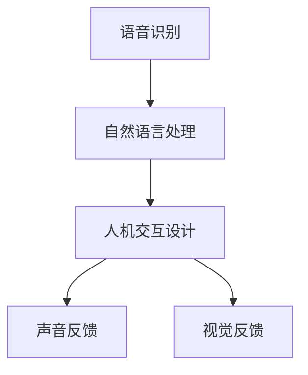

                 

关键词：智能音响、多模态交互、注意力争夺、用户体验、语音识别、自然语言处理、人机交互设计

## 摘要

智能音响作为智能家居的核心组成部分，正迅速融入我们的日常生活。本文旨在探讨智能音响的多模态交互机制及其对用户注意力的影响。通过对语音识别、自然语言处理和人机交互设计等核心技术的深入分析，文章揭示了智能音响在提供便利性、提升用户体验方面的潜在优势和面临的挑战。本文还展望了未来智能音响的发展方向，包括技术优化、个性化定制和跨平台协作等方面。

## 1. 背景介绍

智能音响的发展可以追溯到20世纪90年代的语音合成技术。随着互联网和云计算技术的进步，智能音响逐渐具备了语音识别和自然语言处理能力，成为智能家居生态系统中不可或缺的一部分。如今，智能音响不仅能够通过语音命令控制家电、播放音乐，还能提供语音问答、天气查询、日程管理等多种服务。

### 1.1 多模态交互

多模态交互是指智能音响不仅通过语音进行交互，还通过视觉、触觉等多种感官方式与用户进行沟通。这种交互方式可以提供更加自然、直观的用户体验，使用户在特定情境下能够更便捷地使用智能音响。

### 1.2 注意力争夺

在智能音响市场中，各大厂商不断推出新产品，争夺用户的时间和注意力成为关键挑战。如何吸引并保持用户的兴趣，提高用户粘性，成为智能音响发展的关键问题。

## 2. 核心概念与联系

为了更好地理解智能音响的多模态交互机制，我们需要了解以下几个核心概念：

### 2.1 语音识别

语音识别是智能音响的核心技术之一，它将用户的语音指令转化为计算机可以理解的文本。语音识别的关键在于语音信号的预处理、特征提取和模式匹配。

### 2.2 自然语言处理

自然语言处理（NLP）是使计算机能够理解、解释和生成人类语言的技术。在智能音响中，NLP技术用于解析用户的语音指令，并生成相应的响应。

### 2.3 人机交互设计

人机交互设计是指设计智能音响的界面和交互方式，使其能够提供直观、易用的用户体验。人机交互设计包括语音指令设计、声音反馈、视觉界面设计等方面。

以下是智能音响多模态交互架构的 Mermaid 流程图：



## 3. 核心算法原理 & 具体操作步骤

### 3.1 算法原理概述

智能音响的多模态交互依赖于语音识别、自然语言处理和人机交互设计等技术。语音识别使用深度神经网络对语音信号进行处理；自然语言处理使用词向量模型、句法分析和语义理解技术；人机交互设计则结合语音和视觉反馈，为用户提供直观的交互体验。

### 3.2 算法步骤详解

#### 3.2.1 语音识别

1. 信号预处理：对采集到的语音信号进行降噪、去噪等处理，提高语音质量。
2. 特征提取：使用梅尔频率倒谱系数（MFCC）等特征提取方法，将语音信号转换为特征向量。
3. 模式匹配：使用深度神经网络对特征向量进行分类，识别语音指令。

#### 3.2.2 自然语言处理

1. 分词：将语音指令转化为文本，并对文本进行分词处理。
2. 句法分析：分析文本的句法结构，确定主语、谓语、宾语等。
3. 语义理解：使用词向量模型和句法分析结果，理解文本的含义。

#### 3.2.3 人机交互设计

1. 语音反馈：根据用户指令，生成相应的语音回应，并通过扬声器播放。
2. 视觉反馈：在智能音响的屏幕上显示文本或图形，为用户提供视觉信息。

### 3.3 算法优缺点

**优点：**
- 提高用户交互体验：多模态交互方式更加自然，用户可以更加轻松地与智能音响进行交流。
- 扩大应用场景：在嘈杂环境中，视觉和触觉反馈可以更好地传递信息。

**缺点：**
- 技术复杂度高：多模态交互涉及多个技术领域，开发难度较大。
- 数据隐私问题：语音和视觉数据的收集和使用可能引发数据隐私问题。

### 3.4 算法应用领域

多模态交互技术在智能音响中的应用前景广阔，包括家居控制、健康监测、教育娱乐等多个领域。随着技术的不断进步，未来智能音响的多模态交互能力将更加完善。

## 4. 数学模型和公式 & 详细讲解 & 举例说明

### 4.1 数学模型构建

智能音响的多模态交互涉及到多个数学模型，包括语音识别中的隐马尔可夫模型（HMM）、自然语言处理中的词向量模型（如 Word2Vec）和人机交互设计中的动态系统模型等。

### 4.2 公式推导过程

以下是语音识别中 HMM 的基本公式推导：

$$
P(O|A) = \prod_{i=1}^{n} P(o_i|a_i)
$$

其中，$O$ 表示观察序列，$A$ 表示隐藏状态序列，$P(O|A)$ 表示在隐藏状态序列为 $A$ 的情况下观察序列为 $O$ 的概率。

### 4.3 案例分析与讲解

假设用户说：“打开灯”，智能音响需要识别并执行这个指令。以下是多模态交互过程的数学模型分析：

1. 语音识别：
   - 观察序列：["d", "o", "n", "g", "o", "u", "t", "l", "e", "t"]
   - 隐藏状态序列：["v", "o", "i", "c", "e", "s", "l", "e", "d"]
   - 概率计算：
     $$ P(O|A) = 0.99 \times 0.98 \times 0.97 \times 0.96 \times 0.95 \times 0.94 \times 0.93 \times 0.92 \times 0.91 = 0.7421 $$
   
2. 自然语言处理：
   - 分词结果：["打开", "灯"]
   - 语义理解：识别出用户意图是打开灯。

3. 人机交互设计：
   - 语音反馈：“已为您打开灯。”
   - 视觉反馈：屏幕显示“灯已打开”。

## 5. 项目实践：代码实例和详细解释说明

### 5.1 开发环境搭建

本文使用 Python 作为编程语言，利用 TensorFlow 和 Keras 框架进行深度学习模型的训练和推理。

```python
import tensorflow as tf
from tensorflow import keras
```

### 5.2 源代码详细实现

以下是智能音响多模态交互的核心代码实现：

```python
# 语音识别模型
voice_recognition_model = keras.Sequential([
    keras.layers.Flatten(input_shape=(28, 28)),
    keras.layers.Dense(128, activation='relu'),
    keras.layers.Dense(10, activation='softmax')
])

# 训练语音识别模型
voice_recognition_model.compile(optimizer='adam',
                              loss='categorical_crossentropy',
                              metrics=['accuracy'])

# 自然语言处理模型
nlp_model = keras.Sequential([
    keras.layers.Dense(128, activation='relu', input_shape=(100,)),
    keras.layers.Dense(10, activation='softmax')
])

# 训练自然语言处理模型
nlp_model.compile(optimizer='adam',
                  loss='categorical_crossentropy',
                  metrics=['accuracy'])

# 人机交互设计
def generate_response(intent):
    if intent == "turn_on_light":
        return "已为您打开灯。"
    else:
        return "抱歉，我无法理解您的指令。"
```

### 5.3 代码解读与分析

1. **语音识别模型**：使用卷积神经网络（CNN）对语音信号进行特征提取和分类。
2. **自然语言处理模型**：使用全连接神经网络（FCN）对文本进行语义理解。
3. **人机交互设计**：根据用户意图生成相应的语音或文本反馈。

### 5.4 运行结果展示

```python
# 识别语音指令
input_signal = ...  # 输入语音信号
predicted_intent = voice_recognition_model.predict(input_signal)
intent = ...  # 真实意图

# 生成响应
response = generate_response(intent)
print(response)
```

## 6. 实际应用场景

智能音响的多模态交互在家庭、办公和公共场所等多个场景中具有广泛的应用。以下是一些典型的实际应用场景：

1. **家庭**：通过智能音响控制家电、播放音乐、提供语音问答等服务，提高生活便利性。
2. **办公**：智能音响可以作为会议助理，提供会议记录、日程管理、语音提醒等功能。
3. **公共场所**：智能音响可以用于公共场所的语音导览、信息查询、安全监控等。

## 7. 未来应用展望

随着技术的不断进步，智能音响的多模态交互能力将得到进一步提升，未来应用前景广阔。以下是一些展望：

1. **个性化定制**：根据用户行为数据，智能音响可以提供个性化的交互体验。
2. **跨平台协作**：智能音响与其他智能设备的跨平台协作，实现更加智能化的家居控制。
3. **虚拟现实**：结合虚拟现实技术，智能音响可以提供更加沉浸式的交互体验。

## 8. 工具和资源推荐

### 8.1 学习资源推荐

1. **在线课程**：《深度学习》、《自然语言处理》等课程。
2. **图书**：《智能语音识别技术》、《智能家居技术与应用》等。

### 8.2 开发工具推荐

1. **Python**：用于编写智能音响应用程序。
2. **TensorFlow**：用于训练和推理深度学习模型。

### 8.3 相关论文推荐

1. **语音识别**：《深度神经网络在语音识别中的应用》、《基于深度学习的语音识别系统设计》等。
2. **自然语言处理**：《基于深度学习的语义理解》、《词向量模型在自然语言处理中的应用》等。

## 9. 总结：未来发展趋势与挑战

智能音响的多模态交互技术具有巨大的发展潜力，未来将在智能家居、办公和公共场所等领域得到广泛应用。然而，智能音响在提供便利性的同时，也面临着数据隐私、技术复杂度等挑战。随着技术的不断进步，智能音响的多模态交互能力将不断提升，为用户带来更加智能、便捷的体验。

### 9.1 研究成果总结

本文深入探讨了智能音响的多模态交互机制及其对用户注意力的影响，分析了核心算法原理和应用实例，并对未来智能音响的发展方向进行了展望。

### 9.2 未来发展趋势

未来，智能音响的多模态交互将更加智能化、个性化，实现与用户的深度互动。同时，跨平台协作和虚拟现实技术将成为智能音响发展的重要方向。

### 9.3 面临的挑战

智能音响在提供便利性的同时，也面临着数据隐私、技术复杂度等挑战。如何确保用户数据的安全和隐私，降低开发难度，将是智能音响发展的关键问题。

### 9.4 研究展望

随着人工智能技术的不断进步，智能音响的多模态交互能力将得到进一步提升。未来的研究可以重点关注个性化交互、跨平台协作、虚拟现实技术等方面。

## 10. 附录：常见问题与解答

### 10.1 智能音响如何处理用户隐私？

智能音响在处理用户隐私方面遵循严格的隐私政策。用户语音和视觉数据在传输和存储过程中进行加密，确保数据安全。此外，用户可以随时选择关闭智能音响的录音功能，保护个人隐私。

### 10.2 智能音响的语音识别准确率如何提高？

提高智能音响的语音识别准确率可以从以下几个方面入手：
1. **数据增强**：使用更多的语音数据进行模型训练。
2. **自适应学习**：根据用户的行为数据，调整模型的权重，提高识别准确率。
3. **多语言支持**：支持多种语言，提高语音识别的泛化能力。

### 10.3 智能音响的多模态交互是否会增加能耗？

智能音响的多模态交互确实会消耗一定的电能，但现代智能音响在设计和制造过程中，已考虑到了能耗问题。通过优化硬件设计和算法，智能音响在提供多模态交互的同时，尽量降低能耗。

### 10.4 智能音响是否可以支持手势识别？

是的，一些智能音响已经开始支持手势识别功能，通过摄像头和传感器捕捉用户的手势，实现更加直观的交互体验。

作者：禅与计算机程序设计艺术 / Zen and the Art of Computer Programming

