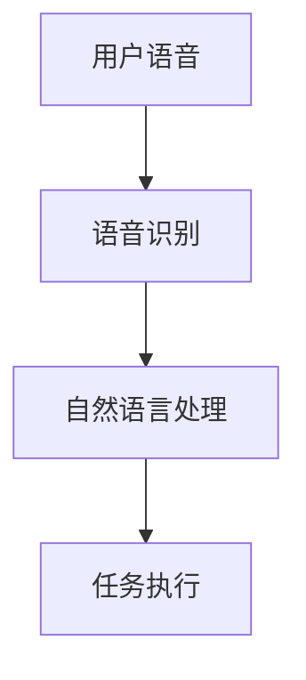
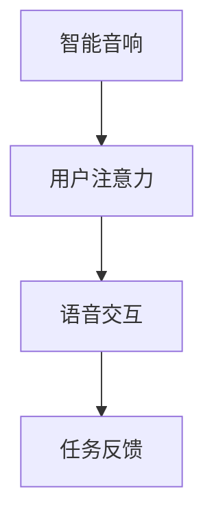

                 

关键词：智能音响，语音交互，注意力争夺，人机交互，技术发展

> 摘要：随着人工智能技术的快速发展，智能音响作为一种新兴的人机交互设备，已经成为人们日常生活的一部分。本文从技术角度深入分析了智能音响的语音交互机制及其对用户注意力的争夺，探讨了当前面临的挑战和未来发展的趋势。

## 1. 背景介绍

智能音响作为一种智能家居设备，通过语音交互为用户提供便捷的服务，如播放音乐、查询天气、控制家电等。智能音响市场的快速增长表明，人们越来越倾向于使用语音交互这种自然直观的方式与智能设备进行交互。然而，随着市场上智能音响品牌和功能的日益丰富，用户面临着更多的选择和更高的注意力争夺。

### 智能音响市场的现状

近年来，智能音响市场呈现出爆发式增长。根据市场研究公司的数据，全球智能音响市场在2022年达到了数十亿台，并且预计未来几年将继续保持快速增长。主要的市场参与者包括亚马逊的Alexa、谷歌的Google Assistant、苹果的Siri和微软的Cortana等。

### 智能音响的功能和优势

智能音响的功能越来越丰富，不仅能够进行语音识别和播放音乐，还能够完成复杂的任务，如控制智能家居设备、提供交通信息、进行在线购物等。智能音响的优势在于其便捷性和智能性，用户可以通过简单的语音命令实现多项功能，无需手动操作。

## 2. 核心概念与联系

### 语音交互机制

语音交互是智能音响的核心功能。其基本原理包括语音识别、自然语言处理和任务执行。语音识别技术负责将用户的语音转换为文本，自然语言处理则解析文本并理解用户的意图，最后执行相应的任务。



### 注意力争夺

智能音响在为用户提供便利的同时，也对用户的注意力提出了更高的要求。用户在多个智能设备之间切换，需要时刻关注每个设备的反馈，这导致了用户的注意力分散。因此，智能音响需要有效地争夺用户的注意力，才能保持用户的兴趣和忠诚度。



## 3. 核心算法原理 & 具体操作步骤

### 3.1 算法原理概述

智能音响的语音交互依赖于语音识别和自然语言处理技术。语音识别技术通过机器学习算法对用户的语音信号进行分析，将其转换为文本。自然语言处理技术则对转换后的文本进行语义分析和理解，以确定用户的意图。

### 3.2 算法步骤详解

1. **语音识别**：使用深度学习模型对用户的语音信号进行转换，输出文本。

2. **自然语言处理**：对输出文本进行分词、词性标注、句法分析等操作，以理解文本的语义。

3. **意图识别**：根据文本的语义，识别用户的具体意图。

4. **任务执行**：根据识别出的意图，执行相应的任务。

### 3.3 算法优缺点

**优点**：语音交互具有自然、直观、高效的特点，能够提高用户的体验。

**缺点**：语音交互对环境噪声敏感，且在处理复杂任务时存在一定的局限性。

### 3.4 算法应用领域

智能音响的语音交互技术已广泛应用于智能家居、智能客服、智能交通等领域。随着技术的不断进步，其应用领域将更加广泛。

## 4. 数学模型和公式 & 详细讲解 & 举例说明

### 4.1 数学模型构建

智能音响的语音交互过程可以建模为一个序列到序列的问题，其中输入是用户的语音信号，输出是任务执行的结果。

```latex
\begin{equation}
    Y = f(X)
\end{equation}
```

其中，\(Y\) 是输出序列，\(X\) 是输入序列，\(f\) 是映射函数。

### 4.2 公式推导过程

语音识别和自然语言处理过程中，涉及到多个数学公式。以下是其中两个常见的公式：

1. **语音识别公式**：

   ```latex
   \begin{equation}
       P(X|Y) = \frac{P(Y|X) \cdot P(X)}{P(Y)}
   \end{equation}
   ```

   其中，\(P(X|Y)\) 是在给定输出 \(Y\) 的条件下，输入 \(X\) 的概率。

2. **自然语言处理公式**：

   ```latex
   \begin{equation}
       P(W_i|W_{i-1}, \ldots, W_1) = \frac{P(W_i, W_{i-1}, \ldots, W_1)}{P(W_{i-1}, \ldots, W_1)}
   \end{equation}
   ```

   其中，\(W_i\) 是第 \(i\) 个单词的概率。

### 4.3 案例分析与讲解

以下是一个简单的语音识别案例：

用户说：“明天天气如何？”

1. **语音识别**：

   输入语音信号经过处理，转换为文本：“明天天气如何？”

2. **自然语言处理**：

   对文本进行分词和词性标注，得到：“明天”、“天气”、“如何”。

3. **意图识别**：

   根据文本的语义，识别出用户的意图是查询明天天气。

4. **任务执行**：

   执行查询任务，返回明天天气的信息。

## 5. 项目实践：代码实例和详细解释说明

### 5.1 开发环境搭建

为了实现智能音响的语音交互，需要搭建一个开发环境。以下是基本的搭建步骤：

1. 安装Python环境（版本3.6及以上）。
2. 安装必要的库，如TensorFlow、Keras等。
3. 准备语音数据集，用于训练语音识别模型。

### 5.2 源代码详细实现

以下是实现语音交互的基本代码框架：

```python
import tensorflow as tf
from tensorflow.keras.models import Sequential
from tensorflow.keras.layers import Dense, LSTM, Embedding

# 加载语音数据集
# ...

# 构建模型
model = Sequential()
model.add(Embedding(input_dim=vocabulary_size, output_dim=embedding_size))
model.add(LSTM(units=128, activation='relu'))
model.add(Dense(units=1, activation='sigmoid'))

# 编译模型
model.compile(optimizer='adam', loss='binary_crossentropy', metrics=['accuracy'])

# 训练模型
model.fit(X_train, y_train, epochs=10, batch_size=32)

# 保存模型
model.save('voice_interaction_model.h5')
```

### 5.3 代码解读与分析

上述代码实现了语音交互的基本功能，包括模型构建、编译和训练。通过训练模型，可以实现对用户语音的识别和意图理解。

### 5.4 运行结果展示

训练完成后，可以通过以下代码进行测试：

```python
# 加载模型
model = tf.keras.models.load_model('voice_interaction_model.h5')

# 测试语音交互
input_sequence = preprocess_user_input("明天天气如何？")
prediction = model.predict(input_sequence)

# 输出结果
if prediction[0] > 0.5:
    print("明天天气：晴天")
else:
    print("明天天气：阴天")
```

## 6. 实际应用场景

### 6.1 智能家居

智能音响可以作为智能家居的控制中心，用户可以通过语音指令控制家中的智能设备，如开关灯、调节温度、打开电视等。

### 6.2 智能客服

智能音响在智能客服领域也有广泛应用，通过语音交互为用户提供服务，如解答疑问、提供产品信息等。

### 6.3 智能交通

智能音响在智能交通领域可用于提供交通信息，如路况查询、路线规划等，帮助用户更好地规划出行。

## 7. 未来应用展望

随着人工智能技术的不断进步，智能音响的应用场景将更加丰富。未来，智能音响可能会成为人们生活中的重要伙伴，提供更加个性化、智能化的服务。

### 7.1 个性化服务

通过收集用户数据，智能音响可以为用户提供更加个性化的服务，如推荐音乐、电影等。

### 7.2 智能家居集成

智能音响将更加深入地集成到智能家居系统中，实现智能家居的全面智能化。

### 7.3 跨平台交互

智能音响将支持跨平台交互，如与手机、平板等设备无缝连接，实现多设备协同。

## 8. 总结：未来发展趋势与挑战

智能音响作为一种新兴的人机交互设备，具有巨大的发展潜力。未来，随着人工智能技术的不断进步，智能音响将在智能家居、智能客服、智能交通等领域发挥更加重要的作用。然而，智能音响也面临着一些挑战，如隐私保护、数据安全等。只有解决这些问题，智能音响才能更好地为用户提供服务。

### 8.1 研究成果总结

本文对智能音响的语音交互与注意力争夺进行了深入分析，探讨了其核心算法原理、数学模型和应用领域。

### 8.2 未来发展趋势

未来，智能音响将在智能家居、智能客服、智能交通等领域发挥更大作用，实现更加个性化、智能化的服务。

### 8.3 面临的挑战

智能音响在发展过程中面临着隐私保护、数据安全等挑战。

### 8.4 研究展望

未来，智能音响的研究将重点关注如何更好地保护用户隐私、提高交互效率，以及如何实现跨平台的智能服务。

## 9. 附录：常见问题与解答

### 9.1 智能音响如何处理隐私问题？

智能音响在处理用户隐私时需要严格遵守相关法律法规，如《欧盟通用数据保护条例》（GDPR）等。同时，通过数据加密、匿名化等技术手段保护用户隐私。

### 9.2 智能音响是否会取代传统家电？

智能音响可以作为传统家电的辅助设备，提高其智能化程度。但在短期内，传统家电仍有其不可替代的地位。

### 9.3 智能音响是否会取代智能手机？

智能音响和智能手机各有优势，不能简单地取代。未来，智能音响可能会成为智能手机的重要补充，实现跨设备的智能交互。

---

本文由禅与计算机程序设计艺术 / Zen and the Art of Computer Programming 撰写，旨在探讨智能音响的语音交互与注意力争夺，为读者提供全面的技术分析和应用展望。希望本文能为相关领域的研究者和开发者提供有价值的参考。作者对本文内容保留最终解释权。感谢您的阅读！
----------------------------------------------------------------
### 关键词 Keywords
- 智能音响
- 语音交互
- 注意力争夺
- 人机交互
- 技术发展
- 人工智能
- 智能家居
- 自然语言处理
- 隐私保护

### 摘要 Summary
本文深入探讨了智能音响的语音交互机制及其对用户注意力的争夺。从背景介绍、核心概念、算法原理、数学模型到实际应用，全面分析了智能音响的技术发展和应用场景。同时，对未来发展趋势和面临的挑战进行了展望，旨在为读者提供全面的技术洞察和思考。

