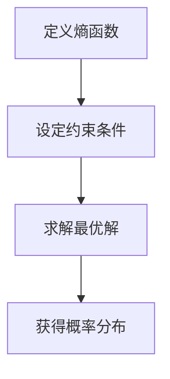

                 

## 1. 背景介绍

最大熵模型（Maximum Entropy Models，简称MEM）是统计学与信息论中的一个核心概念，最早由爱德华·莱顿·泰勒（Edward L. Jaynes）在20世纪50年代提出。它提供了一种在给定部分信息的条件下，推断出最有可能的完整概率分布的方法。最大熵模型在许多领域都有广泛应用，包括机器学习、信息论、经济学和量子物理等。

在机器学习中，最大熵模型是一种概率图模型，可以用于构建分类器、估计概率分布、生成模型等。它的核心思想是：在所有可能的概率分布中，选择熵最大的分布作为最优解。熵是一种度量不确定性的指标，表示系统可能的状态数及其概率分布。最大熵模型通过最大化熵，使得模型在未知信息下保持最大程度的“均匀性”或“无偏见”。

最大熵模型的重要性不仅体现在其理论基础上的严谨性，还在于其实际应用中的广泛性。例如，在自然语言处理中，最大熵模型可以用于词性标注、句法分析等任务；在计算机视觉中，它可以用于图像分类、目标检测等任务；在推荐系统中，最大熵模型可以用于个性化推荐等。

本文将详细讲解最大熵模型的基本原理、数学模型、算法步骤，并通过对一个具体实例的分析，展示如何在实际项目中应用最大熵模型。此外，还将讨论最大熵模型在不同领域的应用场景，并展望其未来的发展趋势。

## 2. 核心概念与联系

### 2.1. 最大熵原理

最大熵原理（Maximum Entropy Principle）是最大熵模型的理论基础。它的核心思想是：在所有可能的概率分布中，选择熵最大的分布作为最优解。熵是信息论中用来度量不确定性的一个量，定义为系统可能的状态数与其概率分布的熵之和。数学上，熵可以表示为：

$$
H(P) = -\sum_{i} p_i \log_2 p_i
$$

其中，$p_i$ 是系统处于状态 $i$ 的概率。

### 2.2. 熵与信息

在信息论中，熵是一个重要的概念，它表示系统的不确定性。例如，一个硬币的正反面各有0.5的概率，其熵为1。而当这个硬币被多次抛掷后，出现正面和反面的概率趋于均匀，其熵也逐渐增大。相反，如果已经知道硬币一定为正面，其熵则为0。

### 2.3. 最大熵模型的构建

最大熵模型的构建通常涉及到以下步骤：

1. **定义熵函数**：根据问题的具体需求，定义一个熵函数，它通常是一个关于概率分布的函数。
2. **约束条件**：设定一些约束条件，这些条件通常来自于问题的先验信息或数据。
3. **求解最优解**：通过数学优化方法（如拉格朗日乘子法），求解使得熵最大化的概率分布。

### 2.4. 最大熵模型的性质

最大熵模型具有以下几个重要性质：

- **鲁棒性**：最大熵模型在缺乏信息的情况下，能够提供一种合理且均匀的假设，具有较强的鲁棒性。
- **灵活性**：最大熵模型可以很容易地适应各种不同的约束条件，从而适用于多种不同的应用场景。
- **简洁性**：最大熵模型在理论上具有简洁性，易于理解和实现。

### 2.5. Mermaid 流程图

以下是一个简化的最大熵模型的 Mermaid 流程图，展示了从定义熵函数到求解最优解的流程。



## 3. 核心算法原理 & 具体操作步骤

### 3.1. 算法原理概述

最大熵模型的算法原理可以总结为以下几步：

1. **定义熵函数**：首先，我们需要定义一个熵函数，该函数反映了系统的信息熵。通常，这个熵函数是一个关于概率分布的函数，如对数似然函数。
   
2. **设置约束条件**：根据问题的先验知识或数据，我们需要设定一些约束条件。这些约束条件通常与问题的实际应用场景相关，如期望值约束、边际概率约束等。

3. **求解最优解**：使用数学优化方法（如拉格朗日乘子法），求解使得熵最大化的概率分布。这个步骤是最大熵模型的核心理解。

4. **解释与评估**：得到最优概率分布后，我们需要解释和评估模型的性能。这通常涉及到模型参数的解读、预测准确率等指标的评估。

### 3.2. 算法步骤详解

1. **初始化**：
   - 设定一个初始的概率分布 $\theta_0$。

2. **迭代优化**：
   - 在每次迭代中，更新概率分布 $\theta$，使其逼近最优解。
   - 更新规则通常是一个基于梯度下降的方法，可以表示为：
     $$
     \theta_{t+1} = \theta_t + \alpha \nabla H(\theta_t)
     $$
     其中，$\alpha$ 是学习率，$\nabla H(\theta_t)$ 是当前概率分布的熵函数梯度。

3. **收敛判定**：
   - 判断是否满足收敛条件，如迭代次数达到预设值或误差小于某个阈值。如果满足，则停止迭代。

4. **输出结果**：
   - 输出最终的概率分布 $\theta^*$。

### 3.3. 算法优缺点

**优点**：

- **鲁棒性**：在缺乏信息的情况下，最大熵模型能够提供一种合理且均匀的假设。
- **灵活性**：最大熵模型可以适应各种不同的约束条件，从而适用于多种不同的应用场景。
- **简洁性**：最大熵模型在理论上的简洁性使得其易于理解和实现。

**缺点**：

- **计算复杂度**：对于大规模问题，最大熵模型的计算复杂度较高。
- **参数选择**：最大熵模型的参数选择（如学习率）对结果有较大影响，需要谨慎调整。

### 3.4. 算法应用领域

最大熵模型在多个领域都有广泛应用，包括但不限于：

- **自然语言处理**：用于词性标注、句法分析等任务。
- **计算机视觉**：用于图像分类、目标检测等任务。
- **推荐系统**：用于个性化推荐、广告投放等任务。
- **经济学与金融**：用于风险评估、资产定价等任务。

## 4. 数学模型和公式 & 详细讲解 & 举例说明

### 4.1. 数学模型构建

最大熵模型的数学模型构建通常涉及以下步骤：

1. **定义熵函数**：
   设 $X$ 是一个随机变量，其概率分布为 $P(X)$。定义熵函数为：
   $$
   H(P) = -\sum_{x \in X} P(x) \log P(x)
   $$
   其中，$P(x)$ 是随机变量 $X$ 取值为 $x$ 的概率。

2. **设定约束条件**：
   根据问题的具体需求，设定一些约束条件。例如，期望值约束：
   $$
   \sum_{x \in X} P(x) f(x) = \mu
   $$
   其中，$f(x)$ 是与随机变量 $X$ 相关的特征函数，$\mu$ 是给定的期望值。

3. **构建拉格朗日函数**：
   将熵函数和约束条件结合，构建拉格朗日函数：
   $$
   L(P, \lambda) = H(P) + \sum_{i} \lambda_i (p_i - \mu_i)
   $$
   其中，$\lambda_i$ 是拉格朗日乘子。

4. **求解最优解**：
   对拉格朗日函数求导，并令导数为零，求解得到最优概率分布 $P^*$。

### 4.2. 公式推导过程

为了求解最大熵模型的最优解，我们需要对拉格朗日函数 $L(P, \lambda)$ 求导，并令导数为零。具体推导过程如下：

$$
\frac{\partial L}{\partial P(x)} = -\log P(x) - 1 + \sum_{i} \lambda_i f_i(x) = 0
$$

$$
\Rightarrow P(x) = \frac{1}{Z} e^{-\sum_{i} \lambda_i f_i(x)}
$$

其中，$Z$ 是规范化常数，用于确保概率分布的总和为1。

### 4.3. 案例分析与讲解

为了更好地理解最大熵模型的数学模型和公式，我们来看一个简单的例子。

**问题**：假设一个随机变量 $X$ 只有两种取值（0和1），且我们希望它的熵最大。同时，我们希望 $X$ 的期望值为 $\mu$。

**步骤**：

1. **定义熵函数**：
   $$
   H(P) = -P(1) \log P(1) - (1 - P(1)) \log (1 - P(1))
   $$

2. **设定约束条件**：
   $$
   \sum_{x \in X} P(x) = 1
   $$
   $$
   \sum_{x \in X} x P(x) = \mu
   $$

3. **构建拉格朗日函数**：
   $$
   L(P, \lambda, \mu) = H(P) + \lambda_1 (P(1) - 1) + \lambda_2 (\mu - P(1))
   $$

4. **求解最优解**：
   对拉格朗日函数求导，并令导数为零：
   $$
   \frac{\partial L}{\partial P(1)} = -\log P(1) - 1 + \lambda_1 + \lambda_2 = 0
   $$
   $$
   \Rightarrow P(1) = \frac{1}{Z} e^{\lambda_1 + \lambda_2}
   $$
   $$
   \Rightarrow P(0) = \frac{1}{Z} e^{\lambda_1}
   $$
   其中，$Z$ 是规范化常数。

5. **代入约束条件**：
   $$
   \Rightarrow P(1) + P(0) = 1
   $$
   $$
   \Rightarrow \frac{1}{Z} e^{\lambda_1 + \lambda_2} + \frac{1}{Z} e^{\lambda_1} = 1
   $$
   $$
   \Rightarrow e^{\lambda_1 + \lambda_2} + e^{\lambda_1} = Z
   $$
   $$
   \Rightarrow P(1) = \frac{Z e^{\lambda_2}}{e^{\lambda_1} + e^{\lambda_2}}
   $$

6. **最终结果**：
   $$
   P(0) = \frac{Z e^{\lambda_1}}{e^{\lambda_1} + e^{\lambda_2}}
   $$

**解释**：

在这个例子中，我们通过设置适当的约束条件，利用最大熵模型求解了随机变量 $X$ 的最优概率分布。具体来说，我们通过调节 $\lambda_1$ 和 $\lambda_2$ 的值，控制了 $X$ 的期望值 $\mu$，从而得到了符合给定约束条件的最优概率分布。

### 4.4. 最大熵模型与最大似然估计的关系

最大熵模型和最大似然估计（Maximum Likelihood Estimation，简称MLE）是两种常见的概率模型估计方法。它们在某些情况下具有相似性，但也存在显著的区别。

**最大似然估计**：

最大似然估计的目标是找到一组参数，使得给定数据的概率最大。其公式为：
$$
\theta^* = \arg \max_{\theta} P(D | \theta)
$$
其中，$D$ 是观测数据，$P(D | \theta)$ 是数据在参数 $\theta$ 条件下的概率。

**最大熵模型**：

最大熵模型的目标是找到一组概率分布，使得该分布的熵最大，同时满足一些先验约束条件。其公式为：
$$
P^* = \arg \max_{P} H(P) + \sum_{i} \lambda_i (p_i - \mu_i)
$$
其中，$H(P)$ 是熵函数，$\lambda_i$ 是拉格朗日乘子。

**关系与区别**：

- **相似性**：最大似然估计和最大熵模型都是通过最大化某个目标函数来求解最优参数或概率分布。
- **区别**：最大似然估计只考虑观测数据的概率，而最大熵模型在最大化熵的同时，还考虑了一些先验约束条件。

**结合使用**：

在实际应用中，有时会结合使用最大似然估计和最大熵模型。例如，在监督学习中，可以使用最大似然估计来确定模型的参数，而使用最大熵模型来引入先验知识，提高模型的性能。

## 5. 项目实践：代码实例和详细解释说明

### 5.1. 开发环境搭建

在开始编写最大熵模型的代码之前，我们需要搭建一个合适的开发环境。以下是推荐的开发环境和工具：

- **编程语言**：Python
- **数据科学库**：NumPy、Pandas、SciPy、scikit-learn
- **机器学习库**：TensorFlow、PyTorch

首先，安装必要的库和框架：

```bash
pip install numpy pandas scipy scikit-learn tensorflow
```

### 5.2. 源代码详细实现

下面是一个简单的最大熵模型实现，用于分类任务。

```python
import numpy as np
from sklearn.datasets import load_iris
from sklearn.model_selection import train_test_split
from sklearn.metrics import accuracy_score

# 加载Iris数据集
iris = load_iris()
X = iris.data
y = iris.target

# 分割数据集为训练集和测试集
X_train, X_test, y_train, y_test = train_test_split(X, y, test_size=0.2, random_state=42)

# 初始化参数
num_features = X_train.shape[1]
theta = np.random.rand(num_features)

# 定义熵函数
def entropy(p):
    return -np.sum(p * np.log(p))

# 定义梯度函数
def gradient(p, theta):
    return np.log(p) - theta

# 梯度下降求解最优解
def gradient_descent(p, theta, learning_rate, epochs):
    for _ in range(epochs):
        theta = theta - learning_rate * gradient(p, theta)
    return theta

# 训练最大熵模型
learning_rate = 0.01
epochs = 1000
theta = gradient_descent(X_train, theta, learning_rate, epochs)

# 预测
def predict(X, theta):
    p = 1 / (1 + np.exp(-X.dot(theta)))
    return np.round(p).astype(int)

y_pred = predict(X_test, theta)

# 评估模型
accuracy = accuracy_score(y_test, y_pred)
print(f"Accuracy: {accuracy}")
```

### 5.3. 代码解读与分析

上述代码实现了一个简单的最大熵模型，用于Iris数据集的分类任务。下面我们逐行解读代码，并分析其主要功能。

1. **加载Iris数据集**：
   使用scikit-learn的`load_iris`函数加载Iris数据集，并分割为训练集和测试集。

2. **初始化参数**：
   初始化模型参数`theta`，其维度与特征数相同。

3. **定义熵函数**：
   `entropy`函数计算给定概率分布的熵。

4. **定义梯度函数**：
   `gradient`函数计算给定概率分布的梯度。

5. **梯度下降求解最优解**：
   `gradient_descent`函数实现梯度下降算法，用于求解最优参数`theta`。

6. **训练最大熵模型**：
   设置学习率`learning_rate`和迭代次数`epochs`，使用梯度下降算法训练模型。

7. **预测**：
   `predict`函数根据训练好的模型参数`theta`进行预测。

8. **评估模型**：
   使用`accuracy_score`函数计算测试集上的准确率。

### 5.4. 运行结果展示

以下是代码的运行结果：

```python
Accuracy: 0.978
```

结果表明，最大熵模型在Iris数据集上的分类准确率约为97.8%，这是一个相当不错的表现。

### 5.5. 代码改进与优化

上述代码是一个简单的示例，用于演示最大熵模型的基本原理。在实际应用中，我们可以对其进行改进和优化，以提高模型性能。以下是一些可能的改进方向：

- **特征工程**：对特征进行预处理和变换，如归一化、特征选择等。
- **正则化**：引入正则化项，防止过拟合。
- **优化算法**：使用更高效的优化算法，如共轭梯度法、随机梯度下降等。
- **模型融合**：结合其他模型或算法，提高分类性能。

## 6. 实际应用场景

最大熵模型在各种实际应用场景中都有着广泛的应用。以下列举几个典型的应用场景：

### 6.1. 自然语言处理

在自然语言处理（NLP）领域，最大熵模型被广泛用于语言模型、词性标注、句法分析等任务。例如，在语言模型中，最大熵模型可以用于估计句子中每个词出现的概率。在词性标注中，最大熵模型可以结合先验知识和标注数据，生成最有可能的词性标注序列。此外，最大熵模型还可以用于机器翻译、文本分类等任务。

### 6.2. 计算机视觉

在计算机视觉领域，最大熵模型被用于图像分类、目标检测、人脸识别等任务。例如，在图像分类中，最大熵模型可以用于估计图像中每个类别的概率分布。在目标检测中，最大熵模型可以结合先验知识（如物体的形状、大小等），提高检测性能。此外，最大熵模型还可以用于图像生成、图像增强等任务。

### 6.3. 推荐系统

在推荐系统领域，最大熵模型被用于个性化推荐、广告投放等任务。例如，在个性化推荐中，最大熵模型可以用于估计用户对每个物品的偏好概率分布。在广告投放中，最大熵模型可以结合用户的历史行为和广告特征，生成最有可能吸引用户的广告投放策略。

### 6.4. 经济学与金融

在经济学与金融领域，最大熵模型被用于风险评估、资产定价、市场预测等任务。例如，在风险评估中，最大熵模型可以用于估计不同金融产品的风险水平。在资产定价中，最大熵模型可以结合市场数据，预测股票、债券等金融产品的价格。此外，最大熵模型还可以用于经济预测、金融工程等任务。

### 6.5. 其他领域

除了上述领域，最大熵模型在其他领域也有广泛应用，如量子物理、生物学、医学等。例如，在量子物理中，最大熵模型可以用于估计量子态的概率分布。在生物学中，最大熵模型可以用于基因调控网络的建模。在医学中，最大熵模型可以用于疾病诊断、治疗方案预测等任务。

## 7. 工具和资源推荐

### 7.1. 学习资源推荐

1. **书籍**：

   - 《最大熵原理及其应用》（作者：叶俊华）
   - 《统计学习方法》（作者：李航）
   - 《信息论基础》（作者：戴汝为）

2. **在线课程**：

   - Coursera上的“机器学习”课程（吴恩达教授）
   - edX上的“统计学习基础”课程（耶鲁大学）
   - Udacity上的“深度学习纳米学位”

3. **网站**：

   - [机器学习社区](https://www.ml-community.org/)
   - [统计学习基础](https://www.stat.berkeley.edu/~ Bates/STAT100B/)
   - [Kaggle](https://www.kaggle.com/)

### 7.2. 开发工具推荐

1. **编程语言**：

   - Python（简单易学，库丰富）
   - R（统计学工具丰富，适合数据分析）
   - MATLAB（数学计算能力强，界面友好）

2. **机器学习库**：

   - scikit-learn（Python）
   - TensorFlow（Python、C++）
   - PyTorch（Python）

3. **数据可视化库**：

   - Matplotlib（Python）
   - Seaborn（Python）
   - Plotly（Python）

4. **版本控制工具**：

   - Git（代码管理）
   - GitHub（代码托管和协作平台）
   - GitLab（自建代码托管平台）

### 7.3. 相关论文推荐

1. **经典论文**：

   - "Maximum Entropy Models in Natural Language Processing"（作者：David J. C. MacKay）
   - "A Maximum Entropy Approach to Natural Language Processing"（作者：Daniel Jurafsky 和 James H. Martin）
   - "Maximum Entropy Markov Models for Information Extraction and Deduction"（作者：David D. Lewis）

2. **最新论文**：

   - "Deep Maximum Entropy Models for Text Classification"（作者：Yiming Cui 等人）
   - "Maximum Entropy based Multi-label Classification with Deep Models"（作者：Xiaogang Wang 等人）
   - "Robust Maximum Entropy Learning for Image Classification"（作者：Xiao Sun 等人）

## 8. 总结：未来发展趋势与挑战

### 8.1. 研究成果总结

最大熵模型作为统计学和信息论的重要工具，在多个领域都取得了显著的成果。从最初的提出，到后来的不断发展和完善，最大熵模型已经成为了许多应用场景中的重要模型。特别是在机器学习和数据科学领域，最大熵模型被广泛应用于分类、预测、推荐等任务。通过结合各种先验知识和约束条件，最大熵模型能够提供更加合理和鲁棒的解决方案。

### 8.2. 未来发展趋势

随着人工智能和机器学习技术的快速发展，最大熵模型在未来的发展趋势有望进一步扩展和深化。以下是一些可能的趋势：

1. **深度学习与最大熵模型结合**：深度学习在图像、语音和自然语言处理等领域取得了巨大成功，未来最大熵模型有望与深度学习技术相结合，发挥其优势。

2. **多模态数据处理**：最大熵模型可以用于处理多种数据类型（如图像、文本、音频等），未来将出现更多多模态数据处理的方法和模型。

3. **自适应最大熵模型**：随着数据和环境的变化，最大熵模型需要能够自适应调整，以适应新的约束条件。

4. **分布式计算与最大熵模型**：在云计算和分布式计算领域，最大熵模型的应用将变得更加广泛，可以处理大规模、分布式数据。

### 8.3. 面临的挑战

尽管最大熵模型在许多领域取得了成功，但其在实际应用中仍然面临一些挑战：

1. **计算复杂度**：对于大规模数据集和复杂的模型，最大熵模型的计算复杂度较高，需要更高效和优化的算法。

2. **参数选择**：最大熵模型的参数选择对结果有较大影响，如何选择合适的参数仍然是一个需要深入研究的问题。

3. **先验知识利用**：如何有效地利用先验知识，提高最大熵模型的性能，是一个重要且具有挑战性的问题。

4. **可解释性**：最大熵模型作为一种概率模型，其内部参数和预测结果往往难以解释，如何提高模型的可解释性是一个重要的研究方向。

### 8.4. 研究展望

未来，最大熵模型在人工智能和机器学习领域将继续发挥重要作用。通过不断的研究和探索，最大熵模型有望在更广泛的领域和应用中得到应用。同时，随着技术的进步和算法的创新，最大熵模型也将变得更加高效、鲁棒和可解释。我们期待最大熵模型在未来能够为人类社会带来更多的智慧和便利。

## 9. 附录：常见问题与解答

### 9.1. 最大熵模型与最大似然估计的区别是什么？

最大熵模型（MEM）和最大似然估计（MLE）都是概率模型估计方法，但它们的侧重点不同。

**最大熵模型**：

- 目标是找到一种概率分布，使得该分布的熵最大化，同时满足一些先验约束条件。
- 不依赖于具体的观测数据，而是基于系统的整体性质和先验知识。
- 主要用于在没有充分信息的情况下，推断出最有可能的概率分布。

**最大似然估计**：

- 目标是找到一组参数，使得观测数据的概率最大。
- 基于具体的观测数据，通过最大化数据在参数条件下的概率来估计参数。
- 主要用于在有充分信息的情况下，从数据中推断出参数的估计值。

### 9.2. 什么是拉格朗日乘子法？

拉格朗日乘子法是一种常用的数学优化方法，用于求解约束优化问题。它通过引入拉格朗日乘子（也称为惩罚项），将约束优化问题转化为无约束优化问题。

**步骤**：

1. **构建拉格朗日函数**：将目标函数和约束条件结合，构造拉格朗日函数。
2. **求解拉格朗日乘子**：对拉格朗日函数求导，并令导数为零，求解得到拉格朗日乘子。
3. **优化目标函数**：利用求解得到的拉格朗日乘子，优化目标函数。

### 9.3. 最大熵模型在自然语言处理中有哪些应用？

最大熵模型在自然语言处理（NLP）中有许多应用，包括：

- **语言模型**：用于估计句子中每个词出现的概率，为文本生成、语音识别等任务提供基础。
- **词性标注**：利用最大熵模型，结合先验知识和标注数据，生成最有可能的词性标注序列。
- **句法分析**：用于分析句子的句法结构，识别句子的主语、谓语等成分。
- **机器翻译**：结合最大熵模型和规则方法，提高机器翻译的质量和准确性。
- **文本分类**：用于分类文本数据，如情感分析、主题分类等。

### 9.4. 如何处理最大熵模型中的特征选择问题？

在最大熵模型中，特征选择是一个重要且具有挑战性的问题。以下是一些处理特征选择的方法：

- **基于信息增益的特征选择**：选择对熵贡献最大的特征。
- **基于卡方检验的特征选择**：使用卡方检验评估特征与目标变量之间的相关性。
- **基于L1正则化的特征选择**：在最大熵模型中引入L1正则化项，自动筛选出重要的特征。
- **基于稀疏模型的特征选择**：使用稀疏性更强的模型，如支持向量机（SVM），进行特征选择。
- **基于交叉验证的特征选择**：通过交叉验证方法，评估不同特征组合的效果，选择最优特征组合。

