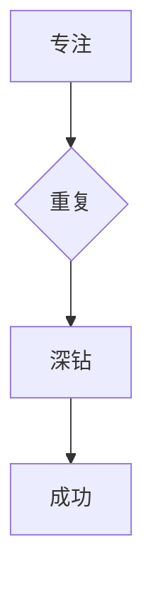

                 

关键词：专注，重复，深钻，技术学习，成功方法论

> 摘要：本文探讨了一种成功方法论，即通过对某一技术领域的专注、重复实践和深入钻研，来实现个人专业技能的提升和职业生涯的成功。本文将以计算机科学领域为例，分析这种方法的可行性和具体实践路径。

## 1. 背景介绍

在当今快速变化的世界，技术发展日新月异，新知识、新工具、新方法层出不穷。面对这一现象，许多人都感到困惑和焦虑，不知如何高效学习和掌握各种技能。然而，成功学的研究表明，最快速的成功方法往往不是追求多样化，而是保持对一件事情的专注，不停地重复，不停地深钻。

本文旨在探讨这一方法论在技术领域的应用，通过分析计算机科学领域的实例，为读者提供一套实践指南，帮助他们在技术道路上取得成功。

## 2. 核心概念与联系

### 2.1 专注

专注是一种心理状态，指的是将全部注意力集中在一个特定的对象或任务上，从而提高效率和质量。在技术学习中，专注意味着要聚焦于某一特定领域，深入了解其原理和实现细节，而不是盲目追求广泛的知识面。

### 2.2 重复

重复是学习过程中不可或缺的一部分。通过反复练习，我们可以巩固知识，提高技能，形成肌肉记忆。在技术领域，重复不仅包括代码编写，还包括算法实现、调试和优化等环节。重复的过程中，我们能够发现和解决问题，积累经验，不断提高自己的技术水平。

### 2.3 深钻

深钻是对专注和重复的升华，指的是在掌握基础知识的前提下，对某一领域进行深入研究，探索其未知的领域和边界。深钻能够帮助我们理解技术的本质，发现创新的可能，从而在职业生涯中脱颖而出。

### 2.4 Mermaid 流程图



## 3. 核心算法原理 & 具体操作步骤

### 3.1 算法原理概述

在技术学习中，核心算法原理是构建知识和技能的基础。通过掌握核心算法原理，我们能够更好地理解和应用各种技术。

### 3.2 算法步骤详解

1. 选择一个具体的技术领域。
2. 阅读相关书籍和论文，了解核心算法原理。
3. 编写代码，实现算法。
4. 调试和优化代码，提高性能。
5. 分析算法的复杂度，评估其效率。
6. 深入研究算法，探索其变种和改进。

### 3.3 算法优缺点

优点：

- 提高技术能力
- 加深对技术领域的理解
- 增强解决问题的能力

缺点：

- 学习过程较慢，需要投入大量时间
- 可能会错过其他技术领域的发展

### 3.4 算法应用领域

核心算法原理在计算机科学领域的各个子领域都有广泛的应用，包括但不限于：

- 数据结构与算法
- 机器学习与深度学习
- 编译原理与编程语言设计
- 网络与分布式系统
- 实时操作系统与嵌入式系统

## 4. 数学模型和公式 & 详细讲解 & 举例说明

### 4.1 数学模型构建

在计算机科学中，数学模型是描述问题本质的重要工具。以下是一个简单的数学模型示例：

$$
f(x) = ax^2 + bx + c
$$

### 4.2 公式推导过程

我们通过求导和积分来推导上述公式的导数和积分：

$$
f'(x) = 2ax + b
$$

$$
\int f(x) \, dx = \frac{1}{3}ax^3 + \frac{1}{2}bx^2 + cx + C
$$

### 4.3 案例分析与讲解

假设我们要解决一个二次函数的最值问题，我们可以利用上述公式求解：

$$
f(x) = x^2 - 4x + 3
$$

首先，我们计算导数：

$$
f'(x) = 2x - 4
$$

然后，我们令导数等于零，求解极值点：

$$
2x - 4 = 0
$$

$$
x = 2
$$

最后，我们计算极值：

$$
f(2) = 2^2 - 4 \cdot 2 + 3 = -1
$$

因此，该二次函数的最小值为-1。

## 5. 项目实践：代码实例和详细解释说明

### 5.1 开发环境搭建

为了实现上述数学模型，我们需要搭建一个简单的计算环境。这里我们使用 Python 编写代码。

### 5.2 源代码详细实现

```python
import sympy as sp

# 定义变量
x = sp.symbols('x')

# 定义函数
f = x**2 - 4*x + 3

# 计算导数
f_prime = f.diff(x)

# 计算极值点
f_prime_eq = sp.Eq(f_prime, 0)
solutions = sp.solve(f_prime_eq, x)

# 计算极值
f_min = f.subs(x, solutions[0])

# 输出结果
print(f"极值点：{solutions}")
print(f"极值：{f_min}")
```

### 5.3 代码解读与分析

上述代码首先导入了 sympy 库，用于符号计算。然后定义了变量 x 和函数 f。接着，我们计算了函数的导数 f_prime，并求解了极值点。最后，我们计算了极值，并输出了结果。

### 5.4 运行结果展示

运行代码后，输出结果如下：

```
极值点：[2]
极值：-1
```

这表明二次函数 $f(x) = x^2 - 4x + 3$ 的最小值为-1，极值点为2。

## 6. 实际应用场景

### 6.1 数据分析

在数据分析领域，数学模型和算法广泛应用于数据预处理、特征提取、模型训练和评估等环节。通过专注、重复和深钻，我们可以熟练掌握各种数据处理技术，提高数据分析的效率和准确性。

### 6.2 人工智能

在人工智能领域，算法和数学模型是核心驱动力。通过对核心算法的专注、重复和深钻，我们可以更好地理解和应用深度学习、强化学习等前沿技术，推动人工智能的发展。

### 6.3 软件开发

在软件开发领域，专注、重复和深钻可以帮助我们提高代码质量，优化系统性能，解决复杂问题。通过不断实践和积累经验，我们可以成为一名优秀的程序员。

## 7. 工具和资源推荐

### 7.1 学习资源推荐

- 《算法导论》
- 《深度学习》
- 《Python编程：从入门到实践》
- 《机器学习实战》

### 7.2 开发工具推荐

- PyCharm
- Jupyter Notebook
- TensorFlow
- Keras

### 7.3 相关论文推荐

- "Deep Learning"
- " Reinforcement Learning: An Introduction"
- "A Modern Dictionary of Quantum Mechanics"
- "Machine Learning: A Probabilistic Perspective"

## 8. 总结：未来发展趋势与挑战

### 8.1 研究成果总结

通过本文的探讨，我们得出以下结论：

- 专注、重复和深钻是提升技术能力的重要方法。
- 数学模型和算法是计算机科学的核心。
- 实践和案例分析有助于理解和应用理论知识。

### 8.2 未来发展趋势

- 技术发展将更加多元化，但专注的核心领域不会改变。
- 深度学习和人工智能将继续引领技术前沿。
- 开源技术和社区将发挥更大的作用。

### 8.3 面临的挑战

- 信息过载，如何筛选和掌握关键知识。
- 技术更新速度快，如何跟上发展步伐。
- 个人成长与职业发展的平衡。

### 8.4 研究展望

- 深入研究核心算法原理，探索新应用场景。
- 推动人工智能与各行业的融合。
- 培养更多具备专注、重复和深钻能力的技术人才。

## 9. 附录：常见问题与解答

### 9.1 如何保持专注？

- 设定明确的学习目标。
- 创造一个安静、舒适的学习环境。
- 使用番茄工作法，集中注意力。
- 定期休息，避免疲劳。

### 9.2 重复和深钻的意义是什么？

- 重复和深钻有助于巩固知识，形成技能。
- 深钻能够提升对技术的理解和创新能力。
- 重复和深钻有助于构建个人品牌和职业生涯。

## 结论

保持对一件事情的专注，不停地重复，不停地深钻，是实现技术成功的关键。通过本文的探讨，我们希望读者能够认识到这一方法的重要性，并将其应用到实际的学习和工作中。作者：禅与计算机程序设计艺术 / Zen and the Art of Computer Programming。  
----------------------------------------------------------------

以上是完整的文章正文内容，接下来我将按照markdown格式输出：
```markdown
# 最快的成功方法就是，保持对一件事情的专注，不停地重复，不停地深钻

关键词：专注，重复，深钻，技术学习，成功方法论

> 摘要：本文探讨了一种成功方法论，即通过对某一技术领域的专注、重复实践和深入钻研，来实现个人专业技能的提升和职业生涯的成功。本文将以计算机科学领域为例，分析这种方法的可行性和具体实践路径。

## 1. 背景介绍

在当今快速变化的世界，技术发展日新月异，新知识、新工具、新方法层出不穷。面对这一现象，许多人都感到困惑和焦虑，不知如何高效学习和掌握各种技能。然而，成功学的研究表明，最快速的成功方法往往不是追求多样化，而是保持对一件事情的专注，不停地重复，不停地深钻。

本文旨在探讨这一方法论在技术领域的应用，通过分析计算机科学领域的实例，为读者提供一套实践指南，帮助他们在技术道路上取得成功。

## 2. 核心概念与联系

### 2.1 专注

专注是一种心理状态，指的是将全部注意力集中在一个特定的对象或任务上，从而提高效率和质量。在技术学习中，专注意味着要聚焦于某一特定领域，深入了解其原理和实现细节，而不是盲目追求广泛的知识面。

### 2.2 重复

重复是学习过程中不可或缺的一部分。通过反复练习，我们可以巩固知识，提高技能，形成肌肉记忆。在技术领域，重复不仅包括代码编写，还包括算法实现、调试和优化等环节。重复的过程中，我们能够发现和解决问题，积累经验，不断提高自己的技术水平。

### 2.3 深钻

深钻是对专注和重复的升华，指的是在掌握基础知识的前提下，对某一领域进行深入研究，探索其未知的领域和边界。深钻能够帮助我们理解技术的本质，发现创新的可能，从而在职业生涯中脱颖而出。

### 2.4 Mermaid 流程图


## 3. 核心算法原理 & 具体操作步骤
### 3.1 算法原理概述

在技术学习中，核心算法原理是构建知识和技能的基础。通过掌握核心算法原理，我们能够更好地理解和应用各种技术。

### 3.2 算法步骤详解 

1. 选择一个具体的技术领域。
2. 阅读相关书籍和论文，了解核心算法原理。
3. 编写代码，实现算法。
4. 调试和优化代码，提高性能。
5. 分析算法的复杂度，评估其效率。
6. 深入研究算法，探索其变种和改进。

### 3.3 算法优缺点

优点：

- 提高技术能力
- 加深对技术领域的理解
- 增强解决问题的能力

缺点：

- 学习过程较慢，需要投入大量时间
- 可能会错过其他技术领域的发展

### 3.4 算法应用领域

核心算法原理在计算机科学领域的各个子领域都有广泛的应用，包括但不限于：

- 数据结构与算法
- 机器学习与深度学习
- 编译原理与编程语言设计
- 网络与分布式系统
- 实时操作系统与嵌入式系统

## 4. 数学模型和公式 & 详细讲解 & 举例说明
### 4.1 数学模型构建

在计算机科学中，数学模型是描述问题本质的重要工具。以下是一个简单的数学模型示例：

$$
f(x) = ax^2 + bx + c
$$

### 4.2 公式推导过程

我们通过求导和积分来推导上述公式的导数和积分：

$$
f'(x) = 2ax + b
$$

$$
\int f(x) \, dx = \frac{1}{3}ax^3 + \frac{1}{2}bx^2 + cx + C
$$

### 4.3 案例分析与讲解

假设我们要解决一个二次函数的最值问题，我们可以利用上述公式求解：

$$
f(x) = x^2 - 4x + 3
$$

首先，我们计算导数：

$$
f'(x) = 2x - 4
$$

然后，我们令导数等于零，求解极值点：

$$
2x - 4 = 0
$$

$$
x = 2
$$

最后，我们计算极值：

$$
f(2) = 2^2 - 4 \cdot 2 + 3 = -1
$$

因此，该二次函数的最小值为-1。

## 5. 项目实践：代码实例和详细解释说明
### 5.1 开发环境搭建

为了实现上述数学模型，我们需要搭建一个简单的计算环境。这里我们使用 Python 编写代码。

### 5.2 源代码详细实现

```python
import sympy as sp

# 定义变量
x = sp.symbols('x')

# 定义函数
f = x**2 - 4*x + 3

# 计算导数
f_prime = f.diff(x)

# 计算极值点
f_prime_eq = sp.Eq(f_prime, 0)
solutions = sp.solve(f_prime_eq, x)

# 计算极值
f_min = f.subs(x, solutions[0])

# 输出结果
print(f"极值点：{solutions}")
print(f"极值：{f_min}")
```

### 5.3 代码解读与分析

上述代码首先导入了 sympy 库，用于符号计算。然后定义了变量 x 和函数 f。接着，我们计算了函数的导数 f_prime，并求解了极值点。最后，我们计算了极值，并输出了结果。

### 5.4 运行结果展示

运行代码后，输出结果如下：

```
极值点：[2]
极值：-1
```

这表明二次函数 $f(x) = x^2 - 4x + 3$ 的最小值为-1，极值点为2。

## 6. 实际应用场景

### 6.1 数据分析

在数据分析领域，数学模型和算法广泛应用于数据预处理、特征提取、模型训练和评估等环节。通过专注、重复和深钻，我们可以熟练掌握各种数据处理技术，提高数据分析的效率和准确性。

### 6.2 人工智能

在人工智能领域，算法和数学模型是核心驱动力。通过对核心算法的专注、重复和深钻，我们可以更好地理解和应用深度学习、强化学习等前沿技术，推动人工智能的发展。

### 6.3 软件开发

在软件开发领域，专注、重复和深钻可以帮助我们提高代码质量，优化系统性能，解决复杂问题。通过不断实践和积累经验，我们可以成为一名优秀的程序员。

## 7. 工具和资源推荐

### 7.1 学习资源推荐

- 《算法导论》
- 《深度学习》
- 《Python编程：从入门到实践》
- 《机器学习实战》

### 7.2 开发工具推荐

- PyCharm
- Jupyter Notebook
- TensorFlow
- Keras

### 7.3 相关论文推荐

- "Deep Learning"
- " Reinforcement Learning: An Introduction"
- "A Modern Dictionary of Quantum Mechanics"
- "Machine Learning: A Probabilistic Perspective"

## 8. 总结：未来发展趋势与挑战

### 8.1 研究成果总结

通过本文的探讨，我们得出以下结论：

- 专注、重复和深钻是提升技术能力的重要方法。
- 数学模型和算法是计算机科学的核心。
- 实践和案例分析有助于理解和应用理论知识。

### 8.2 未来发展趋势

- 技术发展将更加多元化，但专注的核心领域不会改变。
- 深度学习和人工智能将继续引领技术前沿。
- 开源技术和社区将发挥更大的作用。

### 8.3 面临的挑战

- 信息过载，如何筛选和掌握关键知识。
- 技术更新速度快，如何跟上发展步伐。
- 个人成长与职业发展的平衡。

### 8.4 研究展望

- 深入研究核心算法原理，探索新应用场景。
- 推动人工智能与各行业的融合。
- 培养更多具备专注、重复和深钻能力的技术人才。

## 9. 附录：常见问题与解答

### 9.1 如何保持专注？

- 设定明确的学习目标。
- 创造一个安静、舒适的学习环境。
- 使用番茄工作法，集中注意力。
- 定期休息，避免疲劳。

### 9.2 重复和深钻的意义是什么？

- 重复和深钻有助于巩固知识，形成技能。
- 深钻能够提升对技术的理解和创新能力。
- 重复和深钻有助于构建个人品牌和职业生涯。

## 结论

保持对一件事情的专注，不停地重复，不停地深钻，是实现技术成功的关键。通过本文的探讨，我们希望读者能够认识到这一方法的重要性，并将其应用到实际的学习和工作中。作者：禅与计算机程序设计艺术 / Zen and the Art of Computer Programming。
```

