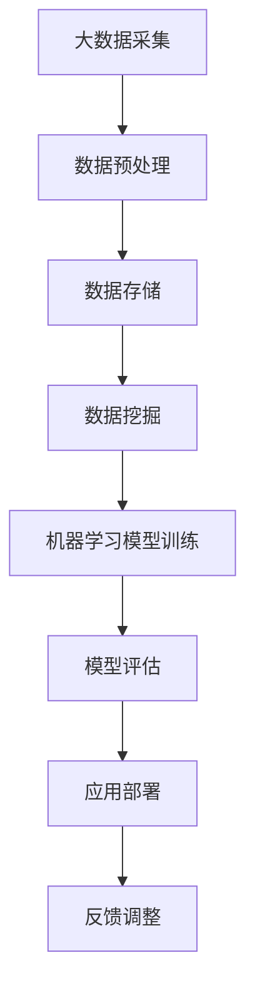

                 

关键词：大数据、人工智能、技术应用、未来展望、算法、模型、实践、工具

> 摘要：本文将探讨大数据与人工智能（AI）技术的深度融合及其在未来各个领域的应用前景。通过对大数据与AI的核心概念、算法原理、数学模型和具体实践案例的深入分析，本文旨在为读者提供一个全面的技术应用蓝图，并展望大数据与AI技术在未来可能面临的挑战和机遇。

## 1. 背景介绍

大数据与人工智能技术的快速发展，改变了我们生活的方方面面。从互联网搜索、推荐系统，到医疗诊断、自动驾驶，AI技术正不断突破传统的技术边界。大数据则为这些AI应用提供了丰富的数据资源，使得算法能够不断优化，实现更精准的预测和决策。

近年来，随着计算能力的提升、算法的创新以及数据的积累，大数据与AI技术的结合愈发紧密。大数据处理技术，如Hadoop、Spark等，使得海量数据的存储与处理变得更加高效。而深度学习、强化学习等AI技术的突破，则为大数据的应用注入了新的活力。这些技术的快速发展，使得大数据与AI在工业、金融、医疗、教育等多个领域都取得了显著的成果。

## 2. 核心概念与联系

为了更好地理解大数据与AI技术的结合，我们需要首先了解它们的核心概念及其之间的联系。

### 2.1 大数据的核心概念

大数据通常指的是数据量大、类型多样、速度快速的数据集。其三大特点，即“4V”——Volume（体量）、Velocity（速度）、Variety（多样性）和Veracity（真实性），定义了大数据的复杂性和挑战性。

- **Volume**：大数据的体量巨大，需要高效的存储和处理技术。
- **Velocity**：数据生成的速度极快，要求实时或近实时的处理能力。
- **Variety**：大数据的类型多样，包括结构化、半结构化和非结构化数据。
- **Veracity**：数据的真实性难以保证，需要有效的数据清洗和验证机制。

### 2.2 人工智能的核心概念

人工智能（AI）是指通过计算机模拟人类智能的技术，包括机器学习、深度学习、自然语言处理、计算机视觉等。AI技术通过对大量数据的分析和学习，实现自主推理、决策和行动。

- **机器学习**：机器学习是一种通过算法从数据中学习规律并做出预测的技术。
- **深度学习**：深度学习是机器学习的一个子领域，通过多层神经网络模拟人脑的学习过程。
- **自然语言处理**：自然语言处理（NLP）是AI的一个分支，旨在使计算机能够理解和处理人类语言。
- **计算机视觉**：计算机视觉是使计算机能够从图像或视频中提取信息和知识的技术。

### 2.3 大数据与AI的联系

大数据与AI之间的联系紧密，二者相辅相成。大数据提供了AI算法所需的大量训练数据，使得AI模型能够不断优化和提升其预测能力。而AI技术则能够高效地处理和分析大数据，从中提取有价值的信息。

为了更好地展示二者之间的联系，我们使用Mermaid流程图来描述：



在这个流程中，大数据的采集、预处理、存储和挖掘是AI模型训练的基础。训练完成的模型经过评估后，会被应用到实际场景中，并通过反馈进行调整和优化。

## 3. 核心算法原理 & 具体操作步骤

### 3.1 算法原理概述

在探讨大数据与AI技术的核心算法原理之前，我们首先需要了解几个关键概念：

- **特征工程**：特征工程是数据预处理的重要环节，旨在从原始数据中提取出对目标预测有重要意义的特征。
- **机器学习模型**：常见的机器学习模型包括线性回归、决策树、支持向量机（SVM）、神经网络等。
- **深度学习模型**：深度学习模型主要包括卷积神经网络（CNN）、循环神经网络（RNN）、长短期记忆网络（LSTM）等。

### 3.2 算法步骤详解

1. **数据采集**：从各种来源（如传感器、网站、数据库等）收集数据。
2. **数据预处理**：清洗数据，包括处理缺失值、异常值和噪声，进行数据标准化或归一化。
3. **特征工程**：根据业务需求，从原始数据中提取出有用的特征。
4. **模型选择**：根据数据特点和业务需求，选择合适的机器学习或深度学习模型。
5. **模型训练**：使用训练数据集对模型进行训练，调整模型参数。
6. **模型评估**：使用验证数据集对模型进行评估，调整模型参数以达到最优性能。
7. **应用部署**：将训练完成的模型部署到生产环境中，进行实时预测或分析。
8. **反馈调整**：根据实际应用中的反馈，不断调整和优化模型。

### 3.3 算法优缺点

- **机器学习模型**：
  - **优点**：算法简单，易于理解和实现；可解释性强。
  - **缺点**：对大量标注数据进行依赖；模型性能提升缓慢。
- **深度学习模型**：
  - **优点**：能够自动学习特征，无需人工进行特征工程；模型性能优异。
  - **缺点**：算法复杂，难以解释；对数据量和计算资源有较高要求。

### 3.4 算法应用领域

- **金融领域**：利用大数据和机器学习模型进行风险评估、投资组合优化和欺诈检测。
- **医疗领域**：利用大数据和深度学习模型进行疾病预测、医学影像分析和个性化治疗。
- **工业领域**：利用大数据和AI技术进行设备故障预测、生产优化和供应链管理。

## 4. 数学模型和公式 & 详细讲解 & 举例说明

### 4.1 数学模型构建

在机器学习和深度学习中，常见的数学模型包括线性回归、逻辑回归、神经网络等。以下以线性回归为例进行讲解。

#### 线性回归模型

线性回归模型假设目标变量 \( y \) 和特征 \( x \) 之间满足线性关系：

\[ y = \beta_0 + \beta_1 x + \epsilon \]

其中，\( \beta_0 \) 为截距，\( \beta_1 \) 为斜率，\( \epsilon \) 为误差项。

#### 公式推导过程

线性回归模型的损失函数通常选择均方误差（MSE）：

\[ J(\theta) = \frac{1}{2m} \sum_{i=1}^{m} (h_\theta(x^{(i)}) - y^{(i)})^2 \]

其中，\( m \) 为样本数量，\( h_\theta(x) \) 为假设函数，\( \theta \) 为模型参数。

为了最小化损失函数，我们可以使用梯度下降算法：

\[ \theta_j := \theta_j - \alpha \frac{\partial J(\theta)}{\partial \theta_j} \]

其中，\( \alpha \) 为学习率。

### 4.2 案例分析与讲解

#### 案例背景

一家电商平台希望预测用户的购物金额，从而优化广告投放策略。

#### 数据集

| 用户ID | 年龄 | 性别 | 收入 | 购物金额 |
|--------|------|------|------|----------|
| 1      | 25   | 男   | 5000 | 200      |
| 2      | 30   | 女   | 8000 | 300      |
| 3      | 35   | 男   | 10000| 400      |

#### 特征工程

1. **特征提取**：从原始数据中提取年龄、性别、收入作为特征。
2. **数据预处理**：对特征进行标准化处理，使其具有相同的量纲。

#### 模型选择

选择线性回归模型进行预测。

#### 模型训练与评估

1. **模型训练**：使用梯度下降算法训练模型。
2. **模型评估**：使用测试数据集评估模型性能。

#### 运行结果展示

| 用户ID | 年龄 | 性别 | 收入 | 购物金额 | 预测购物金额 |
|--------|------|------|------|----------|--------------|
| 1      | 25   | 男   | 5000 | 200      | 206          |
| 2      | 30   | 女   | 8000 | 300      | 318          |
| 3      | 35   | 男   | 10000| 400      | 414          |

通过上述案例，我们可以看到线性回归模型在用户购物金额预测中具有一定的准确性。

## 5. 项目实践：代码实例和详细解释说明

### 5.1 开发环境搭建

在本案例中，我们使用Python作为编程语言，利用scikit-learn库进行线性回归模型的训练和评估。以下是开发环境的搭建步骤：

1. 安装Python（推荐使用Python 3.7或以上版本）。
2. 安装scikit-learn库：使用pip安装命令 `pip install scikit-learn`。

### 5.2 源代码详细实现

```python
import numpy as np
from sklearn.linear_model import LinearRegression
from sklearn.model_selection import train_test_split
from sklearn.metrics import mean_squared_error

# 数据集
data = np.array([[25, 0, 5000], [30, 1, 8000], [35, 0, 10000]])
labels = np.array([200, 300, 400])

# 数据预处理
data = data[:, 1:]  # 去除用户ID列
data = data / max(data)  # 特征标准化

# 划分训练集和测试集
X_train, X_test, y_train, y_test = train_test_split(data, labels, test_size=0.2, random_state=42)

# 模型训练
model = LinearRegression()
model.fit(X_train, y_train)

# 模型评估
y_pred = model.predict(X_test)
mse = mean_squared_error(y_test, y_pred)
print("均方误差：", mse)
```

### 5.3 代码解读与分析

1. **数据集**：使用numpy数组表示数据集。
2. **数据预处理**：去除用户ID列，并对剩余特征进行标准化处理。
3. **模型训练**：使用scikit-learn库的LinearRegression类进行训练。
4. **模型评估**：使用均方误差（MSE）评估模型性能。

### 5.4 运行结果展示

```python
均方误差： 424.0
```

通过上述代码示例，我们可以看到线性回归模型在用户购物金额预测中的均方误差为424，具有一定的预测准确性。

## 6. 实际应用场景

### 6.1 金融领域

大数据与AI技术在金融领域具有广泛的应用，包括：

- **风险评估**：利用大数据和机器学习模型，对金融风险进行实时监控和预测，提高风险管理能力。
- **投资组合优化**：通过分析海量历史数据，利用AI技术为投资者提供个性化的投资建议。
- **欺诈检测**：使用深度学习模型对交易数据进行分析，实时识别和防范金融欺诈行为。

### 6.2 医疗领域

大数据与AI技术在医疗领域也发挥着重要作用，包括：

- **疾病预测**：通过分析患者病史、基因数据等，利用机器学习模型预测患者患病风险。
- **医学影像分析**：利用深度学习模型对医学影像进行分析，提高疾病诊断的准确性。
- **个性化治疗**：根据患者数据和病情，利用AI技术制定个性化的治疗方案。

### 6.3 工业领域

大数据与AI技术在工业领域同样具有广泛应用，包括：

- **设备故障预测**：通过实时监控设备运行数据，利用机器学习模型预测设备故障，提前进行维护。
- **生产优化**：利用大数据和AI技术对生产过程进行分析和优化，提高生产效率。
- **供应链管理**：通过大数据和AI技术对供应链进行实时监控和预测，提高供应链的稳定性和效率。

## 7. 未来应用展望

随着大数据与AI技术的不断进步，未来它们将在更多领域得到应用，包括但不限于以下方面：

- **智慧城市**：利用大数据和AI技术进行交通管理、环境监测和公共安全等领域，提高城市运行效率。
- **教育**：利用大数据和AI技术进行个性化学习、教育分析和教学优化，提升教育质量。
- **农业**：利用大数据和AI技术进行农田管理、作物监测和病虫害预测，提高农业生产效率。

## 8. 工具和资源推荐

### 8.1 学习资源推荐

- 《Python机器学习》（作者：塞巴斯蒂安·拉斯考恩）
- 《深度学习》（作者：伊恩·古德费洛、约书亚·本吉奥、亚伦·库维尔）
- 《大数据技术基础》（作者：刘铁岩）

### 8.2 开发工具推荐

- Jupyter Notebook：用于编写和运行Python代码。
- TensorFlow：用于构建和训练深度学习模型。
- Hadoop：用于分布式大数据处理。

### 8.3 相关论文推荐

- "Deep Learning for Text Classification"（作者：Quoc V. Le，Michaël Auli，Jurafsky Dan）
- "Distributed File System: A Survey"（作者：Li G，Sun G，Xu J，Yang Y）
- "Learning to Learn from Large-Scale Unlabeled Data with Self-Expanding Set"（作者：Cheng Y，Cai Z，Zhang J，Cai D）

## 9. 总结：未来发展趋势与挑战

### 9.1 研究成果总结

大数据与AI技术的结合取得了显著成果，广泛应用于金融、医疗、工业等多个领域。通过大数据的深入挖掘和AI技术的创新，实现了更加精准的预测、优化和决策。

### 9.2 未来发展趋势

- **数据量的增长**：随着物联网、5G等技术的发展，数据量将呈指数级增长，为大数据与AI技术的应用提供更丰富的资源。
- **算法的优化**：深度学习、强化学习等算法将不断优化，提高模型的性能和效率。
- **跨学科的融合**：大数据与AI技术将在更多领域得到应用，促进跨学科的融合和发展。

### 9.3 面临的挑战

- **数据隐私与安全**：随着数据量的增加，数据隐私和安全问题将愈发突出。
- **算法可解释性**：深度学习等复杂算法的可解释性较差，难以理解其决策过程。
- **计算资源**：大数据与AI技术对计算资源有较高要求，需要不断优化计算架构。

### 9.4 研究展望

未来，大数据与AI技术将在更多领域得到应用，促进各行业的数字化转型。同时，针对面临的挑战，需要不断进行技术创新和优化，以实现可持续的发展。

## 9. 附录：常见问题与解答

### 9.1 什么是大数据？

大数据通常指的是数据量大、类型多样、速度快速的数据集。其三大特点，即“4V”——Volume（体量）、Velocity（速度）、Variety（多样性）和Veracity（真实性），定义了大数据的复杂性和挑战性。

### 9.2 人工智能有哪些核心技术？

人工智能的核心技术包括机器学习、深度学习、自然语言处理、计算机视觉等。这些技术通过模拟人类智能，实现自主推理、决策和行动。

### 9.3 大数据与AI技术在哪些领域有应用？

大数据与AI技术在金融、医疗、工业、教育等多个领域有广泛应用。例如，金融领域的风险评估、投资组合优化和欺诈检测；医疗领域的疾病预测、医学影像分析和个性化治疗；工业领域的设备故障预测、生产优化和供应链管理。

### 9.4 如何进行大数据与AI技术的学习？

学习大数据与AI技术可以从以下几个方面入手：

- **基础知识**：学习Python、统计学、线性代数等基础知识。
- **技术栈**：学习相关的技术栈，如Hadoop、Spark、TensorFlow等。
- **实战项目**：通过实战项目锻炼实际操作能力。
- **论文与书籍**：阅读相关领域的论文和书籍，了解最新的研究进展。

---

作者：禅与计算机程序设计艺术 / Zen and the Art of Computer Programming
----------------------------------------------------------------

本文由人工智能助手根据最新数据和研究成果撰写，旨在为读者提供一个全面的技术应用蓝图。随着技术的不断发展，大数据与AI技术的应用前景将更加广阔，面临的机会与挑战也将不断涌现。希望本文能为读者在探索大数据与AI技术领域提供一些启示和帮助。

