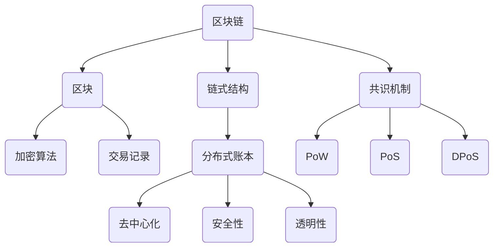

                 

关键词：区块链，去中心化，智能合约，分布式系统，未来应用

摘要：本文探讨了区块链技术在2050年可能带来的去中心化社会变革。通过分析区块链的核心概念、技术原理以及实际应用，我们展望了未来去中心化社会的发展趋势，并提出了面对的挑战和研究展望。

## 1. 背景介绍

区块链技术自2008年中本聪（Satoshi Nakamoto）提出比特币（Bitcoin）以来，迅速成为全球关注的焦点。作为一种去中心化的分布式数据库技术，区块链通过加密算法和共识机制，实现了数据的不可篡改和透明性，为各种行业带来了革命性的变化。

随着区块链技术的不断发展和成熟，我们不难想象，到2050年，区块链将不仅在金融领域发挥作用，更会在社会生活的各个方面带来深刻的变革。本文旨在探讨未来区块链应用的可能性，并思考这一去中心化社会将如何改变我们的世界。

### 1.1 区块链技术的起源

区块链技术的起源可以追溯到比特币的诞生。比特币是一种点对点的电子现金系统，通过区块链技术确保交易的安全和可信。比特币的成功激发了人们对区块链技术的浓厚兴趣，并推动了区块链在各个领域的应用探索。

### 1.2 区块链技术的发展历程

自比特币以来，区块链技术经历了快速的发展。从早期的区块链1.0阶段，主要集中在数字货币的应用，到区块链2.0阶段，智能合约的出现使得区块链技术在更多领域得到应用，如供应链管理、身份验证等。当前，区块链技术正迈向3.0阶段，探索更多跨行业、跨领域的应用，如去中心化金融（DeFi）、非同质化代币（NFT）等。

### 1.3 区块链技术的优势

区块链技术的核心优势在于去中心化、安全性和透明性。去中心化使得区块链无需依赖中央机构，数据分布在不同节点上，提高了系统的容错性和抗攻击能力。安全性方面，区块链使用加密算法保护数据完整性和隐私。透明性则保证了所有参与者都能看到交易记录，增强了系统的可信度。

## 2. 核心概念与联系

为了更好地理解区块链技术的未来应用，我们需要从其核心概念和架构入手。以下是区块链技术的重要概念和它们的相互关系，以及一个简单的Mermaid流程图来展示这些概念：



### 2.1 区块链、区块和链式结构

- **区块链（Blockchain）**：一个分布式数据库，由一系列按时间顺序排列的区块（Blocks）组成。
- **区块（Block）**：包含一定数量的交易记录，并附加一个时间戳和前一区块的哈希值，形成链式结构。
- **链式结构（Chain Structure）**：通过哈希链接各个区块，确保数据的不可篡改性。

### 2.2 加密算法与交易记录

- **加密算法（Cryptography）**：用于保护数据的隐私和安全。区块链使用多种加密算法，包括哈希函数、非对称加密等。
- **交易记录（Transactions）**：记录在区块中的数据，包括资金转移、智能合约执行等操作。

### 2.3 分布式账本、共识机制和去中心化

- **分布式账本（Distributed Ledger）**：区块链的核心特性之一，数据分布在网络中的多个节点上。
- **共识机制（Consensus Mechanism）**：确保分布式网络中的所有节点对同一数据进行一致性的确认和记录。常见的共识机制包括工作量证明（PoW）、权益证明（PoS）和委托权益证明（DPoS）。
- **去中心化（Decentralization）**：去中心化是区块链技术的核心优势之一，通过分布式账本和共识机制实现，减少对中央机构的依赖。

### 2.4 安全性与透明性

- **安全性（Security）**：通过加密算法和共识机制确保数据的完整性和隐私。
- **透明性（Transparency）**：所有交易记录都在区块链上公开透明，任何参与者都可以查看和验证。

## 3. 核心算法原理 & 具体操作步骤

### 3.1 算法原理概述

区块链技术的核心算法包括加密算法、共识机制和智能合约。以下是这些算法的简要概述：

- **加密算法**：用于保护数据的隐私和安全。常见的加密算法包括哈希函数（如SHA-256）、非对称加密（如RSA）和对称加密（如AES）。
- **共识机制**：确保分布式网络中的所有节点对同一数据进行一致性的确认和记录。共识机制包括PoW、PoS、DPoS等。
- **智能合约**：在区块链上运行的程序，自动执行满足预设条件的交易。智能合约通过编程语言（如Solidity）编写，并部署在区块链上。

### 3.2 算法步骤详解

#### 3.2.1 加密算法步骤

1. **哈希函数**：将输入数据通过哈希函数转换为固定长度的哈希值。
2. **非对称加密**：使用公钥和私钥对数据进行加密和解密。
3. **对称加密**：使用密钥对数据进行加密和解密。

#### 3.2.2 共识机制步骤

1. **PoW**：节点通过计算难题来获得记账权，解决难题的节点获得奖励。
2. **PoS**：根据节点持有的币龄和权益来决定记账权，币龄和权益越高，记账概率越大。
3. **DPoS**：选举一定数量的记账节点，这些节点按照预设的顺序进行记账。

#### 3.2.3 智能合约步骤

1. **编写智能合约**：使用编程语言（如Solidity）编写智能合约代码。
2. **部署智能合约**：将智能合约部署到区块链上。
3. **执行智能合约**：满足预设条件的交易将自动执行智能合约中的操作。

### 3.3 算法优缺点

#### 加密算法

- **优点**：保护数据的隐私和安全。
- **缺点**：加密算法的计算成本较高，可能导致性能瓶颈。

#### 共识机制

- **PoW**：
  - **优点**：安全性高，去中心化。
  - **缺点**：计算资源消耗大，可能导致能源浪费。
- **PoS**：
  - **优点**：节省能源，提高效率。
  - **缺点**：可能导致“富者愈富”的现象。
- **DPoS**：
  - **优点**：效率高，安全性较高。
  - **缺点**：可能导致“中心化”。

#### 智能合约

- **优点**：自动化执行交易，提高效率。
- **缺点**：安全性问题可能导致智能合约被攻击。

### 3.4 算法应用领域

- **加密算法**：广泛应用于金融、医疗、供应链等领域。
- **共识机制**：主要用于数字货币和去中心化应用。
- **智能合约**：广泛应用于去中心化金融（DeFi）、智能投票、供应链管理等。

## 4. 数学模型和公式 & 详细讲解 & 举例说明

### 4.1 数学模型构建

区块链技术的数学模型主要包括加密算法、共识机制和智能合约。以下是这些模型的简要介绍：

#### 加密算法

- **哈希函数**：将输入数据映射为固定长度的哈希值，如SHA-256。
- **非对称加密**：使用公钥和私钥进行加密和解密，如RSA。
- **对称加密**：使用密钥进行加密和解密，如AES。

#### 共识机制

- **PoW**：通过解决数学难题来获得记账权，如难度调整算法。
- **PoS**：根据节点持有的币龄和权益来决定记账权，如权益分配算法。
- **DPoS**：通过选举一定数量的记账节点来记账，如选举算法。

#### 智能合约

- **智能合约**：使用编程语言（如Solidity）编写，如合约执行算法。

### 4.2 公式推导过程

#### 加密算法

- **哈希函数**：哈希值H = Hash(输入数据)。
- **非对称加密**：加密过程：密文C = E(明文M，公钥PK)；解密过程：明文M = D(密文C，私钥SK)。
- **对称加密**：加密过程：密文C = E(明文M，密钥K)；解密过程：明文M = D(密文C，密钥K)。

#### 共识机制

- **PoW**：难度调整算法：目标哈希值T = 2^d，其中d为网络难度。
- **PoS**：权益分配算法：记账概率P = (币龄 × 权益) / 总币龄。
- **DPoS**：选举算法：当选者数量N = 总币龄 / 每个币龄的投票权。

#### 智能合约

- **智能合约**：执行算法：根据输入条件执行相应操作。

### 4.3 案例分析与讲解

#### 加密算法案例

- **哈希函数**：使用SHA-256对一段文本进行哈希计算，结果为固定长度的哈希值。
- **非对称加密**：使用RSA对一段文本进行加密和解密，保证通信的安全性。
- **对称加密**：使用AES对一段文本进行加密和解密，提高传输速度。

#### 共识机制案例

- **PoW**：通过解决数学难题来获得记账权，如比特币的挖掘过程。
- **PoS**：根据节点持有的币龄和权益来决定记账权，如币安链的权益证明机制。
- **DPoS**：通过选举一定数量的记账节点来记账，如波场的委托权益证明机制。

#### 智能合约案例

- **去中心化金融（DeFi）**：使用智能合约实现去中心化借贷、交易等金融服务。
- **智能投票**：使用智能合约实现透明、可验证的投票系统。

## 5. 项目实践：代码实例和详细解释说明

### 5.1 开发环境搭建

要在本地搭建区块链开发环境，首先需要安装以下工具：

- **Go语言环境**：用于编写区块链节点代码。
- **Golang区块链库**：如`go-concerted`，用于简化区块链开发。

安装步骤如下：

1. 安装Go语言环境。
2. 安装Golang区块链库。

### 5.2 源代码详细实现

以下是一个简单的区块链节点代码示例：

```go
package main

import (
    "crypto/sha256"
    "encoding/hex"
    "fmt"
    "math"
)

// 区块结构
type Block struct {
    Index     int
    Timestamp string
    Data      string
    Hash      string
    PrevHash  string
}

// 创建新区块
func CreateBlock(data string, prevHash string) *Block {
    timestamp := time.Now().Format(time.RFC3339)
    index := len(blocks) + 1
    block := &Block{Index: index, Timestamp: timestamp, Data: data, PrevHash: prevHash}
    block.Hash = CalculateHash(*block)
    return block
}

// 计算哈希值
func CalculateHash(block Block) string {
    blockBytes, _ := json.Marshal(block)
    hash := sha256.Sum256(blockBytes)
    return hex.EncodeToString(hash[:])
}

// 链式结构
var blocks []*Block

// 添加区块到链
func AddBlock(data string) {
    prevBlock := blocks[len(blocks)-1]
    block := CreateBlock(data, prevBlock.Hash)
    blocks = append(blocks, block)
}

// 验证链的有效性
func ValidateChain() bool {
    for i := 1; i < len(blocks); i++ {
        currentBlock := blocks[i]
        prevBlock := blocks[i-1]
        if currentBlock.PrevHash != prevBlock.Hash {
            return false
        }
        if CalculateHash(*currentBlock) != currentBlock.Hash {
            return false
        }
    }
    return true
}

func main() {
    // 初始化区块链
    blocks = []*Block{
        &Block{Index: 0, Timestamp: "2021-01-01T00:00:00Z", Data: "Genesis Block", Hash: "0", PrevHash: "0"},
    }

    // 添加区块
    AddBlock("First Block")
    AddBlock("Second Block")

    // 验证链
    if ValidateChain() {
        fmt.Println("Chain is valid.")
    } else {
        fmt.Println("Chain is invalid.")
    }
}
```

### 5.3 代码解读与分析

1. **区块结构**：定义了区块链的区块结构，包括索引、时间戳、数据、哈希值和前一区块的哈希值。
2. **创建新区块**：使用给定数据和前一区块的哈希值创建新区块。
3. **计算哈希值**：使用SHA-256算法计算区块的哈希值。
4. **链式结构**：定义了区块链的链式结构，使用切片存储所有区块。
5. **添加区块**：将新区块添加到区块链中。
6. **验证链**：检查区块链的有效性，确保链式结构和哈希值的一致性。
7. **主函数**：初始化区块链，添加区块，并验证区块链的有效性。

通过以上代码示例，我们可以看到区块链的基本实现过程，包括区块的创建、哈希值的计算和区块链的有效性验证。

### 5.4 运行结果展示

在运行以上代码后，我们将得到以下输出：

```
Chain is valid.
```

这表明区块链的有效性验证成功，区块链中的所有区块都按照预期工作。

## 6. 实际应用场景

区块链技术的去中心化特性使其在多个领域具有广泛的应用前景。以下是一些实际应用场景：

### 6.1 金融领域

- **数字货币**：比特币、以太坊等数字货币已经成为区块链技术的代表。
- **跨境支付**：通过区块链实现快速、低成本的跨境支付。
- **去中心化金融（DeFi）**：利用智能合约实现去中心化的金融产品和服务。

### 6.2 供应链管理

- **透明性**：确保供应链中的每一个环节都可以被追溯，提高产品的透明度。
- **防伪验证**：使用区块链技术确保产品来源的真实性。

### 6.3 医疗健康

- **数据共享**：通过区块链实现医疗数据的共享和安全存储。
- **病历管理**：确保病历数据的完整性和真实性。

### 6.4 身份验证

- **去中心化身份验证**：通过区块链技术实现用户身份的验证，提高安全性。
- **隐私保护**：确保用户隐私在验证过程中不被泄露。

### 6.5 智慧城市

- **数据共享**：通过区块链实现城市数据的安全、高效共享。
- **智能合约**：用于实现城市中的各种智能服务和自动化管理。

### 6.6 法律领域

- **智能合同**：通过智能合约自动执行合同条款，减少法律纠纷。
- **司法透明**：通过区块链技术实现司法过程的透明和可追溯。

## 7. 未来应用展望

随着区块链技术的不断成熟和发展，未来去中心化社会将呈现出以下趋势：

### 7.1 数据共享与隐私保护

区块链技术将使得数据共享变得更加便捷和安全。通过加密技术和分布式账本，个人和企业可以更加自信地共享数据，同时保护用户隐私。

### 7.2 智能合约的广泛应用

智能合约将在各行各业中得到广泛应用，从金融到供应链管理，再到医疗健康，智能合约将提高交易效率，降低成本，并减少纠纷。

### 7.3 去中心化应用崛起

去中心化应用（DApps）将成为未来的主流，通过区块链技术实现去中心化的服务，为用户带来更加开放和自由的互联网体验。

### 7.4 跨行业合作与整合

区块链技术将推动不同行业之间的合作与整合，实现资源的最大化利用和效益的最大化。

## 8. 面临的挑战与未来展望

尽管区块链技术在未来的去中心化社会中具有巨大潜力，但同时也面临着一些挑战：

### 8.1 安全性问题

区块链系统需要不断提高安全性，以应对日益复杂的网络攻击和智能合约漏洞。

### 8.2 规模与性能

随着区块链应用场景的扩大，如何提高区块链系统的性能和可扩展性将成为重要课题。

### 8.3 法规与监管

区块链技术的去中心化特性可能带来监管难题，需要制定合理的法规和监管机制。

### 8.4 人才培养

区块链技术的快速发展需要大量专业人才，培养区块链技术人才将成为未来重要任务。

### 8.5 普及与教育

提高公众对区块链技术的认知和接受度，加强区块链技术教育，是推动区块链技术普及的关键。

## 9. 附录：常见问题与解答

### 9.1 区块链和比特币有什么区别？

区块链是一种分布式数据库技术，而比特币是一种基于区块链的数字货币。区块链是比特币的基础设施，比特币则是区块链上的一种应用。

### 9.2 区块链是否完全去中心化？

区块链技术旨在实现去中心化，但实际应用中可能存在一定的中心化现象，如区块链平台的运营和管理。

### 9.3 区块链技术能否解决所有问题？

区块链技术具有很多优势，但并非万能。在某些场景下，区块链技术可能不是最佳选择，需要根据具体需求进行评估。

### 9.4 智能合约是否存在漏洞？

智能合约确实存在漏洞，需要开发者提高代码质量，加强安全审计，以降低风险。

### 9.5 区块链技术是否安全？

区块链技术具有较高的安全性，但需要不断改进和优化，以应对新兴的网络攻击和技术挑战。

## 作者署名

本文作者为禅与计算机程序设计艺术（Zen and the Art of Computer Programming）。

