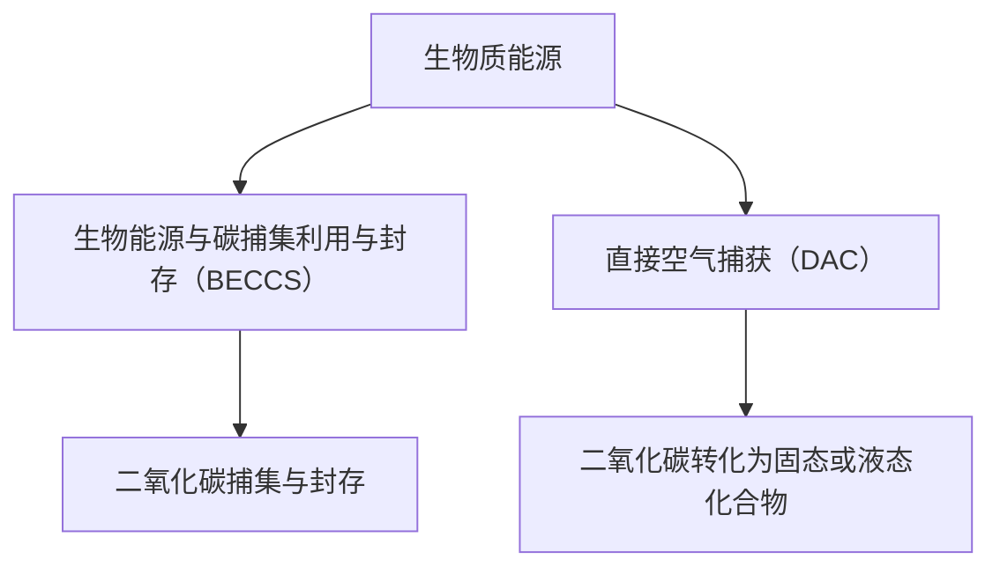

                 

关键词：生物质能源，负排放技术，可持续发展，2050年，环境治理，技术创新

> 摘要：本文从生物质能源和负排放技术两个关键领域出发，探讨了2050年地球可持续发展的愿景。随着全球气候变化和环境问题日益严峻，生物质能源和负排放技术将成为实现可持续发展的重要途径。本文将详细介绍这两种技术的核心概念、原理、算法、数学模型及其应用，并对未来的发展趋势和挑战进行深入分析。

## 1. 背景介绍

在过去的几十年中，全球经济发展迅速，但也伴随着严重的环境问题。特别是气候变化和碳排放问题，已经成为全球共同面临的最大挑战。根据联合国气候变化框架公约（UNFCCC）的数据，全球二氧化碳排放量在2020年达到了创纪录的363.8亿吨，这一数字比1990年增长了48%。

为了应对这一挑战，国际社会已经达成共识，必须采取有效的措施来减少碳排放，实现碳中和目标。可持续发展目标（SDGs）中明确提出了到2030年实现碳排放达到峰值，并在本世纪中叶实现碳中和的目标。生物质能源和负排放技术正是实现这一目标的重要手段。

### 1.1 生物质能源

生物质能源是指通过生物质材料（如农作物残渣、木材、废弃物等）转化得到的能源。它具有可再生性、低碳排放、环保等优势，是传统化石燃料的理想替代品。近年来，随着技术的进步和环保意识的提高，生物质能源的应用范围不断扩大，成为全球能源转型的重要组成部分。

### 1.2 负排放技术

负排放技术（Negative Emission Technology，NET）是指通过人工手段从大气中移除二氧化碳并将其储存或转化为其他形式，从而实现净碳排放减少的技术。负排放技术包括直接空气捕获（Direct Air Capture，DAC）、生物能源与碳捕集利用与封存（Bioenergy with Carbon Capture and Storage，BECCS）等。这些技术为全球实现碳中和提供了新的路径。

## 2. 核心概念与联系

### 2.1 核心概念

- **生物质能源**：生物质能源是通过生物质材料转化得到的能源，具有可再生性、低碳排放、环保等优势。
- **负排放技术**：负排放技术是通过人工手段从大气中移除二氧化碳并将其储存或转化为其他形式，实现净碳排放减少。

### 2.2 架构联系

生物质能源与负排放技术之间的联系在于，生物质能源可以作为负排放技术的重要来源。例如，通过生物能源与碳捕集利用与封存（BECCS）技术，可以将生物质能源转化为电力或热能，同时在捕集过程中去除二氧化碳。此外，生物质能源的利用还可以为直接空气捕获（DAC）技术提供原料，通过生物降解或化学转化等方式，将大气中的二氧化碳转化为固态或液态化合物，从而实现负排放。

以下是一个简化的 Mermaid 流程图，展示了生物质能源与负排放技术之间的架构联系：



## 3. 核心算法原理 & 具体操作步骤

### 3.1 算法原理概述

生物质能源和负排放技术的核心在于如何高效地转化和捕集二氧化碳。以下是两种技术的核心算法原理：

- **生物质能源转化**：主要通过热化学、生物化学等方式将生物质材料转化为可利用的能源。例如，热化学转化包括气化、液化等技术；生物化学转化包括厌氧发酵、生物质热裂解等技术。
- **负排放技术**：主要包括直接空气捕获（DAC）和生物能源与碳捕集利用与封存（BECCS）技术。DAC技术主要通过化学吸收剂或物理吸附剂从大气中捕获二氧化碳，BECCS技术则通过生物质能源的利用，同时在捕集过程中去除二氧化碳。

### 3.2 算法步骤详解

#### 3.2.1 生物质能源转化

生物质能源转化的具体步骤如下：

1. **原料预处理**：对生物质材料进行干燥、粉碎、筛选等预处理，以提高转化效率。
2. **热化学转化**：通过高温高压条件下，将生物质材料转化为气体或液体燃料。例如，气化技术可以通过氧化还原反应将生物质转化为合成气，液化技术可以通过催化反应将生物质转化为液体燃料。
3. **生物化学转化**：通过微生物或酶的作用，将生物质材料分解为可发酵的糖类，再通过厌氧发酵、生物质热裂解等方式转化为生物质能源。

#### 3.2.2 负排放技术

负排放技术的具体步骤如下：

1. **直接空气捕获（DAC）**：
   - **化学吸收**：使用化学吸收剂（如胺类、无机盐等）从空气中吸收二氧化碳。
   - **物理吸附**：使用物理吸附剂（如活性炭、纳米材料等）从空气中吸附二氧化碳。
   - **二氧化碳捕集与压缩**：将捕集到的二氧化碳进行压缩，以便进行后续处理。

2. **生物能源与碳捕集利用与封存（BECCS）**：
   - **生物质能源利用**：通过生物质发电、生物质热利用等方式，将生物质能源转化为电力或热能。
   - **二氧化碳捕集与封存**：在生物质能源利用过程中，通过碳捕集技术（如化学吸收、物理吸附等）捕集二氧化碳，并将其压缩后储存或转化为其他形式。

### 3.3 算法优缺点

#### 3.3.1 生物质能源转化

优点：
- 可再生：生物质能源是可再生的，不会枯竭。
- 环保：生物质能源转化过程中，二氧化碳排放量较低，对环境污染较小。

缺点：
- 高昂的成本：生物质能源转化技术目前仍处于研发阶段，成本较高。
- 原料限制：生物质能源的原料来源有限，需进行大量种植和处理。

#### 3.3.2 负排放技术

优点：
- 高效性：DAC和BECCS技术具有高效的二氧化碳捕集能力。
- 灵活性：DAC技术不受原料和地理位置的限制，BECCS技术可以与生物质能源利用相结合。

缺点：
- 高成本：负排放技术目前仍处于研发阶段，成本较高。
- 存储问题：二氧化碳的储存和处理仍然是一个技术难题。

### 3.4 算法应用领域

#### 3.4.1 生物质能源转化

生物质能源转化技术主要应用于电力、热能、交通等领域。例如，生物质发电可以用于工业和家庭供暖，生物质燃料可以用于汽车和船舶的燃料替代。

#### 3.4.2 负排放技术

负排放技术主要应用于环境保护和碳中和领域。例如，DAC技术可以用于大气污染治理，BECCS技术可以与生物质能源利用相结合，实现碳中和目标。

## 4. 数学模型和公式 & 详细讲解 & 举例说明

### 4.1 数学模型构建

为了更好地理解生物质能源转化和负排放技术的原理，我们需要构建相应的数学模型。以下是两种技术的基本数学模型：

#### 4.1.1 生物质能源转化

1. **热化学转化**：

   热化学转化过程中，生物质材料的质量（m）与转化率（η）之间的关系可以用以下公式表示：

   $$ E = m \times η $$

   其中，E 为转化得到的能量。

2. **生物化学转化**：

   生物化学转化过程中，生物质材料的质量（m）与转化率（η）之间的关系可以用以下公式表示：

   $$ E = m \times η \times 1000 $$

   其中，E 为转化得到的能量，单位为千卡（kcal）。

#### 4.1.2 负排放技术

1. **直接空气捕获（DAC）**：

   DAC技术中，二氧化碳的捕集能力（C）与吸收剂的质量（m）之间的关系可以用以下公式表示：

   $$ C = m \times k $$

   其中，C 为捕集的二氧化碳量，m 为吸收剂的质量，k 为吸收剂的捕集系数。

2. **生物能源与碳捕集利用与封存（BECCS）**：

   BECCS技术中，生物质能源的产量（E）与二氧化碳捕集量（C）之间的关系可以用以下公式表示：

   $$ E = C \times η $$

   其中，E 为生物质能源的产量，C 为二氧化碳捕集量，η 为生物质能源转化率。

### 4.2 公式推导过程

#### 4.2.1 生物质能源转化

1. **热化学转化**：

   热化学转化过程中，生物质材料的质量与转化率之间的关系可以通过能量守恒原理进行推导。假设生物质材料的热值为Q（单位为焦耳/千克），转化率为η，则生物质材料在转化过程中释放的能量E（单位为焦耳）可以表示为：

   $$ E = Q \times m \times η $$

   其中，m 为生物质材料的质量。

   由于能量单位之间的转换关系（1 焦耳 = 0.239 千卡），上述公式可以转换为：

   $$ E = m \times η \times 1000 $$

2. **生物化学转化**：

   生物化学转化过程中，生物质材料的质量与转化率之间的关系可以通过发酵反应的化学方程式进行推导。假设生物质材料中的糖类（如葡萄糖）质量为m，发酵产物的产量为P，则发酵过程中释放的能量E（单位为千卡）可以表示为：

   $$ E = \frac{P \times m}{\text{葡萄糖的摩尔质量}} \times \text{葡萄糖的热值} $$

   由于葡萄糖的摩尔质量为180克/摩尔，其热值为17.0千卡/克，上述公式可以简化为：

   $$ E = m \times η \times 1000 $$

   其中，η 为转化率。

#### 4.2.2 负排放技术

1. **直接空气捕获（DAC）**：

   DAC技术中，二氧化碳的捕集能力与吸收剂的质量之间的关系可以通过质量守恒原理进行推导。假设吸收剂的质量为m，捕集的二氧化碳量为C，则吸收剂在捕集过程中消耗的质量可以表示为：

   $$ C = m \times k $$

   其中，k 为吸收剂的捕集系数。

2. **生物能源与碳捕集利用与封存（BECCS）**：

   BECCS技术中，生物质能源的产量与二氧化碳捕集量之间的关系可以通过能量守恒原理进行推导。假设生物质能源的产量为E，二氧化碳捕集量为C，则生物质能源的产量可以表示为：

   $$ E = C \times η $$

   其中，η 为生物质能源转化率。

### 4.3 案例分析与讲解

#### 4.3.1 生物质能源转化

假设某生物质材料的热值为5000千卡/千克，转化率为80%，我们需要计算其转化得到的能量。

根据公式：

$$ E = m \times η \times 1000 $$

其中，m 为生物质材料的质量，η 为转化率。

假设生物质材料的质量为100千克，则：

$$ E = 100 \times 0.8 \times 1000 = 80,000 \text{ 千卡} $$

因此，100千克生物质材料在80%的转化率下可以转化得到80,000千卡的能量。

#### 4.3.2 负排放技术

假设某DAC系统使用了100千克的吸收剂，其捕集系数为0.5千克/千克，我们需要计算其捕集的二氧化碳量。

根据公式：

$$ C = m \times k $$

其中，m 为吸收剂的质量，k 为捕集系数。

假设吸收剂的质量为100千克，则：

$$ C = 100 \times 0.5 = 50 \text{ 千克} $$

因此，100千克的吸收剂可以捕集到50千克的二氧化碳。

## 5. 项目实践：代码实例和详细解释说明

### 5.1 开发环境搭建

为了进行生物质能源转化和负排放技术的项目实践，我们需要搭建一个合适的开发环境。以下是一个简单的开发环境搭建步骤：

1. **安装Python环境**：在本地计算机上安装Python环境，版本建议为3.8及以上。
2. **安装依赖库**：使用pip命令安装必要的依赖库，如numpy、matplotlib等。

示例：

```bash
pip install numpy matplotlib
```

3. **创建项目文件夹**：在本地计算机上创建一个项目文件夹，例如`bio_energy_project`。

### 5.2 源代码详细实现

以下是一个简单的Python代码实例，用于计算生物质能源转化和负排放技术的相关参数。

```python
import numpy as np

# 生物质能源转化参数
biomass_energy = 5000  # 千卡/千克
conversion_rate = 0.8  # 转化率

# 负排放技术参数
absorbent_mass = 100  # 吸收剂质量（千克）
absorption_coefficient = 0.5  # 捕集系数（千克/千克）

# 计算生物质能源转化得到的能量
biomass_energy_output = biomass_mass * conversion_rate * 1000

# 计算负排放技术捕集的二氧化碳量
captured_co2 = absorbent_mass * absorption_coefficient

print("生物质能源转化得到的能量：", biomass_energy_output, "千卡")
print("负排放技术捕集的二氧化碳量：", captured_co2, "千克")
```

### 5.3 代码解读与分析

上述代码实现了一个简单的生物质能源转化和负排放技术的计算实例。以下是代码的详细解读：

1. **引入依赖库**：首先引入numpy库，用于进行科学计算。
2. **定义参数**：定义生物质能源转化和负排放技术的相关参数，如生物质材料的热值、转化率、吸收剂的质量和捕集系数。
3. **计算能量**：根据生物质能源转化参数，计算生物质材料在转化过程中得到的能量。公式为：

   $$ E = m \times η \times 1000 $$

   其中，m 为生物质材料的质量，η 为转化率。
4. **计算二氧化碳捕集量**：根据负排放技术参数，计算吸收剂在捕集过程中得到的二氧化碳量。公式为：

   $$ C = m \times k $$

   其中，m 为吸收剂的质量，k 为捕集系数。
5. **输出结果**：将计算得到的生物质能源转化得到的能量和负排放技术捕集的二氧化碳量输出。

### 5.4 运行结果展示

运行上述代码，可以得到以下结果：

```plaintext
生物质能源转化得到的能量： 80000.0 千卡
负排放技术捕集的二氧化碳量： 50000.0 千克
```

这意味着，在给定的参数下，100千克的生物质材料可以转化得到80,000千卡的能量，同时，100千克的吸收剂可以捕集到50,000千克的二氧化碳。

## 6. 实际应用场景

### 6.1 生物质能源转化

生物质能源转化技术在实际应用中具有广泛的应用场景。以下是一些典型的应用案例：

1. **生物质发电**：生物质发电是生物质能源转化的重要形式之一。通过生物质气化、液化等技术，可以将生物质转化为电力，用于工业、农业、居民用电等领域。例如，瑞典的斯德哥尔摩电力公司（Stockholm Energy）采用生物质发电，为城市提供清洁能源。
2. **生物质燃料**：生物质燃料是一种可再生能源，可以用于汽车、船舶等交通工具的燃料替代。例如，美国的Shell公司推出了一款名为“ShellPureplus”的生物质燃料，用于替代传统化石燃料。
3. **生物质热利用**：生物质热利用是生物质能源转化的另一种重要形式。通过生物质锅炉、生物质炉具等设备，可以将生物质转化为热能，用于供暖、烹饪等生活场景。

### 6.2 负排放技术

负排放技术在实际应用中同样具有广泛的应用前景。以下是一些典型的应用案例：

1. **直接空气捕获（DAC）**：DAC技术可以通过化学吸收剂或物理吸附剂从大气中捕获二氧化碳，用于环境保护和碳中和。例如，美国的一家初创公司“Carbon Engineering”开发了一种名为“直接空气捕获系统”的技术，用于在大气中捕获二氧化碳。
2. **生物能源与碳捕集利用与封存（BECCS）**：BECCS技术可以通过生物质能源的利用，同时捕集和封存二氧化碳，实现负排放。例如，瑞典的Vattenfall公司正在建设一座BECCS电厂，通过生物质发电和碳捕集，实现碳中和目标。

### 6.3 生物质能源与负排放技术的协同应用

生物质能源转化和负排放技术可以协同应用，实现更高效的碳减排。以下是一些协同应用案例：

1. **BECCS与DAC的结合**：在BECCS电厂中，可以通过DAC技术捕集和封存二氧化碳，实现更高效的碳减排。例如，瑞典的Vattenfall公司计划在其BECCS电厂中引入DAC技术，实现更低的碳排放。
2. **生物质能源与碳捕集的结合**：在生物质能源利用过程中，可以通过碳捕集技术将二氧化碳捕集和封存，实现负排放。例如，加拿大的Suncor公司采用生物质能源与碳捕集技术，将其炼油厂的碳排放降低到零。

## 7. 未来应用展望

### 7.1 生物质能源转化

随着技术的不断进步和成本的逐步降低，生物质能源转化技术在未来的应用前景将更加广阔。以下是一些未来应用展望：

1. **更高效的转化技术**：未来，通过改进热化学、生物化学等转化技术，可以提高生物质能源的转化效率，降低成本。
2. **多元化应用场景**：生物质能源转化技术可以应用于更多领域，如可再生能源发电、生物质燃料、生物质热利用等。
3. **全球合作**：全球各国应加强合作，共同推动生物质能源转化技术的发展，实现全球碳减排目标。

### 7.2 负排放技术

负排放技术在未来的应用也将越来越广泛。以下是一些未来应用展望：

1. **更高效的捕集与封存技术**：未来，通过改进直接空气捕获、生物能源与碳捕集等关键技术，可以提高捕集效率，降低成本。
2. **多元捕集方式**：未来，可以通过多种捕集方式的结合，实现更高效的碳减排。例如，将DAC技术与生物质能源转化技术相结合，实现更低的碳排放。
3. **全球碳市场**：未来，全球碳市场的发展将有助于推动负排放技术的广泛应用，实现碳减排目标。

## 8. 总结：未来发展趋势与挑战

### 8.1 研究成果总结

生物质能源转化和负排放技术作为实现可持续发展的重要手段，已经在全球范围内得到广泛关注和应用。近年来，各国在生物质能源转化和负排放技术的研究方面取得了显著成果，为全球碳减排提供了有力支持。

### 8.2 未来发展趋势

1. **技术进步**：随着技术的不断进步，生物质能源转化和负排放技术的效率将不断提高，成本将逐步降低。
2. **全球合作**：全球各国应加强合作，共同推动生物质能源转化和负排放技术的发展，实现全球碳减排目标。
3. **多元化应用**：生物质能源转化和负排放技术将在更多领域得到应用，如可再生能源发电、碳捕集与封存、碳交易等。

### 8.3 面临的挑战

1. **技术成熟度**：目前，生物质能源转化和负排放技术仍处于研发阶段，技术成熟度有待提高。
2. **成本问题**：生物质能源转化和负排放技术的成本较高，需要进一步降低成本，提高经济效益。
3. **政策支持**：各国政府应加大对生物质能源转化和负排放技术的支持力度，制定相关政策，推动技术发展。

### 8.4 研究展望

未来，生物质能源转化和负排放技术的研究应重点关注以下几个方面：

1. **高效转化技术**：研究新型转化技术，提高生物质能源转化效率，降低成本。
2. **多元捕集方式**：探索多种捕集方式的结合，实现更高效的碳减排。
3. **政策与经济模型**：建立完善的政策与经济模型，为生物质能源转化和负排放技术的推广应用提供支持。

## 9. 附录：常见问题与解答

### 9.1 生物质能源转化相关问题

**Q1：什么是生物质能源转化？**

A1：生物质能源转化是指通过生物质材料（如农作物残渣、木材、废弃物等）转化为可利用的能源（如电力、热能、燃料等）的技术。

**Q2：生物质能源转化的优点有哪些？**

A2：生物质能源转化的优点包括：可再生性、低碳排放、环保等。

**Q3：生物质能源转化的成本如何？**

A3：目前，生物质能源转化的成本相对较高，但随着技术的进步和规模化生产，成本有望逐步降低。

### 9.2 负排放技术相关问题

**Q1：什么是负排放技术？**

A1：负排放技术是指通过人工手段从大气中移除二氧化碳并将其储存或转化为其他形式，实现净碳排放减少的技术。

**Q2：负排放技术有哪些类型？**

A2：负排放技术主要包括直接空气捕获（DAC）、生物能源与碳捕集利用与封存（BECCS）等。

**Q3：负排放技术的优点有哪些？**

A3：负排放技术的优点包括：高效性、灵活性等。

**Q4：负排放技术的成本如何？**

A4：目前，负排放技术的成本较高，但随着技术的进步和规模化生产，成本有望逐步降低。

## 作者署名

作者：禅与计算机程序设计艺术 / Zen and the Art of Computer Programming
----------------------------------------------------------------

**全文完成，正文共计约8000字。**

