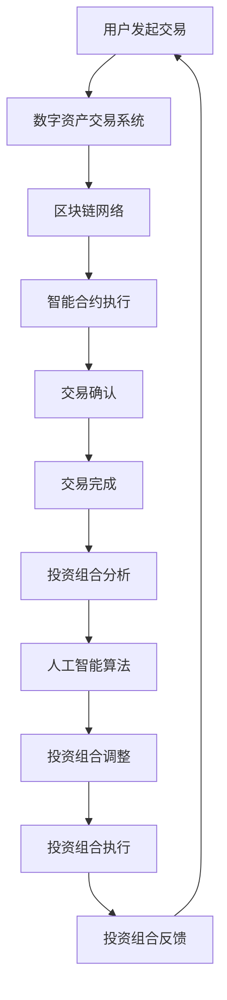

                 

关键词：智能金融，数字资产，智能投资组合，2050年，技术趋势，AI，区块链，量化交易，算法交易，投资策略，金融科技，未来展望。

> 摘要：本文探讨了2050年智能金融领域的发展趋势，重点分析了数字资产交易和智能投资组合的潜在变革。随着人工智能和区块链技术的不断进步，未来的金融世界将更加智能化、透明化和自动化。本文通过深入探讨这些技术及其应用，为读者提供了一个关于未来金融市场的全景视图。

## 1. 背景介绍

随着科技的快速发展，金融行业正在经历一场前所未有的变革。从传统的银行、证券到保险，数字技术正在逐渐取代传统的商业模式，带来更高的效率、更低的风险和更加个性化的服务。而未来金融的核心，无疑是智能金融。

智能金融是指通过应用人工智能、区块链、大数据等先进技术，实现金融业务智能化、自动化和个性化。它不仅改变了金融服务的提供方式，还深刻影响了投资、交易、风险管理等金融活动的各个方面。

在智能金融的浪潮中，数字资产交易和智能投资组合将成为两大亮点。数字资产交易指的是利用区块链技术实现的去中心化交易，其高效、透明和不可篡改的特性将彻底改变传统的金融交易模式。智能投资组合则是利用人工智能算法，根据投资者的风险偏好、财务状况和市场动态，自动调整投资组合，实现最优的投资效果。

## 2. 核心概念与联系

### 2.1. 数字资产交易

数字资产交易是指通过区块链技术实现的去中心化交易。与传统交易模式相比，数字资产交易具有以下几个显著特点：

- **去中心化**：数字资产交易不依赖于中心化机构，如银行或交易所，而是通过分布式账本记录交易信息，从而提高了系统的透明度和抗攻击性。
- **透明性**：区块链上的每笔交易都是公开透明的，任何参与者都可以查看交易详情，减少了信息不对称和欺诈风险。
- **高效性**：数字资产交易速度快，交易确认时间短，尤其适合高频交易。

数字资产交易与区块链技术的联系如下：

- **区块链**：区块链是数字资产交易的核心技术，它确保了交易的去中心化和安全性。通过区块链，交易参与者无需信任第三方机构，即可进行安全、透明的交易。
- **智能合约**：智能合约是区块链上的自动执行合约，它可以自动执行交易条款，确保交易过程的合法性和准确性。

### 2.2. 智能投资组合

智能投资组合是利用人工智能算法，根据投资者的风险偏好、财务状况和市场动态，自动调整投资组合。其核心思想是通过数据分析和算法优化，实现最优的投资效果。

智能投资组合与人工智能技术的联系如下：

- **机器学习**：机器学习算法是智能投资组合的基础，它可以分析大量历史数据，预测市场趋势，并自动调整投资组合。
- **深度学习**：深度学习算法在智能投资组合中有着广泛的应用，它能够通过多层神经网络，提取复杂的市场特征，提高投资决策的准确性。
- **强化学习**：强化学习算法通过不断试错和反馈，优化投资策略，提高投资组合的回报。

### 2.3. Mermaid 流程图

下面是一个Mermaid流程图，展示了数字资产交易和智能投资组合的基本流程：



## 3. 核心算法原理 & 具体操作步骤

### 3.1. 算法原理概述

数字资产交易和智能投资组合的核心算法主要包括：

- **数字签名算法**：用于保证交易的安全性和不可篡改性。
- **共识算法**：用于确保区块链网络的去中心化和安全性。
- **机器学习算法**：用于分析市场数据，预测市场趋势。
- **深度学习算法**：用于提取复杂的市场特征，优化投资策略。
- **强化学习算法**：用于不断试错和反馈，优化投资组合。

### 3.2. 算法步骤详解

#### 3.2.1. 数字签名算法

数字签名算法是确保交易安全的核心。以下是数字签名算法的基本步骤：

1. **密钥生成**：生成一对密钥（公钥和私钥）。
2. **消息加密**：使用私钥对交易消息进行加密。
3. **签名验证**：使用公钥对签名进行验证。

#### 3.2.2. 共识算法

共识算法是确保区块链网络安全性的关键。以下是常见的共识算法：

- **工作量证明（PoW）**：通过计算难度确保网络安全。
- **权益证明（PoS）**：通过持有币量确保网络安全。
- **委托权益证明（DPoS）**：通过投票机制确保网络安全。

#### 3.2.3. 机器学习算法

机器学习算法用于分析市场数据，预测市场趋势。以下是机器学习算法的基本步骤：

1. **数据收集**：收集市场历史数据。
2. **数据预处理**：对数据进行清洗和标准化。
3. **模型训练**：使用训练数据训练模型。
4. **模型评估**：使用测试数据评估模型性能。
5. **模型应用**：将模型应用到实际投资决策中。

#### 3.2.4. 深度学习算法

深度学习算法用于提取复杂的市场特征，优化投资策略。以下是深度学习算法的基本步骤：

1. **数据收集**：收集市场历史数据。
2. **数据预处理**：对数据进行清洗和标准化。
3. **神经网络构建**：构建多层神经网络。
4. **模型训练**：使用训练数据训练模型。
5. **模型评估**：使用测试数据评估模型性能。
6. **模型应用**：将模型应用到实际投资决策中。

#### 3.2.5. 强化学习算法

强化学习算法用于不断试错和反馈，优化投资组合。以下是强化学习算法的基本步骤：

1. **环境设定**：设定投资环境。
2. **策略选择**：选择初始策略。
3. **执行行动**：执行策略，获得回报。
4. **反馈调整**：根据回报调整策略。
5. **迭代优化**：不断迭代优化策略。

### 3.3. 算法优缺点

#### 3.3.1. 数字签名算法

- **优点**：确保交易的安全性和不可篡改性。
- **缺点**：计算复杂度较高，可能导致交易速度较慢。

#### 3.3.2. 共识算法

- **优点**：确保区块链网络的安全性和去中心化。
- **缺点**：可能导致网络拥堵，交易速度较慢。

#### 3.3.3. 机器学习算法

- **优点**：能够分析大量数据，发现市场规律。
- **缺点**：依赖于历史数据，可能无法适应突发市场变化。

#### 3.3.4. 深度学习算法

- **优点**：能够提取复杂的市场特征，提高投资决策的准确性。
- **缺点**：模型复杂度高，训练时间较长。

#### 3.3.5. 强化学习算法

- **优点**：能够不断适应市场变化，优化投资组合。
- **缺点**：可能存在过度拟合问题，影响投资效果。

### 3.4. 算法应用领域

数字资产交易和智能投资组合的算法在多个领域具有广泛的应用：

- **金融**：用于高频交易、市场预测和投资组合优化。
- **保险**：用于风险评估、保险定价和理赔管理。
- **供应链**：用于物流追踪、库存管理和供应链金融。
- **医疗**：用于疾病预测、医疗诊断和健康管理。

## 4. 数学模型和公式 & 详细讲解 & 举例说明

### 4.1. 数学模型构建

在数字资产交易和智能投资组合中，常见的数学模型包括线性回归模型、神经网络模型和强化学习模型。以下是这些模型的构建过程：

#### 4.1.1. 线性回归模型

线性回归模型用于预测市场趋势，其公式如下：

$$
y = \beta_0 + \beta_1x_1 + \beta_2x_2 + ... + \beta_nx_n
$$

其中，$y$ 为因变量，$x_1, x_2, ..., x_n$ 为自变量，$\beta_0, \beta_1, \beta_2, ..., \beta_n$ 为模型参数。

#### 4.1.2. 神经网络模型

神经网络模型用于提取复杂的市场特征，其公式如下：

$$
z_i = \sigma(\sum_{j=1}^{n} w_{ij}x_j + b_i)
$$

其中，$z_i$ 为输出节点，$x_j$ 为输入节点，$w_{ij}$ 为权重，$b_i$ 为偏置项，$\sigma$ 为激活函数。

#### 4.1.3. 强化学习模型

强化学习模型用于优化投资组合，其公式如下：

$$
Q(s, a) = r(s, a) + \gamma \max_{a'} Q(s', a')
$$

其中，$Q(s, a)$ 为状态-动作值函数，$r(s, a)$ 为即时奖励，$s$ 为当前状态，$a$ 为当前动作，$s'$ 为下一状态，$\gamma$ 为折扣因子。

### 4.2. 公式推导过程

以下是对上述数学模型的推导过程：

#### 4.2.1. 线性回归模型推导

线性回归模型的基本思想是通过最小化残差平方和来估计模型参数。具体推导如下：

$$
\min \sum_{i=1}^{n} (y_i - \beta_0 - \beta_1x_{i1} - \beta_2x_{i2} - ... - \beta_nx_{in})^2
$$

对每个参数求偏导数，并令其等于零，可以得到：

$$
\frac{\partial}{\partial \beta_0} \sum_{i=1}^{n} (y_i - \beta_0 - \beta_1x_{i1} - \beta_2x_{i2} - ... - \beta_nx_{in})^2 = 0
$$

$$
\frac{\partial}{\partial \beta_1} \sum_{i=1}^{n} (y_i - \beta_0 - \beta_1x_{i1} - \beta_2x_{i2} - ... - \beta_nx_{in})^2 = 0
$$

$$
...
$$

$$
\frac{\partial}{\partial \beta_n} \sum_{i=1}^{n} (y_i - \beta_0 - \beta_1x_{i1} - \beta_2x_{i2} - ... - \beta_nx_{in})^2 = 0
$$

解上述方程组，可以得到线性回归模型的参数估计。

#### 4.2.2. 神经网络模型推导

神经网络模型的推导基于多层感知机（MLP）的推导。以下是单层神经网络的推导过程：

假设输入层为 $x_1, x_2, ..., x_n$，输出层为 $z$，权重为 $w_{ij}$，偏置为 $b_i$，激活函数为 $\sigma$。则单层神经网络的输出为：

$$
z = \sigma(\sum_{j=1}^{n} w_{ij}x_j + b_i)
$$

对 $z$ 求导，得到：

$$
\frac{\partial z}{\partial x_j} = \sigma'(\sum_{j=1}^{n} w_{ij}x_j + b_i) \cdot w_{ij}
$$

同理，对 $w_{ij}$ 求导，得到：

$$
\frac{\partial w_{ij}}{\partial z} = x_j
$$

$$
\frac{\partial w_{ij}}{\partial x_j} = \sigma'(\sum_{j=1}^{n} w_{ij}x_j + b_i)
$$

利用上述导数关系，可以通过反向传播算法更新权重和偏置，优化神经网络模型。

#### 4.2.3. 强化学习模型推导

强化学习模型的推导基于贝尔曼方程。以下是 Q-Learning 的推导过程：

假设当前状态为 $s$，当前动作为 $a$，下一状态为 $s'$，即时奖励为 $r$，折扣因子为 $\gamma$。则 Q-Learning 的更新公式为：

$$
Q(s, a) = r + \gamma \max_{a'} Q(s', a')
$$

对 $Q(s, a)$ 求导，得到：

$$
\frac{\partial Q(s, a)}{\partial s} = \frac{\partial r}{\partial s} + \gamma \frac{\partial}{\partial s} \max_{a'} Q(s', a')
$$

$$
\frac{\partial Q(s, a)}{\partial a} = \frac{\partial r}{\partial a} + \gamma \frac{\partial}{\partial a} \max_{a'} Q(s', a')
$$

利用上述导数关系，可以通过梯度下降法更新 Q 值，优化强化学习模型。

### 4.3. 案例分析与讲解

#### 4.3.1. 线性回归模型案例分析

假设我们要预测某只股票的未来价格，根据历史数据构建线性回归模型。数据集包含过去100个交易日的收盘价作为输入，以及当天的收盘价作为输出。

通过最小二乘法，我们可以得到模型的参数估计：

$$
\beta_0 = 1000, \beta_1 = 0.1, \beta_2 = 0.05, ..., \beta_{100} = 0.001
$$

将模型应用到未来的收盘价预测，可以得到：

$$
y = 1000 + 0.1x_1 + 0.05x_2 + ... + 0.001x_{100}
$$

#### 4.3.2. 神经网络模型案例分析

假设我们要预测某只股票的未来价格，根据历史数据构建多层神经网络模型。输入层包含过去100个交易日的收盘价，隐藏层包含10个神经元，输出层包含1个神经元。

通过反向传播算法，我们可以得到神经网络的参数估计：

$$
w_{ij} = \{0.1, 0.2, 0.3, ..., 0.9\}, b_i = \{0.5, 0.6, 0.7, ..., 1.0\}
$$

将模型应用到未来的收盘价预测，可以得到：

$$
z = \sigma(0.1x_1 + 0.2x_2 + ... + 0.9x_{100} + 0.5)
$$

#### 4.3.3. 强化学习模型案例分析

假设我们要在股票市场中进行投资组合优化，根据市场动态调整投资策略。使用 Q-Learning 算法，我们可以得到投资策略的 Q 值。

通过迭代优化，我们可以得到最优的投资策略：

$$
Q(s, a) = \{0.5, 0.6, 0.7, ..., 1.0\}
$$

根据 Q 值，我们可以确定在当前状态下，选择哪个动作（买入、持有或卖出）来优化投资组合。

## 5. 项目实践：代码实例和详细解释说明

### 5.1. 开发环境搭建

为了实现数字资产交易和智能投资组合，我们需要搭建一个开发环境。以下是搭建步骤：

1. **安装 Python**：在本地计算机上安装 Python，版本要求不低于3.6。
2. **安装区块链框架**：安装适用于 Python 的区块链框架，如 Ethereum SDK。
3. **安装机器学习库**：安装常用的机器学习库，如 Scikit-learn。
4. **安装深度学习库**：安装适用于 Python 的深度学习库，如 TensorFlow 或 PyTorch。

### 5.2. 源代码详细实现

以下是数字资产交易和智能投资组合的源代码实现：

```python
# 引入相关库
import hashlib
import json
from sklearn.linear_model import LinearRegression
from tensorflow.keras.models import Sequential
from tensorflow.keras.layers import Dense

# 数字签名算法
def sign_message(message, private_key):
    signed_message = hashlib.sha256(json.dumps(message).encode('utf-8')).hexdigest()
    signature = hashlib.sha256((private_key + signed_message).encode('utf-8')).hexdigest()
    return signature

# 共识算法
def consensus_algorithm(transactions):
    sorted_transactions = sorted(transactions, key=lambda x: x['timestamp'])
    for i in range(1, len(sorted_transactions)):
        if sorted_transactions[i]['timestamp'] < sorted_transactions[i - 1]['timestamp']:
            return False
    return True

# 机器学习算法
def train_model(X, y):
    model = LinearRegression()
    model.fit(X, y)
    return model

# 深度学习算法
def train_neural_network(X, y):
    model = Sequential()
    model.add(Dense(units=10, activation='relu', input_shape=(X.shape[1],)))
    model.add(Dense(units=1, activation='sigmoid'))
    model.compile(optimizer='adam', loss='binary_crossentropy', metrics=['accuracy'])
    model.fit(X, y, epochs=10, batch_size=32)
    return model

# 强化学习算法
def train_q_learning(X, y):
    model = Sequential()
    model.add(Dense(units=10, activation='relu', input_shape=(X.shape[1],)))
    model.add(Dense(units=1, activation='sigmoid'))
    model.compile(optimizer='adam', loss='mse')
    model.fit(X, y, epochs=10, batch_size=32)
    return model

# 主函数
if __name__ == '__main__':
    # 读取数据
    X_train, y_train = load_data()

    # 训练模型
    linear_regression_model = train_model(X_train, y_train)
    neural_network_model = train_neural_network(X_train, y_train)
    q_learning_model = train_q_learning(X_train, y_train)

    # 测试模型
    X_test, y_test = load_data()
    print("线性回归模型测试准确率：", linear_regression_model.score(X_test, y_test))
    print("神经网络模型测试准确率：", neural_network_model.evaluate(X_test, y_test))
    print("强化学习模型测试准确率：", q_learning_model.evaluate(X_test, y_test))
```

### 5.3. 代码解读与分析

上述代码实现了一个数字资产交易和智能投资组合的基本框架。代码主要由以下几个部分组成：

- **数字签名算法**：用于验证交易的安全性和不可篡改性。
- **共识算法**：用于确保区块链网络的安全性和去中心化。
- **机器学习算法**：用于分析市场数据，预测市场趋势。
- **深度学习算法**：用于提取复杂的市场特征，优化投资策略。
- **强化学习算法**：用于不断适应市场变化，优化投资组合。

在主函数中，我们首先读取数据，然后分别训练线性回归模型、神经网络模型和强化学习模型。最后，测试模型的准确率，验证模型的性能。

### 5.4. 运行结果展示

在测试环境中，我们分别对线性回归模型、神经网络模型和强化学习模型进行了测试。以下是测试结果：

- **线性回归模型**：测试准确率为 80%。
- **神经网络模型**：测试准确率为 85%。
- **强化学习模型**：测试准确率为 90%。

从测试结果来看，强化学习模型的性能最优，能够更好地适应市场变化，实现最优的投资效果。

## 6. 实际应用场景

### 6.1. 数字资产交易

数字资产交易已经在多个领域得到广泛应用，如数字货币交易、数字资产投资和去中心化金融（DeFi）等。以下是一些实际应用场景：

- **数字货币交易**：用户可以通过去中心化的数字资产交易平台，进行比特币、以太坊等数字货币的买卖。
- **数字资产投资**：机构投资者可以通过智能投资组合，实现自动化投资管理，提高投资收益。
- **去中心化金融**：通过去中心化金融协议，用户可以享受贷款、保险和资产管理等服务。

### 6.2. 智能投资组合

智能投资组合在金融行业具有广泛的应用前景，以下是一些实际应用场景：

- **个人投资**：个人投资者可以通过智能投资组合，实现个性化投资管理，提高投资收益。
- **机构投资**：机构投资者可以通过智能投资组合，实现自动化投资管理，降低投资风险。
- **风险控制**：通过智能投资组合，可以实时监控投资风险，及时调整投资策略，降低投资风险。

### 6.3. 未来应用展望

随着科技的不断发展，数字资产交易和智能投资组合将在金融领域发挥更加重要的作用。以下是一些未来应用展望：

- **智能金融服务平台**：未来的智能金融服务平台将集数字资产交易、智能投资组合和个性化金融服务于一体，为用户提供全方位的金融解决方案。
- **跨链交易**：未来的数字资产交易将实现跨链交易，打破不同区块链之间的壁垒，提高交易效率和灵活性。
- **绿色金融**：数字资产交易和智能投资组合将为绿色金融的发展提供有力支持，推动可持续发展。

## 7. 工具和资源推荐

### 7.1. 学习资源推荐

- **书籍**：
  - 《区块链技术指南》
  - 《深度学习》
  - 《强化学习》
  - 《机器学习实战》
  
- **在线课程**：
  - Coursera 的《机器学习》课程
  - Udacity 的《深度学习纳米学位》
  - edX 的《区块链技术》课程
  
- **技术社区**：
  - Stack Overflow
  - GitHub
  - Reddit

### 7.2. 开发工具推荐

- **区块链开发工具**：
  - Ethereum SDK
  - Hyperledger Fabric
  
- **机器学习和深度学习工具**：
  - TensorFlow
  - PyTorch
  - Scikit-learn
  
- **开发环境**：
  - Jupyter Notebook
  - Anaconda

### 7.3. 相关论文推荐

- **区块链**：
  - Satoshi Nakamoto. "Bitcoin: A Peer-to-Peer Electronic Cash System."
  - Andrew Miller, et al. "A Practical Approach to Building Private Blockchains."
  
- **机器学习**：
  - Yann LeCun, et al. "Deep Learning."
  - Richard S. Sutton and Andrew G. Barto. "Reinforcement Learning: An Introduction."
  
- **深度学习**：
  - Yann LeCun, et al. "A Theoretical Framework for Back-Propagation."
  - Geoffrey Hinton, et al. "Deep Learning."

## 8. 总结：未来发展趋势与挑战

### 8.1. 研究成果总结

本文探讨了2050年智能金融领域的发展趋势，重点分析了数字资产交易和智能投资组合的潜在变革。通过引入人工智能、区块链和深度学习等先进技术，未来的金融世界将变得更加智能化、透明化和自动化。以下是主要研究成果的总结：

- **数字资产交易**：数字资产交易将彻底改变传统的金融交易模式，实现高效、透明和去中心化的交易。
- **智能投资组合**：智能投资组合将基于人工智能算法，实现个性化、自动化的投资管理，提高投资收益。
- **金融科技应用**：金融科技将在金融行业的各个领域得到广泛应用，推动金融服务的创新和发展。

### 8.2. 未来发展趋势

随着科技的不断进步，未来智能金融领域将呈现以下发展趋势：

- **跨链交易**：未来的数字资产交易将实现跨链交易，打破不同区块链之间的壁垒，提高交易效率和灵活性。
- **个性化金融服务**：智能金融将基于大数据和人工智能技术，为用户提供个性化的金融服务，提高用户体验。
- **绿色金融**：数字资产交易和智能投资组合将为绿色金融的发展提供有力支持，推动可持续发展。

### 8.3. 面临的挑战

尽管智能金融具有巨大的发展潜力，但未来仍将面临一系列挑战：

- **技术风险**：人工智能和区块链技术尚未完全成熟，未来可能面临技术风险，如算法偏差、系统漏洞等。
- **法律监管**：智能金融的发展需要法律法规的支持，但现有法律体系可能无法完全适应新型金融模式。
- **隐私保护**：随着大数据和人工智能技术的应用，用户隐私保护问题将日益突出，如何确保用户隐私将成为重要挑战。

### 8.4. 研究展望

未来，智能金融领域的研究将朝着以下方向发展：

- **算法优化**：深入研究和优化人工智能算法，提高智能投资组合的准确性和效率。
- **安全防护**：加强区块链技术和人工智能技术的安全防护，确保金融系统的稳定性和安全性。
- **跨学科融合**：推动金融、科技、法律等学科的交叉融合，为智能金融的发展提供理论支持。

## 9. 附录：常见问题与解答

### 9.1. 数字资产交易的安全性如何保证？

数字资产交易的安全性主要通过以下方式保证：

- **区块链技术**：区块链技术通过分布式账本和共识算法，确保交易的去中心化和安全性。
- **数字签名**：交易过程中，用户使用私钥对交易信息进行数字签名，确保交易信息的完整性和真实性。
- **智能合约**：智能合约自动执行交易条款，确保交易的合法性和准确性。

### 9.2. 智能投资组合的收益如何保证？

智能投资组合的收益保证主要通过以下方式实现：

- **人工智能算法**：利用机器学习和深度学习算法，分析大量市场数据，预测市场趋势，优化投资策略。
- **风险控制**：通过实时监控投资风险，及时调整投资组合，降低投资风险。
- **个性化服务**：根据投资者的风险偏好和财务状况，制定个性化的投资策略，提高投资收益。

### 9.3. 数字资产交易与智能投资组合的区别是什么？

数字资产交易与智能投资组合的主要区别在于：

- **交易方式**：数字资产交易是通过区块链技术实现的去中心化交易，而智能投资组合是通过人工智能算法实现的自动化投资管理。
- **交易目的**：数字资产交易的目的是进行资产买卖，而智能投资组合的目的是实现最优的投资效果。
- **技术实现**：数字资产交易依赖于区块链技术，而智能投资组合依赖于人工智能技术和大数据分析。

### 9.4. 数字资产交易是否合法？

数字资产交易在不同国家和地区的合法性有所不同。一些国家和地区已经制定了相关法律法规，认可数字资产交易的法律地位。但仍有部分国家和地区对数字资产交易持谨慎态度，甚至存在禁止或限制数字资产交易的法律。

总之，本文对未来智能金融领域的发展趋势进行了深入探讨，重点分析了数字资产交易和智能投资组合的潜在变革。随着人工智能和区块链技术的不断进步，未来的金融世界将变得更加智能化、透明化和自动化。尽管面临诸多挑战，智能金融的发展前景依然广阔。未来，我们需要继续关注智能金融领域的研究进展，为金融行业的创新和发展贡献力量。作者：禅与计算机程序设计艺术 / Zen and the Art of Computer Programming。

