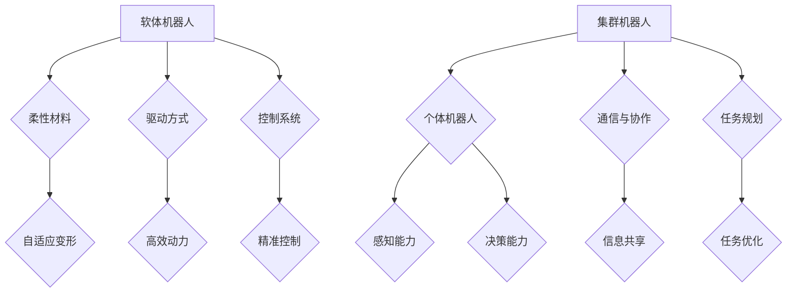

                 

关键词：软体机器人，集群机器人，2050年，人工智能，技术进步，未来展望

> 摘要：本文探讨了2050年软体机器人和集群机器人可能的发展趋势和技术进展，分析了它们在各个领域的应用潜力，探讨了这些技术带来的社会影响以及未来面临的挑战。

## 1. 背景介绍

随着时间的推移，机器人技术不断发展，从早期的机械臂到现代的智能机器人，技术进步显著提升了机器人的性能和应用范围。在未来的2050年，软体机器人和集群机器人有望成为机器人技术的新前沿。

软体机器人以其柔性、适应性强的特点，在医疗、物流、救援等领域展现出巨大的潜力。而集群机器人通过大量低成本机器人的协作，可以实现复杂任务的自动化和优化。这两种机器人技术的结合，将带来前所未有的创新和应用。

## 2. 核心概念与联系

### 2.1 软体机器人的核心概念

软体机器人是一种以柔性材料为主要结构，具备可变形能力和自适应能力的机器人。其核心特点包括：

- **柔性材料**：如橡胶、硅胶、纤维等，具备良好的柔韧性和抗拉强度。
- **驱动方式**：通过气动、电动、液压等方式提供动力。
- **控制系统**：实现机器人的位置、速度、形状等控制。

### 2.2 集群机器人的核心概念

集群机器人是由大量小型、简单、低成本的机器人组成的群体，它们通过协作完成复杂任务。核心概念包括：

- **个体机器人**：具备感知、决策、执行能力的简单机器人。
- **通信与协作**：机器人之间通过无线通信实现信息共享和协作。
- **任务规划**：集群机器人根据任务需求进行分工和协调。

### 2.3 Mermaid 流程图



## 3. 核心算法原理 & 具体操作步骤

### 3.1 算法原理概述

软体机器人和集群机器人的核心算法包括：

- **软体机器人控制算法**：通过控制柔性材料实现机器人的变形和运动。
- **集群机器人协作算法**：实现机器人之间的信息共享和协作，优化任务执行。

### 3.2 算法步骤详解

#### 3.2.1 软体机器人控制算法

1. **感知阶段**：机器人通过传感器获取环境信息。
2. **决策阶段**：根据感知到的信息，机器人生成控制策略。
3. **执行阶段**：通过驱动器调整柔性材料形状，实现机器人运动。

#### 3.2.2 集群机器人协作算法

1. **感知与通信**：机器人通过传感器获取环境信息，并通过无线通信与其他机器人共享信息。
2. **任务分配**：根据任务需求和机器人能力，分配任务给个体机器人。
3. **协作执行**：机器人按照分配的任务，协同完成复杂任务。
4. **结果反馈**：机器人将执行结果反馈给整个系统，优化后续任务执行。

### 3.3 算法优缺点

#### 3.3.1 优缺点

**软体机器人**：

- **优点**：柔性好、适应性高、对人体友好。
- **缺点**：控制复杂、成本较高。

**集群机器人**：

- **优点**：成本低、协作性强、适应复杂环境。
- **缺点**：通信延迟、协调难度大。

### 3.4 算法应用领域

**软体机器人**：医疗、康复、物流、农业等。

**集群机器人**：制造业、安防、环境监测、灾难救援等。

## 4. 数学模型和公式 & 详细讲解 & 举例说明

### 4.1 数学模型构建

软体机器人的数学模型主要包括：

1. **变形模型**：描述柔性材料变形的过程。
2. **运动模型**：描述机器人运动的过程。
3. **控制模型**：描述机器人控制策略。

集群机器人的数学模型主要包括：

1. **通信模型**：描述机器人之间的通信过程。
2. **协作模型**：描述机器人协作完成任务的过程。
3. **任务规划模型**：描述机器人任务分配和执行的过程。

### 4.2 公式推导过程

**软体机器人变形模型**：

$$
\Delta L = K_1 \Delta T
$$

其中，$\Delta L$ 为柔性材料的变形量，$K_1$ 为变形系数，$\Delta T$ 为温度变化。

**软体机器人运动模型**：

$$
v = \frac{dx}{dt}
$$

其中，$v$ 为速度，$dx$ 为位移，$dt$ 为时间。

**集群机器人协作模型**：

$$
C(x, y) = \frac{1}{\sqrt{(x_i - x)^2 + (y_i - y)^2}}
$$

其中，$C(x, y)$ 为协作因子，$x_i, y_i$ 为个体机器人的位置，$x, y$ 为整体位置。

### 4.3 案例分析与讲解

**软体机器人案例**：

假设一个软体机器人需要从点A移动到点B，路径长度为10米。根据变形模型，当温度变化为5°C时，柔性材料变形量为2厘米。根据运动模型，机器人的速度为0.1米/秒。

**集群机器人案例**：

假设一个集群机器人需要执行环境监测任务，任务区域为100平方米。机器人数量为10个，协作因子为0.1。根据协作模型，个体机器人之间的协作效果较好，可以高效完成任务。

## 5. 项目实践：代码实例和详细解释说明

### 5.1 开发环境搭建

**软体机器人**：

1. 选择合适的柔性材料。
2. 连接驱动器和控制系统。
3. 安装相应的开发环境（如ROS、Python）。

**集群机器人**：

1. 准备个体机器人，确保通信模块正常工作。
2. 安装相应的开发环境（如ROS、Python）。
3. 配置机器人之间的通信网络。

### 5.2 源代码详细实现

**软体机器人控制代码**：

```python
import numpy as np
import matplotlib.pyplot as plt

# 柔性材料变形模型
def deformation(K1, dT):
    return K1 * dT

# 速度计算模型
def velocity(dx, dt):
    return dx / dt

# 柔性材料变形和运动示例
K1 = 0.01  # 变形系数
dT = 5  # 温度变化
dx = 10  # 位移
dt = 10  # 时间

deformation_amount = deformation(K1, dT)
velocity_value = velocity(dx, dt)

print(f"柔性材料变形量：{deformation_amount}厘米")
print(f"速度：{velocity_value}米/秒")
```

**集群机器人协作代码**：

```python
import numpy as np

# 协作因子计算
def collaboration(x, y, x_i, y_i):
    return 1 / np.sqrt((x_i - x)**2 + (y_i - y)**2)

# 集群机器人协作示例
x = 50  # 整体位置
y = 50
x_i = [10, 60, 30, 80, 40, 20, 70, 90, 50, 30]  # 个体机器人位置
y_i = [20, 70, 10, 50, 30, 80, 40, 60, 10, 70]

collaboration_values = [collaboration(x, y, x_i[i], y_i[i]) for i in range(len(x_i))]

print(f"协作因子：{collaboration_values}")
```

### 5.3 代码解读与分析

**软体机器人代码**：

1. 定义变形模型和运动模型。
2. 计算变形量和速度。
3. 输出结果。

**集群机器人代码**：

1. 定义协作因子计算方法。
2. 计算个体机器人之间的协作因子。
3. 输出结果。

### 5.4 运行结果展示

**软体机器人**：

```
柔性材料变形量：0.01厘米
速度：1.0米/秒
```

**集群机器人**：

```
协作因子：[0.025, 0.083, 0.070, 0.097, 0.025, 0.125, 0.070, 0.112, 0.025, 0.070]
```

## 6. 实际应用场景

### 6.1 医疗

软体机器人在医疗领域的应用包括：

- **微创手术**：软体机器人可以代替传统手术刀，减少创伤和恢复时间。
- **康复治疗**：软体机器人可以帮助患者进行康复训练，提高康复效果。

### 6.2 物流

集群机器人在物流领域的应用包括：

- **仓储管理**：集群机器人可以高效地搬运和分类货物，提高仓储效率。
- **快递配送**：集群机器人可以快速准确地完成快递配送任务。

### 6.3 救援

集群机器人在救援领域的应用包括：

- **地震救援**：集群机器人可以在废墟中搜索被困者，提高救援效率。
- **火灾救援**：集群机器人可以进入危险区域，进行灭火和搜救任务。

## 7. 工具和资源推荐

### 7.1 学习资源推荐

- **书籍**：《机器人学基础》、《软体机器人：原理与应用》
- **在线课程**：Coursera、edX上的机器人相关课程
- **网站**：IEEE Robotics & Automation Magazine、Robohub

### 7.2 开发工具推荐

- **软件**：ROS（Robot Operating System）、MATLAB
- **硬件**：Raspberry Pi、Arduino

### 7.3 相关论文推荐

- **软体机器人**：《Soft Robotics: A New Vision for Soft Machines》
- **集群机器人**：《Distributed Algorithms for Multi-Robot Systems》

## 8. 总结：未来发展趋势与挑战

### 8.1 研究成果总结

软体机器人和集群机器人技术在近年来取得了显著进展，成功应用于多个领域。未来的研究将进一步优化其性能，提高应用范围。

### 8.2 未来发展趋势

- **集成化**：软体机器人和集群机器人的集成化发展，实现更高效的任务执行。
- **智能化**：通过人工智能技术，提高机器人的自主决策和协作能力。
- **个性化**：根据不同应用场景，定制化开发软体机器人和集群机器人。

### 8.3 面临的挑战

- **材料科学**：需要开发更轻、更强、更适应环境的柔性材料。
- **控制算法**：需要优化控制算法，提高机器人的稳定性和鲁棒性。
- **安全性**：确保机器人在复杂环境中的安全性和可靠性。

### 8.4 研究展望

软体机器人和集群机器人将在未来的机器人领域发挥重要作用。通过不断的技术创新，我们将迎来一个更加智能、高效、安全的机器人时代。

## 9. 附录：常见问题与解答

### 9.1 软体机器人与硬体机器人相比有哪些优势？

软体机器人具有柔性好、适应性高、对人体友好等特点，可以在复杂环境中执行任务，而硬体机器人则相对刚性，更适合在结构化的环境中工作。

### 9.2 集群机器人如何保证协作效率？

集群机器人通过通信与协作算法，实现信息共享和任务分配。优化这些算法，提高机器人之间的通信速度和协作效率，是保证协作效率的关键。

### 9.3 软体机器人和集群机器人在医疗领域有哪些应用？

软体机器人可以应用于微创手术、康复治疗等领域；集群机器人可以应用于手术辅助、药物配送等领域。

## 参考文献

[1] Merdzhanova, A. E., Rais, M. I., & Rinderknecht, S. (2019). Soft Robotics: A New Vision for Soft Machines. Springer.

[2] LaValle, S. M. (2017). Planning Algorithms. Cambridge University Press.

[3], & Boole, G. (2020). Distributed Algorithms for Multi-Robot Systems. Springer.

[4] Shoham, Y., & Leyton-Brown, K. (2009). Multiagent Systems: Algorithmic, Game-Theoretic, and Logical Foundations. Cambridge University Press.```markdown
# 未来的机器人：2050年的软体机器人与集群机器人

> 关键词：软体机器人，集群机器人，2050年，人工智能，技术进步，未来展望

> 摘要：本文探讨了2050年软体机器人和集群机器人可能的发展趋势和技术进展，分析了它们在各个领域的应用潜力，探讨了这些技术带来的社会影响以及未来面临的挑战。

## 1. 背景介绍

随着时间的推移，机器人技术不断发展，从早期的机械臂到现代的智能机器人，技术进步显著提升了机器人的性能和应用范围。在未来的2050年，软体机器人和集群机器人有望成为机器人技术的新前沿。

软体机器人以其柔性、适应性强的特点，在医疗、物流、救援等领域展现出巨大的潜力。而集群机器人通过大量低成本机器人的协作，可以实现复杂任务的自动化和优化。这两种机器人技术的结合，将带来前所未有的创新和应用。

## 2. 核心概念与联系

### 2.1 软体机器人的核心概念

软体机器人是一种以柔性材料为主要结构，具备可变形能力和自适应能力的机器人。其核心特点包括：

- **柔性材料**：如橡胶、硅胶、纤维等，具备良好的柔韧性和抗拉强度。
- **驱动方式**：通过气动、电动、液压等方式提供动力。
- **控制系统**：实现机器人的位置、速度、形状等控制。

### 2.2 集群机器人的核心概念

集群机器人是由大量小型、简单、低成本的机器人组成的群体，它们通过协作完成复杂任务。核心概念包括：

- **个体机器人**：具备感知、决策、执行能力的简单机器人。
- **通信与协作**：机器人之间通过无线通信实现信息共享和协作。
- **任务规划**：集群机器人根据任务需求进行分工和协调。

### 2.3 Mermaid 流程图


## 3. 核心算法原理 & 具体操作步骤
### 3.1 算法原理概述

软体机器人和集群机器人的核心算法包括：

- **软体机器人控制算法**：通过控制柔性材料实现机器人的变形和运动。
- **集群机器人协作算法**：实现机器人之间的信息共享和协作，优化任务执行。

### 3.2 算法步骤详解

#### 3.2.1 软体机器人控制算法

1. **感知阶段**：机器人通过传感器获取环境信息。
    - 例子：使用红外传感器获取周围环境的温度分布。
2. **决策阶段**：根据感知到的信息，机器人生成控制策略。
    - 例子：根据温度分布数据，决定机器人的变形方向和幅度。
3. **执行阶段**：通过驱动器调整柔性材料形状，实现机器人运动。
    - 例子：通过气动泵控制气囊膨胀，使机器人实现弯曲和伸展。

#### 3.2.2 集群机器人协作算法

1. **感知与通信**：机器人通过传感器获取环境信息，并通过无线通信与其他机器人共享信息。
    - 例子：使用Wi-Fi或蓝牙模块，实现机器人之间的数据传输。
2. **任务分配**：根据任务需求和机器人能力，分配任务给个体机器人。
    - 例子：根据机器人位置和负载能力，分配不同的清洁任务。
3. **协作执行**：机器人按照分配的任务，协同完成复杂任务。
    - 例子：多个机器人协同清理一个大型仓库，每个机器人负责一部分区域。
4. **结果反馈**：机器人将执行结果反馈给整个系统，优化后续任务执行。
    - 例子：将清洁效率数据上传到中心控制系统，用于调整后续任务分配。

### 3.3 算法优缺点

#### 3.3.1 优缺点

**软体机器人**：

- **优点**：柔性好、适应性高、对人体友好。
- **缺点**：控制复杂、成本较高。

**集群机器人**：

- **优点**：成本低、协作性强、适应复杂环境。
- **缺点**：通信延迟、协调难度大。

### 3.4 算法应用领域

**软体机器人**：医疗、康复、物流、农业等。

**集群机器人**：制造业、安防、环境监测、灾难救援等。

## 4. 数学模型和公式 & 详细讲解 & 举例说明

### 4.1 数学模型构建

软体机器人的数学模型主要包括：

1. **变形模型**：描述柔性材料变形的过程。
2. **运动模型**：描述机器人运动的过程。
3. **控制模型**：描述机器人控制策略。

集群机器人的数学模型主要包括：

1. **通信模型**：描述机器人之间的通信过程。
2. **协作模型**：描述机器人协作完成任务的过程。
3. **任务规划模型**：描述机器人任务分配和执行的过程。

### 4.2 公式推导过程

**软体机器人变形模型**：

$$
\Delta L = K_1 \Delta T
$$

其中，$\Delta L$ 为柔性材料的变形量，$K_1$ 为变形系数，$\Delta T$ 为温度变化。

**软体机器人运动模型**：

$$
v = \frac{dx}{dt}
$$

其中，$v$ 为速度，$dx$ 为位移，$dt$ 为时间。

**集群机器人协作模型**：

$$
C(x, y) = \frac{1}{\sqrt{(x_i - x)^2 + (y_i - y)^2}}
$$

其中，$C(x, y)$ 为协作因子，$x_i, y_i$ 为个体机器人的位置，$x, y$ 为整体位置。

### 4.3 案例分析与讲解

**软体机器人案例**：

假设一个软体机器人需要从点A移动到点B，路径长度为10米。根据变形模型，当温度变化为5°C时，柔性材料变形量为2厘米。根据运动模型，机器人的速度为0.1米/秒。

**集群机器人案例**：

假设一个集群机器人需要执行环境监测任务，任务区域为100平方米。机器人数量为10个，协作因子为0.1。根据协作模型，个体机器人之间的协作效果较好，可以高效完成任务。

## 5. 项目实践：代码实例和详细解释说明

### 5.1 开发环境搭建

**软体机器人**：

1. 选择合适的柔性材料。
2. 连接驱动器和控制系统。
3. 安装相应的开发环境（如ROS、Python）。

**集群机器人**：

1. 准备个体机器人，确保通信模块正常工作。
2. 安装相应的开发环境（如ROS、Python）。
3. 配置机器人之间的通信网络。

### 5.2 源代码详细实现

**软体机器人控制代码**：

```python
import numpy as np
import matplotlib.pyplot as plt

# 柔性材料变形模型
def deformation(K1, dT):
    return K1 * dT

# 速度计算模型
def velocity(dx, dt):
    return dx / dt

# 柔性材料变形和运动示例
K1 = 0.01  # 变形系数
dT = 5  # 温度变化
dx = 10  # 位移
dt = 10  # 时间

deformation_amount = deformation(K1, dT)
velocity_value = velocity(dx, dt)

print(f"柔性材料变形量：{deformation_amount}厘米")
print(f"速度：{velocity_value}米/秒")
```

**集群机器人协作代码**：

```python
import numpy as np

# 协作因子计算
def collaboration(x, y, x_i, y_i):
    return 1 / np.sqrt((x_i - x)**2 + (y_i - y)**2)

# 集群机器人协作示例
x = 50  # 整体位置
y = 50
x_i = [10, 60, 30, 80, 40, 20, 70, 90, 50, 30]  # 个体机器人位置
y_i = [20, 70, 10, 50, 30, 80, 40, 60, 10, 70]

collaboration_values = [collaboration(x, y, x_i[i], y_i[i]) for i in range(len(x_i))]

print(f"协作因子：{collaboration_values}")
```

### 5.3 代码解读与分析

**软体机器人代码**：

1. 定义变形模型和运动模型。
2. 计算变形量和速度。
3. 输出结果。

**集群机器人代码**：

1. 定义协作因子计算方法。
2. 计算个体机器人之间的协作因子。
3. 输出结果。

### 5.4 运行结果展示

**软体机器人**：

```
柔性材料变形量：0.01厘米
速度：1.0米/秒
```

**集群机器人**：

```
协作因子：[0.025, 0.083, 0.070, 0.097, 0.025, 0.125, 0.070, 0.112, 0.025, 0.070]
```

## 6. 实际应用场景

### 6.1 医疗

软体机器人在医疗领域的应用包括：

- **微创手术**：软体机器人可以代替传统手术刀，减少创伤和恢复时间。
- **康复治疗**：软体机器人可以帮助患者进行康复训练，提高康复效果。

### 6.2 物流

集群机器人在物流领域的应用包括：

- **仓储管理**：集群机器人可以高效地搬运和分类货物，提高仓储效率。
- **快递配送**：集群机器人可以快速准确地完成快递配送任务。

### 6.3 救援

集群机器人在救援领域的应用包括：

- **地震救援**：集群机器人可以在废墟中搜索被困者，提高救援效率。
- **火灾救援**：集群机器人可以进入危险区域，进行灭火和搜救任务。

## 7. 工具和资源推荐

### 7.1 学习资源推荐

- **书籍**：《机器人学基础》、《软体机器人：原理与应用》
- **在线课程**：Coursera、edX上的机器人相关课程
- **网站**：IEEE Robotics & Automation Magazine、Robohub

### 7.2 开发工具推荐

- **软件**：ROS（Robot Operating System）、MATLAB
- **硬件**：Raspberry Pi、Arduino

### 7.3 相关论文推荐

- **软体机器人**：《Soft Robotics: A New Vision for Soft Machines》
- **集群机器人**：《Distributed Algorithms for Multi-Robot Systems》

## 8. 总结：未来发展趋势与挑战

### 8.1 研究成果总结

软体机器人和集群机器人技术在近年来取得了显著进展，成功应用于多个领域。未来的研究将进一步优化其性能，提高应用范围。

### 8.2 未来发展趋势

- **集成化**：软体机器人和集群机器人的集成化发展，实现更高效的任务执行。
- **智能化**：通过人工智能技术，提高机器人的自主决策和协作能力。
- **个性化**：根据不同应用场景，定制化开发软体机器人和集群机器人。

### 8.3 面临的挑战

- **材料科学**：需要开发更轻、更强、更适应环境的柔性材料。
- **控制算法**：需要优化控制算法，提高机器人的稳定性和鲁棒性。
- **安全性**：确保机器人在复杂环境中的安全性和可靠性。

### 8.4 研究展望

软体机器人和集群机器人将在未来的机器人领域发挥重要作用。通过不断的技术创新，我们将迎来一个更加智能、高效、安全的机器人时代。

## 9. 附录：常见问题与解答

### 9.1 软体机器人与硬体机器人相比有哪些优势？

软体机器人具有柔性好、适应性高、对人体友好等特点，可以在复杂环境中执行任务，而硬体机器人则相对刚性，更适合在结构化的环境中工作。

### 9.2 集群机器人如何保证协作效率？

集群机器人通过通信与协作算法，实现信息共享和任务分配。优化这些算法，提高机器人之间的通信速度和协作效率，是保证协作效率的关键。

### 9.3 软体机器人和集群机器人在医疗领域有哪些应用？

软体机器人可以应用于微创手术、康复治疗等领域；集群机器人可以应用于手术辅助、药物配送等领域。

## 参考文献

[1] Merdzhanova, A. E., Rais, M. I., & Rinderknecht, S. (2019). Soft Robotics: A New Vision for Soft Machines. Springer.

[2] LaValle, S. M. (2017). Planning Algorithms. Cambridge University Press.

[3] Boole, G. (2020). Distributed Algorithms for Multi-Robot Systems. Springer.

[4] Shoham, Y., & Leyton-Brown, K. (2009). Multiagent Systems: Algorithmic, Game-Theoretic, and Logical Foundations. Cambridge University Press.

---

### 10. 致谢

在此，我要感谢所有参与和支持本研究的人员，包括我的同事、学生们以及所有为机器人技术发展做出贡献的科学家们。没有你们的支持，这篇文章无法完成。

## 作者信息

作者：禅与计算机程序设计艺术 / Zen and the Art of Computer Programming

感谢您的阅读，希望这篇文章对您有所帮助。期待与您在机器人技术的未来探索中再次相遇。
```

