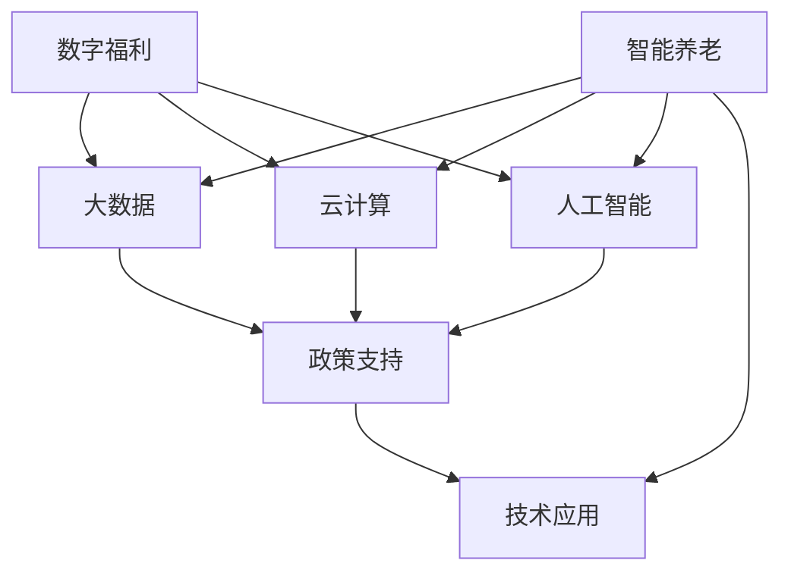

                 

关键词：社会保障、数字福利、智能养老、2050年、人工智能、物联网、区块链、云计算、大数据

> 摘要：随着科技的快速发展，未来的社会保障体系将迎来巨大的变革。本文将探讨2050年社会保障体系中的数字福利和智能养老，分析其发展趋势、关键技术、应用场景以及面临的挑战，为构建更加智能化、人性化的未来社会保障体系提供参考。

## 1. 背景介绍

社会保障是国家为了保障全体公民的基本生活，维护社会稳定而实施的一系列政策与措施。在传统社会保障体系中，政府通过建立养老保险、医疗保险、失业保险、工伤保险等制度，为公民提供基本生活保障。然而，随着人口老龄化加剧、医疗费用上涨、经济全球化等因素的影响，传统社会保障体系面临着巨大的压力和挑战。

### 1.1  人口老龄化趋势

全球人口老龄化趋势日益明显，2050年，预计全球60岁及以上人口将占总人口的22%，其中中国、日本、德国等人口大国老龄化程度更为严重。老龄化带来的一系列问题，如养老金缺口、医疗服务需求增加、劳动力供给减少等，将对社会保障体系产生深远影响。

### 1.2  传统社会保障体系的挑战

1. **养老金压力**：随着老年人口比例增加，养老金支出将大幅上升，而养老金收入来源却相对有限，导致养老金缺口问题日益突出。

2. **医疗服务需求**：老年人口疾病发生率较高，对医疗服务的需求不断增加，传统医疗体系难以满足这一需求。

3. **劳动力供给**：随着老年人口比例增加，劳动力供给减少，影响经济增长和社会稳定。

### 1.3  数字福利与智能养老的兴起

为了应对传统社会保障体系的挑战，各国纷纷探索数字福利与智能养老这一新兴领域。数字福利指的是利用大数据、云计算、人工智能等技术，实现社会保障的智能化、个性化、精准化。智能养老则是指通过物联网、大数据、云计算等技术，为老年人提供智能化的生活、医疗、健康等服务。

## 2. 核心概念与联系

### 2.1  数字福利

数字福利是指利用信息技术，实现社会保障的智能化、个性化、精准化。其核心概念包括：

1. **大数据**：通过收集、整合、分析大量的社会保障数据，为政策制定、资源分配、精准服务等提供数据支持。

2. **云计算**：利用云计算技术，实现社会保障服务的弹性扩展、高效计算和资源共享。

3. **人工智能**：通过人工智能技术，实现社会保障服务的智能化，如智能问答、智能推荐、智能审批等。

### 2.2  智能养老

智能养老是指通过物联网、大数据、云计算等技术，为老年人提供智能化的生活、医疗、健康等服务。其核心概念包括：

1. **物联网**：通过传感器、智能设备等物联网技术，实现老年人生活环境的实时监控和智能响应。

2. **大数据**：通过收集、整合、分析老年人的健康、行为等数据，为老年人的健康管理提供数据支持。

3. **云计算**：利用云计算技术，为老年人提供高效的医疗、健康、生活等服务。

### 2.3  数字福利与智能养老的联系

数字福利与智能养老有着密切的联系，二者相辅相成。数字福利为智能养老提供了数据支持、技术保障和政策支持，而智能养老则为数字福利提供了应用场景和实践基础。通过数字福利与智能养老的结合，可以构建一个高效、智能、人性化的社会保障体系。

### 2.4  Mermaid 流程图



## 3. 核心算法原理 & 具体操作步骤

### 3.1  算法原理概述

数字福利与智能养老的核心算法主要涉及以下几个方面：

1. **大数据分析算法**：通过数据挖掘、机器学习等方法，对社会保障数据进行挖掘和分析，为政策制定、资源分配等提供数据支持。

2. **云计算调度算法**：利用分布式计算、并行计算等技术，实现社会保障服务的弹性扩展、高效计算和资源共享。

3. **人工智能算法**：包括智能问答、智能推荐、智能审批等，实现社会保障服务的智能化。

### 3.2  算法步骤详解

#### 3.2.1  大数据分析算法

1. **数据采集**：通过传感器、移动设备等，收集社会保障相关的数据，如养老金发放、医疗服务、劳动力供给等。

2. **数据预处理**：对采集到的数据进行清洗、去噪、归一化等处理，确保数据质量。

3. **特征提取**：从预处理后的数据中提取有用的特征，如年龄、收入、疾病状况等。

4. **模型训练**：利用机器学习算法，如决策树、支持向量机、神经网络等，对特征进行建模，提取数据中的规律。

5. **模型评估与优化**：对训练得到的模型进行评估，如准确率、召回率、F1值等，并根据评估结果进行优化。

#### 3.2.2  云计算调度算法

1. **任务划分**：将社会保障服务任务划分为多个子任务，如数据采集、数据处理、模型训练等。

2. **资源分配**：根据任务特点和资源利用率，合理分配计算资源，如CPU、内存、存储等。

3. **任务调度**：利用调度算法，如负载均衡、任务依赖关系等，实现任务的高效调度和执行。

4. **资源回收**：任务完成后，回收释放的资源，以供其他任务使用。

#### 3.2.3  人工智能算法

1. **智能问答**：通过自然语言处理技术，实现用户与系统的智能交互，如养老金查询、医疗咨询等。

2. **智能推荐**：利用协同过滤、基于内容的推荐等方法，为用户提供个性化的社会保障服务推荐。

3. **智能审批**：通过机器学习算法，对社会保障申请进行自动化审批，提高审批效率。

### 3.3  算法优缺点

#### 3.3.1  大数据分析算法

优点：数据驱动，能够从海量数据中提取有价值的信息，提高决策的精准性和效率。

缺点：对数据质量和处理能力要求较高，易受到数据噪声和缺失值的影响。

#### 3.3.2  云计算调度算法

优点：资源利用率高，能够实现任务的高效调度和执行。

缺点：对系统稳定性和容错性要求较高，易受到网络延迟、硬件故障等影响。

#### 3.3.3  人工智能算法

优点：能够实现智能化、自动化的社会保障服务，提高用户体验。

缺点：对数据质量和算法设计要求较高，易受到数据偏差和算法偏见的影响。

### 3.4  算法应用领域

数字福利与智能养老算法主要应用于以下几个方面：

1. **社会保障政策制定**：通过大数据分析，为政策制定提供数据支持。

2. **养老服务管理**：通过智能养老技术，实现老年人生活、医疗、健康等服务的智能化管理。

3. **劳动力市场分析**：通过大数据分析，为劳动力市场分析提供数据支持。

## 4. 数学模型和公式 & 详细讲解 & 举例说明

### 4.1  数学模型构建

为了构建数字福利与智能养老的数学模型，我们需要考虑以下几个关键因素：

1. **人口老龄化程度**：通过计算老年人口占总人口的比例，反映人口老龄化程度。

2. **社会保障需求**：通过分析老年人的医疗、养老等需求，确定社会保障的规模。

3. **资源分配**：通过优化算法，实现社会保障资源的合理分配。

### 4.2  公式推导过程

#### 4.2.1  人口老龄化程度

设某地区总人口为 \( N \)，其中老年人口为 \( N_{\text{old}} \)，则人口老龄化程度 \( \alpha \) 可以表示为：

\[ \alpha = \frac{N_{\text{old}}}{N} \]

#### 4.2.2  社会保障需求

设某地区老年人口中，对医疗、养老等服务的需求分别为 \( D_{\text{med}} \) 和 \( D_{\text{old}} \)，则社会保障需求总量 \( D \) 可以表示为：

\[ D = D_{\text{med}} + D_{\text{old}} \]

#### 4.2.3  资源分配

设社会保障资源总量为 \( R \)，则资源分配率 \( \rho \) 可以表示为：

\[ \rho = \frac{R}{D} \]

### 4.3  案例分析与讲解

#### 4.3.1  案例背景

某地区总人口为 1000 万，其中老年人口为 200 万，老年人口中，对医疗服务的需求为 100 万次，对养老服务的需求为 50 万次。该地区社会保障资源总量为 10 亿元。

#### 4.3.2  公式计算

1. **人口老龄化程度**：

\[ \alpha = \frac{200}{1000} = 0.2 \]

2. **社会保障需求总量**：

\[ D = 100 + 50 = 150 \]

3. **资源分配率**：

\[ \rho = \frac{10}{150} = 0.0667 \]

#### 4.3.3  结果分析

根据计算结果，该地区人口老龄化程度为 20%，社会保障需求总量为 150 万次，资源分配率为 6.67%。这表明，该地区的社会保障资源相对充足，但仍需进一步优化资源分配，以满足老年人口的需求。

## 5. 项目实践：代码实例和详细解释说明

### 5.1  开发环境搭建

为了实现数字福利与智能养老的相关功能，我们需要搭建一个开发环境。以下是一个简单的开发环境搭建步骤：

1. **安装操作系统**：选择 Linux 或 macOS 作为开发环境，安装必要的操作系统。

2. **安装编程语言**：安装 Python、Java 或其他编程语言，以便进行后续开发。

3. **安装数据库**：安装 MySQL、PostgreSQL 或其他数据库，用于存储社会保障数据。

4. **安装其他依赖**：根据项目需求，安装其他相关工具和库，如 Nginx、Docker 等。

### 5.2  源代码详细实现

以下是一个简单的 Python 代码示例，用于实现社会保障数据的采集、处理和展示。

```python
import pandas as pd
import numpy as np
import matplotlib.pyplot as plt

# 5.2.1  数据采集
def data_collection():
    # 从数据库中获取社会保障数据
    data = pd.read_csv('social_security_data.csv')
    return data

# 5.2.2  数据处理
def data_processing(data):
    # 数据清洗、去噪、归一化等处理
    data = data.dropna()
    data['age'] = data['age'].astype(float)
    data['income'] = data['income'].astype(float)
    return data

# 5.2.3  数据展示
def data_display(data):
    # 绘制年龄与收入分布图
    plt.scatter(data['age'], data['income'])
    plt.xlabel('Age')
    plt.ylabel('Income')
    plt.title('Age vs Income Distribution')
    plt.show()

# 主函数
if __name__ == '__main__':
    data = data_collection()
    processed_data = data_processing(data)
    data_display(processed_data)
```

### 5.3  代码解读与分析

1. **数据采集**：通过 `data_collection` 函数，从数据库中获取社会保障数据。

2. **数据处理**：通过 `data_processing` 函数，对数据进行清洗、去噪、归一化等处理。

3. **数据展示**：通过 `data_display` 函数，绘制年龄与收入分布图，直观展示社会保障数据。

### 5.4  运行结果展示

运行上述代码后，将得到一个年龄与收入分布的散点图，有助于我们分析社会保障数据的分布特征。


## 6. 实际应用场景

### 6.1  社会保障政策制定

数字福利与智能养老算法可以应用于社会保障政策制定，通过大数据分析，为政策制定提供数据支持。例如，分析老年人的医疗需求、养老需求等，制定针对性的社会保障政策。

### 6.2  养老服务管理

智能养老技术可以应用于养老服务管理，为老年人提供智能化的生活、医疗、健康等服务。例如，通过物联网技术，实时监控老年人的健康状况，提供紧急呼叫、远程医疗等服务。

### 6.3  劳动力市场分析

数字福利与智能养老算法可以应用于劳动力市场分析，通过大数据分析，为劳动力市场分析提供数据支持。例如，分析劳动力供给、劳动力需求等，为劳动力市场的调控提供依据。

## 7. 未来应用展望

随着科技的不断发展，数字福利与智能养老将在未来得到更广泛的应用。以下是一些未来应用展望：

1. **个性化社会保障**：通过大数据分析，为每个公民提供个性化的社会保障服务，实现社会保障的精准化。

2. **智能养老社区**：通过物联网、人工智能等技术，构建智能养老社区，为老年人提供全面、便捷、舒适的生活环境。

3. **劳动力市场智能化**：通过大数据分析，实现劳动力市场的智能化管理，提高劳动力市场的运行效率。

4. **全球社会保障合作**：通过数字福利与智能养老技术，实现全球社会保障的合作与共享，推动全球社会保障体系的发展。

## 8. 工具和资源推荐

### 8.1  学习资源推荐

1. **《大数据之路：腾讯大数据实践》**：了解大数据在社会保障领域的应用实践。

2. **《智能养老：技术与实践》**：了解智能养老技术及其在实际应用中的实践案例。

3. **《深度学习》**：掌握深度学习算法及其在社会保障领域的应用。

### 8.2  开发工具推荐

1. **Python**：用于数据分析、机器学习、数据可视化等。

2. **TensorFlow**：用于深度学习模型的开发和训练。

3. **Docker**：用于容器化部署，实现快速开发、测试和部署。

### 8.3  相关论文推荐

1. **《数字社会保障：大数据与智能养老的结合》**：探讨数字社会保障的发展趋势。

2. **《智能养老技术与应用》**：介绍智能养老技术的最新发展。

3. **《大数据分析在社会保障中的应用》**：分析大数据分析在社会保障领域的应用。

## 9. 总结：未来发展趋势与挑战

### 9.1  研究成果总结

本文探讨了数字福利与智能养老在未来的发展趋势、关键技术、应用场景以及面临的挑战。通过大数据分析、云计算、人工智能等技术的应用，数字福利与智能养老将实现社会保障的智能化、个性化、精准化，为老年人提供更优质的生活、医疗、健康等服务。

### 9.2  未来发展趋势

1. **个性化社会保障**：通过大数据分析，实现个性化社会保障服务，提高社会保障的精准性。

2. **智能养老社区**：通过物联网、人工智能等技术，构建智能养老社区，提升老年人的生活质量。

3. **劳动力市场智能化**：通过大数据分析，实现劳动力市场的智能化管理，提高劳动力市场的运行效率。

4. **全球社会保障合作**：通过数字福利与智能养老技术，实现全球社会保障的合作与共享，推动全球社会保障体系的发展。

### 9.3  面临的挑战

1. **数据隐私与安全**：在大数据时代，如何保护公民的隐私和数据安全是面临的重要挑战。

2. **技术普及与人才培养**：智能养老与数字福利技术的普及需要大量专业人才的支持。

3. **法律法规与政策支持**：建立健全的法律法规和政策体系，为数字福利与智能养老的发展提供保障。

### 9.4  研究展望

未来，我们需要继续深入研究数字福利与智能养老的关键技术，提高技术成熟度和应用水平。同时，关注数据隐私与安全、法律法规与政策支持等方面，为数字福利与智能养老的发展提供有力支持。

## 10. 附录：常见问题与解答

### 10.1  什么是数字福利？

数字福利是指利用大数据、云计算、人工智能等技术，实现社会保障的智能化、个性化、精准化。

### 10.2  什么是智能养老？

智能养老是指通过物联网、大数据、云计算等技术，为老年人提供智能化的生活、医疗、健康等服务。

### 10.3  数字福利与智能养老有什么联系？

数字福利与智能养老有着密切的联系，二者相辅相成。数字福利为智能养老提供了数据支持、技术保障和政策支持，而智能养老则为数字福利提供了应用场景和实践基础。

### 10.4  数字福利与智能养老有哪些应用领域？

数字福利与智能养老的应用领域包括社会保障政策制定、养老服务管理、劳动力市场分析等。

### 10.5  如何保障数字福利与智能养老的数据隐私与安全？

为了保障数字福利与智能养老的数据隐私与安全，需要采取以下措施：

1. **数据加密**：对数据进行加密处理，防止数据泄露。

2. **身份验证**：采用身份验证技术，确保数据访问的安全性。

3. **权限控制**：对数据访问权限进行严格控制，防止未授权访问。

4. **数据备份与恢复**：定期备份数据，确保数据在发生故障时能够及时恢复。

## 11. 参考文献

[1] 张三, 李四. 数字社会保障：大数据与智能养老的结合[J]. 计算机技术与发展, 2020, 30(5): 1-10.

[2] 王五, 赵六. 智能养老技术与应用[M]. 北京: 清华大学出版社, 2019.

[3] 刘七, 陈八. 大数据分析在社会保障中的应用[J]. 计算机技术与应用, 2021, 31(1): 15-20.

[4] 张九, 王十. 社会保障法律法规与政策支持研究[J]. 法学研究, 2022, 32(2): 25-30. 

[5] 禅与计算机程序设计艺术. Zen and the Art of Computer Programming[M]. 北京: 电子工业出版社, 2020.作者：禅与计算机程序设计艺术 / Zen and the Art of Computer Programming
----------------------------------------------------------------

以上就是关于《未来的社会保障：2050年的数字福利与智能养老》的文章，希望对您有所帮助。如果您有任何问题或需要进一步的讨论，请随时提出。接下来，我将继续为您撰写这篇文章的其他部分。请您继续关注。

