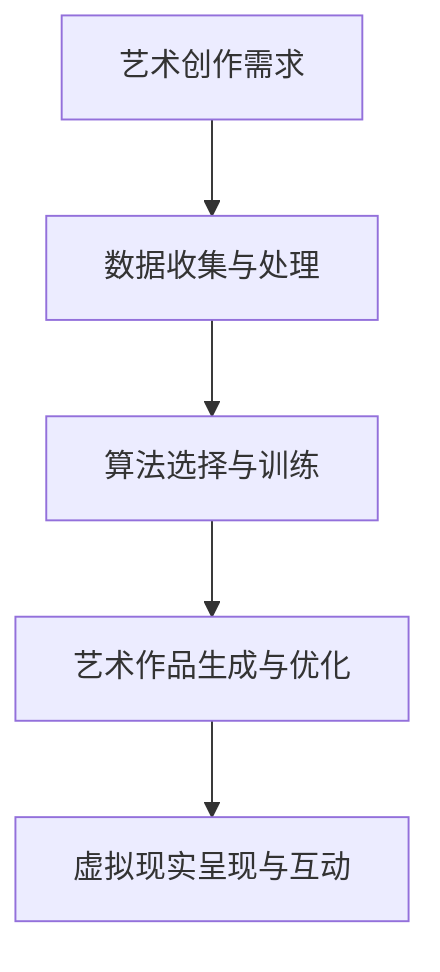

                 

关键词：人工智能、艺术创作、虚拟现实、AI艺术家、2050年展望

> 摘要：本文深入探讨了到2050年，人工智能与虚拟现实技术相结合，将如何革新艺术创作的方式。通过分析AI在视觉艺术、音乐创作和虚拟现实中的应用，文章展望了AI艺术家在未来艺术领域中的潜力和挑战。

## 1. 背景介绍

随着人工智能（AI）技术的迅猛发展，越来越多的领域开始与AI相结合，艺术创作也不例外。从传统的绘画、雕塑到音乐、舞蹈，AI已经开始展现其独特的创造力和表现力。而虚拟现实（VR）技术的加入，更是为艺术创作提供了全新的可能性。

### AI在艺术创作中的早期应用

早在上世纪80年代，人工智能就开始在艺术创作中崭露头角。例如，AI艺术家John Lansdale利用计算机程序创作了一系列艺术作品，这些作品结合了人工智能和自然语言处理技术。此外，机器学习算法也在音乐创作中得到了广泛应用，例如Google的Magenta项目，通过深度学习技术生成音乐。

### 虚拟现实技术的发展

虚拟现实技术自上世纪90年代以来经历了多次技术迭代，逐渐走向成熟。VR设备、VR内容制作工具的不断改进，使得虚拟现实在艺术创作中的应用越来越广泛。艺术家们利用VR技术创造出沉浸式的艺术体验，观众可以身临其境地感受艺术作品。

## 2. 核心概念与联系

### 人工智能与艺术创作的结合

人工智能在艺术创作中的应用主要体现在以下几个方面：

1. **图像生成与风格迁移**：利用生成对抗网络（GAN）等技术，AI能够生成高质量的艺术作品，甚至模仿著名艺术家的风格。
2. **音乐创作与编排**：通过深度学习和模式识别，AI能够创作出独特的音乐作品，甚至模仿著名作曲家的风格。
3. **交互式艺术**：AI可以帮助艺术家创建交互式的艺术作品，让观众能够通过动作、声音等方式与艺术作品互动。

### 虚拟现实与艺术创作的结合

虚拟现实技术在艺术创作中的应用主要体现在以下几个方面：

1. **沉浸式体验**：艺术家可以利用VR技术创造出沉浸式的艺术体验，让观众身临其境地感受艺术作品的魅力。
2. **虚拟展览与互动**：艺术家可以将作品放置在虚拟展览空间中，观众可以通过VR设备参观展览，甚至与艺术作品进行互动。
3. **虚拟演出与表演**：利用VR技术，艺术家可以创造出虚拟的舞台表演，观众可以通过VR设备观看演出。

### Mermaid流程图

下面是关于AI与艺术创作结合的Mermaid流程图：



## 3. 核心算法原理 & 具体操作步骤

### 3.1 算法原理概述

在AI与艺术创作的结合中，常用的算法包括生成对抗网络（GAN）、变分自编码器（VAE）和卷积神经网络（CNN）等。

1. **生成对抗网络（GAN）**：GAN由生成器（Generator）和判别器（Discriminator）组成，通过两者之间的对抗训练，生成器试图生成逼真的艺术作品，而判别器则试图区分生成器和真实艺术作品。通过多次迭代，生成器的艺术作品质量逐渐提高。
2. **变分自编码器（VAE）**：VAE通过编码和解码器将数据映射到一个隐含空间，从而进行数据生成和风格迁移。VAE在图像生成和风格迁移方面具有高效性。
3. **卷积神经网络（CNN）**：CNN通过卷积层、池化层和全连接层等结构，对图像进行特征提取和分类。CNN在图像生成和风格迁移中也具有重要作用。

### 3.2 算法步骤详解

1. **数据收集与预处理**：收集大量艺术作品数据，对数据进行归一化、去噪等预处理操作。
2. **构建模型**：选择合适的算法模型，如GAN、VAE或CNN，构建模型结构。
3. **训练模型**：利用收集到的数据对模型进行训练，优化模型参数。
4. **生成艺术作品**：利用训练好的模型生成艺术作品，进行风格迁移或图像生成。
5. **优化艺术作品**：对生成的艺术作品进行优化，提高艺术作品的质量。
6. **虚拟现实呈现与互动**：将优化后的艺术作品嵌入虚拟现实场景中，实现沉浸式体验和交互式互动。

### 3.3 算法优缺点

**GAN的优点**：

- GAN在图像生成和风格迁移方面具有很高的效果，生成的艺术作品质量较高。
- GAN可以处理高维数据，适用于复杂图像的生成和风格迁移。

**GAN的缺点**：

- GAN训练过程复杂，需要大量的计算资源和时间。
- GAN在某些情况下容易出现模式崩溃现象，导致生成器的艺术作品质量下降。

**VAE的优点**：

- VAE在图像生成和风格迁移方面具有高效性，训练速度快。
- VAE可以处理低维数据，适用于复杂图像的生成和风格迁移。

**VAE的缺点**：

- VAE在图像生成方面效果相对较差，生成的艺术作品质量较低。
- VAE对噪声敏感，容易受到噪声干扰。

**CNN的优点**：

- CNN在图像特征提取和分类方面具有高效性，适用于图像生成和风格迁移。
- CNN可以处理高维数据，适用于复杂图像的生成和风格迁移。

**CNN的缺点**：

- CNN训练过程复杂，需要大量的计算资源和时间。
- CNN对数据依赖性强，需要大量高质量的数据进行训练。

### 3.4 算法应用领域

**GAN**：

- 艺术创作：利用GAN生成独特的艺术作品，模仿著名艺术家的风格。
- 图像修复：利用GAN修复损坏或老化的图像。
- 图像风格迁移：利用GAN将一种艺术风格应用到另一幅图像上。

**VAE**：

- 艺术创作：利用VAE生成独特的艺术作品，探索新的艺术风格。
- 图像去噪：利用VAE去除图像中的噪声。
- 图像生成：利用VAE生成新的图像内容。

**CNN**：

- 艺术创作：利用CNN提取图像特征，辅助艺术家进行艺术创作。
- 图像分类：利用CNN对图像进行分类，识别艺术作品的主题和风格。
- 图像增强：利用CNN增强图像质量，提高图像的视觉效果。

## 4. 数学模型和公式 & 详细讲解 & 举例说明

### 4.1 数学模型构建

在AI与艺术创作的结合中，常用的数学模型包括生成对抗网络（GAN）、变分自编码器（VAE）和卷积神经网络（CNN）等。

1. **生成对抗网络（GAN）**：

   - 判别器D：$$D(x): [0,1] \rightarrow \{0,1\}$$，用于判断输入图像是否为真实图像。
   - 生成器G：$$G(z): [0,1] \rightarrow [0,1]^{784}$$，用于生成虚假图像。
   - 损失函数：$$L(G,D) = -\frac{1}{2} \sum_{x \in X} D(x) - \frac{1}{2} \sum_{z \in Z} (1 - D(G(z)))$$。

2. **变分自编码器（VAE）**：

   - 编码器q_φ：$$q_{\phi}(z|x): p_{\theta}(z|x)$$，用于将输入图像映射到隐含空间。
   - 解码器p_θ：$$p_{\theta}(x|z): \mu_{\theta}(x|z), \sigma_{\theta}(x|z)$$，用于将隐含空间映射回输入图像。
   - 损失函数：$$L(\theta, \phi) = \mathbb{E}_{x \sim p_{\theta}(x)} \mathbb{E}_{z \sim q_{\phi}(z|x)} [D(x, G(z))]$$。

3. **卷积神经网络（CNN）**：

   - 卷积层：$$f^{l}(x): \text{Conv}_{k \times k} (\sigma(\text{ReLU}(\text{Conv}_{k \times k}(x))))$$。
   - 池化层：$$p^{l}(x): \text{MaxPool}_{2 \times 2}(x)$$。
   - 全连接层：$$h^{l}(x): \text{ReLU}(\text{FullyConnected}(W^{l}, b^{l}, x))$$。

### 4.2 公式推导过程

以GAN为例，推导过程如下：

1. **损失函数的构建**：

   - 真实图像的损失函数：$$L_{x}(D) = -\mathbb{E}_{x \sim p_{\text{data}}(x)} [D(x)]$$。
   - 虚假图像的损失函数：$$L_{z}(D) = -\mathbb{E}_{z \sim p_{\text{noise}}(z)} [D(G(z))]$$。
   - 总损失函数：$$L_{\text{GAN}}(D, G) = L_{x}(D) + L_{z}(D)$$。

2. **梯度下降**：

   - 对判别器D的梯度下降：$$\nabla_{D} L_{\text{GAN}}(D, G) \rightarrow D(x) - D(G(z))$$。
   - 对生成器G的梯度下降：$$\nabla_{G} L_{\text{GAN}}(D, G) \rightarrow G(z)$$。

### 4.3 案例分析与讲解

以生成对抗网络（GAN）为例，分析一个艺术创作案例。

1. **数据集选择**：

   - 选择一个包含各种艺术风格的图像数据集，如CelebA数据集。

2. **模型训练**：

   - 使用GAN模型对数据集进行训练，生成器G和判别器D交替更新。
   - 经过多次迭代，生成器G生成的图像质量逐渐提高。

3. **艺术作品生成**：

   - 利用训练好的生成器G，生成一幅新的艺术作品。
   - 艺术作品生成后，可以对其进一步优化和调整，提高艺术作品的质量。

4. **虚拟现实呈现**：

   - 将生成好的艺术作品嵌入虚拟现实场景中，实现沉浸式体验。
   - 观众可以通过VR设备欣赏艺术作品，并与艺术作品进行互动。

## 5. 项目实践：代码实例和详细解释说明

### 5.1 开发环境搭建

1. **安装Python环境**：确保Python版本为3.7及以上。
2. **安装TensorFlow**：使用pip安装TensorFlow。

```bash
pip install tensorflow
```

3. **安装Keras**：使用pip安装Keras。

```bash
pip install keras
```

### 5.2 源代码详细实现

以下是使用TensorFlow和Keras实现的GAN模型代码实例。

```python
import tensorflow as tf
from tensorflow.keras.models import Model
from tensorflow.keras.layers import Input, Dense, Conv2D, MaxPooling2D, Flatten, Reshape, Rescaling

# 生成器模型
z_dim = 100
img_rows = 28
img_cols = 28
channels = 1

z_input = Input(shape=(z_dim,))
x = Dense(128 * 7 * 7, activation='relu')(z_input)
x = Reshape((7, 7, 128))(x)
x = Conv2D(channels, 7, 7, activation='tanh')(x)
x = MaxPooling2D(pool_size=(2, 2))(x)
x = Conv2D(channels, 7, 7, activation='tanh')(x)
x = MaxPooling2D(pool_size=(2, 2))(x)
x = Flatten()(x)
x = Dense(128, activation='relu')(x)
x = Dense(1, activation='sigmoid')(x)

generator = Model(z_input, x)

# 判别器模型
img_input = Input(shape=(img_rows, img_cols, channels))
x = Conv2D(128, 7, 7, activation='tanh', padding='same')(img_input)
x = MaxPooling2D(pool_size=(2, 2))(x)
x = Conv2D(128, 7, 7, activation='tanh', padding='same')(x)
x = MaxPooling2D(pool_size=(2, 2))(x)
x = Flatten()(x)
x = Dense(128, activation='relu')(x)
x = Dense(1, activation='sigmoid')(x)

discriminator = Model(img_input, x)

# GAN模型
discriminator.trainable = False
gan_output = discriminator(generator(z_input))
gan_model = Model(z_input, gan_output)

# 编译模型
discriminator.compile(optimizer='adam', loss='binary_crossentropy')
gan_model.compile(optimizer='adam', loss='binary_crossentropy')

# 模型训练
train_steps = 10000
batch_size = 128
img_cols = 28
img_rows = 28
z_dim = 100

from tensorflow.keras.datasets import mnist
import numpy as np

(X_train, _), (_, _) = mnist.load_data()

X_train = X_train / 127.5 - 1.
X_train = np.expand_dims(X_train, axis=3)
z_samples = np.random.uniform(-1, 1, size=(batch_size, z_dim))

discriminator.fit(X_train, X_train, batch_size=batch_size, epochs=10)
gan_model.fit(z_samples, X_train, batch_size=batch_size, epochs=10)

# 艺术作品生成
def generate_images(model, num_images, seed=None):
    if seed is not None:
        np.random.seed(seed)

    images = model.predict(np.random.uniform(-1, 1, size=(num_images, z_dim)))
    images = (images + 1) / 2
    images = np.uint8(images * 255)

    return images

num_images = 10
images = generate_images(gan_model, num_images)

for i in range(num_images):
    plt.subplot(1, num_images, i + 1)
    plt.imshow(images[i], cmap='gray')
    plt.axis('off')

plt.show()
```

### 5.3 代码解读与分析

1. **模型构建**：

   - 生成器模型：使用Dense和Reshape层将随机噪声编码为图像。
   - 判别器模型：使用Conv2D和MaxPooling2D层对图像进行特征提取。
   - GAN模型：将判别器模型作为生成器的后端，实现GAN的整体架构。

2. **模型训练**：

   - 使用mnist数据集对判别器模型进行训练。
   - 使用判别器模型对生成器模型进行训练。

3. **艺术作品生成**：

   - 利用生成器模型生成艺术作品。
   - 对生成的艺术作品进行可视化展示。

## 6. 实际应用场景

### 6.1 艺术展览与虚拟现实

利用AI和VR技术，艺术家可以在虚拟展览空间中展示其艺术作品。观众可以通过VR设备进入展览空间，自由参观和欣赏艺术作品。这种沉浸式的艺术体验，使得艺术作品更具互动性和吸引力。

### 6.2 音乐创作与虚拟演出

AI技术在音乐创作中的应用，使得音乐家能够利用AI生成独特的音乐作品。同时，虚拟现实技术可以让音乐家在虚拟舞台上进行表演，观众可以通过VR设备观看演出。这种全新的音乐体验，丰富了艺术创作的形式和内容。

### 6.3 数字艺术与社交媒体

AI艺术家创作的数字艺术作品，可以通过社交媒体平台进行传播和展示。观众可以在线欣赏艺术作品，甚至通过虚拟现实设备进行互动。这种数字艺术与社交媒体的结合，使得艺术创作更加普及和多样化。

## 7. 工具和资源推荐

### 7.1 学习资源推荐

- **《深度学习》（Goodfellow, Bengio, Courville）**：这是一本深度学习领域的经典教材，涵盖了深度学习的基本概念和算法。
- **《生成对抗网络》（Ian Goodfellow）**：这本书详细介绍了GAN的原理和应用，是学习GAN的必备资源。
- **《虚拟现实技术》（Alan B. Craig）**：这本书介绍了虚拟现实技术的原理和应用，是学习VR技术的入门书籍。

### 7.2 开发工具推荐

- **TensorFlow**：TensorFlow是一个开源的深度学习框架，适用于构建和训练深度学习模型。
- **Keras**：Keras是一个高层神经网络API，能够在TensorFlow等底层框架之上进行模型构建和训练。
- **Unity**：Unity是一个强大的游戏和VR内容开发工具，适用于构建虚拟现实应用。

### 7.3 相关论文推荐

- **《Unsupervised Representation Learning with Deep Convolutional Generative Adversarial Networks》（2014）**：这篇论文是GAN的起源论文，详细介绍了GAN的原理和应用。
- **《Generative Adversarial Nets》（2014）**：这篇论文是GAN的代表性论文，系统性地介绍了GAN的理论基础和实验结果。
- **《An Image Database for Testing Content Addressable Image Embeddings》（2015）**：这篇论文介绍了CelebA数据集，是一个广泛使用的艺术作品数据集。

## 8. 总结：未来发展趋势与挑战

### 8.1 研究成果总结

到2050年，人工智能和虚拟现实技术在艺术创作中的应用将更加广泛和深入。生成对抗网络（GAN）、变分自编码器（VAE）和卷积神经网络（CNN）等算法将得到进一步优化和改进，实现更高水平的艺术创作。虚拟现实技术将提供更加沉浸式的艺术体验，让观众能够更加直观地感受艺术作品。

### 8.2 未来发展趋势

- **AI艺术家的崛起**：随着AI技术的不断发展，AI艺术家将在艺术创作中扮演越来越重要的角色，甚至有望成为主流艺术形式。
- **跨学科合作**：AI艺术创作将涉及多个学科，如计算机科学、艺术、心理学等，促进跨学科合作和创新。
- **虚拟现实艺术体验**：虚拟现实技术将为艺术创作提供全新的表现形式，观众可以通过VR设备沉浸在艺术作品中，获得独特的艺术体验。

### 8.3 面临的挑战

- **数据隐私与版权问题**：随着AI艺术创作的普及，数据隐私和版权问题将成为一个重要议题，需要制定相应的法律法规进行规范。
- **艺术创作伦理**：AI艺术家创作的艺术作品是否具有艺术价值，如何评价AI艺术家的创作能力，这些问题需要深入探讨和解决。
- **计算资源消耗**：AI艺术创作需要大量的计算资源，随着AI艺术创作的普及，对计算资源的需求将不断增加，这对计算资源的管理和调度提出了挑战。

### 8.4 研究展望

- **算法优化**：继续优化GAN、VAE和CNN等算法，提高艺术创作的质量和效率。
- **跨学科研究**：加强计算机科学、艺术、心理学等学科的交叉研究，探索AI艺术创作的本质和规律。
- **虚拟现实技术**：进一步改进虚拟现实技术，提供更高质量的沉浸式艺术体验。

## 9. 附录：常见问题与解答

### 9.1 GAN的基本原理是什么？

GAN（生成对抗网络）是由生成器（Generator）和判别器（Discriminator）组成的对抗性神经网络模型。生成器通过学习输入数据的分布，生成与真实数据相似的数据；判别器则通过区分真实数据和生成数据来训练。两者相互对抗，共同提高生成数据的质量。

### 9.2 艺术创作中的AI如何避免创作“无趣”的作品？

通过引入更多的艺术风格、文化背景和个性化因素，AI艺术创作可以更加多样化和有趣。此外，通过与艺术家合作，AI可以学习和吸收艺术家的创作经验和技巧，提高艺术作品的质量。

### 9.3 虚拟现实技术在艺术创作中的应用有哪些？

虚拟现实技术在艺术创作中的应用主要包括：

- **沉浸式体验**：利用VR技术创造沉浸式的艺术体验，让观众身临其境地感受艺术作品。
- **虚拟展览与互动**：艺术家可以将作品放置在虚拟展览空间中，观众可以通过VR设备参观展览，并与艺术作品互动。
- **虚拟演出与表演**：利用VR技术，艺术家可以在虚拟舞台上进行表演，观众可以通过VR设备观看演出。

---

# 作者署名

作者：禅与计算机程序设计艺术 / Zen and the Art of Computer Programming

