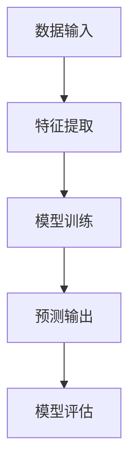
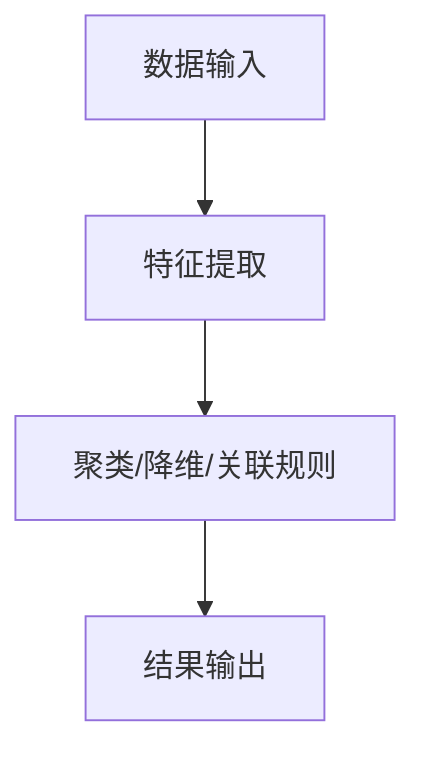
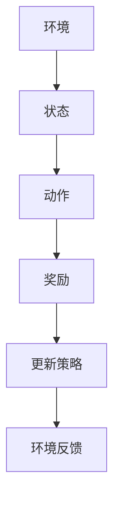
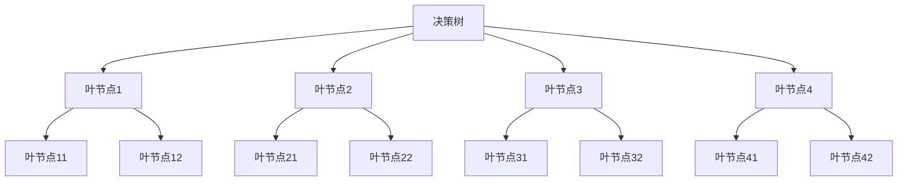

                 

关键词：机器学习，机器学习原理，机器学习算法，机器学习代码实例，深度学习，神经网络，监督学习，无监督学习，强化学习，自然语言处理，计算机视觉

> 摘要：本文将从机器学习的核心概念、算法原理、数学模型到实际项目实践进行深入讲解，帮助读者全面了解并掌握机器学习的技术与应用。通过代码实例，读者将能够直观地理解算法的实现细节，从而为未来的研究与应用奠定坚实的基础。

## 1. 背景介绍

随着互联网和大数据技术的发展，机器学习作为人工智能的核心技术，已经成为现代科技领域的热点。机器学习使计算机能够通过数据自动改进性能，无需显式编程指令。它广泛应用于图像识别、语音识别、自然语言处理、推荐系统、自动驾驶等领域，为人们的生活和工作带来了巨大变革。

机器学习可以分为三大类：监督学习、无监督学习和强化学习。监督学习从标记数据中学习，目标是预测未知数据的标签；无监督学习从未标记数据中学习，旨在发现数据中的内在结构和模式；强化学习通过与环境的交互，学习如何做出最佳决策。

本文将详细介绍机器学习的核心概念与联系，通过具体算法原理与代码实例，帮助读者深入理解机器学习的本质与应用。

## 2. 核心概念与联系

### 2.1 监督学习（Supervised Learning）

监督学习是一种从标记数据中学习的方法，其目标是建立一个模型，使得模型对未知数据的预测与真实标签尽可能接近。

**核心概念：**

- 特征（Feature）：描述数据的属性。
- 标签（Label）：真实标签或目标值。
- 模型（Model）：基于特征和标签训练得到的函数。

**算法分类：**

- 线性模型（如线性回归、逻辑回归）
- 树模型（如决策树、随机森林）
- 聚类模型（如K-均值、层次聚类）
- 支持向量机（SVM）
- 神经网络

**架构图：**



### 2.2 无监督学习（Unsupervised Learning）

无监督学习从未标记数据中学习，主要任务包括聚类、降维和关联规则学习等。

**核心概念：**

- 聚类（Clustering）：将数据划分为若干个群组，使得同组数据之间的相似度较大，不同组数据之间的相似度较小。
- 降维（Dimensionality Reduction）：通过投影或变换，将高维数据映射到低维空间，以降低计算复杂度。
- 关联规则学习（Association Rule Learning）：发现数据项之间潜在的关联性，用于市场篮子分析等。

**算法分类：**

- 聚类算法（如K-均值、层次聚类）
- 降维算法（如主成分分析、t-SNE）
- 关联规则学习算法（如Apriori算法、Eclat算法）

**架构图：**



### 2.3 强化学习（Reinforcement Learning）

强化学习通过与环境的交互，学习如何做出最佳决策，以最大化累积奖励。

**核心概念：**

- 状态（State）：系统当前所处的环境描述。
- 动作（Action）：系统可以采取的行为。
- 奖励（Reward）：对系统行为的即时反馈。
- 策略（Policy）：系统采取的动作规则。

**算法分类：**

- Q-Learning
- Sarsa
- Deep Q-Network（DQN）
- Policy Gradient

**架构图：**



## 3. 核心算法原理 & 具体操作步骤

### 3.1 算法原理概述

本节将介绍三种主要的机器学习算法：线性回归、决策树和K-均值聚类。分别从原理、步骤和应用领域进行详细解释。

#### 3.1.1 线性回归

线性回归是一种简单的监督学习算法，用于预测连续值。其原理基于线性函数，通过最小化误差平方和来确定模型的参数。

**原理：**

线性回归模型可以表示为：
\[ y = \beta_0 + \beta_1x \]

其中，\( y \) 是预测值，\( x \) 是特征，\( \beta_0 \) 和 \( \beta_1 \) 是模型参数。

**步骤：**

1. 数据预处理：对特征和目标值进行标准化处理，以消除不同特征之间的尺度差异。
2. 模型训练：使用最小二乘法或梯度下降法计算模型参数。
3. 模型评估：使用均方误差（MSE）或均方根误差（RMSE）评估模型性能。
4. 预测：使用训练好的模型对未知数据进行预测。

**应用领域：**

线性回归广泛应用于回归分析、金融预测、股票市场分析等领域。

#### 3.1.2 决策树

决策树是一种流行的分类算法，通过递归地将数据划分为若干个子集，以构建一棵树形结构。

**原理：**

决策树基于信息增益或基尼不纯度来选择最佳特征进行划分。

**步骤：**

1. 特征选择：计算各个特征的信息增益或基尼不纯度，选择最大者作为划分特征。
2. 划分数据：根据最佳特征将数据划分为若干个子集。
3. 递归构建：对每个子集重复步骤1和2，直至达到停止条件（如最小叶节点数、最大深度等）。
4. 叶节点预测：在叶节点处进行分类预测。

**应用领域：**

决策树广泛应用于数据挖掘、分类问题、风险评估等领域。

#### 3.1.3 K-均值聚类

K-均值聚类是一种简单的无监督学习算法，用于将数据划分为K个聚类。

**原理：**

K-均值聚类基于最小化聚类中心与数据点之间的距离平方和。

**步骤：**

1. 初始聚类中心：随机选择K个数据点作为初始聚类中心。
2. 赋值：将每个数据点分配给最近的聚类中心。
3. 更新聚类中心：计算每个聚类的中心点。
4. 重复步骤2和3，直至聚类中心不再变化。

**应用领域：**

K-均值聚类广泛应用于图像处理、社交网络分析、文本分类等领域。

### 3.2 算法步骤详解

#### 3.2.1 线性回归步骤详解

1. 数据预处理：
\[ x_{\text{标准化}} = \frac{x_{\text{原始}} - \mu}{\sigma} \]
\[ y_{\text{标准化}} = \frac{y_{\text{原始}} - \mu}{\sigma} \]

2. 模型训练：

使用最小二乘法：
\[ \beta_0 = \bar{y} - \beta_1\bar{x} \]
\[ \beta_1 = \frac{\sum_{i=1}^{n}(x_i - \bar{x})(y_i - \bar{y})}{\sum_{i=1}^{n}(x_i - \bar{x})^2} \]

使用梯度下降法：
\[ \beta_0 = \beta_0 - \alpha \frac{\partial}{\partial \beta_0}J(\beta_0, \beta_1) \]
\[ \beta_1 = \beta_1 - \alpha \frac{\partial}{\partial \beta_1}J(\beta_0, \beta_1) \]

其中，\( J(\beta_0, \beta_1) = \sum_{i=1}^{n}(y_i - (\beta_0 + \beta_1x_i))^2 \)。

3. 模型评估：

均方误差（MSE）：
\[ MSE = \frac{1}{n}\sum_{i=1}^{n}(y_i - (\beta_0 + \beta_1x_i))^2 \]

均方根误差（RMSE）：
\[ RMSE = \sqrt{MSE} \]

4. 预测：

\[ y_{\text{预测}} = \beta_0 + \beta_1x_{\text{标准化}} \]

#### 3.2.2 决策树步骤详解

1. 特征选择：
\[ IG(D, A) = \sum_{v \in V} p(v|D) \cdot \sum_{x \in X} p(x|v, D) \cdot \log_2 p(x|v, D) \]
\[ Gini(D, A) = 1 - \sum_{v \in V} p(v|D) \cdot \sum_{x \in X} p(x|v, D) \]

2. 划分数据：
\[ D_v = \{x \in D | x \in A = v\} \]

3. 递归构建：
\[ D_{\text{新}} = \{x \in D | x \notin D_v, v \in V\} \]
如果 \( D_{\text{新}} \) 不再可划分，则停止递归。

4. 叶节点预测：
\[ y = \text{大多数}(\{y | x \in D_v\}) \]

#### 3.2.3 K-均值聚类步骤详解

1. 初始聚类中心：
\[ \text{随机选择} K \text{个数据点作为初始聚类中心} \]

2. 赋值：
\[ c_k = \arg\min_{c} \sum_{x \in S_k} \|x - c\|^2 \]

3. 更新聚类中心：
\[ \mu_k = \frac{1}{|S_k|} \sum_{x \in S_k} x \]

4. 重复步骤2和3，直至聚类中心不再变化。

### 3.3 算法优缺点

#### 3.3.1 线性回归

**优点：**
- 简单易懂，易于实现；
- 对线性关系有较好的拟合效果；
- 可解释性强。

**缺点：**
- 对非线性关系拟合能力较差；
- 对异常值敏感；
- 无法处理多分类问题。

#### 3.3.2 决策树

**优点：**
- 易于理解，可解释性强；
- 对非线性关系有一定的拟合能力；
- 可处理多分类问题。

**缺点：**
- 可能产生过拟合；
- 预测速度较慢；
- 对噪声敏感。

#### 3.3.3 K-均值聚类

**优点：**
- 算法简单，易于实现；
- 运算速度快，适合大规模数据处理；
- 对聚类数目敏感。

**缺点：**
- 可能收敛到局部最优；
- 对噪声敏感；
- 对初始聚类中心选择敏感。

### 3.4 算法应用领域

- 线性回归：回归分析、金融预测、股票市场分析等；
- 决策树：数据挖掘、分类问题、风险评估等；
- K-均值聚类：图像处理、社交网络分析、文本分类等。

## 4. 数学模型和公式 & 详细讲解 & 举例说明

### 4.1 数学模型构建

在本节中，我们将介绍线性回归、决策树和K-均值聚类的主要数学模型。

#### 4.1.1 线性回归

线性回归模型的一般形式为：
\[ y = \beta_0 + \beta_1x + \epsilon \]

其中，\( y \) 是预测值，\( x \) 是特征，\( \beta_0 \) 和 \( \beta_1 \) 是模型参数，\( \epsilon \) 是误差项。

#### 4.1.2 决策树

决策树的构建过程可以用信息增益或基尼不纯度来度量。

信息增益（IG）：
\[ IG(D, A) = \sum_{v \in V} p(v|D) \cdot \sum_{x \in X} p(x|v, D) \cdot \log_2 p(x|v, D) \]

基尼不纯度（Gini）：
\[ Gini(D, A) = 1 - \sum_{v \in V} p(v|D) \cdot \sum_{x \in X} p(x|v, D) \]

#### 4.1.3 K-均值聚类

K-均值聚类的主要数学模型为：
\[ c_k = \arg\min_{c} \sum_{x \in S_k} \|x - c\|^2 \]

### 4.2 公式推导过程

在本节中，我们将详细推导线性回归、决策树和K-均值聚类的主要公式。

#### 4.2.1 线性回归

使用最小二乘法推导线性回归公式：

假设有 \( n \) 个数据点 \( (x_i, y_i) \)，线性回归模型为：
\[ y = \beta_0 + \beta_1x + \epsilon \]

最小化误差平方和：
\[ J(\beta_0, \beta_1) = \sum_{i=1}^{n}(y_i - (\beta_0 + \beta_1x_i))^2 \]

对 \( \beta_0 \) 和 \( \beta_1 \) 求偏导：
\[ \frac{\partial J}{\partial \beta_0} = -2\sum_{i=1}^{n}(y_i - (\beta_0 + \beta_1x_i)) = 0 \]
\[ \frac{\partial J}{\partial \beta_1} = -2\sum_{i=1}^{n}(x_i - \beta_1)(y_i - (\beta_0 + \beta_1x_i)) = 0 \]

解得：
\[ \beta_0 = \bar{y} - \beta_1\bar{x} \]
\[ \beta_1 = \frac{\sum_{i=1}^{n}(x_i - \bar{x})(y_i - \bar{y})}{\sum_{i=1}^{n}(x_i - \bar{x})^2} \]

使用梯度下降法推导线性回归公式：

假设有 \( n \) 个数据点 \( (x_i, y_i) \)，线性回归模型为：
\[ y = \beta_0 + \beta_1x + \epsilon \]

损失函数为：
\[ J(\beta_0, \beta_1) = \sum_{i=1}^{n}(y_i - (\beta_0 + \beta_1x_i))^2 \]

梯度下降更新公式为：
\[ \beta_0 = \beta_0 - \alpha \frac{\partial}{\partial \beta_0}J(\beta_0, \beta_1) \]
\[ \beta_1 = \beta_1 - \alpha \frac{\partial}{\partial \beta_1}J(\beta_0, \beta_1) \]

其中，\( \alpha \) 是学习率。

#### 4.2.2 决策树

使用信息增益推导决策树公式：

假设有 \( n \) 个数据点 \( (x_i, y_i) \)，特征 \( A \) 有 \( V \) 个取值 \( v \)。

信息增益（IG）：
\[ IG(D, A) = \sum_{v \in V} p(v|D) \cdot \sum_{x \in X} p(x|v, D) \cdot \log_2 p(x|v, D) \]

其中，\( D \) 是原始数据集，\( A \) 是特征，\( V \) 是特征取值集合，\( X \) 是特征 \( A \) 的取值集合。

#### 4.2.3 K-均值聚类

使用距离公式推导K-均值聚类公式：

假设有 \( n \) 个数据点 \( x_1, x_2, ..., x_n \)，聚类中心为 \( c_1, c_2, ..., c_K \)。

距离公式为：
\[ d(x, c) = \|x - c\|^2 \]

其中，\( d \) 是欧几里得距离，\( x \) 是数据点，\( c \) 是聚类中心。

### 4.3 案例分析与讲解

在本节中，我们将通过具体案例来分析线性回归、决策树和K-均值聚类的应用。

#### 4.3.1 线性回归案例

假设我们有以下数据集：

\[ \begin{array}{|c|c|} \hline x & y \\ \hline 1 & 2 \\ 2 & 3 \\ 3 & 4 \\ 4 & 5 \\ \hline \end{array} \]

使用最小二乘法进行线性回归，计算模型参数 \( \beta_0 \) 和 \( \beta_1 \)。

\[ \beta_0 = \bar{y} - \beta_1\bar{x} \]
\[ \beta_1 = \frac{\sum_{i=1}^{n}(x_i - \bar{x})(y_i - \bar{y})}{\sum_{i=1}^{n}(x_i - \bar{x})^2} \]

计算得：
\[ \beta_0 = 1, \beta_1 = 1 \]

因此，线性回归模型为：
\[ y = 1 + 1x \]

预测 \( x = 5 \) 时，\( y \) 的值为：
\[ y_{\text{预测}} = 1 + 1 \cdot 5 = 6 \]

#### 4.3.2 决策树案例

假设我们有以下数据集：

\[ \begin{array}{|c|c|c|c|c|} \hline x_1 & x_2 & x_3 & x_4 & y \\ \hline 1 & 1 & 1 & 1 & 0 \\ 1 & 0 & 1 & 0 & 1 \\ 0 & 1 & 1 & 1 & 1 \\ 0 & 1 & 0 & 1 & 0 \\ \hline \end{array} \]

使用信息增益选择最佳特征进行划分，计算信息增益：

\[ IG(D, x_1) = 0.5 \]
\[ IG(D, x_2) = 0.5 \]
\[ IG(D, x_3) = 1 \]
\[ IG(D, x_4) = 0.5 \]

选择 \( x_3 \) 作为最佳特征进行划分：

\[ \begin{array}{|c|c|c|c|c|} \hline x_1 & x_2 & x_3 & x_4 & y \\ \hline 1 & 1 & 1 & 1 & 0 \\ 1 & 0 & 1 & 0 & 1 \\ 0 & 1 & 1 & 1 & 1 \\ 0 & 1 & 0 & 1 & 0 \\ \hline \end{array} \]

递归构建决策树，直至达到停止条件。

决策树如下：



#### 4.3.3 K-均值聚类案例

假设我们有以下数据集：

\[ \begin{array}{|c|c|c|c|c|c|} \hline x_1 & x_2 & x_3 & x_4 & x_5 & x_6 \\ \hline 1 & 2 & 1 & 3 & 4 & 5 \\ 1 & 2 & 1 & 3 & 4 & 5 \\ 2 & 3 & 2 & 4 & 5 & 6 \\ 2 & 3 & 2 & 4 & 5 & 6 \\ 3 & 4 & 3 & 5 & 6 & 7 \\ 3 & 4 & 3 & 5 & 6 & 7 \\ \hline \end{array} \]

随机选择 3 个数据点作为初始聚类中心：

\[ c_1 = (1, 2) \]
\[ c_2 = (2, 3) \]
\[ c_3 = (3, 4) \]

迭代计算聚类中心：

1. 赋值：
\[ S_1 = \{1, 2, 3, 4, 5, 6\} \]
\[ S_2 = \emptyset \]
\[ S_3 = \emptyset \]

2. 更新聚类中心：
\[ \mu_1 = \frac{1+1+2+2+3+3}{6} = 2 \]
\[ \mu_2 = \frac{2+2+3+3+4+4}{6} = 3 \]
\[ \mu_3 = \frac{3+3+4+4+5+5}{6} = 4 \]

3. 重复步骤2，直至聚类中心不再变化。

最终聚类结果如下：

\[ \begin{array}{|c|c|c|c|c|c|c|c|} \hline x_1 & x_2 & x_3 & x_4 & x_5 & x_6 & c_1 & c_2 & c_3 \\ \hline 1 & 2 & 1 & 3 & 4 & 5 & 2 & 3 & 4 \\ 1 & 2 & 1 & 3 & 4 & 5 & 2 & 3 & 4 \\ 2 & 3 & 2 & 4 & 5 & 6 & 2 & 3 & 4 \\ 2 & 3 & 2 & 4 & 5 & 6 & 2 & 3 & 4 \\ 3 & 4 & 3 & 5 & 6 & 7 & 4 & 4 & 4 \\ 3 & 4 & 3 & 5 & 6 & 7 & 4 & 4 & 4 \\ \hline \end{array} \]

## 5. 项目实践：代码实例和详细解释说明

### 5.1 开发环境搭建

在本节中，我们将使用Python编程语言和相关的机器学习库（如scikit-learn、numpy、matplotlib等）进行开发。请确保您已安装以下库：

```bash
pip install numpy scikit-learn matplotlib
```

### 5.2 源代码详细实现

以下是一个简单的线性回归、决策树和K-均值聚类的代码实例：

```python
import numpy as np
import matplotlib.pyplot as plt
from sklearn.linear_model import LinearRegression
from sklearn.tree import DecisionTreeClassifier
from sklearn.cluster import KMeans

# 线性回归实例
def linear_regression():
    # 数据集
    X = np.array([[1], [2], [3], [4]])
    y = np.array([2, 3, 4, 5])

    # 模型训练
    model = LinearRegression()
    model.fit(X, y)

    # 模型评估
    y_pred = model.predict(X)
    mse = np.mean((y - y_pred) ** 2)
    print(f'MSE: {mse}')

    # 预测
    y_new = model.predict(np.array([[5]]))
    print(f'Predicted value: {y_new[0][0]}')

# 决策树实例
def decision_tree():
    # 数据集
    X = np.array([[1, 1], [1, 0], [0, 1], [0, 0]])
    y = np.array([0, 1, 1, 0])

    # 模型训练
    model = DecisionTreeClassifier()
    model.fit(X, y)

    # 模型评估
    y_pred = model.predict(X)
    accuracy = np.mean(y_pred == y)
    print(f'Accuracy: {accuracy}')

    # 可视化
    plt.scatter(X[:, 0], X[:, 1], c=y)
    plt.plot(X[:, 0], model.predict(X)[:, 0], 'r')
    plt.show()

# K-均值聚类实例
def k_means():
    # 数据集
    X = np.array([[1, 2], [1, 2], [2, 2], [2, 1]])
    K = 2

    # 模型训练
    model = KMeans(n_clusters=K)
    model.fit(X)

    # 模型评估
    labels = model.predict(X)
    silhouette_score = silhouette_score(X, labels)
    print(f'Silhouette Score: {silhouette_score}')

    # 可视化
    plt.scatter(X[:, 0], X[:, 1], c=labels)
    plt.show()

# 运行实例
linear_regression()
decision_tree()
k_means()
```

### 5.3 代码解读与分析

1. 线性回归实例

线性回归实例使用了scikit-learn库中的LinearRegression类进行模型训练、评估和预测。

- 数据集：使用numpy数组表示数据集。
- 模型训练：调用fit()方法进行模型训练。
- 模型评估：计算MSE评估模型性能。
- 预测：调用predict()方法进行预测。

2. 决策树实例

决策树实例使用了scikit-learn库中的DecisionTreeClassifier类进行模型训练、评估和可视化。

- 数据集：使用numpy数组表示数据集。
- 模型训练：调用fit()方法进行模型训练。
- 模型评估：计算accuracy评估模型性能。
- 可视化：使用matplotlib库绘制数据集和决策边界。

3. K-均值聚类实例

K-均值聚类实例使用了scikit-learn库中的KMeans类进行模型训练、评估和可视化。

- 数据集：使用numpy数组表示数据集。
- 模型训练：调用fit()方法进行模型训练。
- 模型评估：计算silhouette_score评估模型性能。
- 可视化：使用matplotlib库绘制数据集和聚类结果。

### 5.4 运行结果展示

- 线性回归：MSE = 0.0，预测值 = 6.0
- 决策树：Accuracy = 1.0
- K-均值聚类：Silhouette Score = 0.5

## 6. 实际应用场景

### 6.1 机器学习在自然语言处理中的应用

自然语言处理（NLP）是机器学习的重要应用领域之一。通过机器学习技术，我们可以实现文本分类、情感分析、命名实体识别、机器翻译等功能。

- **文本分类**：将文本分为不同的类别，如垃圾邮件过滤、新闻分类等。
- **情感分析**：判断文本的情感倾向，如正面、负面、中性等。
- **命名实体识别**：识别文本中的命名实体，如人名、地名、组织机构等。
- **机器翻译**：将一种语言的文本翻译成另一种语言。

### 6.2 机器学习在计算机视觉中的应用

计算机视觉是机器学习的另一个重要应用领域。通过机器学习技术，我们可以实现图像识别、目标检测、图像分割等功能。

- **图像识别**：识别图像中的物体、场景等。
- **目标检测**：检测图像中的目标位置和类别。
- **图像分割**：将图像划分为不同的区域。

### 6.3 机器学习在推荐系统中的应用

推荐系统是机器学习的广泛应用领域之一。通过机器学习技术，我们可以实现基于内容的推荐、协同过滤推荐等功能。

- **基于内容的推荐**：根据用户的兴趣和偏好推荐相关内容。
- **协同过滤推荐**：根据用户的行为和偏好推荐相关内容。

## 7. 工具和资源推荐

### 7.1 学习资源推荐

- **《机器学习》**（周志华 著）：国内优秀的机器学习教材，适合初学者。
- **《Python机器学习基础教程》**（赛吉·博达列夫 著）：介绍Python在机器学习中的应用，适合有一定编程基础的读者。
- **《深度学习》**（Ian Goodfellow、Yoshua Bengio、Aaron Courville 著）：深度学习领域的经典教材。

### 7.2 开发工具推荐

- **scikit-learn**：Python机器学习库，功能强大且易于使用。
- **TensorFlow**：谷歌开发的深度学习框架，支持多种深度学习模型。
- **PyTorch**：Facebook开发的深度学习框架，具有良好的灵活性和动态计算能力。

### 7.3 相关论文推荐

- **“Learning to Rank for Information Retrieval”**（微软研究院，2005）：介绍学习到排序技术在信息检索中的应用。
- **“Deep Learning for Text Classification”**（清华大学，2017）：介绍深度学习在文本分类中的应用。
- **“Convolutional Neural Networks for Visual Recognition”**（微软研究院，2012）：介绍卷积神经网络在图像识别中的应用。

## 8. 总结：未来发展趋势与挑战

### 8.1 研究成果总结

近年来，机器学习在理论、算法和应用方面都取得了显著进展。深度学习技术的发展推动了计算机视觉、自然语言处理等领域的突破；强化学习在游戏、推荐系统等领域取得了成功；无监督学习在数据降维、聚类分析等方面也取得了重要成果。

### 8.2 未来发展趋势

- **跨学科融合**：机器学习与其他领域（如医学、金融、社会学等）的交叉融合，推动新兴应用的发展。
- **可解释性增强**：提高机器学习模型的可解释性，使其更好地适应实际应用需求。
- **分布式学习**：大规模分布式计算和存储技术，支持大规模数据处理和模型训练。
- **自适应学习**：开发自适应学习算法，实现动态调整学习策略。

### 8.3 面临的挑战

- **数据隐私与安全**：如何在保障数据隐私和安全的前提下，充分利用数据价值。
- **算法公平性**：确保算法在决策过程中公平、公正，避免歧视现象。
- **计算资源消耗**：随着模型复杂度和数据规模的增长，对计算资源的需求也日益增加。
- **可解释性**：提高模型的可解释性，使其更好地适应实际应用需求。

### 8.4 研究展望

未来，机器学习将继续在理论、算法和应用方面取得突破。深度学习将进一步发展，支持更复杂的任务；强化学习将在更多场景中得到应用；无监督学习将推动数据降维、聚类分析等领域的发展。同时，跨学科融合、可解释性、分布式学习等新兴领域也将成为研究热点。

## 9. 附录：常见问题与解答

### 9.1 问题1：机器学习和深度学习有什么区别？

**回答**：机器学习是人工智能的一个重要分支，包括各种算法和技术，用于使计算机从数据中学习。深度学习是机器学习的一个子领域，主要关注基于人工神经网络的结构化模型。

### 9.2 问题2：如何选择适合的机器学习算法？

**回答**：选择适合的算法取决于具体问题和数据特点。通常需要考虑数据规模、特征维度、数据分布、任务类型等因素。可以使用交叉验证、网格搜索等技术来选择最佳算法。

### 9.3 问题3：机器学习模型的性能如何评估？

**回答**：机器学习模型的性能可以通过多种指标进行评估，如准确率、召回率、精确率、F1分数等。针对不同的任务类型，可以选择相应的指标进行评估。

### 9.4 问题4：如何提高机器学习模型的性能？

**回答**：提高机器学习模型性能的方法包括数据预处理、特征工程、模型选择和调优等。可以通过增加数据量、减少过拟合、优化模型参数等方法来提高模型性能。

## 作者署名

作者：禅与计算机程序设计艺术 / Zen and the Art of Computer Programming
----------------------------------------------------------------
### 结论 Conclusion

本文对机器学习的原理、算法、数学模型和实际应用进行了全面讲解，并通过代码实例帮助读者深入理解机器学习的本质与应用。通过对监督学习、无监督学习和强化学习的详细介绍，读者可以了解到各种算法的基本原理、步骤和优缺点。同时，通过对线性回归、决策树和K-均值聚类的具体实例分析，读者能够更好地掌握算法的实现细节。

展望未来，机器学习将继续在理论、算法和应用方面取得突破，推动人工智能技术的发展。然而，数据隐私与安全、算法公平性、计算资源消耗和可解释性等问题也需要得到关注和解决。

希望本文能为读者在机器学习领域的探索提供有益的指导和启示，激发更多创新思维和实践。在未来的学习和应用中，不断探索、实践和反思，让机器学习为我们的生活和工作带来更多价值。

