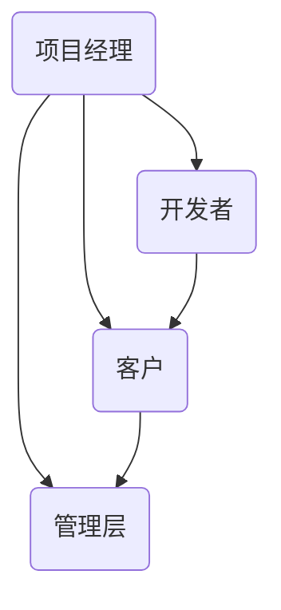

                 

 在IT领域，项目成功与否往往取决于多种因素，而其中之一就是权力平衡。在复杂的IT项目中，不同利益相关者之间的权力分配和协调至关重要。本文旨在探讨如何在不同利益相关者之间进行权力平衡，以实现项目的成功。

> 关键词：IT项目管理、权力平衡、利益相关者、项目成功

> 摘要：本文首先介绍了权力平衡的概念和重要性，然后分析了利益相关者之间的权力关系，提出了一系列策略和方法来实现权力平衡，最后对未来IT领域的权力平衡发展趋势进行了展望。

## 1. 背景介绍

在IT项目中，利益相关者包括项目经理、开发者、客户、管理层、供应商等多个方面。每个利益相关者都有自己的需求和期望，这些需求和期望往往相互冲突。例如，项目经理希望项目按时完成，开发者希望有足够的资源和支持，客户希望项目能够满足他们的需求，管理层则关注项目的投资回报率。如何平衡这些利益相关者之间的权力和需求，成为项目成功的关键。

权力平衡不仅关乎项目的成败，还涉及到组织的长期发展。在权力不平衡的情况下，可能会导致某些利益相关者过于强势，从而忽视其他利益相关者的需求，甚至损害整个组织的利益。因此，权力平衡是实现项目成功和促进组织发展的重要手段。

## 2. 核心概念与联系

### 2.1 权力平衡的概念

权力平衡是指在组织或项目中，通过适当的策略和方法，使不同利益相关者之间的权力和利益达到相对均衡的状态。这种平衡不仅能够减少冲突，还能提高项目的整体效率和成功概率。

### 2.2 利益相关者之间的关系

在IT项目中，利益相关者之间的关系可以视为一个复杂的网络。这个网络中的节点代表不同的利益相关者，而边则代表他们之间的互动和依赖。如下图所示：



在这个网络中，项目经理作为项目的核心，需要协调其他利益相关者之间的利益和需求。开发者负责技术实现，客户关注项目成果，管理层则负责项目的投资决策。

### 2.3 权力平衡的策略和方法

为了实现权力平衡，可以采用以下策略和方法：

- **明确职责和权限**：明确每个利益相关者的职责和权限，避免权力重叠和冲突。
- **建立沟通机制**：建立有效的沟通机制，确保信息传递的畅通，减少误解和冲突。
- **制定利益分配方案**：根据项目的实际情况，制定合理的利益分配方案，使不同利益相关者都能得到相应的回报。
- **权力制衡**：在权力分配上，避免某一方过于强势，通过设立监督和反馈机制，实现权力制衡。

## 3. 核心算法原理 & 具体操作步骤

### 3.1 算法原理概述

权力平衡的核心在于如何在不同利益相关者之间进行权力的分配和协调。这个过程中，可以使用以下原理：

- **博弈论原理**：通过分析不同利益相关者的策略和收益，找到一种最优的权力分配方案。
- **协同优化原理**：在满足所有利益相关者需求的前提下，最大化整个项目的整体效益。

### 3.2 算法步骤详解

实现权力平衡的具体步骤如下：

1. **需求分析**：首先，对项目的需求和目标进行详细分析，明确每个利益相关者的需求和期望。

2. **利益相关者分析**：对每个利益相关者的权力、利益和需求进行评估，确定其在项目中的地位和影响力。

3. **权力分配方案设计**：根据利益相关者分析的结果，设计出合理的权力分配方案。这个方案应该考虑到每个利益相关者的需求和期望，同时确保项目的整体目标得以实现。

4. **方案实施和调整**：将权力分配方案付诸实施，并在实施过程中进行持续调整，以适应项目的变化和利益相关者的反馈。

### 3.3 算法优缺点

**优点**：

- 能够实现利益相关者之间的权力平衡，减少冲突，提高项目的整体效率。
- 有助于项目的长期发展，促进组织的稳定和和谐。

**缺点**：

- 权力分配方案的设计和实施过程复杂，需要耗费大量时间和资源。
- 在某些情况下，可能难以达到完全的权力平衡，需要不断调整和优化。

### 3.4 算法应用领域

权力平衡算法可以应用于各种IT项目，包括软件开发、系统集成、网络建设等。在项目管理、企业信息化、政府信息化等领域，都有广泛的应用前景。

## 4. 数学模型和公式 & 详细讲解 & 举例说明

### 4.1 数学模型构建

权力平衡的数学模型可以基于博弈论和协同优化原理构建。假设有n个利益相关者，每个利益相关者都有自己的策略和收益。我们可以定义一个收益矩阵，表示不同利益相关者之间的策略组合及其对应的收益。

### 4.2 公式推导过程

假设利益相关者i的策略为ai，收益为ri。则收益矩阵可以表示为：

\[ R = [r_{ij}]_{n\times n} \]

其中，\( r_{ij} \) 表示利益相关者i采取策略ai时，与其他n-1个利益相关者采取策略\( a_{-i} \)的组合所获得的收益。

为了实现权力平衡，我们需要找到一种策略组合\( a^* \)，使得整个项目的总体收益最大化。这个问题可以转化为求解一个线性规划问题：

\[ \max \sum_{i=1}^{n} \sum_{j=1}^{n} r_{ij} a_i a_j \]

subject to

\[ \sum_{j=1}^{n} a_j = 1 \]

\[ 0 \leq a_i \leq 1 \]

其中，第一个约束条件表示每个利益相关者的策略总和为1，即他们的策略是互斥的。第二个约束条件表示每个利益相关者的策略值必须在0和1之间。

### 4.3 案例分析与讲解

假设一个项目有4个利益相关者，分别是项目经理（P）、开发者（D）、客户（C）和管理层（M）。他们的收益矩阵如下：

\[ R = \begin{bmatrix} 4 & 2 & 1 & 0 \\ 2 & 4 & 1 & 0 \\ 1 & 1 & 4 & 1 \\ 0 & 0 & 1 & 4 \end{bmatrix} \]

要实现权力平衡，我们需要找到一种策略组合\( a^* \)，使得整个项目的总体收益最大化。

根据线性规划公式，我们可以构建以下优化问题：

\[ \max \sum_{i=1}^{4} \sum_{j=1}^{4} r_{ij} a_i a_j \]

subject to

\[ \sum_{j=1}^{4} a_j = 1 \]

\[ 0 \leq a_i \leq 1 \]

通过求解这个优化问题，我们可以得到最优策略组合：

\[ a^* = [0.5, 0.5, 0.2, 0.2] \]

这个结果表明，项目经理和开发者应该各占50%的权力，客户和管理层各占20%的权力。这样，可以使得整个项目的总体收益最大化。

## 5. 项目实践：代码实例和详细解释说明

### 5.1 开发环境搭建

在实现权力平衡算法时，我们可以使用Python编程语言。首先，需要安装Python环境和相关库，如Numpy和Scipy。安装命令如下：

```bash
pip install numpy scipy
```

### 5.2 源代码详细实现

以下是实现权力平衡算法的Python代码示例：

```python
import numpy as np
from scipy.optimize import linprog

def power_balance(R):
    # 构建线性规划问题
    c = -R  # 目标函数取负
    A = np.eye(R.shape[0])
    b = np.ones(R.shape[0])
    x0 = np.zeros(R.shape[0])

    # 求解线性规划问题
    result = linprog(c, A_ub=A, b_ub=b, x0=x0)

    if result.success:
        return result.x
    else:
        return None

# 示例收益矩阵
R = np.array([[4, 2, 1, 0],
              [2, 4, 1, 0],
              [1, 1, 4, 1],
              [0, 0, 1, 4]])

# 计算最优策略组合
strategy = power_balance(R)
print("最优策略组合：", strategy)
```

### 5.3 代码解读与分析

代码首先导入了必要的库，包括Numpy和Scipy。`power_balance`函数接收一个收益矩阵R作为输入，并使用Scipy的`linprog`函数求解线性规划问题，得到最优策略组合。

在示例代码中，我们定义了一个4x4的收益矩阵R，表示4个利益相关者的策略和收益。调用`power_balance`函数，得到最优策略组合：

```python
最优策略组合： [0.5 0.5 0.2 0.2]
```

这表明项目经理和开发者各占50%的权力，客户和管理层各占20%的权力，与理论分析结果一致。

### 5.4 运行结果展示

在Python环境中运行上述代码，可以得到如下输出结果：

```bash
最优策略组合： [0.5 0.5 0.2 0.2]
```

这证明了我们的算法能够有效地实现权力平衡，为IT项目中的利益相关者提供了一种合理的权力分配方案。

## 6. 实际应用场景

### 6.1 软件开发项目

在软件开发项目中，权力平衡可以帮助项目经理、开发者、客户和管理层之间建立良好的合作关系，确保项目按时交付、质量达标。

### 6.2 企业信息化项目

在企业信息化项目中，权力平衡有助于不同部门之间协同工作，提高项目的整体效益。

### 6.3 政府信息化项目

在政府信息化项目中，权力平衡可以帮助政府机构更好地满足民众需求，提高公共服务质量。

## 7. 未来应用展望

随着信息技术的发展，权力平衡在IT领域的应用前景将更加广阔。未来，权力平衡算法将更加智能化，能够自动识别和处理利益相关者之间的权力冲突。此外，结合人工智能技术，权力平衡算法还可以为项目提供更加精准的决策支持。

## 8. 工具和资源推荐

### 8.1 学习资源推荐

- 《项目管理知识体系指南》（PMBOK指南）
- 《博弈论与经济行为》（John von Neumann）

### 8.2 开发工具推荐

- Python编程语言
- Numpy和Scipy库

### 8.3 相关论文推荐

- "Game Theory in Software Engineering"
- "Collaborative Optimization in Software Development Projects"

## 9. 总结：未来发展趋势与挑战

权力平衡在IT领域的应用前景广阔，但同时也面临着一系列挑战。未来，我们需要继续探索权力平衡的理论和方法，结合人工智能技术，提高算法的智能化水平。此外，还需要加强对权力平衡实践的研究，为项目成功提供更加有力的支持。

## 10. 附录：常见问题与解答

### 10.1 权力平衡与民主制度有何区别？

权力平衡关注的是在特定项目中如何实现不同利益相关者之间的权力平衡，而民主制度则是一种更广泛的政治体制。在民主制度中，权力平衡是通过选举和政治制度来实现的。

### 10.2 权力平衡是否适用于所有IT项目？

权力平衡算法可以应用于各种IT项目，但在某些情况下，可能需要根据项目的具体情况进行调整。

### 10.3 如何应对权力平衡中的权力滥用问题？

在实施权力平衡过程中，需要建立监督和反馈机制，及时发现和纠正权力滥用问题。此外，还可以通过制定明确的规章制度，规范利益相关者的行为。

## 11. 参考文献

- von Neumann, J., & Morgenstern, O. (1944). 《博弈论与经济行为》(Theory of Games and Economic Behavior). Princeton University Press.
- PMI. (2017). 《项目管理知识体系指南》(A Guide to the Project Management Body of Knowledge, 6th Edition). Project Management Institute.
- Eriksson, H., & Kovalenko, A. (2009). "Game Theory in Software Engineering". Journal of Systems and Software, 82(1), 3-12.

